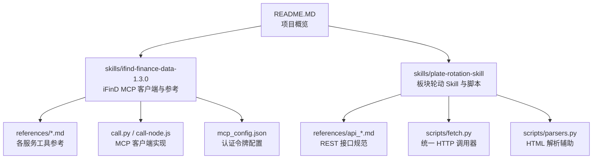
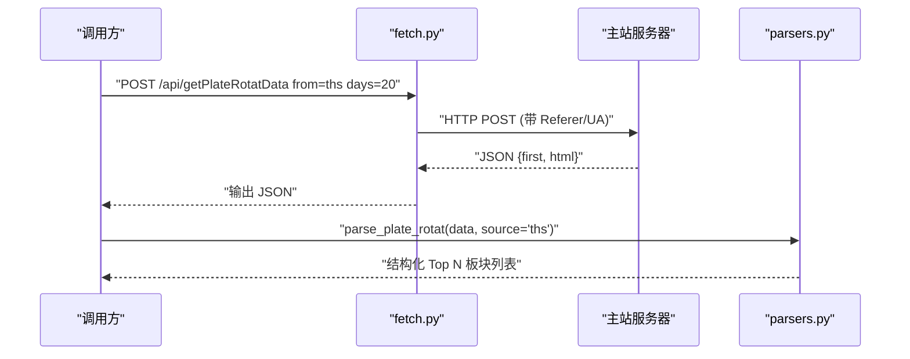
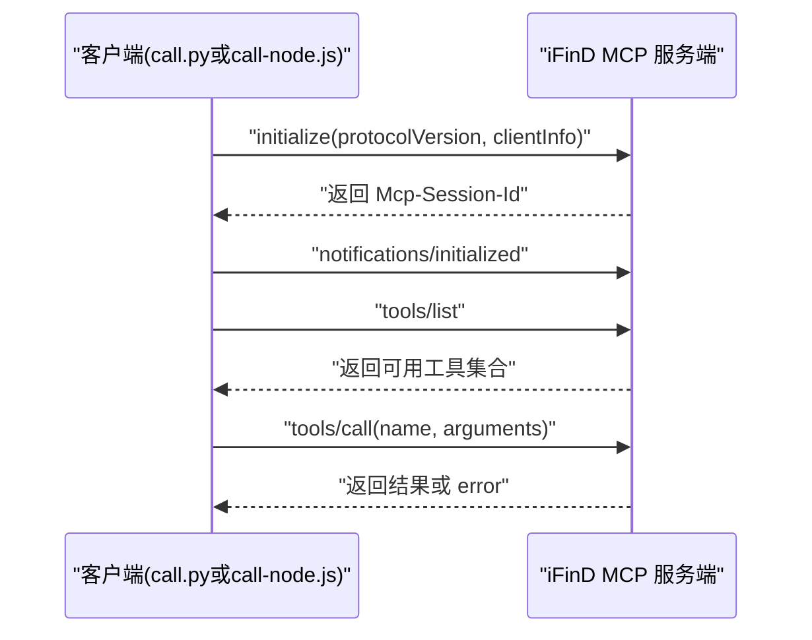
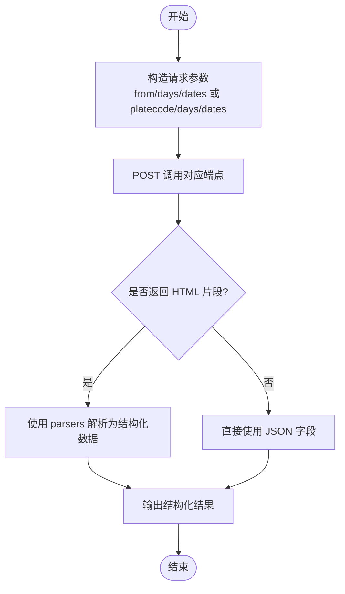
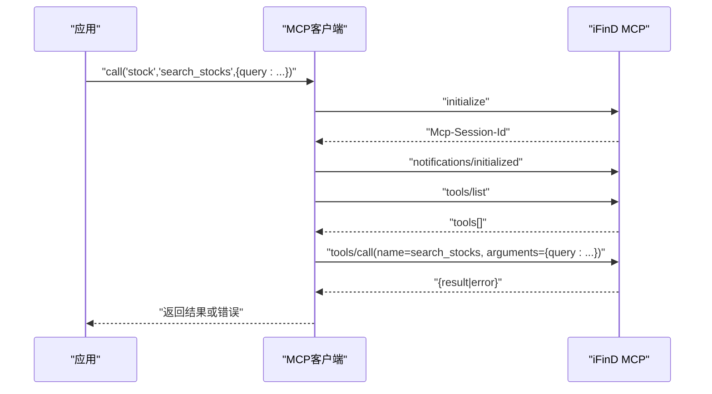
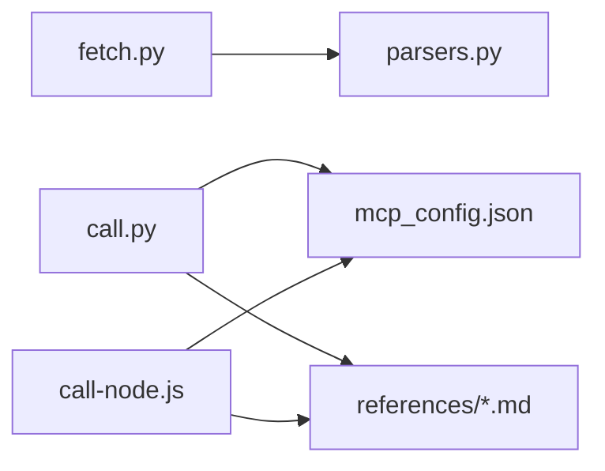

# API参考手册

<cite>
**本文引用的文件**
- [README.MD](file://README.MD)
- [api_getplaterotatdata.md](file://skills/plate-rotation-skill/references/api_getplaterotatdata.md)
- [api_getlongbyplate.md](file://skills/plate-rotation-skill/references/api_getlongbyplate.md)
- [api_getplaterotatchart.md](file://skills/plate-rotation-skill/references/api_getplaterotatchart.md)
- [api_getplatedaychart.md](file://skills/plate-rotation-skill/references/api_getplatedaychart.md)
- [cn_stock.md](file://skills/ifind-finance-data-1.3.0/references/cn_stock.md)
- [fund.md](file://skills/ifind-finance-data-1.3.0/references/fund.md)
- [edb.md](file://skills/ifind-finance-data-1.3.0/references/edb.md)
- [index.md](file://skills/ifind-finance-data-1.3.0/references/index.md)
- [news_notices.md](file://skills/ifind-finance-data-1.3.0/references/news_notices.md)
- [mcp_config.json](file://skills/ifind-finance-data-1.3.0/mcp_config.json)
- [call.py](file://skills/ifind-finance-data-1.3.0/call.py)
- [call-node.js](file://skills/ifind-finance-data-1.3.0/call-node.js)
- [fetch.py](file://skills/plate-rotation-skill/scripts/fetch.py)
- [parsers.py](file://skills/plate-rotation-skill/scripts/parsers.py)
</cite>

## 目录
1. [简介](#简介)
2. [项目结构](#项目结构)
3. [核心组件](#核心组件)
4. [架构总览](#架构总览)
5. [详细组件分析](#详细组件分析)
6. [依赖关系分析](#依赖关系分析)
7. [性能与可用性](#性能与可用性)
8. [故障排查指南](#故障排查指南)
9. [结论](#结论)
10. [附录](#附录)

## 简介
本手册面向开发者与数据使用者，系统化梳理本仓库中的两类接口能力：
- RESTful 板块轮动分析接口：提供“今日最强板块、按板块龙头股、板块轮动图表、板块日线图表”四大端点。
- MCP 协议 iFinD 金融数据接口：通过 JSON-RPC 2.0 调用同花顺 iFinD 的 stock、fund、edb、index、news 等工具集，覆盖股票、基金、宏观指标、指数与新闻公告等数据源。

文档包含请求方法、URL 模式、参数说明、响应结构、错误码与状态码含义、调用示例与最佳实践，并给出速率限制与安全建议。

## 项目结构
本项目以 Skills 为数据能力边界，配合策略与手册形成“认知—取数—决策”闭环。

图示来源
- [README.MD:1-79](file://README.MD#L1-L79)
- [call.py:1-208](file://skills/ifind-finance-data-1.3.0/call.py#L1-L208)
- [call-node.js:1-267](file://skills/ifind-finance-data-1.3.0/call-node.js#L1-L267)
- [mcp_config.json:1-3](file://skills/ifind-finance-data-1.3.0/mcp_config.json#L1-L3)
- [fetch.py:1-230](file://skills/plate-rotation-skill/scripts/fetch.py#L1-L230)
- [parsers.py:1-212](file://skills/plate-rotation-skill/scripts/parsers.py#L1-L212)

章节来源
- [README.MD:1-79](file://README.MD#L1-L79)

## 核心组件
- 板块轮动 REST 接口（POST）
  - 获取今日最强板块：/api/getPlateRotatData
  - 按板块获取龙头股：/api/getLongByPlate
  - 获取板块轮动图表数据：/api/getPlateRotatChart
  - 获取板块日线图表数据：/api/getPlateDayChart
- iFinD MCP 客户端
  - Python 客户端：call.py
  - Node.js 客户端：call-node.js
  - 配置：mcp_config.json（auth_token）
  - 工具集参考：stock、fund、edb、index、news 等

章节来源
- [api_getplaterotatdata.md:1-74](file://skills/plate-rotation-skill/references/api_getplaterotatdata.md#L1-L74)
- [api_getlongbyplate.md:1-65](file://skills/plate-rotation-skill/references/api_getlongbyplate.md#L1-L65)
- [api_getplaterotatchart.md:1-53](file://skills/plate-rotation-skill/references/api_getplaterotatchart.md#L1-L53)
- [api_getplatedaychart.md:1-48](file://skills/plate-rotation-skill/references/api_getplatedaychart.md#L1-L48)
- [call.py:1-208](file://skills/ifind-finance-data-1.3.0/call.py#L1-L208)
- [call-node.js:1-267](file://skills/ifind-finance-data-1.3.0/call-node.js#L1-L267)
- [mcp_config.json:1-3](file://skills/ifind-finance-data-1.3.0/mcp_config.json#L1-L3)

## 架构总览
板块轮动 REST 与 iFinD MCP 两条链路并行：
- 板块轮动：HTTP 客户端 fetch.py 负责构造请求、重试与缓存；parsers.py 对 HTML 片段进行结构化解析。
- iFinD MCP：客户端先 initialize 建立会话，再 tools/list 发现工具，最后 tools/call 执行具体查询。

图示来源
- [fetch.py:128-230](file://skills/plate-rotation-skill/scripts/fetch.py#L128-L230)
- [parsers.py:20-66](file://skills/plate-rotation-skill/scripts/parsers.py#L20-L66)

图示来源
- [call.py:85-171](file://skills/ifind-finance-data-1.3.0/call.py#L85-L171)
- [call-node.js:149-210](file://skills/ifind-finance-data-1.3.0/call-node.js#L149-L210)

## 详细组件分析

### 板块轮动 REST 接口

#### 通用约定
- 所有端点均为 POST 方法，Host 为 main。
- 输入参数支持键值对或 JSON 体（由上层调用器决定）。
- 部分响应为“HTML 片段嵌入 JSON”，需二次解析。

章节来源
- [api_getplaterotatdata.md:1-74](file://skills/plate-rotation-skill/references/api_getplaterotatdata.md#L1-L74)
- [api_getlongbyplate.md:1-65](file://skills/plate-rotation-skill/references/api_getlongbyplate.md#L1-L65)
- [api_getplaterotatchart.md:1-53](file://skills/plate-rotation-skill/references/api_getplaterotatchart.md#L1-L53)
- [api_getplatedaychart.md:1-48](file://skills/plate-rotation-skill/references/api_getplatedaychart.md#L1-L48)

#### 1) 获取今日最强板块
- 方法：POST
- URL：/api/getPlateRotatData
- 认证：无显式鉴权（Referer 校验由后端处理）
- 请求参数
  - from: string，必选。取值 ths（同花顺）、kaipan（开盘啦）
  - days: int，必选。回溯天数，如 10/20/30/50
  - dates: string，可选。自定义日期（YYYY-MM-DD，逗号分隔），为空则按 days 回溯
- 响应字段
  - first: string，当日 Top1 板块代码
  - html: string，HTML 片段，用于前端渲染或解析
- 语义说明
  - from=ths：数值字段为“板块涨幅 %”（带%符号）
  - from=kaipan：数值字段为“板块强度分”（纯整数）
  - 板块代码前缀：88x 为同花顺，80x/803x 为开盘啦
- 解析建议
  - 使用 parsers.parse_plate_rotat(data, source='ths'|'kaipan') 得到结构化列表
  - 使用 parse_plate_rotat_dates(data) 提取日期序列
- 调用示例路径
  - [fetch.py:128-230](file://skills/plate-rotation-skill/scripts/fetch.py#L128-L230)
  - [parsers.py:20-66](file://skills/plate-rotation-skill/scripts/parsers.py#L20-L66)

章节来源
- [api_getplaterotatdata.md:1-74](file://skills/plate-rotation-skill/references/api_getplaterotatdata.md#L1-L74)
- [parsers.py:20-109](file://skills/plate-rotation-skill/scripts/parsers.py#L20-L109)

#### 2) 按板块获取龙头股
- 方法：POST
- URL：/api/getLongByPlate
- 认证：无显式鉴权
- 请求参数
  - platecode: string，必选。板块代码（如 886084），可从 getPlateRotatData.first 获取
  - days: int，必选。回溯天数
  - dates: string，可选。自定义日期
- 响应字段
  - html: string，HTML 片段，顶层为 table，td 代表一天，内含若干 kline div 表示龙头
- 解析建议
  - 使用 parse_plate_long_heads(data, dates) 得到每日龙头清单
  - 使用 rank_plate_long_persistence(data, dates, top_n=15) 统计跨天频次 Top 15
- 调用示例路径
  - [parsers.py:113-175](file://skills/plate-rotation-skill/scripts/parsers.py#L113-L175)

章节来源
- [api_getlongbyplate.md:1-65](file://skills/plate-rotation-skill/references/api_getlongbyplate.md#L1-L65)
- [parsers.py:113-175](file://skills/plate-rotation-skill/scripts/parsers.py#L113-L175)

#### 3) 获取板块轮动图表数据
- 方法：POST
- URL：/api/getPlateRotatChart
- 认证：无显式鉴权
- 请求参数
  - from: string，必选。ths 或 kaipan
  - days: int，必选。回溯天数
  - dates: string，可选。自定义日期
- 响应字段
  - date: list，日期数组（最近N日）
  - legend: list，Top5 板块名（含上榜次数）
  - name: object，编号到名称映射
  - value/symbol: 每个时间点的排名与图标标识
- 用途
  - ECharts 可视化 Top5 板块 N 日排名变化

章节来源
- [api_getplaterotatchart.md:1-53](file://skills/plate-rotation-skill/references/api_getplaterotatchart.md#L1-L53)

#### 4) 获取板块日线图表数据
- 方法：POST
- URL：/api/getPlateDayChart
- 认证：无显式鉴权
- 请求参数
  - platecode: string，必选。板块代码
  - days: int，必选。回溯天数
  - dates: string，可选。自定义日期
- 响应字段
  - legend: null 或对象（未活跃时为 null）
  - date: list，日期数组
- 用途
  - 与 getLongByPlate 配套，返回该板块 N 日强度+量能时序

章节来源
- [api_getplatedaychart.md:1-48](file://skills/plate-rotation-skill/references/api_getplatedaychart.md#L1-L48)

#### 板块轮动接口流程图

图示来源
- [fetch.py:128-230](file://skills/plate-rotation-skill/scripts/fetch.py#L128-L230)
- [parsers.py:20-175](file://skills/plate-rotation-skill/scripts/parsers.py#L20-L175)

### iFinD 金融数据 MCP 接口

#### 协议与认证
- 协议：JSON-RPC 2.0
- 认证：Authorization 头携带 auth_token（从 mcp_config.json 读取）
- 会话：initialize 后返回 Mcp-Session-Id，后续请求携带该会话 ID
- 工具发现：tools/list 返回当前 server_type 下可用的工具名集合
- 工具调用：tools/call(name, arguments)

章节来源
- [call.py:85-171](file://skills/ifind-finance-data-1.3.0/call.py#L85-L171)
- [call-node.js:149-210](file://skills/ifind-finance-data-1.3.0/call-node.js#L149-L210)
- [mcp_config.json:1-3](file://skills/ifind-finance-data-1.3.0/mcp_config.json#L1-L3)

#### 客户端实现要点
- 参数校验：禁止危险键、非有限浮点数、不支持类型等
- 超时控制：默认 60s，initialize 30s，通知 10s
- 错误处理：当响应包含 error 字段时，返回 ok=false 及原始错误信息
- 工具白名单：首次加载 tools/list 后缓存允许的工具名集合

章节来源
- [call.py:59-83](file://skills/ifind-finance-data-1.3.0/call.py#L59-L83)
- [call.py:119-171](file://skills/ifind-finance-data-1.3.0/call.py#L119-L171)
- [call-node.js:81-115](file://skills/ifind-finance-data-1.3.0/call-node.js#L81-L115)
- [call-node.js:117-147](file://skills/ifind-finance-data-1.3.0/call-node.js#L117-L147)

#### 工具集与服务参考

- 股票服务（server_type="stock"）
  - 典型工具：search_stocks、get_stock_summary、get_stock_info、get_stock_performance、get_stock_shareholders、get_stock_financials、get_risk_indicators、get_stock_events、get_esg_data、stock_highfreq_quotes
  - 高频行情：支持 real_time 与 highfreq（interval 分钟级）
  - 参考路径
    - [cn_stock.md:1-67](file://skills/ifind-finance-data-1.3.0/references/cn_stock.md#L1-L67)

- 基金服务（server_type="fund"）
  - 典型工具：search_funds、get_fund_profile、get_fund_market_performance、get_fund_ownership、get_fund_portfolio、get_fund_financials、get_fund_company_info、fund_highfreq_quotes
  - 参考路径
    - [fund.md:1-55](file://skills/ifind-finance-data-1.3.0/references/fund.md#L1-L55)

- 宏观经济/行业经济指标（server_type="edb"）
  - 典型工具：search_edb、get_edb_data
  - 参考路径
    - [edb.md:1-41](file://skills/ifind-finance-data-1.3.0/references/edb.md#L1-L41)

- 指数/板块（server_type="index"）
  - 典型工具：index_data、sector_data、index_highfreq_quotes
  - 参考路径
    - [index.md:1-63](file://skills/ifind-finance-data-1.3.0/references/index.md#L1-L63)

- 新闻公告（server_type="news"）
  - 典型工具：search_news、search_notice、search_trending_news
  - 参考路径
    - [news_notices.md:1-70](file://skills/ifind-finance-data-1.3.0/references/news_notices.md#L1-L70)

#### MCP 调用序列图

图示来源
- [call.py:85-171](file://skills/ifind-finance-data-1.3.0/call.py#L85-L171)
- [call-node.js:149-210](file://skills/ifind-finance-data-1.3.0/call-node.js#L149-L210)

## 依赖关系分析
- 板块轮动
  - fetch.py 作为统一入口，负责 host 解析、参数拼装、重试与缓存
  - parsers.py 专注 HTML 片段的结构化抽取
- iFinD MCP
  - call.py 与 call-node.js 分别实现 Python 与 Node.js 客户端
  - mcp_config.json 提供认证令牌
  - references/*.md 描述各服务工具的能力与用法

图示来源
- [fetch.py:1-230](file://skills/plate-rotation-skill/scripts/fetch.py#L1-L230)
- [parsers.py:1-212](file://skills/plate-rotation-skill/scripts/parsers.py#L1-L212)
- [call.py:1-208](file://skills/ifind-finance-data-1.3.0/call.py#L1-L208)
- [call-node.js:1-267](file://skills/ifind-finance-data-1.3.0/call-node.js#L1-L267)
- [mcp_config.json:1-3](file://skills/ifind-finance-data-1.3.0/mcp_config.json#L1-L3)

章节来源
- [fetch.py:1-230](file://skills/plate-rotation-skill/scripts/fetch.py#L1-L230)
- [parsers.py:1-212](file://skills/plate-rotation-skill/scripts/parsers.py#L1-L212)
- [call.py:1-208](file://skills/ifind-finance-data-1.3.0/call.py#L1-L208)
- [call-node.js:1-267](file://skills/ifind-finance-data-1.3.0/call-node.js#L1-L267)
- [mcp_config.json:1-3](file://skills/ifind-finance-data-1.3.0/mcp_config.json#L1-L3)

## 性能与可用性
- 板块轮动
  - 自动重试：针对 429/5xx 与网络异常采用指数退避（最多 3 次，间隔 1s/2s/4s）
  - 本地缓存：POST 请求默认落盘缓存，TTL 可配置（默认 1h），可通过 --no-cache 关闭
  - 超时：默认 15s，可按需调整
- iFinD MCP
  - 初始化与工具列表缓存：避免重复 discovery 开销
  - 超时：默认 60s，initialize 30s，通知 10s
- 速率限制
  - 若上游返回 429，客户端将自动退避重试；建议在上层增加限流与队列控制
- 安全考虑
  - 仅通过 Authorization 头传递 token，勿在日志中打印完整 token
  - 参数校验拒绝危险键与非法类型，防止注入风险

章节来源
- [fetch.py:47-51](file://skills/plate-rotation-skill/scripts/fetch.py#L47-L51)
- [fetch.py:159-212](file://skills/plate-rotation-skill/scripts/fetch.py#L159-L212)
- [call.py:59-83](file://skills/ifind-finance-data-1.3.0/call.py#L59-L83)
- [call.py:85-171](file://skills/ifind-finance-data-1.3.0/call.py#L85-L171)
- [call-node.js:81-115](file://skills/ifind-finance-data-1.3.0/call-node.js#L81-L115)
- [call-node.js:149-210](file://skills/ifind-finance-data-1.3.0/call-node.js#L149-L210)

## 故障排查指南
- 板块轮动
  - 现象：返回空或解析失败
    - 检查 from 与 platecode 是否匹配数据源前缀（88x vs 80x/803x）
    - 确认 days/dates 是否与交易日一致（节假日可能无数据）
    - 查看 stderr 是否有 PR-EMPTY 警告
  - 现象：网络错误/超时
    - 启用 --verbose 查看 URL 与 body
    - 调整 --timeout 与 --max-retries
- iFinD MCP
  - 现象：initialize 成功但未返回会话 ID
    - 检查 Authorization 是否正确，服务端是否返回 Mcp-Session-Id
  - 现象：toolName not allowed
    - 先调用 tools/list 确认工具名，确保传入的 tool_name 在白名单内
  - 现象：参数校验失败
    - 检查是否为 JSON 对象、是否包含被禁用的键、是否存在非有限浮点数或不支持的类型

章节来源
- [parsers.py:178-212](file://skills/plate-rotation-skill/scripts/parsers.py#L178-L212)
- [fetch.py:128-230](file://skills/plate-rotation-skill/scripts/fetch.py#L128-L230)
- [call.py:137-171](file://skills/ifind-finance-data-1.3.0/call.py#L137-L171)
- [call-node.js:178-210](file://skills/ifind-finance-data-1.3.0/call-node.js#L178-L210)

## 结论
本仓库提供了两套互补的数据能力：
- 板块轮动 REST 接口聚焦 A 股热点主线识别与龙头追踪，结合双源交叉验证与 HTML 解析，适合快速复盘与可视化。
- iFinD MCP 接口覆盖股票、基金、宏观、指数与新闻公告等多维数据，通过 JSON-RPC 2.0 标准化交互，便于集成与扩展。

建议在生产环境结合缓存、重试与限流策略，严格管理认证令牌，并在上层做好错误分类与告警。

## 附录

### 板块轮动接口速查表
- 获取今日最强板块
  - 方法：POST
  - URL：/api/getPlateRotatData
  - 参数：from, days, dates
  - 响应：first, html
  - 解析：parse_plate_rotat / parse_plate_rotat_dates
- 按板块获取龙头股
  - 方法：POST
  - URL：/api/getLongByPlate
  - 参数：platecode, days, dates
  - 响应：html
  - 解析：parse_plate_long_heads / rank_plate_long_persistence
- 获取板块轮动图表数据
  - 方法：POST
  - URL：/api/getPlateRotatChart
  - 参数：from, days, dates
  - 响应：date, legend, name, value/symbol
- 获取板块日线图表数据
  - 方法：POST
  - URL：/api/getPlateDayChart
  - 参数：platecode, days, dates
  - 响应：legend, date

章节来源
- [api_getplaterotatdata.md:1-74](file://skills/plate-rotation-skill/references/api_getplaterotatdata.md#L1-L74)
- [api_getlongbyplate.md:1-65](file://skills/plate-rotation-skill/references/api_getlongbyplate.md#L1-L65)
- [api_getplaterotatchart.md:1-53](file://skills/plate-rotation-skill/references/api_getplaterotatchart.md#L1-L53)
- [api_getplatedaychart.md:1-48](file://skills/plate-rotation-skill/references/api_getplatedaychart.md#L1-L48)
- [parsers.py:20-175](file://skills/plate-rotation-skill/scripts/parsers.py#L20-L175)

### iFinD MCP 工具集速查表
- stock：search_stocks、get_stock_summary、get_stock_info、get_stock_performance、get_stock_shareholders、get_stock_financials、get_risk_indicators、get_stock_events、get_esg_data、stock_highfreq_quotes
- fund：search_funds、get_fund_profile、get_fund_market_performance、get_fund_ownership、get_fund_portfolio、get_fund_financials、get_fund_company_info、fund_highfreq_quotes
- edb：search_edb、get_edb_data
- index：index_data、sector_data、index_highfreq_quotes
- news：search_news、search_notice、search_trending_news

章节来源
- [cn_stock.md:1-67](file://skills/ifind-finance-data-1.3.0/references/cn_stock.md#L1-L67)
- [fund.md:1-55](file://skills/ifind-finance-data-1.3.0/references/fund.md#L1-L55)
- [edb.md:1-41](file://skills/ifind-finance-data-1.3.0/references/edb.md#L1-L41)
- [index.md:1-63](file://skills/ifind-finance-data-1.3.0/references/index.md#L1-L63)
- [news_notices.md:1-70](file://skills/ifind-finance-data-1.3.0/references/news_notices.md#L1-L70)