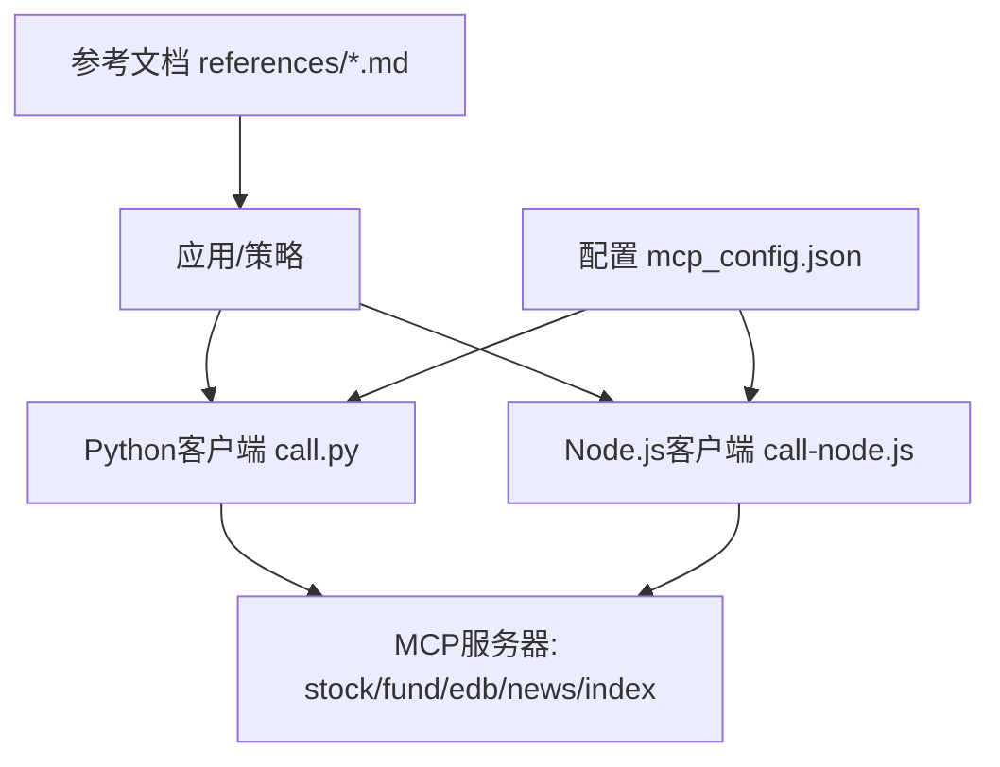
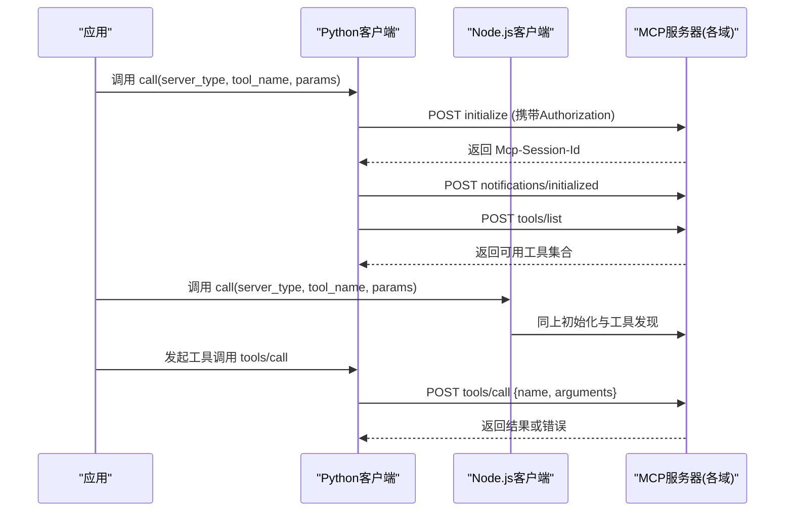
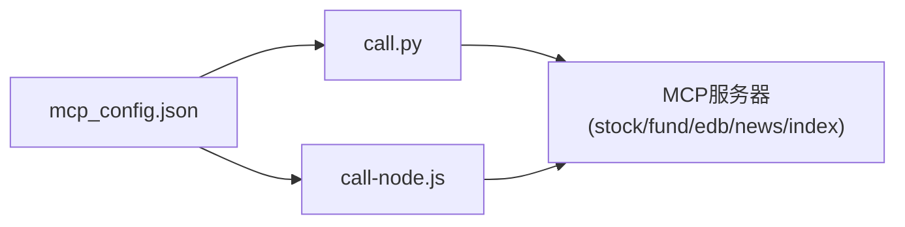

# iFinD金融数据API

<cite>
**本文引用的文件**   
- [mcp_config.json](file://skills/ifind-finance-data-1.3.0/mcp_config.json)
- [call.py](file://skills/ifind-finance-data-1.3.0/call.py)
- [call-node.js](file://skills/ifind-finance-data-1.3.0/call-node.js)
- [cn_stock.md](file://skills/ifind-finance-data-1.3.0/references/cn_stock.md)
- [fund.md](file://skills/ifind-finance-data-1.3.0/references/fund.md)
- [edb.md](file://skills/ifind-finance-data-1.3.0/references/edb.md)
- [index.md](file://skills/ifind-finance-data-1.3.0/references/index.md)
- [news_notices.md](file://skills/ifind-finance-data-1.3.0/references/news_notices.md)
- [README.MD](file://README.MD)
</cite>

## 目录
1. [简介](#简介)
2. [项目结构](#项目结构)
3. [核心组件](#核心组件)
4. [架构总览](#架构总览)
5. [详细组件分析](#详细组件分析)
6. [依赖关系分析](#依赖关系分析)
7. [性能与最佳实践](#性能与最佳实践)
8. [故障排查指南](#故障排查指南)
9. [结论](#结论)
10. [附录：接口规范与示例](#附录接口规范与示例)

## 简介
本文件为iFinD金融数据MCP接口的完整技术文档，覆盖五大类数据服务：中国股票行情数据（cn_stock）、基金数据（fund）、经济数据库（edb）、指数数据（index）、新闻公告（news_notices）。文档基于仓库内现有实现与参考说明整理，包含MCP协议调用方式、认证配置、请求消息格式、响应数据结构、查询参数与过滤条件、时间范围设置、字段说明、Python与JavaScript客户端调用示例、错误处理与重试机制建议，以及性能优化与最佳实践。

## 项目结构
该仓库采用“Skills + References”的组织方式：
- Skills层提供MCP客户端封装与工具列表发现能力（Python与Node.js）
- References层按数据域给出工具清单、典型参数与调用示例
- 根目录README对整体系统定位与模块职责进行说明

图表来源
- [call.py:1-208](file://skills/ifind-finance-data-1.3.0/call.py#L1-L208)
- [call-node.js:1-267](file://skills/ifind-finance-data-1.3.0/call-node.js#L1-L267)
- [mcp_config.json:1-3](file://skills/ifind-finance-data-1.3.0/mcp_config.json#L1-L3)
- [README.MD:1-81](file://README.MD#L1-L81)

章节来源
- [README.MD:1-81](file://README.MD#L1-L81)

## 核心组件
- MCP客户端封装（Python/Node.js）
  - 负责读取认证令牌、建立会话、动态发现可用工具、构造并发送JSON-RPC请求、解析响应与错误
- 配置中心
  - 集中管理认证令牌与服务端点映射
- 领域参考文档
  - 针对每个数据域列出可用工具、典型参数与示例

章节来源
- [call.py:1-208](file://skills/ifind-finance-data-1.3.0/call.py#L1-L208)
- [call-node.js:1-267](file://skills/ifind-finance-data-1.3.0/call-node.js#L1-L267)
- [mcp_config.json:1-3](file://skills/ifind-finance-data-1.3.0/mcp_config.json#L1-L3)

## 架构总览
iFinD通过MCP协议暴露工具集，客户端以JSON-RPC 2.0方式交互，流程包括初始化、工具列表发现、工具调用。服务端点根据server_type区分不同数据域。

图表来源
- [call.py:85-171](file://skills/ifind-finance-data-1.3.0/call.py#L85-L171)
- [call-node.js:149-220](file://skills/ifind-finance-data-1.3.0/call-node.js#L149-L220)

## 详细组件分析

### 认证与配置
- 认证令牌
  - 从配置文件读取auth_token，并通过HTTP头Authorization传递至服务端
- 服务端点
  - 通过BASE与SERVERS映射到具体MCP服务地址，支持stock、fund、edb、news、bond、global_stock、index等域
- 会话管理
  - 首次调用前执行initialize，获取Mcp-Session-Id并在后续请求中附带；随后发送notifications/initialized完成握手

章节来源
- [mcp_config.json:1-3](file://skills/ifind-finance-data-1.3.0/mcp_config.json#L1-L3)
- [call.py:6-18](file://skills/ifind-finance-data-1.3.0/call.py#L6-L18)
- [call-node.js:6-18](file://skills/ifind-finance-data-1.3.0/call-node.js#L6-L18)
- [call.py:85-116](file://skills/ifind-finance-data-1.3.0/call.py#L85-L116)
- [call-node.js:149-176](file://skills/ifind-finance-data-1.3.0/call-node.js#L149-L176)

### MCP协议与消息格式
- 协议版本
  - 客户端在initialize时声明protocolVersion
- 标准方法
  - initialize：建立会话
  - notifications/initialized：通知初始化完成
  - tools/list：发现当前服务可用的工具集合
  - tools/call：调用指定工具，传入arguments
- 请求体结构
  - jsonrpc: "2.0"
  - id: 自增请求ID
  - method: 上述方法名
  - params: 对应方法的参数对象
- 响应结构
  - 成功：包含result字段，其中tools/list返回tools数组，tools/call返回业务结果
  - 失败：包含error字段，同时HTTP状态码可能非2xx

章节来源
- [call.py:89-116](file://skills/ifind-finance-data-1.3.0/call.py#L89-L116)
- [call.py:174-203](file://skills/ifind-finance-data-1.3.0/call.py#L174-L203)
- [call-node.js:154-176](file://skills/ifind-finance-data-1.3.0/call-node.js#L154-L176)
- [call-node.js:222-256](file://skills/ifind-finance-data-1.3.0/call-node.js#L222-L256)

### 参数校验与安全
- 类型校验
  - 仅允许JSON对象作为顶层参数，禁止数组
  - 递归检查嵌套对象与数组元素，拒绝非法类型（如NaN/Infinity、函数、Symbol、BigInt、undefined等）
- 安全白名单
  - 阻止__proto__/prototype/constructor等危险键名注入
- 序列化校验
  - 尝试将参数序列化为JSON，确保可传输

章节来源
- [call.py:59-83](file://skills/ifind-finance-data-1.3.0/call.py#L59-L83)
- [call-node.js:81-115](file://skills/ifind-finance-data-1.3.0/call-node.js#L81-L115)

### 工具发现与调用
- 工具发现
  - 首次调用loadToolSet会触发tools/list，缓存工具名集合，避免重复网络请求
- 工具调用
  - 校验tool_name是否在允许集合中，构造tools/call请求并返回统一结果包装（ok、status_code、data/error/raw）

章节来源
- [call.py:119-171](file://skills/ifind-finance-data-1.3.0/call.py#L119-L171)
- [call-node.js:117-220](file://skills/ifind-finance-data-1.3.0/call-node.js#L117-L220)

### 五大类数据接口规范

#### 中国股票行情数据（server_type="stock"）
- 主要工具
  - search_stocks：智能选股，query为自然语言选股条件
  - get_stock_summary：股票信息摘要，query为“股票简称+查询内容”
  - get_stock_info：股票基本资料，query为“股票简称+指标名称+时间”
  - get_stock_performance：日频行情与技术指标，query为“股票简称+指标名称+时间”
  - get_stock_shareholders：股本结构与股东数据，query为“股票简称+指标”
  - get_stock_financials：财务数据与指标，query为“股票简称+财务指标+财报日期”
  - get_risk_indicators：风险定量指标，query为“股票+时间+指标”
  - get_stock_events：重大事件类指标，query为“股票+事件相关指标”
  - get_esg_data：ESG评级数据，query为“股票+ESG评级指标”
  - stock_highfreq_quotes：A股高频/实时快照，参数含symbols、indicators、data_mode、interval
- 典型用法
  - 自然语言选股、多主体合并查询、行业板块维度查询、1分钟高频行情与最新实时快照

章节来源
- [cn_stock.md:1-67](file://skills/ifind-finance-data-1.3.0/references/cn_stock.md#L1-L67)

#### 基金数据（server_type="fund"）
- 主要工具
  - search_funds：基金搜索，query为模糊基金名称或选基需求
  - get_fund_profile：基金基本资料，query为“基金名称+指标”
  - get_fund_market_performance：基金行情与业绩，query为“基金名称+时间范围+指标”
  - get_fund_ownership：基金份额与持有人，query为“基金名称+日期+指标”
  - get_fund_portfolio：基金持仓明细，query为“基金名称+日期+指标”
  - get_fund_financials：基金财务指标，query为“基金名称+日期+指标”
  - get_fund_company_info：基金公司信息，query为“基金名称+所属基金公司维度指标”
  - fund_highfreq_quotes：公募基金高频/实时快照，参数含symbols、indicators、data_mode
- 典型用法
  - 基金净值与收益率查询、份额与持仓披露期数据、1分钟高频行情与实时快照

章节来源
- [fund.md:1-55](file://skills/ifind-finance-data-1.3.0/references/fund.md#L1-L55)

#### 经济数据库（server_type="edb"）
- 主要工具
  - search_edb：指标搜索，query为行业/产品/指标描述
  - get_edb_data：指标数据查询，query为“指标名称+时间范围”
- 典型用法
  - 先搜索再取数，明确指标后拉取时间序列数据

章节来源
- [edb.md:1-41](file://skills/ifind-finance-data-1.3.0/references/edb.md#L1-L41)

#### 指数数据（server_type="index"）
- 主要工具
  - index_data：指数行情、技术指标与估值指标，query为“指数名称+时间+指标”
  - sector_data：板块行情、财务分析与成分股指标，query为“板块名称+时间+指标”
  - index_highfreq_quotes：指数高频/实时快照，参数含symbols、indicators、data_mode
- 典型用法
  - 指数涨跌幅与点数、板块成分股数量与平均涨跌幅、1分钟高频行情与实时快照

章节来源
- [index.md:1-63](file://skills/ifind-finance-data-1.3.0/references/index.md#L1-L63)

#### 新闻公告（server_type="news"）
- 主要工具
  - search_news：新闻资讯语义检索，参数含query、time_start、time_end、size
  - search_notice：公告语义检索，参数含query、time_start、time_end、size
  - search_trending_news：热点事件资讯查询，参数含keyword、industry_name、time_scope、size
- 注意事项
  - 内置语义检索，返回相关段落而非全文
  - 热点事件查询注重时效性，限制不宜过多，无结果时可放宽条件或改用资讯搜索
  - query可组合报告元数据与查询内容

章节来源
- [news_notices.md:1-70](file://skills/ifind-finance-data-1.3.0/references/news_notices.md#L1-L70)

### Python客户端调用示例
- 基础调用
  - 使用call(server_type, tool_name, params)发起工具调用
  - 使用list_tools(server_type)获取当前可用工具列表
- 示例路径
  - 股票智能选股、基金搜索、EDB指标查询、指数查询、新闻检索等均可参考各自references中的脚本示例

章节来源
- [cn_stock.md:16-36](file://skills/ifind-finance-data-1.3.0/references/cn_stock.md#L16-L36)
- [fund.md:14-34](file://skills/ifind-finance-data-1.3.0/references/fund.md#L14-L34)
- [edb.md:10-30](file://skills/ifind-finance-data-1.3.0/references/edb.md#L10-L30)
- [index.md:28-37](file://skills/ifind-finance-data-1.3.0/references/index.md#L28-L37)
- [news_notices.md:31-41](file://skills/ifind-finance-data-1.3.0/references/news_notices.md#L31-L41)

### JavaScript客户端调用示例
- 基础调用
  - 使用require('./call-node.js')引入call与listTools
  - 异步调用call(serverType, toolName, params)与listTools(serverType)
- 示例路径
  - 股票、基金、EDB、指数、新闻等域的示例均提供JS版本

章节来源
- [cn_stock.md:18-29](file://skills/ifind-finance-data-1.3.0/references/cn_stock.md#L18-L29)
- [fund.md:16-27](file://skills/ifind-finance-data-1.3.0/references/fund.md#L16-L27)
- [edb.md:12-23](file://skills/ifind-finance-data-1.3.0/references/edb.md#L12-L23)
- [index.md:11-26](file://skills/ifind-finance-data-1.3.0/references/index.md#L11-L26)
- [news_notices.md:15-29](file://skills/ifind-finance-data-1.3.0/references/news_notices.md#L15-L29)

## 依赖关系分析
- 客户端与配置
  - Python/Node客户端均读取mcp_config.json获取auth_token
- 客户端与服务端
  - 通过HTTPS POST与MCP服务器通信，headers中包含Authorization与Mcp-Session-Id
- 客户端内部依赖
  - 会话缓存、请求ID生成、工具集合缓存、参数校验器

图表来源
- [mcp_config.json:1-3](file://skills/ifind-finance-data-1.3.0/mcp_config.json#L1-L3)
- [call.py:6-18](file://skills/ifind-finance-data-1.3.0/call.py#L6-L18)
- [call-node.js:6-18](file://skills/ifind-finance-data-1.3.0/call-node.js#L6-L18)

章节来源
- [call.py:1-208](file://skills/ifind-finance-data-1.3.0/call.py#L1-L208)
- [call-node.js:1-267](file://skills/ifind-finance-data-1.3.0/call-node.js#L1-L267)

## 性能与最佳实践
- 连接与会话
  - 复用Mcp-Session-Id，避免每次请求都重新初始化
  - 工具集合缓存，减少tools/list的重复调用
- 超时与重试
  - 合理设置请求超时（默认60秒），初始化阶段较短超时（30/10秒）
  - 对瞬时错误（网络抖动、限流）实施指数退避重试
- 参数校验前置
  - 在本地完成参数合法性校验，降低无效请求带来的延迟与成本
- 批量与分页
  - 对于高频行情与历史数据，优先使用data_mode与interval控制粒度，避免一次性拉取过大窗口
- 并发与限流
  - 控制并发度，避免触发服务端限流；必要时加入队列与节流
- 日志与监控
  - 记录请求ID、耗时、状态码与错误信息，便于问题定位与容量规划

[本节为通用指导，不直接分析具体文件]

## 故障排查指南
- 认证失败
  - 检查mcp_config.json中的auth_token是否正确
  - 确认Authorization头是否随请求发送
- 会话异常
  - 若initialize未返回Mcp-Session-Id，需检查服务端响应与网络连通性
- 工具不可用
  - 使用list_tools或listTools刷新可用工具集合，确认tool_name拼写正确
- 参数错误
  - 关注TypeError提示，检查是否存在被阻止的键名或非法数据类型
- HTTP错误
  - 当状态码>=400时，结合返回的error字段定位原因（限流、权限不足、参数缺失等）

章节来源
- [call.py:100-116](file://skills/ifind-finance-data-1.3.0/call.py#L100-L116)
- [call-node.js:165-176](file://skills/ifind-finance-data-1.3.0/call-node.js#L165-L176)
- [call.py:158-171](file://skills/ifind-finance-data-1.3.0/call.py#L158-L171)
- [call-node.js:200-220](file://skills/ifind-finance-data-1.3.0/call-node.js#L200-L220)

## 结论
本方案通过统一的MCP客户端封装，屏蔽了底层JSON-RPC细节，提供了跨语言的稳定调用体验。五大类数据接口均以自然语言query为核心，辅以结构化参数（如symbols、indicators、data_mode、interval、time_start/end等），满足从研究到实盘的多样化需求。配合参数校验、会话复用与工具缓存，可在保证正确性的前提下提升性能与稳定性。

[本节为总结，不直接分析具体文件]

## 附录：接口规范与示例

### 通用请求与响应结构
- 请求头
  - Content-Type: application/json
  - Accept: application/json, text/event-stream
  - Authorization: <auth_token>
  - Mcp-Session-Id: <首次initialize返回的会话ID>
- JSON-RPC 2.0请求体
  - jsonrpc: "2.0"
  - id: 自增整数
  - method: initialize | notifications/initialized | tools/list | tools/call
  - params: 对应方法参数对象
- 响应体
  - 成功：{ result: ... }
  - 失败：{ error: { code, message, data? } }

章节来源
- [call.py:31-56](file://skills/ifind-finance-data-1.3.0/call.py#L31-L56)
- [call-node.js:30-79](file://skills/ifind-finance-data-1.3.0/call-node.js#L30-L79)

### 五大类数据接口速查表

- 中国股票行情数据（stock）
  - 工具：search_stocks、get_stock_summary、get_stock_info、get_stock_performance、get_stock_shareholders、get_stock_financials、get_risk_indicators、get_stock_events、get_esg_data、stock_highfreq_quotes
  - 关键参数：query、symbols、indicators、data_mode、interval
  - 典型场景：智能选股、财务与风险指标、高频/实时快照

  章节来源
  - [cn_stock.md:1-67](file://skills/ifind-finance-data-1.3.0/references/cn_stock.md#L1-L67)

- 基金数据（fund）
  - 工具：search_funds、get_fund_profile、get_fund_market_performance、get_fund_ownership、get_fund_portfolio、get_fund_financials、get_fund_company_info、fund_highfreq_quotes
  - 关键参数：query、symbols、indicators、data_mode
  - 典型场景：基金概况、业绩与持仓、高频/实时快照

  章节来源
  - [fund.md:1-55](file://skills/ifind-finance-data-1.3.0/references/fund.md#L1-L55)

- 经济数据库（edb）
  - 工具：search_edb、get_edb_data
  - 关键参数：query（含指标与时间范围）
  - 典型场景：宏观/行业指标搜索与拉取

  章节来源
  - [edb.md:1-41](file://skills/ifind-finance-data-1.3.0/references/edb.md#L1-L41)

- 指数数据（index）
  - 工具：index_data、sector_data、index_highfreq_quotes
  - 关键参数：query、symbols、indicators、data_mode、interval
  - 典型场景：指数与板块行情、成分股统计、高频/实时快照

  章节来源
  - [index.md:1-63](file://skills/ifind-finance-data-1.3.0/references/index.md#L1-L63)

- 新闻公告（news）
  - 工具：search_news、search_notice、search_trending_news
  - 关键参数：query、time_start、time_end、size、keyword、industry_name、time_scope
  - 典型场景：资讯与公告语义检索、热点事件追踪

  章节来源
  - [news_notices.md:1-70](file://skills/ifind-finance-data-1.3.0/references/news_notices.md#L1-L70)

### 错误处理与重试机制建议
- 分类处理
  - 认证错误：检查token与授权头
  - 会话错误：重新initialize并更新Mcp-Session-Id
  - 工具不存在：刷新工具列表并校验tool_name
  - 参数错误：修正输入类型与键名
  - HTTP错误：根据状态码决定重试或降级
- 重试策略
  - 指数退避：初始等待时间递增，最大重试次数可控
  - 幂等性：仅对GET类或可重放请求实施重试
  - 熔断与降级：连续失败达到阈值时暂停调用并告警

章节来源
- [call.py:158-171](file://skills/ifind-finance-data-1.3.0/call.py#L158-L171)
- [call-node.js:200-220](file://skills/ifind-finance-data-1.3.0/call-node.js#L200-L220)

### 数据更新频率、历史范围与访问权限
- 更新频率
  - 高频/实时快照：data_mode=real_time或highfreq，间隔由interval控制
  - 日频与历史：通过query中的时间范围或专用参数限定
- 历史范围
  - 依据各工具的具体语义与后端能力，通常支持多年历史数据，具体以实际返回为准
- 访问权限
  - 受限于auth_token的权限范围，部分工具或字段可能需要更高权限

[本节为通用指导，不直接分析具体文件]