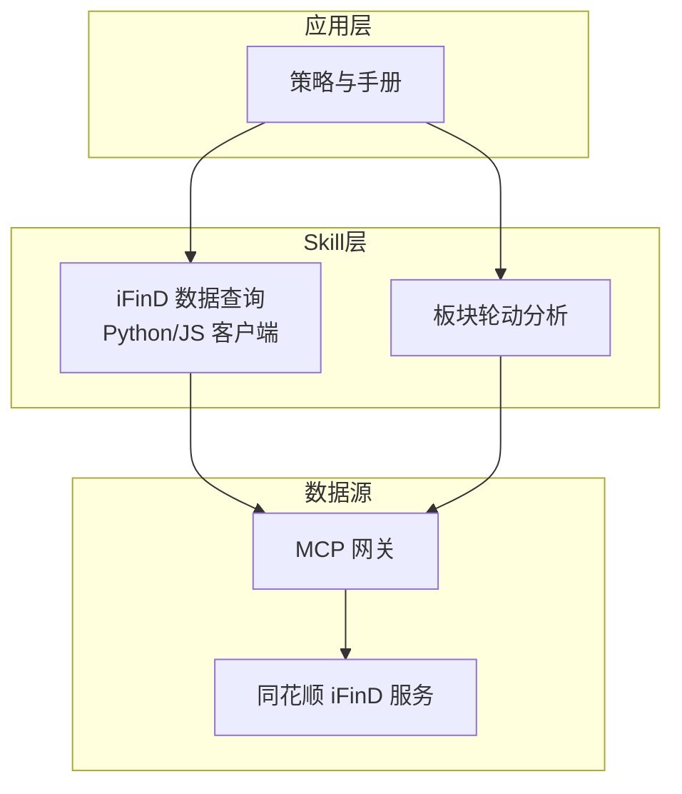
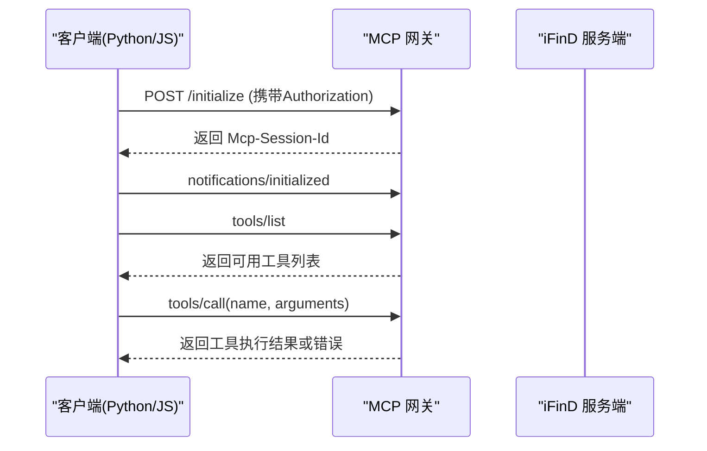
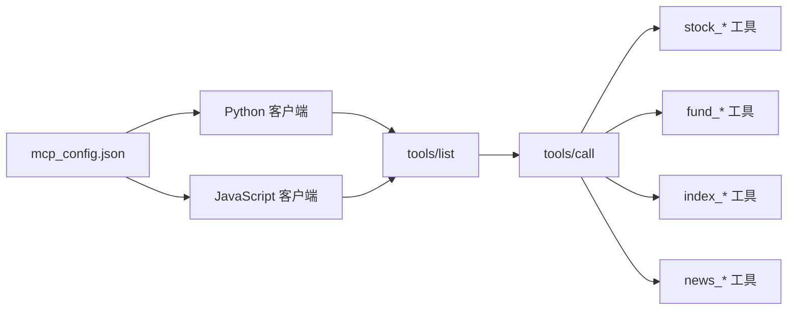

# 中国股票数据API

<cite>
**本文引用的文件**
- [README.MD](file://README.MD)
- [call.py](file://skills/ifind-finance-data-1.3.0/call.py)
- [call-node.js](file://skills/ifind-finance-data-1.3.0/call-node.js)
- [mcp_config.json](file://skills/ifind-finance-data-1.3.0/mcp_config.json)
- [cn_stock.md](file://skills/ifind-finance-data-1.3.0/references/cn_stock.md)
- [fund.md](file://skills/ifind-finance-data-1.3.0/references/fund.md)
- [index.md](file://skills/ifind-finance-data-1.3.0/references/index.md)
- [news_notices.md](file://skills/ifind-finance-data-1.3.0/references/news_notices.md)
- [api_getplaterotatdata.md](file://skills/plate-rotation-skill/references/api_getplaterotatdata.md)
- [api_getlongbyplate.md](file://skills/plate-rotation-skill/references/api_getlongbyplate.md)
- [api_getplatedaychart.md](file://skills/plate-rotation-skill/references/api_getplatedaychart.md)
- [api_getplaterotatchart.md](file://skills/plate-rotation-skill/references/api_getplaterotatchart.md)
</cite>

## 目录
1. [简介](#简介)
2. [项目结构](#项目结构)
3. [核心组件](#核心组件)
4. [架构总览](#架构总览)
5. [详细接口说明](#详细接口说明)
6. [依赖关系分析](#依赖关系分析)
7. [性能与实时性](#性能与实时性)
8. [故障排查指南](#故障排查指南)
9. [结论](#结论)
10. [附录：调用示例与最佳实践](#附录调用示例与最佳实践)

## 简介
本项目为基于 AI Agent 驱动的个人股票分析与交易策略管理系统，通过模块化的 Skills 提供数据能力，结合 Strategy 管理交易决策规则。数据源通过 MCP 接口接入同花顺 iFinD 服务，覆盖 A 股、基金、指数、债券、宏观、新闻公告及全球市场等数据域。本接口文档聚焦“中国股票数据API”，涵盖智能选股、股票摘要、基本信息、行情技术指标、股本结构、财务数据、风险指标、重大事件、ESG 评级以及高频/实时行情等核心能力，并提供 Python 与 JavaScript 的完整调用示例与高级用法。

## 项目结构
- skills/ifind-finance-data-1.3.0：iFinD 金融数据查询 Skill，包含 Python/JS 客户端封装与工具参考文档
- skills/plate-rotation-skill：A 股板块轮动分析相关 API 参考与脚本
- strategy：交易策略方法论与量化执行版
- manual：投资手册（指标科普与体系总纲）
- README.MD：项目概览与使用说明

图表来源
- [README.MD:1-81](file://README.MD#L1-L81)
- [call.py:1-208](file://skills/ifind-finance-data-1.3.0/call.py#L1-L208)
- [call-node.js:1-267](file://skills/ifind-finance-data-1.3.0/call-node.js#L1-L267)

章节来源
- [README.MD:1-81](file://README.MD#L1-L81)

## 核心组件
- Python 客户端 call.py：负责初始化会话、动态加载可用工具集、参数校验、发起 JSON-RPC 调用并返回统一结果结构
- JavaScript 客户端 call-node.js：功能等价于 Python 客户端，支持异步调用与错误处理
- 配置 mcp_config.json：存放认证令牌 auth_token
- 工具参考文档 references/*：按数据域列出工具名称、功能说明、典型参数与调用示例

章节来源
- [call.py:1-208](file://skills/ifind-finance-data-1.3.0/call.py#L1-L208)
- [call-node.js:1-267](file://skills/ifind-finance-data-1.3.0/call-node.js#L1-L267)
- [mcp_config.json:1-3](file://skills/ifind-finance-data-1.3.0/mcp_config.json#L1-L3)
- [cn_stock.md:1-67](file://skills/ifind-finance-data-1.3.0/references/cn_stock.md#L1-L67)

## 架构总览
系统采用“客户端封装 + MCP 协议 + 服务端工具”的分层架构。客户端在首次调用前与服务端完成 initialize 握手，获取会话标识；随后通过 tools/list 动态发现可用工具集合，再使用 tools/call 以 JSON-RPC 方式调用具体工具。所有请求均携带 Authorization 头进行鉴权。

图表来源
- [call.py:85-116](file://skills/ifind-finance-data-1.3.0/call.py#L85-L116)
- [call-node.js:149-176](file://skills/ifind-finance-data-1.3.0/call-node.js#L149-L176)
- [call.py:174-203](file://skills/ifind-finance-data-1.3.0/call.py#L174-L203)
- [call-node.js:222-256](file://skills/ifind-finance-data-1.3.0/call-node.js#L222-L256)

## 详细接口说明

### 通用调用约定
- 服务类型 server_type
  - stock：A 股股票数据
  - fund：公募基金数据
  - index：指数与板块数据
  - news：新闻与公告语义检索
  - bond：债券数据
  - global_stock：港美股数据
  - edb：宏观经济数据库
- 认证
  - 通过 Authorization 头传递 auth_token（见 mcp_config.json）
- 会话机制
  - 首次调用需 initialize，服务端返回 Mcp-Session-Id，后续请求携带该会话头
- 工具发现
  - 通过 tools/list 动态获取当前可用的工具名集合，避免硬编码导致失效
- 参数校验
  - 客户端对输入参数进行类型与值校验，拒绝非法对象、受保护键名、非有限数值等

章节来源
- [call.py:1-83](file://skills/ifind-finance-data-1.3.0/call.py#L1-L83)
- [call-node.js:1-115](file://skills/ifind-finance-data-1.3.0/call-node.js#L1-L115)
- [mcp_config.json:1-3](file://skills/ifind-finance-data-1.3.0/mcp_config.json#L1-L3)

### 股票服务工具（server_type="stock"）
以下工具均以自然语言 query 为主入口，支持多主体合并查询与行业板块作为主体查询。

- search_stocks（智能选股）
  - 用途：根据自然语言条件筛选股票
  - 典型参数：{"query": "电子行业市值大于100亿"}
  - 高级用法：可组合多个条件，如行业、市值区间、估值阈值等
- get_stock_summary（股票信息摘要）
  - 用途：快速了解某只股票的概况与关键要点
  - 典型参数：{"query": "贵州茅台财务状况"}
- get_stock_info（基本信息）
  - 用途：查询上市时间、交易所、行业分类等基础资料
  - 典型参数：{"query": "格力电器上市时间"}
- get_stock_performance（行情与技术指标）
  - 用途：日频行情与技术指标序列
  - 典型参数：{"query": "三花智控近5日涨跌幅"}
- get_stock_shareholders（股本结构与股东数据）
  - 用途：流通股占比、股东户数、机构持仓等
  - 典型参数：{"query": "光明乳业流通股占比"}
- get_stock_financials（财务数据与指标）
  - 用途：净利润增速、ROE、ROA 等财务指标
  - 典型参数：{"query": "科大讯飞2025年三季度的ROE"}
  - 多主体合并：{"query": "同花顺、东方财富、大智慧、恒生电子的2025-09-30的净利润增速、ROE、ROA"}
- get_risk_indicators（风险定量指标）
  - 用途：夏普比率、波动率等风险度量
  - 典型参数：{"query": "航天电子在2026-03-19的夏普比率"}
- get_stock_events（重大事件）
  - 用途：首发股本数量、增发、回购等重大事件类指标
  - 典型参数：{"query": "摩尔线程IPO首发股本数量"}
- get_esg_data（ESG 评级）
  - 用途：中诚信等机构的 ESG 评级
  - 典型参数：{"query": "诚意药业中诚信ESG评级"}
- stock_highfreq_quotes（A 股高频/实时行情）
  - 用途：实时快照与高频序列
  - 典型参数：
    - 高频序列：{"symbols": "300033.SZ,300059,贵州茅台", "indicators": "开盘价,最高价,最低价,收盘价,涨跌幅,成交量", "data_mode": "highfreq", "interval": 1}
    - 实时快照：{"symbols": "贵州茅台", "indicators": "最新价,涨跌幅,成交量,成交额", "data_mode": "real_time"}

章节来源
- [cn_stock.md:1-67](file://skills/ifind-finance-data-1.3.0/references/cn_stock.md#L1-L67)

### 基金服务工具（server_type="fund"）
- search_funds：模糊搜索基金
- get_fund_profile：基金基本资料
- get_fund_market_performance：行情与业绩
- get_fund_ownership：份额与持有人
- get_fund_portfolio：持仓明细
- get_fund_financials：基金财务指标
- get_fund_company_info：基金公司信息
- fund_highfreq_quotes：基金实时快照与高频序列

章节来源
- [fund.md:1-55](file://skills/ifind-finance-data-1.3.0/references/fund.md#L1-L55)

### 指数与板块服务工具（server_type="index"）
- index_data：指数行情、技术指标与估值指标
- sector_data：板块行情、财务分析与成分股指标
- index_highfreq_quotes：指数实时快照与高频序列

章节来源
- [index.md:1-63](file://skills/ifind-finance-data-1.3.0/references/index.md#L1-L63)

### 新闻公告服务（server_type="news"）
- search_news：新闻资讯语义检索
- search_notice：公告语义检索
- search_trending_news：热点事件资讯查询

章节来源
- [news_notices.md:1-70](file://skills/ifind-finance-data-1.3.0/references/news_notices.md#L1-L70)

### 板块轮动分析（独立 Skill）
以下为板块轮动相关的专用接口，常用于识别资金主线与龙头股。

- api_getplaterotatdata
  - 用途：获取板块排名与强度/涨幅数据
  - 入参：from(ths|kaipan)、days、dates
  - 输出：first（当日 Top1 板块代码）、html（表格 HTML）
- api_getlongbyplate
  - 用途：获取指定板块 N 日的领涨龙头股
  - 入参：platecode、days、dates
  - 输出：html（表格 HTML），含每日 Top5 龙头
- api_getplatedaychart
  - 用途：板块强度+量能 ECharts 数据
  - 入参：platecode、days、dates
  - 输出：date、legend 等
- api_getplaterotatchart
  - 用途：Top5 板块 N 日排名变化序列
  - 入参：from、days、dates
  - 输出：date、legend、name、value、symbol 等

章节来源
- [api_getplaterotatdata.md:1-74](file://skills/plate-rotation-skill/references/api_getplaterotatdata.md#L1-L74)
- [api_getlongbyplate.md:1-65](file://skills/plate-rotation-skill/references/api_getlongbyplate.md#L1-L65)
- [api_getplatedaychart.md:1-48](file://skills/plate-rotation-skill/references/api_getplatedaychart.md#L1-L48)
- [api_getplaterotatchart.md:1-53](file://skills/plate-rotation-skill/references/api_getplaterotatchart.md#L1-L53)

## 依赖关系分析
- 客户端与服务端依赖
  - 客户端依赖 mcp_config.json 中的 auth_token
  - 客户端依赖服务端提供的工具名集合（tools/list）
- 工具间依赖
  - 板块轮动流程：先调用 getPlateRotatData 获取 first（Top1 板块代码），再调用 getLongByPlate 获取龙头股
- 外部依赖
  - HTTP/HTTPS 网络请求
  - JSON 编解码
  - 可选：事件流 Accept 头用于长连接场景

图表来源
- [call.py:119-134](file://skills/ifind-finance-data-1.3.0/call.py#L119-L134)
- [call-node.js:117-147](file://skills/ifind-finance-data-1.3.0/call-node.js#L117-L147)
- [mcp_config.json:1-3](file://skills/ifind-finance-data-1.3.0/mcp_config.json#L1-L3)

章节来源
- [call.py:119-134](file://skills/ifind-finance-data-1.3.0/call.py#L119-L134)
- [call-node.js:117-147](file://skills/ifind-finance-data-1.3.0/call-node.js#L117-L147)

## 性能与实时性
- 会话复用
  - 客户端维护会话 ID，避免重复握手开销
- 工具集缓存
  - 本地缓存 tools/list 结果，减少频繁探测
- 超时控制
  - 默认请求超时 60s，initialize 30s，通知 10s
- 高频/实时数据
  - stock_highfreq_quotes 支持 data_mode=real_time 获取最新快照
  - highfreq 模式配合 interval 获取分钟级序列
- 并发建议
  - 多标的查询尽量批量合并（如多主体合并查询），降低往返次数
- 限流与重试
  - 建议在业务层实现退避重试，避免瞬时高并发触发服务端限流

章节来源
- [call.py:42-56](file://skills/ifind-finance-data-1.3.0/call.py#L42-L56)
- [call-node.js:42-79](file://skills/ifind-finance-data-1.3.0/call-node.js#L42-L79)
- [cn_stock.md:52-66](file://skills/ifind-finance-data-1.3.0/references/cn_stock.md#L52-L66)

## 故障排查指南
- 常见错误
  - 未知 server_type：检查传入的服务类型是否在 SERVERS 映射中
  - toolName not allowed：确认工具名是否在当前工具集中（可通过 list_tools 刷新）
  - 参数校验失败：确保 params 为合法 JSON 对象，不包含受保护键名与非有限数值
  - 未返回 Mcp-Session-Id：initialize 成功但未返回会话头，需检查服务端响应
  - HTTP 错误码 >= 400：网络或服务端异常，记录状态码与原始响应
- 定位步骤
  - 打印请求 payload 与响应 raw
  - 使用 list_tools 验证工具可用性
  - 逐步缩小 query 范围，排除复杂自然语言解析问题
- 日志建议
  - 记录每次调用的 server_type、tool_name、params、status_code、error 与 raw

章节来源
- [call.py:137-171](file://skills/ifind-finance-data-1.3.0/call.py#L137-L171)
- [call-node.js:178-220](file://skills/ifind-finance-data-1.3.0/call-node.js#L178-L220)
- [call.py:59-83](file://skills/ifind-finance-data-1.3.0/call.py#L59-L83)
- [call-node.js:81-115](file://skills/ifind-finance-data-1.3.0/call-node.js#L81-L115)

## 结论
本 API 体系以自然语言为入口，结合动态工具发现与会话管理，提供了从智能选股到高频行情的全链路数据能力。通过合理的参数设计与批量合并查询，可在保证准确性的同时提升性能。建议在生产环境做好会话复用、工具集缓存、超时与重试策略，并结合板块轮动工具形成“自上而下”的分析闭环。

## 附录：调用示例与最佳实践

### Python 调用示例
- 智能选股
  - 参考路径：[cn_stock.md:16-36](file://skills/ifind-finance-data-1.3.0/references/cn_stock.md#L16-L36)
- 多主体合并查询
  - 参考路径：[cn_stock.md:44-47](file://skills/ifind-finance-data-1.3.0/references/cn_stock.md#L44-L47)
- 行业板块作为主体查询
  - 参考路径：[cn_stock.md:49-50](file://skills/ifind-finance-data-1.3.0/references/cn_stock.md#L49-L50)
- 高频/实时行情
  - 参考路径：[cn_stock.md:52-66](file://skills/ifind-finance-data-1.3.0/references/cn_stock.md#L52-L66)

### JavaScript 调用示例
- 智能选股
  - 参考路径：[cn_stock.md:18-29](file://skills/ifind-finance-data-1.3.0/references/cn_stock.md#L18-L29)
- 指数与板块查询
  - 参考路径：[index.md:11-26](file://skills/ifind-finance-data-1.3.0/references/index.md#L11-L26)
- 新闻公告查询
  - 参考路径：[news_notices.md:15-29](file://skills/ifind-finance-data-1.3.0/references/news_notices.md#L15-L29)

### 高级用法
- 自然语言查询语法
  - 将主体（股票简称/代码/行业）、指标、时间范围组织成一句话，例如：“锂电池行业股票的今日涨跌幅”
- 多主体合并查询
  - 在同一 query 中并列多个主体与指标，减少多次往返
- 行业板块查询
  - 以行业或概念板块作为主体，直接获取板块内个股聚合指标
- 实时快照与高频数据
  - real_time 模式获取最新快照；highfreq 模式配合 interval 获取分钟级序列

章节来源
- [cn_stock.md:1-67](file://skills/ifind-finance-data-1.3.0/references/cn_stock.md#L1-L67)
- [index.md:1-63](file://skills/ifind-finance-data-1.3.0/references/index.md#L1-L63)
- [news_notices.md:1-70](file://skills/ifind-finance-data-1.3.0/references/news_notices.md#L1-L70)