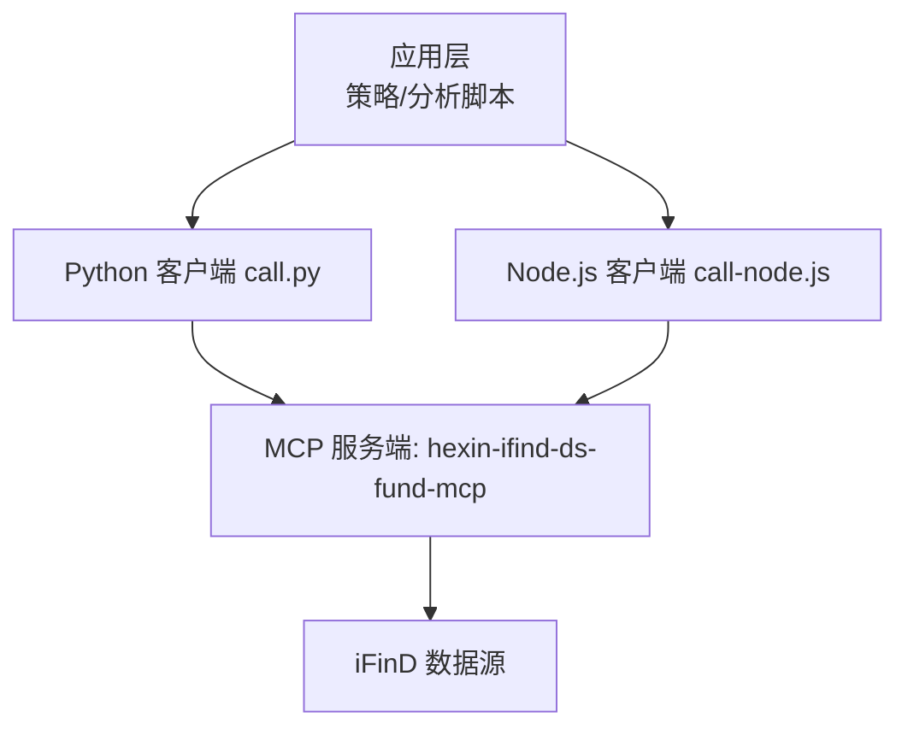
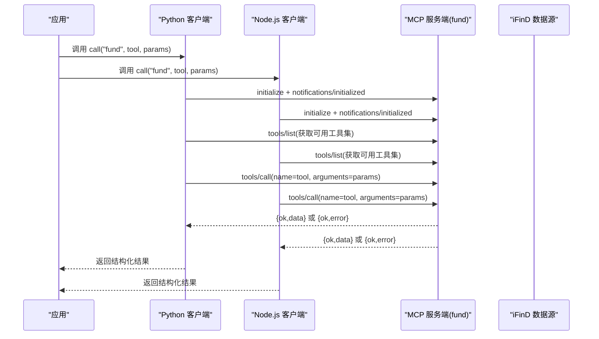
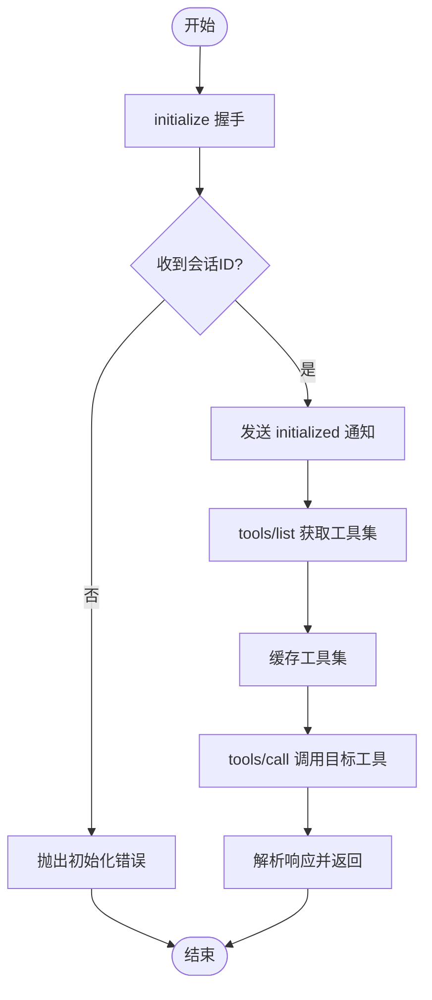

# 基金数据API

<cite>
**本文引用的文件**   
- [fund.md](file://skills/ifind-finance-data-1.3.0/references/fund.md)
- [call.py](file://skills/ifind-finance-data-1.3.0/call.py)
- [call-node.js](file://skills/ifind-finance-data-1.3.0/call-node.js)
- [mcp_config.json](file://skills/ifind-finance-data-1.3.0/mcp_config.json)
- [SKILL.md](file://skills/ifind-finance-data-1.3.0/SKILL.md)
- [README.MD](file://README.MD)
</cite>

## 目录
1. [简介](#简介)
2. [项目结构](#项目结构)
3. [核心组件](#核心组件)
4. [架构总览](#架构总览)
5. [详细接口说明](#详细接口说明)
6. [依赖与调用流程分析](#依赖与调用流程分析)
7. [性能与限制](#性能与限制)
8. [故障排查指南](#故障排查指南)
9. [结论](#结论)
10. [附录：示例与最佳实践](#附录示例与最佳实践)

## 简介
本文件为“基金数据API”的完整接口文档，覆盖基金基本信息查询、净值与行情、持仓分析、业绩表现、基金经理与公司信息、高频实时行情等核心能力。文档同时给出参数规范、响应格式约定、时间范围与过滤条件建议、Python/JavaScript调用示例、数据更新频率与访问限制说明，以及最佳实践与常见问题解决方案。

## 项目结构
本项目通过 MCP（Model Context Protocol）封装同花顺 iFinD 金融数据服务，提供统一的工具调用入口。基金相关能力集中在 fund 服务下，并通过 Python 与 Node.js 两套客户端脚本进行调用。

图表来源
- [call.py:10-18](file://skills/ifind-finance-data-1.3.0/call.py#L10-L18)
- [call-node.js:10-18](file://skills/ifind-finance-data-1.3.0/call-node.js#L10-L18)
- [SKILL.md:16-21](file://skills/ifind-finance-data-1.3.0/SKILL.md#L16-L21)

章节来源
- [README.MD:57-67](file://README.MD#L57-L67)
- [SKILL.md:16-21](file://skills/ifind-finance-data-1.3.0/SKILL.md#L16-L21)

## 核心组件
- 统一客户端
  - Python 客户端：call.py，负责初始化会话、加载可用工具集、发起 JSON-RPC 请求并返回结构化结果。
  - Node.js 客户端：call-node.js，功能等价于 Python 客户端，使用内置网络模块实现。
- 配置
  - mcp_config.json：存放鉴权令牌 auth_token，两个客户端共用。
- 参考文档
  - references/fund.md：基金服务工具清单、典型参数与示例。
  - SKILL.md：总体使用说明、并发上限、首次使用与环境要求。

章节来源
- [call.py:10-18](file://skills/ifind-finance-data-1.3.0/call.py#L10-L18)
- [call-node.js:10-18](file://skills/ifind-finance-data-1.3.0/call-node.js#L10-L18)
- [mcp_config.json:1-3](file://skills/ifind-finance-data-1.3.0/mcp_config.json#L1-L3)
- [fund.md:1-12](file://skills/ifind-finance-data-1.3.0/references/fund.md#L1-L12)
- [SKILL.md:25-28](file://skills/ifind-finance-data-1.3.0/SKILL.md#L25-L28)

## 架构总览
基金数据 API 采用 JSON-RPC 2.0 协议，客户端与服务端交互流程如下：

图表来源
- [call.py:85-116](file://skills/ifind-finance-data-1.3.0/call.py#L85-L116)
- [call.py:119-134](file://skills/ifind-finance-data-1.3.0/call.py#L119-L134)
- [call.py:137-171](file://skills/ifind-finance-data-1.3.0/call.py#L137-L171)
- [call-node.js:149-176](file://skills/ifind-finance-data-1.3.0/call-node.js#L149-L176)
- [call-node.js:117-147](file://skills/ifind-finance-data-1.3.0/call-node.js#L117-L147)
- [call-node.js:178-220](file://skills/ifind-finance-data-1.3.0/call-node.js#L178-L220)

## 详细接口说明

### 通用约定
- 服务类型：server_type = "fund"
- 认证：请求头 Authorization 携带 auth_token；首次需完成 initialize 并接收 Mcp-Session-Id，后续请求附带会话标识。
- 协议：JSON-RPC 2.0，方法包括 initialize、notifications/initialized、tools/list、tools/call。
- 参数校验：客户端对输入参数进行白名单与类型校验，禁止特定键名与非法数值类型。
- 返回结构：统一包装为 { ok, status_code, data } 或 { ok, error, raw }。

章节来源
- [call.py:31-39](file://skills/ifind-finance-data-1.3.0/call.py#L31-L39)
- [call.py:59-82](file://skills/ifind-finance-data-1.3.0/call.py#L59-L82)
- [call.py:137-171](file://skills/ifind-finance-data-1.3.0/call.py#L137-L171)
- [call-node.js:30-40](file://skills/ifind-finance-data-1.3.0/call-node.js#L30-L40)
- [call-node.js:81-115](file://skills/ifind-finance-data-1.3.0/call-node.js#L81-L115)
- [call-node.js:178-220](file://skills/ifind-finance-data-1.3.0/call-node.js#L178-L220)

### 工具清单与参数规范（fund 服务）
以下为基金服务常用工具及其典型参数说明。所有工具均通过 call("fund", tool_name, params) 调用。

- search_funds
  - 功能：基金搜索（支持模糊名称、选基需求）
  - 典型参数：{"query": "南方基金新能源ETF"}
  - 说明：query 可包含多主体与指标描述，建议不超过 5 个主体/指标组合。

- get_fund_profile
  - 功能：基金基本资料（发行日期、费率、规模、类型等）
  - 典型参数：{"query": "工银双盈债券A(010068)的发行日期与发行费率"}

- get_fund_market_performance
  - 功能：基金行情与业绩（收益率、涨跌幅、波动率等）
  - 典型参数：{"query": "方正富邦策略精选A(010072)在近一月收益率"}
  - 时间范围：自然语言描述，如“近一月”“过去N个交易日”。

- get_fund_ownership
  - 功能：基金份额与持有人结构（申购/赎回份额、持有人分布等）
  - 典型参数：{"query": "湘财长弘灵活配置混合A(010076)在2025-06-30的申购总份额和赎回总份额"}
  - 日期：支持具体披露日或报告期。

- get_fund_portfolio
  - 功能：基金持仓明细（股票投资占比、重仓股、行业分布等）
  - 典型参数：{"query": "工银优质成长混合A(010088)在2025-06-30披露报告中的股票投资占比"}

- get_fund_financials
  - 功能：基金财务指标（利润、费用、分红等）
  - 典型参数：{"query": "泰康浩泽混合A(010081)在2025-06-30的利润"}

- get_fund_company_info
  - 功能：基金公司信息（基金经理数量、公司管理规模等）
  - 典型参数：{"query": "蜂巢丰瑞的所属基金公司基金经理数量"}

- fund_highfreq_quotes
  - 功能：中国公募基金行情数据的实时快照与高频序列
  - 典型参数：
    - real_time 快照：{"symbols": "000307.OF,516850,易方达蓝筹精选混合", "indicators": "最新价,IOPV净值估值,振幅,折价", "data_mode": "real_time"}
    - highfreq 分时：{"symbols": "516850", "indicators": "开盘价,最高价,最低价,收盘价,成交量", "data_mode": "highfreq", "interval": 1}
  - symbols 支持代码或名称，逗号分隔；indicators 为指标列表；interval 单位为分钟。

章节来源
- [fund.md:1-12](file://skills/ifind-finance-data-1.3.0/references/fund.md#L1-L12)
- [fund.md:14-34](file://skills/ifind-finance-data-1.3.0/references/fund.md#L14-L34)
- [fund.md:36-53](file://skills/ifind-finance-data-1.3.0/references/fund.md#L36-L53)

### 响应格式约定
- 成功响应
  - 结构：{ ok: true, status_code: HTTP状态码, data: 服务端返回的数据对象 }
  - data 的具体字段由工具决定，通常包含查询主体、指标、时间序列或明细列表。
- 错误响应
  - 结构：{ ok: false, status_code: HTTP状态码, error: 错误信息, raw: 原始响应体 }
  - 常见错误：工具不存在、参数不合法、权限不足、网络超时等。

章节来源
- [call.py:158-171](file://skills/ifind-finance-data-1.3.0/call.py#L158-L171)
- [call-node.js:202-219](file://skills/ifind-finance-data-1.3.0/call-node.js#L202-L219)

### 基金代码格式与时间范围设置
- 基金代码格式
  - 支持纯数字代码（如 516850）、带后缀的代码（如 000307.OF），或直接使用基金名称。
  - 多个主体以逗号分隔传入 symbols 或 query 中。
- 时间范围
  - 使用自然语言描述，例如“近一月”“过去10个交易日”“2025-06-30”。
  - 对于高频行情，data_mode="highfreq" 时可通过 interval 指定分钟粒度。
- 数据过滤
  - 通过 indicators 指定所需指标；通过 query 附加筛选条件（如“股票投资占比”“利润率”）。

章节来源
- [fund.md:36-53](file://skills/ifind-finance-data-1.3.0/references/fund.md#L36-L53)
- [SKILL.md:21](file://skills/ifind-finance-data-1.3.0/SKILL.md#L21)

### Python 调用示例路径
- 基础调用
  - 参考路径：[fund.md:29-34](file://skills/ifind-finance-data-1.3.0/references/fund.md#L29-L34)
- 高频实时行情
  - 参考路径：[fund.md:38-53](file://skills/ifind-finance-data-1.3.0/references/fund.md#L38-L53)
- 客户端实现
  - 参考路径：[call.py:137-171](file://skills/ifind-finance-data-1.3.0/call.py#L137-L171)

### JavaScript 调用示例路径
- 基础调用
  - 参考路径：[fund.md:16-27](file://skills/ifind-finance-data-1.3.0/references/fund.md#L16-L27)
- 客户端实现
  - 参考路径：[call-node.js:178-220](file://skills/ifind-finance-data-1.3.0/call-node.js#L178-L220)

## 依赖与调用流程分析

### 客户端初始化与会话管理
- 初始化流程
  - 发送 initialize 请求，服务端返回 Mcp-Session-Id，客户端保存并在后续请求头中携带。
  - 发送 notifications/initialized 通知完成握手。
- 工具集加载
  - 首次调用前执行 tools/list，缓存当前用户可用的工具名称集合，避免重复请求。
- 参数校验
  - 递归检查 params 结构，禁止特定键名与非法数值类型，确保可安全序列化。

图表来源
- [call.py:85-116](file://skills/ifind-finance-data-1.3.0/call.py#L85-L116)
- [call.py:119-134](file://skills/ifind-finance-data-1.3.0/call.py#L119-L134)
- [call-node.js:149-176](file://skills/ifind-finance-data-1.3.0/call-node.js#L149-L176)
- [call-node.js:117-147](file://skills/ifind-finance-data-1.3.0/call-node.js#L117-L147)

章节来源
- [call.py:85-116](file://skills/ifind-finance-data-1.3.0/call.py#L85-L116)
- [call-node.js:149-176](file://skills/ifind-finance-data-1.3.0/call-node.js#L149-L176)

### 错误处理与重试建议
- 参数错误：TypeError 提示输入类型或键名不合法，修正 params 后重试。
- 工具不存在：检查 list_tools 返回的工具集，确认工具名称与权限。
- 网络错误：HTTP 状态码 >= 400 时抛出异常，建议增加指数退避重试与超时控制。
- 会话失效：若会话过期，重新执行 initialize 流程。

章节来源
- [call.py:59-82](file://skills/ifind-finance-data-1.3.0/call.py#L59-L82)
- [call.py:158-171](file://skills/ifind-finance-data-1.3.0/call.py#L158-L171)
- [call-node.js:81-115](file://skills/ifind-finance-data-1.3.0/call-node.js#L81-L115)
- [call-node.js:202-219](file://skills/ifind-finance-data-1.3.0/call-node.js#L202-L219)

## 性能与限制
- 并发上限
  - 免费用户：每秒最多 2 个请求
  - 个人版正式用户：每秒最多 5 个请求
  - 企业版正式用户：每秒最多 10 个请求
- 超时设置
  - 默认请求超时约 60 秒，initialize 与通知分别有较短超时。
- 数据范围
  - 支持 A 股/基金/债券/指数的日内高频与实时行情；其他数据类别按工具定义提供历史与实时数据。
- 建议
  - 合并查询：将多主体/多指标合并到一次 query，减少请求次数。
  - 合理分页：高频数据按需选择 interval 与时间窗口，避免过大范围导致截断。

章节来源
- [SKILL.md:25-28](file://skills/ifind-finance-data-1.3.0/SKILL.md#L25-L28)
- [call.py:42-56](file://skills/ifind-finance-data-1.3.0/call.py#L42-L56)
- [call-node.js:42-79](file://skills/ifind-finance-data-1.3.0/call-node.js#L42-L79)

## 故障排查指南
- 无法连接或超时
  - 检查网络连通性与防火墙策略；确认服务器地址与端口可达。
  - 适当增大超时时间或降低并发。
- 未返回会话ID
  - 检查 initialize 响应头是否包含 Mcp-Session-Id；必要时重新初始化。
- 工具不存在或权限不足
  - 调用 list_tools 获取当前用户可用工具集；确认密钥权限等级。
- 中文乱码
  - Windows PowerShell 环境下确保控制台编码为 UTF-8。
- 参数校验失败
  - 检查 params 是否为对象、是否包含被禁用的键名、是否存在非有限数或未支持的类型。

章节来源
- [SKILL.md:90-95](file://skills/ifind-finance-data-1.3.0/SKILL.md#L90-L95)
- [call.py:59-82](file://skills/ifind-finance-data-1.3.0/call.py#L59-L82)
- [call-node.js:81-115](file://skills/ifind-finance-data-1.3.0/call-node.js#L81-L115)

## 结论
基金数据 API 基于 MCP 协议与 iFinD 数据源，提供从基础资料、业绩、持仓到高频行情的全链路能力。通过统一的 Python/Node.js 客户端，开发者可以便捷地构建基金分析与策略系统。遵循并发限制与参数规范，结合合理的查询合并与时间窗口控制，可获得稳定高效的取数体验。

## 附录：示例与最佳实践

### 获取基金详细分析报告（思路）
- 步骤
  - 使用 search_funds 定位目标基金。
  - 使用 get_fund_profile 获取基本资料。
  - 使用 get_fund_market_performance 获取近期业绩。
  - 使用 get_fund_portfolio 获取持仓明细与重仓股。
  - 使用 get_fund_financials 获取财务指标。
  - 使用 get_fund_company_info 获取公司信息。
- 输出
  - 汇总各工具返回的 data 字段，形成结构化报告。

章节来源
- [fund.md:1-12](file://skills/ifind-finance-data-1.3.0/references/fund.md#L1-L12)

### 获取历史业绩数据（思路）
- 步骤
  - 使用 get_fund_market_performance，query 中包含时间范围与指标（如“近一年收益率”“过去10个交易日涨跌”）。
  - 如需高频数据，使用 fund_highfreq_quotes，data_mode="highfreq"，并设置合适的 interval。
- 输出
  - 返回时间序列数据，可用于绘制业绩曲线与风险评估。

章节来源
- [fund.md:36-53](file://skills/ifind-finance-data-1.3.0/references/fund.md#L36-L53)

### 最佳实践
- 先搜再查：不确定具体基金时，先用 search_funds 缩小范围。
- 合并查询：单次 query 包含多主体/多指标，但控制在 5 个以内。
- 动态工具集：当工具缺失或名称变更时，优先调用 list_tools 获取真实可用清单。
- 高频数据：仅拉取必要的时间窗口与指标，避免超限截断。

章节来源
- [SKILL.md:60-66](file://skills/ifind-finance-data-1.3.0/SKILL.md#L60-L66)