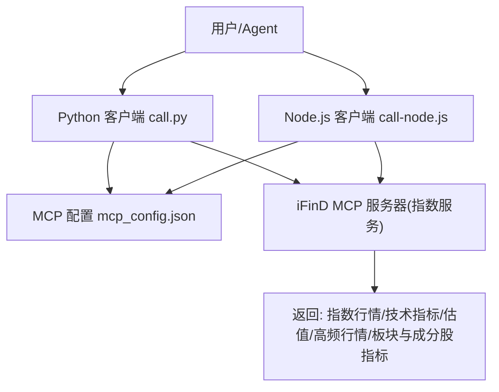
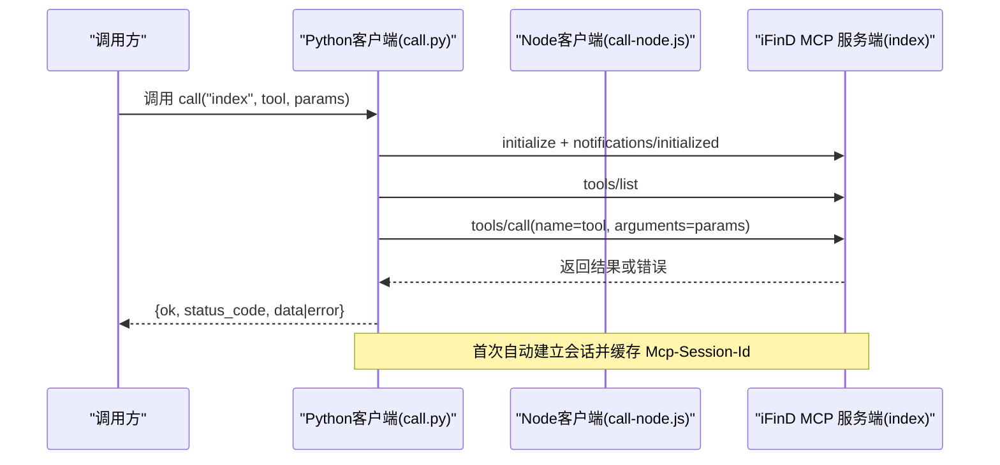
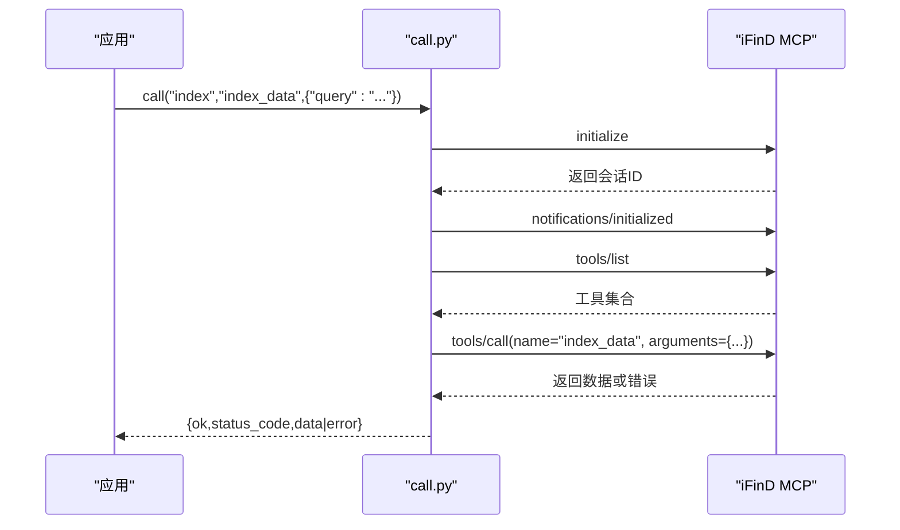
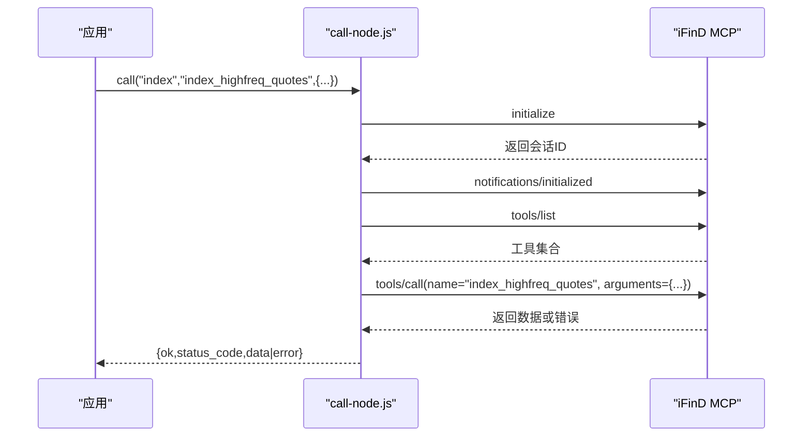
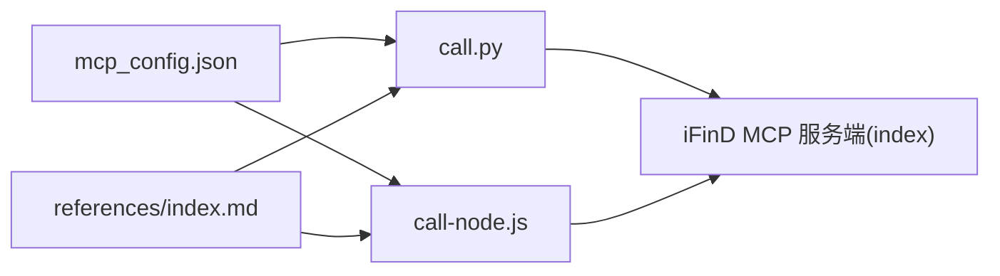

# 指数数据API

<cite>
**本文引用的文件**   
- [index.md](file://skills/ifind-finance-data-1.3.0/references/index.md)
- [call.py](file://skills/ifind-finance-data-1.3.0/call.py)
- [call-node.js](file://skills/ifind-finance-data-1.3.0/call-node.js)
- [mcp_config.json](file://skills/ifind-finance-data-1.3.0/mcp_config.json)
- [README.MD](file://README.MD)
- [短线严格筛选策略.md](file://strategy/短线严格筛选策略.md)
- [长线严格筛选策略.md](file://strategy/长线严格筛选策略.md)
</cite>

## 目录
1. [简介](#简介)
2. [项目结构](#项目结构)
3. [核心组件](#核心组件)
4. [架构总览](#架构总览)
5. [详细组件分析](#详细组件分析)
6. [依赖关系分析](#依赖关系分析)
7. [性能与可用性](#性能与可用性)
8. [故障排查指南](#故障排查指南)
9. [结论](#结论)
10. [附录：常用查询示例与最佳实践](#附录常用查询示例与最佳实践)

## 简介
本文件为“指数数据API”的完整接口文档，覆盖股票指数、债券指数、商品指数等指数的查询与分析能力。基于同花顺 iFinD MCP 服务，提供指数行情、技术指标与估值指标、板块与成分股指标、实时快照与高频序列等能力；并结合策略文档中的环境判断与量化流程，给出指数对比、基准选择、绩效归因等高级分析的实现方案与数据处理最佳实践（标准化、时间对齐、异常值处理）。

## 项目结构
本项目采用“认知—取数—决策”的职责分离设计：
- manual：投资手册与方法论沉淀
- skills：数据能力封装（iFinD MCP 工具调用）
- strategy：交易策略与执行清单
- README：总体说明与模块职责

图表来源
- [call.py:1-208](file://skills/ifind-finance-data-1.3.0/call.py#L1-L208)
- [call-node.js:1-267](file://skills/ifind-finance-data-1.3.0/call-node.js#L1-L267)
- [mcp_config.json:1-3](file://skills/ifind-finance-data-1.3.0/mcp_config.json#L1-L3)
- [index.md:1-63](file://skills/ifind-finance-data-1.3.0/references/index.md#L1-L63)

章节来源
- [README.MD:1-81](file://README.MD#L1-L81)

## 核心组件
- Python 客户端：负责参数校验、会话初始化、工具列表加载、工具调用与错误封装
- Node.js 客户端：功能等价实现，便于在 Node 环境中使用
- MCP 配置：集中管理认证令牌与服务端地址
- 指数与板块参考文档：定义可用工具、典型参数与调用示例

章节来源
- [call.py:1-208](file://skills/ifind-finance-data-1.3.0/call.py#L1-L208)
- [call-node.js:1-267](file://skills/ifind-finance-data-1.3.0/call-node.js#L1-L267)
- [mcp_config.json:1-3](file://skills/ifind-finance-data-1.3.0/mcp_config.json#L1-L3)
- [index.md:1-63](file://skills/ifind-finance-data-1.3.0/references/index.md#L1-L63)

## 架构总览
系统通过 JSON-RPC 2.0 协议与 iFinD MCP 服务端交互，统一封装为 Python/Node 客户端，暴露 index 服务下的三大工具：
- index_data：自然语言查询指数行情、技术指标与估值指标
- sector_data：自然语言查询板块行情、财务分析与成分股指标
- index_highfreq_quotes：实时快照与高频序列

图表来源
- [call.py:85-171](file://skills/ifind-finance-data-1.3.0/call.py#L85-L171)
- [call-node.js:149-220](file://skills/ifind-finance-data-1.3.0/call-node.js#L149-L220)
- [index.md:1-63](file://skills/ifind-finance-data-1.3.0/references/index.md#L1-L63)

## 详细组件分析

### 指数与板块工具（server_type="index"）
- 工具名与用途
  - index_data：指数行情、技术指标与估值指标
  - sector_data：板块行情、财务分析与成分股指标
  - index_highfreq_quotes：指数行情数据的实时快照与高频序列
- 典型参数
  - index_data：{"query": "指数名称+时间+指标"}
  - sector_data：{"query": "板块名称+时间+指标"}
  - index_highfreq_quotes：{"symbols": "...", "indicators": "...", "data_mode": "real_time|highfreq", "interval": 分钟级可选}
- 调用方式
  - Python：from call import call, list_tools
  - Node：const { call, listTools } = require('./call-node.js')

章节来源
- [index.md:1-63](file://skills/ifind-finance-data-1.3.0/references/index.md#L1-L63)

#### 工具调用时序（Python）

图表来源
- [call.py:85-171](file://skills/ifind-finance-data-1.3.0/call.py#L85-L171)

#### 工具调用时序（Node.js）

图表来源
- [call-node.js:149-220](file://skills/ifind-finance-data-1.3.0/call-node.js#L149-L220)

### 客户端实现要点（Python）
- 参数校验：拒绝非法类型、NaN/Inf、受保护键
- 会话管理：initialize 成功后缓存 Mcp-Session-Id，后续请求携带
- 工具集缓存：tools/list 结果缓存，避免重复拉取
- 错误封装：服务端 error 字段统一包装为 {ok:false,...}
- 超时控制：默认请求超时 60s，initialize 30s，通知 10s

章节来源
- [call.py:59-83](file://skills/ifind-finance-data-1.3.0/call.py#L59-L83)
- [call.py:85-116](file://skills/ifind-finance-data-1.3.0/call.py#L85-L116)
- [call.py:119-134](file://skills/ifind-finance-data-1.3.0/call.py#L119-L134)
- [call.py:137-171](file://skills/ifind-finance-data-1.3.0/call.py#L137-L171)

### 客户端实现要点（Node.js）
- 参数校验：拒绝 null/object/array、受保护键、非有限数值、bigint/function/symbol/undefined
- 会话管理：initialize 成功后缓存会话ID，支持响应头兼容大小写
- 工具集缓存：tools/list 结果缓存
- 错误封装：HTTP 状态码与 error 字段统一处理
- 超时控制：自定义超时毫秒数

章节来源
- [call-node.js:81-115](file://skills/ifind-finance-data-1.3.0/call-node.js#L81-L115)
- [call-node.js:149-176](file://skills/ifind-finance-data-1.3.0/call-node.js#L149-L176)
- [call-node.js:178-220](file://skills/ifind-finance-data-1.3.0/call-node.js#L178-L220)

### 配置与连接
- 认证令牌与服务端地址集中配置于 mcp_config.json
- 服务端地址前缀统一，按 server_type 区分具体服务（stock/fund/edb/news/bond/global_stock/index）

章节来源
- [mcp_config.json:1-3](file://skills/ifind-finance-data-1.3.0/mcp_config.json#L1-L3)
- [call.py:9-18](file://skills/ifind-finance-data-1.3.0/call.py#L9-L18)
- [call-node.js:9-18](file://skills/ifind-finance-data-1.3.0/call-node.js#L9-L18)

## 依赖关系分析
- 外部依赖
  - Python：requests
  - Node.js：fs、path、https、http
- 内部依赖
  - 客户端均依赖 mcp_config.json 获取认证信息
  - 指数相关工具定义位于 references/index.md

图表来源
- [call.py:1-18](file://skills/ifind-finance-data-1.3.0/call.py#L1-L18)
- [call-node.js:1-18](file://skills/ifind-finance-data-1.3.0/call-node.js#L1-L18)
- [index.md:1-63](file://skills/ifind-finance-data-1.3.0/references/index.md#L1-L63)

章节来源
- [call.py:1-208](file://skills/ifind-finance-data-1.3.0/call.py#L1-L208)
- [call-node.js:1-267](file://skills/ifind-finance-data-1.3.0/call-node.js#L1-L267)
- [index.md:1-63](file://skills/ifind-finance-data-1.3.0/references/index.md#L1-L63)

## 性能与可用性
- 会话复用：首次 initialize 后复用会话，减少握手开销
- 工具集缓存：tools/list 结果本地缓存，避免频繁探测
- 超时与重试：建议对网络波动场景增加重试与退避策略（当前未内置）
- 并发限制：高频快照与高频序列需考虑服务端限流与速率控制
- 幂等性：同一请求多次调用应保证结果一致（由服务端保障）

[本节为通用指导，不直接分析具体文件]

## 故障排查指南
- 常见错误
  - 未知 server_type：检查传入的 server_type 是否在 SERVERS 映射中
  - 工具名不允许：先调用 tools/list 确认工具名是否变更
  - 参数校验失败：确保参数为合法 JSON 对象，不含受保护键与非法数值
  - 未返回会话ID：initialize 成功但未返回 Mcp-Session-Id，需检查服务端响应头
  - HTTP 错误：status_code >= 400 时抛出或返回错误对象
- 定位步骤
  - 打印/记录原始响应 raw 字段
  - 检查 Authorization 与 Mcp-Session-Id 是否正确传递
  - 核对 mcp_config.json 中 auth_token 与服务端地址
  - 使用 list_tools 验证工具名与参数契约

章节来源
- [call.py:137-171](file://skills/ifind-finance-data-1.3.0/call.py#L137-L171)
- [call-node.js:178-220](file://skills/ifind-finance-data-1.3.0/call-node.js#L178-L220)

## 结论
本 API 以统一的 MCP 协议对接 iFinD 指数与板块数据，通过 Python/Node 客户端完成参数校验、会话管理与错误封装，提供指数行情、技术指标、估值指标、实时快照与高频序列等能力。结合策略文档中的环境判断与量化流程，可构建指数对比、基准选择与绩效归因等高级分析工作流。建议在工程侧补充重试、限流与监控，以提升稳定性与可观测性。

[本节为总结，不直接分析具体文件]

## 附录：常用查询示例与最佳实践

### 常用查询示例
- 指数历史行情与指标
  - 使用 index_data，以自然语言描述“指数名称+时间+指标”，如“沪深300过去10个交易日的涨跌幅和收盘点数”
- 板块与成分股指标
  - 使用 sector_data，以自然语言描述“板块名称+时间+指标”，如“某行业成分股个数及过去N日平均涨跌幅”
- 实时快照与高频序列
  - 使用 index_highfreq_quotes，指定 symbols、indicators、data_mode（real_time/highfreq），必要时设置 interval（分钟）

章节来源
- [index.md:1-63](file://skills/ifind-finance-data-1.3.0/references/index.md#L1-L63)

### 指数对比与基准选择
- 基准选择原则
  - 宽基指数作为组合基准（如沪深300、上证50、中证500）
  - 风格/主题指数用于细分赛道对比（如创业板指、科创50等）
- 对比方法
  - 使用 index_data 拉取多指数同日期的收益率序列
  - 计算相对收益、超额收益、跟踪误差、最大回撤
  - 结合均线与趋势判断进行环境评估（见策略文档的环境闸）

章节来源
- [短线严格筛选策略.md:40-56](file://strategy/短线严格筛选策略.md#L40-L56)

### 绩效归因思路
- 自上而下分解
  - 资产配置效应：不同指数权重变动带来的收益差异
  - 择时效应：超配/低配高景气指数的时机把握
  - 选股效应：指数内成分股层面的超额贡献（可通过 sector_data 辅助）
- 数据来源
  - 指数收益序列：index_data
  - 成分股表现与数量：sector_data
  - 高频日内走势：index_highfreq_quotes（用于日内归因与事件归因）

章节来源
- [index.md:1-63](file://skills/ifind-finance-data-1.3.0/references/index.md#L1-L63)

### 数据处理最佳实践
- 数据标准化
  - 统一复权口径（前复权/后复权）
  - 统一币种与单位（点数、百分比、成交额）
- 时间对齐
  - 交易日对齐，剔除节假日缺失
  - 高频数据降采样至日线/周线时，注意开盘/收盘/最高/最低聚合规则
- 异常值处理
  - 涨跌停、停牌、临时停牌导致的缺失值插补策略
  - 极端跳空的处理（去极值、Winsorize）
- 指标一致性
  - 技术指标窗口与频率一致（如 MA20、波动率年化）
  - 估值指标口径一致（PE-TTM、PB-MRQ 等）

[本节为通用指导，不直接分析具体文件]

### 指数编制规则、权重与分红调整（方法论提示）
- 编制规则
  - 样本空间、入选条件、定期调整与临时调整机制
- 权重计算方法
  - 自由流通市值加权、等权、基本面加权等
- 分红调整
  - 除权除息对价格序列的影响与复权处理
- 数据来源与落地
  - 通过 index_data 与 sector_data 获取指数与成分股维度数据，结合策略文档中的阈值与流程进行自动化分析

[本节为方法论概述，不直接分析具体文件]