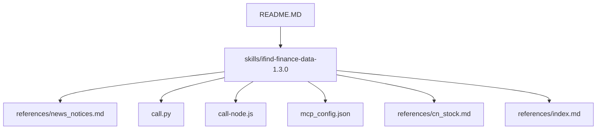
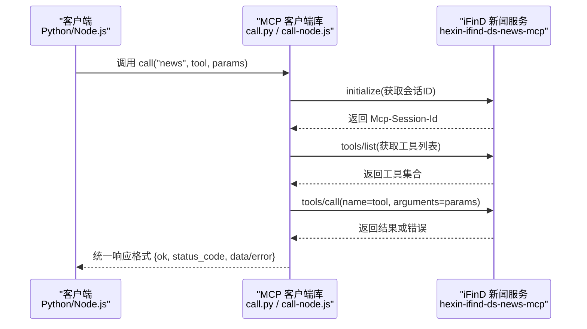
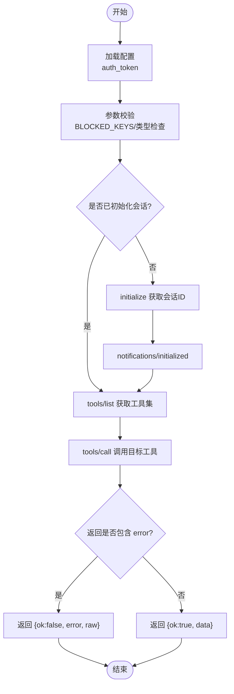
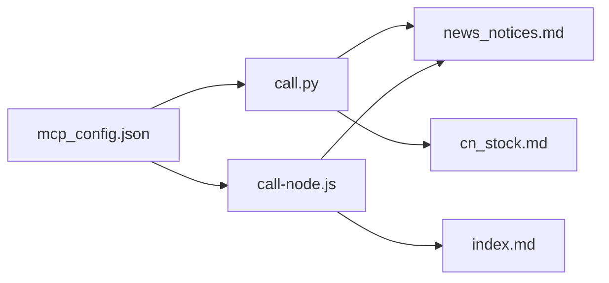

# 新闻公告API

<cite>
**本文引用的文件**
- [README.MD](file://README.MD)
- [news_notices.md](file://skills/ifind-finance-data-1.3.0/references/news_notices.md)
- [call.py](file://skills/ifind-finance-data-1.3.0/call.py)
- [call-node.js](file://skills/ifind-finance-data-1.3.0/call-node.js)
- [mcp_config.json](file://skills/ifind-finance-data-1.3.0/mcp_config.json)
- [cn_stock.md](file://skills/ifind-finance-data-1.3.0/references/cn_stock.md)
- [index.md](file://skills/ifind-finance-data-1.3.0/references/index.md)
</cite>

## 目录
1. [简介](#简介)
2. [项目结构](#项目结构)
3. [核心组件](#核心组件)
4. [架构总览](#架构总览)
5. [详细组件分析](#详细组件分析)
6. [依赖关系分析](#依赖关系分析)
7. [性能与可用性](#性能与可用性)
8. [故障排查指南](#故障排查指南)
9. [结论](#结论)
10. [附录：接口规范与最佳实践](#附录接口规范与最佳实践)

## 简介
本文件面向“新闻公告API”的开发者与使用者，系统化说明上市公司公告、财经新闻、研报资讯等金融信息的检索与分析能力。文档覆盖以下要点：
- 公告搜索、新闻筛选、热点事件查询的核心工具使用方法
- 过滤条件技术规范（公告类型、发布时间范围、公司关联性等）
- 重要公告识别、舆情监控、信息时效性分析的实用场景示例
- 数据来源权威性、内容完整性、去重机制的数据质量控制说明
- 批量下载、定时抓取、内容存储的自动化处理配置指南与最佳实践

## 项目结构
本项目采用模块化设计，数据能力以 Skills 形式提供，其中“同花顺 iFinD 金融数据查询”Skill 包含新闻公告服务。整体结构如下：
- manual：投资手册（指标科普与体系总纲）
- skills：数据能力封装，含 ifind-finance-data 与 plate-rotation-skill
- strategy：交易策略方法论与量化执行版
- README.MD：项目总览与使用说明

图表来源
- [README.MD:1-81](file://README.MD#L1-L81)
- [news_notices.md:1-70](file://skills/ifind-finance-data-1.3.0/references/news_notices.md#L1-L70)
- [call.py:1-208](file://skills/ifind-finance-data-1.3.0/call.py#L1-L208)
- [call-node.js:1-267](file://skills/ifind-finance-data-1.3.0/call-node.js#L1-L267)
- [mcp_config.json:1-3](file://skills/ifind-finance-data-1.3.0/mcp_config.json#L1-L3)
- [cn_stock.md:1-67](file://skills/ifind-finance-data-1.3.0/references/cn_stock.md#L1-L67)
- [index.md:1-63](file://skills/ifind-finance-data-1.3.0/references/index.md#L1-L63)

章节来源
- [README.MD:1-81](file://README.MD#L1-L81)

## 核心组件
- 新闻公告服务（server_type="news"）
  - search_news：新闻资讯语义检索
  - search_notice：公告语义检索
  - search_trending_news：热点事件资讯查询
- 调用客户端
  - Python 客户端 call.py
  - Node.js 客户端 call-node.js
- 配置中心
  - mcp_config.json：认证令牌与服务端地址映射

章节来源
- [news_notices.md:1-70](file://skills/ifind-finance-data-1.3.0/references/news_notices.md#L1-L70)
- [call.py:1-208](file://skills/ifind-finance-data-1.3.0/call.py#L1-L208)
- [call-node.js:1-267](file://skills/ifind-finance-data-1.3.0/call-node.js#L1-L267)
- [mcp_config.json:1-3](file://skills/ifind-finance-data-1.3.0/mcp_config.json#L1-L3)

## 架构总览
新闻公告API通过 MCP 协议与同花顺 iFinD 服务端交互，客户端负责初始化会话、列举可用工具并调用具体工具。

图表来源
- [call.py:85-171](file://skills/ifind-finance-data-1.3.0/call.py#L85-L171)
- [call-node.js:149-220](file://skills/ifind-finance-data-1.3.0/call-node.js#L149-L220)
- [news_notices.md:1-12](file://skills/ifind-finance-data-1.3.0/references/news_notices.md#L1-L12)

## 详细组件分析

### 新闻公告服务接口定义
- server_type：news
- 工具清单
  - search_news：新闻资讯语义检索
    - 典型参数：query、time_start、time_end、size
  - search_notice：公告语义检索
    - 典型参数：query、time_start、time_end、size
  - search_trending_news：热点事件资讯查询
    - 典型参数：keyword、industry_name、time_scope、size
- 语义检索特性
  - 支持自然语言输入，返回相关段落而非全文
  - query 字段可组合报告元数据与查询内容，如“公司名称+年份+主题”
  - 热点事件查询强调时效性，限制过多易无结果，建议放宽条件或切换为资讯搜索

章节来源
- [news_notices.md:1-70](file://skills/ifind-finance-data-1.3.0/references/news_notices.md#L1-L70)

### 客户端实现与调用流程
- Python 客户端（call.py）
  - 读取配置 mcp_config.json 中的 auth_token
  - 维护会话与请求ID，自动发送 initialize 与 notifications/initialized
  - 校验参数合法性（禁止危险键、非法数值、不支持类型）
  - 动态加载工具集，避免硬编码工具名
  - 统一返回结构：{ok, status_code, data|error, raw}
- Node.js 客户端（call-node.js）
  - 功能与 Python 版本一致，使用原生 http/https 模块
  - 异步 Promise 风格，超时控制与错误处理完善
  - 同样具备参数校验、会话管理、工具集缓存

图表来源
- [call.py:59-171](file://skills/ifind-finance-data-1.3.0/call.py#L59-L171)
- [call-node.js:81-220](file://skills/ifind-finance-data-1.3.0/call-node.js#L81-L220)
- [mcp_config.json:1-3](file://skills/ifind-finance-data-1.3.0/mcp_config.json#L1-L3)

章节来源
- [call.py:1-208](file://skills/ifind-finance-data-1.3.0/call.py#L1-L208)
- [call-node.js:1-267](file://skills/ifind-finance-data-1.3.0/call-node.js#L1-L267)
- [mcp_config.json:1-3](file://skills/ifind-finance-data-1.3.0/mcp_config.json#L1-L3)

### 接口使用示例与场景

#### 基础用法
- 财经新闻检索
  - 工具：search_news
  - 参数：query、time_start、time_end、size
- 上市公司公告检索
  - 工具：search_notice
  - 参数：query、time_start、time_end、size
- 热点事件查询
  - 工具：search_trending_news
  - 参数：keyword、industry_name、time_scope、size

章节来源
- [news_notices.md:13-70](file://skills/ifind-finance-data-1.3.0/references/news_notices.md#L13-L70)

#### 重要公告识别
- 思路
  - 使用 search_notice 结合时间窗口与公司主体进行检索
  - 在 query 中组合“公司名称+公告类型关键词”，例如“重大事项/业绩预告/财务数据/风险提示”
  - 对返回的相关段落进行二次筛选，提取关键信息
- 参考路径
  - 公告检索与时间范围过滤：[news_notices.md:54-60](file://skills/ifind-finance-data-1.3.0/references/news_notices.md#L54-L60)
  - 股票重大事件辅助：[cn_stock.md:12](file://skills/ifind-finance-data-1.3.0/references/cn_stock.md#L12)

章节来源
- [news_notices.md:54-60](file://skills/ifind-finance-data-1.3.0/references/news_notices.md#L54-L60)
- [cn_stock.md:12](file://skills/ifind-finance-data-1.3.0/references/cn_stock.md#L12)

#### 舆情监控
- 思路
  - 使用 search_trending_news 按行业与时间范围追踪热点
  - 结合 search_news 扩大覆盖面，关注负面词汇与异常波动
- 参考路径
  - 热点事件查询参数与示例：[news_notices.md:62-68](file://skills/ifind-finance-data-1.3.0/references/news_notices.md#L62-L68)

章节来源
- [news_notices.md:62-68](file://skills/ifind-finance-data-1.3.0/references/news_notices.md#L62-L68)

#### 信息时效性分析
- 思路
  - 利用 time_start/time_end 限定时间窗口，对比不同时段的信息密度与热度变化
  - 热点事件查询的 time_scope 适合短周期快速扫描
- 参考路径
  - 时间范围参数与示例：[news_notices.md:18-29](file://skills/ifind-finance-data-1.3.0/references/news_notices.md#L18-L29)

章节来源
- [news_notices.md:18-29](file://skills/ifind-finance-data-1.3.0/references/news_notices.md#L18-L29)

### 过滤条件技术规范
- 公告类型分类
  - 建议在 query 中显式指定公告类型关键词（如“年度报告/业绩预告/风险提示/重大事项”），以便语义检索更精准
- 发布时间范围
  - time_start/time_end 用于精确时间窗；time_scope 用于热点事件的相对时间（如“24小时”）
- 公司关联性
  - 在 query 中嵌入公司名称或简称，配合公告类型关键词提升相关性
- 其他约束
  - size 控制返回数量，注意合理设置以避免遗漏或过载
  - 热点事件查询不宜过度限制，必要时放宽条件或切换为资讯搜索

章节来源
- [news_notices.md:1-12](file://skills/ifind-finance-data-1.3.0/references/news_notices.md#L1-L12)

### 数据质量控制措施
- 数据来源权威性
  - 系统通过 MCP 接入同花顺 iFinD 数据服务，涵盖公告、新闻等资讯数据
- 内容完整性
  - 语义检索返回相关段落而非全文，需结合业务需求进行二次加工与补全
- 去重机制
  - 客户端未内置去重逻辑，建议在应用层基于标题/摘要/时间戳进行去重
- 参数安全
  - 客户端对输入进行严格校验，禁止危险键与非法类型，降低注入风险

章节来源
- [README.MD:57-68](file://README.MD#L57-L68)
- [news_notices.md:1-6](file://skills/ifind-finance-data-1.3.0/references/news_notices.md#L1-L6)
- [call.py:59-83](file://skills/ifind-finance-data-1.3.0/call.py#L59-L83)
- [call-node.js:81-115](file://skills/ifind-finance-data-1.3.0/call-node.js#L81-L115)

### 自动化处理配置指南与最佳实践
- 批量下载
  - 使用循环调用 search_news/search_notice，分批传入不同时间窗口与关键词
  - 建议增加重试与退避策略，避免瞬时失败导致数据缺失
- 定时抓取
  - 结合任务调度器（如 cron 或系统任务）定期触发抓取脚本
  - 记录上次抓取时间，增量更新以减少重复请求
- 内容存储
  - 将返回的结构化数据持久化到数据库或对象存储，便于后续分析与检索
  - 建立索引（标题、正文片段、时间、公司、行业）以提升查询效率
- 配置管理
  - 将认证令牌与服务端地址集中管理于配置文件，避免硬编码
  - 敏感信息应通过环境变量或密钥管理服务注入

章节来源
- [mcp_config.json:1-3](file://skills/ifind-finance-data-1.3.0/mcp_config.json#L1-L3)
- [call.py:6-8](file://skills/ifind-finance-data-1.3.0/call.py#L6-L8)
- [call-node.js:6-8](file://skills/ifind-finance-data-1.3.0/call-node.js#L6-L8)

## 依赖关系分析
- 客户端与服务端
  - Python/Node.js 客户端均依赖 mcp_config.json 中的认证令牌与服务端地址
  - 通过 JSON-RPC 2.0 协议与 iFinD MCP 服务通信
- 工具发现与调用
  - 首次调用前执行 initialize 获取会话ID，随后 tools/list 获取工具集
  - 工具调用使用 tools/call，参数由业务侧构造

图表来源
- [mcp_config.json:1-3](file://skills/ifind-finance-data-1.3.0/mcp_config.json#L1-L3)
- [call.py:1-208](file://skills/ifind-finance-data-1.3.0/call.py#L1-L208)
- [call-node.js:1-267](file://skills/ifind-finance-data-1.3.0/call-node.js#L1-L267)
- [news_notices.md:1-70](file://skills/ifind-finance-data-1.3.0/references/news_notices.md#L1-L70)
- [cn_stock.md:1-67](file://skills/ifind-finance-data-1.3.0/references/cn_stock.md#L1-L67)
- [index.md:1-63](file://skills/ifind-finance-data-1.3.0/references/index.md#L1-L63)

章节来源
- [call.py:1-208](file://skills/ifind-finance-data-1.3.0/call.py#L1-L208)
- [call-node.js:1-267](file://skills/ifind-finance-data-1.3.0/call-node.js#L1-L267)
- [news_notices.md:1-70](file://skills/ifind-finance-data-1.3.0/references/news_notices.md#L1-L70)

## 性能与可用性
- 连接与会话
  - 复用会话ID减少握手开销，客户端内部缓存工具集避免重复枚举
- 超时与重试
  - 客户端设置默认超时，建议在业务层实现指数退避与熔断
- 并发与限流
  - 批量抓取时控制并发度，避免触发服务端限流
- 结果分页
  - 当前工具未见分页参数，可通过时间窗口拆分与 size 控制分批次拉取

章节来源
- [call.py:85-171](file://skills/ifind-finance-data-1.3.0/call.py#L85-L171)
- [call-node.js:149-220](file://skills/ifind-finance-data-1.3.0/call-node.js#L149-L220)

## 故障排查指南
- 常见错误
  - 未知 server_type：检查传入的服务类型是否在 SERVERS 映射中
  - 工具名不允许：先调用 tools/list 确认工具名称，避免硬编码
  - 参数校验失败：确保参数为合法 JSON 对象，不包含危险键与非法类型
  - HTTP 错误：根据状态码定位网络或服务端问题
- 调试建议
  - 打印原始响应 raw 字段，便于定位服务端返回结构
  - 逐步验证 initialize、tools/list、tools/call 的返回值
  - 检查认证令牌是否有效且未被篡改

章节来源
- [call.py:137-171](file://skills/ifind-finance-data-1.3.0/call.py#L137-L171)
- [call-node.js:178-220](file://skills/ifind-finance-data-1.3.0/call-node.js#L178-L220)

## 结论
新闻公告API通过语义检索与热点事件查询，为金融信息获取提供了高效入口。结合时间窗口、公司主体与公告类型等过滤条件，可实现重要公告识别、舆情监控与信息时效性分析。建议在应用层完善去重、存储与调度机制，保障数据质量与系统稳定性。

## 附录：接口规范与最佳实践

### 接口清单
- search_news
  - 用途：新闻资讯语义检索
  - 参数：query、time_start、time_end、size
- search_notice
  - 用途：公告语义检索
  - 参数：query、time_start、time_end、size
- search_trending_news
  - 用途：热点事件资讯查询
  - 参数：keyword、industry_name、time_scope、size

章节来源
- [news_notices.md:7-12](file://skills/ifind-finance-data-1.3.0/references/news_notices.md#L7-L12)

### 调用约定
- 协议：JSON-RPC 2.0
- 方法：initialize、tools/list、tools/call、notifications/initialized
- 头部：Authorization、Mcp-Session-Id、Content-Type、Accept

章节来源
- [call.py:31-116](file://skills/ifind-finance-data-1.3.0/call.py#L31-L116)
- [call-node.js:30-176](file://skills/ifind-finance-data-1.3.0/call-node.js#L30-L176)

### 参数校验与安全
- 禁止危险键：__proto__、prototype、constructor
- 数值校验：仅允许有限浮点数
- 类型校验：仅允许字符串、整数、浮点数、布尔值

章节来源
- [call.py:59-83](file://skills/ifind-finance-data-1.3.0/call.py#L59-L83)
- [call-node.js:81-115](file://skills/ifind-finance-data-1.3.0/call-node.js#L81-L115)

### 实战示例路径
- 财经新闻检索示例：[news_notices.md:46-52](file://skills/ifind-finance-data-1.3.0/references/news_notices.md#L46-L52)
- 上市公司公告检索示例：[news_notices.md:54-60](file://skills/ifind-finance-data-1.3.0/references/news_notices.md#L54-L60)
- 热点事件查询示例：[news_notices.md:62-68](file://skills/ifind-finance-data-1.3.0/references/news_notices.md#L62-L68)

章节来源
- [news_notices.md:46-68](file://skills/ifind-finance-data-1.3.0/references/news_notices.md#L46-L68)