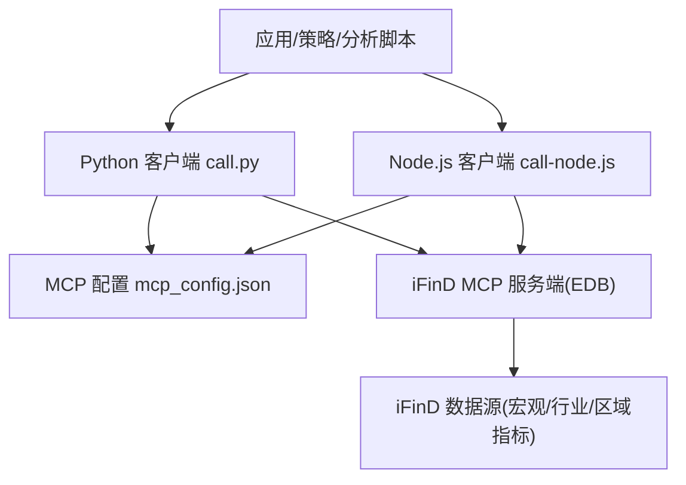
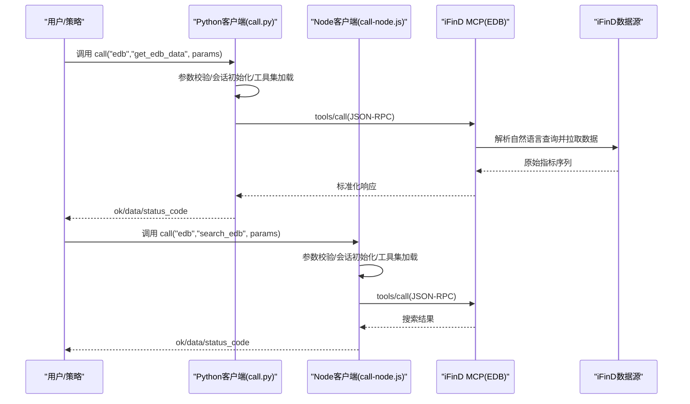
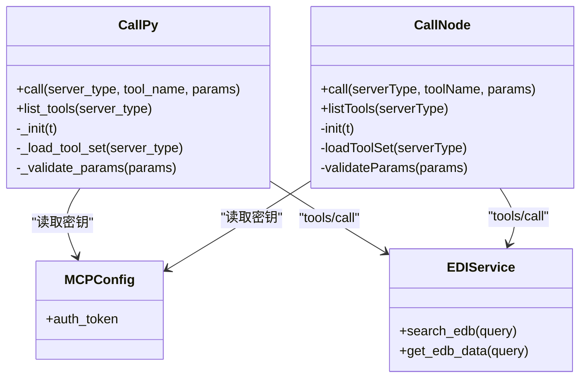
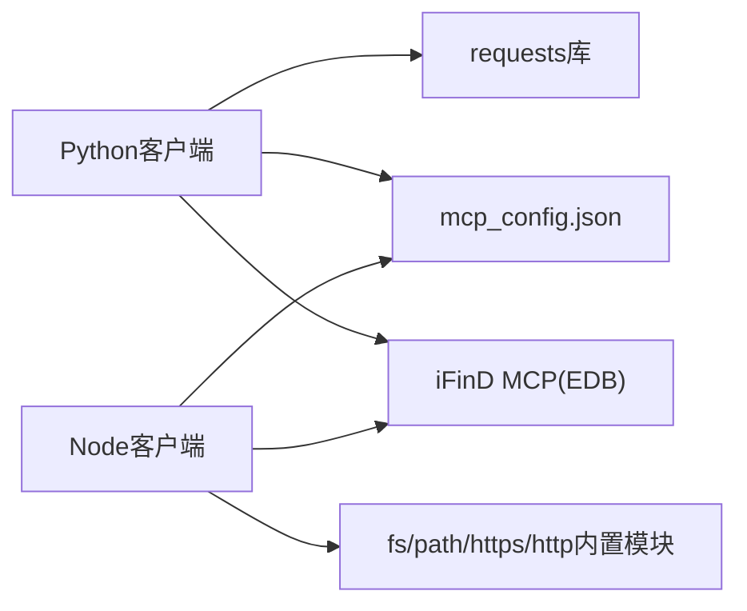
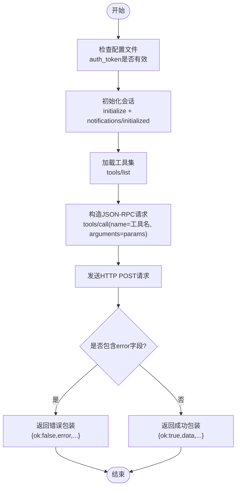

# 经济数据库API

<cite>
**本文引用的文件**   
- [README.MD](file://README.MD)
- [SKILL.md](file://skills/ifind-finance-data-1.3.0/SKILL.md)
- [edb.md](file://skills/ifind-finance-data-1.3.0/references/edb.md)
- [call.py](file://skills/ifind-finance-data-1.3.0/call.py)
- [call-node.js](file://skills/ifind-finance-data-1.3.0/call-node.js)
- [mcp_config.json](file://skills/ifind-finance-data-1.3.0/mcp_config.json)
</cite>

## 目录
1. [简介](#简介)
2. [项目结构](#项目结构)
3. [核心组件](#核心组件)
4. [架构总览](#架构总览)
5. [详细组件分析](#详细组件分析)
6. [依赖关系分析](#依赖关系分析)
7. [性能与并发特性](#性能与并发特性)
8. [数据质量与治理规范](#数据质量与治理规范)
9. [接口参考与使用示例](#接口参考与使用示例)
10. [故障排查指南](#故障排查指南)
11. [结论](#结论)
12. [附录：最佳实践与技巧](#附录最佳实践与技巧)

## 简介
本文件面向“经济数据库API”的使用者与开发者，聚焦宏观经济、行业经济与区域经济指标的查询能力。系统通过同花顺 iFinD 金融数据 MCP 服务提供自然语言取数能力，支持“先搜索再取数”的工作流，覆盖 GDP、CPI、PPI、利率、汇率等宏观指标以及行业与区域相关指标。文档同时给出时间序列数据处理、数据清洗与转换的技术规范，并提供批量查询、导出与可视化分析的实用技巧。

## 项目结构
本项目采用模块化设计，数据能力以 Skills 形式封装，其中 ifind-finance-data 技能负责对接 iFinD 数据服务（含 EDB 宏观行业经济指标）。调用层提供 Python 与 Node.js 两套客户端脚本，统一通过 JSON-RPC 协议与远端 MCP 服务器交互。

图表来源
- [SKILL.md:1-111](file://skills/ifind-finance-data-1.3.0/SKILL.md#L1-L111)
- [edb.md:1-41](file://skills/ifind-finance-data-1.3.0/references/edb.md#L1-L41)
- [call.py:1-208](file://skills/ifind-finance-data-1.3.0/call.py#L1-L208)
- [call-node.js:1-267](file://skills/ifind-finance-data-1.3.0/call-node.js#L1-L267)
- [mcp_config.json:1-3](file://skills/ifind-finance-data-1.3.0/mcp_config.json#L1-L3)

章节来源
- [README.MD:1-81](file://README.MD#L1-L81)
- [SKILL.md:1-111](file://skills/ifind-finance-data-1.3.0/SKILL.md#L1-L111)

## 核心组件
- 经济数据库服务（server_type="edb"）
  - search_edb：指标搜索，用于在不确定具体指标时进行关键词检索
  - get_edb_data：指标数据查询，基于自然语言描述的时间序列获取
- 通用客户端
  - Python 客户端 call.py：封装初始化、工具列表加载、参数校验、JSON-RPC 调用
  - Node.js 客户端 call-node.js：同上，异步实现
- 配置
  - mcp_config.json：存放 auth_token，供两个客户端共用

章节来源
- [edb.md:1-41](file://skills/ifind-finance-data-1.3.0/references/edb.md#L1-L41)
- [SKILL.md:69-111](file://skills/ifind-finance-data-1.3.0/SKILL.md#L69-L111)
- [call.py:1-208](file://skills/ifind-finance-data-1.3.0/call.py#L1-L208)
- [call-node.js:1-267](file://skills/ifind-finance-data-1.3.0/call-node.js#L1-L267)
- [mcp_config.json:1-3](file://skills/ifind-finance-data-1.3.0/mcp_config.json#L1-L3)

## 架构总览
经济数据库 API 的整体流程如下：客户端通过统一的 call/list_tools 函数发起请求，内部完成鉴权、会话初始化、工具集发现与调用；EDB 服务返回结构化结果，由上层进行解析与后处理。

图表来源
- [call.py:85-171](file://skills/ifind-finance-data-1.3.0/call.py#L85-L171)
- [call-node.js:149-220](file://skills/ifind-finance-data-1.3.0/call-node.js#L149-L220)
- [edb.md:1-41](file://skills/ifind-finance-data-1.3.0/references/edb.md#L1-L41)

## 详细组件分析

### 经济数据库服务（EDB）
- 功能定位
  - 支持“先搜索再取数”的自然语言取数模式
  - 覆盖宏观、行业、区域等多维指标
- 可用工具
  - search_edb：根据关键词检索可能的指标集合
  - get_edb_data：按“指标名称+时间范围”的自然语言描述获取时序数据
- 典型用法
  - 先用 search_edb 确定目标指标
  - 再用 get_edb_data 指定时间区间获取历史序列

章节来源
- [edb.md:1-41](file://skills/ifind-finance-data-1.3.0/references/edb.md#L1-L41)
- [SKILL.md:44-66](file://skills/ifind-finance-data-1.3.0/SKILL.md#L44-L66)

#### 类图（客户端与服务交互）

图表来源
- [call.py:1-208](file://skills/ifind-finance-data-1.3.0/call.py#L1-L208)
- [call-node.js:1-267](file://skills/ifind-finance-data-1.3.0/call-node.js#L1-L267)
- [mcp_config.json:1-3](file://skills/ifind-finance-data-1.3.0/mcp_config.json#L1-L3)
- [edb.md:1-41](file://skills/ifind-finance-data-1.3.0/references/edb.md#L1-L41)

### 客户端实现要点
- 参数校验
  - 仅允许基础类型与有限结构，拒绝危险键名与非法数值
- 会话管理
  - 首次调用自动 initialize，后续复用会话ID
- 工具集发现
  - 动态从服务端拉取可用工具清单，避免硬编码导致不一致
- 错误处理
  - 对 HTTP 状态码与 JSON-RPC error 字段进行统一包装

章节来源
- [call.py:59-83](file://skills/ifind-finance-data-1.3.0/call.py#L59-L83)
- [call.py:85-116](file://skills/ifind-finance-data-1.3.0/call.py#L85-L116)
- [call.py:119-134](file://skills/ifind-finance-data-1.3.0/call.py#L119-L134)
- [call.py:137-171](file://skills/ifind-finance-data-1.3.0/call.py#L137-L171)
- [call-node.js:81-115](file://skills/ifind-finance-data-1.3.0/call-node.js#L81-L115)
- [call-node.js:149-176](file://skills/ifind-finance-data-1.3.0/call-node.js#L149-L176)
- [call-node.js:178-220](file://skills/ifind-finance-data-1.3.0/call-node.js#L178-L220)

## 依赖关系分析
- 外部依赖
  - Python 方案需 requests 库
  - Node.js 方案无需额外依赖
- 运行时依赖
  - 网络可达性、HTTPS 证书验证关闭（开发环境），超时控制
- 配置依赖
  - auth_token 必须有效，否则鉴权失败

图表来源
- [SKILL.md:17-21](file://skills/ifind-finance-data-1.3.0/SKILL.md#L17-L21)
- [call.py:1-5](file://skills/ifind-finance-data-1.3.0/call.py#L1-L5)
- [call-node.js:1-8](file://skills/ifind-finance-data-1.3.0/call-node.js#L1-L8)
- [mcp_config.json:1-3](file://skills/ifind-finance-data-1.3.0/mcp_config.json#L1-L3)

章节来源
- [SKILL.md:17-21](file://skills/ifind-finance-data-1.3.0/SKILL.md#L17-L21)
- [call.py:1-5](file://skills/ifind-finance-data-1.3.0/call.py#L1-L5)
- [call-node.js:1-8](file://skills/ifind-finance-data-1.3.0/call-node.js#L1-L8)

## 性能与并发特性
- 并发上限
  - 免费用户每秒最多并发 2 个请求
  - 个人版正式用户为 5 个
  - 企业版正式用户为 10 个
- 建议
  - 合理拆分批量任务，避免单次请求过大
  - 结合 list_tools 动态适配权限差异，减少无效重试

章节来源
- [SKILL.md:26-28](file://skills/ifind-finance-data-1.3.0/SKILL.md#L26-L28)

## 数据质量与治理规范
- 数据源权威性
  - 数据来源于同花顺 iFinD 金融数据服务，具备权威性与广泛覆盖度
- 更新周期
  - 不同指标具有不同发布频率（日频、月频、季频、年频等），具体以指标定义为准
- 缺失值处理
  - 建议在本地进行缺失值识别与填充（前向填充、插值或标记缺失），并在输出中保留元信息
- 数据标准化
  - 统一单位与口径（如同比/环比、指数基期、货币单位），必要时做去噪与异常值检测
- 版本与回溯
  - 记录查询时间与数据快照版本，便于复现与审计

[本节为通用规范说明，不直接分析具体代码文件]

## 接口参考与使用示例

### 接口概览（EDB）
- server_type
  - "edb"
- 工具与方法
  - search_edb：指标搜索
  - get_edb_data：指标数据查询
- 参数约定
  - query：自然语言描述，包含指标名称与时间范围等信息

章节来源
- [edb.md:1-41](file://skills/ifind-finance-data-1.3.0/references/edb.md#L1-L41)
- [SKILL.md:44-66](file://skills/ifind-finance-data-1.3.0/SKILL.md#L44-L66)

### 常用宏观指标查询示例（思路与步骤）
- GDP
  - 先搜索：使用 search_edb 输入“国内生产总值/GDP”
  - 再取数：使用 get_edb_data 指定季度或年度时间范围
- CPI
  - 先搜索：使用 search_edb 输入“居民消费价格指数/CPI”
  - 再取数：使用 get_edb_data 指定月度时间范围
- PPI
  - 先搜索：使用 search_edb 输入“工业生产者出厂价格指数/PPI”
  - 再取数：使用 get_edb_data 指定月度时间范围
- 利率
  - 先搜索：使用 search_edb 输入“政策利率/市场利率/SHIBOR/LPR”
  - 再取数：使用 get_edb_data 指定相应频率与区间
- 汇率
  - 先搜索：使用 search_edb 输入“美元兑人民币中间价/即期汇率”
  - 再取数：使用 get_edb_data 指定日频或周频区间

提示
- 若不确定具体指标名称，优先使用 search_edb 缩小范围，再精确到 get_edb_data
- 时间范围建议使用“YYYYMM-YYYYMM”格式的自然语言表达

章节来源
- [edb.md:1-41](file://skills/ifind-finance-data-1.3.0/references/edb.md#L1-L41)
- [SKILL.md:60-66](file://skills/ifind-finance-data-1.3.0/SKILL.md#L60-L66)

### 调用流程（Python/Node.js）

图表来源
- [call.py:85-171](file://skills/ifind-finance-data-1.3.0/call.py#L85-L171)
- [call-node.js:149-220](file://skills/ifind-finance-data-1.3.0/call-node.js#L149-L220)

## 故障排查指南
- 常见错误
  - 未配置或无效 auth_token：鉴权失败
  - 工具不存在或名称变更：通过 list_tools 获取当前可用工具清单
  - 参数类型不合法：触发参数校验异常
  - 网络超时或HTTP错误：检查网络连通性与超时设置
- 排查步骤
  - 确认 mcp_config.json 中的 auth_token 正确
  - 使用 list_tools 验证服务端实际可用工具
  - 简化 query 参数，逐步定位问题
  - 查看返回的 status_code 与 error 字段

章节来源
- [SKILL.md:99-111](file://skills/ifind-finance-data-1.3.0/SKILL.md#L99-L111)
- [call.py:137-171](file://skills/ifind-finance-data-1.3.0/call.py#L137-L171)
- [call-node.js:178-220](file://skills/ifind-finance-data-1.3.0/call-node.js#L178-L220)

## 结论
经济数据库API通过自然语言取数与“先搜索再取数”的模式，显著降低了宏观与行业指标的获取门槛。配合标准化的客户端实现与完善的错误处理机制，可在保证稳定性的前提下高效完成多指标、多区间的时序数据获取。建议在业务侧完善数据治理与可视化链路，形成从取数、清洗、计算到展示的一体化工作流。

[本节为总结性内容，不直接分析具体代码文件]

## 附录：最佳实践与技巧
- 先搜再查
  - 针对宏观行业指标，先用 search_edb 明确指标，再用 get_edb_data 精准取数
- 合并查询
  - 股票/基金数据支持多主体、多指标合并，但数量不宜过多；宏观指标建议分批次、分主题组织
- 并发控制
  - 遵循免费/个人/企业版的并发上限，避免触发限流
- 工具清单校验
  - 当工具调用异常或疑似权限不足时，使用 list_tools 获取真实可用工具集
- 高频实时行情
  - 若需求属于日内高频或实时行情，请切换到对应服务的引用文档并按其规范调用

章节来源
- [SKILL.md:60-66](file://skills/ifind-finance-data-1.3.0/SKILL.md#L60-L66)
- [SKILL.md:26-28](file://skills/ifind-finance-data-1.3.0/SKILL.md#L26-L28)
- [SKILL.md:99-111](file://skills/ifind-finance-data-1.3.0/SKILL.md#L99-L111)