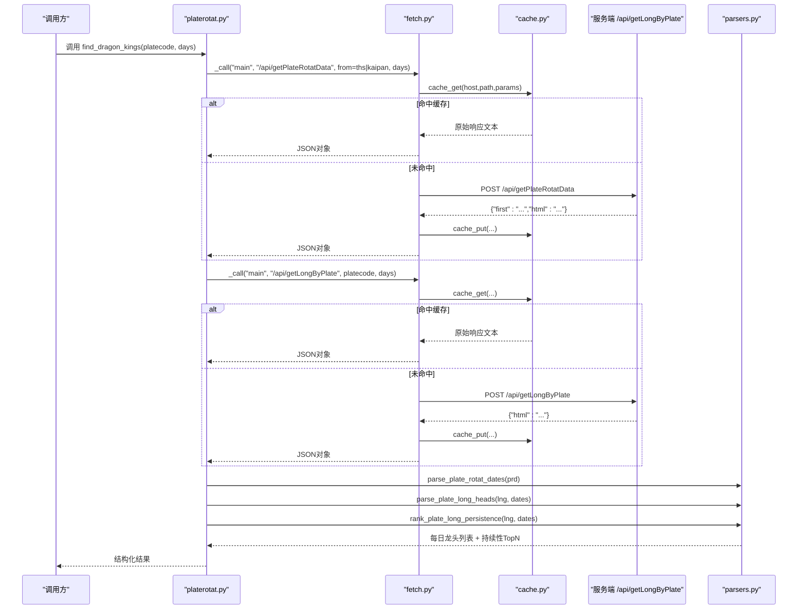
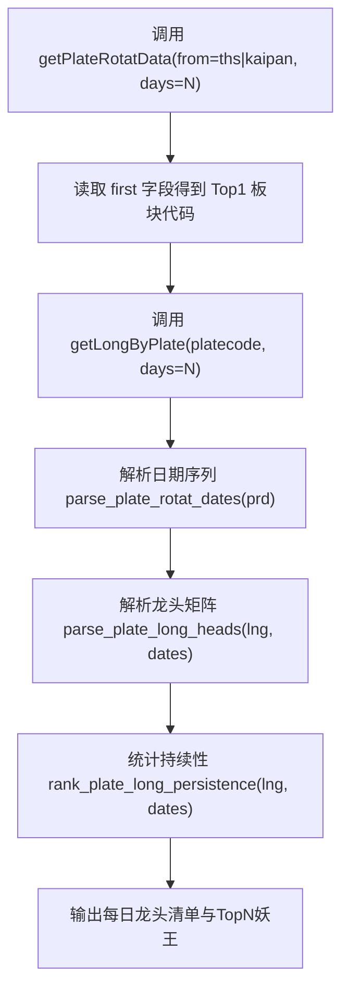
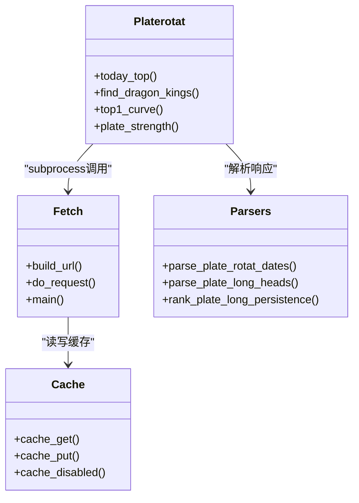

# 按板块获取龙头股API

<cite>
**本文引用的文件**
- [api_getlongbyplate.md](file://skills/plate-rotation-skill/references/api_getlongbyplate.md)
- [api_getplaterotatdata.md](file://skills/plate-rotation-skill/references/api_getplaterotatdata.md)
- [stock-facts.md](file://skills/plate-rotation-skill/references/stock-facts.md)
- [fetch.py](file://skills/plate-rotation-skill/scripts/fetch.py)
- [parsers.py](file://skills/plate-rotation-skill/scripts/parsers.py)
- [platerotat.py](file://skills/plate-rotation-skill/scripts/platerotat.py)
- [cache.py](file://skills/plate-rotation-skill/scripts/cache.py)
</cite>

## 目录
1. [简介](#简介)
2. [项目结构](#项目结构)
3. [核心组件](#核心组件)
4. [架构总览](#架构总览)
5. [详细接口规范](#详细接口规范)
6. [依赖与调用关系分析](#依赖与调用关系分析)
7. [性能与缓存策略](#性能与缓存策略)
8. [异常处理与重试机制](#异常处理与重试机制)
9. [故障排查指南](#故障排查指南)
10. [结论](#结论)

## 简介
本文件面向“按板块获取龙头股”的接口，聚焦于 /api/getLongByPlate 的完整规范、参数来源与使用方法、返回数据结构与解析要点、以及从“板块轮动数据获取Top1板块代码并查询龙头股”的端到端调用流程。同时给出数据时效性说明、缓存策略与异常处理最佳实践。

## 项目结构
该能力位于 skills/plate-rotation-skill 子模块中，包含：
- references：接口参考文档与领域事实手册
- scripts：网络请求封装、HTML解析器、高级组合函数、本地缓存层
- README：使用说明与方法论

```mermaid
graph TB
subgraph "引用文档"
R1["api_getlongbyplate.md"]
R2["api_getplaterotatdata.md"]
R3["stock-facts.md"]
end
subgraph "脚本实现"
S1["fetch.py"]
S2["parsers.py"]
S3["platerotat.py"]
S4["cache.py"]
end
R1 --> S1
R1 --> S2
R2 --> S3
R3 --> S1
R3 --> S2
S1 --> S4
S3 --> S1
S3 --> S2
```

图表来源
- [api_getlongbyplate.md:1-65](file://skills/plate-rotation-skill/references/api_getlongbyplate.md#L1-L65)
- [api_getplaterotatdata.md:1-74](file://skills/plate-rotation-skill/references/api_getplaterotatdata.md#L1-L74)
- [stock-facts.md:1-118](file://skills/plate-rotation-skill/references/stock-facts.md#L1-L118)
- [fetch.py:1-230](file://skills/plate-rotation-skill/scripts/fetch.py#L1-L230)
- [parsers.py:1-212](file://skills/plate-rotation-skill/scripts/parsers.py#L1-L212)
- [platerotat.py:1-315](file://skills/plate-rotation-skill/scripts/platerotat.py#L1-L315)
- [cache.py:1-145](file://skills/plate-rotation-skill/scripts/cache.py#L1-L145)

章节来源
- [api_getlongbyplate.md:1-65](file://skills/plate-rotation-skill/references/api_getlongbyplate.md#L1-L65)
- [api_getplaterotatdata.md:1-74](file://skills/plate-rotation-skill/references/api_getplaterotatdata.md#L1-L74)
- [stock-facts.md:1-118](file://skills/plate-rotation-skill/references/stock-facts.md#L1-L118)

## 核心组件
- fetch.py：统一HTTP调用器，负责URL构建、Header注入、重试与缓存读写
- parsers.py：HTML片段解析器，提供 getLongByPlate 响应解析与跨天统计
- platerotat.py：高级组合函数，封装“取Top1板块→查龙头→统计妖王”等流程
- cache.py：本地磁盘缓存层，TTL默认1小时，支持全局开关与环境变量控制
- references：接口定义与领域知识（如涨跌停规则、交易日语义）

章节来源
- [fetch.py:1-230](file://skills/plate-rotation-skill/scripts/fetch.py#L1-L230)
- [parsers.py:1-212](file://skills/plate-rotation-skill/scripts/parsers.py#L1-L212)
- [platerotat.py:1-315](file://skills/plate-rotation-skill/scripts/platerotat.py#L1-L315)
- [cache.py:1-145](file://skills/plate-rotation-skill/scripts/cache.py#L1-L145)

## 架构总览
整体调用链：上层业务或CLI → platerotat.py（高级函数）→ fetch.py（网络请求）→ 服务端 /api/getLongByPlate → 返回JSON含html字段 → parsers.py解析为结构化龙头矩阵。

图表来源
- [platerotat.py:125-172](file://skills/plate-rotation-skill/scripts/platerotat.py#L125-L172)
- [fetch.py:128-213](file://skills/plate-rotation-skill/scripts/fetch.py#L128-L213)
- [cache.py:59-94](file://skills/plate-rotation-skill/scripts/cache.py#L59-L94)
- [parsers.py:105-174](file://skills/plate-rotation-skill/scripts/parsers.py#L105-L174)

## 详细接口规范

### 接口基本信息
- 路径：/api/getLongByPlate
- 方法：POST
- Host别名：main（实际域名见 fetch.py HOSTS）
- 分类：板块轮动
- 数据来源：后端返回JSON，其中 html 字段包含表格HTML片段，需由解析器提取

章节来源
- [api_getlongbyplate.md:1-15](file://skills/plate-rotation-skill/references/api_getlongbyplate.md#L1-L15)
- [fetch.py:38-42](file://skills/plate-rotation-skill/scripts/fetch.py#L38-L42)

### 输入参数
- platecode（必填，字符串）：板块代码，例如 886084（F5G概念）。可从 getPlateRotatData 响应的 first 字段获取当日Top1板块代码；也可从 getPlateRotatData 的 HTML 中 <td class='plate plate{code}'> 提取任意板块代码。注意：同花顺前缀为 88x，开盘啦前缀为 80x/803x，不可跨源混用。
- days（必填，整数）：回溯天数，支持 10 | 20 | 30 | 50
- dates（可选，字符串）：自定义日期（YYYY-MM-DD，逗号分隔），为空则按 days 回溯

章节来源
- [api_getlongbyplate.md:24-31](file://skills/plate-rotation-skill/references/api_getlongbyplate.md#L24-L31)
- [api_getplaterotatdata.md:22-28](file://skills/plate-rotation-skill/references/api_getplaterotatdata.md#L22-L28)
- [stock-facts.md:21-32](file://skills/plate-rotation-skill/references/stock-facts.md#L21-L32)

### 输出字段
- 顶层字段：
  - html（字符串）：包含表格HTML片段，需使用 parsers.parse_plate_long_heads 解析
- 解析后结构（由 parsers 提供）：
  - 每日龙头清单：[{date, heads:[{rank, code, name}, ...]}, ...]
  - 跨天持续性TopN：[{code, name, count, positions:['YYYY-MM-DD/龙一', ...]}, ...]

注意：
- 当某日无领涨时，对应 td 文本为“当日无领涨”，heads 为空列表，属于合法返回值
- tds 顺序与 getPlateRotatData 的 dates 顺序一致（newest first）

章节来源
- [api_getlongbyplate.md:32-53](file://skills/plate-rotation-skill/references/api_getlongbyplate.md#L32-L53)
- [parsers.py:113-153](file://skills/plate-rotation-skill/scripts/parsers.py#L113-L153)
- [stock-facts.md:39-44](file://skills/plate-rotation-skill/references/stock-facts.md#L39-L44)

### 龙头股的定义标准与筛选逻辑
- 龙头定义：在指定板块内，按“龙头排名”（龙一至龙五）列示的个股，代表该板块当日最具代表性的领涨标的
- 筛选逻辑：
  - 服务端返回的 HTML 中包含若干 div.kline，每个包含 code、rank（龙一等）、name
  - 若某日无活跃个股，则返回“当日无领涨”，表示该板块当日无龙头
  - 通过 parsers 对 HTML 进行正则抽取，得到每日龙头清单与跨天持续性统计

章节来源
- [api_getlongbyplate.md:44-53](file://skills/plate-rotation-skill/references/api_getlongbyplate.md#L44-L53)
- [parsers.py:113-153](file://skills/plate-rotation-skill/scripts/parsers.py#L113-L153)

### 返回的股票数据结构
- 每日龙头项：
  - rank：字符串，如“龙一”“龙二”等
  - code：6位股票代码
  - name：股票名称
- 持续性TopN项：
  - code：6位股票代码
  - name：股票名称
  - count：上榜次数
  - positions：历史上榜记录，形如“YYYY-MM-DD/龙三”

注意：
- 该接口不直接返回涨跌幅、成交量等指标；如需这些指标，请结合其他接口（如个股K线、资金流向等）另行获取

章节来源
- [parsers.py:113-153](file://skills/plate-rotation-skill/scripts/parsers.py#L113-L153)
- [parsers.py:156-174](file://skills/plate-rotation-skill/scripts/parsers.py#L156-L174)

### 从“板块轮动数据获取Top1板块代码并查询龙头股”的完整调用流程
- 步骤1：调用 /api/getPlateRotatData（from=ths|kaipan, days=N），从响应 first 字段拿到当日Top1板块代码
- 步骤2：将 Top1 板块代码作为 platecode，调用 /api/getLongByPlate（days=N）
- 步骤3：使用 parsers.parse_plate_rotat_dates 解析日期序列，再使用 parsers.parse_plate_long_heads 解析每日龙头清单
- 步骤4：使用 parsers.rank_plate_long_persistence 计算跨天持续性TopN（找“妖王”）

图表来源
- [api_getplaterotatdata.md:30-35](file://skills/plate-rotation-skill/references/api_getplaterotatdata.md#L30-L35)
- [api_getplaterotatdata.md:72-74](file://skills/plate-rotation-skill/references/api_getplaterotatdata.md#L72-L74)
- [parsers.py:105-174](file://skills/plate-rotation-skill/scripts/parsers.py#L105-L174)
- [platerotat.py:125-172](file://skills/plate-rotation-skill/scripts/platerotat.py#L125-L172)

章节来源
- [api_getplaterotatdata.md:30-35](file://skills/plate-rotation-skill/references/api_getplaterotatdata.md#L30-L35)
- [api_getplaterotatdata.md:72-74](file://skills/plate-rotation-skill/references/api_getplaterotatdata.md#L72-L74)
- [parsers.py:105-174](file://skills/plate-rotation-skill/scripts/parsers.py#L105-L174)
- [platerotat.py:125-172](file://skills/plate-rotation-skill/scripts/platerotat.py#L125-L172)

## 依赖与调用关系分析
- fetch.py 负责：
  - URL构建（host别名映射到真实域名）
  - Header注入（Referer、Origin、UA等）
  - 指数退避重试（针对429/5xx及网络异常）
  - 缓存读写（仅POST请求默认启用）
- parsers.py 负责：
  - 从 getPlateRotatData 的 HTML 中提取日期序列与板块TopN
  - 从 getLongByPlate 的 HTML 中提取每日龙头与持续性TopN
- platerotat.py 负责：
  - 组合底层接口，提供 today_top、find_dragon_kings、top1_curve、plate_strength 等高级函数
  - 运行时校验与PR-EMPTY/PR-WARN提示
- cache.py 负责：
  - 本地磁盘缓存（~/.cache/plate-rotation），TTL默认1小时
  - 环境变量 PR_CACHE_DISABLE 可全局关闭缓存

图表来源
- [fetch.py:68-124](file://skills/plate-rotation-skill/scripts/fetch.py#L68-L124)
- [cache.py:41-94](file://skills/plate-rotation-skill/scripts/cache.py#L41-L94)
- [parsers.py:105-174](file://skills/plate-rotation-skill/scripts/parsers.py#L105-L174)
- [platerotat.py:100-218](file://skills/plate-rotation-skill/scripts/platerotat.py#L100-L218)

章节来源
- [fetch.py:1-230](file://skills/plate-rotation-skill/scripts/fetch.py#L1-230)
- [parsers.py:1-212](file://skills/plate-rotation-skill/scripts/parsers.py#L1-212)
- [platerotat.py:1-315](file://skills/plate-rotation-skill/scripts/platerotat.py#L1-315)
- [cache.py:1-145](file://skills/plate-rotation-skill/scripts/cache.py#L1-L145)

## 性能与缓存策略
- 缓存策略：
  - 默认开启（仅POST请求），TTL=3600秒（1小时）
  - Key由 host+path+sorted(params) 哈希生成，保证参数顺序无关
  - 支持环境变量 PR_CACHE_DISABLE=1 全局关闭，或 --no-cache 单次禁用
  - 支持 --cache-ttl 调整新鲜度阈值
- 性能建议：
  - 盘中需要分钟级实时：使用 --no-cache 或 --cache-ttl 60
  - 批量拉取多日数据：复用同一 days 参数以提升命中率
  - 避免重复请求：优先使用 platerotat.find_dragon_kings 组合函数，内部已优化两次调用与解析

章节来源
- [fetch.py:159-212](file://skills/plate-rotation-skill/scripts/fetch.py#L159-L212)
- [cache.py:35-94](file://skills/plate-rotation-skill/scripts/cache.py#L35-L94)
- [stock-facts.md:87-92](file://skills/plate-rotation-skill/references/stock-facts.md#L87-L92)

## 异常处理与重试机制
- 重试策略：
  - 对429/500/502/503/504及网络异常执行指数退避（最多3次，间隔1s/2s/4s）
  - 非重试状态码（其他4xx）直接抛出错误
- 超时与错误：
  - 默认超时15秒，可通过 --timeout 调整
  - 最终失败抛出 RuntimeError，包含最近一次错误详情
- 健壮性提示：
  - 周末/节假日可能返回上一交易日数据，不会抛错
  - 跨源传错（如88x传给kaipan）会触发PR-EMPTY警告

章节来源
- [fetch.py:47-124](file://skills/plate-rotation-skill/scripts/fetch.py#L47-L124)
- [platerotat.py:85-98](file://skills/plate-rotation-skill/scripts/platerotat.py#L85-L98)
- [stock-facts.md:61-66](file://skills/plate-rotation-skill/references/stock-facts.md#L61-L66)

## 故障排查指南
- 常见问题与定位：
  - 返回空数据：检查是否为周末/节假日；确认 days 是否超前；核对 source 与 platecode 前缀匹配
  - 跨源错误：确保 88x 走 ths，80x/803x 走 kaipan
  - HTML解析失败：不要自行逆向HTML，直接使用 parsers 提供的函数
  - 缓存导致数据陈旧：使用 --no-cache 或减小 --cache-ttl
- 诊断工具：
  - 使用 fetch.py 的 -v 参数打印URL、Body与重试信息
  - 使用 cache.py stats/clear 查看与清理缓存
  - 关注 stderr 中的 PR-EMPTY/PR-WARN 提示

章节来源
- [stock-facts.md:21-32](file://skills/plate-rotation-skill/references/stock-facts.md#L21-L32)
- [stock-facts.md:39-44](file://skills/plate-rotation-skill/references/stock-facts.md#L39-L44)
- [fetch.py:193-207](file://skills/plate-rotation-skill/scripts/fetch.py#L193-L207)
- [cache.py:119-128](file://skills/plate-rotation-skill/scripts/cache.py#L119-L128)

## 结论
/api/getLongByPlate 提供按板块获取龙头股的标准化能力，配合 getPlateRotatData 可快速定位当日最强板块并深入分析其龙头持续性。通过统一的网络层、解析层与缓存层，系统具备良好的鲁棒性与易用性。建议在业务侧遵循“先事实、后解读”的原则，结合双源交叉验证与运行时校验，获得更可靠的分析结论。