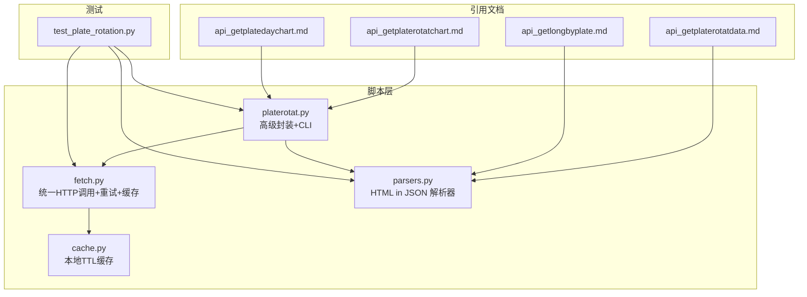
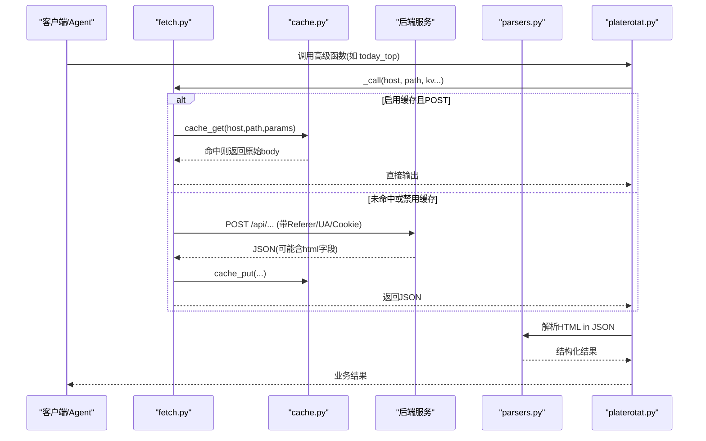
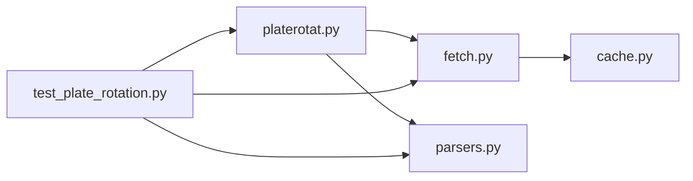

# 板块轮动分析API

<cite>
**本文引用的文件**   
- [api_getplaterotatdata.md](file://skills/plate-rotation-skill/references/api_getplaterotatdata.md)
- [api_getlongbyplate.md](file://skills/plate-rotation-skill/references/api_getlongbyplate.md)
- [api_getplaterotatchart.md](file://skills/plate-rotation-skill/references/api_getplaterotatchart.md)
- [api_getplatedaychart.md](file://skills/plate-rotation-skill/references/api_getplatedaychart.md)
- [parsers.py](file://skills/plate-rotation-skill/scripts/parsers.py)
- [fetch.py](file://skills/plate-rotation-skill/scripts/fetch.py)
- [cache.py](file://skills/plate-rotation-skill/scripts/cache.py)
- [platerotat.py](file://skills/plate-rotation-skill/scripts/platerotat.py)
- [test_plate_rotation.py](file://skills/plate-rotation-skill/tests/test_plate_rotation.py)
- [README.md](file://skills/plate-rotation-skill/README.md)
</cite>

## 目录
1. [简介](#简介)
2. [项目结构](#项目结构)
3. [核心组件](#核心组件)
4. [架构总览](#架构总览)
5. [详细接口规范](#详细接口规范)
6. [依赖关系分析](#依赖关系分析)
7. [性能与缓存策略](#性能与缓存策略)
8. [错误处理与排障](#错误处理与排障)
9. [结论](#结论)
10. [附录：调用示例与最佳实践](#附录调用示例与最佳实践)

## 简介
本文件为“板块轮动分析”系列 API 的完整接口文档，覆盖四个核心端点：
- 获取今日最强板块数据（api_getplaterotatdata）
- 按板块获取龙头股（api_getlongbyplate）
- 获取板块轮动图表数据（api_getplaterotatchart）
- 获取板块日线图表数据（api_getplatedaychart）

这些接口统一由后端提供 JSON 响应，其中部分接口返回 HTML 片段嵌入在 JSON 字段中，需配合解析器进行二次抽取。系统支持双源数据（同花顺 ths、开盘啦 kaipan），并在数值语义、单位、排序方向上存在差异。

## 项目结构
该能力位于 skills/plate-rotation-skill 下，包含参考文档、脚本实现、测试与说明：
- references：各接口的参考定义与样例
- scripts：网络请求封装、HTML 解析、高级封装与 CLI
- tests：在线集成测试，验证接口健康度与解析正确性
- README：整体使用说明与方法论

图示来源
- [api_getplaterotatdata.md:1-74](file://skills/plate-rotation-skill/references/api_getplaterotatdata.md#L1-L74)
- [api_getlongbyplate.md:1-65](file://skills/plate-rotation-skill/references/api_getlongbyplate.md#L1-L65)
- [api_getplaterotatchart.md:1-53](file://skills/plate-rotation-skill/references/api_getplaterotatchart.md#L1-L53)
- [api_getplatedaychart.md:1-48](file://skills/plate-rotation-skill/references/api_getplatedaychart.md#L1-L48)
- [fetch.py:1-230](file://skills/plate-rotation-skill/scripts/fetch.py#L1-L230)
- [cache.py:1-145](file://skills/plate-rotation-skill/scripts/cache.py#L1-L145)
- [parsers.py:1-212](file://skills/plate-rotation-skill/scripts/parsers.py#L1-L212)
- [platerotat.py:1-315](file://skills/plate-rotation-skill/scripts/platerotat.py#L1-L315)
- [test_plate_rotation.py:1-444](file://skills/plate-rotation-skill/tests/test_plate_rotation.py#L1-L444)

章节来源
- [README.md:1-188](file://skills/plate-rotation-skill/README.md#L1-L188)

## 核心组件
- fetch.py：统一的 HTTP 调用器，负责构建 URL、注入请求头、重试与缓存；对外暴露 main() 函数与 CLI。
- cache.py：本地 TTL 缓存，默认 1 小时，支持环境变量开关与清理统计。
- parsers.py：针对“HTML 片段嵌在 JSON 的 html 字段里”的解析器，提供 Top 板块、日期序列、矩阵、龙头股等解析函数。
- platerotat.py：高级封装，组合底层接口与解析器，提供 today_top / find_dragon_kings / top1_curve / plate_strength 四个高层函数及 CLI。
- test_plate_rotation.py：在线集成测试，覆盖四大接口健康度、解析器正确性与高级封装行为。

章节来源
- [fetch.py:1-230](file://skills/plate-rotation-skill/scripts/fetch.py#L1-L230)
- [cache.py:1-145](file://skills/plate-rotation-skill/scripts/cache.py#L1-L145)
- [parsers.py:1-212](file://skills/plate-rotation-skill/scripts/parsers.py#L1-L212)
- [platerotat.py:1-315](file://skills/plate-rotation-skill/scripts/platerotat.py#L1-L315)
- [test_plate_rotation.py:1-444](file://skills/plate-rotation-skill/tests/test_plate_rotation.py#L1-L444)

## 架构总览
下图展示了从客户端到后端的调用链路，以及缓存、重试、解析与上层封装的关系。

图示来源
- [fetch.py:128-213](file://skills/plate-rotation-skill/scripts/fetch.py#L128-L213)
- [cache.py:59-95](file://skills/plate-rotation-skill/scripts/cache.py#L59-L95)
- [platerotat.py:55-71](file://skills/plate-rotation-skill/scripts/platerotat.py#L55-L71)
- [parsers.py:20-108](file://skills/plate-rotation-skill/scripts/parsers.py#L20-L108)

## 详细接口规范

### 通用约定
- Host 别名：main | data | x | ext（ext 表示传入完整 URL）
- 默认 Host：main → https://duanxianxia.com
- 请求方法：全部为 POST
- 参数传递：优先使用 -p 传入 JSON；否则以 key=value 形式作为表单参数
- 请求头：自动注入 UA、Referer、Origin、X-Requested-With；可选 Cookie（PR_COOKIE 或 ~/.plate_rotation_cookie）
- 重试策略：对 429/5xx 与网络异常指数退避，最多 3 次（1s/2s/4s）
- 缓存策略：POST 默认开启本地缓存，TTL 默认 3600s，可通过 --no-cache 或 PR_CACHE_DISABLE=1 关闭

章节来源
- [fetch.py:38-51](file://skills/plate-rotation-skill/scripts/fetch.py#L38-L51)
- [fetch.py:128-213](file://skills/plate-rotation-skill/scripts/fetch.py#L128-L213)
- [cache.py:35-44](file://skills/plate-rotation-skill/scripts/cache.py#L35-L44)

---

### 接口一：获取今日最强板块数据（api_getplaterotatdata）
- 分类：板块轮动
- Host：main
- Method：POST
- Path：/api/getPlateRotatData

#### 请求参数
| 名称 | 类型 | 必选 | 描述 |
| --- | --- | --- | --- |
| from | string | 是 | 数据来源：ths（同花顺）或 kaipan（开盘啦） |
| days | int | 是 | 回溯天数：10/20/30/50 |
| dates | string | 否 | 自定义日期（YYYY-MM-DD，逗号分隔），为空则按 days 回溯 |

#### 响应结构
- first：string，当日 Top1 板块代码（可从 body_head 正则抽取）
- html：string，HTML 片段，包含排名、板块 code/name、当日值等

#### 字段语义与单位
- 当 from=ths：数值字段为“当日板块涨幅 %”，单位带 % 符号（如 4.94%），越大越强
- 当 from=kaipan：数值字段为“板块强度分”，纯整数（如 15199），综合多因子，越大越强
- 板块代码前缀：
  - 80x/803x 开头 → 开盘啦板块
  - 88x 开头 → 同花顺板块

#### HTML 解析模板要点
- 表头日期顺序 newest→oldest
- 每个板块行包含 rank、code、name、value（第一个 td 为当天值）
- value 颜色 red/green 指示涨跌

#### 解析辅助
- 推荐通过 parsers.parse_plate_rotat(data, source='ths'|'kaipan') 得到结构化列表
- response.first 可直接用于 api_getlongbyplate 的 platecode

章节来源
- [api_getplaterotatdata.md:1-74](file://skills/plate-rotation-skill/references/api_getplaterotatdata.md#L1-L74)
- [parsers.py:20-65](file://skills/plate-rotation-skill/scripts/parsers.py#L20-L65)
- [parsers.py:105-108](file://skills/plate-rotation-skill/scripts/parsers.py#L105-L108)

---

### 接口二：按板块获取龙头股（api_getlongbyplate）
- 分类：板块轮动
- Host：main
- Method：POST
- Path：/api/getLongByPlate

#### 请求参数
| 名称 | 类型 | 必选 | 描述 |
| --- | --- | --- | --- |
| platecode | string | 是 | 板块代码，如 886084（F5G概念），可从 getPlateRotatData.first 获取 |
| days | int | 是 | 回溯天数：10/20/30/50 |
| dates | string | 否 | 自定义日期，空则按 days 回溯 |

#### 响应结构
- html：string，HTML 片段，顶层 table，每个 td 代表一天，内含 1~5 个 kline div（龙一到龙五）

#### 解析提示
- td 顺序与 getPlateRotatData 的 dates 对齐（newest first）
- 当日无领涨时 td 文本为“当日无领涨”
- 第 1 个 td 为标签头“领涨”，非数据，解析时需跳过

#### 解析辅助
- 使用 parsers.parse_plate_long_heads(lng, dates) 得到每日龙头清单
- 使用 parsers.rank_plate_long_persistence(lng, dates, top_n=15) 统计跨天上榜次数 Top N（找“妖王”）

章节来源
- [api_getlongbyplate.md:1-65](file://skills/plate-rotation-skill/references/api_getlongbyplate.md#L1-L65)
- [parsers.py:113-175](file://skills/plate-rotation-skill/scripts/parsers.py#L113-L175)

---

### 接口三：获取板块轮动图表数据（api_getplaterotatchart）
- 分类：板块轮动
- Host：main
- Method：POST
- Path：/api/getPlateRotatChart

#### 请求参数
| 名称 | 类型 | 必选 | 描述 |
| --- | --- | --- | --- |
| from | string | 是 | 数据来源：ths 或 kaipan |
| days | int | 是 | 回溯天数：10/20/30/50 |
| dates | string | 否 | 自定义日期（YYYY-MM-DD，逗号分隔），空则按 days 回溯 |

#### 响应结构（ECharts 数据）
- date：list，MM-DD 日期序列（newest first）
- legend：list，Top5 板块名（含“N次上榜”）
- name：object，{1..5: 板块名}
- 1..5：各为 Top5 中第 i 名的 N 日排名变化序列，每点 {value, symbol}
  - value=10.5 且 symbol=wu.png 表示当日未上榜

#### 解析提示
- 可直接用于 ECharts 渲染
- 建议结合 platerotat.top1_curve 获取 top5_names 便利字段

章节来源
- [api_getplaterotatchart.md:1-53](file://skills/plate-rotation-skill/references/api_getplaterotatchart.md#L1-L53)
- [platerotat.py:177-196](file://skills/plate-rotation-skill/scripts/platerotat.py#L177-L196)

---

### 接口四：获取板块日线图表数据（api_getplatedaychart）
- 分类：板块轮动
- Host：main
- Method：POST
- Path：/api/getPlateDayChart

#### 请求参数
| 名称 | 类型 | 必选 | 描述 |
| --- | --- | --- | --- |
| platecode | string | 是 | 板块代码，如 886084（F5G概念） |
| days | int | 是 | 回溯天数：10/20/30/50 |
| dates | string | 否 | 自定义日期，空则按 days 回溯 |

#### 响应结构
- legend：null 或 list，legend=null 表示该板块近 N 日未活跃，前端不渲染
- date：list，MM-DD 日期序列（newest first）
- 其他 series 键按需读取（由上层应用决定）

#### 解析提示
- 与 getLongByPlate 配套，同一 platecode + days 入参
- 若 date 为空，视为上游异常或板块无效

章节来源
- [api_getplatedaychart.md:1-48](file://skills/plate-rotation-skill/references/api_getplatedaychart.md#L1-L48)
- [platerotat.py:201-218](file://skills/plate-rotation-skill/scripts/platerotat.py#L201-L218)

## 依赖关系分析
- fetch.py 依赖 cache.py 做本地缓存；对外提供 do_request/main 等能力
- parsers.py 独立于 fetch，专注 HTML in JSON 的结构化抽取
- platerotat.py 组合 fetch 与 parsers，提供高级函数与 CLI
- tests 通过 subprocess 调用 fetch 与 platerotat，验证端到端行为

图示来源
- [fetch.py:1-230](file://skills/plate-rotation-skill/scripts/fetch.py#L1-L230)
- [cache.py:1-145](file://skills/plate-rotation-skill/scripts/cache.py#L1-L145)
- [parsers.py:1-212](file://skills/plate-rotation-skill/scripts/parsers.py#L1-L212)
- [platerotat.py:1-315](file://skills/plate-rotation-skill/scripts/platerotat.py#L1-L315)
- [test_plate_rotation.py:1-444](file://skills/plate-rotation-skill/tests/test_plate_rotation.py#L1-L444)

章节来源
- [fetch.py:1-230](file://skills/plate-rotation-skill/scripts/fetch.py#L1-L230)
- [cache.py:1-145](file://skills/plate-rotation-skill/scripts/cache.py#L1-L145)
- [parsers.py:1-212](file://skills/plate-rotation-skill/scripts/parsers.py#L1-L212)
- [platerotat.py:1-315](file://skills/plate-rotation-skill/scripts/platerotat.py#L1-L315)
- [test_plate_rotation.py:1-444](file://skills/plate-rotation-skill/tests/test_plate_rotation.py#L1-L444)

## 性能与缓存策略
- 重试机制：对 429/5xx 与网络异常指数退避，最大 3 次，间隔 1s/2s/4s
- 缓存策略：
  - 仅对 POST 请求生效
  - 默认 TTL=3600s（1 小时），可配置 PR_CACHE_TTL 或 --cache-ttl
  - 全局关闭：PR_CACHE_DISABLE=1 或 --no-cache
  - 落盘路径：~/.cache/plate-rotation/{key[:2]}/{key}.json
- 速率限制：
  - 服务端未公开固定 QPS 限制
  - 建议遵循 429 重试退避策略，避免频繁重复请求
  - 利用本地缓存减少重复调用，提升吞吐

章节来源
- [fetch.py:47-51](file://skills/plate-rotation-skill/scripts/fetch.py#L47-L51)
- [fetch.py:159-168](file://skills/plate-rotation-skill/scripts/fetch.py#L159-L168)
- [cache.py:35-44](file://skills/plate-rotation-skill/scripts/cache.py#L35-L44)
- [cache.py:59-95](file://skills/plate-rotation-skill/scripts/cache.py#L59-L95)

## 错误处理与排障
- 网络错误：
  - 4xx 非重试码直接抛出异常并退出
  - 429/5xx 与网络异常触发指数退避重试
- 缓存问题：
  - 损坏缓存文件会被删除并重试
  - 可通过 cache_stats/clear 诊断与清理
- 解析异常：
  - HTML 缺失或结构变更会导致解析结果为空
  - 高级封装会输出 PR-EMPTY/PR-WARN 警告，便于定位
- 常见原因提示：
  - 周末/节假日导致无数据
  - 板块前缀与 source 不匹配（88x→ths，80x/803x→kaipan）
  - 上游接口临时异常

章节来源
- [fetch.py:91-124](file://skills/plate-rotation-skill/scripts/fetch.py#L91-L124)
- [cache.py:67-76](file://skills/plate-rotation-skill/scripts/cache.py#L67-L76)
- [platerotat.py:75-98](file://skills/plate-rotation-skill/scripts/platerotat.py#L75-L98)

## 结论
本套 API 围绕“板块轮动”主题，提供从“今日最强板块”到“龙头股持续性”再到“可视化时序”的完整链路。通过双源数据（同花顺与开盘啦）交叉验证，结合本地缓存与重试机制，既保证了稳定性，也提升了性能。配合 parsers 与高级封装，用户无需关心底层细节即可快速获得结构化结果。

## 附录：调用示例与最佳实践

### 基础调用（CLI）
- 获取今日最强板块（开盘啦）
  - python3 scripts/platerotat.py today --source kaipan --n 10 --days 20
- 获取今日最强板块（同花顺）
  - python3 scripts/platerotat.py today --source ths --n 10 --days 20
- 查看某板块的“妖王榜”
  - python3 scripts/platerotat.py wangking 886084 --days 20 --n 10
- 查看 Top5 板块 N 日排名变化曲线
  - python3 scripts/platerotat.py curve --source kaipan --days 20
- 查看单板块 N 日强度+量能时序
  - python3 scripts/platerotat.py strength 886084 --days 20

章节来源
- [platerotat.py:278-315](file://skills/plate-rotation-skill/scripts/platerotat.py#L278-L315)

### Python 解析器使用方法
- 解析今日最强板块
  - from parsers import parse_plate_rotat
  - rows = parse_plate_rotat(data, source='ths'|'kaipan')
- 解析日期序列
  - from parsers import parse_plate_rotat_dates
  - dates = parse_plate_rotat_dates(prd)
- 解析龙头股矩阵
  - from parsers import parse_plate_long_heads
  - heads = parse_plate_long_heads(lng, dates)
- 统计跨天上榜次数（妖王）
  - from parsers import rank_plate_long_persistence
  - kings = rank_plate_long_persistence(lng, dates, top_n=15)

章节来源
- [parsers.py:20-65](file://skills/plate-rotation-skill/scripts/parsers.py#L20-L65)
- [parsers.py:105-108](file://skills/plate-rotation-skill/scripts/parsers.py#L105-L108)
- [parsers.py:113-175](file://skills/plate-rotation-skill/scripts/parsers.py#L113-L175)

### 高级封装函数（import 使用）
- 今日 Top N 板块
  - from platerotat import today_top
  - rows = today_top(source='kaipan', n=10, days=20)
- 板块妖王榜
  - from platerotat import find_dragon_kings
  - res = find_dragon_kings(platecode='886084', days=20, top_n=10)
- Top5 板块 N 日排名变化曲线
  - from platerotat import top1_curve
  - data = top1_curve(source='kaipan', days=20)
- 单板块 N 日强度+量能时序
  - from platerotat import plate_strength
  - data = plate_strength(platecode='886084', days=20)

章节来源
- [platerotat.py:102-218](file://skills/plate-rotation-skill/scripts/platerotat.py#L102-L218)

### 最佳实践建议
- 双源对比：ths 看“当日爆发”，kaipan 看“持续性”，两者都上榜才判定为“真主线”
- 单位不可混比：ths 值为百分比，kaipan 值为强度分，不能直接比较大小
- 自动路由：find_dragon_kings 会根据板块前缀自动选择 source（88x→ths，80x/803x→kaipan）
- 缓存调优：盘中高频查询建议开启缓存；需要强刷新时可设置 ttl=0 或关闭缓存
- 错误处理：关注 stderr 中的 PR-EMPTY/PR-WARN 提示，区分“无数据”和“接口异常”

章节来源
- [README.md:81-98](file://skills/plate-rotation-skill/README.md#L81-L98)
- [platerotat.py:145-172](file://skills/plate-rotation-skill/scripts/platerotat.py#L145-L172)
- [cache.py:35-44](file://skills/plate-rotation-skill/scripts/cache.py#L35-L44)