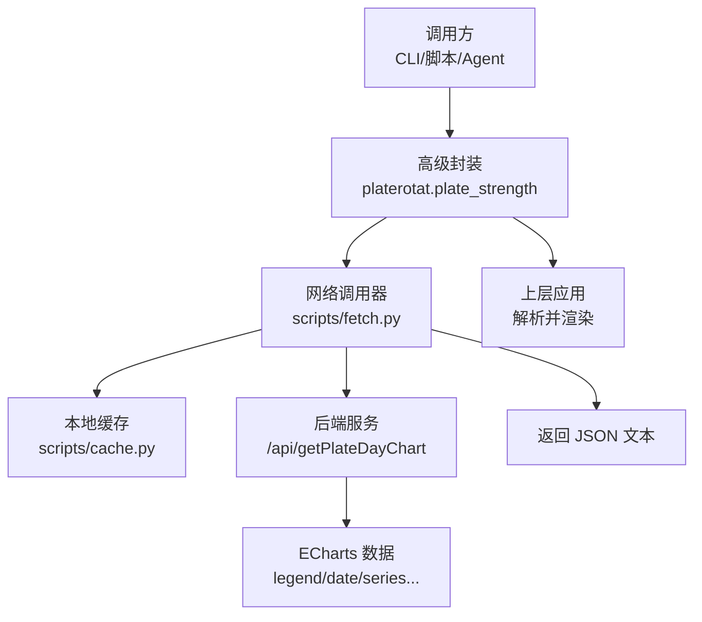
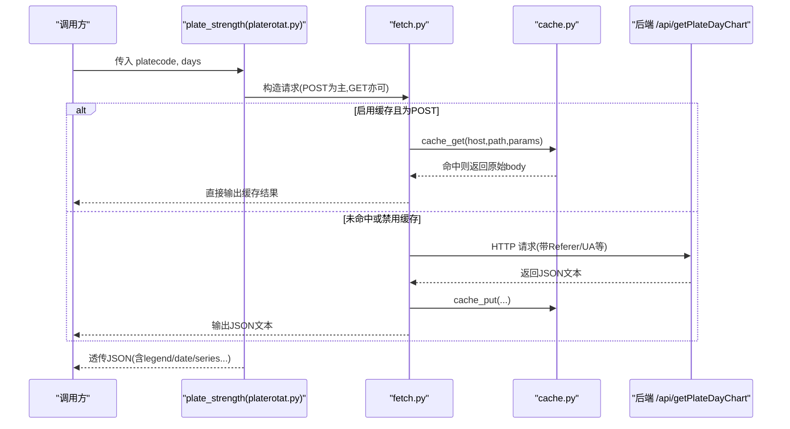
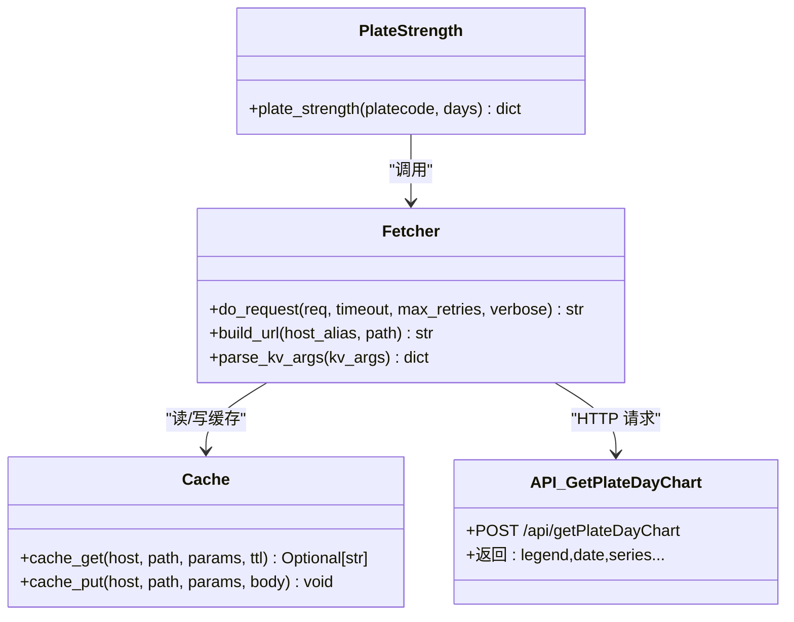
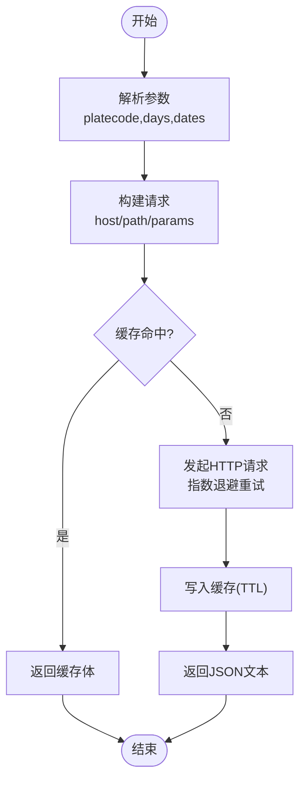

# 获取板块日线图表数据API

<cite>
**本文引用的文件**
- [api_getplatedaychart.md](file://skills/plate-rotation-skill/references/api_getplatedaychart.md)
- [platerotat.py](file://skills/plate-rotation-skill/scripts/platerotat.py)
- [fetch.py](file://skills/plate-rotation-skill/scripts/fetch.py)
- [cache.py](file://skills/plate-rotation-skill/scripts/cache.py)
- [_INDEX.md](file://skills/plate-rotation-skill/references/_INDEX.md)
- [test_plate_rotation.py](file://skills/plate-rotation-skill/tests/test_plate_rotation.py)
</cite>

## 目录
1. [简介](#简介)
2. [项目结构](#项目结构)
3. [核心组件](#核心组件)
4. [架构总览](#架构总览)
5. [详细接口规范](#详细接口规范)
6. [依赖与调用关系分析](#依赖与调用关系分析)
7. [性能与可用性](#性能与可用性)
8. [故障排查指南](#故障排查指南)
9. [结论](#结论)
10. [附录](#附录)

## 简介
本文件面向“获取板块日线图表数据”的接口文档，聚焦于单板块强度+量能时序数据的获取与使用。该能力由后端提供 /api/getPlateDayChart 接口，返回 ECharts 兼容的数据结构，用于前端渲染单板块 N 日的强度与量能序列。客户端可通过高级封装函数 plate_strength 或底层 fetch 工具进行调用。

说明：
- 接口方法为 POST（参考引用文档），但客户端封装支持 GET/POST 两种模式；当以 GET 方式调用时，参数通过查询字符串传递。
- 输出包含 legend、date 以及若干 series 字段（具体 key 由服务端决定），其中 legend=null 表示该板块近 N 日未活跃，前端不应渲染图表。

## 项目结构
与本接口相关的代码与文档主要位于 skills/plate-rotation-skill 目录下：
- references/api_getplatedaychart.md：接口定义与样例
- scripts/platerotat.py：高级封装函数 plate_strength，内部调用 /api/getPlateDayChart
- scripts/fetch.py：统一网络请求层，负责构建 URL、重试、缓存、输出
- scripts/cache.py：本地缓存实现（TTL 控制）
- tests/test_plate_rotation.py：在线集成测试，覆盖 getPlateDayChart 的响应结构断言

图示来源
- [platerotat.py:200-218](file://skills/plate-rotation-skill/scripts/platerotat.py#L200-L218)
- [fetch.py:128-213](file://skills/plate-rotation-skill/scripts/fetch.py#L128-L213)
- [cache.py:59-94](file://skills/plate-rotation-skill/scripts/cache.py#L59-L94)
- [api_getplatedaychart.md:1-48](file://skills/plate-rotation-skill/references/api_getplatedaychart.md#L1-L48)

章节来源
- [api_getplatedaychart.md:1-48](file://skills/plate-rotation-skill/references/api_getplatedaychart.md#L1-L48)
- [platerotat.py:200-218](file://skills/plate-rotation-skill/scripts/platerotat.py#L200-L218)
- [fetch.py:128-213](file://skills/plate-rotation-skill/scripts/fetch.py#L128-L213)
- [cache.py:59-94](file://skills/plate-rotation-skill/scripts/cache.py#L59-L94)

## 核心组件
- 高级封装函数 plate_strength：对 /api/getPlateDayChart 的一次性封装，负责参数构造、错误提示与空值校验。
- 网络调用器 fetch.py：统一处理 host 解析、URL 拼接、请求头注入、指数退避重试、JSON 美化输出、缓存读写。
- 本地缓存 cache.py：基于 TTL 的磁盘缓存，默认 1 小时，支持环境变量开关与清理。
- 接口文档 api_getplatedaychart.md：定义入参、出参与语义说明。
- 测试用例 test_plate_rotation.py：验证 getPlateDayChart 返回键 legend/date 存在性与类型。

章节来源
- [platerotat.py:200-218](file://skills/plate-rotation-skill/scripts/platerotat.py#L200-L218)
- [fetch.py:128-213](file://skills/plate-rotation-skill/scripts/fetch.py#L128-L213)
- [cache.py:59-94](file://skills/plate-rotation-skill/scripts/cache.py#L59-L94)
- [api_getplatedaychart.md:1-48](file://skills/plate-rotation-skill/references/api_getplatedaychart.md#L1-L48)
- [test_plate_rotation.py:110-118](file://skills/plate-rotation-skill/tests/test_plate_rotation.py#L110-L118)

## 架构总览
下图展示了从调用到返回的完整链路，包括缓存命中分支与重试策略。

图示来源
- [platerotat.py:200-218](file://skills/plate-rotation-skill/scripts/platerotat.py#L200-L218)
- [fetch.py:159-213](file://skills/plate-rotation-skill/scripts/fetch.py#L159-L213)
- [cache.py:59-94](file://skills/plate-rotation-skill/scripts/cache.py#L59-L94)

## 详细接口规范

### 基本信息
- 路径：/api/getPlateDayChart
- 方法：POST（参见引用文档）；客户端封装同时支持 GET（参数走查询串）
- Host：main（即 https://duanxianxia.com）
- 分类：板块轮动
- 层级：data

章节来源
- [api_getplatedaychart.md:1-14](file://skills/plate-rotation-skill/references/api_getplatedaychart.md#L1-L14)
- [fetch.py:38-42](file://skills/plate-rotation-skill/scripts/fetch.py#L38-L42)

### 输入参数
- platecode（string，必选）：板块代码，如 886084（F5G概念）。可从 getPlateRotatData 响应的 first 字段获取。
- days（int，必选）：回溯天数，支持 10 | 20 | 30 | 50。
- dates（string，可选）：自定义日期窗口，格式为 YYYY-MM-DD,YYYY-MM-DD,...；为空则按 days 自动回溯。

说明：
- days 影响回溯长度与主表列宽，默认建议 20。
- dates 仅在需要指定时间窗口时使用。

章节来源
- [api_getplatedaychart.md:22-28](file://skills/plate-rotation-skill/references/api_getplatedaychart.md#L22-L28)
- [_INDEX.md:34-41](file://skills/plate-rotation-skill/references/_INDEX.md#L34-L41)

### 输出字段
- legend（null 或 string[]）：图例。若为 null，表示该板块近 N 日未活跃，前端不渲染图表。
- date（list[string]）：日期序列，格式为 MM-DD，顺序为 newest first（最近在前）。
- series*（object[] 列表）：一个或多个序列，对应强度与量能等指标。具体 key 由服务端决定，上层按需读取。

注意：
- 当 legend=null 时，表明板块未活跃，应跳过渲染。
- date 为空通常意味着上游异常或板块无效，需告警处理。

章节来源
- [api_getplatedaychart.md:30-46](file://skills/plate-rotation-skill/references/api_getplatedaychart.md#L30-L46)
- [platerotat.py:210-218](file://skills/plate-rotation-skill/scripts/platerotat.py#L210-L218)
- [test_plate_rotation.py:110-118](file://skills/plate-rotation-skill/tests/test_plate_rotation.py#L110-L118)

### 调用示例
- 通过 CLI 调用（POST）：
  - python3 {SKILL_DIR}/scripts/fetch.py main /api/getPlateDayChart -v
- 通过高级封装函数：
  - from platerotat import plate_strength
  - data = plate_strength("886084", days=20)

章节来源
- [api_getplatedaychart.md:16-20](file://skills/plate-rotation-skill/references/api_getplatedaychart.md#L16-L20)
- [platerotat.py:200-218](file://skills/plate-rotation-skill/scripts/platerotat.py#L200-L218)

### 多板块对比与同步显示
- 多板块对比请使用 Top5 排名变化曲线接口 /api/getPlateRotatChart（非本接口）。该接口返回 ECharts 数据，包含 legend、date、name 字典及 1..5 系列，用于展示 Top5 板块的 N 日排名变化。
- 本接口 /api/getPlateDayChart 仅针对单板块强度+量能的时序数据，不提供多板块对比。

章节来源
- [api_getplaterotatchart.md:40-53](file://skills/plate-rotation-skill/references/api_getplaterotatchart.md#L40-L53)

### 历史数据回测与趋势分析方法
- 数据获取：通过 plate_strength(platecode, days) 获取 ECharts 数据，再根据返回的 series 字段提取强度与量能序列。
- 技术指标计算：在客户端侧基于返回的数值序列计算移动平均、波动率、MACD、RSI 等指标。
- 信号生成：结合阈值与形态判断（例如放量突破、缩量回调、均线金叉死叉）生成交易信号。
- 同步显示：将计算后的指标序列与原始序列对齐至同一 date 轴，确保前后端时间轴一致。

说明：
- 本仓库未提供具体的指标计算与信号生成实现，上述为通用实践建议。

[本节为方法论说明，不涉及具体源码文件]

### 数据精度与时区规则
- 日期格式：MM-DD（newest first），不含年份与时区信息。
- 数值精度：服务端返回的具体数值精度未在仓库中明确定义，客户端应按浮点数处理并保持与前端一致的格式化策略。
- 时区：仓库未显式声明时区规则，建议以服务端所在时区为准，并在前端统一转换。

章节来源
- [api_getplatedaychart.md:30-41](file://skills/plate-rotation-skill/references/api_getplatedaychart.md#L30-L41)

## 依赖与调用关系分析

图示来源
- [platerotat.py:200-218](file://skills/plate-rotation-skill/scripts/platerotat.py#L200-L218)
- [fetch.py:91-124](file://skills/plate-rotation-skill/scripts/fetch.py#L91-L124)
- [cache.py:59-94](file://skills/plate-rotation-skill/scripts/cache.py#L59-L94)
- [api_getplatedaychart.md:1-14](file://skills/plate-rotation-skill/references/api_getplatedaychart.md#L1-L14)

章节来源
- [platerotat.py:200-218](file://skills/plate-rotation-skill/scripts/platerotat.py#L200-L218)
- [fetch.py:91-124](file://skills/plate-rotation-skill/scripts/fetch.py#L91-L124)
- [cache.py:59-94](file://skills/plate-rotation-skill/scripts/cache.py#L59-L94)

## 性能与可用性
- 重试策略：对 429/5xx 及网络异常采用指数退避（最多 3 次，间隔 1s/2s/4s）。
- 缓存策略：POST 请求默认启用本地缓存，TTL 默认 3600 秒；可通过 --no-cache 或 PR_CACHE_DISABLE=1 关闭。
- 超时控制：默认 15 秒，可通过 --timeout 调整。
- 并发与节流：缓存有效降低重复请求频率，适合盘中高频刷新场景。

章节来源
- [fetch.py:47-50](file://skills/plate-rotation-skill/scripts/fetch.py#L47-L50)
- [fetch.py:159-168](file://skills/plate-rotation-skill/scripts/fetch.py#L159-L168)
- [cache.py:35-37](file://skills/plate-rotation-skill/scripts/cache.py#L35-L37)

## 故障排查指南
- 返回空数据（PR-EMPTY）：
  - 可能原因：周末/节假日、days 超前、板块代码跨源错传、上游接口异常。
  - 处理建议：检查 platecode 前缀与 source 匹配（88x 对应 ths，80x/803x 对应 kaipan），确认 days/dates 合理。
- legend=null：
  - 含义：板块近 N 日未活跃，前端不应渲染图表。
- date 为空：
  - 含义：上游异常或板块无效，需告警并重试或降级。
- 网络错误：
  - 观察 stderr 中的 retry 日志与最终错误信息，必要时增大 --max-retries 或 --timeout。

章节来源
- [platerotat.py:85-97](file://skills/plate-rotation-skill/scripts/platerotat.py#L85-L97)
- [platerotat.py:210-218](file://skills/plate-rotation-skill/scripts/platerotat.py#L210-L218)
- [fetch.py:101-124](file://skills/plate-rotation-skill/scripts/fetch.py#L101-L124)

## 结论
/api/getPlateDayChart 提供单板块强度+量能的 ECharts 时序数据，配合 legend 与 date 字段可快速完成前端渲染。对于多板块对比，建议使用 /api/getPlateRotatChart。客户端可通过高级封装函数简化调用，并结合本地缓存与重试机制提升稳定性与性能。

[本节为总结性内容，不涉及具体源码文件]

## 附录

### 关键流程（算法/逻辑）

图示来源
- [fetch.py:159-213](file://skills/plate-rotation-skill/scripts/fetch.py#L159-L213)
- [cache.py:59-94](file://skills/plate-rotation-skill/scripts/cache.py#L59-L94)