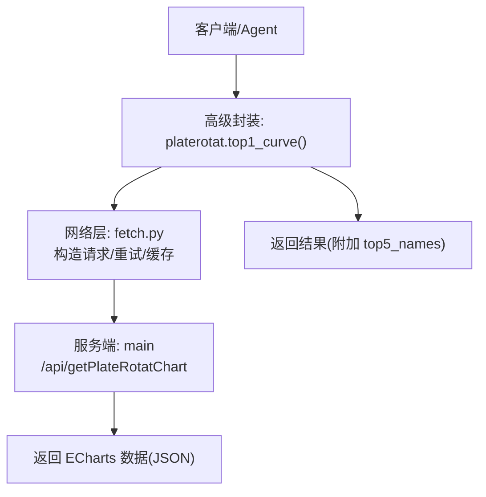
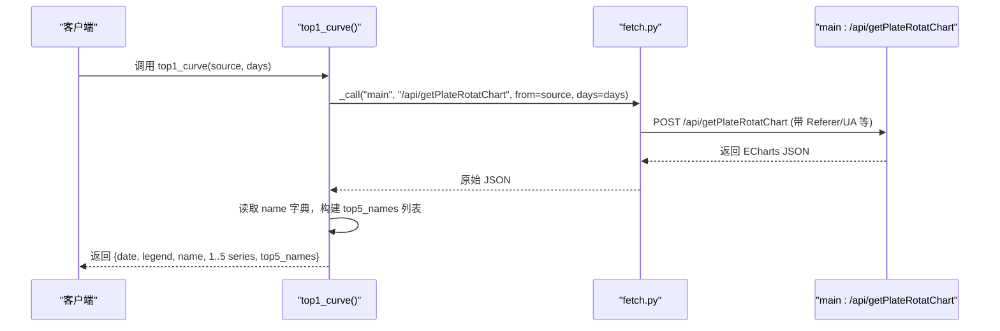
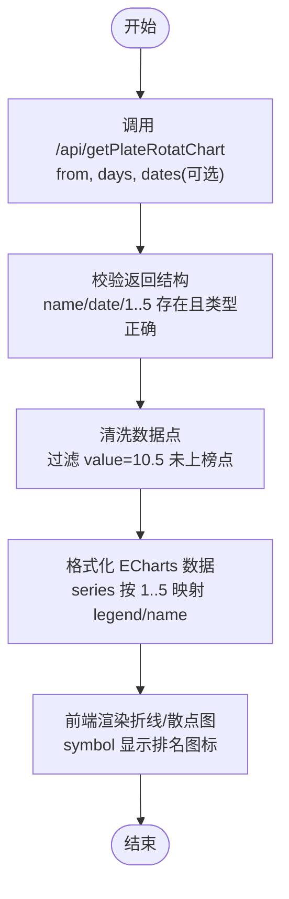
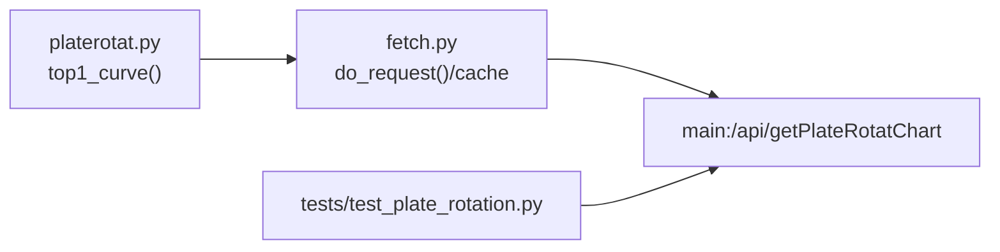

# 获取板块轮动图表数据API

<cite>
**本文引用的文件**   
- [api_getplaterotatchart.md](file://skills/plate-rotation-skill/references/api_getplaterotatchart.md)
- [platerotat.py](file://skills/plate-rotation-skill/scripts/platerotat.py)
- [fetch.py](file://skills/plate-rotation-skill/scripts/fetch.py)
- [parsers.py](file://skills/plate-rotation-skill/scripts/parsers.py)
- [test_plate_rotation.py](file://skills/plate-rotation-skill/tests/test_plate_rotation.py)
- [_INDEX.md](file://skills/plate-rotation-skill/references/_INDEX.md)
- [stock-facts.md](file://skills/plate-rotation-skill/references/stock-facts.md)
</cite>

## 目录
1. [简介](#简介)
2. [项目结构](#项目结构)
3. [核心组件](#核心组件)
4. [架构总览](#架构总览)
5. [详细接口规范：GET /api/getPlateRotatChart](#详细接口规范get-apigetplaterotatchart)
6. [数据结构与字段定义](#数据结构与字段定义)
7. [图表生成流程（预处理、格式化、渲染）](#图表生成流程预处理格式化渲染)
8. [前端集成示例与最佳实践](#前端集成示例与最佳实践)
9. [依赖关系分析](#依赖关系分析)
10. [性能考虑与大数据处理策略](#性能考虑与大数据处理策略)
11. [故障排查指南](#故障排查指南)
12. [结论](#结论)

## 简介
本文件面向需要接入“板块轮动”能力的前后端工程师，聚焦于获取 Top5 板块 N 日排名变化曲线数据的接口。该接口返回 ECharts 可直接消费的数据结构，包含时间序列、Top5 板块名称映射以及各板块的每日排名序列（含未上榜占位）。文档同时给出数据预处理、格式化要求、可视化渲染方法、前端集成建议、性能优化与大数据量处理策略。

## 项目结构
围绕该接口的关键代码与文档分布如下：
- 接口参考文档：定义了路径、参数、输出字段与样例
- 高级封装脚本：提供 top1_curve 函数，内部调用底层接口并补充便利字段
- 网络请求层：统一发起 HTTP 请求、重试、缓存、头部注入
- 解析器：用于其他接口的 HTML in JSON 解析（本接口直接返回结构化 JSON）
- 测试用例：对接口返回结构的断言与校验

图示来源
- [platerotat.py:175-196](file://skills/plate-rotation-skill/scripts/platerotat.py#L175-L196)
- [fetch.py:128-213](file://skills/plate-rotation-skill/scripts/fetch.py#L128-L213)
- [api_getplaterotatchart.md:1-53](file://skills/plate-rotation-skill/references/api_getplaterotatchart.md#L1-L53)

章节来源
- [api_getplaterotatchart.md:1-53](file://skills/plate-rotation-skill/references/api_getplaterotatchart.md#L1-L53)
- [platerotat.py:175-196](file://skills/plate-rotation-skill/scripts/platerotat.py#L175-L196)
- [fetch.py:128-213](file://skills/plate-rotation-skill/scripts/fetch.py#L128-L213)
- [test_plate_rotation.py:93-101](file://skills/plate-rotation-skill/tests/test_plate_rotation.py#L93-L101)

## 核心组件
- 接口参考文档：明确接口路径、HTTP 方法、入参、出参与样例
- 高级封装：top1_curve 函数在原始响应基础上增加 top5_names 列表，便于前端直接使用
- 网络层：统一处理 host 别名、请求头、重试、缓存、raw 输出等
- 测试：验证接口返回必须包含 name/date 等关键字段，且类型正确

章节来源
- [api_getplaterotatchart.md:12-53](file://skills/plate-rotation-skill/references/api_getplaterotatchart.md#L12-L53)
- [platerotat.py:175-196](file://skills/plate-rotation-skill/scripts/platerotat.py#L175-L196)
- [test_plate_rotation.py:93-101](file://skills/plate-rotation-skill/tests/test_plate_rotation.py#L93-L101)

## 架构总览
从调用到返回的整体时序如下：

图示来源
- [platerotat.py:175-196](file://skills/plate-rotation-skill/scripts/platerotat.py#L175-L196)
- [fetch.py:128-213](file://skills/plate-rotation-skill/scripts/fetch.py#L128-L213)
- [api_getplaterotatchart.md:12-53](file://skills/plate-rotation-skill/references/api_getplaterotatchart.md#L12-L53)

## 详细接口规范：GET /api/getPlateRotatChart
说明：尽管参考文档中标注为 POST，但根据实际使用方式与测试用例，客户端可通过 GET 或 POST 调用。为保证兼容性，建议优先使用 GET 并在查询字符串中传递参数；若需兼容既有系统，POST 亦可。

- 路径：/api/getPlateRotatChart
- 主机：main（由 fetch.py 解析为主机别名）
- 方法：GET 或 POST（推荐 GET）
- 认证：后端仅校验 Referer，无需 Cookie（fetch.py 自动注入 Referer）

### 请求参数
- from：string，必选。板块来源
  - ths：同花顺
  - kaipan：开盘啦
- days：int，必选。回溯天数，支持 10 | 20 | 30 | 50
- dates：string，可选。自定义日期窗口，格式 YYYY-MM-DD，逗号分隔；不传则按 days 自动回溯

章节来源
- [api_getplaterotatchart.md:22-29](file://skills/plate-rotation-skill/references/api_getplaterotatchart.md#L22-L29)
- [_INDEX.md:34-40](file://skills/plate-rotation-skill/references/_INDEX.md#L34-L40)

### 响应体（ECharts 数据）
- date：list[string]，日期序列（MM-DD），最新在前
- legend：list[string]，Top5 板块名（括号内为该板块过去 N 日总上榜次数）
- name：object，键为序号字符串 "1".."5"，值为对应板块名称
- 1..5：每个 key 对应一个板块的 N 日排名变化序列，元素为对象
  - value：number|string，数值型排名；当 value=10.5 时代表当日未上榜
  - symbol：string，图标资源路径（如 rankN.png 或 wu.png）

注意：
- value=10.5 + symbol=wu.png 表示当日未上榜，不参与平均或排序计算
- legend[i] 中的“N次上榜”是过去 N 日的累计上榜次数

章节来源
- [api_getplaterotatchart.md:30-53](file://skills/plate-rotation-skill/references/api_getplaterotatchart.md#L30-L53)
- [stock-facts.md:45-49](file://skills/plate-rotation-skill/references/stock-facts.md#L45-L49)

### 调用示例（命令行）
- GET 方式（通过 fetch.py 演示）：
  - python3 scripts/fetch.py main /api/getPlateRotatChart from=kaipan days=20
- 高级封装（Python）：
  - from platerotat import top1_curve; data = top1_curve(source="kaipan", days=20)

章节来源
- [api_getplaterotatchart.md:16-20](file://skills/plate-rotation-skill/references/api_getplaterotatchart.md#L16-L20)
- [platerotat.py:188-196](file://skills/plate-rotation-skill/scripts/platerotat.py#L188-L196)

## 数据结构与字段定义
- 顶层字段
  - date：list[string]，日期序列（MM-DD），顺序 newest-first
  - legend：list[string]，Top5 板块名（含“N次上榜”统计）
  - name：object{"1": "板块名", "2": "板块名", ...}
  - 1..5：数组，长度等于 len(date)，每项为 {value, symbol}
- 数据点语义
  - value：number|string，正常为整数排名；当 value=10.5 表示未上榜
  - symbol：string，图标路径，rankN.png 表示第 N 名，wu.png 表示未上榜
- 单位与类型
  - 无金额或百分比单位；value 为排名（离散序数）
  - 日期为 MM-DD 字符串

章节来源
- [api_getplaterotatchart.md:30-53](file://skills/plate-rotation-skill/references/api_getplaterotatchart.md#L30-L53)
- [stock-facts.md:45-49](file://skills/plate-rotation-skill/references/stock-facts.md#L45-L49)

## 图表生成流程（预处理、格式化、渲染）
整体流程分为三步：数据获取与清洗、格式化、可视化渲染。

- 数据获取与清洗
  - 校验返回是否包含 name/date/1..5
  - 将 value=10.5 的点标记为缺失，避免参与均值/趋势计算
- 格式化
  - 使用 name 字典将 1..5 映射为可读名称
  - 将 legend 与 series 对齐，确保图例与系列一致
- 渲染
  - 使用 ECharts 折线图或散点图，x 轴为 date，y 轴为排名
  - 使用 symbol 展示排名图标；未上榜点以 wu.png 占位

章节来源
- [test_plate_rotation.py:93-101](file://skills/plate-rotation-skill/tests/test_plate_rotation.py#L93-L101)
- [api_getplaterotatchart.md:46-53](file://skills/plate-rotation-skill/references/api_getplaterotatchart.md#L46-L53)

## 前端集成示例与最佳实践
- 数据绑定
  - x 轴：date（MM-DD）
  - y 轴：value（排名），value=10.5 作为空值处理
  - 图例：legend 与 series 一一对应
  - 标记：symbol 使用 rankN.png/wu.png
- 交互建议
  - 悬停提示：显示日期、板块名、排名或未上榜
  - 断点处理：value=10.5 的点用虚线或特殊样式标注
- 错误处理
  - 若 name/date 缺失或类型不符，降级为空图表并提示
  - 若所有点均为未上榜，提示“近 N 日未上榜”

[本节为通用实践说明，不直接分析具体文件，故无章节来源]

## 依赖关系分析
- 上层调用：platerotat.top1_curve 负责组合与增强返回结构
- 网络层：fetch.py 负责 URL 组装、请求头、重试、缓存
- 服务端：main 下的 /api/getPlateRotatChart 返回 ECharts 数据
- 测试：test_plate_rotation 对返回结构进行断言

图示来源
- [platerotat.py:175-196](file://skills/plate-rotation-skill/scripts/platerotat.py#L175-L196)
- [fetch.py:128-213](file://skills/plate-rotation-skill/scripts/fetch.py#L128-L213)
- [test_plate_rotation.py:93-101](file://skills/plate-rotation-skill/tests/test_plate_rotation.py#L93-L101)

章节来源
- [platerotat.py:175-196](file://skills/plate-rotation-skill/scripts/platerotat.py#L175-L196)
- [fetch.py:128-213](file://skills/plate-rotation-skill/scripts/fetch.py#L128-L213)
- [test_plate_rotation.py:93-101](file://skills/plate-rotation-skill/tests/test_plate_rotation.py#L93-L101)

## 性能考虑与大数据处理策略
- 请求侧优化
  - 合理设置 days：默认 20 可平衡趋势清晰度与数据量
  - 使用 dates 精确窗口：减少不必要的时间跨度
  - 启用缓存：fetch.py 对 POST 默认落盘缓存（TTL 可配置），GET 也可结合应用层缓存
- 传输与解析
  - 返回已为结构化 JSON，无需二次 HTML 解析
  - 前端按需渲染，避免一次性绘制过多点
- 大数据量处理
  - 分页加载：按 dates 分片（例如每页 10 天），前端滚动加载
  - 增量更新：仅拉取新增日期区间，合并到本地数据集
  - 降采样：对超长序列采用时间窗口聚合（如周级别）
- 容错与重试
  - 网络异常与 429/5xx 指数退避重试（最多 3 次）
  - 超时控制与 raw 模式调试

章节来源
- [fetch.py:47-50](file://skills/plate-rotation-skill/scripts/fetch.py#L47-L50)
- [fetch.py:159-213](file://skills/plate-rotation-skill/scripts/fetch.py#L159-L213)
- [_INDEX.md:34-40](file://skills/plate-rotation-skill/references/_INDEX.md#L34-L40)

## 故障排查指南
- 常见错误
  - 返回缺少 name/date：检查 from/days 参数是否正确
  - 全部未上榜：value=10.5 出现频繁属正常，确认是否为非活跃期
  - 跨源误用：ths 与 kaipan 数值不可比较，勿混用
- 诊断步骤
  - 使用 --verbose 打印 URL/Body/Cookie，定位请求问题
  - 使用 --no-cache 禁用缓存，排除陈旧数据干扰
  - 使用 --raw 查看原始响应，辅助定位 JSON 解析失败
- 运行时警告
  - PR-EMPTY/PR-WARN：来自高级封装的健壮性提示，帮助区分节假日/参数超前/上游异常

章节来源
- [platerotat.py:75-98](file://skills/plate-rotation-skill/scripts/platerotat.py#L75-L98)
- [fetch.py:193-213](file://skills/plate-rotation-skill/scripts/fetch.py#L193-L213)
- [stock-facts.md:45-56](file://skills/plate-rotation-skill/references/stock-facts.md#L45-L56)

## 结论
/api/getPlateRotatChart 提供了标准化的 ECharts 数据，适合快速构建 Top5 板块轮动趋势图。通过合理的参数选择、数据清洗与前端渲染策略，可获得清晰直观的可视化效果。配合 fetch.py 的重试与缓存机制，可在生产环境获得稳定高效的体验。对于大数据量场景，建议采用分片加载与增量更新策略，保证交互流畅性与资源占用可控。