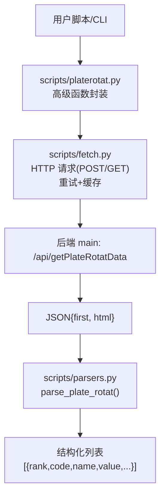
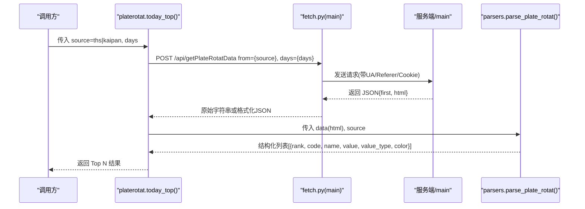
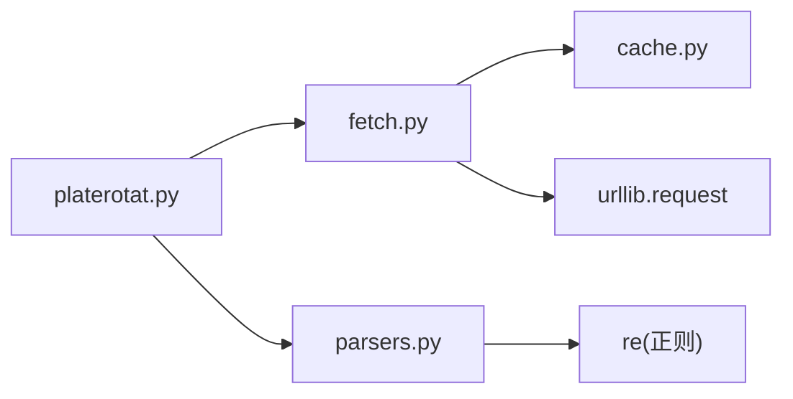

# 获取板块轮动数据API

<cite>
**本文引用的文件**
- [api_getplaterotatdata.md](file://skills/plate-rotation-skill/references/api_getplaterotatdata.md)
- [fetch.py](file://skills/plate-rotation-skill/scripts/fetch.py)
- [parsers.py](file://skills/plate-rotation-skill/scripts/parsers.py)
- [platerotat.py](file://skills/plate-rotation-skill/scripts/platerotat.py)
- [test_plate_rotation.py](file://skills/plate-rotation-skill/tests/test_plate_rotation.py)
</cite>

## 目录
1. [简介](#简介)
2. [项目结构](#项目结构)
3. [核心组件](#核心组件)
4. [架构总览](#架构总览)
5. [详细接口规范：POST /api/getPlateRotatData](#详细接口规范post-apigetplaterotatdata)
6. [HTML响应解析与字段语义](#html响应解析与字段语义)
7. [Python调用示例与解析器使用](#python调用示例与解析器使用)
8. [依赖关系分析](#依赖关系分析)
9. [性能与稳定性](#性能与稳定性)
10. [故障排查指南](#故障排查指南)
11. [结论](#结论)

## 简介
本文件面向需要调用“板块轮动”数据的开发者，聚焦于 POST /api/getPlateRotatData 接口的完整规范、双源数据差异（同花顺 vs 开盘啦）、HTML 响应解析方法、Python 调用与解析器用法、错误处理机制与最佳实践。该接口返回的 HTML 片段内嵌在 JSON 的 html 字段中，需通过解析器提取结构化数据。

## 项目结构
与本接口相关的代码位于 skills/plate-rotation-skill 目录下，关键文件如下：
- scripts/fetch.py：统一网络请求封装，负责参数组装、重试、缓存、输出格式化等
- scripts/parsers.py：HTML in JSON 的解析器集合，含 parse_plate_rotat 等
- scripts/platerotat.py：高级 API 封装，内部调用 fetch.py 并组合 parsers
- references/api_getplaterotatdata.md：接口参考文档，定义输入输出与字段语义
- tests/test_plate_rotation.py：在线集成测试，覆盖接口健康度、解析正确性与 CLI 行为

图表来源
- [platerotat.py:100-121](file://skills/plate-rotation-skill/scripts/platerotat.py#L100-L121)
- [fetch.py:128-212](file://skills/plate-rotation-skill/scripts/fetch.py#L128-L212)
- [parsers.py:20-65](file://skills/plate-rotation-skill/scripts/parsers.py#L20-L65)
- [api_getplaterotatdata.md:12-41](file://skills/plate-rotation-skill/references/api_getplaterotatdata.md#L12-L41)

章节来源
- [api_getplaterotatdata.md:12-41](file://skills/plate-rotation-skill/references/api_getplaterotatdata.md#L12-L41)
- [fetch.py:128-212](file://skills/plate-rotation-skill/scripts/fetch.py#L128-L212)
- [parsers.py:20-65](file://skills/plate-rotation-skill/scripts/parsers.py#L20-L65)
- [platerotat.py:100-121](file://skills/plate-rotation-skill/scripts/platerotat.py#L100-L121)

## 核心组件
- 网络层：fetch.py 提供统一的 HTTP 调用能力，支持 GET/POST、参数拼接、重试、缓存、Cookie/Referer 注入、原始输出模式
- 解析层：parsers.py 提供 parse_plate_rotat、parse_plate_rotat_dates、parse_plate_rotat_matrix 等解析函数，将 HTML 片段转为结构化数据
- 应用层：platerotat.py 暴露 today_top、find_dragon_kings、top1_curve、plate_strength 等高级函数，内部组合 fetch + parsers，并提供 CLI

章节来源
- [fetch.py:128-212](file://skills/plate-rotation-skill/scripts/fetch.py#L128-L212)
- [parsers.py:20-108](file://skills/plate-rotation-skill/scripts/parsers.py#L20-L108)
- [platerotat.py:100-218](file://skills/plate-rotation-skill/scripts/platerotat.py#L100-L218)

## 架构总览
下图展示了从调用到解析的端到端流程，以及双源差异对数值语义的影响。

图表来源
- [platerotat.py:100-121](file://skills/plate-rotation-skill/scripts/platerotat.py#L100-L121)
- [fetch.py:128-212](file://skills/plate-rotation-skill/scripts/fetch.py#L128-L212)
- [parsers.py:20-65](file://skills/plate-rotation-skill/scripts/parsers.py#L20-L65)
- [api_getplaterotatdata.md:12-41](file://skills/plate-rotation-skill/references/api_getplaterotatdata.md#L12-L41)

## 详细接口规范：POST /api/getPlateRotatData
- 分类：板块轮动
- Host：main
- Method：POST
- 路径：/api/getPlateRotatData
- 认证：无需 API Key；后端校验 Referer（自动注入）；可选 Cookie（环境变量 PR_COOKIE 或本地文件）

### 输入参数
- from（必选）：string，取值 ths（同花顺）或 kaipan（开盘啦）
- days（必选）：int，回溯天数，支持 10 | 20 | 30 | 50
- dates（可选）：string，自定义日期序列（YYYY-MM-DD，逗号分隔），为空则按 days 回溯

说明：
- 当未传 dates 时，服务端根据 days 生成最近若干交易日列
- 当传入 dates 时，服务端按指定日期拉取对应列的数据

章节来源
- [api_getplaterotatdata.md:22-28](file://skills/plate-rotation-skill/references/api_getplaterotatdata.md#L22-L28)

### 输出字段
- first：string，当日 Top1 板块代码（可用于后续龙头查询）
- html：string，包含表格结构的 HTML 片段，前端可直接 innerHTML 渲染

章节来源
- [api_getplaterotatdata.md:30-41](file://skills/plate-rotation-skill/references/api_getplaterotatdata.md#L30-L41)

### 双源数据差异
- 同花顺（from=ths）：数值为“当日板块涨幅 %”，单位带 % 符号（如 4.94%），排序越大越强
- 开盘啦（from=kaipan）：数值为“板块强度分”，纯整数（如 15199），综合上榜次数+涨速+龙头数等多因子，数字越大越强

注意：
- 两种源的数值不可直接比较大小，仅各自排序
- 板块代码前缀决定数据来源：88x 为同花顺；80x/803x 为开盘啦

章节来源
- [api_getplaterotatdata.md:43-54](file://skills/plate-rotation-skill/references/api_getplaterotatdata.md#L43-L54)

## HTML响应解析与字段语义
接口返回的 HTML 片段遵循固定模板，解析器据此抽取结构化数据。

- 排名节点：N
- 板块行：<td class='plate plate{code}' code='{code}' name='{name}' style='...'>
  - 第一个 td 是“今天”的数值
  - 后续 td 依次是第2天、第3天……（倒序排列）
- 数值节点：{value}
  - 同花顺：value 形如 '4.94%'
  - 开盘啦：value 形如 '15199'

解析器输出结构（以 parse_plate_rotat 为例）：
- rank：int，排名
- code：string，板块代码
- name：string，板块名称
- value：string，数值（带%或不带%）
- value_type：'pct'（同花顺）或 'score'（开盘啦）
- color：'red' 或 'green'

日期列解析（parse_plate_rotat_dates）：
- 从表头抽取 YYYY-MM-DD 序列，顺序 newest→oldest

矩阵解析（parse_plate_rotat_matrix）：
- 将多日数据还原为 N×天矩阵，便于分析某板块何时上榜或某天的整列 TopN

章节来源
- [api_getplaterotatdata.md:55-63](file://skills/plate-rotation-skill/references/api_getplaterotatdata.md#L55-L63)
- [parsers.py:20-108](file://skills/plate-rotation-skill/scripts/parsers.py#L20-L108)

## Python调用示例与解析器使用
以下示例展示如何调用接口并使用解析器得到结构化数据。为避免泄露具体实现细节，此处仅提供调用路径与关键步骤说明。

- 使用 platerotat.today_top 快速获得今日 Top N 板块
  - 入口：scripts/platerotat.py 中的 today_top(source, n, days)
  - 内部会调用 fetch.py 发起 POST /api/getPlateRotatData，再交由 parsers.parse_plate_rotat 解析
  - 返回值：[{rank, code, name, value, value_type, color}, ...]

- 直接使用 parsers.parse_plate_rotat
  - 入口：scripts/parsers.py 中的 parse_plate_rotat(data, source)
  - 入参 data 为接口返回的 JSON 对象（包含 html 字段）
  - 根据 source 区分 value_type：ths → pct；kaipan → score

- 获取日期序列
  - 使用 parsers.parse_plate_rotat_dates(data) 抽取日期数组（newest→oldest）

- 获取多日矩阵
  - 使用 parsers.parse_plate_rotat_matrix(data, dates) 将多日数据还原为矩阵

- 使用 CLI 验证
  - 命令：python3 scripts/platerotat.py today --source ths --n 10 --days 20
  - 支持 --json 输出结构化 JSON

章节来源
- [platerotat.py:100-121](file://skills/plate-rotation-skill/scripts/platerotat.py#L100-L121)
- [parsers.py:20-108](file://skills/plate-rotation-skill/scripts/parsers.py#L20-L108)
- [test_plate_rotation.py:250-271](file://skills/plate-rotation-skill/tests/test_plate_rotation.py#L250-L271)

## 依赖关系分析
- 模块耦合
  - platerotat.py 依赖 fetch.py（子进程调用）与 parsers.py（解析）
  - fetch.py 依赖 cache.py（缓存读写）、urllib（网络请求）
  - parsers.py 无外部依赖，仅用正则表达式解析 HTML
- 外部依赖
  - 后端服务 main（duanxianxia.com），仅校验 Referer，可选 Cookie
- 潜在循环依赖
  - 当前设计解耦清晰，未见循环依赖

图表来源
- [platerotat.py:34-48](file://skills/plate-rotation-skill/scripts/platerotat.py#L34-L48)
- [fetch.py:31-36](file://skills/plate-rotation-skill/scripts/fetch.py#L31-L36)
- [parsers.py:14-16](file://skills/plate-rotation-skill/scripts/parsers.py#L14-L16)

章节来源
- [platerotat.py:34-48](file://skills/plate-rotation-skill/scripts/platerotat.py#L34-L48)
- [fetch.py:31-36](file://skills/plate-rotation-skill/scripts/fetch.py#L31-L36)
- [parsers.py:14-16](file://skills/plate-rotation-skill/scripts/parsers.py#L14-L16)

## 性能与稳定性
- 重试策略：针对 429/5xx 及网络异常进行指数退避（最多3次，间隔 1s/2s/4s）
- 缓存策略：POST 请求默认落盘缓存（~/.cache/plate-rotation/），TTL 可配置（默认值见 cache.py），可通过 --no-cache 或环境变量关闭
- 超时控制：默认 15s，可通过 --timeout 调整
- 输出优化：--raw 模式避免二次 JSON 格式化开销

建议：
- 高频调用场景开启缓存，合理设置 TTL
- 网络不稳定环境适当增大 max-retries 与 timeout
- 解析阶段尽量复用已解析的 dates 与矩阵，减少重复正则匹配

章节来源
- [fetch.py:47-51](file://skills/plate-rotation-skill/scripts/fetch.py#L47-L51)
- [fetch.py:159-170](file://skills/plate-rotation-skill/scripts/fetch.py#L159-L170)
- [fetch.py:200-212](file://skills/plate-rotation-skill/scripts/fetch.py#L200-L212)

## 故障排查指南
常见问题与定位要点：
- 空数据警告：高级函数在解析完成后进行 sanity check，若命中空数据或缺关键字段，会在 stderr 输出 PR-EMPTY 提示，帮助区分节假日/参数超前/跨源错传等情况
- 跨源错传：88x 传给 kaipan 源可能拿到空；80x/803x 传给 ths 源也可能为空。运行时校验会给出前缀不匹配的提示
- 非 JSON 响应：若服务端返回非 JSON，fetch 层会抛出异常并退出，日志包含原始内容片段
- 网络异常：重试耗尽后抛出 RuntimeError，包含最后一次失败原因

调试建议：
- 使用 fetch.py 的 -v 参数打印 URL、body、cookie 等信息
- 使用 --raw 查看原始响应，确认 HTML 结构是否符合预期
- 使用 tests/test_plate_rotation.py 进行在线集成测试，验证接口健康与解析正确性

章节来源
- [platerotat.py:75-98](file://skills/plate-rotation-skill/scripts/platerotat.py#L75-L98)
- [platerotat.py:115-121](file://skills/plate-rotation-skill/scripts/platerotat.py#L115-L121)
- [fetch.py:101-124](file://skills/plate-rotation-skill/scripts/fetch.py#L101-L124)
- [test_plate_rotation.py:75-118](file://skills/plate-rotation-skill/tests/test_plate_rotation.py#L75-L118)

## 结论
POST /api/getPlateRotatData 提供了双源板块轮动数据，分别反映“当日爆发”（同花顺涨幅%）与“持续性”（开盘啦强度分）。通过 fetch.py 的网络封装与 parsers.py 的 HTML 解析，可将接口返回的 HTML 片段高效转换为结构化数据。结合 platerotat.py 的高级函数与 CLI，可以快速完成 Top N 板块、妖王榜、排名曲线与强度时序等分析任务。建议在调用时严格区分双源语义、合理使用缓存与重试、并通过集成测试保障稳定性。