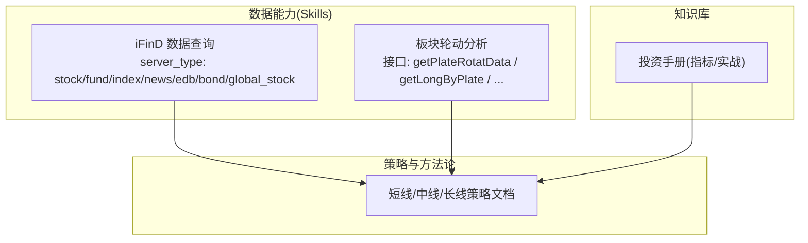
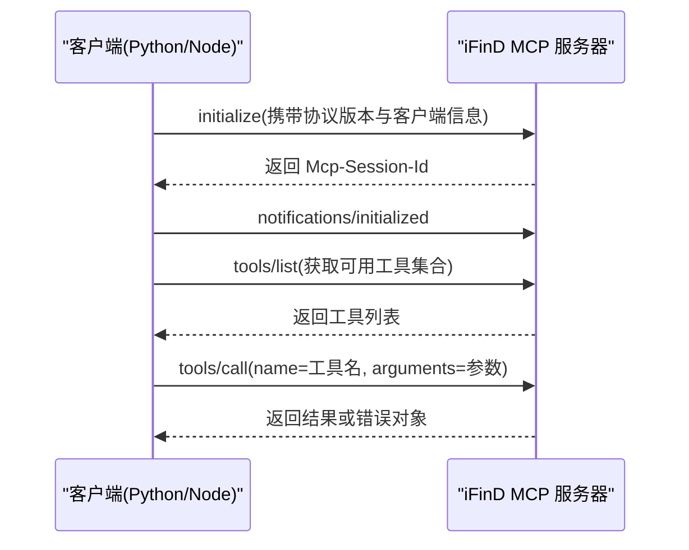
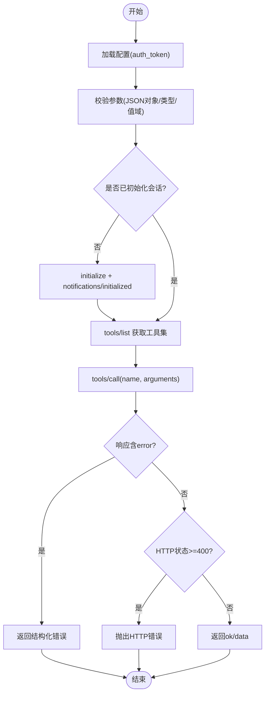
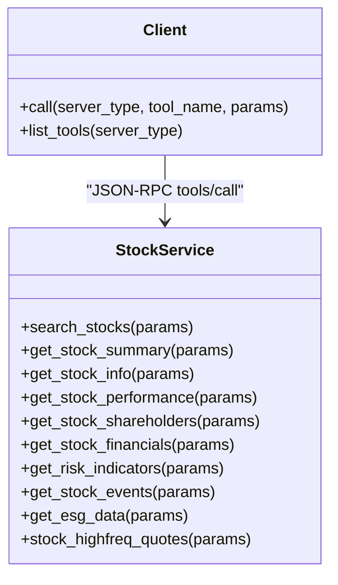
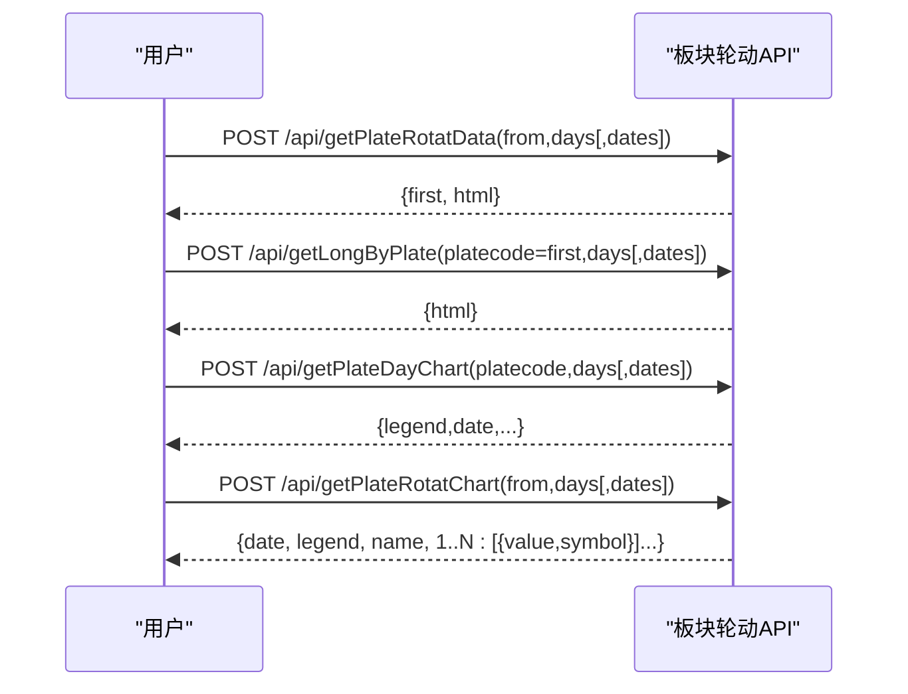
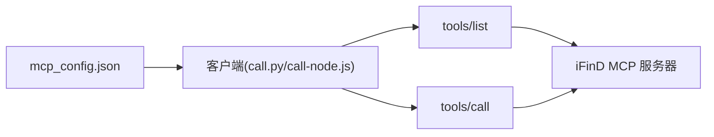

# A股数据接口

<cite>
**本文引用的文件**   
- [README.MD](file://README.MD)
- [call.py](file://skills/ifind-finance-data-1.3.0/call.py)
- [call-node.js](file://skills/ifind-finance-data-1.3.0/call-node.js)
- [mcp_config.json](file://skills/ifind-finance-data-1.3.0/mcp_config.json)
- [cn_stock.md](file://skills/ifind-finance-data-1.3.0/references/cn_stock.md)
- [fund.md](file://skills/ifind-finance-data-1.3.0/references/fund.md)
- [index.md](file://skills/ifind-finance-data-1.3.0/references/index.md)
- [news_notices.md](file://skills/ifind-finance-data-1.3.0/references/news_notices.md)
- [edb.md](file://skills/ifind-finance-data-1.3.0/references/edb.md)
- [api_getlongbyplate.md](file://skills/plate-rotation-skill/references/api_getlongbyplate.md)
- [api_getplatedaychart.md](file://skills/plate-rotation-skill/references/api_getplatedaychart.md)
- [api_getplaterotatchart.md](file://skills/plate-rotation-skill/references/api_getplaterotatchart.md)
- [api_getplaterotatdata.md](file://skills/plate-rotation-skill/references/api_getplaterotatdata.md)
- [短线炒股策略.md](file://strategy/短线炒股策略.md)
</cite>

## 目录
1. [简介](#简介)
2. [项目结构](#项目结构)
3. [核心组件](#核心组件)
4. [架构总览](#架构总览)
5. [详细组件分析](#详细组件分析)
6. [依赖关系分析](#依赖关系分析)
7. [性能与可用性建议](#性能与可用性建议)
8. [故障排查指南](#故障排查指南)
9. [结论](#结论)
10. [附录：A股交易规则与数据处理要点](#附录a股交易规则与数据处理要点)

## 简介
本文件面向金融分析师与量化开发者，系统化梳理同花顺 iFinD 的 A 股数据能力，覆盖智能选股、股票基本信息、财务数据、行情数据（含高频）、股东信息、风险指标、ESG 评级、重大事件等维度；同时提供板块轮动相关的数据接口说明。文档基于仓库内现有参考文档与客户端实现进行整理，给出参数规范、返回结构要点、调用示例路径、错误处理与性能优化建议，帮助快速接入并稳定使用。

## 项目结构
本项目以“Skills + Strategy + Manual”的方式组织：
- Skills：封装数据能力，其中 ifind-finance-data 通过 MCP 协议对接 iFinD 多类服务（股票、基金、指数、新闻公告、宏观 EDB、债券、全球股票）。
- Strategy：方法论与严格筛选策略，指导如何使用数据。
- Manual：指标与体系手册。

图表来源
- [README.MD:1-81](file://README.MD#L1-L81)

章节来源
- [README.MD:1-81](file://README.MD#L1-L81)

## 核心组件
- iFinD 客户端（Python/Node）：统一封装 JSON-RPC 工具调用、会话初始化、鉴权、参数校验、错误包装与工具集发现。
- 各服务参考文档：定义 server_type 与可用工具名、典型参数与用法示例。
- 板块轮动接口：提供双源（同花顺/开盘啦）板块强度与龙头股序列数据。

章节来源
- [call.py:1-208](file://skills/ifind-finance-data-1.3.0/call.py#L1-L208)
- [call-node.js:1-267](file://skills/ifind-finance-data-1.3.0/call-node.js#L1-L267)
- [cn_stock.md:1-67](file://skills/ifind-finance-data-1.3.0/references/cn_stock.md#L1-L67)
- [fund.md:1-55](file://skills/ifind-finance-data-1.3.0/references/fund.md#L1-L55)
- [index.md:1-63](file://skills/ifind-finance-data-1.3.0/references/index.md#L1-L63)
- [news_notices.md:1-70](file://skills/ifind-finance-data-1.3.0/references/news_notices.md#L1-L70)
- [edb.md:1-41](file://skills/ifind-finance-data-1.3.0/references/edb.md#L1-L41)
- [api_getplaterotatdata.md:1-74](file://skills/plate-rotation-skill/references/api_getplaterotatdata.md#L1-L74)
- [api_getlongbyplate.md:1-65](file://skills/plate-rotation-skill/references/api_getlongbyplate.md#L1-L65)
- [api_getplatedaychart.md:1-48](file://skills/plate-rotation-skill/references/api_getplatedaychart.md#L1-L48)
- [api_getplaterotatchart.md:1-53](file://skills/plate-rotation-skill/references/api_getplaterotatchart.md#L1-L53)

## 架构总览
iFinD 数据访问采用 MCP 协议，客户端负责：
- 读取配置（auth_token）
- 建立会话（initialize + notifications/initialized）
- 动态发现工具集（tools/list）
- 调用具体工具（tools/call）
- 解析响应并统一返回结构

图表来源
- [call.py:85-116](file://skills/ifind-finance-data-1.3.0/call.py#L85-L116)
- [call-node.js:149-176](file://skills/ifind-finance-data-1.3.0/call-node.js#L149-L176)
- [call.py:174-203](file://skills/ifind-finance-data-1.3.0/call.py#L174-L203)
- [call-node.js:222-256](file://skills/ifind-finance-data-1.3.0/call-node.js#L222-L256)
- [call.py:137-171](file://skills/ifind-finance-data-1.3.0/call.py#L137-L171)
- [call-node.js:178-220](file://skills/ifind-finance-data-1.3.0/call-node.js#L178-L220)

## 详细组件分析

### iFinD 客户端（Python/Node）
- 配置与鉴权
  - 从 mcp_config.json 读取 auth_token，并在请求头中注入 Authorization。
- 会话管理
  - 首次调用前执行 initialize，服务端返回 Mcp-Session-Id，后续请求附带该会话标识。
- 工具集发现
  - 通过 tools/list 拉取当前服务可用的工具名称集合，避免硬编码导致的不兼容。
- 参数校验
  - 拒绝非法类型、非有限数值、受保护键名（如 __proto__），确保可安全序列化。
- 调用流程
  - 构造 JSON-RPC 请求，method 为 tools/call，name 为工具名，arguments 为用户参数。
- 错误处理
  - 若响应包含 error 字段，则返回结构化错误对象；HTTP 状态码异常时抛出错误。

图表来源
- [call.py:59-83](file://skills/ifind-finance-data-1.3.0/call.py#L59-L83)
- [call.py:85-116](file://skills/ifind-finance-data-1.3.0/call.py#L85-L116)
- [call.py:119-134](file://skills/ifind-finance-data-1.3.0/call.py#L119-L134)
- [call.py:137-171](file://skills/ifind-finance-data-1.3.0/call.py#L137-L171)
- [call-node.js:81-115](file://skills/ifind-finance-data-1.3.0/call-node.js#L81-L115)
- [call-node.js:117-147](file://skills/ifind-finance-data-1.3.0/call-node.js#L117-L147)
- [call-node.js:178-220](file://skills/ifind-finance-data-1.3.0/call-node.js#L178-L220)

章节来源
- [mcp_config.json:1-3](file://skills/ifind-finance-data-1.3.0/mcp_config.json#L1-L3)
- [call.py:1-208](file://skills/ifind-finance-data-1.3.0/call.py#L1-L208)
- [call-node.js:1-267](file://skills/ifind-finance-data-1.3.0/call-node.js#L1-L267)

### A 股数据服务（server_type="stock"）
- 工具清单与用途
  - search_stocks：智能选股（自然语言条件）
  - get_stock_summary：股票信息摘要
  - get_stock_info：基本资料
  - get_stock_performance：日频行情与技术指标
  - get_stock_shareholders：股本结构与股东数据
  - get_stock_financials：财务数据与指标
  - get_risk_indicators：风险定量指标
  - get_stock_events：重大事件类指标
  - get_esg_data：ESG 评级数据
  - stock_highfreq_quotes：A 股实时快照与高频序列（支持 data_mode=real_time/highfreq，interval 分钟级）
- 参数规范
  - 多数工具使用 query 字段描述主体+指标+时间范围；高频报价使用 symbols/indicators/data_mode/interval。
- 返回值格式
  - 由 MCP 服务端返回 JSON；客户端在 ok=true 时返回 data 字段，否则返回 error 与原始响应。
- 使用示例路径
  - Python/Node 示例见参考文档中的脚本片段。

图表来源
- [cn_stock.md:1-67](file://skills/ifind-finance-data-1.3.0/references/cn_stock.md#L1-L67)
- [call.py:137-171](file://skills/ifind-finance-data-1.3.0/call.py#L137-L171)
- [call-node.js:178-220](file://skills/ifind-finance-data-1.3.0/call-node.js#L178-L220)

章节来源
- [cn_stock.md:1-67](file://skills/ifind-finance-data-1.3.0/references/cn_stock.md#L1-L67)

### 指数与板块服务（server_type="index"）
- 工具清单
  - index_data：指数行情、技术指标与估值指标
  - sector_data：板块行情、财务分析与成分股指标
  - index_highfreq_quotes：指数实时快照与高频序列
- 参数与示例
  - 使用 query 描述指数/板块+时间+指标；高频报价使用 symbols/indicators/data_mode/interval。

章节来源
- [index.md:1-63](file://skills/ifind-finance-data-1.3.0/references/index.md#L1-L63)

### 新闻公告服务（server_type="news"）
- 工具清单
  - search_news：新闻资讯语义检索
  - search_notice：公告语义检索
  - search_trending_news：热点事件资讯查询
- 参数要点
  - query 支持组合元数据与内容；time_start/time_end/size 控制时间与数量；热点查询强调时效性，限制不宜过多。

章节来源
- [news_notices.md:1-70](file://skills/ifind-finance-data-1.3.0/references/news_notices.md#L1-L70)

### 宏观经济/行业经济指标（server_type="edb"）
- 工具清单
  - search_edb：指标搜索
  - get_edb_data：指标数据查询
- 使用建议
  - “先搜索再取数”，不明确指标时先用 search_edb 定位，再用 get_edb_data 拉取时序数据。

章节来源
- [edb.md:1-41](file://skills/ifind-finance-data-1.3.0/references/edb.md#L1-L41)

### 板块轮动接口（独立于 iFinD 的双源数据）
- 接口概览
  - getPlateRotatData：Top 板块排名与数值（ths 涨幅% 或 kaipan 强度分）
  - getLongByPlate：某板块 N 日领涨龙头序列（HTML 表格，需解析）
  - getPlateDayChart：单板块 N 日强度+量能 ECharts 数据
  - getPlateRotatChart：Top5 板块 N 日排名变化曲线 ECharts 数据
- 关键约定
  - from=ths 表示同花顺（88x 代码前缀），from=kaipan 表示开盘啦（80x/803x 前缀）
  - getPlateRotatData.first 为当日 Top1 板块代码，可直接用于 getLongByPlate
  - HTML/ECharts 输出需按参考文档提示解析

图表来源
- [api_getplaterotatdata.md:1-74](file://skills/plate-rotation-skill/references/api_getplaterotatdata.md#L1-L74)
- [api_getlongbyplate.md:1-65](file://skills/plate-rotation-skill/references/api_getlongbyplate.md#L1-L65)
- [api_getplatedaychart.md:1-48](file://skills/plate-rotation-skill/references/api_getplatedaychart.md#L1-L48)
- [api_getplaterotatchart.md:1-53](file://skills/plate-rotation-skill/references/api_getplaterotatchart.md#L1-L53)

章节来源
- [api_getplaterotatdata.md:1-74](file://skills/plate-rotation-skill/references/api_getplaterotatdata.md#L1-L74)
- [api_getlongbyplate.md:1-65](file://skills/plate-rotation-skill/references/api_getlongbyplate.md#L1-L65)
- [api_getplatedaychart.md:1-48](file://skills/plate-rotation-skill/references/api_getplatedaychart.md#L1-L48)
- [api_getplaterotatchart.md:1-53](file://skills/plate-rotation-skill/references/api_getplaterotatchart.md#L1-L53)

## 依赖关系分析
- 客户端与服务端
  - 客户端依赖 MCP 服务器的 initialize/tools/list/tools/call 三阶段交互。
  - 工具集随服务端动态变更，客户端通过 tools/list 缓存工具名集合，降低耦合。
- 配置与鉴权
  - auth_token 来自 mcp_config.json，所有请求均携带 Authorization 头。
- 错误与健壮性
  - 客户端对 JSON 解析失败、HTTP 状态码、error 字段进行统一处理，便于上层消费。

图表来源
- [mcp_config.json:1-3](file://skills/ifind-finance-data-1.3.0/mcp_config.json#L1-L3)
- [call.py:119-134](file://skills/ifind-finance-data-1.3.0/call.py#L119-L134)
- [call-node.js:117-147](file://skills/ifind-finance-data-1.3.0/call-node.js#L117-L147)

章节来源
- [call.py:1-208](file://skills/ifind-finance-data-1.3.0/call.py#L1-L208)
- [call-node.js:1-267](file://skills/ifind-finance-data-1.3.0/call-node.js#L1-L267)

## 性能与可用性建议
- 连接与会话
  - 复用会话（Mcp-Session-Id），避免频繁 initialize 带来的额外开销。
- 工具集缓存
  - 本地缓存 tools/list 结果，仅在必要时刷新，减少网络往返。
- 批量与分页
  - 对于高频行情与长时序数据，合理设置 interval 与时间窗口，避免单次请求过大。
- 超时与重试
  - 客户端默认超时 60s（初始化 30s，通知 10s），建议在业务层增加幂等重试与退避策略。
- 参数校验前置
  - 利用内置 validateParams 提前拦截非法输入，减少无效请求。

[本节为通用建议，不直接分析具体文件]

## 故障排查指南
- 常见错误
  - 未知 server_type：检查传入的服务类型是否在 SERVERS 映射中。
  - toolName 不允许：确认工具名是否存在于 tools/list 返回的工具集中。
  - 参数非法：包含受保护键名、非有限浮点数、不支持类型等会触发 TypeError。
  - 未返回会话ID：initialize 成功但未收到 Mcp-Session-Id，需检查服务端响应头。
  - HTTP 错误：状态码 >= 400 将抛出错误，需结合日志查看请求体与响应体。
- 定位步骤
  - 打印请求 payload 与响应 raw，确认 JSON 结构与字段。
  - 对比 tools/list 返回的工具名与实际调用名。
  - 检查 mcp_config.json 的 auth_token 是否正确配置。

章节来源
- [call.py:137-171](file://skills/ifind-finance-data-1.3.0/call.py#L137-L171)
- [call-node.js:178-220](file://skills/ifind-finance-data-1.3.0/call-node.js#L178-L220)
- [call.py:85-116](file://skills/ifind-finance-data-1.3.0/call.py#L85-L116)
- [call-node.js:149-176](file://skills/ifind-finance-data-1.3.0/call-node.js#L149-L176)
- [call.py:59-83](file://skills/ifind-finance-data-1.3.0/call.py#L59-L83)
- [call-node.js:81-115](file://skills/ifind-finance-data-1.3.0/call-node.js#L81-L115)

## 结论
本仓库提供了统一的 iFinD MCP 客户端与多类数据服务的参考文档，覆盖 A 股全维度数据与板块轮动分析。通过会话复用、工具集动态发现与严格的参数校验，可在保证稳定性的前提下高效接入。配合策略文档与手册，可实现从数据到决策的闭环。

[本节为总结性内容，不直接分析具体文件]

## 附录：A股交易规则与数据处理要点
- 交易制度
  - T+1 交割制度：当日买入次日方可卖出。
  - 涨跌停板：主板通常为 ±10%，科创板/创业板为 ±20%（以交易所规则为准）。
- 复权与除权
  - 历史价格需注意复权口径（前复权/后复权），不同平台可能不一致。
- 资金流口径
  - “净流入/流出”存在多种口径（主动买入净额 vs 成交额），需明确数据来源与定义。
- 板块强度与涨幅
  - 同花顺板块涨幅为百分比，开盘啦强度分为综合评分，二者不可直接比较。
- 数据时效
  - 盘中高频数据具有时效性，收盘后应以结算数据为准。
- 排雷要点
  - 关注减持、质押、处罚、信披违规、商誉减值等治理与基本面风险。

章节来源
- [短线炒股策略.md:1-152](file://strategy/短线炒股策略.md#L1-L152)