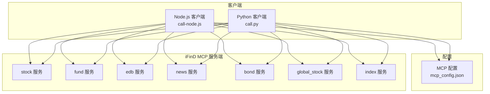
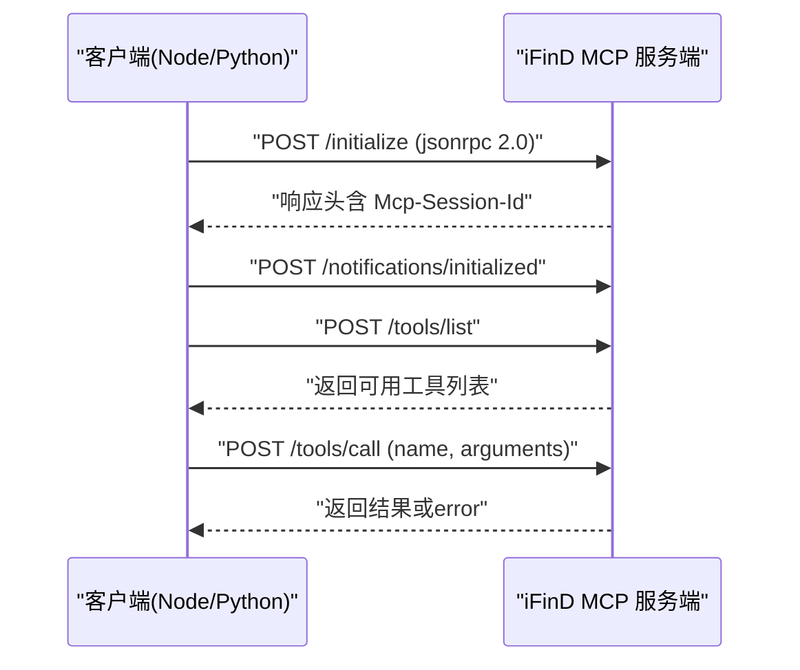
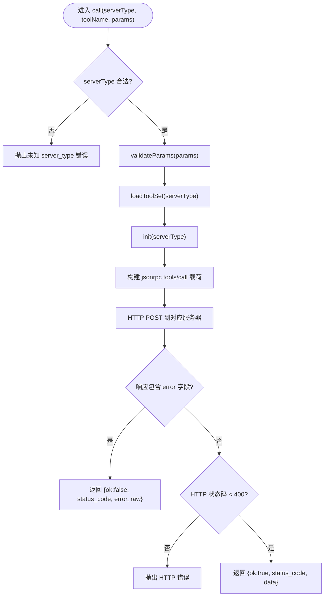
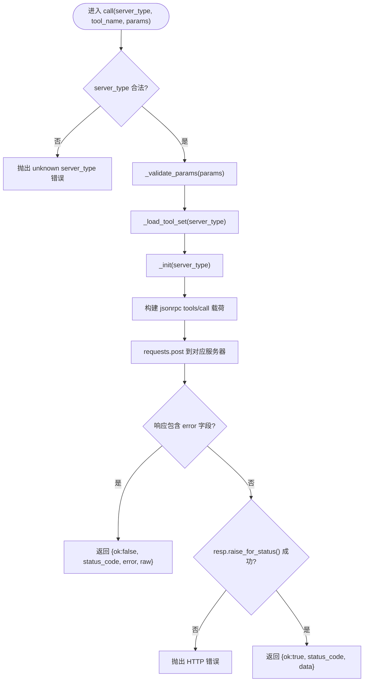
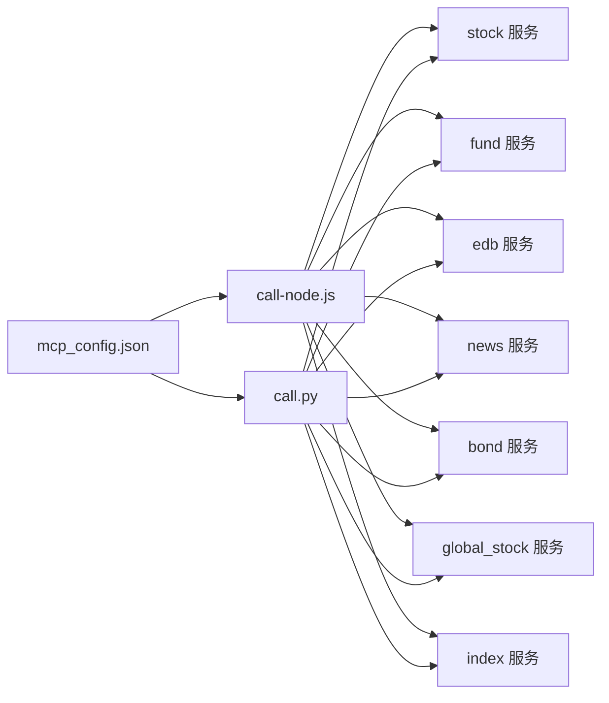

# iFinD金融数据技能

<cite>
**本文引用的文件**   
- [call-node.js](file://skills/ifind-finance-data-1.3.0/call-node.js)
- [call.py](file://skills/ifind-finance-data-1.3.0/call.py)
- [mcp_config.json](file://skills/ifind-finance-data-1.3.0/mcp_config.json)
- [cn_stock.md](file://skills/ifind-finance-data-1.3.0/references/cn_stock.md)
- [fund.md](file://skills/ifind-finance-data-1.3.0/references/fund.md)
- [edb.md](file://skills/ifind-finance-data-1.3.0/references/edb.md)
- [index.md](file://skills/ifind-finance-data-1.3.0/references/index.md)
- [news_notices.md](file://skills/ifind-finance-data-1.3.0/references/news_notices.md)
</cite>

## 目录
1. [简介](#简介)
2. [项目结构](#项目结构)
3. [核心组件](#核心组件)
4. [架构总览](#架构总览)
5. [详细组件分析](#详细组件分析)
6. [依赖关系分析](#依赖关系分析)
7. [性能与优化建议](#性能与优化建议)
8. [故障排查指南](#故障排查指南)
9. [结论](#结论)
10. [附录：API参考](#附录api参考)

## 简介
本技能通过 MCP（Model Context Protocol）协议接入同花顺 iFinD 数据服务，提供股票、基金、债券、指数、宏观经济指标与新闻资讯等数据的统一调用能力。客户端实现包含 Node.js 与 Python 两个版本，均遵循统一的认证管理、多服务器路由与会话管理机制，屏蔽底层 HTTP 与 JSON-RPC 细节，对外暴露简洁的 call 与 listTools/list_tools 接口。

## 项目结构
该技能位于 skills/ifind-finance-data-1.3.0 目录下，核心由以下部分组成：
- 客户端实现：Node.js 与 Python 两套 HTTP 客户端，封装 MCP 初始化、会话管理与工具调用
- 配置：统一的认证令牌配置文件
- 参考文档：按数据类型划分的 API 参考与示例

图表来源
- [call-node.js:1-20](file://skills/ifind-finance-data-1.3.0/call-node.js#L1-L20)
- [call.py:1-20](file://skills/ifind-finance-data-1.3.0/call.py#L1-L20)
- [mcp_config.json:1-3](file://skills/ifind-finance-data-1.3.0/mcp_config.json#L1-L3)

章节来源
- [call-node.js:1-20](file://skills/ifind-finance-data-1.3.0/call-node.js#L1-L20)
- [call.py:1-20](file://skills/ifind-finance-data-1.3.0/call.py#L1-L20)
- [mcp_config.json:1-3](file://skills/ifind-finance-data-1.3.0/mcp_config.json#L1-L3)

## 核心组件
- 统一认证管理：从 mcp_config.json 读取 auth_token，并在请求头 Authorization 中携带
- 多服务器路由：根据 server_type 选择对应 MCP 服务地址（stock、fund、edb、news、bond、global_stock、index）
- 会话管理：首次调用时执行 initialize，获取 Mcp-Session-Id 并缓存，后续请求自动带上会话头；同时发送 notifications/initialized 完成握手
- 参数校验：递归校验输入对象，拒绝非法类型与危险键名，避免注入风险
- 工具发现与白名单：首次调用前拉取 tools/list，缓存允许的工具名集合，防止误调未授权工具
- 错误处理：对 HTTP 状态码与 JSON-RPC error 字段进行区分处理，返回结构化结果或抛出异常

章节来源
- [call-node.js:6-18](file://skills/ifind-finance-data-1.3.0/call-node.js#L6-L18)
- [call-node.js:30-40](file://skills/ifind-finance-data-1.3.0/call-node.js#L30-L40)
- [call-node.js:149-176](file://skills/ifind-finance-data-1.3.0/call-node.js#L149-L176)
- [call-node.js:117-147](file://skills/ifind-finance-data-1.3.0/call-node.js#L117-L147)
- [call-node.js:81-115](file://skills/ifind-finance-data-1.3.0/call-node.js#L81-L115)
- [call.py:6-18](file://skills/ifind-finance-data-1.3.0/call.py#L6-L18)
- [call.py:31-39](file://skills/ifind-finance-data-1.3.0/call.py#L31-L39)
- [call.py:85-116](file://skills/ifind-finance-data-1.3.0/call.py#L85-L116)
- [call.py:119-134](file://skills/ifind-finance-data-1.3.0/call.py#L119-L134)
- [call.py:59-82](file://skills/ifind-finance-data-1.3.0/call.py#L59-L82)

## 架构总览
下图展示了客户端与服务端之间的交互流程，包括初始化、会话建立、工具列表发现与工具调用。

图表来源
- [call-node.js:149-176](file://skills/ifind-finance-data-1.3.0/call-node.js#L149-L176)
- [call-node.js:117-147](file://skills/ifind-finance-data-1.3.0/call-node.js#L117-L147)
- [call-node.js:178-220](file://skills/ifind-finance-data-1.3.0/call-node.js#L178-L220)
- [call.py:85-116](file://skills/ifind-finance-data-1.3.0/call.py#L85-L116)
- [call.py:119-134](file://skills/ifind-finance-data-1.3.0/call.py#L119-L134)
- [call.py:137-171](file://skills/ifind-finance-data-1.3.0/call.py#L137-L171)

## 详细组件分析

### Node.js 客户端（call-node.js）
- 配置加载：读取 mcp_config.json 中的 auth_token
- 服务器路由：基于 SERVERS 映射将 server_type 解析为具体 URL
- 会话与ID：维护 _sessions 与 _req_ids，确保每个 server_type 独立会话与递增请求ID
- 请求封装：post 函数统一构造 headers、超时与错误处理，支持 http/https
- 参数校验：validateParams 递归检查对象结构与值类型，阻止危险键与非法数值
- 工具集缓存：loadToolSet 先初始化再拉取 tools/list，缓存允许的工具名集合
- 调用流程：call 先校验参数与工具名，再初始化并发起 tools/call，最后解析返回体
- 工具列表：listTools 用于动态查询当前可用工具

图表来源
- [call-node.js:178-220](file://skills/ifind-finance-data-1.3.0/call-node.js#L178-L220)
- [call-node.js:117-147](file://skills/ifind-finance-data-1.3.0/call-node.js#L117-L147)
- [call-node.js:149-176](file://skills/ifind-finance-data-1.3.0/call-node.js#L149-L176)
- [call-node.js:81-115](file://skills/ifind-finance-data-1.3.0/call-node.js#L81-L115)

章节来源
- [call-node.js:1-267](file://skills/ifind-finance-data-1.3.0/call-node.js#L1-L267)

### Python 客户端（call.py）
- 配置加载：使用 pathlib 读取 mcp_config.json 中的 auth_token
- 服务器路由：与 Node 版一致的 SERVERS 映射
- 会话与ID：_sessions 与 _next_id 维护会话与请求ID
- 请求封装：_post 使用 requests.post，统一设置 headers 与超时
- 参数校验：_validate_params 递归校验，拒绝非法类型与危险键
- 工具集缓存：_load_tool_set 调用 list_tools 拉取工具列表并缓存
- 调用流程：call 先校验参数与工具名，再初始化并发起 tools/call，解析返回体
- 工具列表：list_tools 用于动态查询当前可用工具

图表来源
- [call.py:137-171](file://skills/ifind-finance-data-1.3.0/call.py#L137-L171)
- [call.py:119-134](file://skills/ifind-finance-data-1.3.0/call.py#L119-L134)
- [call.py:85-116](file://skills/ifind-finance-data-1.3.0/call.py#L85-L116)
- [call.py:59-82](file://skills/ifind-finance-data-1.3.0/call.py#L59-L82)

章节来源
- [call.py:1-208](file://skills/ifind-finance-data-1.3.0/call.py#L1-L208)

### 配置与认证（mcp_config.json）
- 仅包含一个字段 auth_token，用于在请求头 Authorization 中传递
- 使用时需替换占位符为有效的 iFinD MCP Key

章节来源
- [mcp_config.json:1-3](file://skills/ifind-finance-data-1.3.0/mcp_config.json#L1-L3)

## 依赖关系分析
- 外部依赖
  - Node.js：fs、path、http、https
  - Python：json、math、pathlib、requests
- 内部依赖
  - 客户端模块依赖 mcp_config.json 获取认证信息
  - 各 server_type 通过 SERVERS 映射指向不同 MCP 服务
  - 工具列表缓存降低重复网络开销

图表来源
- [call-node.js:10-18](file://skills/ifind-finance-data-1.3.0/call-node.js#L10-L18)
- [call.py:10-18](file://skills/ifind-finance-data-1.3.0/call.py#L10-L18)
- [mcp_config.json:1-3](file://skills/ifind-finance-data-1.3.0/mcp_config.json#L1-L3)

章节来源
- [call-node.js:1-20](file://skills/ifind-finance-data-1.3.0/call-node.js#L1-L20)
- [call.py:1-20](file://skills/ifind-finance-data-1.3.0/call.py#L1-L20)
- [mcp_config.json:1-3](file://skills/ifind-finance-data-1.3.0/mcp_config.json#L1-L3)

## 性能与优化建议
- 会话复用：同一进程内复用 Mcp-Session-Id，减少握手开销
- 工具列表缓存：首次拉取后缓存允许工具集合，避免频繁 tools/list 调用
- 批量查询：尽量合并查询条件（如多主体、多指标），减少往返次数
- 高频行情：使用 highfreq 模式与合理 interval，平衡实时性与带宽
- 超时控制：默认 60s，必要时针对大查询适当提高，但避免过长导致资源占用
- 并发限制：在高并发场景下对同一 server_type 的请求做限流与重试退避

[本节为通用指导，不直接分析具体文件]

## 故障排查指南
- 认证失败
  - 检查 mcp_config.json 中的 auth_token 是否有效
  - 确认请求头 Authorization 已正确携带
- 会话缺失
  - 若 initialize 未返回 Mcp-Session-Id，客户端会抛出错误；请检查服务端响应头
- 工具名称无效
  - 若 toolName 不在允许列表中，客户端会抛出错误；可先调用 listTools/list_tools 查看可用工具
- 参数校验失败
  - 确保 params 为 JSON 对象，不包含危险键名与非法数值类型
- HTTP 错误
  - 当响应状态码 >= 400 时，客户端会抛出 HTTP 错误或返回结构化错误对象

章节来源
- [call-node.js:166-176](file://skills/ifind-finance-data-1.3.0/call-node.js#L166-L176)
- [call-node.js:178-220](file://skills/ifind-finance-data-1.3.0/call-node.js#L178-L220)
- [call.py:103-116](file://skills/ifind-finance-data-1.3.0/call.py#L103-L116)
- [call.py:137-171](file://skills/ifind-finance-data-1.3.0/call.py#L137-L171)
- [call.py:59-82](file://skills/ifind-finance-data-1.3.0/call.py#L59-L82)

## 结论
本技能通过统一的 MCP 客户端封装，屏蔽了底层协议细节，提供了跨语言、跨服务的稳定调用能力。配合完善的参数校验、会话管理与工具白名单机制，既保证了安全性，也提升了易用性与性能。用户可按数据类型参考相应 API 文档快速上手，并根据业务需求进行高级定制。

[本节为总结性内容，不直接分析具体文件]

## 附录：API参考

### 中国股票服务（server_type="stock"）
- 工具列表与说明参见参考文档
- 典型工具
  - search_stocks：智能选股
  - get_stock_summary：股票信息摘要
  - get_stock_info：股票基本资料
  - get_stock_performance：日频行情与技术指标
  - get_stock_shareholders：股本结构与股东数据
  - get_stock_financials：财务数据与指标
  - get_risk_indicators：风险定量指标
  - get_stock_events：重大事件类指标
  - get_esg_data：ESG评级数据
  - stock_highfreq_quotes：A股高频行情快照与序列

章节来源
- [cn_stock.md:1-67](file://skills/ifind-finance-data-1.3.0/references/cn_stock.md#L1-L67)

### 基金服务（server_type="fund"）
- 典型工具
  - search_funds：基金搜索
  - get_fund_profile：基金基本资料
  - get_fund_market_performance：基金行情与业绩
  - get_fund_ownership：基金份额与持有人
  - get_fund_portfolio：基金持仓明细
  - get_fund_financials：基金财务指标
  - get_fund_company_info：基金公司信息
  - fund_highfreq_quotes：公募基金高频行情快照与序列

章节来源
- [fund.md:1-55](file://skills/ifind-finance-data-1.3.0/references/fund.md#L1-L55)

### 宏观经济/行业经济指标（server_type="edb"）
- 典型工具
  - search_edb：指标搜索
  - get_edb_data：指标数据查询

章节来源
- [edb.md:1-41](file://skills/ifind-finance-data-1.3.0/references/edb.md#L1-L41)

### 指数板块服务（server_type="index"）
- 典型工具
  - index_data：指数行情、技术指标与估值指标
  - sector_data：板块行情、财务分析与成分股指标
  - index_highfreq_quotes：指数高频行情快照与序列

章节来源
- [index.md:1-63](file://skills/ifind-finance-data-1.3.0/references/index.md#L1-L63)

### 新闻公告服务（server_type="news"）
- 典型工具
  - search_news：新闻资讯语义检索
  - search_notice：公告语义检索
  - search_trending_news：热点事件资讯查询

章节来源
- [news_notices.md:1-70](file://skills/ifind-finance-data-1.3.0/references/news_notices.md#L1-L70)

### 调用示例与返回值格式
- 调用方式
  - Node.js：require('./call-node.js') 后调用 call("stock", "search_stocks", {...})
  - Python：from call import call 后调用 call("stock", "search_stocks", {...})
- 返回值结构
  - 成功：{ ok: true, status_code: number, data: any }
  - 失败：{ ok: false, status_code: number, error: any, raw: any }
- 工具列表查询
  - Node.js：listTools("stock")
  - Python：list_tools("stock")

章节来源
- [cn_stock.md:16-36](file://skills/ifind-finance-data-1.3.0/references/cn_stock.md#L16-L36)
- [fund.md:14-34](file://skills/ifind-finance-data-1.3.0/references/fund.md#L14-L34)
- [edb.md:10-30](file://skills/ifind-finance-data-1.3.0/references/edb.md#L10-L30)
- [index.md:9-37](file://skills/ifind-finance-data-1.3.0/references/index.md#L9-L37)
- [news_notices.md:13-41](file://skills/ifind-finance-data-1.3.0/references/news_notices.md#L13-L41)
- [call-node.js:222-256](file://skills/ifind-finance-data-1.3.0/call-node.js#L222-L256)
- [call.py:174-203](file://skills/ifind-finance-data-1.3.0/call.py#L174-L203)