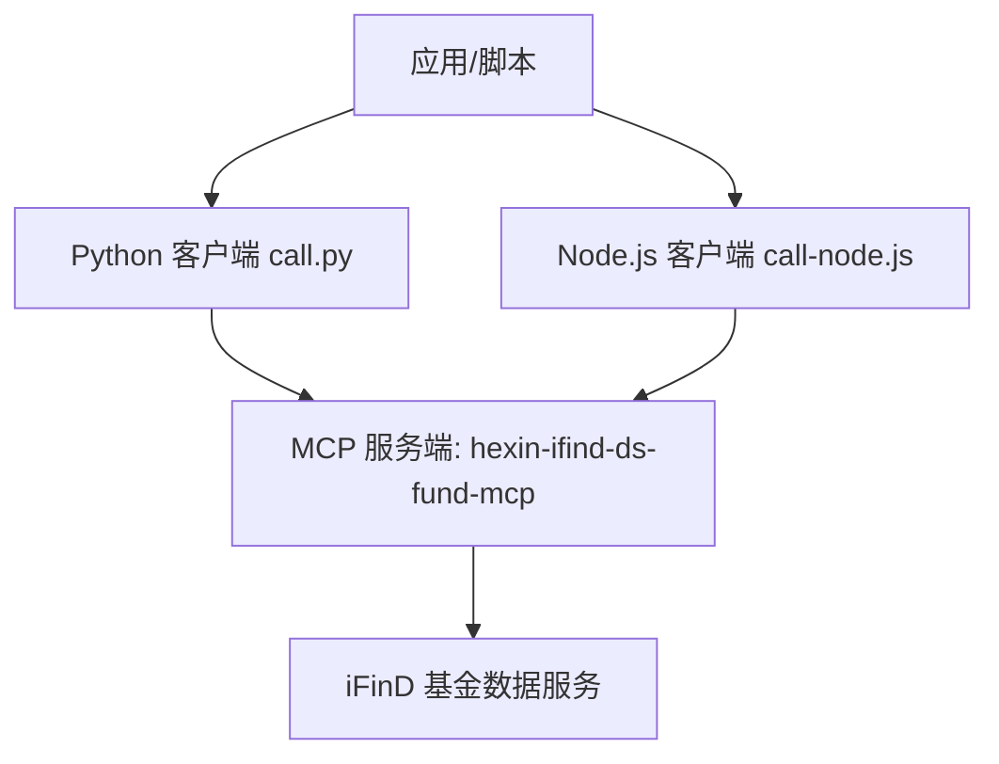
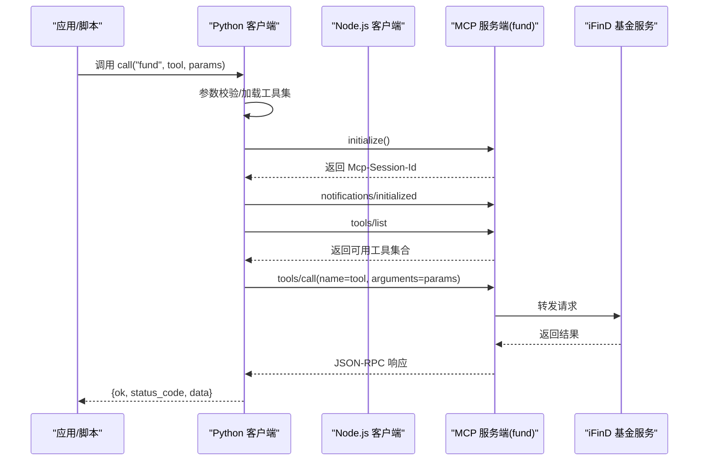
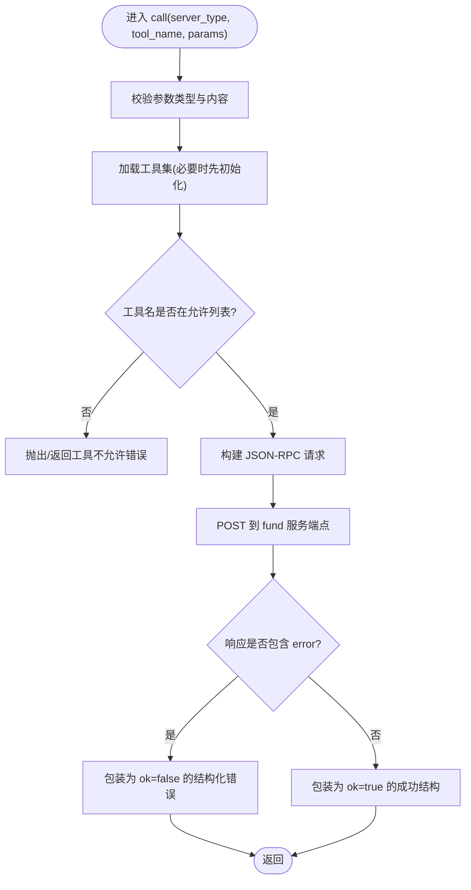
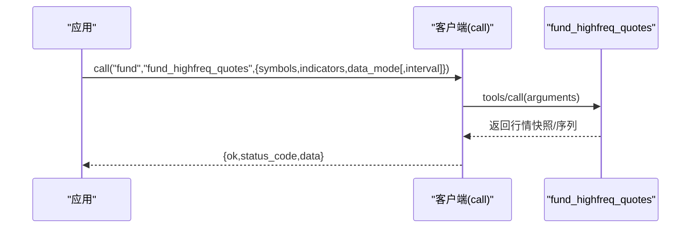
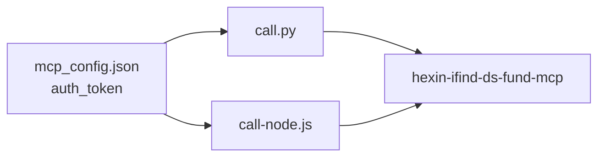

# 基金数据接口

<cite>
**本文引用的文件**   
- [fund.md](file://skills/ifind-finance-data-1.3.0/references/fund.md)
- [call.py](file://skills/ifind-finance-data-1.3.0/call.py)
- [call-node.js](file://skills/ifind-finance-data-1.3.0/call-node.js)
- [mcp_config.json](file://skills/ifind-finance-data-1.3.0/mcp_config.json)
- [README.MD](file://README.MD)
</cite>

## 目录
1. [简介](#简介)
2. [项目结构](#项目结构)
3. [核心组件](#核心组件)
4. [架构总览](#架构总览)
5. [详细组件分析](#详细组件分析)
6. [依赖关系分析](#依赖关系分析)
7. [性能与可用性建议](#性能与可用性建议)
8. [故障排查指南](#故障排查指南)
9. [结论](#结论)
10. [附录：使用示例与最佳实践](#附录使用示例与最佳实践)

## 简介
本文件为同花顺 iFinD 的“基金数据接口”专业文档，面向基金研究员与投资顾问，覆盖智能选基、基金资料、基金行情、持仓明细、持有人结构、基金公司信息、高频实时行情等维度。文档基于仓库内现有实现与说明进行整理，提供参数规范、返回格式约定、调用流程、错误处理与性能建议，并给出可直接复用的调用示例路径。

## 项目结构
本项目通过 MCP（Model Context Protocol）方式接入同花顺 iFinD 数据服务，Python 与 Node.js 两套客户端封装了统一的初始化、工具发现与调用流程。基金相关能力集中在 fund 服务器端点，并通过自然语言 query 或结构化参数完成查询。

图表来源
- [call.py:10-18](file://skills/ifind-finance-data-1.3.0/call.py#L10-L18)
- [call-node.js:10-18](file://skills/ifind-finance-data-1.3.0/call-node.js#L10-L18)
- [README.MD:57-67](file://README.MD#L57-L67)

章节来源
- [README.MD:57-67](file://README.MD#L57-L67)

## 核心组件
- 统一客户端封装
  - Python 客户端：负责鉴权、会话初始化、工具集拉取、参数校验与 JSON-RPC 调用。
  - Node.js 客户端：功能等价，采用 Promise 风格 API。
- 基金服务工具集（server_type="fund"）
  - search_funds：智能选基/模糊搜索
  - get_fund_profile：基金基本资料
  - get_fund_market_performance：基金行情与业绩
  - get_fund_ownership：基金份额与持有人
  - get_fund_portfolio：基金持仓明细
  - get_fund_financials：基金财务指标
  - get_fund_company_info：基金公司信息
  - fund_highfreq_quotes：公募基金高频实时行情快照与序列

章节来源
- [fund.md:1-12](file://skills/ifind-finance-data-1.3.0/references/fund.md#L1-L12)
- [call.py:137-171](file://skills/ifind-finance-data-1.3.0/call.py#L137-L171)
- [call-node.js:178-220](file://skills/ifind-finance-data-1.3.0/call-node.js#L178-L220)

## 架构总览
下图展示了从应用侧发起基金数据请求到 iFinD 服务的完整链路，包括初始化、工具发现、工具调用与响应处理。

图表来源
- [call.py:85-116](file://skills/ifind-finance-data-1.3.0/call.py#L85-L116)
- [call.py:119-134](file://skills/ifind-finance-data-1.3.0/call.py#L119-L134)
- [call.py:137-171](file://skills/ifind-finance-data-1.3.0/call.py#L137-L171)
- [call-node.js:149-176](file://skills/ifind-finance-data-1.3.0/call-node.js#L149-L176)
- [call-node.js:117-147](file://skills/ifind-finance-data-1.3.0/call-node.js#L117-L147)
- [call-node.js:178-220](file://skills/ifind-finance-data-1.3.0/call-node.js#L178-L220)

## 详细组件分析

### 通用客户端封装（Python/Node.js）
- 鉴权与会话
  - 读取配置中的 auth_token，并在请求头中携带 Authorization。
  - 首次调用会执行 initialize，获取 Mcp-Session-Id 并发送 initialized 通知，后续复用会话。
- 工具集发现
  - 通过 tools/list 动态拉取当前 server_type 下可用的工具名集合，避免硬编码。
- 参数校验
  - 仅允许 JSON 对象作为入参；递归检查键名白名单，拒绝危险键；数值需有限；不支持函数/符号/undefined/bigint 等类型。
- 调用与错误处理
  - 构造 JSON-RPC 2.0 请求，method 固定为 tools/call，name 为工具名，arguments 为业务参数。
  - 若响应包含 error 字段，则包装为 {ok:false, status_code, error, raw}；否则返回 {ok:true, status_code, data}。

图表来源
- [call.py:59-83](file://skills/ifind-finance-data-1.3.0/call.py#L59-L83)
- [call.py:119-134](file://skills/ifind-finance-data-1.3.0/call.py#L119-L134)
- [call.py:137-171](file://skills/ifind-finance-data-1.3.0/call.py#L137-L171)
- [call-node.js:81-115](file://skills/ifind-finance-data-1.3.0/call-node.js#L81-L115)
- [call-node.js:117-147](file://skills/ifind-finance-data-1.3.0/call-node.js#L117-L147)
- [call-node.js:178-220](file://skills/ifind-finance-data-1.3.0/call-node.js#L178-L220)

章节来源
- [call.py:6-18](file://skills/ifind-finance-data-1.3.0/call.py#L6-L18)
- [call.py:85-116](file://skills/ifind-finance-data-1.3.0/call.py#L85-L116)
- [call.py:137-171](file://skills/ifind-finance-data-1.3.0/call.py#L137-L171)
- [call-node.js:6-18](file://skills/ifind-finance-data-1.3.0/call-node.js#L6-L18)
- [call-node.js:149-176](file://skills/ifind-finance-data-1.3.0/call-node.js#L149-L176)
- [call-node.js:178-220](file://skills/ifind-finance-data-1.3.0/call-node.js#L178-L220)

### 基金服务工具集（fund）
以下为各工具的用途、典型参数与返回约定。所有工具均通过同一客户端封装调用，返回结构一致。

- search_funds（智能选基/模糊搜索）
  - 典型参数：{"query": "模糊基金名称或选基需求"}
  - 返回：按工具定义返回匹配结果（具体字段由服务端决定），客户端以 {ok, status_code, data} 包裹。
- get_fund_profile（基金基本资料）
  - 典型参数：{"query": "基金名称+指标"}
  - 返回：基金基础信息与指定指标值。
- get_fund_market_performance（基金行情与业绩）
  - 典型参数：{"query": "基金名称+时间范围+指标"}
  - 返回：历史净值/收益率等行情与业绩指标。
- get_fund_ownership（基金份额与持有人）
  - 典型参数：{"query": "基金名称+日期+指标"}
  - 返回：份额变动、持有人结构等。
- get_fund_portfolio（基金持仓明细）
  - 典型参数：{"query": "基金名称+日期+指标"}
  - 返回：股票/债券等资产持仓明细与占比。
- get_fund_financials（基金财务指标）
  - 典型参数：{"query": "基金名称+日期+指标"}
  - 返回：利润、费用、收益等财务类指标。
- get_fund_company_info（基金公司信息）
  - 典型参数：{"query": "基金名称+所属基金公司维度指标"}
  - 返回：基金公司层面的统计与管理信息。
- fund_highfreq_quotes（高频实时行情）
  - 典型参数：
    - symbols: 支持代码或简称，逗号分隔
    - indicators: 指标名列表，如最新价、IOPV净值估值、振幅、折价等
    - data_mode: real_time 或 highfreq
    - interval: 当 data_mode=highfreq 时指定分钟级间隔
  - 返回：实时快照或分钟级序列数据。

章节来源
- [fund.md:1-12](file://skills/ifind-finance-data-1.3.0/references/fund.md#L1-L12)
- [fund.md:36-53](file://skills/ifind-finance-data-1.3.0/references/fund.md#L36-L53)

### 高频实时行情（fund_highfreq_quotes）
该工具支持两种模式：
- real_time：最新快照
- highfreq：分钟级序列，可指定 interval

图表来源
- [fund.md:36-53](file://skills/ifind-finance-data-1.3.0/references/fund.md#L36-L53)
- [call.py:137-171](file://skills/ifind-finance-data-1.3.0/call.py#L137-L171)
- [call-node.js:178-220](file://skills/ifind-finance-data-1.3.0/call-node.js#L178-L220)

## 依赖关系分析
- 配置依赖
  - mcp_config.json 提供 auth_token，用于 HTTP 请求鉴权。
- 服务端点
  - fund 服务地址在客户端中集中维护，便于扩展与维护。
- 协议与交互
  - 基于 JSON-RPC 2.0，方法包括 initialize、notifications/initialized、tools/list、tools/call。
- 外部依赖
  - Python 使用 requests；Node.js 使用 http/https 原生模块。

图表来源
- [mcp_config.json:1-3](file://skills/ifind-finance-data-1.3.0/mcp_config.json#L1-L3)
- [call.py:6-18](file://skills/ifind-finance-data-1.3.0/call.py#L6-L18)
- [call-node.js:6-18](file://skills/ifind-finance-data-1.3.0/call-node.js#L6-L18)

章节来源
- [mcp_config.json:1-3](file://skills/ifind-finance-data-1.3.0/mcp_config.json#L1-L3)
- [call.py:6-18](file://skills/ifind-finance-data-1.3.0/call.py#L6-L18)
- [call-node.js:6-18](file://skills/ifind-finance-data-1.3.0/call-node.js#L6-L18)

## 性能与可用性建议
- 连接与会话
  - 客户端会在首次调用时建立会话并缓存 Mcp-Session-Id，建议复用进程内的客户端实例以减少握手开销。
- 超时与重试
  - 默认请求超时约 60 秒，initialize 为 30 秒。对网络不稳定场景可增加重试与退避策略。
- 参数校验前置
  - 客户端已内置严格参数校验，建议在业务层提前构造合法参数，减少无效往返。
- 批量与分页
  - 对于多标的或多指标查询，尽量合并至单次请求（如 symbols 逗号分隔），降低网络开销。
- 限流与并发
  - 根据服务端能力控制并发度，避免触发限流；对高频行情建议合理设置 interval。

[本节为通用建议，不直接分析具体文件]

## 故障排查指南
- 常见错误定位
  - 未知 server_type：检查传入的 server_type 是否为 fund。
  - 工具名不被允许：确认工具名在 tools/list 返回的集合中。
  - 参数非法：确保 params 为 JSON 对象，不包含被禁止的键，且数值有限。
  - 未返回会话 ID：initialize 成功但未返回 Mcp-Session-Id，需检查服务端响应头。
  - HTTP 错误码：status_code >= 400 表示服务端错误，结合 raw 字段定位原因。
- 日志与调试
  - 记录每次调用的 method、name、arguments、status_code 与 raw 响应，便于问题回溯。
- 鉴权失败
  - 检查 mcp_config.json 中的 auth_token 是否正确配置。

章节来源
- [call.py:137-171](file://skills/ifind-finance-data-1.3.0/call.py#L137-L171)
- [call.py:85-116](file://skills/ifind-finance-data-1.3.0/call.py#L85-L116)
- [call-node.js:178-220](file://skills/ifind-finance-data-1.3.0/call-node.js#L178-L220)
- [call-node.js:149-176](file://skills/ifind-finance-data-1.3.0/call-node.js#L149-L176)
- [mcp_config.json:1-3](file://skills/ifind-finance-data-1.3.0/mcp_config.json#L1-L3)

## 结论
本方案通过统一的 MCP 客户端封装，将同花顺 iFinD 的基金数据能力以标准化 JSON-RPC 接口暴露，支持智能选基、资料、行情、持仓、持有人、公司信息等全维度查询，并提供高频实时行情能力。借助严格的参数校验、会话复用与错误包装，可在生产环境中稳定集成。

[本节为总结性内容，不直接分析具体文件]

## 附录：使用示例与最佳实践

- 快速开始（Python）
  - 参考路径：[fund.md:29-34](file://skills/ifind-finance-data-1.3.0/references/fund.md#L29-L34)
- 快速开始（Node.js）
  - 参考路径：[fund.md:16-27](file://skills/ifind-finance-data-1.3.0/references/fund.md#L16-L27)
- 高频实时行情（Python）
  - 实时快照与分钟序列示例：[fund.md:36-53](file://skills/ifind-finance-data-1.3.0/references/fund.md#L36-L53)
- 配置鉴权
  - 在 mcp_config.json 中设置 auth_token：[mcp_config.json:1-3](file://skills/ifind-finance-data-1.3.0/mcp_config.json#L1-L3)
- 推荐实践
  - 复用客户端实例，避免重复初始化。
  - 合并多标的/多指标查询，减少请求次数。
  - 对异常进行捕获与重试，记录原始响应以便排障。
  - 对高频行情合理设置 interval，平衡时效性与带宽。

章节来源
- [fund.md:16-27](file://skills/ifind-finance-data-1.3.0/references/fund.md#L16-L27)
- [fund.md:29-34](file://skills/ifind-finance-data-1.3.0/references/fund.md#L29-L34)
- [fund.md:36-53](file://skills/ifind-finance-data-1.3.0/references/fund.md#L36-L53)
- [mcp_config.json:1-3](file://skills/ifind-finance-data-1.3.0/mcp_config.json#L1-L3)