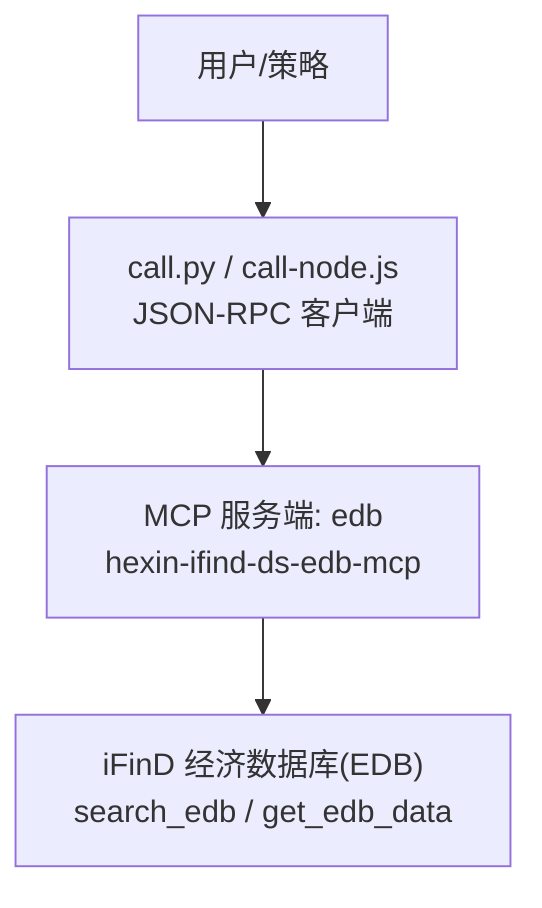
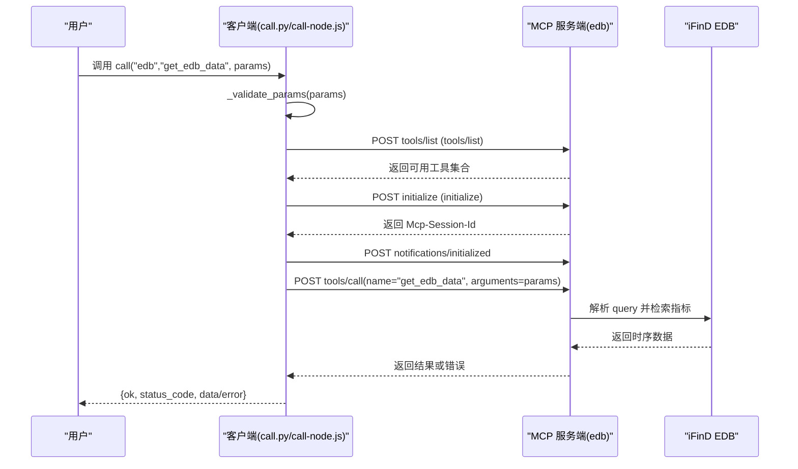
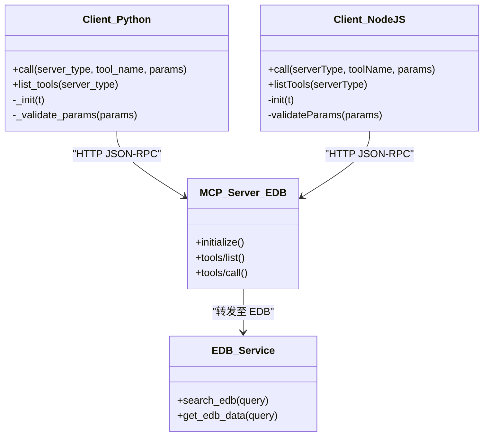

# 宏观经济数据接口

<cite>
**本文引用的文件**   
- [SKILL.md](file://skills/ifind-finance-data-1.3.0/SKILL.md)
- [edb.md](file://skills/ifind-finance-data-1.3.0/references/edb.md)
- [call.py](file://skills/ifind-finance-data-1.3.0/call.py)
- [call-node.js](file://skills/ifind-finance-data-1.3.0/call-node.js)
- [mcp_config.json](file://skills/ifind-finance-data-1.3.0/mcp_config.json)
- [README.MD](file://README.MD)
</cite>

## 目录
1. [简介](#简介)
2. [项目结构](#项目结构)
3. [核心组件](#核心组件)
4. [架构总览](#架构总览)
5. [详细组件分析](#详细组件分析)
6. [依赖关系分析](#依赖关系分析)
7. [性能与并发特性](#性能与并发特性)
8. [宏观分析场景与示例](#宏观分析场景与示例)
9. [故障排查指南](#故障排查指南)
10. [结论](#结论)
11. [附录](#附录)

## 简介
本文件面向宏观经济研究者与政策分析师，系统化说明同花顺 iFinD 经济数据库（EDB）的接入方式与使用方法。重点覆盖：
- EDB 能力范围：GDP、CPI、PPI、行业经济指标、大宗商品等宏观与行业指标查询
- 两大核心工具：search_edb（指标搜索）、get_edb_data（数据获取）
- “先搜索再取数”的工作流与最佳实践
- 时间序列处理与单位转换注意事项
- 基于 MCP 协议的调用流程、错误处理与并发限制

## 项目结构
本项目以“技能（Skill）+参考文档 + 调用脚本”的方式组织，EDB 相关能力集中在 ifind-finance-data 技能中：
- SKILL.md：技能总览、使用方式、注意事项、核心函数说明
- references/edb.md：EDB 子服务参考文档，包含 search_edb 与 get_edb_data 的参数与示例
- call.py / call-node.js：Python 与 Node.js 两种客户端实现，封装 JSON-RPC 调用、会话初始化、参数校验、错误返回
- mcp_config.json：存放 auth_token 配置
- README.MD：项目整体结构与数据源概览

图表来源
- [SKILL.md:1-111](file://skills/ifind-finance-data-1.3.0/SKILL.md#L1-L111)
- [edb.md:1-41](file://skills/ifind-finance-data-1.3.0/references/edb.md#L1-L41)
- [call.py:1-208](file://skills/ifind-finance-data-1.3.0/call.py#L1-L208)
- [call-node.js:1-267](file://skills/ifind-finance-data-1.3.0/call-node.js#L1-L267)

章节来源
- [README.MD:1-81](file://README.MD#L1-L81)
- [SKILL.md:1-111](file://skills/ifind-finance-data-1.3.0/SKILL.md#L1-L111)

## 核心组件
- 客户端封装
  - Python 客户端：call.py，提供 call()、list_tools()、_init()、_validate_params() 等方法
  - Node.js 客户端：call-node.js，提供 call()、listTools()、init()、validateParams() 等方法
- 配置与鉴权
  - mcp_config.json：auth_token 密钥存储
- EDB 参考文档
  - references/edb.md：EDB 工具清单、参数约定与示例

章节来源
- [call.py:1-208](file://skills/ifind-finance-data-1.3.0/call.py#L1-L208)
- [call-node.js:1-267](file://skills/ifind-finance-data-1.3.0/call-node.js#L1-L267)
- [mcp_config.json:1-3](file://skills/ifind-finance-data-1.3.0/mcp_config.json#L1-L3)
- [edb.md:1-41](file://skills/ifind-finance-data-1.3.0/references/edb.md#L1-L41)

## 架构总览
EDB 通过 MCP 协议对外暴露工具集，客户端通过统一的 call() 接口发起 tools/list 与 tools/call 请求。首次调用会执行 initialize 并建立会话，后续请求携带会话标识。

图表来源
- [call.py:85-171](file://skills/ifind-finance-data-1.3.0/call.py#L85-L171)
- [call-node.js:149-220](file://skills/ifind-finance-data-1.3.0/call-node.js#L149-L220)
- [edb.md:1-41](file://skills/ifind-finance-data-1.3.0/references/edb.md#L1-L41)

## 详细组件分析

### EDB 工具与参数规范
- server_type：固定为 "edb"
- 工具列表
  - search_edb：用于根据自然语言描述搜索可能的指标名称
    - 典型参数：{"query": "行业/产品/指标描述"}
  - get_edb_data：用于根据“指标名称+时间范围”的自然语言查询具体数据
    - 典型参数：{"query": "指标名称+时间范围"}，如“光伏电池产量当月值（202301-202506）”

建议工作流：当不确定具体指标时，优先使用 search_edb 进行探索，再结合上下文选择合适指标调用 get_edb_data。

章节来源
- [edb.md:1-41](file://skills/ifind-finance-data-1.3.0/references/edb.md#L1-L41)
- [SKILL.md:60-66](file://skills/ifind-finance-data-1.3.0/SKILL.md#L60-L66)

### 客户端实现要点（Python）
- 参数校验：拒绝非 JSON 对象、非法类型、受保护键名、NaN/Infinity 数值
- 会话管理：首次调用 initialize，记录 Mcp-Session-Id，并在后续请求头中携带
- 工具白名单：通过 tools/list 动态加载当前权限下的工具集合，避免硬编码
- 错误处理：统一包装为 {ok, status_code, data/error, raw}，便于上层判断

章节来源
- [call.py:59-83](file://skills/ifind-finance-data-1.3.0/call.py#L59-L83)
- [call.py:85-116](file://skills/ifind-finance-data-1.3.0/call.py#L85-L116)
- [call.py:119-134](file://skills/ifind-finance-data-1.3.0/call.py#L119-L134)
- [call.py:137-171](file://skills/ifind-finance-data-1.3.0/call.py#L137-L171)

### 客户端实现要点（Node.js）
- 参数校验：与 Python 端一致，额外拒绝 bigint/function/symbol/undefined 等类型
- 网络层：原生 http/https 模块，支持超时控制
- 会话管理：initialize 成功后缓存 session id，并在 headers 中传递
- 工具白名单：同样通过 tools/list 动态获取，避免硬编码

章节来源
- [call-node.js:81-115](file://skills/ifind-finance-data-1.3.0/call-node.js#L81-L115)
- [call-node.js:149-176](file://skills/ifind-finance-data-1.3.0/call-node.js#L149-L176)
- [call-node.js:178-220](file://skills/ifind-finance-data-1.3.0/call-node.js#L178-L220)

### 配置与鉴权
- mcp_config.json 需包含有效的 auth_token
- 客户端在请求头中携带 Authorization 与可选的 Mcp-Session-Id

章节来源
- [mcp_config.json:1-3](file://skills/ifind-finance-data-1.3.0/mcp_config.json#L1-L3)
- [call.py:31-39](file://skills/ifind-finance-data-1.3.0/call.py#L31-L39)
- [call-node.js:30-40](file://skills/ifind-finance-data-1.3.0/call-node.js#L30-L40)

## 依赖关系分析
- 客户端对服务端采用 JSON-RPC 2.0 风格方法：initialize、notifications/initialized、tools/list、tools/call
- 工具名由服务端动态下发，客户端不硬编码，降低版本耦合
- 会话状态由服务端维护，客户端仅负责透传会话 ID

图表来源
- [call.py:137-171](file://skills/ifind-finance-data-1.3.0/call.py#L137-L171)
- [call-node.js:178-220](file://skills/ifind-finance-data-1.3.0/call-node.js#L178-L220)
- [edb.md:1-41](file://skills/ifind-finance-data-1.3.0/references/edb.md#L1-L41)

章节来源
- [SKILL.md:69-111](file://skills/ifind-finance-data-1.3.0/SKILL.md#L69-L111)

## 性能与并发特性
- 免费用户：每秒最多并发 2 个请求
- 个人版正式用户：每秒最多并发 5 个请求
- 企业版正式用户：每秒最多并发 10 个请求
- 建议在批量拉取时序数据时做限流与重试，避免触发限流导致失败

章节来源
- [SKILL.md:26-28](file://skills/ifind-finance-data-1.3.0/SKILL.md#L26-L28)

## 宏观分析场景与示例
以下场景均基于“先搜索再取数”的流程，结合自然语言 query 完成指标定位与数据获取。为避免直接粘贴代码，本节给出步骤与参数要点，具体调用可参考对应文件的示例路径。

- 场景一：跟踪 GDP 趋势
  - 步骤
    - 使用 search_edb 搜索“国内生产总值/GDP 季度值/同比增速”
    - 从搜索结果中选择合适指标，使用 get_edb_data 拉取近 N 年季度序列
  - 参考示例路径
    - [edb.md:10-23](file://skills/ifind-finance-data-1.3.0/references/edb.md#L10-L23)
    - [edb.md:25-30](file://skills/ifind-finance-data-1.3.0/references/edb.md#L25-L30)

- 场景二：价格周期分析（CPI/PPI）
  - 步骤
    - 使用 search_edb 搜索“消费者物价指数/CPI 同比/环比”、“工业生产者出厂价格指数/PPI 同比/环比”
    - 使用 get_edb_data 指定月度时间范围，获取连续序列
  - 参考示例路径
    - [edb.md:32-40](file://skills/ifind-finance-data-1.3.0/references/edb.md#L32-L40)

- 场景三：行业景气度追踪（以新能源为例）
  - 步骤
    - 使用 search_edb 搜索“新能源汽车产量/销量/渗透率”
    - 使用 get_edb_data 拉取多期数据，计算复合增速与拐点
  - 参考示例路径
    - [edb.md:35-39](file://skills/ifind-finance-data-1.3.0/references/edb.md#L35-L39)

- 场景四：大宗商品价格与库存联动
  - 步骤
    - 使用 search_edb 搜索“铜/铝/原油 现货价/期货结算价/社会库存”
    - 使用 get_edb_data 拉取高频序列，配合价格与库存做相关性分析
  - 参考示例路径
    - [edb.md:10-23](file://skills/ifind-finance-data-1.3.0/references/edb.md#L10-L23)

- 场景五：流动性与利率环境评估
  - 步骤
    - 使用 search_edb 搜索“10年期国债收益率/社融/M2/DR007”
    - 使用 get_edb_data 获取中长期序列，观察利率下行或收紧阶段
  - 参考示例路径
    - [edb.md:25-30](file://skills/ifind-finance-data-1.3.0/references/edb.md#L25-L30)

- 场景六：产能利用率与进出口联动
  - 步骤
    - 使用 search_edb 搜索“制造业产能利用率/出口交货值/进口金额”
    - 使用 get_edb_data 拉取季度/月度序列，构建景气综合指数
  - 参考示例路径
    - [edb.md:32-40](file://skills/ifind-finance-data-1.3.0/references/edb.md#L32-L40)

- 调用入口参考
  - Python 调用入口与错误返回结构
    - [call.py:137-171](file://skills/ifind-finance-data-1.3.0/call.py#L137-L171)
  - Node.js 调用入口与错误返回结构
    - [call-node.js:178-220](file://skills/ifind-finance-data-1.3.0/call-node.js#L178-L220)

## 故障排查指南
- 常见错误与定位
  - 未配置或无效 auth_token：检查 mcp_config.json 中的 auth_token 是否正确
    - 参考：[mcp_config.json:1-3](file://skills/ifind-finance-data-1.3.0/mcp_config.json#L1-L3)
  - 参数校验失败：确保 params 为 JSON 对象，不包含受保护键名与非法类型
    - Python 校验逻辑参考：[call.py:59-83](file://skills/ifind-finance-data-1.3.0/call.py#L59-L83)
    - Node.js 校验逻辑参考：[call-node.js:81-115](file://skills/ifind-finance-data-1.3.0/call-node.js#L81-L115)
  - 工具不存在或权限不足：通过 list_tools 获取当前可用的工具清单，确认是否具备相应权益
    - Python 工具列表获取：[call.py:174-203](file://skills/ifind-finance-data-1.3.0/call.py#L174-L203)
    - Node.js 工具列表获取：[call-node.js:222-256](file://skills/ifind-finance-data-1.3.0/call-node.js#L222-L256)
  - 会话未初始化：首次调用需执行 initialize 并接收 Mcp-Session-Id
    - Python 初始化逻辑：[call.py:85-116](file://skills/ifind-finance-data-1.3.0/call.py#L85-L116)
    - Node.js 初始化逻辑：[call-node.js:149-176](file://skills/ifind-finance-data-1.3.0/call-node.js#L149-L176)
  - HTTP 错误码：检查 status_code 与 error 字段，必要时重试或降级
    - Python 返回结构：[call.py:158-171](file://skills/ifind-finance-data-1.3.0/call.py#L158-L171)
    - Node.js 返回结构：[call-node.js:202-220](file://skills/ifind-finance-data-1.3.0/call-node.js#L202-L220)

- 调试建议
  - 打印完整响应 raw 字段，便于与服务端对齐问题
  - 分步验证：先 tools/list，再 initialize，最后 tools/call
  - 控制并发：遵循免费/个人/企业版的并发上限，避免触发限流

章节来源
- [call.py:59-83](file://skills/ifind-finance-data-1.3.0/call.py#L59-L83)
- [call.py:85-116](file://skills/ifind-finance-data-1.3.0/call.py#L85-L116)
- [call.py:174-203](file://skills/ifind-finance-data-1.3.0/call.py#L174-L203)
- [call-node.js:81-115](file://skills/ifind-finance-data-1.3.0/call-node.js#L81-L115)
- [call-node.js:149-176](file://skills/ifind-finance-data-1.3.0/call-node.js#L149-L176)
- [call-node.js:222-256](file://skills/ifind-finance-data-1.3.0/call-node.js#L222-L256)

## 结论
- 通过“先搜索再取数”的 EDB 工作流，可以高效定位宏观与行业指标并完成时序数据获取
- 客户端封装提供了跨语言的统一调用体验，内置参数校验与会话管理，简化集成复杂度
- 注意并发限制与错误处理，保证生产环境的稳定性
- 对于时间序列分析与单位换算，建议在业务层做好清洗与标准化

## 附录

### API 定义速查
- 服务类型：server_type = "edb"
- 工具与方法
  - search_edb
    - 作用：根据自然语言描述搜索可能指标
    - 参数：{"query": "行业/产品/指标描述"}
  - get_edb_data
    - 作用：根据“指标名称+时间范围”的自然语言查询数据
    - 参数：{"query": "指标名称+时间范围"}，例如“光伏电池产量当月值（202301-202506）”
- 调用入口
  - Python：call(server_type, tool_name, params)
  - Node.js：call(serverType, toolName, params)

章节来源
- [edb.md:1-41](file://skills/ifind-finance-data-1.3.0/references/edb.md#L1-L41)
- [SKILL.md:69-86](file://skills/ifind-finance-data-1.3.0/SKILL.md#L69-L86)

### 时间序列处理与单位转换注意事项
- 频率识别
  - 月度：关注“当月值”表述；适用于 CPI、PPI、工业增加值等
  - 季度：关注“季度值”表述；适用于 GDP、产能利用率等
  - 年度：关注“年度值”表述；适用于长期趋势对比
- 时间范围
  - 使用“YYYYMM-YYYYMM”格式表达起止时间，如“202301-202506”
- 单位与口径
  - 不同指标可能存在同比/环比、绝对量/比率、现价/不变价等差异
  - 在分析前务必核对指标口径，并进行必要的去基期、季节调整与单位换算
- 缺失值与修订
  - 宏观数据常存在初值与修订，建议保留原始序列并标注修订日期
- 可视化与统计
  - 建议将多源数据对齐到统一频率（如季度），再进行回归或相关性分析

章节来源
- [edb.md:10-23](file://skills/ifind-finance-data-1.3.0/references/edb.md#L10-L23)
- [edb.md:25-30](file://skills/ifind-finance-data-1.3.0/references/edb.md#L25-L30)
- [edb.md:32-40](file://skills/ifind-finance-data-1.3.0/references/edb.md#L32-L40)