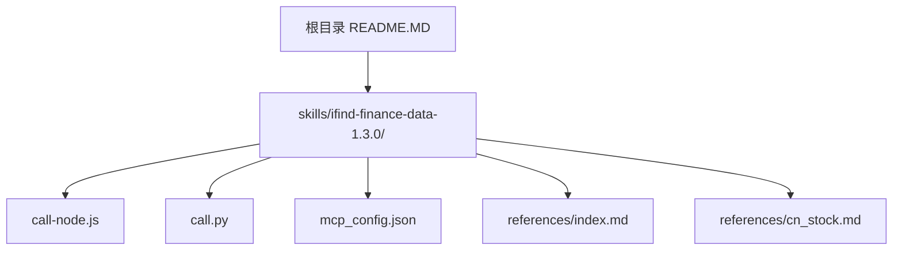
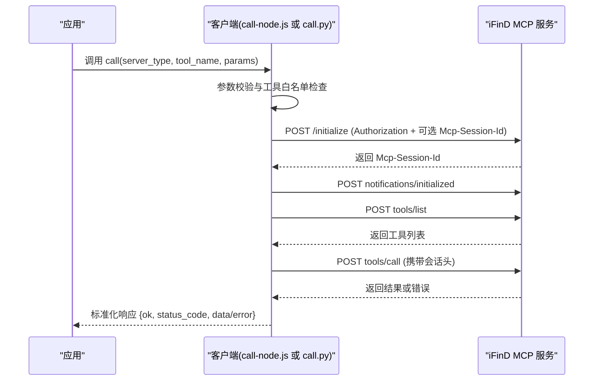
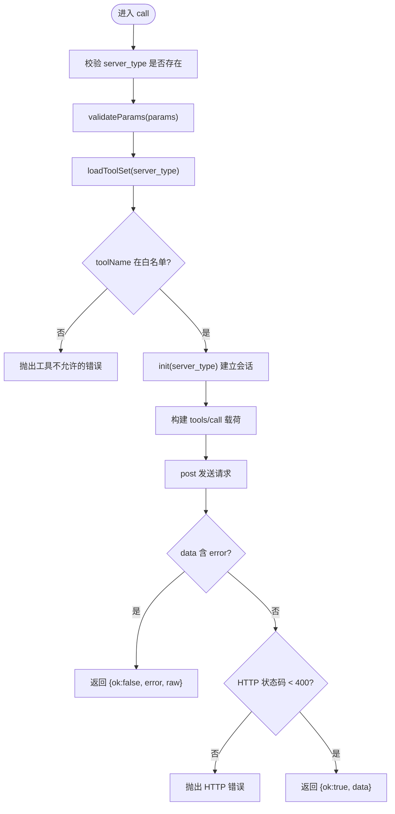
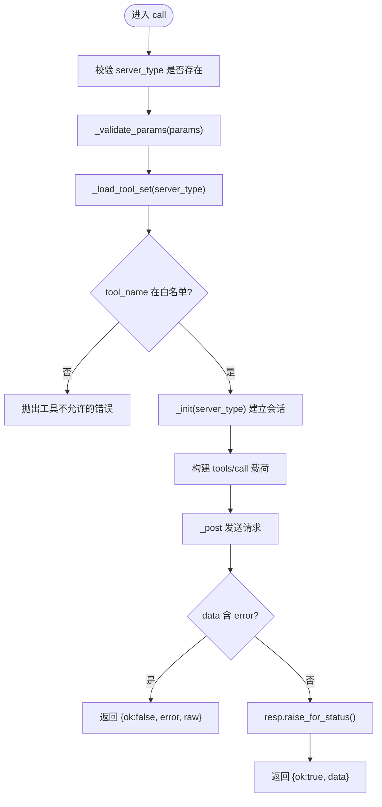
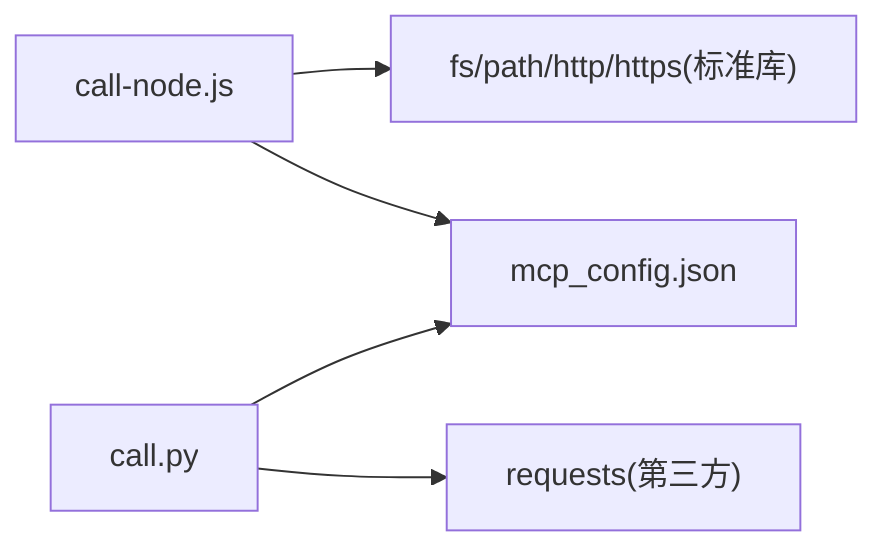

# 客户端配置与使用

<cite>
**本文引用的文件**   
- [call-node.js](file://skills/ifind-finance-data-1.3.0/call-node.js)
- [call.py](file://skills/ifind-finance-data-1.3.0/call.py)
- [mcp_config.json](file://skills/ifind-finance-data-1.3.0/mcp_config.json)
- [index.md](file://skills/ifind-finance-data-1.3.0/references/index.md)
- [cn_stock.md](file://skills/ifind-finance-data-1.3.0/references/cn_stock.md)
- [README.MD](file://README.MD)
</cite>

## 目录
1. [简介](#简介)
2. [项目结构](#项目结构)
3. [核心组件](#核心组件)
4. [架构总览](#架构总览)
5. [详细组件分析](#详细组件分析)
6. [依赖关系分析](#依赖关系分析)
7. [性能与并发限制](#性能与并发限制)
8. [故障排查指南](#故障排查指南)
9. [结论](#结论)
10. [附录：安装与环境配置、调用示例与最佳实践](#附录安装与环境配置调用示例与最佳实践)

## 简介
本文件面向 iFinD 金融数据技能的客户端，提供从基础配置到高级定制化的完整指导。重点覆盖以下方面：
- call-node.js（Node.js）与 call.py（Python）两个客户端的实现原理与差异
- 统一认证管理、多服务器路由与会话管理机制
- mcp_config.json 配置文件结构与 auth_token 获取方法
- 环境要求、安装步骤与常见错误处理
- 并发限制策略与性能优化建议
- 具体调用示例与最佳实践

## 项目结构
iFinD 技能位于 skills/ifind-finance-data-1.3.0 目录下，包含两个语言实现的客户端脚本与统一的 MCP 配置文件，以及若干参考文档用于说明可用工具与调用方式。

图表来源
- [README.MD:1-79](file://README.MD#L1-L79)
- [call-node.js:1-267](file://skills/ifind-finance-data-1.3.0/call-node.js#L1-L267)
- [call.py:1-208](file://skills/ifind-finance-data-1.3.0/call.py#L1-L208)
- [mcp_config.json:1-3](file://skills/ifind-finance-data-1.3.0/mcp_config.json#L1-L3)
- [index.md:1-63](file://skills/ifind-finance-data-1.3.0/references/index.md#L1-L63)
- [cn_stock.md:1-67](file://skills/ifind-finance-data-1.3.0/references/cn_stock.md#L1-L67)

章节来源
- [README.MD:1-79](file://README.MD#L1-L79)

## 核心组件
- Node.js 客户端：call-node.js
  - 通过内置 http/https 模块发起 JSON-RPC 请求
  - 维护会话、工具集缓存与请求 ID
  - 暴露 call 与 listTools 两个导出函数
- Python 客户端：call.py
  - 基于 requests 库发起 JSON-RPC 请求
  - 维护会话、工具集缓存与请求 ID
  - 暴露 call 与 list_tools 两个函数
- 配置文件：mcp_config.json
  - 存放 auth_token，供两个客户端读取并注入到请求头中

章节来源
- [call-node.js:1-267](file://skills/ifind-finance-data-1.3.0/call-node.js#L1-L267)
- [call.py:1-208](file://skills/ifind-finance-data-1.3.0/call.py#L1-L208)
- [mcp_config.json:1-3](file://skills/ifind-finance-data-1.3.0/mcp_config.json#L1-L3)

## 架构总览
两个客户端均遵循相同的协议与流程：
- 统一认证：从 mcp_config.json 读取 auth_token，放入 Authorization 请求头
- 多服务器路由：根据 server_type 选择不同后端服务 URL
- 会话管理：首次调用前执行 initialize，服务端返回 Mcp-Session-Id，后续请求携带该会话头
- 工具发现与校验：先 tools/list 拉取工具名集合，再在 tools/call 前进行白名单校验
- 参数校验：拒绝非法类型与危险字段，避免不安全输入

图表来源
- [call-node.js:149-176](file://skills/ifind-finance-data-1.3.0/call-node.js#L149-L176)
- [call-node.js:178-220](file://skills/ifind-finance-data-1.3.0/call-node.js#L178-L220)
- [call.py:85-116](file://skills/ifind-finance-data-1.3.0/call.py#L85-L116)
- [call.py:137-171](file://skills/ifind-finance-data-1.3.0/call.py#L137-L171)

## 详细组件分析

### Node.js 客户端（call-node.js）
- 配置加载与认证
  - 从同目录 mcp_config.json 读取 auth_token，作为 Authorization 请求头
- 多服务器路由
  - 定义 BASE 与 SERVERS 映射，支持 stock/fund/edb/news/bond/global_stock/index 等 server_type
- 会话管理
  - _sessions 字典按 server_type 保存 Mcp-Session-Id
  - 首次调用 init 发送 initialize，解析响应头中的 Mcp-Session-Id，随后发送 notifications/initialized
- 工具发现与缓存
  - loadToolSet 调用 tools/list，将工具名收集为 Set 并缓存于 _tool_sets
- 参数校验
  - validateParams 递归遍历对象，禁止危险键与不支持的类型，确保可安全序列化
- 请求封装
  - post 统一封装 HTTP(S) 请求，设置超时，自动解析 JSON，返回 response 与 data
- 调用流程
  - call 先校验 server_type 与参数，再加载工具集，初始化会话后发送 tools/call
  - listTools 直接调用 tools/list 并返回结构化结果

图表来源
- [call-node.js:178-220](file://skills/ifind-finance-data-1.3.0/call-node.js#L178-L220)
- [call-node.js:117-147](file://skills/ifind-finance-data-1.3.0/call-node.js#L117-L147)
- [call-node.js:149-176](file://skills/ifind-finance-data-1.3.0/call-node.js#L149-L176)
- [call-node.js:81-115](file://skills/ifind-finance-data-1.3.0/call-node.js#L81-L115)

章节来源
- [call-node.js:1-267](file://skills/ifind-finance-data-1.3.0/call-node.js#L1-L267)

### Python 客户端（call.py）
- 配置加载与认证
  - 从同目录 mcp_config.json 读取 auth_token，作为 Authorization 请求头
- 多服务器路由
  - 定义 BASE 与 SERVERS 映射，支持相同 server_type 集合
- 会话管理
  - _sessions 字典按 server_type 保存 Mcp-Session-Id
  - _init 发送 initialize，解析响应头中的 Mcp-Session-Id，随后发送 notifications/initialized
- 工具发现与缓存
  - _load_tool_set 调用 list_tools，将工具名收集为 set 并缓存于 _tool_sets
- 参数校验
  - _validate_params 递归遍历对象，禁止危险键与不支持的类型，确保可安全序列化
- 请求封装
  - _post 基于 requests.post 发送请求，关闭证书验证，返回 resp 与 data
- 调用流程
  - call 先校验 server_type 与参数，再加载工具集，初始化会话后发送 tools/call
  - list_tools 直接调用 tools/list 并返回结构化结果

图表来源
- [call.py:137-171](file://skills/ifind-finance-data-1.3.0/call.py#L137-L171)
- [call.py:119-134](file://skills/ifind-finance-data-1.3.0/call.py#L119-L134)
- [call.py:85-116](file://skills/ifind-finance-data-1.3.0/call.py#L85-L116)
- [call.py:59-82](file://skills/ifind-finance-data-1.3.0/call.py#L59-L82)

章节来源
- [call.py:1-208](file://skills/ifind-finance-data-1.3.0/call.py#L1-L208)

### 配置文件（mcp_config.json）
- 结构
  - 仅包含一个键 auth_token，值为 iFinD MCP 的访问令牌
- 用途
  - 两个客户端启动时读取该文件，并将 token 注入到每个请求的 Authorization 头中
- 注意事项
  - 请妥善保管 auth_token，避免泄露；不要将其提交到版本控制

章节来源
- [mcp_config.json:1-3](file://skills/ifind-finance-data-1.3.0/mcp_config.json#L1-L3)

## 依赖关系分析
- Node.js 客户端
  - 依赖 Node.js 运行时与标准库 fs、path、http、https
  - 无第三方包依赖
- Python 客户端
  - 依赖 Python 运行时与 requests 库
  - 其他均为标准库 json、math、pathlib

图表来源
- [call-node.js:1-5](file://skills/ifind-finance-data-1.3.0/call-node.js#L1-L5)
- [call.py:1-5](file://skills/ifind-finance-data-1.3.0/call.py#L1-L5)
- [mcp_config.json:1-3](file://skills/ifind-finance-data-1.3.0/mcp_config.json#L1-L3)

章节来源
- [call-node.js:1-267](file://skills/ifind-finance-data-1.3.0/call-node.js#L1-L267)
- [call.py:1-208](file://skills/ifind-finance-data-1.3.0/call.py#L1-L208)

## 性能与并发限制
- 连接与超时
  - Node.js 客户端默认请求超时为 60s，initialize 为 30s，通知为 10s
  - Python 客户端默认超时为 60s，initialize 为 30s，通知为 10s
- 会话复用
  - 同一 server_type 的会话在服务端生命周期内复用，减少握手开销
- 工具集缓存
  - 工具列表在服务端变化前会缓存，避免频繁 tools/list 调用
- 并发建议
  - 当前实现未显式限制并发度，建议在业务层对同一 server_type 的请求做限流与重试退避
  - 高频场景建议合并查询、批量拉取，降低网络往返次数
- 证书与安全
  - Python 客户端默认关闭证书验证（verify=False），生产环境建议启用证书校验或使用受信任 CA

章节来源
- [call-node.js:42-79](file://skills/ifind-finance-data-1.3.0/call-node.js#L42-L79)
- [call.py:42-56](file://skills/ifind-finance-data-1.3.0/call.py#L42-L56)

## 故障排查指南
- 认证失败
  - 现象：HTTP 401/403 或工具调用返回 error
  - 排查：确认 mcp_config.json 中 auth_token 正确且未过期
- 会话缺失
  - 现象：initialize 成功但未返回 Mcp-Session-Id
  - 排查：检查服务端是否返回相应响应头；客户端会在缺少会话头时抛出异常
- 工具不存在
  - 现象：toolName not allowed for server_type ...
  - 排查：调用 listTools/list_tools 查看当前可用工具名，注意大小写与命名变更
- 参数校验失败
  - 现象：TypeError 提示包含被阻止字段或不支持的类型
  - 排查：移除 __proto__/prototype/constructor 等危险键，确保参数为基本类型与数组/对象的组合
- 网络与超时
  - 现象：请求超时或网络错误
  - 排查：检查网络连通性、代理设置与服务端可用性；适当增大超时时间

章节来源
- [call-node.js:167-176](file://skills/ifind-finance-data-1.3.0/call-node.js#L167-L176)
- [call-node.js:182-186](file://skills/ifind-finance-data-1.3.0/call-node.js#L182-L186)
- [call-node.js:81-115](file://skills/ifind-finance-data-1.3.0/call-node.js#L81-L115)
- [call.py:103-106](file://skills/ifind-finance-data-1.3.0/call.py#L103-L106)
- [call.py:141-144](file://skills/ifind-finance-data-1.3.0/call.py#L141-L144)
- [call.py:59-82](file://skills/ifind-finance-data-1.3.0/call.py#L59-L82)

## 结论
两个客户端以一致的协议与流程对接 iFinD MCP 服务，具备统一的认证、会话与工具管理能力。Node.js 客户端适合原生 JS 环境与浏览器外运行；Python 客户端更适合数据分析与自动化脚本。通过合理配置与并发控制，可在保证稳定性的前提下获得良好的性能表现。

## 附录：安装与环境配置、调用示例与最佳实践

### 环境要求
- Node.js 客户端
  - 需要 Node.js 运行时（版本不限定，建议使用长期支持版）
  - 无需额外第三方包
- Python 客户端
  - 需要 Python 3.x 运行时
  - 需要安装 requests 库

章节来源
- [call-node.js:1-5](file://skills/ifind-finance-data-1.3.0/call-node.js#L1-L5)
- [call.py:1-5](file://skills/ifind-finance-data-1.3.0/call.py#L1-L5)

### 安装与配置步骤
- 准备 mcp_config.json
  - 在同目录下创建 mcp_config.json，填入你的 auth_token
- 获取 auth_token
  - 请参考 iFinD 官方文档或控制台生成 MCP 访问令牌，并将其写入 mcp_config.json 的 auth_token 字段
- 验证连通性
  - 使用 listTools/list_tools 查看当前可用工具列表，确认认证与网络正常

章节来源
- [mcp_config.json:1-3](file://skills/ifind-finance-data-1.3.0/mcp_config.json#L1-L3)

### 调用示例
- Node.js 示例（指数板块）
  - 参考路径：[index.md:11-26](file://skills/ifind-finance-data-1.3.0/references/index.md#L11-L26)
- Python 示例（股票）
  - 参考路径：[cn_stock.md:31-36](file://skills/ifind-finance-data-1.3.0/references/cn_stock.md#L31-L36)
- 更多示例
  - 指数与板块查询示例：[index.md:39-63](file://skills/ifind-finance-data-1.3.0/references/index.md#L39-L63)
  - 股票选股与行情示例：[cn_stock.md:38-67](file://skills/ifind-finance-data-1.3.0/references/cn_stock.md#L38-L67)

章节来源
- [index.md:1-63](file://skills/ifind-finance-data-1.3.0/references/index.md#L1-L63)
- [cn_stock.md:1-67](file://skills/ifind-finance-data-1.3.0/references/cn_stock.md#L1-L67)

### 最佳实践
- 参数构造
  - 尽量使用自然语言 query 描述查询意图，减少复杂嵌套结构
- 工具选择
  - 优先使用 listTools/list_tools 获取最新工具名，避免因服务端变更导致调用失败
- 并发与限流
  - 在业务层对同一 server_type 的请求进行限流与重试退避，避免瞬时高并发导致服务端拒绝
- 安全与合规
  - 妥善保管 auth_token，避免硬编码与泄露；生产环境建议开启证书校验
- 错误处理
  - 捕获并记录 HTTP 状态码与 error 信息，便于定位问题