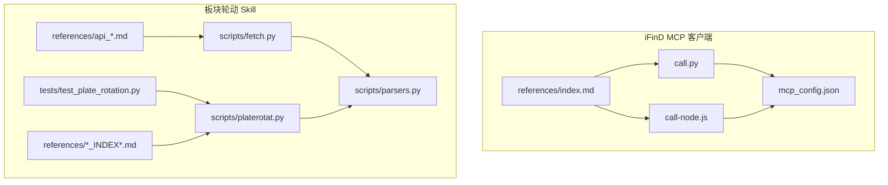
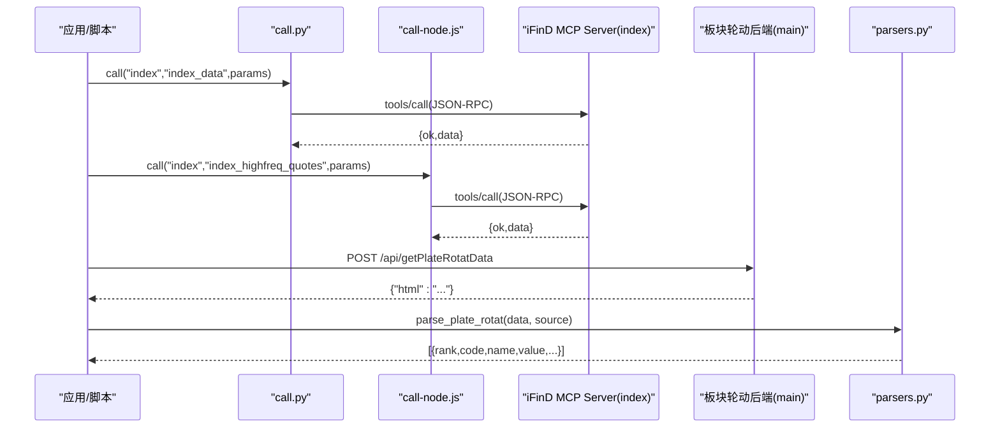
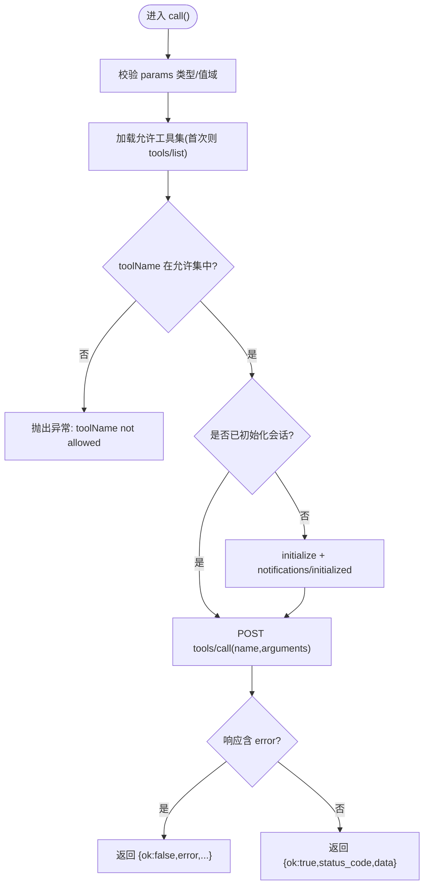
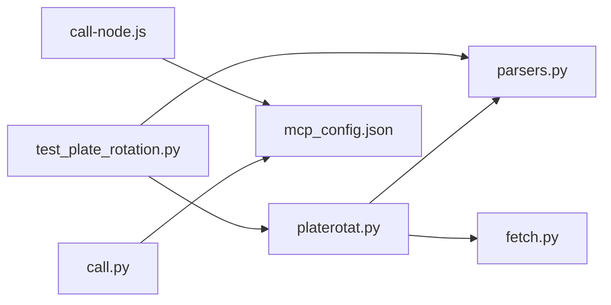

# 指数板块数据接口

<cite>
**本文引用的文件**   
- [index.md](file://skills/ifind-finance-data-1.3.0/references/index.md)
- [call.py](file://skills/ifind-finance-data-1.3.0/call.py)
- [mcp_config.json](file://skills/ifind-finance-data-1.3.0/mcp_config.json)
- [call-node.js](file://skills/ifind-finance-data-1.3.0/call-node.js)
- [_INDEX.md](file://skills/plate-rotation-skill/references/_INDEX.md)
- [api_getplaterotatdata.md](file://skills/plate-rotation-skill/references/api_getplaterotatdata.md)
- [api_getlongbyplate.md](file://skills/plate-rotation-skill/references/api_getlongbyplate.md)
- [api_getplatedaychart.md](file://skills/plate-rotation-skill/references/api_getplatedaychart.md)
- [api_getplaterotatchart.md](file://skills/plate-rotation-skill/references/api_getplaterotatchart.md)
- [stock-facts.md](file://skills/plate-rotation-skill/references/stock-facts.md)
- [fetch.py](file://skills/plate-rotation-skill/scripts/fetch.py)
- [parsers.py](file://skills/plate-rotation-skill/scripts/parsers.py)
- [platerotat.py](file://skills/plate-rotation-skill/scripts/platerotat.py)
- [test_plate_rotation.py](file://skills/plate-rotation-skill/tests/test_plate_rotation.py)
</cite>

## 目录
1. [简介](#简介)
2. [项目结构](#项目结构)
3. [核心组件](#核心组件)
4. [架构总览](#架构总览)
5. [详细组件分析](#详细组件分析)
6. [依赖关系分析](#依赖关系分析)
7. [性能与可用性](#性能与可用性)
8. [故障排查指南](#故障排查指南)
9. [结论](#结论)
10. [附录：API 定义与示例](#附录api-定义与示例)

## 简介
本文件面向指数研究员与板块策略开发者，系统化梳理同花顺 iFinD 的“指数与板块”数据接入能力，并整合项目中已有的“板块轮动”工具链。内容覆盖：
- 指数行情、技术指标与估值指标；指数高频快照与分钟级序列
- 板块行情、成分股指标、龙头矩阵与强度时序
- 双源（同花顺/开盘啦）差异、板块代码前缀语义、时间窗口与日期参数
- 指数分析方法、权重与复权说明、时间序列处理与比较分析思路
- 提供可直接落地的调用路径与测试用例参考

## 项目结构
仓库中与“指数/板块”相关的能力主要分布在两个子模块：
- ifind-finance-data：iFinD MCP 客户端封装（Python/Node），暴露 index 服务下的工具集（如指数行情、高频快照等）
- plate-rotation-skill：板块轮动四件套（Top 榜单、龙头矩阵、排名曲线、强度时序），含网络层、解析层与高级 API

图表来源
- [call.py:1-208](file://skills/ifind-finance-data-1.3.0/call.py#L1-L208)
- [call-node.js:1-267](file://skills/ifind-finance-data-1.3.0/call-node.js#L1-L267)
- [mcp_config.json:1-3](file://skills/ifind-finance-data-1.3.0/mcp_config.json#L1-L3)
- [index.md:1-63](file://skills/ifind-finance-data-1.3.0/references/index.md#L1-L63)
- [fetch.py:1-230](file://skills/plate-rotation-skill/scripts/fetch.py#L1-L230)
- [parsers.py:1-212](file://skills/plate-rotation-skill/scripts/parsers.py#L1-L212)
- [platerotat.py:1-315](file://skills/plate-rotation-skill/scripts/platerotat.py#L1-L315)
- [test_plate_rotation.py:1-444](file://skills/plate-rotation-skill/tests/test_plate_rotation.py#L1-L444)
- [_INDEX.md:1-43](file://skills/plate-rotation-skill/references/_INDEX.md#L1-L43)
- [api_getplaterotatdata.md:1-74](file://skills/plate-rotation-skill/references/api_getplaterotatdata.md#L1-L74)
- [api_getlongbyplate.md:1-65](file://skills/plate-rotation-skill/references/api_getlongbyplate.md#L1-L65)
- [api_getplatedaychart.md:1-48](file://skills/plate-rotation-skill/references/api_getplatedaychart.md#L1-L48)
- [api_getplaterotatchart.md:1-53](file://skills/plate-rotation-skill/references/api_getplaterotatchart.md#L1-L53)

章节来源
- [index.md:1-63](file://skills/ifind-finance-data-1.3.0/references/index.md#L1-L63)
- [call.py:1-208](file://skills/ifind-finance-data-1.3.0/call.py#L1-L208)
- [call-node.js:1-267](file://skills/ifind-finance-data-1.3.0/call-node.js#L1-L267)
- [mcp_config.json:1-3](file://skills/ifind-finance-data-1.3.0/mcp_config.json#L1-L3)
- [_INDEX.md:1-43](file://skills/plate-rotation-skill/references/_INDEX.md#L1-L43)

## 核心组件
- iFinD MCP 客户端（Python/Node）
  - 统一初始化、会话管理、工具列表发现与工具调用
  - 支持 index 服务下的工具：指数行情/指标、板块行情/成分股指标、指数高频快照/分钟序列
- 板块轮动 Skill
  - fetch.py：统一 HTTP 调用器（自动注入 Referer、重试、缓存）
  - parsers.py：HTML-in-JSON 解析器（主表、日期、龙头矩阵、持续性统计）
  - platerotat.py：高级 API（今日 Top N、妖王榜、Top5 排名曲线、单板块强度时序）
  - references：接口协议与领域知识（双源差异、前缀语义、交易日/复权/延迟等）

章节来源
- [call.py:1-208](file://skills/ifind-finance-data-1.3.0/call.py#L1-L208)
- [call-node.js:1-267](file://skills/ifind-finance-data-1.3.0/call-node.js#L1-L267)
- [index.md:1-63](file://skills/ifind-finance-data-1.3.0/references/index.md#L1-L63)
- [fetch.py:1-230](file://skills/plate-rotation-skill/scripts/fetch.py#L1-L230)
- [parsers.py:1-212](file://skills/plate-rotation-skill/scripts/parsers.py#L1-L212)
- [platerotat.py:1-315](file://skills/plate-rotation-skill/scripts/platerotat.py#L1-L315)
- [stock-facts.md:1-118](file://skills/plate-rotation-skill/references/stock-facts.md#L1-L118)

## 架构总览
整体由两层构成：上层为业务工具（iFinD MCP 客户端与板块轮动 Skill），下层为外部数据源（iFinD MCP Server 与公开行情页面）。

图表来源
- [call.py:137-171](file://skills/ifind-finance-data-1.3.0/call.py#L137-L171)
- [call-node.js:178-220](file://skills/ifind-finance-data-1.3.0/call-node.js#L178-L220)
- [index.md:1-63](file://skills/ifind-finance-data-1.3.0/references/index.md#L1-L63)
- [api_getplaterotatdata.md:1-74](file://skills/plate-rotation-skill/references/api_getplaterotatdata.md#L1-L74)
- [parsers.py:20-65](file://skills/plate-rotation-skill/scripts/parsers.py#L20-L65)

## 详细组件分析

### iFinD MCP 客户端（Python）
- 职责
  - 读取认证令牌与服务端地址
  - 维护会话 ID，完成 initialize + notifications/initialized
  - 校验入参类型与安全字段
  - 动态加载工具集，执行 tools/call
- 关键流程
  - 初始化：建立会话并保存 Mcp-Session-Id
  - 工具发现：tools/list 返回允许的工具名集合
  - 工具调用：tools/call 携带 name 与 arguments
- 错误处理
  - 非 JSON 响应回退为文本
  - 返回体包含 error 时包装为 ok=false 的结构

图表来源
- [call.py:59-83](file://skills/ifind-finance-data-1.3.0/call.py#L59-L83)
- [call.py:85-116](file://skills/ifind-finance-data-1.3.0/call.py#L85-L116)
- [call.py:119-134](file://skills/ifind-finance-data-1.3.0/call.py#L119-L134)
- [call.py:137-171](file://skills/ifind-finance-data-1.3.0/call.py#L137-L171)

章节来源
- [call.py:1-208](file://skills/ifind-finance-data-1.3.0/call.py#L1-L208)
- [mcp_config.json:1-3](file://skills/ifind-finance-data-1.3.0/mcp_config.json#L1-L3)

### iFinD MCP 客户端（Node.js）
- 职责
  - 与 Python 版本等价：初始化、会话、工具发现与调用
  - 使用原生 http/https 发起请求，超时控制
- 差异点
  - 基于 Promise 的异步模型
  - 对 headers 大小写兼容处理

章节来源
- [call-node.js:1-267](file://skills/ifind-finance-data-1.3.0/call-node.js#L1-L267)

### 指数与板块工具清单（index 服务）
- 工具
  - index_data：指数行情、技术指标与估值指标
  - sector_data：板块行情、财务分析与成分股指标
  - index_highfreq_quotes：指数实时快照与高频序列（支持 real_time/highfreq）
- 典型参数
  - query：自然语言查询（如“沪深300过去10个交易日的涨跌幅和收盘点数”）
  - symbols/indicators/data_mode/interval：高频快照与分钟序列

章节来源
- [index.md:1-63](file://skills/ifind-finance-data-1.3.0/references/index.md#L1-L63)

### 板块轮动 Skill：网络层（fetch.py）
- 功能
  - 统一 host 别名解析、URL 构造
  - 自动注入 Referer/UA/Orgin/X-Requested-With
  - 指数退避重试（429/5xx/网络异常）
  - 本地缓存（默认 TTL=1h，可关闭或调整）
- 输出
  - 原始字符串或美化 JSON（--raw 模式）

章节来源
- [fetch.py:1-230](file://skills/plate-rotation-skill/scripts/fetch.py#L1-L230)

### 板块轮动 Skill：解析层（parsers.py）
- 函数
  - parse_plate_rotat：从 HTML 抽取当日 Top N 板块（区分 ths/kaipan 数值语义）
  - parse_plate_rotat_dates：抽取日期列（newest first）
  - parse_plate_rotat_matrix：N×天矩阵（便于回溯分析）
  - parse_plate_long_heads：每日龙头矩阵（兼容“当日无领涨”）
  - rank_plate_long_persistence：跨天频次统计（找“妖王”）
- 关键点
  - 正则兼容带%与不带%两种数值
  - 未上榜标记 value=10.5 + symbol=wu.png 不参与排序

章节来源
- [parsers.py:1-212](file://skills/plate-rotation-skill/scripts/parsers.py#L1-L212)

### 板块轮动 Skill：高级 API（platerotat.py）
- 函数
  - today_top(source,n,days)：今日 Top N
  - find_dragon_kings(platecode,days,top_n)：妖王榜（自动按前缀选择 from）
  - top1_curve(source,days)：Top5 排名变化曲线（ECharts 数据）
  - plate_strength(platecode,days)：单板块强度+量能时序（ECharts 数据）
- 运行时校验
  - 空数据/缺关键字段通过 stderr 输出 PR-EMPTY/PR-WARN 提示

章节来源
- [platerotat.py:1-315](file://skills/plate-rotation-skill/scripts/platerotat.py#L1-L315)

### 接口协议与领域知识
- 路由表与 from 差异
  - ths：板块涨幅%，单位带 %
  - kaipan：板块强度分，纯整数
- 板块代码前缀
  - 88x：同花顺
  - 80x/803x：开盘啦
- days/dates 语义
  - days 支持 10|20|30|50；dates 支持自定义日期串
- 其他事实
  - 交易日≠自然日、T+1、复权语义、数据延迟等

章节来源
- [_INDEX.md:1-43](file://skills/plate-rotation-skill/references/_INDEX.md#L1-L43)
- [api_getplaterotatdata.md:1-74](file://skills/plate-rotation-skill/references/api_getplaterotatdata.md#L1-L74)
- [api_getlongbyplate.md:1-65](file://skills/plate-rotation-skill/references/api_getlongbyplate.md#L1-L65)
- [api_getplatedaychart.md:1-48](file://skills/plate-rotation-skill/references/api_getplatedaychart.md#L1-L48)
- [api_getplaterotatchart.md:1-53](file://skills/plate-rotation-skill/references/api_getplaterotatchart.md#L1-L53)
- [stock-facts.md:1-118](file://skills/plate-rotation-skill/references/stock-facts.md#L1-L118)

## 依赖关系分析
- 模块耦合
  - platerotat.py 依赖 parsers.py 与 fetch.py
  - tests 同时依赖 platerotat.py 与 parsers.py
  - iFinD 客户端（Python/Node）独立于板块轮动 Skill
- 外部依赖
  - iFinD MCP Server（JSON-RPC）
  - 公开行情后端（main/data/x 主机别名）

图表来源
- [platerotat.py:1-315](file://skills/plate-rotation-skill/scripts/platerotat.py#L1-L315)
- [parsers.py:1-212](file://skills/plate-rotation-skill/scripts/parsers.py#L1-L212)
- [fetch.py:1-230](file://skills/plate-rotation-skill/scripts/fetch.py#L1-L230)
- [test_plate_rotation.py:1-444](file://skills/plate-rotation-skill/tests/test_plate_rotation.py#L1-L444)
- [call.py:1-208](file://skills/ifind-finance-data-1.3.0/call.py#L1-L208)
- [call-node.js:1-267](file://skills/ifind-finance-data-1.3.0/call-node.js#L1-L267)
- [mcp_config.json:1-3](file://skills/ifind-finance-data-1.3.0/mcp_config.json#L1-L3)

## 性能与可用性
- 指数高频数据
  - 实时快照延迟约秒级至分钟级；分钟序列需指定 interval
- 板块轮动接口
  - 默认缓存 TTL=1h，盘中建议按需禁用或缩短 TTL
  - 指数退避重试提升稳定性
- 解析效率
  - 正则解析 HTML-in-JSON 开销较小，但应避免重复逆向

[本节为通用指导，不直接分析具体文件]

## 故障排查指南
- iFinD MCP 客户端
  - 未返回 Mcp-Session-Id：检查 initialize 响应头
  - toolName 不在允许集：先 list_tools 确认可用工具
  - 参数非法：确保为 JSON 对象且不含受保护键
- 板块轮动 Skill
  - 空数据/周末/节假日：stderr 输出 PR-EMPTY 提示
  - 跨源错传 platecode：前缀与 from 不匹配将导致空结果
  - 未活跃板块：legend=null 或 value=10.5 表示空白
- 网络层
  - 429/5xx/网络异常：自动重试；仍失败查看 verbose 日志

章节来源
- [call.py:85-116](file://skills/ifind-finance-data-1.3.0/call.py#L85-L116)
- [call.py:137-171](file://skills/ifind-finance-data-1.3.0/call.py#L137-L171)
- [platerotat.py:75-98](file://skills/plate-rotation-skill/scripts/platerotat.py#L75-L98)
- [stock-facts.md:51-99](file://skills/plate-rotation-skill/references/stock-facts.md#L51-L99)

## 结论
本项目提供了两条互补的数据通道：
- iFinD MCP 客户端：面向指数行情、技术指标、估值与高频快照
- 板块轮动 Skill：面向板块热度、龙头矩阵与排名曲线，具备完善的解析与健壮性保障
结合两者，可构建完整的指数研究与板块轮动工作流。

[本节为总结性内容，不直接分析具体文件]

## 附录：API 定义与示例

### iFinD MCP 工具（index 服务）
- 工具：index_data
  - 用途：指数行情、技术指标与估值指标
  - 参数：query（自然语言）
- 工具：sector_data
  - 用途：板块行情、财务分析与成分股指标
  - 参数：query（自然语言）
- 工具：index_highfreq_quotes
  - 用途：指数实时快照与高频序列
  - 参数：symbols、indicators、data_mode（real_time/highfreq）、interval

章节来源
- [index.md:1-63](file://skills/ifind-finance-data-1.3.0/references/index.md#L1-L63)

### 板块轮动接口（main 主机）
- /api/getPlateRotatData
  - 输入：from（ths/kaipan）、days（10|20|30|50）、dates（可选）
  - 输出：html（HTML-in-JSON），配合 parsers.parse_plate_rotat 解析
- /api/getLongByPlate
  - 输入：platecode、days、dates（可选）
  - 输出：html（HTML-in-JSON），配合 parsers.parse_plate_long_heads 解析
- /api/getPlateRotatChart
  - 输入：from、days、dates（可选）
  - 输出：ECharts 数据（date、name、1..5 系列）
- /api/getPlateDayChart
  - 输入：platecode、days、dates（可选）
  - 输出：ECharts 数据（legend/date/series）

章节来源
- [_INDEX.md:1-43](file://skills/plate-rotation-skill/references/_INDEX.md#L1-L43)
- [api_getplaterotatdata.md:1-74](file://skills/plate-rotation-skill/references/api_getplaterotatdata.md#L1-L74)
- [api_getlongbyplate.md:1-65](file://skills/plate-rotation-skill/references/api_getlongbyplate.md#L1-L65)
- [api_getplaterotatchart.md:1-53](file://skills/plate-rotation-skill/references/api_getplaterotatchart.md#L1-L53)
- [api_getplatedaychart.md:1-48](file://skills/plate-rotation-skill/references/api_getplatedaychart.md#L1-L48)

### 指数与板块研究方法要点
- 指数分类体系
  - 综合指数、行业指数、主题指数等（以 iFinD 数据为准）
- 计算方法与权重
  - 指数通常采用市值加权；权重调整与调样规则以官方公告为准
- 复权处理
  - 个股 K 线涉及不复权/前复权/后复权；板块层面一般不复权
- 时间序列与比较分析
  - 使用 dates/newest-first 对齐多源数据
  - 注意 value=10.5 空白点不参与均值/中位数计算
  - 结合 Top5 曲线与强度时序进行轮动节奏判断

章节来源
- [stock-facts.md:87-99](file://skills/plate-rotation-skill/references/stock-facts.md#L87-L99)
- [api_getplaterotatchart.md:46-53](file://skills/plate-rotation-skill/references/api_getplaterotatchart.md#L46-L53)

### 代码示例路径（不展示源码）
- iFinD MCP 调用（Python）
  - [call.py:137-171](file://skills/ifind-finance-data-1.3.0/call.py#L137-L171)
- iFinD MCP 调用（Node.js）
  - [call-node.js:178-220](file://skills/ifind-finance-data-1.3.0/call-node.js#L178-L220)
- 板块轮动高级 API
  - [platerotat.py:102-218](file://skills/plate-rotation-skill/scripts/platerotat.py#L102-L218)
- 解析器
  - [parsers.py:20-175](file://skills/plate-rotation-skill/scripts/parsers.py#L20-L175)
- 在线集成测试
  - [test_plate_rotation.py:75-444](file://skills/plate-rotation-skill/tests/test_plate_rotation.py#L75-L444)