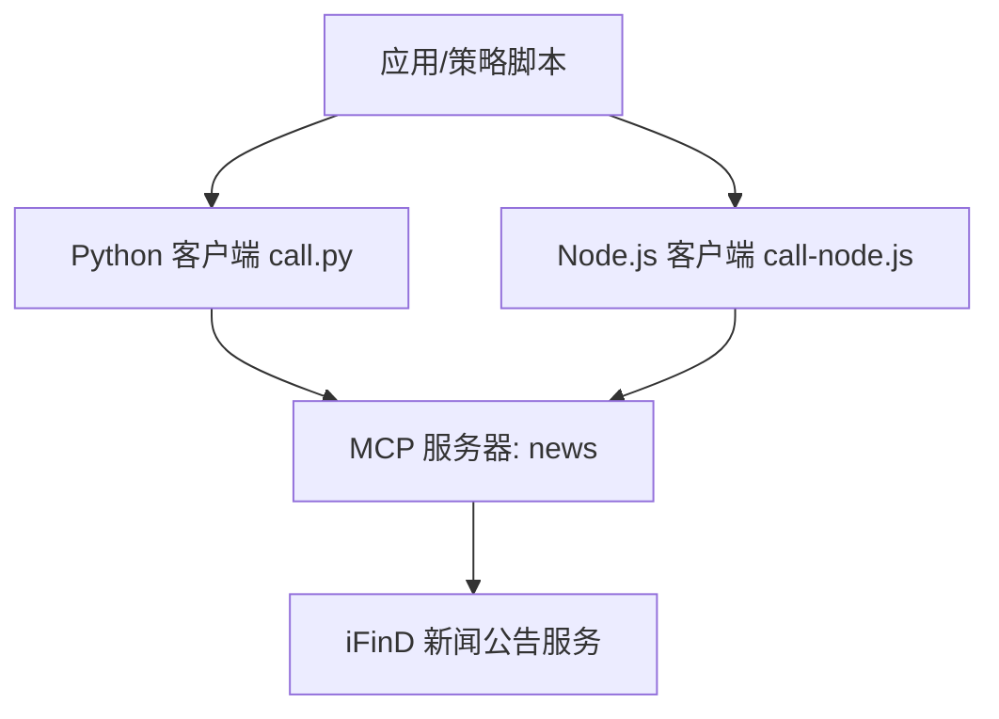
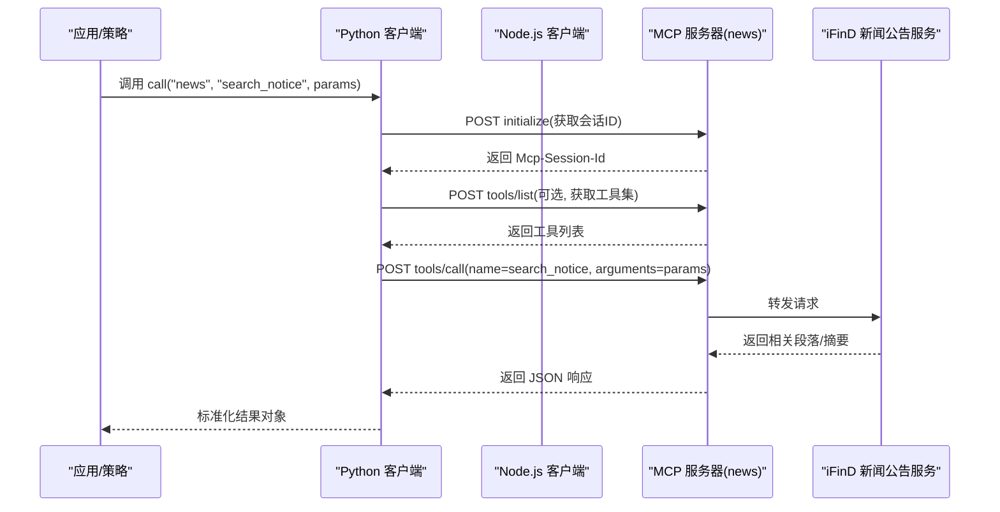
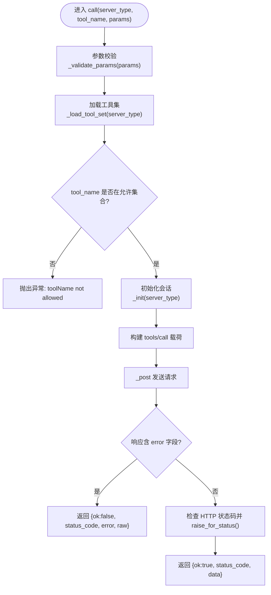
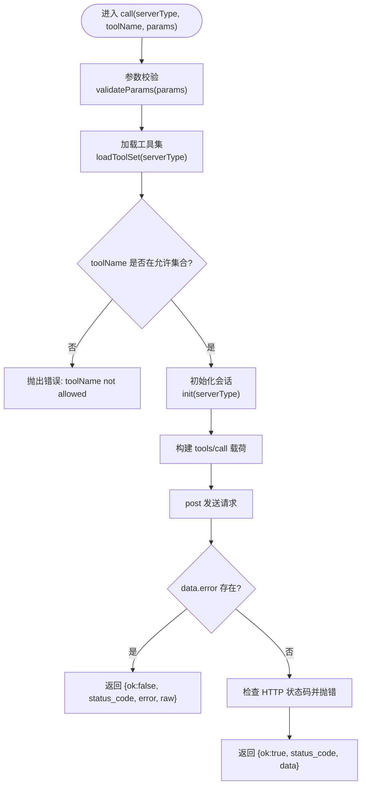
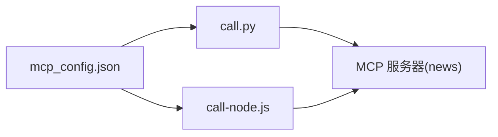

# 新闻公告数据接口

<cite>
**本文引用的文件**   
- [news_notices.md](file://skills/ifind-finance-data-1.3.0/references/news_notices.md)
- [call.py](file://skills/ifind-finance-data-1.3.0/call.py)
- [call-node.js](file://skills/ifind-finance-data-1.3.0/call-node.js)
- [mcp_config.json](file://skills/ifind-finance-data-1.3.0/mcp_config.json)
- [README.MD](file://README.MD)
</cite>

## 目录
1. [简介](#简介)
2. [项目结构](#项目结构)
3. [核心组件](#核心组件)
4. [架构总览](#架构总览)
5. [详细组件分析](#详细组件分析)
6. [依赖关系分析](#依赖关系分析)
7. [性能与可用性](#性能与可用性)
8. [故障排查指南](#故障排查指南)
9. [结论](#结论)
10. [附录：API 定义与使用示例](#附录api-定义与使用示例)

## 简介
本文件面向市场情报分析师与事件驱动策略开发者，系统化梳理同花顺 iFinD 的新闻公告数据接口能力。内容覆盖：
- 财经新闻、上市公司公告、热点事件的语义检索方法
- 关键词搜索与时间范围筛选
- 公告类型（定期报告、临时公告、监管函件等）的识别思路与重要程度评估建议
- 舆情分析与事件驱动策略的代码接入指导
- 文本数据处理与情绪分析的基础方法

该能力通过 MCP 协议对外暴露，提供统一的 Python/Node.js 调用封装，便于在研究与策略系统中集成。

## 项目结构
与本接口直接相关的代码与文档位于 skills/ifind-finance-data-1.3.0 目录下，包含：
- references/news_notices.md：新闻公告服务工具说明与参数示例
- call.py / call-node.js：Python/Node.js 客户端封装，负责初始化会话、工具发现、参数校验与 JSON-RPC 调用
- mcp_config.json：认证令牌配置入口
- README.MD：系统整体结构与数据源概览

图表来源
- [call.py:137-171](file://skills/ifind-finance-data-1.3.0/call.py#L137-L171)
- [call-node.js:178-220](file://skills/ifind-finance-data-1.3.0/call-node.js#L178-L220)
- [news_notices.md:1-12](file://skills/ifind-finance-data-1.3.0/references/news_notices.md#L1-L12)

章节来源
- [README.MD:57-68](file://README.MD#L57-L68)
- [news_notices.md:1-12](file://skills/ifind-finance-data-1.3.0/references/news_notices.md#L1-L12)

## 核心组件
- 新闻公告服务（server_type="news"）
  - search_news：新闻资讯语义检索
  - search_notice：公告语义检索
  - search_trending_news：热点事件资讯查询
- 客户端封装
  - Python：call.py 提供 call/list_tools 函数，统一处理初始化、会话、工具集加载与请求
  - Node.js：call-node.js 提供 call/listTools 异步函数，功能等价
- 配置
  - mcp_config.json：存放 auth_token，用于鉴权

章节来源
- [news_notices.md:1-12](file://skills/ifind-finance-data-1.3.0/references/news_notices.md#L1-L12)
- [call.py:137-171](file://skills/ifind-finance-data-1.3.0/call.py#L137-L171)
- [call-node.js:178-220](file://skills/ifind-finance-data-1.3.0/call-node.js#L178-L220)
- [mcp_config.json:1-3](file://skills/ifind-finance-data-1.3.0/mcp_config.json#L1-L3)

## 架构总览
新闻公告数据接口的端到端流程如下：
- 客户端读取配置并建立 HTTP 连接
- 首次调用前执行 initialize 获取会话 ID
- 可选 tools/list 拉取可用工具集合
- 以 tools/call 发起具体工具调用（如 search_news/search_notice/search_trending_news）
- 服务端返回结构化结果（通常为相关段落摘要）

图表来源
- [call.py:85-116](file://skills/ifind-finance-data-1.3.0/call.py#L85-L116)
- [call.py:119-134](file://skills/ifind-finance-data-1.3.0/call.py#L119-L134)
- [call.py:137-171](file://skills/ifind-finance-data-1.3.0/call.py#L137-L171)
- [call-node.js:149-176](file://skills/ifind-finance-data-1.3.0/call-node.js#L149-L176)
- [call-node.js:117-147](file://skills/ifind-finance-data-1.3.0/call-node.js#L117-L147)
- [call-node.js:178-220](file://skills/ifind-finance-data-1.3.0/call-node.js#L178-L220)

## 详细组件分析

### 新闻公告服务（server_type="news"）
- 内置语义检索能力，支持自然语言输入，返回相关段落而非全文
- 热点事件查询注重时效性，参数不宜过严；若无结果可放宽限制或改用资讯搜索
- query 字段可同时表达“报告元数据 + 查询内容”，例如同时限定年度报告年份与技术主题

常用工具与典型参数
- search_news：{"query": "...", "time_start": "YYYY-MM-DD", "time_end": "YYYY-MM-DD", "size": N}
- search_notice：{"query": "...", "time_start": "YYYY-MM-DD", "time_end": "YYYY-MM-DD", "size": N}
- search_trending_news：{"keyword": "...", "industry_name": "...", "time_scope": "...", "size": N}

章节来源
- [news_notices.md:1-12](file://skills/ifind-finance-data-1.3.0/references/news_notices.md#L1-L12)

### Python 客户端（call.py）
职责与关键点
- 读取 mcp_config.json 中的 auth_token
- 维护会话与请求 ID，自动注入 Mcp-Session-Id
- 参数校验：拒绝非法类型、NaN/Inf、受保护键名（__proto__/prototype/constructor）
- 工具集缓存：首次 tools/list 后缓存允许的工具名集合
- 错误处理：当服务端返回 error 字段时，包装为 {ok:false, status_code, error, raw}

关键流程
- _init：initialize 获取会话并发送 initialized 通知
- _load_tool_set：tools/list 解析工具名集合
- call：构造 tools/call 请求，统一返回结构
- list_tools：仅列出工具，不执行业务逻辑

图表来源
- [call.py:59-83](file://skills/ifind-finance-data-1.3.0/call.py#L59-L83)
- [call.py:85-116](file://skills/ifind-finance-data-1.3.0/call.py#L85-L116)
- [call.py:119-134](file://skills/ifind-finance-data-1.3.0/call.py#L119-L134)
- [call.py:137-171](file://skills/ifind-finance-data-1.3.0/call.py#L137-L171)

章节来源
- [call.py:1-208](file://skills/ifind-finance-data-1.3.0/call.py#L1-L208)

### Node.js 客户端（call-node.js）
职责与关键点
- 与 Python 版本一致的初始化、会话管理、工具集加载与调用
- 基于原生 http/https 模块实现请求，超时控制与错误传播
- 参数校验：拒绝非对象、数组、BigInt/Function/Symbol/undefined、NaN/Infinity 等
- 工具集缓存与动态校验

关键流程
- init：initialize 获取会话并发送 notifications/initialized
- loadToolSet：tools/list 解析工具名集合
- call：构造 tools/call 请求，统一返回结构
- listTools：仅列出工具

图表来源
- [call-node.js:81-115](file://skills/ifind-finance-data-1.3.0/call-node.js#L81-L115)
- [call-node.js:149-176](file://skills/ifind-finance-data-1.3.0/call-node.js#L149-L176)
- [call-node.js:117-147](file://skills/ifind-finance-data-1.3.0/call-node.js#L117-L147)
- [call-node.js:178-220](file://skills/ifind-finance-data-1.3.0/call-node.js#L178-L220)

章节来源
- [call-node.js:1-267](file://skills/ifind-finance-data-1.3.0/call-node.js#L1-L267)

### 配置（mcp_config.json）
- auth_token：用于鉴权的令牌，需替换为有效的 ifind-mcp key
- 客户端在启动时读取该文件，并在每个请求头中携带 Authorization

章节来源
- [mcp_config.json:1-3](file://skills/ifind-finance-data-1.3.0/mcp_config.json#L1-L3)

## 依赖关系分析
- 外部依赖
  - Python：requests（HTTP 客户端）
  - Node.js：http/https（原生网络库）
- 内部依赖
  - 两个客户端均依赖 mcp_config.json 中的 auth_token
  - 客户端与服务端通过 JSON-RPC 2.0 通信，遵循 initialize/tools/list/tools/call 流程

图表来源
- [call.py:6-18](file://skills/ifind-finance-data-1.3.0/call.py#L6-L18)
- [call-node.js:6-18](file://skills/ifind-finance-data-1.3.0/call-node.js#L6-L18)

章节来源
- [call.py:1-208](file://skills/ifind-finance-data-1.3.0/call.py#L1-L208)
- [call-node.js:1-267](file://skills/ifind-finance-data-1.3.0/call-node.js#L1-L267)
- [mcp_config.json:1-3](file://skills/ifind-finance-data-1.3.0/mcp_config.json#L1-L3)

## 性能与可用性
- 会话复用：客户端会缓存会话 ID，避免重复初始化开销
- 工具集缓存：首次 tools/list 后缓存允许的工具名集合，减少重复探测
- 超时控制：默认请求超时约 60s，初始化 30s，通知 10s
- 语义检索特性：返回相关段落而非全文，有助于降低传输与后续处理成本
- 热点事件查询：强调时效性，参数不宜过严；无结果时可放宽限制或切换至资讯搜索

[本节为通用性能建议，无需特定文件引用]

## 故障排查指南
常见问题与定位要点
- 未设置或错误的 auth_token
  - 现象：HTTP 401/403 或服务端返回错误
  - 处理：确认 mcp_config.json 中的 auth_token 有效
- 工具名称不存在或已变更
  - 现象：抛出 toolName not allowed 异常
  - 处理：先调用 list_tools 查看当前可用工具集合，再修正调用
- 参数类型不合法
  - 现象：抛出 input must be a JSON object / input contains blocked field / input contains invalid number 等
  - 处理：确保传入字典/对象，不包含 __proto__/prototype/constructor，数值为有限数
- 网络/超时问题
  - 现象：请求超时或连接失败
  - 处理：检查网络连通性与服务端可用性，必要时增大超时或重试

章节来源
- [call.py:59-83](file://skills/ifind-finance-data-1.3.0/call.py#L59-L83)
- [call.py:137-171](file://skills/ifind-finance-data-1.3.0/call.py#L137-L171)
- [call-node.js:81-115](file://skills/ifind-finance-data-1.3.0/call-node.js#L81-L115)
- [call-node.js:178-220](file://skills/ifind-finance-data-1.3.0/call-node.js#L178-L220)

## 结论
本接口通过统一的 MCP 协议与双语言客户端封装，提供了对财经新闻、上市公司公告与热点事件的语义检索能力。结合时间范围与关键词筛选，可满足市场情报采集与事件驱动策略的数据需求。建议在策略中引入基础文本处理与情绪分析管线，将“事件—影响—交易信号”形成闭环。

[本节为总结性内容，无需特定文件引用]

## 附录：API 定义与使用示例

### API 定义
- server_type
  - 值："news"
- 工具与方法
  - search_news
    - 用途：新闻资讯语义检索
    - 典型参数：{"query": "...", "time_start": "YYYY-MM-DD", "time_end": "YYYY-MM-DD", "size": N}
  - search_notice
    - 用途：公告语义检索
    - 典型参数：{"query": "...", "time_start": "YYYY-MM-DD", "time_end": "YYYY-MM-DD", "size": N}
  - search_trending_news
    - 用途：热点事件资讯查询
    - 典型参数：{"keyword": "...", "industry_name": "...", "time_scope": "...", "size": N}

章节来源
- [news_notices.md:7-11](file://skills/ifind-finance-data-1.3.0/references/news_notices.md#L7-L11)

### 调用方式（Python）
- 导入与调用
  - from call import call
  - result = call("news", "search_notice", {"query": "...", "time_start": "...", "time_end": "...", "size": N})
- 返回结构
  - ok: True/False
  - status_code: HTTP 状态码
  - data: 服务端返回数据（成功时）
  - error: 错误信息（失败时）
  - raw: 原始响应（失败时）

章节来源
- [call.py:137-171](file://skills/ifind-finance-data-1.3.0/call.py#L137-L171)
- [news_notices.md:31-41](file://skills/ifind-finance-data-1.3.0/references/news_notices.md#L31-L41)

### 调用方式（Node.js）
- 导入与调用
  - const { call } = require('./call-node.js')
  - const result = await call("news", "search_notice", { query: "...", time_start: "...", time_end: "...", size: N })
- 返回结构
  - ok: true/false
  - status_code: HTTP 状态码
  - data: 服务端返回数据（成功时）
  - error: 错误信息（失败时）
  - raw: 原始响应（失败时）

章节来源
- [call-node.js:178-220](file://skills/ifind-finance-data-1.3.0/call-node.js#L178-L220)
- [news_notices.md:15-29](file://skills/ifind-finance-data-1.3.0/references/news_notices.md#L15-L29)

### 公告类型与重要程度评估（实践建议）
- 公告类型识别
  - 定期报告：年报、半年报、季报等
  - 临时公告：重大事项、股权变动、业绩预告等
  - 监管函件：问询函、处罚决定、立案调查等
- 重要程度评估维度
  - 主体重要性：是否涉及控股股东/实控人/核心管理层
  - 影响面：是否改变业务模式、盈利能力、合规风险
  - 时效性：是否短期显著影响股价或流动性
  - 可验证性：是否有量化指标支撑（财务、订单、产能等）
- 落地方法
  - 使用 search_notice 的 query 组合“公司+公告类型+主题”进行定向检索
  - 对返回的相关段落进行二次过滤与打分，纳入事件驱动策略的信号池

章节来源
- [news_notices.md:1-6](file://skills/ifind-finance-data-1.3.0/references/news_notices.md#L1-L6)

### 舆情分析与事件驱动策略（接入指导）
- 数据采集
  - 使用 search_news/search_notice 按主题/行业/时间窗口抓取相关段落
  - 使用 search_trending_news 捕捉短期热点事件
- 文本处理
  - 清洗与分词：去除噪声、统一实体命名（公司简称/全称映射）
  - 去重与聚类：相似段落合并，降低冗余
- 情绪分析
  - 词典法：金融情感词典匹配（利好/利空词汇）
  - 模型法：轻量级分类器（正面/负面/中性），或使用开源大模型做零样本分类
- 事件到信号
  - 规则化：将事件类型映射为信号强度（如“重大资产重组”强信号，“一般人事变动”弱信号）
  - 时序化：记录事件发生时间与影响衰减曲线
  - 回测化：将信号与行情数据对齐，计算收益分布与风控指标
- 参考路径
  - 数据接入：参见上述 Python/Node.js 调用方式
  - 策略框架：可结合项目内策略文档的方法论，将事件信号作为因子之一

章节来源
- [news_notices.md:43-69](file://skills/ifind-finance-data-1.3.0/references/news_notices.md#L43-L69)
- [call.py:137-171](file://skills/ifind-finance-data-1.3.0/call.py#L137-L171)
- [call-node.js:178-220](file://skills/ifind-finance-data-1.3.0/call-node.js#L178-L220)