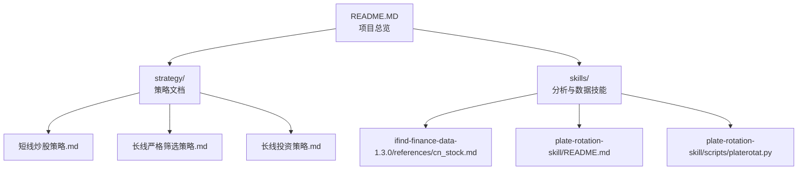
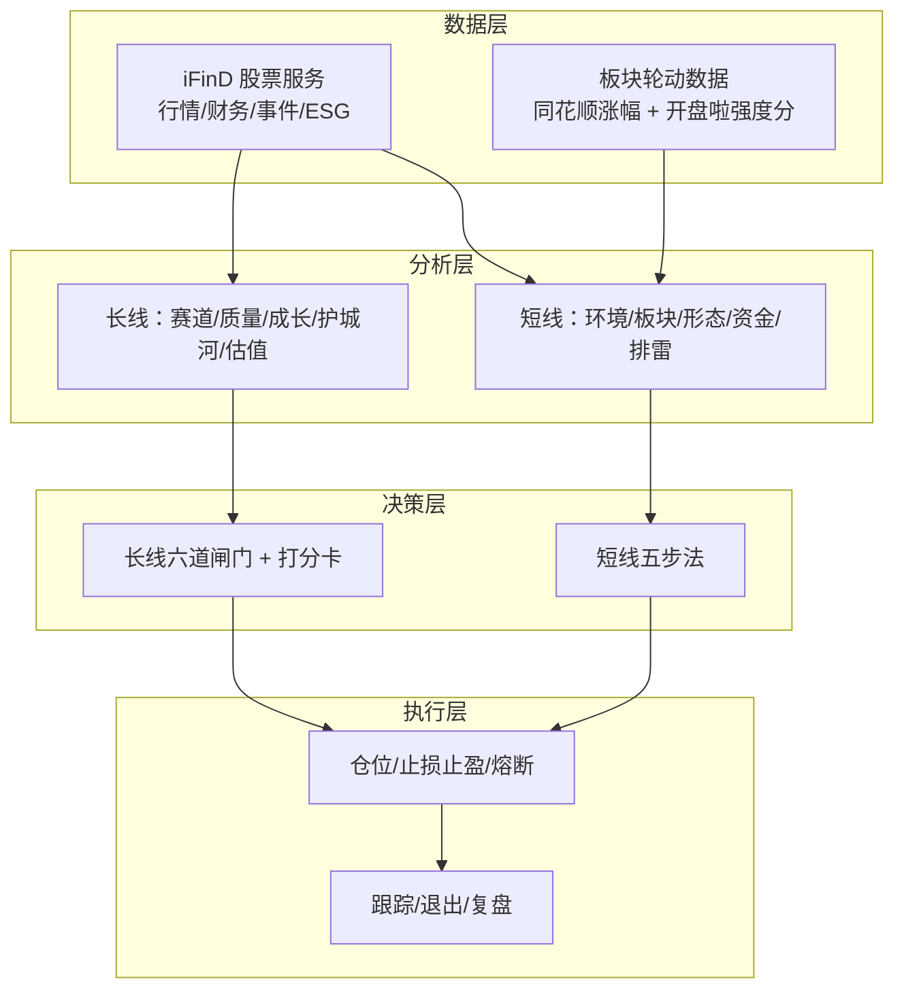
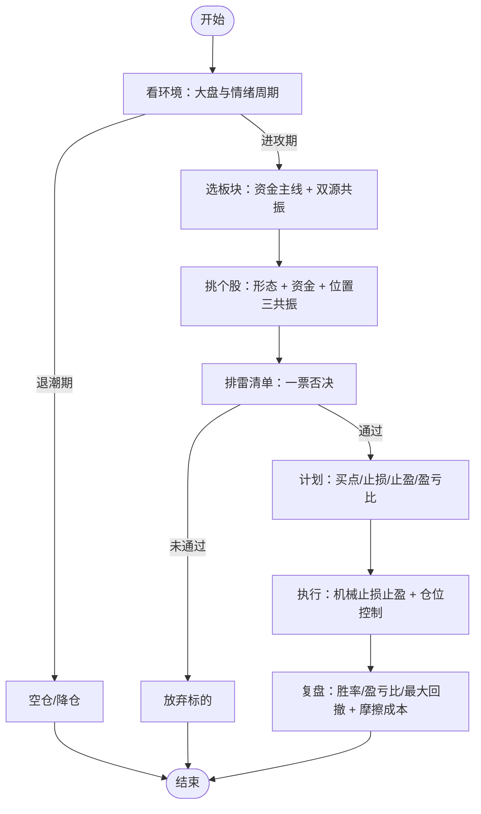
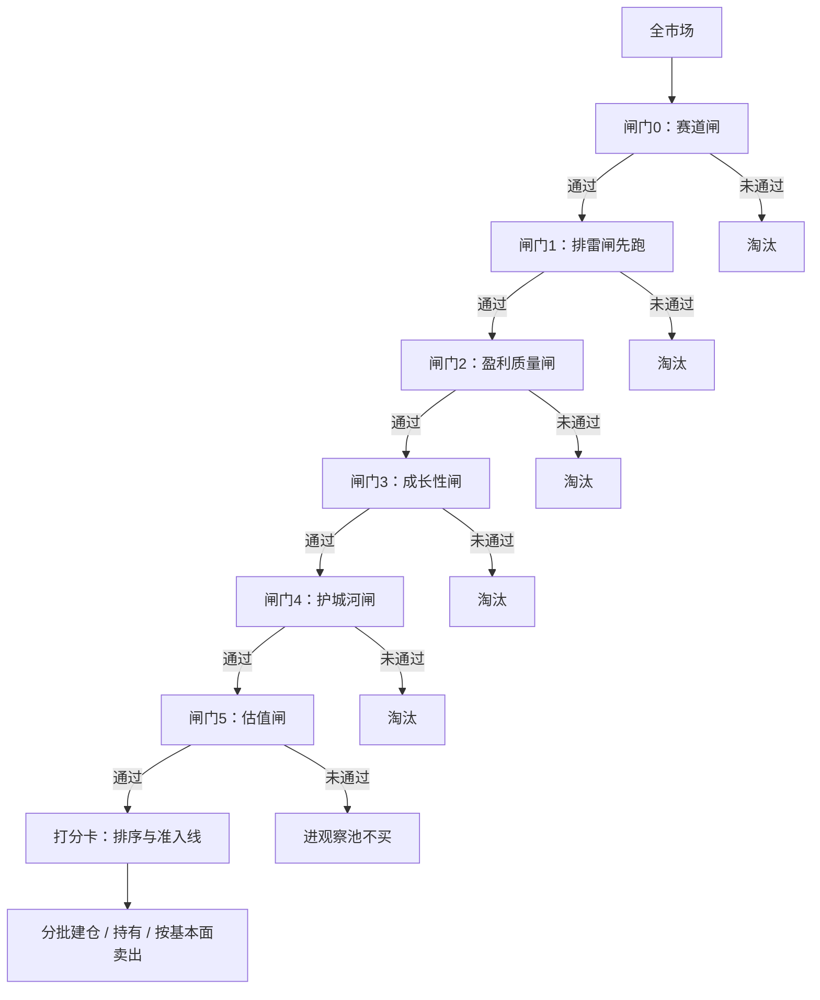
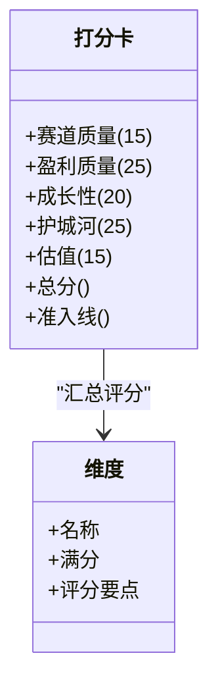
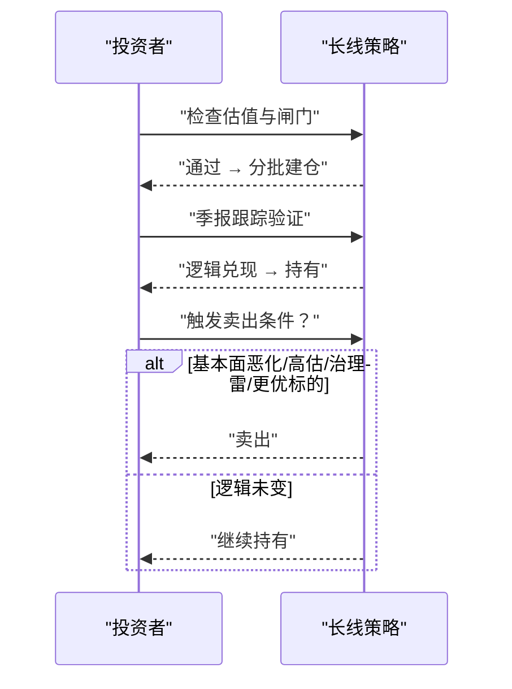
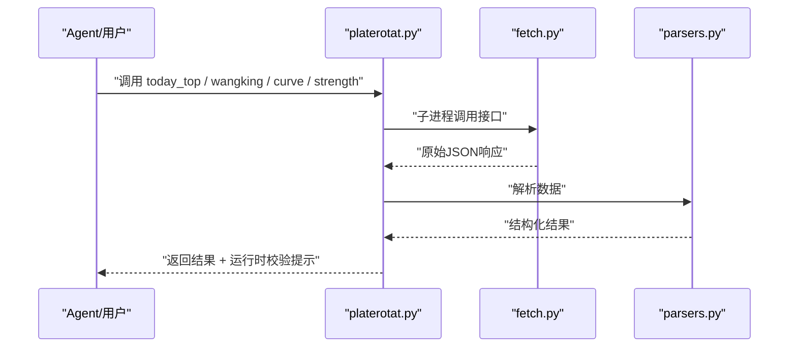
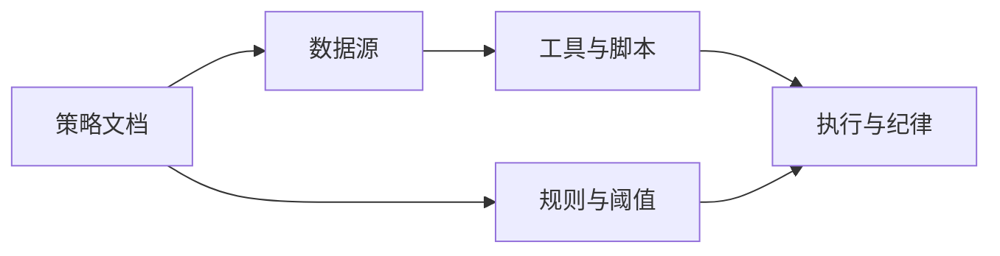

# 交易策略系统

<cite>
**本文引用的文件**   
- [README.MD](file://README.MD)
- [短线炒股策略.md](file://strategy/短线炒股策略.md)
- [长线严格筛选策略.md](file://strategy/长线严格筛选策略.md)
- [长线投资策略.md](file://strategy/长线投资策略.md)
- [cn_stock.md](file://skills/ifind-finance-data-1.3.0/references/cn_stock.md)
- [plate-rotation-skill README.md](file://skills/plate-rotation-skill/README.md)
- [platerotat.py](file://skills/plate-rotation-skill/scripts/platerotat.py)
</cite>

## 目录
1. [引言](#引言)
2. [项目结构](#项目结构)
3. [核心组件](#核心组件)
4. [架构总览](#架构总览)
5. [详细组件分析](#详细组件分析)
6. [依赖关系分析](#依赖关系分析)
7. [性能与回测建议](#性能与回测建议)
8. [故障排查指南](#故障排查指南)
9. [结论](#结论)
10. [附录：个性化策略组合建议](#附录个性化策略组合建议)

## 引言
本文件为“交易策略系统”的完整方法论文档，覆盖短线五步法与长线六道闸门两大体系。内容基于仓库内策略文档与板块轮动工具、iFinD数据接口说明进行系统化整理，旨在帮助读者理解并落地执行：
- 短线五步法：自上而下的环境判断、板块选择、个股挑选、排雷清单、买卖纪律、赔率计算、账户级风控与复盘闭环。
- 长线六道闸门：赛道闸、排雷闸、盈利质量闸、成长性闸、护城河闸、估值闸；配套量化打分卡与机械化的建仓/持有/卖出规则。
同时提供量化打分卡实现思路、权重分配原则、回测方法与持续优化建议，以及针对不同风险偏好的策略组合方案。

## 项目结构
本项目采用“策略（Strategy）+技能（Skills）+数据源参考”的分层组织方式：
- strategy：存放可执行的策略方法论与筛选清单，包含短线与长线两套体系。
- skills：封装分析引导与数据获取能力，如 iFinD 股票服务参考与板块轮动 Skill。
- README.MD：项目总览、模块职责与使用方式。

图表来源
- [README.MD:1-69](file://README.MD#L1-L69)
- [短线炒股策略.md:1-152](file://strategy/短线炒股策略.md#L1-L152)
- [长线严格筛选策略.md:1-246](file://strategy/长线严格筛选策略.md#L1-L246)
- [长线投资策略.md:1-139](file://strategy/长线投资策略.md#L1-L139)
- [cn_stock.md:1-67](file://skills/ifind-finance-data-1.3.0/references/cn_stock.md#L1-L67)
- [plate-rotation-skill README.md:1-188](file://skills/plate-rotation-skill/README.md#L1-L188)
- [platerotat.py:1-315](file://skills/plate-rotation-skill/scripts/platerotat.py#L1-L315)

章节来源
- [README.MD:1-69](file://README.MD#L1-L69)

## 核心组件
- 短线五步法（自上而下）
  - 看环境：大盘与情绪周期判断，决定当日是否参与。
  - 选板块：资金主线识别，双源共振（强度分与涨幅）。
  - 挑个股：形态触发 + 资金确认 + 位置安全三共振。
  - 排雷清单：治理与财务硬约束，一票否决。
  - 买卖纪律：仓位、止损止盈、盈亏比、账户级熔断与复盘闭环。
- 长线六道闸门（漏斗式淘汰）
  - 赛道闸：行业空间、增速、格局、非夕阳/非周期顶。
  - 排雷闸：治理与财务红线，命中即出局。
  - 盈利质量闸：ROE、毛利率、现金流含金量等。
  - 成长性闸：营收利润双高增且同步，剔除假成长。
  - 护城河闸：壁垒类型与方向（变宽或变窄）。
  - 估值闸：PEG/历史分位，避免价值陷阱。
  - 量化打分卡：维度评分与准入线，分批建仓与按基本面卖出。

章节来源
- [短线炒股策略.md:18-118](file://strategy/短线炒股策略.md#L18-L118)
- [长线严格筛选策略.md:11-163](file://strategy/长线严格筛选策略.md#L11-L163)
- [长线投资策略.md:19-101](file://strategy/长线投资策略.md#L19-L101)

## 架构总览
系统以“策略方法论 + 数据工具 + 执行纪律”为核心，形成从宏观到微观的决策链路：
- 数据层：iFinD 股票服务（行情、财务、事件、ESG）、板块轮动数据（同花顺涨幅 + 开盘啦强度分）。
- 分析层：短线环境与板块轮动分析、长线基本面与估值评估。
- 决策层：短线五步法与长线六道闸门，配合量化打分卡与机械规则。
- 执行层：仓位管理、止损止盈、账户级熔断、跟踪与退出机制。

图表来源
- [cn_stock.md:1-67](file://skills/ifind-finance-data-1.3.0/references/cn_stock.md#L1-L67)
- [plate-rotation-skill README.md:81-153](file://skills/plate-rotation-skill/README.md#L81-L153)
- [短线炒股策略.md:18-118](file://strategy/短线炒股策略.md#L18-L118)
- [长线严格筛选策略.md:44-163](file://strategy/长线严格筛选策略.md#L44-L163)

## 详细组件分析

### 短线五步法（自上而下·五步法）
- 看环境：通过板块强度与涨幅双源共振判断市场处于进攻期还是退潮期，决定是否参与。
- 选板块：只做资金主线的板块，关注元单位资金净流入与持续性，警惕虚火。
- 挑个股：形态触发（放量突破平台/新高、缩量回踩均线企稳、末端放量等），资金确认（主力净流入、龙虎榜席位），位置安全（不追高位加速）。
- 排雷清单：大股东减持、机构持仓骤降、监管处罚、高质押、财务虚胖、商誉减值等一票否决项。
- 买卖纪律：单票不重仓、总仓位随环境调整；跌破买入逻辑无条件止损；放天量滞涨或资金转净流出减仓；盈亏比≥2:1才出手；账户级熔断（单日回撤、连亏、月度回撤）；交易日志与摩擦成本统计。

图表来源
- [短线炒股策略.md:18-118](file://strategy/短线炒股策略.md#L18-L118)

章节来源
- [短线炒股策略.md:18-118](file://strategy/短线炒股策略.md#L18-L118)

### 长线六道闸门（漏斗式筛选）
- 赛道闸：行业空间大、增速可持续、格局向龙头集中、非夕阳/非强周期顶。
- 排雷闸：先跑，命中即出局（减持、违规、高质押、商誉过高、主业不聚焦、现金流背离）。
- 盈利质量闸：ROE长期稳定高、毛利率高位稳定、经营现金流/净利润>0.8、净利率稳定。
- 成长性闸：营收利润双高增且同步，扣非净利同步，剔除低基数/非经常损益假成长。
- 护城河闸：品牌/定价权、技术/专利、规模/成本优势、网络效应/转换成本，至少一条且壁垒在变宽。
- 估值闸：PEG合理、PE/PB历史低位、非价值陷阱。

图表来源
- [长线严格筛选策略.md:11-163](file://strategy/长线严格筛选策略.md#L11-L163)

章节来源
- [长线严格筛选策略.md:44-163](file://strategy/长线严格筛选策略.md#L44-L163)

### 量化打分卡（最终准入）
- 维度与满分：赛道质量（15）、盈利质量（25）、成长性（20）、护城河（25）、估值（15），合计100。
- 评分要点：各维度根据指标表现给出不同分值，例如ROE>15%稳定、现金流/净利>0.8、营收利润双高增同步、壁垒清晰且变宽、PEG<1且低分位等。
- 准入线：总分≥85为核心仓候选；70-84为卫星仓候选；<70放弃或仅观察。
- 注意：排雷闸命中者不参与打分；打分是排序工具，达标≠立即买入，仍受估值闸约束。

图表来源
- [长线严格筛选策略.md:147-163](file://strategy/长线严格筛选策略.md#L147-L163)

章节来源
- [长线严格筛选策略.md:147-163](file://strategy/长线严格筛选策略.md#L147-L163)

### 机械建仓/持有/卖出纪律（长线）
- 建仓：分批买入，不追高、不一次性满仓；在估值合理区分批买入，越跌越买的前提是基本面逻辑未变。
- 仓位：单票上限（核心仓≤20%，卫星仓≤10%），适度分散（5-10只、跨行业），定投平滑择时风险。
- 持有：拿得住的前提是看得懂；基本面逻辑未变则持有，不因短期波动恐慌或贪婪。
- 卖出：基本面恶化、估值严重高估、出现治理雷、发现更优标的（机会成本替换）任一满足即卖；短期下跌若逻辑未变视为加仓机会。

图表来源
- [长线严格筛选策略.md:167-197](file://strategy/长线严格筛选策略.md#L167-L197)
- [长线投资策略.md:75-101](file://strategy/长线投资策略.md#L75-L101)

章节来源
- [长线严格筛选策略.md:167-197](file://strategy/长线严格筛选策略.md#L167-L197)
- [长线投资策略.md:75-101](file://strategy/长线投资策略.md#L75-L101)

### 板块轮动工具（短线辅助）
- 双源交叉验证：同花顺（当日爆发/涨幅%）+ 开盘啦（持续性/强度分），两边都上榜=真主线，只在同花顺=偶发热点，只在开盘啦=老热点退潮中。
- 高级API：today_top（今日Top N）、find_dragon_kings（妖王榜）、top1_curve（Top5排名变化曲线）、plate_strength（单板块强度时序）。
- 运行时校验：对空数据、跨源错传、上游异常输出明确警告，便于下游Agent识别与处理。

图表来源
- [platerotat.py:100-218](file://skills/plate-rotation-skill/scripts/platerotat.py#L100-L218)
- [plate-rotation-skill README.md:81-153](file://skills/plate-rotation-skill/README.md#L81-L153)

章节来源
- [platerotat.py:100-218](file://skills/plate-rotation-skill/scripts/platerotat.py#L100-L218)
- [plate-rotation-skill README.md:81-153](file://skills/plate-rotation-skill/README.md#L81-L153)

### iFinD 股票服务（长线数据支撑）
- 工具能力：智能选股、股票信息摘要、基本资料、日频行情与技术指标、股本结构与股东数据、财务数据与指标、风险定量指标、重大事件类指标、ESG评级、高频行情快照。
- 典型用法：自然语言查询多主体多指标合并、以行业板块作为主体查询、A股1分钟高频行情与实时快照。

章节来源
- [cn_stock.md:1-67](file://skills/ifind-finance-data-1.3.0/references/cn_stock.md#L1-L67)

## 依赖关系分析
- 策略与方法论依赖数据源：
  - 短线依赖板块轮动数据（同花顺涨幅 + 开盘啦强度分）与资金流、龙虎榜等。
  - 长线依赖iFinD财务、事件、ESG与宏观数据（EDB）。
- 工具链依赖：
  - platerotat.py 依赖 fetch.py 与 parsers.py 完成数据抓取与解析。
  - cn_stock.md 定义iFinD MCP工具调用范式，供Agent与脚本使用。

图表来源
- [README.MD:22-69](file://README.MD#L22-L69)
- [platerotat.py:1-315](file://skills/plate-rotation-skill/scripts/platerotat.py#L1-315)
- [cn_stock.md:1-67](file://skills/ifind-finance-data-1.3.0/references/cn_stock.md#L1-L67)

章节来源
- [README.MD:22-69](file://README.MD#L22-L69)

## 性能与回测建议
- 回测方法
  - 历史数据回放：基于iFinD与板块轮动数据，构建信号序列（形态触发、资金确认、排雷命中、估值闸通过等），模拟逐笔交易与仓位变化。
  - 指标统计：胜率、平均盈亏比、期望值、最大回撤、换手成本（印花税+佣金+滑点），对照策略文档中的经验区间与阈值。
  - 参数敏感性：对阈值（如ROE>15%、现金流/净利>0.8、PEG<1、止损-5%~-8%、盈亏比≥2:1）进行网格搜索与稳健性检验。
- 工具推荐
  - 数据获取：iFinD MCP工具（股票、指数、基金、债券、宏观、资讯、全球市场）。
  - 数据处理与分析：Python标准库与第三方库（pandas、numpy、matplotlib/seaborn、backtrader/vnpy等）。
  - 可视化：ECharts（板块轮动曲线）、Jupyter Notebook（交互式回测报告）。
- 持续优化
  - 定期复盘：记录每笔交易的逻辑、板块、形态、盈亏比与结果，归因对错。
  - 动态阈值：结合市场状态（进攻期/退潮期）与环境因子（利率、流动性）调整阈值与仓位。
  - 防过拟合：样本外测试、滚动窗口回测、交叉验证，避免单一市场阶段导致的参数漂移。

[本节为通用指导，不直接分析具体文件]

## 故障排查指南
- 板块轮动工具常见问题
  - 周末/节假日无数据：提示“今天是周末”，需等待交易日。
  - 板块代码跨源错传：前缀与source不匹配导致空数据，需修正为88x（ths）或80x/803x（kaipan）。
  - 上游接口异常：返回非JSON或缺顶层字段，需重试或降级处理。
- 数据口径与误判
  - 强度分/涨幅 ≠ 元单位资金净流入，不可混用。
  - 行业流入额常为毛流入/成交额，应取“净主动买入额”。
  - 净利同比暴增先看营收增速，避免低基数/扭亏陷阱。
- 策略执行问题
  - 环境差仍满仓：遵循账户级熔断与仓位随环境调的原则。
  - 追高加速妖股：盈亏比天然差，易被闷杀。
  - 长线短炒或短线套牢改口价值投资：两套体系混用是亏损主因之一。

章节来源
- [platerotat.py:75-98](file://skills/plate-rotation-skill/scripts/platerotat.py#L75-L98)
- [短线炒股策略.md:134-140](file://strategy/短线炒股策略.md#L134-L140)
- [长线严格筛选策略.md:201-210](file://strategy/长线严格筛选策略.md#L201-L210)

## 结论
- 短线五步法强调“跟主线、等形态、验资金、严排雷、守纪律”，在资金正流入的主线板块里，挑形态刚启动、主力持续净流入、且无治理雷的票，机械止损止盈，环境差就空仓。
- 长线六道闸门坚持“选好赛道、先排干净雷、验真盈利、辨真成长、看清护城河、付好价格”，质量与排雷优先于成长速度，估值不过只观察不买，宁可错过，不买错、不买贵。
- 量化打分卡将多维评估标准化，配合机械化的建仓/持有/卖出纪律，提升策略的可执行性与一致性。
- 借助iFinD与板块轮动工具，可实现数据驱动的自动化分析与回测，持续优化参数与风险控制。

[本节为总结，不直接分析具体文件]

## 附录：个性化策略组合建议
- 保守型（低风险偏好）
  - 侧重长线六道闸门与估值闸，核心仓为主，卫星仓为辅；单票上限≤15%，总仓位控制在中等水平；以定投平滑择时风险。
  - 重点指标：ROE>15%稳定、现金流/净利>0.8、PEG<1且历史分位偏低。
- 平衡型（中等风险偏好）
  - 长短结合：长线核心资产占大头，短线波段小仓位参与；短线严格执行盈亏比≥2:1与账户级熔断。
  - 重点指标：赛道景气度、护城河变宽、板块资金共振。
- 进取型（高风险偏好）
  - 短线为主，精选形态触发与资金确认的标的；严格止损与仓位控制，避免追高加速妖股。
  - 重点指标：形态胜率区间、主力资金净流入、龙虎榜席位活跃度。

[本节为通用建议，不直接分析具体文件]