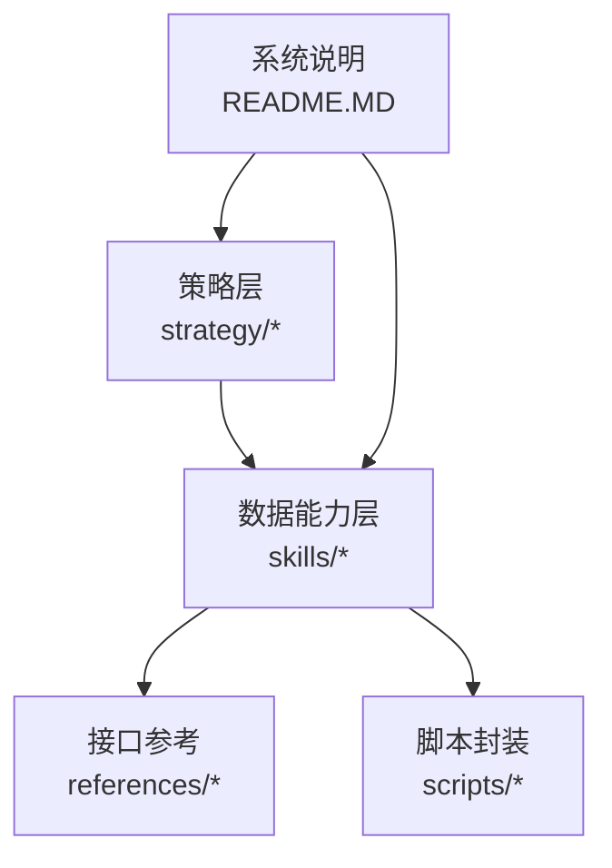
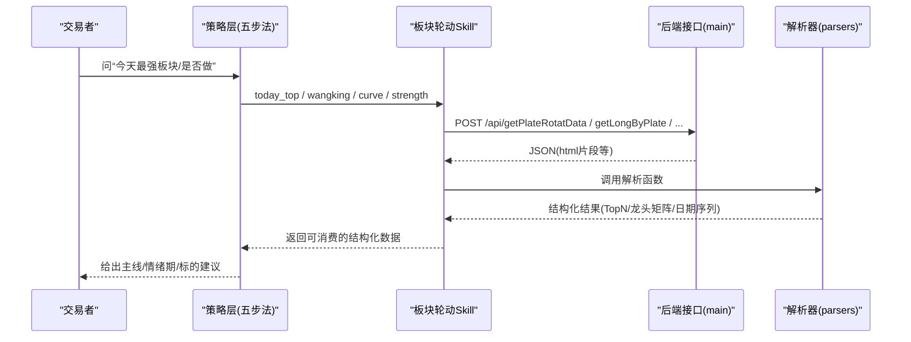
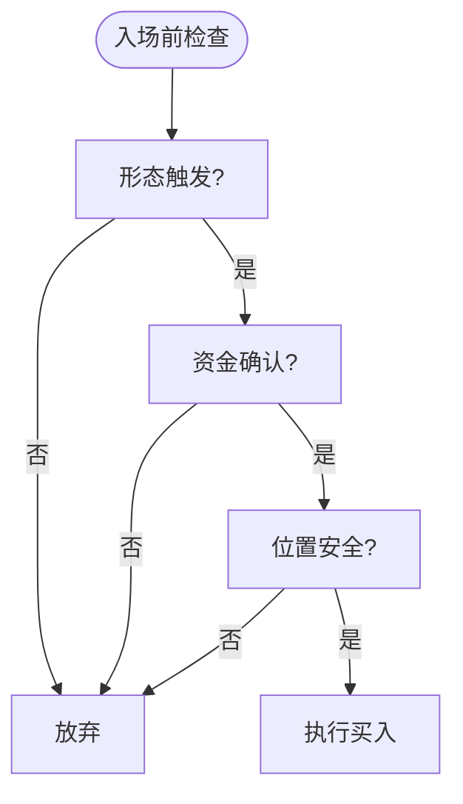
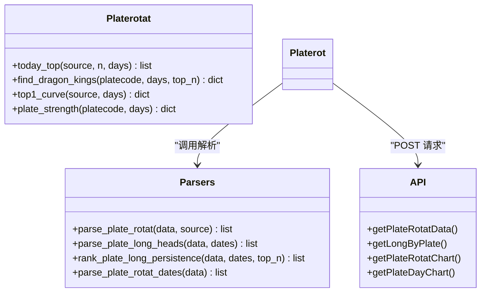
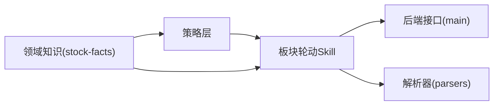

# 短线炒股策略

<cite>
**本文引用的文件列表**
- [strategy/短线炒股策略.md](file://strategy/短线炒股策略.md)
- [README.MD](file://README.MD)
- [skills/plate-rotation-skill/README.md](file://skills/plate-rotation-skill/README.md)
- [skills/plate-rotation-skill/references/_INDEX.md](file://skills/plate-rotation-skill/references/_INDEX.md)
- [skills/plate-rotation-skill/references/api_getplaterotatdata.md](file://skills/plate-rotation-skill/references/api_getplaterotatdata.md)
- [skills/plate-rotation-skill/references/api_getlongbyplate.md](file://skills/plate-rotation-skill/references/api_getlongbyplate.md)
- [skills/plate-rotation-skill/scripts/platerotat.py](file://skills/plate-rotation-skill/scripts/platerotat.py)
- [skills/plate-rotation-skill/scripts/parsers.py](file://skills/plate-rotation-skill/scripts/parsers.py)
- [skills/plate-rotation-skill/references/stock-facts.md](file://skills/plate-rotation-skill/references/stock-facts.md)
</cite>

## 目录
1. [引言](#引言)
2. [项目结构](#项目结构)
3. [核心组件](#核心组件)
4. [架构总览](#架构总览)
5. [详细组件分析](#详细组件分析)
6. [依赖关系分析](#依赖关系分析)
7. [性能与执行特性](#性能与执行特性)
8. [实战排雷与纪律](#实战排雷与纪律)
9. [复盘闭环与摩擦成本](#复盘闭环与摩擦成本)
10. [常见陷阱与数据口径](#常见陷阱与数据口径)
11. [结论](#结论)

## 引言
本文件围绕“自上而下五步法”的短线交易体系，系统化阐述环境判断、板块选择、个股筛选、排雷清单与买卖纪律的执行方法。结合仓库中的板块轮动工具与接口文档，给出可落地的双源验证机制（开盘啦强度分 + 同花顺涨幅）以及配套的数据取数路径与解析流程，帮助读者在真实盘中快速识别主线、定位形态触发点并严格执行风控。

## 项目结构
本项目采用“认知—数据—决策”三层分离：
- manual：投资手册与方法论沉淀
- skills：数据能力（iFinD、板块轮动）
- strategy：交易策略（方法论与量化执行版成对出现）

图表来源
- [README.MD:1-79](file://README.MD#L1-L79)
- [strategy/短线炒股策略.md:1-152](file://strategy/短线炒股策略.md#L1-L152)

章节来源
- [README.MD:1-79](file://README.MD#L1-L79)

## 核心组件
- 短线方法论：自上而下五步法（看环境、选板块、挑个股、排雷、买卖纪律），强调“纪律 > 技巧”，以概率与赔率为核心。
- 板块轮动 Skill：提供四件套能力（今日 Top 板块、妖王榜、Top5 排名曲线、单板块强度时序），并以双源交叉验证反幻觉。
- 接口与解析：通过统一 host 的 POST 接口获取 HTML-in-JSON 响应，再由 parsers 抽取结构化结果，上层 platerotat 暴露高级 API 与 CLI。

章节来源
- [strategy/短线炒股策略.md:1-152](file://strategy/短线炒股策略.md#L1-L152)
- [skills/plate-rotation-skill/README.md:1-188](file://skills/plate-rotation-skill/README.md#L1-L188)
- [skills/plate-rotation-skill/references/_INDEX.md:1-43](file://skills/plate-rotation-skill/references/_INDEX.md#L1-L43)

## 架构总览
从“策略—数据—接口—解析—输出”的端到端链路如下：

图表来源
- [skills/plate-rotation-skill/scripts/platerotat.py:100-218](file://skills/plate-rotation-skill/scripts/platerotat.py#L100-L218)
- [skills/plate-rotation-skill/scripts/parsers.py:20-175](file://skills/plate-rotation-skill/scripts/parsers.py#L20-L175)
- [skills/plate-rotation-skill/references/_INDEX.md:1-43](file://skills/plate-rotation-skill/references/_INDEX.md#L1-L43)

## 详细组件分析

### 一、看环境（决定今天能不能做）
- 大盘缩量阴跌或恐慌时，空仓也是操作；胜率整体下降。
- 用板块轮动工具观察“双源主线”：
  - 开盘啦强度分：反映资金持续性
  - 同花顺涨幅：反映当日爆发集中度
  - 两源共振的板块才是真主线
- 区分进攻期与退潮期：前者题材发酵、连板高度好、炸板率低；后者分歧大、炸板率高，应降仓或离场。

章节来源
- [strategy/短线炒股策略.md:18-26](file://strategy/短线炒股策略.md#L18-L26)
- [skills/plate-rotation-skill/README.md:81-97](file://skills/plate-rotation-skill/README.md#L81-L97)

### 二、选板块（只在资金主线里找票）
- 只做资金正在流入的主线板块，不碰退潮/无资金的板块。
- 跟资金流而非单纯涨幅：警惕“强度分上位但元单位资金净流出”的情绪虚火。
- 关注资金切换信号：主线退潮（强度排名持续下滑）+ 新方向资金流入抬头，是轮动窗口。

章节来源
- [strategy/短线炒股策略.md:29-34](file://strategy/短线炒股策略.md#L29-L34)

### 三、挑个股（形态 + 资金 + 位置 三共振）
- 形态触发（短期胜率相对高的形态）：
  - 放量突破平台/新高
  - 强势股缩量回踩均线（龙回头）
  - 缩量整理末端突然放量
  - 板块龙头首板/二板（情绪强期）
- 资金确认：主力资金（特大单）持续净流入；融资余额、龙虎榜席位有真金。
- 位置安全：不追已连板加速的高位妖股；优先“板块强 + 个股还没大涨 + 资金刚进”的潜伏位。

图表来源
- [strategy/短线炒股策略.md:37-60](file://strategy/短线炒股策略.md#L37-L60)

章节来源
- [strategy/短线炒股策略.md:37-60](file://strategy/短线炒股策略.md#L37-L60)

### 四、排雷清单（买入前必查，一票否决）
- 大股东/创始人密集减持
- 机构持仓骤降、股东户数激增
- 证监会/交易所处罚、信披违规、概念造假
- 控股股东高质押（>40% 警惕）
- 财务虚胖：净利暴增但靠低基数/营收下滑/应收存货高企/经营现金流远低于净利润
- 商誉减值、重大诉讼等黑天鹅

章节来源
- [strategy/短线炒股策略.md:63-73](file://strategy/短线炒股策略.md#L63-L73)

### 五、买卖纪律（活下来比赚得多重要）
- 仓位：单票不重仓；总仓位随环境调（退潮期半仓以下）。
- 买点：形态触发当下买，不预判、不抄底下跌途中的票。
- 止损：跌破买入逻辑（破支撑/放量下杀/资金转净流出）无条件走；机械止损线（如 -5%~-8%）。
- 止盈：强势持有看量价；放天量滞涨/跌破关键均线/资金转净流出就减仓。
- 不补仓亏损票，不与趋势对抗。

章节来源
- [strategy/短线炒股策略.md:76-83](file://strategy/短线炒股策略.md#L76-L83)

### 六、赔率与盈亏比（入场前必算，赔率 < 2:1 不做）
- 计算上行空间（入场价到最近压力位）与下行空间（入场价到止损位），盈亏比 = 上行 ÷ 下行。
- 铁律：盈亏比 < 2:1 直接放弃；期望值思维驱动只在正期望时出手。

章节来源
- [strategy/短线炒股策略.md:86-96](file://strategy/短线炒股策略.md#L86-L96)

### 七、账户级风控（单票纪律之上的熔断）
- 单日止损线：账户当日回撤达阈值停手。
- 连亏熔断：连续亏损若干笔后进入冷静期。
- 月度回撤线：当月回撤达阈值暂停短线，强制复盘。
- 仓位量化：单票上限与总仓位随环境动态调整。

章节来源
- [strategy/短线炒股策略.md:100-110](file://strategy/短线炒股策略.md#L100-L110)

### 八、复盘闭环与摩擦成本（短线唯一的复利来源）
- 建立交易日志：记录买入逻辑、板块、形态、盈亏比、结果与归因。
- 定期统计真实指标：胜率、盈亏比、最大回撤。
- 摩擦成本量化：卖出印花税、双边佣金、滑点，单次往返约 0.1%–0.3%，高频交易将显著侵蚀收益。

章节来源
- [strategy/短线炒股策略.md:113-119](file://strategy/短线炒股策略.md#L113-L119)

### 九、必须避开的 7 个坑（实战血泪复盘）
- 追已连板加速的妖股
- 买“基本面好但资金不认”的落后票
- 把低基数净利暴增当高成长
- 信单一数据源/单一指标
- 把“强度/涨幅”当“资金净流入”
- 忽视减持/质押/处罚等治理雷
- 环境不好还满仓硬刚

章节来源
- [strategy/短线炒股策略.md:122-131](file://strategy/短线炒股策略.md#L122-L131)

### 十、数据口径备忘（避免被工具误导）
- 板块“强度分/涨幅”≠ 元单位资金净流入，两者口径不同不可混用。
- 行业级“流入额(合计)”常为毛流入/成交额，不是净额；要认准“净主动买入额”。
- “区间净流入”要用明确日期区间取数；“最近N日”在部分接口会解析不准。
- 净利润同比“暴增”先看营收增速是否同步——只有净利暴增多为低基数/扭亏陷阱。

章节来源
- [strategy/短线炒股策略.md:134-140](file://strategy/短线炒股策略.md#L134-L140)

### 十一、板块轮动工具与双源验证机制
- 四件套能力：
  - 今日 Top N 板块（ths/kaipan 可切）
  - 板块妖王榜（跨天龙头频次）
  - Top5 板块 N 日排名变化曲线
  - 单板块 N 日强度+量能时序
- 双源差异与语义：
  - ths：当日板块涨幅 %（带 %）
  - kaipan：板块强度分（纯整数）
  - 两套数值各自排序，不可跨源比较
- 板块代码前缀强语义：
  - 88x → 同花顺
  - 80x/803x → 开盘啦
  - 跨源传错会被运行时校验提示 PR-EMPTY

图表来源
- [skills/plate-rotation-skill/scripts/platerotat.py:100-218](file://skills/plate-rotation-skill/scripts/platerotat.py#L100-L218)
- [skills/plate-rotation-skill/scripts/parsers.py:20-175](file://skills/plate-rotation-skill/scripts/parsers.py#L20-L175)
- [skills/plate-rotation-skill/references/_INDEX.md:1-43](file://skills/plate-rotation-skill/references/_INDEX.md#L1-L43)

章节来源
- [skills/plate-rotation-skill/README.md:70-97](file://skills/plate-rotation-skill/README.md#L70-L97)
- [skills/plate-rotation-skill/references/_INDEX.md:16-32](file://skills/plate-rotation-skill/references/_INDEX.md#L16-L32)
- [skills/plate-rotation-skill/references/api_getplaterotatdata.md:44-54](file://skills/plate-rotation-skill/references/api_getplaterotatdata.md#L44-L54)
- [skills/plate-rotation-skill/references/api_getlongbyplate.md:44-54](file://skills/plate-rotation-skill/references/api_getlongbyplate.md#L44-L54)

### 十二、接口与解析要点
- 统一 host=main，全部 POST，后端只校验 Referer（自动注入）。
- 主表接口返回 HTML-in-JSON，需使用 parsers 进行正则抽取，不要自行逆向。
- 当日无领涨是合法返回值，不应视为 bug。
- Top5 排名曲线中 value=10.5 + symbol=wu.png 表示未上榜，不参与平均。

章节来源
- [skills/plate-rotation-skill/references/_INDEX.md:1-11](file://skills/plate-rotation-skill/references/_INDEX.md#L1-L11)
- [skills/plate-rotation-skill/references/stock-facts.md:34-56](file://skills/plate-rotation-skill/references/stock-facts.md#L34-L56)
- [skills/plate-rotation-skill/references/stock-facts.md:45-50](file://skills/plate-rotation-skill/references/stock-facts.md#L45-L50)

## 依赖关系分析
- 策略层依赖板块轮动 Skill 提供的结构化数据，用于环境判断与主线识别。
- Skill 依赖底层接口与解析器，确保数据口径一致与错误提示清晰（PR-EMPTY/PR-WARN）。
- 领域知识（stock-facts）贯穿所有环节，防止误用与误读。

图表来源
- [skills/plate-rotation-skill/references/stock-facts.md:1-118](file://skills/plate-rotation-skill/references/stock-facts.md#L1-L118)
- [skills/plate-rotation-skill/scripts/platerotat.py:100-218](file://skills/plate-rotation-skill/scripts/platerotat.py#L100-L218)

章节来源
- [skills/plate-rotation-skill/references/stock-facts.md:1-118](file://skills/plate-rotation-skill/references/stock-facts.md#L1-L118)

## 性能与执行特性
- 接口刷新粒度：日级/多日级聚合，盘中刷新约 5 分钟。
- 缓存策略：默认 TTL 1 小时，需要分钟级实时可用参数控制。
- 周末/节假日：接口返回上一交易日快照，不会抛错；运行时会有提示。
- 错误提示：空数据或缺关键字段时，stderr 输出 PR-EMPTY/PR-WARN，便于下游 Agent 识别。

章节来源
- [skills/plate-rotation-skill/references/stock-facts.md:87-93](file://skills/plate-rotation-skill/references/stock-facts.md#L87-L93)
- [skills/plate-rotation-skill/references/stock-facts.md:61-66](file://skills/plate-rotation-skill/references/stock-facts.md#L61-L66)
- [skills/plate-rotation-skill/scripts/platerotat.py:75-98](file://skills/plate-rotation-skill/scripts/platerotat.py#L75-L98)

## 实战排雷与纪律
- 排雷清单：七大风险因素（减持、机构撤离、监管处罚、高质押、财务虚胖、商誉/诉讼等），命中即放弃。
- 买卖纪律：仓位管理、止损止盈规则、不补仓亏损票、不与趋势对抗。
- 账户级熔断：单日止损、连亏熔断、月度回撤线，配合仓位量化与情绪纪律。

章节来源
- [strategy/短线炒股策略.md:63-110](file://strategy/短线炒股策略.md#L63-L110)

## 复盘闭环与摩擦成本
- 交易日志：每笔记录逻辑、板块、形态、盈亏比、结果与归因。
- 指标统计：胜率、盈亏比、最大回撤，拒绝凭感觉。
- 摩擦成本：单次往返约 0.1%–0.3%，高频交易将显著侵蚀收益，“少做、做精”优于“多做”。

章节来源
- [strategy/短线炒股策略.md:113-119](file://strategy/短线炒股策略.md#L113-L119)

## 常见陷阱与数据口径
- 七个实战陷阱：追高位妖股、买资金不认的落后票、低基数净利暴增误判、单一数据源、混淆强度/涨幅与资金净流入、忽视治理雷、环境差仍满仓。
- 数据口径注意事项：强度分/涨幅 ≠ 资金净流入；“流入额(合计)”非净额；区间净流入需明确日期；净利暴增先看营收增速。

章节来源
- [strategy/短线炒股策略.md:122-140](file://strategy/短线炒股策略.md#L122-L140)

## 结论
短线交易的本质是“概率 + 赔率 + 纪律”。在资金正流入的主线板块里，等待形态刚启动、主力持续净流入且无治理雷的标的，机械止损止盈，环境差则空仓。借助板块轮动工具的双源验证与清晰的接口/解析链路，可将主观盘感转化为可重复执行的流程，并通过复盘与摩擦成本控制实现长期正期望。