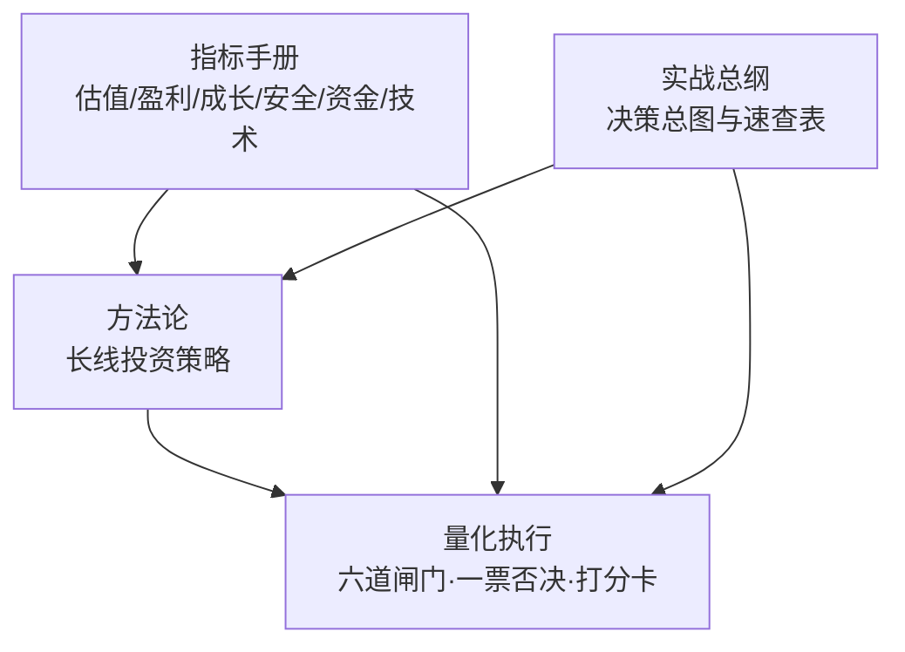
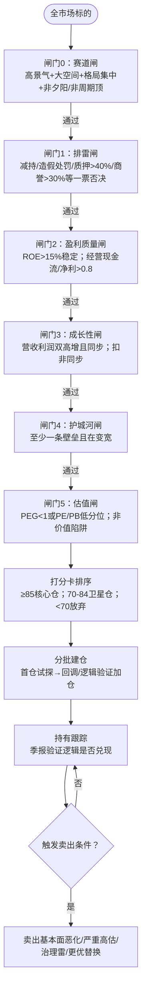
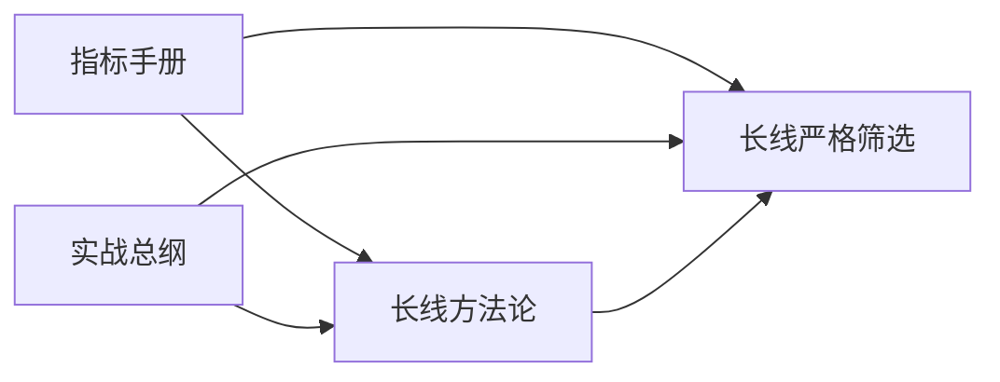

# 长线投资策略

<cite>
**本文引用的文件**   
- [README.MD](file://README.MD)
- [长线投资策略.md](file://strategy/长线投资策略.md)
- [长线严格筛选策略.md](file://strategy/长线严格筛选策略.md)
- [股票常用指标手册.md](file://manual/股票常用指标手册.md)
- [股票投资实战手册.md](file://manual/股票投资实战手册.md)
</cite>

## 目录
1. [引言](#引言)
2. [项目结构](#项目结构)
3. [核心组件](#核心组件)
4. [架构总览](#架构总览)
5. [详细组件分析](#详细组件分析)
6. [依赖关系分析](#依赖关系分析)
7. [性能与执行效率](#性能与执行效率)
8. [故障排查与风控](#故障排查与风控)
9. [结论](#结论)
10. [附录](#附录)

## 引言
本文件围绕“长线投资策略”的系统化落地，构建“六道闸门”的量化筛选框架，覆盖财务质量、行业地位、竞争格局、成长性、估值与风险控制六大维度。文档同时给出可执行的阈值、打分卡模型、建仓与退出纪律，以及不同风险偏好下的配置建议与心理建设要点，帮助投资者在能力圈内以数据驱动的方式实现长期复利。

## 项目结构
本项目采用“方法论 + 量化执行版”成对组织：
- 方法论层：阐述理念、流程与原则（如《长线投资策略》）
- 量化执行层：提供逐条打勾、一票否决、带阈值的漏斗式筛选（如《长线严格筛选策略》）
- 知识底座：指标手册与实战总纲，统一口径与用法

图表来源
- [README.MD:1-81](file://README.MD#L1-L81)
- [长线投资策略.md:1-139](file://strategy/长线投资策略.md#L1-L139)
- [长线严格筛选策略.md:1-246](file://strategy/长线严格筛选策略.md#L1-L246)
- [股票常用指标手册.md:1-137](file://manual/股票常用指标手册.md#L1-L137)
- [股票投资实战手册.md:1-103](file://manual/股票投资实战手册.md#L1-L103)

章节来源
- [README.MD:1-81](file://README.MD#L1-L81)

## 核心组件
- 赛道闸（行业天花板与景气度）
- 排雷闸（治理与财务硬伤一票否决）
- 盈利质量闸（ROE、毛利率、现金流含金量）
- 成长性闸（营收利润双高增且同步，剔除假成长）
- 护城河闸（壁垒类型与方向性验证）
- 估值闸（PEG/历史分位/价值陷阱排查）
- 量化打分卡（五维权重与综合评分）
- 机械交易纪律（分批建仓、持有跟踪、基本面卖出）

章节来源
- [长线严格筛选策略.md:11-41](file://strategy/长线严格筛选策略.md#L11-L41)
- [长线严格筛选策略.md:44-144](file://strategy/长线严格筛选策略.md#L44-L144)
- [长线严格筛选策略.md:147-197](file://strategy/长线严格筛选策略.md#L147-L197)
- [长线投资策略.md:19-101](file://strategy/长线投资策略.md#L19-L101)

## 架构总览
“六道闸门”采用漏斗式淘汰机制，先跑排雷，再验质量，后看成长与护城河，最后用估值过滤并打分排序，最终进入分批建仓与按基本面卖出的闭环。

图表来源
- [长线严格筛选策略.md:11-41](file://strategy/长线严格筛选策略.md#L11-L41)
- [长线严格筛选策略.md:44-144](file://strategy/长线严格筛选策略.md#L44-L144)
- [长线严格筛选策略.md:147-197](file://strategy/长线严格筛选策略.md#L147-L197)

## 详细组件分析

### 闸门0：赛道闸（行业决定天花板）
- 目标：锁定时代主导产业，避开夕阳与强周期高位
- 关键检查项
  - 行业空间大、渗透率有提升空间
  - 近3年复合增速正向且不靠单一年份
  - 集中度CR5提升或龙头份额扩张
  - 非长期产能过剩/被替代/强周期高位
- 判定规则：全部满足通过；强周期仅在底部考虑

章节来源
- [长线严格筛选策略.md:44-58](file://strategy/长线严格筛选策略.md#L44-L58)

### 闸门1：排雷闸（先跑·一票否决）
- 目标：避免永久性本金损失，优先排除治理与财务硬伤
- 否决项（命中即出局）
  - 实控人/大股东持续减持（尤其业绩好却猛减）
  - 财务造假/信披违规/监管处罚
  - 控股股东高质押（>40%）
  - 商誉过高/频繁并购堆利润（商誉/净资产>30%）
  - 主业不聚焦/关联交易复杂
  - 经营现金流/净利润长期<0.8
- 辅助参考：ESG评级偏低需重点复核治理项

章节来源
- [长线严格筛选策略.md:61-76](file://strategy/长线严格筛选策略.md#L61-L76)

### 闸门2：盈利质量闸（先看是不是真钱）
- 目标：确认企业赚钱的质量与稳定性
- 关键指标与阈值
  - ROE：近3-5年>15%且稳定/提升（硬条件）
  - 毛利率：处于行业前列且无趋势性下滑
  - 经营现金流/净利润：>0.8（硬条件）
  - 净利率：无持续恶化
- 判定规则：Q-1、Q-3为硬条件；任一不过直接淘汰

章节来源
- [长线严格筛选策略.md:79-91](file://strategy/长线严格筛选策略.md#L79-L91)

### 闸门3：成长性闸（剔除假成长）
- 目标：识别真实可持续的增长
- 关键指标与阈值
  - 营收持续增长（近3年持续正向）
  - 利润与营收同步增长（不只靠低基数）
  - 增长可解释（需求扩张/份额提升/新品放量）
  - 扣非净利润同步高增，非经常损益占比低
- 假成长识别：净利暴增但营收停滞/下滑；扣非平平

章节来源
- [长线严格筛选策略.md:94-110](file://strategy/长线严格筛选策略.md#L94-L110)

### 闸门4：护城河闸（壁垒在变宽还是变窄）
- 目标：确保企业具备可持续竞争优势
- 壁垒类型与验证
  - 品牌/定价权：毛利率持续高位
  - 技术/专利：研发投入持续、技术领先
  - 规模/成本优势：龙头地位、成本曲线占优
  - 网络效应/转换成本：用户黏性高、迁移成本高
  - 方向性：龙头份额+研发投入→壁垒在变宽而非变窄
- 判定规则：至少满足1条，且方向性成立

章节来源
- [长线严格筛选策略.md:113-126](file://strategy/长线严格筛选策略.md#L113-L126)

### 闸门5：估值闸（好公司也要好价格）
- 目标：避免买贵与价值陷阱
- 关键指标与阈值
  - PEG：<1为理想区间（前提是增速真实可持续）
  - PE/PB历史低位：处历史<50%分位
  - 非价值陷阱：低估值不是因基本面恶化或被减持压制
- 价值陷阱排查：结合赛道闸与质量/成长信号交叉验证

章节来源
- [长线严格筛选策略.md:129-144](file://strategy/长线严格筛选策略.md#L129-L144)

### 量化打分卡（最终准入）
- 维度与满分
  - 赛道质量：15分
  - 盈利质量：25分
  - 成长性：20分
  - 护城河：25分
  - 估值：15分
  - 合计：100分
- 准入线
  - ≥85：核心仓候选
  - 70-84：卫星仓候选
  - <70：放弃或仅观察
- 说明：排雷命中者不入打分；达标≠立即买入，仍受估值约束

章节来源
- [长线严格筛选策略.md:147-164](file://strategy/长线严格筛选策略.md#L147-L164)

### 机械交易纪律（建仓/持有/卖出）
- 建仓
  - 分批建仓：不追高、不一次性满仓
  - 条件：估值合理区 + 全部闸门通过 + 打分达标
  - 越跌越买的前提：基本面逻辑未变
- 仓位
  - 单票上限：核心仓≤20%，卫星仓≤10%
  - 适度分散：5-10只、跨行业
  - 定投思维：对优质核心资产平滑择时风险
- 持有
  - 拿得住的前提是看得懂
  - 每季验证：营收/扣非净利增速、毛利/ROE、现金流、份额/护城河、治理面
- 卖出（基本面驱动）
  - 基本面恶化（份额丢失/护城河变窄/行业转衰）
  - 估值严重高估（透支多年增长）
  - 出现治理雷（造假/跑路式减持/重大违规）
  - 发现更优标的（机会成本替换）

章节来源
- [长线严格筛选策略.md:167-197](file://strategy/长线严格筛选策略.md#L167-L197)
- [长线投资策略.md:75-101](file://strategy/长线投资策略.md#L75-L101)

### 指标与口径备忘（防误判）
- 净利同比暴增先看营收增速，排除低基数/扭亏陷阱
- 看扣非净利，剔除投资收益/补贴/资产处置
- ROE看多期稳定性，警惕高杠杆推升
- 经营现金流/净利润>0.8为核心校验
- PE/PB分位用历史区间取数，警惕周期顶/价值陷阱
- 质押比例>40%高度警惕
- 长短线不可混用

章节来源
- [长线严格筛选策略.md:201-210](file://strategy/长线严格筛选策略.md#L201-L210)
- [股票常用指标手册.md:11-124](file://manual/股票常用指标手册.md#L11-L124)

## 依赖关系分析
- 方法论与执行版成对：方法论提供理念与流程，执行版提供阈值与步骤
- 指标手册作为共同底座：统一估值、盈利、成长、安全、资金与技术指标的读法与组合
- 实战总纲串联四份文档：提供决策总图与速查表，指导阅读顺序与使用方式

图表来源
- [README.MD:27-56](file://README.MD#L27-L56)
- [股票投资实战手册.md:22-47](file://manual/股票投资实战手册.md#L22-L47)

章节来源
- [README.MD:27-56](file://README.MD#L27-L56)
- [股票投资实战手册.md:22-47](file://manual/股票投资实战手册.md#L22-L47)

## 性能与执行效率
- 漏斗式筛选减少无效样本量，提高后续深度研究效率
- 一票否决前置，降低后期沉没成本
- 打分卡用于排序与分层，便于资源倾斜到核心仓候选
- 建议将阈值与数据来源标准化，形成可重复执行的清单

[本节为通用指导，无需具体文件引用]

## 故障排查与风控
- 常见误区
  - “好公司任何价格都能买”——贵就是最大风险
  - “跌了就是机会”——先确认基本面逻辑是否还在
  - 把“低估值”当安全垫——警惕价值陷阱
  - 只看PE不看成长与质量——低PE可能是周期顶/衰退前兆
  - 用净利同比“高增”选股——先看营收增速，剔除低基数/扭亏假成长
  - 频繁交易——侵蚀复利
- 风控措施
  - 排雷优先于选股
  - 分批建仓与适度分散
  - 按基本面卖出，不因短期波动恐慌或贪婪
  - 季度跟踪清单，逻辑证伪才行动

章节来源
- [长线投资策略.md:119-127](file://strategy/长线投资策略.md#L119-L127)
- [长线严格筛选策略.md:61-76](file://strategy/长线严格筛选策略.md#L61-L76)

## 结论
长线投资的本质是“选好赛道、买好公司、付好价格、排干净雷、拿得住、按基本面卖”。通过“六道闸门”的漏斗式筛选与量化打分卡，辅以严格的建仓与卖出纪律，可在能力圈内以数据驱动的方式实现长期复利。

[本节为总结，无需具体文件引用]

## 附录

### 长线 vs 短线（红线提醒）
- 收益来源：长线=企业成长+估值修复；短线=市场情绪+资金博弈
- 核心依据：长线=盈利质量/护城河/估值；短线=板块资金/形态/量价
- 持有周期：数月~数年 vs 数日~数周
- 致命错误：用短线心态拿长线；用长线心态扛短线

章节来源
- [长线投资策略.md:105-116](file://strategy/长线投资策略.md#L105-L116)
- [长线严格筛选策略.md:230-240](file://strategy/长线严格筛选策略.md#L230-L240)

### 一页速查（口袋版）
- 赛道闸：高景气+大空间+格局集中+非夕阳/非周期顶
- 排雷闸：减持/造假处罚/质押>40%/商誉>30%/不聚焦/现金流背离 → 命中即出局
- 质量闸：ROE>15%稳定 + 经营现金流/净利>0.8（硬条件）
- 成长闸：营收利润双高增且同步 + 扣非同步（剔除假成长）
- 护城河：≥1条壁垒且在变宽，讲不清就不买
- 估值闸：PEG<1 或 PE/PB<50%分位 且非价值陷阱
- 打分卡：≥85核心仓，70-84卫星仓，<70放弃
- 纪律：分批建仓、5-10只分散、按基本面卖出、不追涨杀跌

章节来源
- [长线严格筛选策略.md:213-224](file://strategy/长线严格筛选策略.md#L213-L224)

### 指标速览（来自指标手册）
- 估值：PE、PB、PS、PEG、股息率（看历史分位与行业对比）
- 盈利：ROE、ROA、毛利率、净利率、ROIC（杜邦拆解）
- 成长：营收同比、净利同比、扣非净利、增速逐季加速
- 安全：资产负债率、经营现金流/净利、应收+存货占比、商誉/净资产、流动/速动比率
- 资金：主力资金净流入、股东户数、机构持仓、龙虎榜/北向、质押比例
- 技术：均线、MACD、KDJ/RSI、成交量、换手率、布林带（仅作辅助择时）

章节来源
- [股票常用指标手册.md:9-88](file://manual/股票常用指标手册.md#L9-L88)