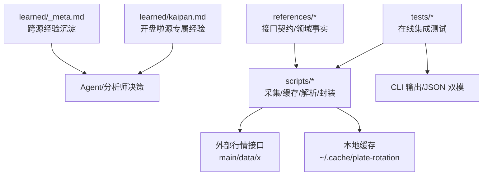
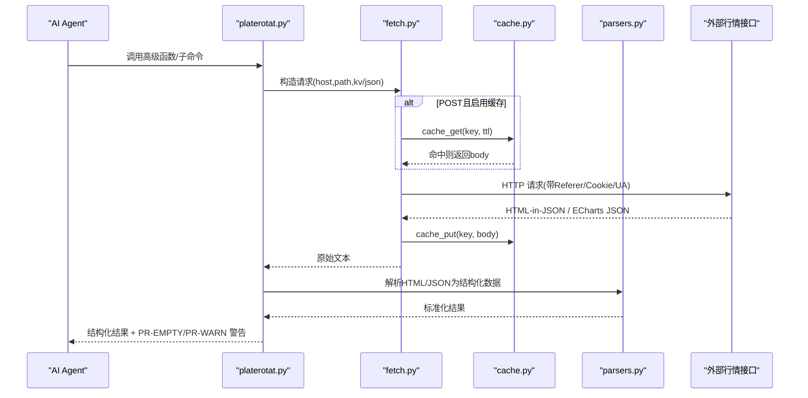
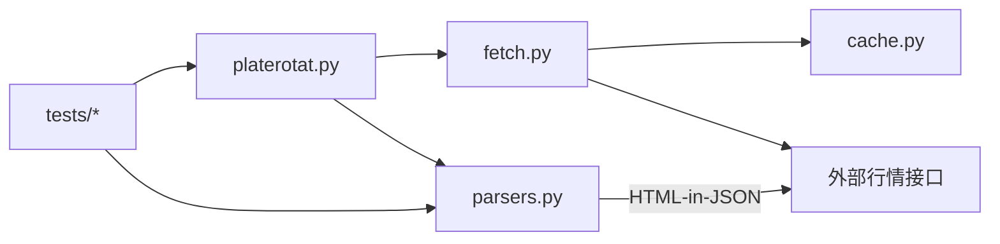
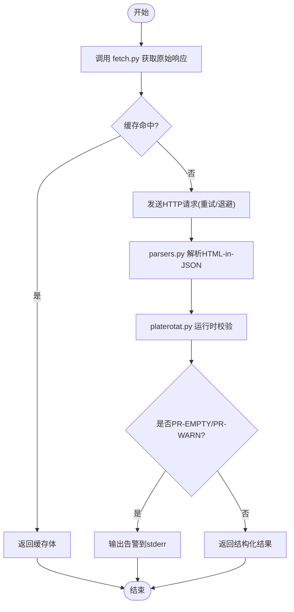

# 学习系统

<cite>
**本文引用的文件**
- [README.md](file://skills/plate-rotation-skill/README.md)
- [_INDEX.md](file://skills/plate-rotation-skill/references/_INDEX.md)
- [api_getplaterotatdata.md](file://skills/plate-rotation-skill/references/api_getplaterotatdata.md)
- [stock-facts.md](file://skills/plate-rotation-skill/references/stock-facts.md)
- [_meta.md](file://skills/plate-rotation-skill/learned/_meta.md)
- [kaipan.md](file://skills/plate-rotation-skill/learned/kaipan.md)
- [fetch.py](file://skills/plate-rotation-skill/scripts/fetch.py)
- [cache.py](file://skills/plate-rotation-skill/scripts/cache.py)
- [parsers.py](file://skills/plate-rotation-skill/scripts/parsers.py)
- [platerotat.py](file://skills/plate-rotation-skill/scripts/platerotat.py)
- [test_plate_rotation.py](file://skills/plate-rotation-skill/tests/test_plate_rotation.py)
</cite>

## 目录
1. [简介](#简介)
2. [项目结构](#项目结构)
3. [核心组件](#核心组件)
4. [架构总览](#架构总览)
5. [详细组件分析](#详细组件分析)
6. [依赖关系分析](#依赖关系分析)
7. [性能与可靠性](#性能与可靠性)
8. [故障排查指南](#故障排查指南)
9. [结论](#结论)
10. [附录：学习与扩展实践](#附录学习与扩展实践)

## 简介
本指南面向开发者，系统化说明“学习系统”在板块轮动 Skill 中的落地方式，重点覆盖 learned 目录的结构设计与元数据管理机制、学习内容格式与解析规则、学习数据的生成与维护流程、与 AI Agent 的交互机制，以及如何自定义学习模块（新算法集成与效果评估）。

该学习系统以“经验沉淀 + 结构化文档 + 自动化测试 + 可观测日志”为核心，将历史踩坑、接口差异、领域常识沉淀为可检索、可演进的知识资产，并通过运行时校验与在线集成测试保障质量。

## 项目结构
本仓库的学习系统位于 skills/plate-rotation-skill 下，围绕 learned 目录组织跨源通用经验与源专属经验；references 提供接口契约与领域事实；scripts 实现数据采集、缓存、解析与高级封装；tests 提供在线集成测试。

图示来源
- [_meta.md:1-47](file://skills/plate-rotation-skill/learned/_meta.md#L1-L47)
- [kaipan.md:1-46](file://skills/plate-rotation-skill/learned/kaipan.md#L1-L46)
- [_INDEX.md:1-43](file://skills/plate-rotation-skill/references/_INDEX.md#L1-L43)
- [fetch.py:1-230](file://skills/plate-rotation-skill/scripts/fetch.py#L1-L230)
- [cache.py:1-145](file://skills/plate-rotation-skill/scripts/cache.py#L1-L145)
- [parsers.py:1-212](file://skills/plate-rotation-skill/scripts/parsers.py#L1-L212)
- [platerotat.py:1-315](file://skills/plate-rotation-skill/scripts/platerotat.py#L1-L315)
- [test_plate_rotation.py:1-444](file://skills/plate-rotation-skill/tests/test_plate_rotation.py#L1-L444)

章节来源
- [README.md:1-188](file://skills/plate-rotation-skill/README.md#L1-L188)
- [_INDEX.md:1-43](file://skills/plate-rotation-skill/references/_INDEX.md#L1-L43)

## 核心组件
- 经验沉淀层（learned）
  - _meta.md：跨源通用经验的沉淀规范与变更记录，要求每次任务后追加条目，包含现象/根因/应对/教训。
  - kaipan.md：针对特定数据源的专属经验，如字段陷阱、解读哲学、路由速记等。
- 参考契约层（references）
  - _INDEX.md：接口路由表、双源差异、板块前缀语义、days/dates 参数约定。
  - api_getplaterotatdata.md：具体接口的输入输出、HTML in JSON 模板与解析提示。
  - stock-facts.md：A 股领域惰性知识手册，涵盖接口陷阱、交易日历、涨跌停板、T+1、复权等。
- 数据处理层（scripts）
  - fetch.py：统一网络调用器，支持 host alias、KV/JSON 参数、重试退避、Cookie/Referer 注入、POST 落盘缓存。
  - cache.py：本地缓存原子层，提供 get/put/clear/stats，支持 TTL 与环境开关。
  - parsers.py：HTML in JSON 的解析 helpers，含主表矩阵、日期抽取、龙头矩阵与持续性统计。
  - platerotat.py：高级 API 与 CLI，组合底层接口，暴露 today_top/find_dragon_kings/top1_curve/plate_strength 四个意图函数，并内置运行时校验与 PR-EMPTY/PR-WARN 告警。
- 质量保障层（tests）
  - test_plate_rotation.py：在线集成测试，覆盖接口健康度、解析正确性、高级 helper 签名与返回结构、自动路由、CLI 双模输出。

章节来源
- [_meta.md:1-47](file://skills/plate-rotation-skill/learned/_meta.md#L1-L47)
- [kaipan.md:1-46](file://skills/plate-rotation-skill/learned/kaipan.md#L1-L46)
- [_INDEX.md:1-43](file://skills/plate-rotation-skill/references/_INDEX.md#L1-L43)
- [api_getplaterotatdata.md:1-74](file://skills/plate-rotation-skill/references/api_getplaterotatdata.md#L1-L74)
- [stock-facts.md:1-118](file://skills/plate-rotation-skill/references/stock-facts.md#L1-L118)
- [fetch.py:1-230](file://skills/plate-rotation-skill/scripts/fetch.py#L1-L230)
- [cache.py:1-145](file://skills/plate-rotation-skill/scripts/cache.py#L1-L145)
- [parsers.py:1-212](file://skills/plate-rotation-skill/scripts/parsers.py#L1-L212)
- [platerotat.py:1-315](file://skills/plate-rotation-skill/scripts/platerotat.py#L1-L315)
- [test_plate_rotation.py:1-444](file://skills/plate-rotation-skill/tests/test_plate_rotation.py#L1-L444)

## 架构总览
学习系统与外部数据源、AI Agent 的交互如下：

图示来源
- [platerotat.py:1-315](file://skills/plate-rotation-skill/scripts/platerotat.py#L1-L315)
- [fetch.py:1-230](file://skills/plate-rotation-skill/scripts/fetch.py#L1-L230)
- [cache.py:1-145](file://skills/plate-rotation-skill/scripts/cache.py#L1-L145)
- [parsers.py:1-212](file://skills/plate-rotation-skill/scripts/parsers.py#L1-L212)

## 详细组件分析

### learned 目录结构与元数据管理
- 文件职责
  - _meta.md：跨源通用经验沉淀，记录每次任务后的新发现，采用“YYYY-MM-DD 标题 + 现象/根因/应对/教训”的固定格式；当接口改版导致沉淀失效时，删除旧条目并更新 references 对应事实。
  - kaipan.md：开盘啦源专属经验，包括字段陷阱（强度分单位、仅认 80x/803x）、解读哲学（强度分 vs 涨幅%）、路由速记（from 与板块前缀匹配）。
- 内容组织规范
  - 每个条目需标注日期与一句话标题，明确现象、根因、应对与教训。
  - 变更时需同步更新头部协议标记，确保与 CLAUDE.md 保持一致（若存在）。
- 使用建议
  - 新增或修改解析逻辑后，务必在 learned 中沉淀相关边界条件与回归案例。
  - 对“鲁棒性升级”（如重试、缓存）要明示副作用清单，避免用户误用旧数据。

章节来源
- [_meta.md:1-47](file://skills/plate-rotation-skill/learned/_meta.md#L1-L47)
- [kaipan.md:1-46](file://skills/plate-rotation-skill/learned/kaipan.md#L1-L46)

### 学习内容格式与解析规则（以 kaipan.md 为例）
- 字段陷阱
  - 强度分为纯整数，不带 %，用于排序而非绝对语义比较。
  - 仅接受 80x/803x 前缀板块代码，传 88x 会返回空数据。
- 解读哲学
  - 涨幅%反映“瞬时资金集中度”，强度分反映“持续性+涨速+龙头数综合”。
  - 同一板块同一天两个数字不同步属正常，需结合双源交叉验证。
- 路由速记
  - from=kaipan 看持续性强度榜（80x/803x），getLongByPlate 自动识别 80x 龙头矩阵，803x 概念强度时序走 kaipan。

章节来源
- [kaipan.md:1-46](file://skills/plate-rotation-skill/learned/kaipan.md#L1-L46)

### 学习数据的生成与维护流程
- 数据采集
  - 通过 fetch.py 统一发起 HTTP 请求，自动注入 Referer/UA，支持 Cookie 读取（环境变量优先于本地文件）。
  - 支持 GET/POST，参数支持 KV 与 JSON 两种形式，ext 模式可直接传入完整 URL。
- 清洗与结构化
  - parsers.py 负责从 HTML-in-JSON 中提取结构化数据，包括板块主表、日期序列、龙头矩阵与持续性统计。
  - 注意兼容服务端 HTML 错位（如无领涨 td 闭合标签差异），使用 lookahead 兜底。
- 缓存与重试
  - cache.py 提供基于 sha1 的稳定 key 与 TTL 控制，默认 1 小时；支持全局关闭与按时间清理。
  - fetch.py 对 429/5xx/网络异常进行指数退避重试，其他 4xx 直接失败，避免撞参错误浪费时间。
- 维护与回归
  - tests/test_plate_rotation.py 覆盖接口健康度、解析正确性、高级 helper 签名与返回结构、自动路由、CLI 双模输出。
  - 任何 parsers 改动必须跑测试集，覆盖率需包含“全空/部分空/跨日空”边界场景。

章节来源
- [fetch.py:1-230](file://skills/plate-rotation-skill/scripts/fetch.py#L1-L230)
- [cache.py:1-145](file://skills/plate-rotation-skill/scripts/cache.py#L1-L145)
- [parsers.py:1-212](file://skills/plate-rotation-skill/scripts/parsers.py#L1-L212)
- [test_plate_rotation.py:1-444](file://skills/plate-rotation-skill/tests/test_plate_rotation.py#L1-L444)

### 与 AI Agent 的交互机制
- 高级函数入口
  - today_top(source,n,days)：今日 Top N 板块，value_type 区分 pct/score。
  - find_dragon_kings(platecode,days,top_n)：板块妖王榜，自动根据 platecode 前缀选择 ths/kaipan。
  - top1_curve(source,days)：Top5 排名变化曲线，补上 top5_names 便利字段。
  - plate_strength(platecode,days)：单板块强度+量能时序，legend=null 表示未活跃。
- 运行时校验与告警
  - 通过 stderr 输出 PR-EMPTY/PR-WARN 标签，帮助下游 Agent 区分节假日/参数超前/跨源错传/上游异常等情形。
- 历史学习结果优化决策
  - learned/_meta.md 与 learned/kaipan.md 沉淀的“现象/根因/应对/教训”可作为 Agent 的上下文约束，减少幻觉与误判。
  - references/stock-facts.md 提供领域惰性知识，强制 Agent 在调用前先扫一遍，避免常见陷阱。

章节来源
- [platerotat.py:1-315](file://skills/plate-rotation-skill/scripts/platerotat.py#L1-L315)
- [_meta.md:1-47](file://skills/plate-rotation-skill/learned/_meta.md#L1-L47)
- [kaipan.md:1-46](file://skills/plate-rotation-skill/learned/kaipan.md#L1-L46)
- [stock-facts.md:1-118](file://skills/plate-rotation-skill/references/stock-facts.md#L1-L118)

### 自定义学习模块开发方法
- 新学习算法集成
  - 在 scripts/parsers.py 中新增解析函数，遵循现有返回结构约定（rank/code/name/value/value_type/color 等）。
  - 在 scripts/platerotat.py 中封装高级函数，保持“一个意图一个函数”的入口风格，并在末尾添加运行时校验与 PR-EMPTY/PR-WARN 告警。
  - 在 references/ 下补充接口契约与领域事实，确保 Agent 能理解数值含义与前缀约束。
- 学习效果评估
  - 在 tests/ 中添加在线集成测试用例，覆盖正常路径与边界条件（全空/部分空/跨日空）。
  - 利用 learned/_meta.md 记录回归案例与教训，形成持续改进闭环。
- 最佳实践
  - 所有“鲁棒性升级”（重试、缓存、并发）都要明示新的失败模式与副作用清单。
  - 严格区分双源数值语义，禁止跨源直接比较。

章节来源
- [parsers.py:1-212](file://skills/plate-rotation-skill/scripts/parsers.py#L1-L212)
- [platerotat.py:1-315](file://skills/plate-rotation-skill/scripts/platerotat.py#L1-L315)
- [_INDEX.md:1-43](file://skills/plate-rotation-skill/references/_INDEX.md#L1-L43)
- [test_plate_rotation.py:1-444](file://skills/plate-rotation-skill/tests/test_plate_rotation.py#L1-L444)

## 依赖关系分析
- 模块耦合
  - platerotat.py 依赖 fetch.py 与 parsers.py，对外暴露高级 API 与 CLI。
  - fetch.py 依赖 cache.py，实现网络层重试与缓存。
  - parsers.py 独立于网络层，专注 HTML-in-JSON 解析。
- 外部依赖
  - 外部行情接口（main/data/x）通过 fetch.py 访问，后端仅校验 Referer。
- 潜在循环依赖
  - 当前设计无循环依赖，fetch.py 不反向依赖 parsers.py 与 platerotat.py。
- 接口契约
  - references/_INDEX.md 与 api_getplaterotatdata.md 定义了接口入参与输出结构，是解析与测试的依据。

图示来源
- [platerotat.py:1-315](file://skills/plate-rotation-skill/scripts/platerotat.py#L1-L315)
- [fetch.py:1-230](file://skills/plate-rotation-skill/scripts/fetch.py#L1-L230)
- [parsers.py:1-212](file://skills/plate-rotation-skill/scripts/parsers.py#L1-L212)
- [cache.py:1-145](file://skills/plate-rotation-skill/scripts/cache.py#L1-L145)
- [test_plate_rotation.py:1-444](file://skills/plate-rotation-skill/tests/test_plate_rotation.py#L1-L444)

章节来源
- [_INDEX.md:1-43](file://skills/plate-rotation-skill/references/_INDEX.md#L1-L43)
- [api_getplaterotatdata.md:1-74](file://skills/plate-rotation-skill/references/api_getplaterotatdata.md#L1-L74)

## 性能与可靠性
- 性能
  - 缓存 TTL 默认 1 小时，盘中实时分析可使用 --no-cache 或调整 --cache-ttl。
  - 指数退避重试降低瞬时失败率，但会增加端到端延迟，建议在高频调用场景合理设置 max-retries。
- 可靠性
  - 运行时校验与 PR-EMPTY/PR-WARN 告警帮助快速定位问题。
  - 在线集成测试覆盖关键路径与边界条件，确保解析与路由稳定。

[本节为通用指导，无需列出具体文件来源]

## 故障排查指南
- 常见问题
  - 今日为空：可能是周末/节假日或 days 超前，检查 _hint_for_empty 提示。
  - 跨源错传：88x 传到 kaipan 源会返回空，需按前缀自动路由或手动修正。
  - 上游异常：response 非 dict 或缺顶层字段，查看 stderr 的 PR-EMPTY 信息。
- 处理步骤
  - 使用 --verbose 打印 URL/body/cookie 自检。
  - 使用 cache.py stats/clear 诊断缓存状态与清理过期文件。
  - 运行 tests/test_plate_rotation.py 验证接口健康与解析正确性。

章节来源
- [platerotat.py:1-315](file://skills/plate-rotation-skill/scripts/platerotat.py#L1-L315)
- [fetch.py:1-230](file://skills/plate-rotation-skill/scripts/fetch.py#L1-L230)
- [cache.py:1-145](file://skills/plate-rotation-skill/scripts/cache.py#L1-L145)
- [test_plate_rotation.py:1-444](file://skills/plate-rotation-skill/tests/test_plate_rotation.py#L1-L444)

## 结论
学习系统通过 learned 目录的经验沉淀、references 的契约与事实、scripts 的数据处理与封装、tests 的在线集成测试，构建了从数据采集到结构化输出的完整闭环。结合 AI Agent 的运行时校验与告警机制，能够有效降低幻觉与误判，提升分析与决策的可信度。

[本节为总结性内容，无需列出具体文件来源]

## 附录：学习与扩展实践

### 学习数据生成流程图

图示来源
- [fetch.py:1-230](file://skills/plate-rotation-skill/scripts/fetch.py#L1-L230)
- [parsers.py:1-212](file://skills/plate-rotation-skill/scripts/parsers.py#L1-L212)
- [platerotat.py:1-315](file://skills/plate-rotation-skill/scripts/platerotat.py#L1-L315)

### 学习模块扩展清单
- 新增解析函数：在 parsers.py 中定义，遵循现有返回结构。
- 封装高级函数：在 platerotat.py 中暴露，增加运行时校验与告警。
- 补充契约与事实：在 references/ 下更新接口契约与领域知识。
- 编写集成测试：在 tests/ 中覆盖正常与边界路径。
- 沉淀经验：在 learned/_meta.md 与 learned/kaipan.md 中记录现象/根因/应对/教训。

章节来源
- [parsers.py:1-212](file://skills/plate-rotation-skill/scripts/parsers.py#L1-L212)
- [platerotat.py:1-315](file://skills/plate-rotation-skill/scripts/platerotat.py#L1-L315)
- [_INDEX.md:1-43](file://skills/plate-rotation-skill/references/_INDEX.md#L1-L43)
- [stock-facts.md:1-118](file://skills/plate-rotation-skill/references/stock-facts.md#L1-L118)
- [_meta.md:1-47](file://skills/plate-rotation-skill/learned/_meta.md#L1-L47)
- [kaipan.md:1-46](file://skills/plate-rotation-skill/learned/kaipan.md#L1-L46)
- [test_plate_rotation.py:1-444](file://skills/plate-rotation-skill/tests/test_plate_rotation.py#L1-L444)