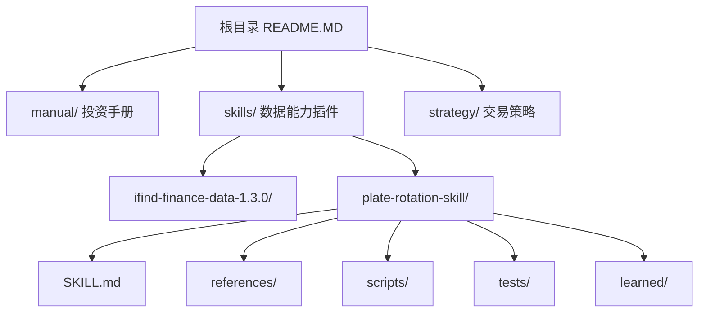
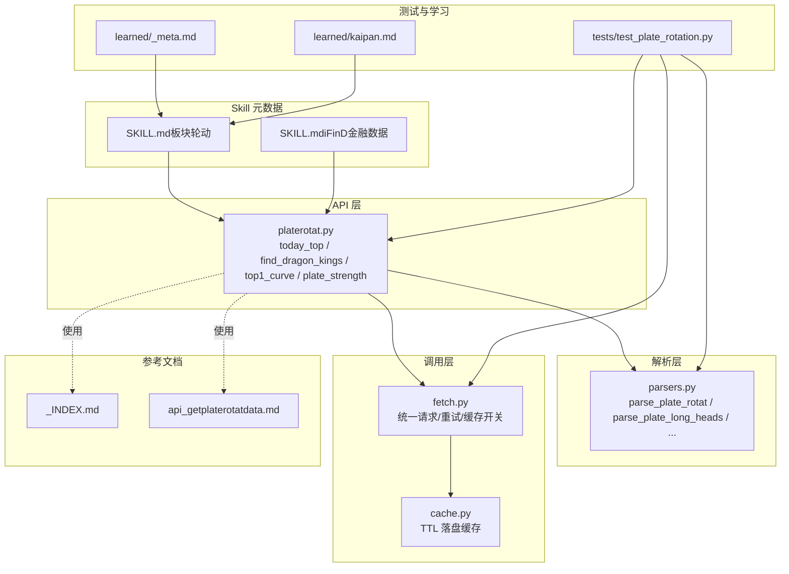
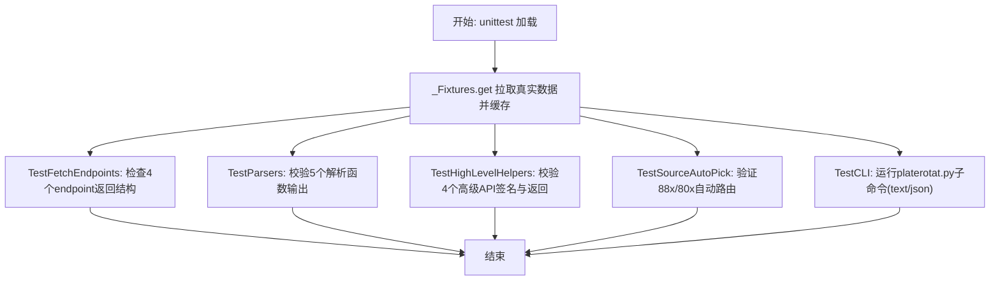
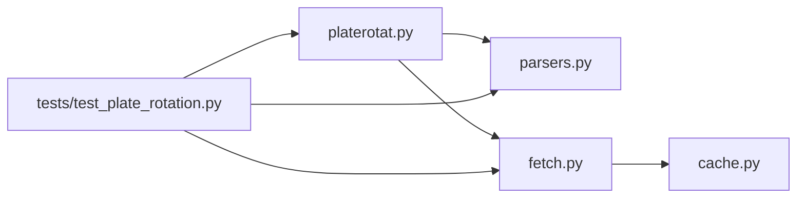

# 开发者指南

<cite>
**本文引用的文件**   
- [README.MD](file://README.MD)
- [SKILL.md（板块轮动）](file://skills/plate-rotation-skill/SKILL.md)
- [SKILL.md（iFinD金融数据）](file://skills/ifind-finance-data-1.3.0/SKILL.md)
- [README（板块轮动Skill）](file://skills/plate-rotation-skill/README.md)
- [platerotat.py](file://skills/plate-rotation-skill/scripts/platerotat.py)
- [parsers.py](file://skills/plate-rotation-skill/scripts/parsers.py)
- [fetch.py](file://skills/plate-rotation-skill/scripts/fetch.py)
- [cache.py](file://skills/plate-rotation-skill/scripts/cache.py)
- [_INDEX.md](file://skills/plate-rotation-skill/references/_INDEX.md)
- [api_getplaterotatdata.md](file://skills/plate-rotation-skill/references/api_getplaterotatdata.md)
- [test_plate_rotation.py](file://skills/plate-rotation-skill/tests/test_plate_rotation.py)
- [_meta.md（learned）](file://skills/plate-rotation-skill/learned/_meta.md)
- [kaipan.md（learned）](file://skills/plate-rotation-skill/learned/kaipan.md)
</cite>

## 目录
1. [简介](#简介)
2. [项目结构](#项目结构)
3. [核心组件](#核心组件)
4. [架构总览](#架构总览)
5. [详细组件分析](#详细组件分析)
6. [依赖关系分析](#依赖关系分析)
7. [性能与稳定性](#性能与稳定性)
8. [故障排查指南](#故障排查指南)
9. [结论](#结论)
10. [附录：开发规范与贡献流程](#附录开发规范与贡献流程)

## 简介
本指南面向希望扩展“分析技能”、开发“数据源适配器”、编写测试用例以及维护“学习机制”的开发者。项目采用插件化 Skill 设计，通过 SKILL.md 元数据驱动能力发现与编排；以 scripts 层提供统一 API 调用封装、解析器与 CLI；tests 层提供在线集成测试保障质量；learned 目录沉淀跨源经验与领域陷阱。

## 项目结构
仓库按“认知-数据-策略”分层组织：
- manual：投资手册与方法论
- skills：数据能力插件（每个 Skill 独立目录，含 SKILL.md、references、scripts、tests、learned）
- strategy：交易策略文档



图表来源
- [README.MD:1-23](file://README.MD#L1-L23)

章节来源
- [README.MD:1-23](file://README.MD#L1-L23)

## 核心组件
- 技能元数据与编排入口：SKILL.md（定义 name/description、触发词、工具清单、纪律与输出风格等）
- 统一网络调用与缓存：fetch.py + cache.py（host 别名、请求头注入、指数退避重试、TTL 落盘缓存）
- 解析器集合：parsers.py（HTML in JSON 抽取、矩阵/日期/龙头解析）
- 高级 API 与 CLI：platerotat.py（today_top/find_dragon_kings/top1_curve/plate_strength 四个意图函数 + 子命令）
- 参考接口文档：references/_INDEX.md 与各 api_*.md（入参/出参/示例/解析提示）
- 在线集成测试：tests/test_plate_rotation.py（覆盖 endpoint、parsers、helper、CLI 双模）
- 学习机制：learned/_meta.md 与 learned/*.md（跨源与源专属经验沉淀）

章节来源
- [SKILL.md（板块轮动）:1-280](file://skills/plate-rotation-skill/SKILL.md#L1-L280)
- [SKILL.md（iFinD金融数据）:1-111](file://skills/ifind-finance-data-1.3.0/SKILL.md#L1-L111)
- [platerotat.py:1-315](file://skills/plate-rotation-skill/scripts/platerotat.py#L1-L315)
- [parsers.py:1-212](file://skills/plate-rotation-skill/scripts/parsers.py#L1-L212)
- [fetch.py:1-230](file://skills/plate-rotation-skill/scripts/fetch.py#L1-L230)
- [cache.py:1-145](file://skills/plate-rotation-skill/scripts/cache.py#L1-L145)
- [_INDEX.md:1-43](file://skills/plate-rotation-skill/references/_INDEX.md#L1-L43)
- [api_getplaterotatdata.md:1-74](file://skills/plate-rotation-skill/references/api_getplaterotatdata.md#L1-L74)
- [test_plate_rotation.py:1-444](file://skills/plate-rotation-skill/tests/test_plate_rotation.py#L1-L444)
- [_meta.md（learned）:1-47](file://skills/plate-rotation-skill/learned/_meta.md#L1-L47)
- [kaipan.md（learned）:1-46](file://skills/plate-rotation-skill/learned/kaipan.md#L1-L46)

## 架构总览
整体采用“SKILL 元数据 → 高级 API → 解析器 → 统一调用器 → 本地缓存”的分层解耦设计。Agent 或用户通过 CLI 或直接 import 高级 API，内部组合底层接口并做运行时校验与警告输出。



图表来源
- [SKILL.md（板块轮动）:1-280](file://skills/plate-rotation-skill/SKILL.md#L1-L280)
- [SKILL.md（iFinD金融数据）:1-111](file://skills/ifind-finance-data-1.3.0/SKILL.md#L1-L111)
- [platerotat.py:1-315](file://skills/plate-rotation-skill/scripts/platerotat.py#L1-L315)
- [parsers.py:1-212](file://skills/plate-rotation-skill/scripts/parsers.py#L1-L212)
- [fetch.py:1-230](file://skills/plate-rotation-skill/scripts/fetch.py#L1-L230)
- [cache.py:1-145](file://skills/plate-rotation-skill/scripts/cache.py#L1-L145)
- [_INDEX.md:1-43](file://skills/plate-rotation-skill/references/_INDEX.md#L1-L43)
- [api_getplaterotatdata.md:1-74](file://skills/plate-rotation-skill/references/api_getplaterotatdata.md#L1-L74)
- [test_plate_rotation.py:1-444](file://skills/plate-rotation-skill/tests/test_plate_rotation.py#L1-L444)
- [_meta.md（learned）:1-47](file://skills/plate-rotation-skill/learned/_meta.md#L1-L47)
- [kaipan.md（learned）:1-46](file://skills/plate-rotation-skill/learned/kaipan.md#L1-L46)

## 详细组件分析

### 技能元数据与注册机制（SKILL.md）
- 元数据字段：name、description、homepage、version、author 等，用于 Agent 识别与加载
- 触发关键词：在 description 中声明，便于自动匹配
- 工具弹药库：列出 CLI 与 Python helper 用法，明确优先级（CLI > helper > 底层 fetch）
- 必守纪律：强制约束数据来源、前缀路由、数值不可跨源比较、输出顺序等
- 协作协议：sub-agent 分发范式、共享缓存约定、prompt 模板
- 运行时校验信号：PR-EMPTY/PR-WARN 标签，指导下游行为

章节来源
- [SKILL.md（板块轮动）:1-280](file://skills/plate-rotation-skill/SKILL.md#L1-L280)
- [SKILL.md（iFinD金融数据）:1-111](file://skills/ifind-finance-data-1.3.0/SKILL.md#L1-L111)

### 插件化设计与统一 API 调用
- 高级 API 封装：platerotat.py 暴露 today_top/find_dragon_kings/top1_curve/plate_strength 四个意图函数
- 自动路由：find_dragon_kings 根据 platecode 前缀选择 ths/kaipan 源
- 运行时校验：空数据或缺关键字段时输出 PR-EMPTY/PR-WARN 到 stderr
- CLI 四子命令：today/wangking/curve/strength，支持 text/json 双模输出

```mermaid
sequenceDiagram
participant U as "用户/Agent"
participant CLI as "platerotat.py CLI"
participant API as "高级API(platerotat)"
participant PAR as "parsers.py"
participant NET as "fetch.py"
participant CACHE as "cache.py"
U->>CLI : 执行子命令(如 wangking 886084 --json)
CLI->>API : find_dragon_kings(platecode, days, top_n)
API->>API : 根据前缀推断 source
API->>NET : _call("main", "/api/getPlateRotatData", from=source, days)
NET->>CACHE : cache_get(host,path,params)
alt 命中缓存
CACHE-->>NET : 返回原始响应体
else 未命中
NET->>NET : 构造请求(Referer/Cookie/UA)
NET->>NET : do_request(指数退避重试)
NET->>CACHE : cache_put(...)
NET-->>API : 原始JSON字符串
end
API->>PAR : parse_plate_rotat_dates / parse_plate_long_heads / rank...
PAR-->>API : 结构化结果
API-->>CLI : 返回字典(含 dates/kings/daily_heads)
CLI-->>U : JSON 文本输出
```

图表来源
- [platerotat.py:1-315](file://skills/plate-rotation-skill/scripts/platerotat.py#L1-L315)
- [parsers.py:1-212](file://skills/plate-rotation-skill/scripts/parsers.py#L1-L212)
- [fetch.py:1-230](file://skills/plate-rotation-skill/scripts/fetch.py#L1-L230)
- [cache.py:1-145](file://skills/plate-rotation-skill/scripts/cache.py#L1-L145)

章节来源
- [platerotat.py:1-315](file://skills/plate-rotation-skill/scripts/platerotat.py#L1-L315)

### 数据源适配器与异常处理
- 统一调用器 fetch.py：
  - host 别名映射 main/data/x/ext
  - 自动注入 Referer/Origin/UA/X-Requested-With，可选 Cookie
  - 支持 GET/POST，kv 参数或 -p JSON 参数
  - 指数退避重试：对 429/5xx 及网络异常进行 1s/2s/4s 重试
  - 缓存：POST 默认启用 TTL 落盘缓存，可 --no-cache 或环境变量关闭
- 异常处理：
  - HTTPError 非重试码直接抛出
  - 网络异常/超时/连接错误记录原因后重试
  - 最终失败打印详细原因并以非零退出码退出
- 缓存原子写：先写 tmp 再 os.replace，避免半写文件

章节来源
- [fetch.py:1-230](file://skills/plate-rotation-skill/scripts/fetch.py#L1-L230)
- [cache.py:1-145](file://skills/plate-rotation-skill/scripts/cache.py#L1-L145)

### 解析器与数据结构
- parsers.py 提供：
  - parse_plate_rotat：从 HTML in JSON 抽取 Top N 板块，标注 value_type='pct'/'score'
  - parse_plate_rotat_matrix：还原 N×天矩阵
  - parse_plate_rotat_dates：抽取日期序列（newest first）
  - parse_plate_long_heads：解析龙头矩阵，兼容“当日无领涨”的错位闭合
  - rank_plate_long_persistence：统计跨天上榜次数，生成妖王榜
- 复杂度：正则扫描与遍历为 O(N+M)，N 为行数，M 为单元格数；排序 O(K log K)

```mermaid
flowchart TD
Start(["进入 parse_plate_long_heads"]) --> ReadHtml["读取 html 字段"]
ReadHtml --> FindTds["正则匹配 td 块(兼容两种 style)"]
FindTds --> LoopDays{"遍历每个 td"}
LoopDays --> |包含"当日无领涨"| EmptyHeads["heads=[]"]
LoopDays --> |存在 kline div| ParseKlines["提取 code/rank/name"]
EmptyHeads --> AppendDay["追加 {date, heads}"]
ParseKlines --> AppendDay
AppendDay --> NextDay{"是否还有 td?"}
NextDay --> |是| LoopDays
NextDay --> |否| End(["返回列表"])
```

图表来源
- [parsers.py:113-153](file://skills/plate-rotation-skill/scripts/parsers.py#L113-L153)

章节来源
- [parsers.py:1-212](file://skills/plate-rotation-skill/scripts/parsers.py#L1-L212)

### 参考接口与路由表
- references/_INDEX.md：汇总 4 个接口、from 差异、days 档位、dates 可选窗口
- api_getplaterotatdata.md：入参/出参/样例/解析提示，强调 HTML 模板与 first 字段用途

章节来源
- [_INDEX.md:1-43](file://skills/plate-rotation-skill/references/_INDEX.md#L1-L43)
- [api_getplaterotatdata.md:1-74](file://skills/plate-rotation-skill/references/api_getplaterotatdata.md#L1-L74)

### 测试框架与用例设计（基于 test_plate_rotation.py）
- 目标：验证 4 个 endpoint 健康、5 个 parsers 正确性、4 个高级 helper 签名与返回结构、自动路由、CLI 双模
- Fixture：_Fixtures.get 复用 fetch.py --raw 拉取一次真实数据，避免重复打网
- 断言要点：
  - 字段存在性与类型
  - 值域与格式（value_type、% 后缀、日期格式、龙头 code 位数）
  - 排序与边界（rank 升序、top_n 限制、positions 数量一致性）
  - 自动路由（88x→ths，80x/803x→kaipan）
  - CLI 子命令 text/json 输出结构与错误路径（缺参/非法参数）



图表来源
- [test_plate_rotation.py:1-444](file://skills/plate-rotation-skill/tests/test_plate_rotation.py#L1-L444)

章节来源
- [test_plate_rotation.py:1-444](file://skills/plate-rotation-skill/tests/test_plate_rotation.py#L1-L444)

### 学习机制（learned 目录）
- _meta.md：跨源通用经验沉淀，记录现象/根因/应对/教训，要求变更后更新头部并检查 CLAUDE.md
- kaipan.md：开盘啦源专属经验（强度分单位、前缀规则、解读哲学、路由速记）
- 建议：每次任务完成后总结新发现，补充到对应文件；接口改版导致沉淀失效时删除条目并更新 references

章节来源
- [_meta.md（learned）:1-47](file://skills/plate-rotation-skill/learned/_meta.md#L1-L47)
- [kaipan.md（learned）:1-46](file://skills/plate-rotation-skill/learned/kaipan.md#L1-L46)

## 依赖关系分析
- 模块耦合：
  - platerotat.py 依赖 parsers.py 与 fetch.py（subprocess 调用）
  - fetch.py 依赖 cache.py（TTL 落盘）
  - tests 依赖 platerotat.py、parsers.py、fetch.py（subprocess）
- 外部依赖：
  - 仅 stdlib（urllib、argparse、json、re、unittest、subprocess 等）
  - 第三方服务：duanxianxia.com 系列主机（main/data/x）



图表来源
- [platerotat.py:1-315](file://skills/plate-rotation-skill/scripts/platerotat.py#L1-L315)
- [parsers.py:1-212](file://skills/plate-rotation-skill/scripts/parsers.py#L1-L212)
- [fetch.py:1-230](file://skills/plate-rotation-skill/scripts/fetch.py#L1-L230)
- [cache.py:1-145](file://skills/plate-rotation-skill/scripts/cache.py#L1-L145)
- [test_plate_rotation.py:1-444](file://skills/plate-rotation-skill/tests/test_plate_rotation.py#L1-L444)

章节来源
- [platerotat.py:1-315](file://skills/plate-rotation-skill/scripts/platerotat.py#L1-L315)
- [parsers.py:1-212](file://skills/plate-rotation-skill/scripts/parsers.py#L1-L212)
- [fetch.py:1-230](file://skills/plate-rotation-skill/scripts/fetch.py#L1-L230)
- [cache.py:1-145](file://skills/plate-rotation-skill/scripts/cache.py#L1-L145)
- [test_plate_rotation.py:1-444](file://skills/plate-rotation-skill/tests/test_plate_rotation.py#L1-L444)

## 性能与稳定性
- 缓存策略：
  - POST 请求默认启用 TTL 缓存（默认 1h），可通过 --no-cache 或 PR_CACHE_DISABLE=1 关闭
  - 原子写入避免损坏，支持 stats/clear 管理
- 重试策略：
  - 指数退避 1s/2s/4s，最多 3 次，适用于 429/5xx 与网络异常
- 解析性能：
  - 正则一次性扫描，避免多次 I/O；矩阵构建与排序复杂度可控
- 建议：
  - 盘中实时场景使用 --no-cache 或降低 TTL
  - 批量任务优先复用 _Fixtures 模式减少重复网络开销

章节来源
- [cache.py:1-145](file://skills/plate-rotation-skill/scripts/cache.py#L1-L145)
- [fetch.py:1-230](file://skills/plate-rotation-skill/scripts/fetch.py#L1-L230)
- [parsers.py:1-212](file://skills/plate-rotation-skill/scripts/parsers.py#L1-L212)

## 故障排查指南
- 常见症状与定位：
  - 空数据：查看 stderr 是否出现 PR-EMPTY，结合 _hint_for_empty 提示（周末/节假日/跨源错传/上游异常）
  - 未活跃：PR-WARN 表示 legend=null 或 heads 为空，属合法返回值
  - 缓存问题：确认 PR_CACHE_DISABLE/--no-cache/TTL 设置；使用 cache.py stats/clear 诊断
  - 网络异常：检查 RETRY_HTTP_CODES 与 do_request 日志；必要时 -v 调试 URL/body/cookie
- 快速自检：
  - 使用 fetch.py -v 探测 URL 与请求体
  - 使用 parsers.py 内置 demo 模式验证解析逻辑
  - 运行 tests/test_plate_rotation.py 全量回归

章节来源
- [platerotat.py:75-98](file://skills/plate-rotation-skill/scripts/platerotat.py#L75-L98)
- [fetch.py:91-124](file://skills/plate-rotation-skill/scripts/fetch.py#L91-L124)
- [cache.py:119-145](file://skills/plate-rotation-skill/scripts/cache.py#L119-L145)
- [parsers.py:178-212](file://skills/plate-rotation-skill/scripts/parsers.py#L178-L212)

## 结论
本项目以 SKILL.md 为元数据驱动，配合 scripts 层的统一调用、解析与高级 API，形成高内聚低耦合的插件化架构。通过在线集成测试与 learned 经验沉淀，持续保障数据准确性与可维护性。遵循本指南可高效扩展新的分析技能与数据源适配器。

## 附录：开发规范与贡献流程
- 新增 Skill 的步骤
  - 在 skills/ 下新建目录，编写 SKILL.md（name/description/触发词/工具清单/纪律/输出风格）
  - 实现 scripts/ 层：统一调用器（若需）、解析器、高级 API 与 CLI
  - 编写 references/ 接口文档（参照 _INDEX.md 与 api_getplaterotatdata.md 范式）
  - 编写 tests/ 在线集成测试（覆盖 endpoint、parsers、helper、CLI 双模）
  - 沉淀 learned/ 经验（_meta.md 与源专属文件）
- 编码规范
  - 仅使用 stdlib，避免引入第三方依赖
  - 严格区分 value_type（pct/score），禁止跨源数值直接比较
  - 所有对外函数增加运行时校验与 PR-EMPTY/PR-WARN 警告
  - CLI 必须支持 --json 输出，便于管道与自动化
- 版本管理与发布
  - SKILL.md 头部变更需同步更新 CLAUDE.md（若存在）
  - 接口变更更新 references 文档 last_verified 与示例
  - 测试通过后提交 PR，附带 learned 条目说明影响面
- 调试技巧
  - fetch.py -v 打印 URL/body/cookie
  - cache.py stats/clear 管理缓存
  - 使用 tests/test_plate_rotation.py 快速回归
- 监控指标建议
  - 统计 PR-EMPTY/PR-WARN 出现频率
  - 记录缓存命中率与平均延迟
  - 跟踪 retry 次数分布与失败原因

章节来源
- [SKILL.md（板块轮动）:1-280](file://skills/plate-rotation-skill/SKILL.md#L1-L280)
- [SKILL.md（iFinD金融数据）:1-111](file://skills/ifind-finance-data-1.3.0/SKILL.md#L1-L111)
- [_INDEX.md:1-43](file://skills/plate-rotation-skill/references/_INDEX.md#L1-L43)
- [api_getplaterotatdata.md:1-74](file://skills/plate-rotation-skill/references/api_getplaterotatdata.md#L1-L74)
- [test_plate_rotation.py:1-444](file://skills/plate-rotation-skill/tests/test_plate_rotation.py#L1-L444)
- [_meta.md（learned）:1-47](file://skills/plate-rotation-skill/learned/_meta.md#L1-L47)