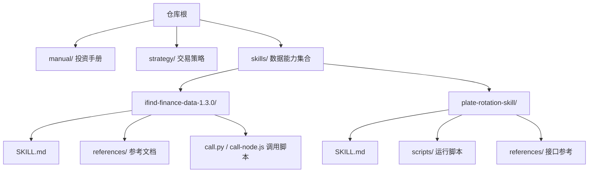
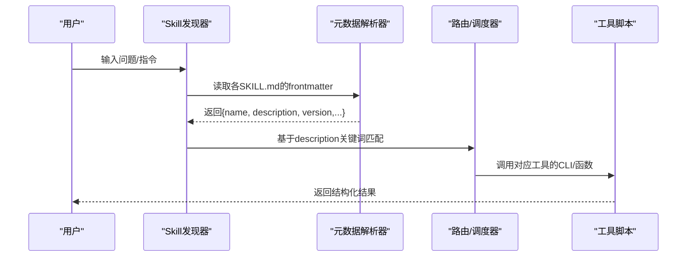

# SKILL.md元数据配置

<cite>
**本文引用的文件**
- [SKILL.md](file://skills/ifind-finance-data-1.3.0/SKILL.md)
- [SKILL.md](file://skills/plate-rotation-skill/SKILL.md)
- [README.MD](file://README.MD)
- [call.py](file://skills/ifind-finance-data-1.3.0/call.py)
- [call-node.js](file://skills/ifind-finance-data-1.3.0/call-node.js)
</cite>

## 目录
1. [简介](#简介)
2. [项目结构](#项目结构)
3. [核心组件](#核心组件)
4. [架构总览](#架构总览)
5. [详细组件分析](#详细组件分析)
6. [依赖关系分析](#依赖关系分析)
7. [性能与可用性考虑](#性能与可用性考虑)
8. [故障排查指南](#故障排查指南)
9. [结论](#结论)
10. [附录：字段规范与示例](#附录字段规范与示例)

## 简介
本指南面向开发者，系统化说明仓库中 SKILL.md 的 YAML frontmatter 元数据配置规范。重点覆盖以下方面：
- 必填字段定义与作用（name、description）
- description 字段中触发关键词的编写规则与匹配机制
- 技能名称、功能描述与关键词的组织方式
- 完整元数据配置示例（不同复杂度技能）
- 字段验证规则、默认值处理与兼容性要求
- 版本管理与更新策略

## 项目结构
仓库采用“按能力域组织”的结构，每个 Skill 位于 skills/ 下独立目录，并在其根目录提供 SKILL.md 作为该技能的元数据与使用说明入口。

图表来源
- [README.MD:1-25](file://README.MD#L1-L25)
- [SKILL.md:1-10](file://skills/ifind-finance-data-1.3.0/SKILL.md#L1-L10)
- [SKILL.md:1-10](file://skills/plate-rotation-skill/SKILL.md#L1-L10)

章节来源
- [README.MD:1-25](file://README.MD#L1-L25)

## 核心组件
- SKILL.md：每个 Skill 的元数据与使用说明，YAML frontmatter 承载元数据，正文承载使用方法、工具清单、注意事项等。
- references/：子服务或接口的参考文档，供运行时按需加载。
- scripts/ 或顶层脚本：Skill 的运行实现（CLI、Python/Node 调用封装）。

章节来源
- [SKILL.md:1-10](file://skills/ifind-finance-data-1.3.0/SKILL.md#L1-L10)
- [SKILL.md:1-10](file://skills/plate-rotation-skill/SKILL.md#L1-L10)

## 架构总览
从“元数据到执行”的整体流程如下：
- 系统扫描各 Skill 目录下的 SKILL.md，解析 YAML frontmatter 获取 name、description、version 等元数据。
- 根据用户输入与 description 中的触发关键词进行匹配，选择对应 Skill。
- 进入 Skill 正文，按“使用方法/工具弹药库”指引调用具体脚本或 API。

[此图为概念性流程图，不直接映射具体源码文件]

## 详细组件分析

### 元数据字段规范（YAML frontmatter）
- name（必填）
  - 作用：技能的唯一标识名，用于识别与引用。
  - 格式：字符串；建议短横线命名（kebab-case），避免空格与特殊字符。
  - 示例路径：见 ifind-finance-data 与 plate-rotation 两个 SKILL.md 的 frontmatter。
- description（必填）
  - 作用：用一句话概括技能能力，并包含触发关键词，用于用户意图匹配。
  - 格式：字符串；末尾可追加“触发关键词: ...”段落，便于匹配。
  - 关键词编写规则：
    - 使用中文为主，辅以英文术语、代码前缀、函数名等。
    - 以顿号分隔，尽量覆盖用户可能的问法与搜索词。
    - 包含领域专有名词、板块/概念名、API/函数名、常见缩写。
    - 避免过度泛化导致误匹配。
- homepage（可选）
  - 作用：技能主页或官方站点链接。
  - 格式：URL 字符串。
- version（可选）
  - 作用：语义化版本号，用于变更追踪与兼容判断。
  - 格式：遵循语义化版本（主.次.修订）。
- author（可选）
  - 作用：作者或提供方标识。
  - 格式：字符串。

章节来源
- [SKILL.md:1-7](file://skills/ifind-finance-data-1.3.0/SKILL.md#L1-L7)
- [SKILL.md:1-4](file://skills/plate-rotation-skill/SKILL.md#L1-L4)

### 触发关键词与匹配机制
- 关键词来源
  - 来自 description 字段的“触发关键词: ...”部分。
  - 也可结合 skill 名称、references 标题等辅助信息（由上层发现器决定）。
- 匹配策略建议
  - 精确匹配：对专有名词、代码前缀、函数名进行精确匹配。
  - 模糊匹配：对自然语言问法做分词与同义词扩展。
  - 优先级：越具体的关键词优先命中，避免泛词抢占。
- 典型关键词类别
  - 业务场景：如“板块轮动”“强势板块”。
  - 实体/概念：如“算力板块”“CPO”“PCB”。
  - 指标/函数：如“getPlateRotatData”“getLongByPlate”。
  - 代码前缀：如“886084”“801807”。

章节来源
- [SKILL.md:1-4](file://skills/plate-rotation-skill/SKILL.md#L1-L4)

### 元数据示例（不同复杂度）
- 简单型（仅 name + description）
  - 适用：小型工具或单接口封装。
  - 示例路径：plate-rotation 的 SKILL.md frontmatter。
- 标准型（name + description + homepage + version + author）
  - 适用：对外提供的数据服务封装。
  - 示例路径：ifind-finance-data 的 SKILL.md frontmatter。
- 复杂型（在标准型基础上，正文包含多子服务、并发限制、环境校验、错误码约定等）
  - 适用：多接口聚合、跨语言调用、权限分级等场景。
  - 示例路径：ifind-finance-data 的 SKILL.md 正文。

章节来源
- [SKILL.md:1-4](file://skills/plate-rotation-skill/SKILL.md#L1-L4)
- [SKILL.md:1-10](file://skills/ifind-finance-data-1.3.0/SKILL.md#L1-L10)

### 字段验证规则与默认值
- 基础类型校验
  - name/description/homepage/version/author 应为字符串。
  - version 应满足语义化版本格式（主.次.修订）。
- 必填项校验
  - name、description 为必填；缺失时应拒绝加载或提示补全。
- 默认值处理
  - 若未提供 homepage/version/author，可由上层系统赋予空值或占位符，但不应影响匹配与运行。
- 兼容性要求
  - 新增字段应保持向后兼容，旧版发现器忽略未知字段。
  - 删除字段需评估历史引用，必要时保留兼容键。

章节来源
- [SKILL.md:1-7](file://skills/ifind-finance-data-1.3.0/SKILL.md#L1-L7)
- [SKILL.md:1-4](file://skills/plate-rotation-skill/SKILL.md#L1-L4)

### 版本管理与更新策略
- 版本策略
  - 采用语义化版本：主版本（破坏性变更）、次版本（新增能力）、修订（修复与优化）。
- 变更记录
  - 建议在 SKILL.md 正文增加“变更日志”小节，记录每次更新的要点与影响面。
- 发布流程
  - 提交 PR → 通过测试（如有）→ 合并 → 打 tag → 更新 README 与分发渠道。
- 回滚策略
  - 保留上一个稳定版本的 SKILL.md 快照，支持快速回退。

章节来源
- [SKILL.md:1-10](file://skills/ifind-finance-data-1.3.0/SKILL.md#L1-L10)

## 依赖关系分析
- 元数据与正文分离：frontmatter 负责机器可读的元数据，正文负责人类可读的使用说明。
- 元数据驱动发现：上层发现器仅依赖 frontmatter 完成匹配与路由，无需解析正文。
- 运行时解耦：Skill 的具体实现（scripts/references）与元数据松耦合，便于替换与升级。

[此图为概念性依赖图，不直接映射具体源码文件]

## 性能与可用性考虑
- 关键词索引
  - 将 description 中的关键词建立倒排索引，提升匹配效率。
- 缓存策略
  - 对已解析的 SKILL.md frontmatter 进行内存/磁盘缓存，减少重复 IO。
- 容错与降级
  - 当某个 Skill 的 frontmatter 不完整时，跳过或降级为仅使用 name 进行弱匹配。
- 并发与限流
  - 对于外部数据源（如 iFinD），遵循其并发上限与配额策略，避免超限。

[本节为通用指导，不直接分析具体文件]

## 故障排查指南
- 常见问题
  - 无法匹配到 Skill：检查 description 是否包含足够且准确的触发关键词。
  - 版本冲突：确认 version 是否符合语义化版本，避免主版本不兼容。
  - 元数据缺失：确保 name、description 存在且非空。
- 定位步骤
  - 查看目标 SKILL.md 的 frontmatter 是否完整。
  - 核对关键词是否与用户问法一致。
  - 检查实现脚本是否能正常执行（网络、依赖、权限）。

章节来源
- [SKILL.md:1-10](file://skills/ifind-finance-data-1.3.0/SKILL.md#L1-L10)
- [SKILL.md:1-10](file://skills/plate-rotation-skill/SKILL.md#L1-L10)

## 结论
通过统一的 SKILL.md 元数据规范，可实现：
- 标准化的技能注册与发现
- 高可用的关键词匹配与路由
- 清晰的版本演进与兼容性保障
- 良好的可扩展性与维护性

[本节为总结性内容，不直接分析具体文件]

## 附录：字段规范与示例

### 字段定义表
- name（必填）
  - 类型：字符串
  - 说明：技能唯一标识
  - 示例路径：[SKILL.md:1-3](file://skills/ifind-finance-data-1.3.0/SKILL.md#L1-L3)、[SKILL.md:1-3](file://skills/plate-rotation-skill/SKILL.md#L1-L3)
- description（必填）
  - 类型：字符串
  - 说明：能力概述 + 触发关键词
  - 示例路径：[SKILL.md:1-4](file://skills/ifind-finance-data-1.3.0/SKILL.md#L1-L4)、[SKILL.md:1-4](file://skills/plate-rotation-skill/SKILL.md#L1-L4)
- homepage（可选）
  - 类型：URL 字符串
  - 说明：官方主页
  - 示例路径：[SKILL.md:1-5](file://skills/ifind-finance-data-1.3.0/SKILL.md#L1-L5)
- version（可选）
  - 类型：语义化版本字符串
  - 说明：主.次.修订
  - 示例路径：[SKILL.md:1-5](file://skills/ifind-finance-data-1.3.0/SKILL.md#L1-L5)
- author（可选）
  - 类型：字符串
  - 说明：作者/提供方
  - 示例路径：[SKILL.md:1-6](file://skills/ifind-finance-data-1.3.0/SKILL.md#L1-L6)

### 触发关键词编写规则
- 分类覆盖：业务场景、实体/概念、指标/函数、代码前缀
- 表达清晰：避免歧义，尽量贴近用户真实问法
- 长度适中：不过度堆砌，保持可读性
- 示例路径：[SKILL.md:1-4](file://skills/plate-rotation-skill/SKILL.md#L1-L4)

### 完整示例（路径）
- 简单型示例：[SKILL.md:1-4](file://skills/plate-rotation-skill/SKILL.md#L1-L4)
- 标准型示例：[SKILL.md:1-7](file://skills/ifind-finance-data-1.3.0/SKILL.md#L1-L7)
- 复杂型示例（含正文）：[SKILL.md:1-111](file://skills/ifind-finance-data-1.3.0/SKILL.md#L1-L111)

### 兼容性要求
- 新增字段不影响旧版解析
- 删除字段需保留兼容键或迁移策略
- 版本升级遵循语义化版本约束

[本节为规范汇总，不直接分析具体文件]