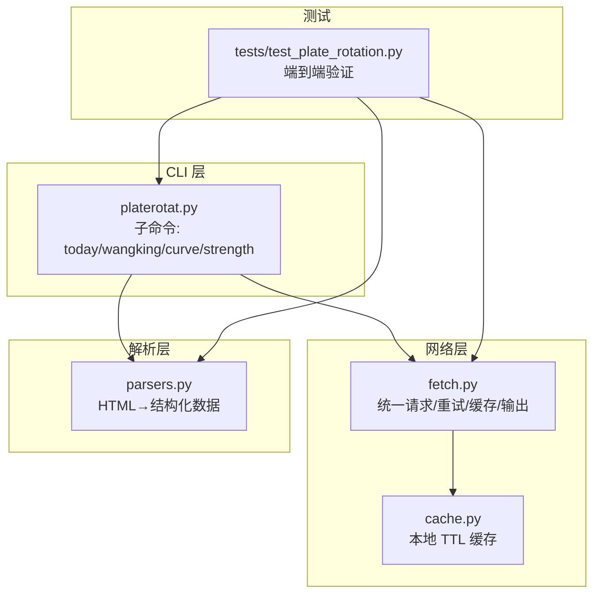
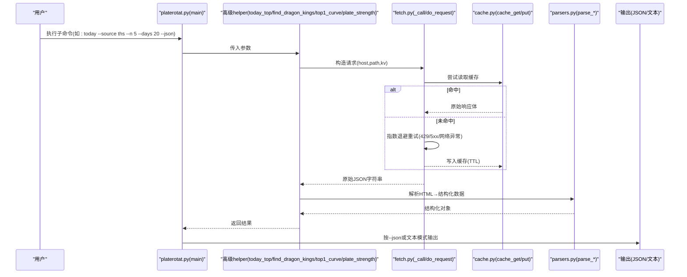
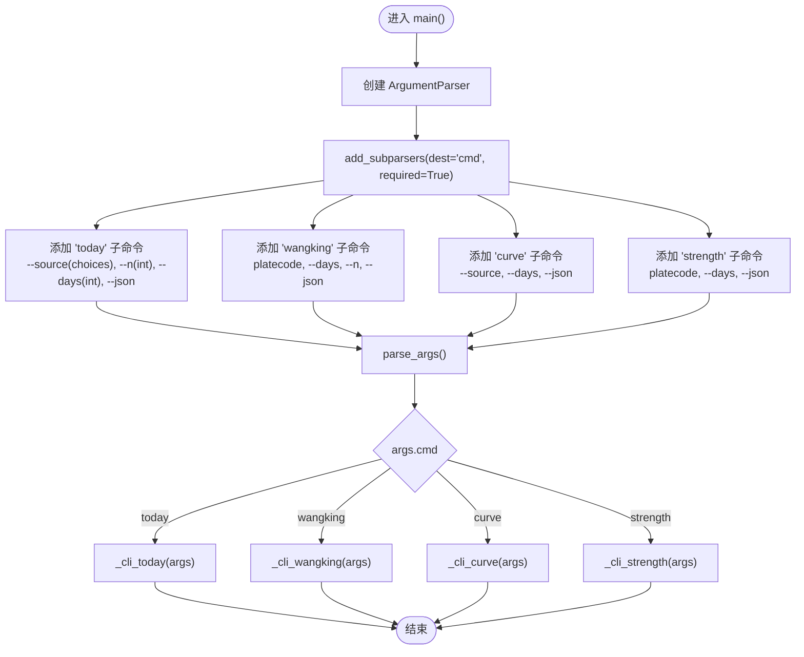
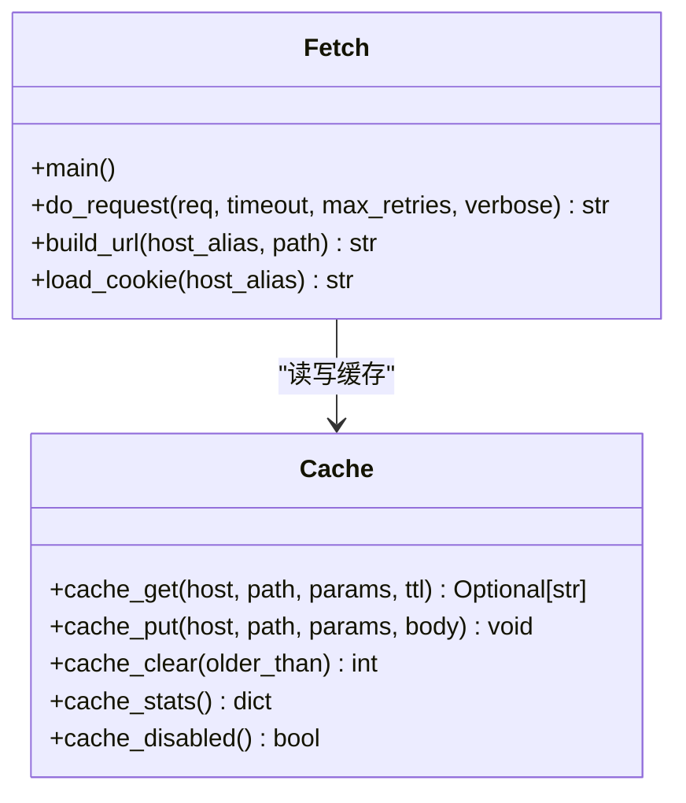
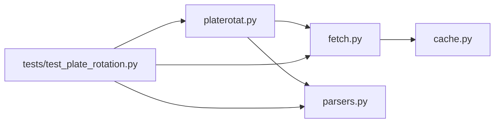

# 命令行工具开发

<cite>
**本文引用的文件**   
- [README.MD](file://README.MD)
- [platerotat.py](file://skills/plate-rotation-skill/scripts/platerotat.py)
- [fetch.py](file://skills/plate-rotation-skill/scripts/fetch.py)
- [parsers.py](file://skills/plate-rotation-skill/scripts/parsers.py)
- [cache.py](file://skills/plate-rotation-skill/scripts/cache.py)
- [test_plate_rotation.py](file://skills/plate-rotation-skill/tests/test_plate_rotation.py)
</cite>

## 目录
1. [简介](#简介)
2. [项目结构](#项目结构)
3. [核心组件](#核心组件)
4. [架构总览](#架构总览)
5. [详细组件分析](#详细组件分析)
6. [依赖关系分析](#依赖关系分析)
7. [性能与可用性考量](#性能与可用性考量)
8. [故障排查指南](#故障排查指南)
9. [结论](#结论)
10. [附录：CLI 命令速查](#附录cli-命令速查)

## 简介
本教程以“板块轮动”子项目中的 CLI 为范例，系统讲解如何基于 Python 标准库 argparse 构建专业级命令行工具。内容覆盖：
- 子命令设计与参数传递机制
- 参数校验、错误提示与帮助信息生成
- JSON 输出与表格输出（含对齐排版与可读性优化）
- 颜色标记的扩展思路
- 可测试性与健壮性设计（重试、缓存、运行时校验）

该 CLI 提供四个子命令：today、wangking、curve、strength，分别对应“今日 Top 板块”“板块妖王榜”“Top5 排名曲线”“单板块强度时序”。每个子命令均支持 --json 开关，便于机器消费；默认文本模式则面向人类阅读。

## 项目结构
仓库根目录包含策略文档、技能模块与手册等。CLI 实现位于 skills/plate-rotation-skill/scripts 下，采用“分层解耦”的组织方式：
- platerotat.py：高级 API + CLI 入口（argparse 子命令）
- fetch.py：网络调用原子层（统一请求、重试、缓存、输出格式化）
- parsers.py：HTML-in-JSON 解析器（正则抽取结构化数据）
- cache.py：本地磁盘缓存（TTL、原子写、统计与清理）
- tests/test_plate_rotation.py：在线集成测试（覆盖端点健康、解析正确性、高级函数签名、CLI 双模输出）

图表来源
- [platerotat.py:278-310](file://skills/plate-rotation-skill/scripts/platerotat.py#L278-L310)
- [fetch.py:128-143](file://skills/plate-rotation-skill/scripts/fetch.py#L128-L143)
- [parsers.py:1-20](file://skills/plate-rotation-skill/scripts/parsers.py#L1-L20)
- [cache.py:1-27](file://skills/plate-rotation-skill/scripts/cache.py#L1-L27)
- [test_plate_rotation.py:330-443](file://skills/plate-rotation-skill/tests/test_plate_rotation.py#L330-L443)

章节来源
- [README.MD:1-83](file://README.MD#L1-L83)
- [platerotat.py:1-35](file://skills/plate-rotation-skill/scripts/platerotat.py#L1-L35)

## 核心组件
- 子命令与参数
  - today：选择数据源（ths/kaipan）、返回数量 n、回溯天数 days、--json 开关
  - wangking：板块代码 platecode、days、n、--json
  - curve：source、days、--json
  - strength：platecode、days、--json
- 输出格式
  - JSON：通过 --json 输出结构化数据，便于下游程序处理
  - 文本：标题行 + 对齐列 + 箭头指示涨跌（可扩展 ANSI 颜色）
- 参数校验
  - choices 限制 source 取值
  - type=int 限制数值类型
  - required=True 强制子命令存在
- 错误与帮助
  - argparse 自动打印帮助与用法
  - 非法参数直接退出并给出明确错误信息
  - 运行时空数据告警（stderr 带 PR-EMPTY/PR-WARN 前缀）

章节来源
- [platerotat.py:278-310](file://skills/plate-rotation-skill/scripts/platerotat.py#L278-L310)
- [test_plate_rotation.py:424-439](file://skills/plate-rotation-skill/tests/test_plate_rotation.py#L424-L439)

## 架构总览
整体流程：用户通过 CLI 发起子命令 → 解析参数 → 调用高级 helper → 底层通过 fetch.py 发起 HTTP 请求（含重试与缓存）→ parsers.py 将 HTML-in-JSON 解析为结构化数据 → 根据 --json 或文本模式输出结果。

图表来源
- [platerotat.py:55-71](file://skills/plate-rotation-skill/scripts/platerotat.py#L55-L71)
- [platerotat.py:102-120](file://skills/plate-rotation-skill/scripts/platerotat.py#L102-L120)
- [fetch.py:128-212](file://skills/plate-rotation-skill/scripts/fetch.py#L128-L212)
- [cache.py:59-94](file://skills/plate-rotation-skill/scripts/cache.py#L59-L94)
- [parsers.py:20-65](file://skills/plate-rotation-skill/scripts/parsers.py#L20-L65)

## 详细组件分析

### 子命令与参数设计（argparse）
- 使用 add_subparsers 注册子命令，并通过 set_defaults(func=...) 绑定处理器
- 使用 choices 限定枚举值，type=int 限定整数，required=True 保证子命令必填
- 每个子命令都暴露 --json 开关，用于切换输出格式

图表来源
- [platerotat.py:278-310](file://skills/plate-rotation-skill/scripts/platerotat.py#L278-L310)

章节来源
- [platerotat.py:278-310](file://skills/plate-rotation-skill/scripts/platerotat.py#L278-L310)
- [test_plate_rotation.py:424-439](file://skills/plate-rotation-skill/tests/test_plate_rotation.py#L424-L439)

### 参数传递机制
- 子命令处理器接收 args 命名空间对象，直接访问属性（如 args.source、args.n、args.days、args.json）
- 高级 helper 以具名参数形式接收这些值，内部再组合成 kv 参数传给 fetch.py
- fetch.py 支持两种传参姿势：
  - key=value 列表（自动拼接为 form/query）
  - -p/--params-json 传入复杂 JSON（优先级高于 kv）

章节来源
- [platerotat.py:227-276](file://skills/plate-rotation-skill/scripts/platerotat.py#L227-L276)
- [fetch.py:128-155](file://skills/plate-rotation-skill/scripts/fetch.py#L128-L155)

### 结果输出格式（JSON 与表格）
- JSON 输出：统一通过 _print_json 进行美化（ensure_ascii=False, indent=2），便于机器消费
- 文本输出：
  - 今日 Top：标题行 + 每行 #排名 代码 名称 方向箭头 数值
  - 妖王榜：标题 + 上榜次数 + 历史位置片段
  - 曲线：日期序列 + 各板块排名序列
  - 强度：legend/date 及 series keys 概览
- 颜色标记：当前文本输出使用 Unicode 箭头表示涨跌；如需终端颜色，可在渲染层引入 ANSI 转义码（例如红色/绿色），但需考虑无彩终端回退

章节来源
- [platerotat.py:223-276](file://skills/plate-rotation-skill/scripts/platerotat.py#L223-L276)
- [test_plate_rotation.py:344-422](file://skills/plate-rotation-skill/tests/test_plate_rotation.py#L344-L422)

### 错误提示与帮助信息
- argparse 自动生成帮助与用法说明，并在缺参/非法参数时立即报错退出
- 非零退出码配合 stderr 输出，便于脚本化检测
- 运行时空数据告警：在高级 helper 中通过 _warn 输出 PR-EMPTY/PR-WARN 前缀到 stderr，辅助下游区分“节假日/参数超前/上游异常”等场景

章节来源
- [platerotat.py:75-97](file://skills/plate-rotation-skill/scripts/platerotat.py#L75-L97)
- [test_plate_rotation.py:424-439](file://skills/plate-rotation-skill/tests/test_plate_rotation.py#L424-L439)

### 网络层与缓存（fetch.py + cache.py）
- 统一请求封装：
  - 支持 GET/POST，kv 或 JSON 参数
  - 自动注入 UA/Referer/Origin/X-Requested-With/Cookie
  - 指数退避重试（429/5xx/网络异常），最大重试次数可调
- 本地缓存：
  - POST 请求默认落盘缓存，TTL 可配置（环境变量 PR_CACHE_TTL）
  - 全局关闭开关 PR_CACHE_DISABLE=1
  - 原子写（先写 .tmp 再 replace），避免半写文件
  - 提供 stats/clear 自检 CLI

图表来源
- [fetch.py:91-124](file://skills/plate-rotation-skill/scripts/fetch.py#L91-L124)
- [cache.py:59-94](file://skills/plate-rotation-skill/scripts/cache.py#L59-L94)

章节来源
- [fetch.py:128-212](file://skills/plate-rotation-skill/scripts/fetch.py#L128-L212)
- [cache.py:1-27](file://skills/plate-rotation-skill/scripts/cache.py#L1-L27)

### 解析层（parsers.py）
- 从 HTML-in-JSON 中抽取结构化数据：
  - parse_plate_rotat：提取 rank/code/name/value/color/value_type
  - parse_plate_rotat_dates：抽取日期序列（newest first）
  - parse_plate_long_heads：每日龙头股清单
  - rank_plate_long_persistence：跨天统计“妖王”
- 对双源差异做兼容：ths 值为百分比（带%），kaipan 值为纯数字分数

章节来源
- [parsers.py:20-65](file://skills/plate-rotation-skill/scripts/parsers.py#L20-L65)
- [parsers.py:105-109](file://skills/plate-rotation-skill/scripts/parsers.py#L105-L109)
- [parsers.py:113-174](file://skills/plate-rotation-skill/scripts/parsers.py#L113-L174)

### 测试与质量保障（tests/test_plate_rotation.py）
- 覆盖范围：
  - 4 个底层端点健康度
  - 5 个解析函数的结构与语义
  - 4 个高级 helper 的返回结构
  - find_dragon_kings 的自动路由（88x→ths，80x/803x→kaipan）
  - CLI 子命令 text/json 双模输出
- 关键断言示例：
  - 无子命令时返回非零退出码
  - 非法 --source 被 choices 拒绝
  - ths 源 value 必带%，kaipan 源 value 不带%
  - dates 顺序 newest-first、无重复
  - 妖王榜 count 降序且 positions 格式正确

章节来源
- [test_plate_rotation.py:74-118](file://skills/plate-rotation-skill/tests/test_plate_rotation.py#L74-L118)
- [test_plate_rotation.py:120-244](file://skills/plate-rotation-skill/tests/test_plate_rotation.py#L120-L244)
- [test_plate_rotation.py:246-328](file://skills/plate-rotation-skill/tests/test_plate_rotation.py#L246-L328)
- [test_plate_rotation.py:330-443](file://skills/plate-rotation-skill/tests/test_plate_rotation.py#L330-L443)

## 依赖关系分析
- 模块耦合
  - platerotat.py 依赖 fetch.py（subprocess 调用）与 parsers.py（解析）
  - fetch.py 依赖 cache.py（本地缓存）
  - tests 同时依赖 platerotat.py、parsers.py、fetch.py
- 外部依赖
  - 仅使用 Python 标准库（argparse、json、os、sys、urllib、re、hashlib、time、pathlib）
  - 不引入第三方包，利于部署与可移植性

图表来源
- [platerotat.py:34-48](file://skills/plate-rotation-skill/scripts/platerotat.py#L34-L48)
- [fetch.py:31-36](file://skills/plate-rotation-skill/scripts/fetch.py#L31-L36)
- [test_plate_rotation.py:26-45](file://skills/plate-rotation-skill/tests/test_plate_rotation.py#L26-L45)

章节来源
- [platerotat.py:34-48](file://skills/plate-rotation-skill/scripts/platerotat.py#L34-L48)
- [fetch.py:31-36](file://skills/plate-rotation-skill/scripts/fetch.py#L31-L36)
- [test_plate_rotation.py:26-45](file://skills/plate-rotation-skill/tests/test_plate_rotation.py#L26-L45)

## 性能与可用性考量
- 网络层
  - 指数退避重试降低瞬时失败影响
  - 合理超时与最大重试次数控制资源占用
- 缓存层
  - 默认 1 小时 TTL，减少重复请求
  - 原子写避免损坏缓存文件
  - 可通过环境变量快速禁用或调整 TTL
- 输出层
  - JSON 输出适合自动化流水线
  - 文本输出注重可读性，必要时可加入 ANSI 颜色增强对比度（需考虑无彩终端回退）

[本节为通用指导，无需特定文件引用]

## 故障排查指南
- 常见错误定位
  - 无子命令：检查是否遗漏子命令（required=True）
  - 非法参数：确认 choices/type 约束是否符合预期
  - 空数据：关注 stderr 中的 PR-EMPTY/PR-WARN 提示，结合周末/节假日/参数超前/跨源错传等因素排查
- 网络问题
  - 查看 --verbose 输出的 URL/body/cookie 信息
  - 检查 Cookie 文件路径与环境变量 PR_COOKIE
  - 观察重试日志与最终错误原因
- 缓存问题
  - 使用 cache.py 的 stats/clear 自检
  - 设置 PR_CACHE_DISABLE=1 临时禁用缓存

章节来源
- [platerotat.py:75-97](file://skills/plate-rotation-skill/scripts/platerotat.py#L75-L97)
- [fetch.py:193-212](file://skills/plate-rotation-skill/scripts/fetch.py#L193-L212)
- [cache.py:132-145](file://skills/plate-rotation-skill/scripts/cache.py#L132-L145)

## 结论
本教程以真实项目为例，展示了如何用 argparse 构建功能完备、可维护、可测试的专业级 CLI。通过子命令拆分、严格参数校验、双模输出、重试与缓存、以及完善的测试覆盖，实现了高可用与易用的平衡。读者可直接复用其中的设计模式与实现细节，快速搭建自己的领域 CLI。

[本节为总结，无需特定文件引用]

## 附录：CLI 命令速查
- 今日 Top N 板块
  - python3 scripts/platerotat.py today [--source ths|kaipan] [--n N] [--days D] [--json]
- 板块妖王榜
  - python3 scripts/platerotat.py wangking <platecode> [--days D] [--n N] [--json]
- Top5 排名曲线
  - python3 scripts/platerotat.py curve [--source ths|kaipan] [--days D] [--json]
- 单板块强度时序
  - python3 scripts/platerotat.py strength <platecode> [--days D] [--json]

章节来源
- [platerotat.py:278-310](file://skills/plate-rotation-skill/scripts/platerotat.py#L278-L310)
- [test_plate_rotation.py:344-422](file://skills/plate-rotation-skill/tests/test_plate_rotation.py#L344-L422)