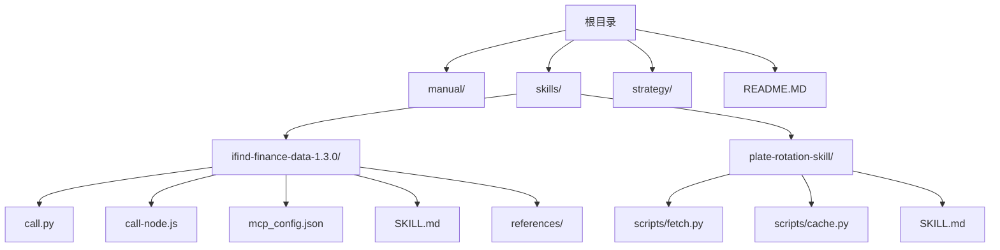
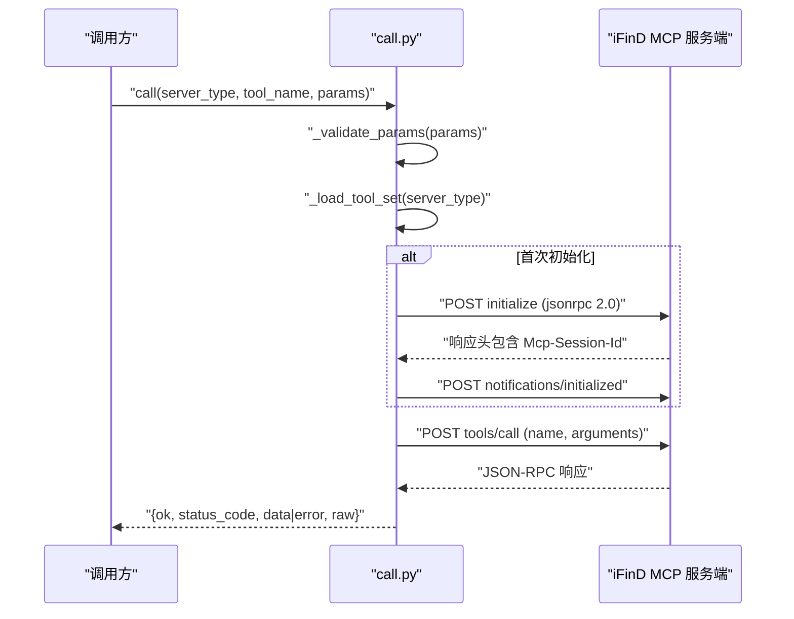
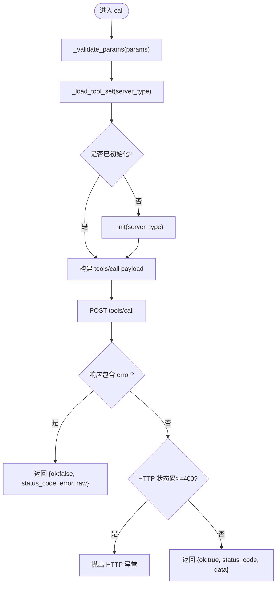
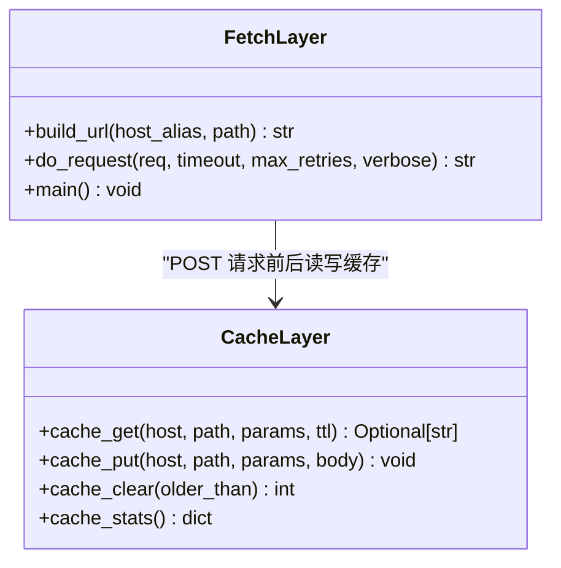
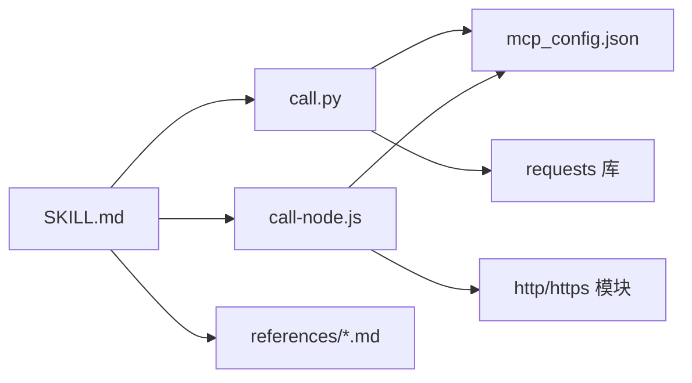

# 基础技能开发

<cite>
**本文引用的文件**
- [call.py](file://skills/ifind-finance-data-1.3.0/call.py)
- [mcp_config.json](file://skills/ifind-finance-data-1.3.0/mcp_config.json)
- [SKILL.md](file://skills/ifind-finance-data-1.3.0/SKILL.md)
- [call-node.js](file://skills/ifind-finance-data-1.3.0/call-node.js)
- [README.MD](file://README.MD)
- [cn_stock.md](file://skills/ifind-finance-data-1.3.0/references/cn_stock.md)
- [fetch.py](file://skills/plate-rotation-skill/scripts/fetch.py)
- [cache.py](file://skills/plate-rotation-skill/scripts/cache.py)
</cite>

## 目录
1. [简介](#简介)
2. [项目结构](#项目结构)
3. [核心组件](#核心组件)
4. [架构总览](#架构总览)
5. [详细组件分析](#详细组件分析)
6. [依赖关系分析](#依赖关系分析)
7. [性能与并发特性](#性能与并发特性)
8. [故障排查指南](#故障排查指南)
9. [结论](#结论)
10. [附录：从零搭建一个金融数据查询技能](#附录从零搭建一个金融数据查询技能)

## 简介
本教程面向初学者，带你从零开始创建一个“金融数据查询”的基础技能。你将学会：
- 如何组织技能目录与元数据（SKILL.md）
- 如何配置认证令牌（mcp_config.json）
- 如何通过 MCP 协议调用同花顺 iFinD 数据服务
- 如何在 Python 或 Node.js 中发起请求、处理错误、记录日志与调试
- 常见问题的定位方法与最佳实践

本项目已提供两个示例技能：
- ifind-finance-data：基于 MCP 协议的金融数据查询能力封装
- plate-rotation：A股板块轮动分析工具链（含缓存、重试等工程化细节）

## 项目结构
仓库采用“按功能域划分”的组织方式，核心目录如下：
- manual：投资手册与方法论沉淀
- skills：数据能力 Skill 集合
  - ifind-finance-data-1.3.0：iFinD 金融数据 MCP 客户端（Python/Node.js）
  - plate-rotation-skill：板块轮动分析脚本与参考文档
- strategy：交易策略方法论与量化执行版
- README.MD：项目概览与模块说明

图表来源
- [README.MD:1-81](file://README.MD#L1-L81)
- [SKILL.md:1-111](file://skills/ifind-finance-data-1.3.0/SKILL.md#L1-L111)

章节来源
- [README.MD:1-81](file://README.MD#L1-L81)

## 核心组件
- SKILL.md：技能的元数据与使用说明，定义名称、版本、描述、使用方法、注意事项、核心函数签名等
- mcp_config.json：存放认证令牌（auth_token），供 Python 和 Node.js 客户端共用
- call.py：Python 实现的 MCP 客户端，负责初始化会话、参数校验、工具列表获取、工具调用
- call-node.js：Node.js 实现的等价客户端，提供相同能力
- references/*：各子服务的接口参考文档（如股票、基金、指数、新闻公告等）
- fetch.py / cache.py：板块轮动技能中的网络层与本地缓存实现（可作为工程化参考）

章节来源
- [SKILL.md:1-111](file://skills/ifind-finance-data-1.3.0/SKILL.md#L1-L111)
- [mcp_config.json:1-3](file://skills/ifind-finance-data-1.3.0/mcp_config.json#L1-L3)
- [call.py:1-208](file://skills/ifind-finance-data-1.3.0/call.py#L1-L208)
- [call-node.js:1-267](file://skills/ifind-finance-data-1.3.0/call-node.js#L1-L267)
- [cn_stock.md:1-67](file://skills/ifind-finance-data-1.3.0/references/cn_stock.md#L1-L67)
- [fetch.py:1-200](file://skills/plate-rotation-skill/scripts/fetch.py#L1-L200)
- [cache.py:1-145](file://skills/plate-rotation-skill/scripts/cache.py#L1-L145)

## 架构总览
MCP 协议交互流程（以 Python 为例）：
- 客户端读取 mcp_config.json 中的 auth_token
- 首次调用前向服务端发送 initialize 请求，建立会话并保存 Mcp-Session-Id
- 通过 tools/list 获取当前用户可用的工具集
- 使用 tools/call 调用具体工具，携带 tool_name 与 arguments
- 返回统一的结果对象，包含 ok、status_code、data 或 error、raw

图表来源
- [call.py:85-116](file://skills/ifind-finance-data-1.3.0/call.py#L85-L116)
- [call.py:119-134](file://skills/ifind-finance-data-1.3.0/call.py#L119-L134)
- [call.py:137-171](file://skills/ifind-finance-data-1.3.0/call.py#L137-L171)
- [call.py:174-203](file://skills/ifind-finance-data-1.3.0/call.py#L174-L203)

## 详细组件分析

### 元数据与使用说明（SKILL.md）
- 定义技能名称、版本、作者、主页、描述
- 明确支持的数据范围（股票、基金、债券、指数、宏观、新闻、港美股）
- 给出使用方法（优先 Node.js，其次 Python）、并发上限提示、首次使用步骤
- 列出核心函数 call(server_type, tool_name, params) 的参数约定
- 提供 list_tools 的备用使用场景与顺序建议
- 指导根据问题类型加载 references 下的对应文档

章节来源
- [SKILL.md:1-111](file://skills/ifind-finance-data-1.3.0/SKILL.md#L1-L111)

### 配置文件（mcp_config.json）
- 仅包含 auth_token 字段，用于 HTTP 请求头 Authorization
- Python 与 Node.js 客户端均从同目录读取该文件
- 若缺失或无效，将导致鉴权失败

章节来源
- [mcp_config.json:1-3](file://skills/ifind-finance-data-1.3.0/mcp_config.json#L1-L3)
- [call.py:6-8](file://skills/ifind-finance-data-1.3.0/call.py#L6-L8)
- [call-node.js:6-7](file://skills/ifind-finance-data-1.3.0/call-node.js#L6-L7)

### Python 客户端（call.py）
- 配置加载：从同目录 mcp_config.json 读取 auth_token
- 服务端地址：BASE + SERVERS 映射（stock/fund/edb/news/bond/global_stock/index）
- 会话管理：_sessions 字典维护 server_type -> Mcp-Session-Id
- 请求头构造：_headers 注入 Content-Type、Accept、Authorization、Mcp-Session-Id
- 参数校验：_validate_params 递归检查类型、禁止危险键、拒绝非有限浮点数
- 初始化流程：_init 发送 initialize，解析响应头中的 Mcp-Session-Id，随后发送 initialized 通知
- 工具集缓存：_load_tool_set 拉取 tools/list 并缓存允许的工具名集合
- 调用流程：call 先校验参数与工具白名单，再发送 tools/call，统一包装结果
- 工具列表：list_tools 返回 tools/list 的原始响应

图表来源
- [call.py:59-83](file://skills/ifind-finance-data-1.3.0/call.py#L59-L83)
- [call.py:85-116](file://skills/ifind-finance-data-1.3.0/call.py#L85-L116)
- [call.py:119-134](file://skills/ifind-finance-data-1.3.0/call.py#L119-L134)
- [call.py:137-171](file://skills/ifind-finance-data-1.3.0/call.py#L137-L171)

章节来源
- [call.py:1-208](file://skills/ifind-finance-data-1.3.0/call.py#L1-L208)

### Node.js 客户端（call-node.js）
- 与 Python 端一致的能力：读取配置、初始化会话、工具列表、工具调用
- 使用原生 http/https 模块发起请求，Promise 封装 post
- validateParams 与 BLOCKED_KEYS 安全校验逻辑与 Python 端对齐
- loadToolSet/init/call/listTools 异步实现，错误路径更严格（HTTP 状态码直接抛错）

章节来源
- [call-node.js:1-267](file://skills/ifind-finance-data-1.3.0/call-node.js#L1-L267)

### 参考文档与接口示例（references/cn_stock.md）
- 列举 stock 服务常用工具及典型参数（如 search_stocks、get_stock_financials、stock_highfreq_quotes）
- 提供 Python 与 Node.js 调用示例，便于快速上手

章节来源
- [cn_stock.md:1-67](file://skills/ifind-finance-data-1.3.0/references/cn_stock.md#L1-L67)

### 工程化参考：网络层与缓存（plate-rotation-skill）
- fetch.py：统一的网络调用器，支持 GET/POST、KV 参数与 JSON 参数、User-Agent/Referer/Cookie 注入、指数退避重试、verbose 自检
- cache.py：本地磁盘缓存，TTL 控制、原子写入、统计与清理 CLI

图表来源
- [fetch.py:1-200](file://skills/plate-rotation-skill/scripts/fetch.py#L1-L200)
- [cache.py:1-145](file://skills/plate-rotation-skill/scripts/cache.py#L1-L145)

章节来源
- [fetch.py:1-200](file://skills/plate-rotation-skill/scripts/fetch.py#L1-L200)
- [cache.py:1-145](file://skills/plate-rotation-skill/scripts/cache.py#L1-L145)

## 依赖关系分析
- call.py 依赖 requests 库；call-node.js 使用 Node.js 内置 http/https 模块
- 两者都依赖同目录的 mcp_config.json 获取认证令牌
- SKILL.md 作为入口文档，指引加载 references 下对应子服务文档
- plate-rotation 的 fetch.py 与 cache.py 为独立工程化参考，不耦合于 iFinD 客户端

图表来源
- [SKILL.md:1-111](file://skills/ifind-finance-data-1.3.0/SKILL.md#L1-L111)
- [call.py:1-208](file://skills/ifind-finance-data-1.3.0/call.py#L1-L208)
- [call-node.js:1-267](file://skills/ifind-finance-data-1.3.0/call-node.js#L1-L267)
- [mcp_config.json:1-3](file://skills/ifind-finance-data-1.3.0/mcp_config.json#L1-L3)

章节来源
- [SKILL.md:1-111](file://skills/ifind-finance-data-1.3.0/SKILL.md#L1-L111)
- [call.py:1-208](file://skills/ifind-finance-data-1.3.0/call.py#L1-L208)
- [call-node.js:1-267](file://skills/ifind-finance-data-1.3.0/call-node.js#L1-L267)
- [mcp_config.json:1-3](file://skills/ifind-finance-data-1.3.0/mcp_config.json#L1-L3)

## 性能与并发特性
- 免费用户并发限制较低（默认每秒 2 个请求），个人与企业版更高；建议在应用层做限流与队列
- 工具集缓存：_tool_sets 避免重复 tools/list 调用
- 会话复用：_sessions 复用 Mcp-Session-Id，减少握手开销
- 超时控制：_post 默认 60s，initialize 30s，notifications 10s
- 可借鉴 plate-rotation 的重试与缓存机制，提升鲁棒性与吞吐

章节来源
- [SKILL.md:25-28](file://skills/ifind-finance-data-1.3.0/SKILL.md#L25-L28)
- [call.py:42-56](file://skills/ifind-finance-data-1.3.0/call.py#L42-L56)
- [call.py:85-116](file://skills/ifind-finance-data-1.3.0/call.py#L85-L116)
- [fetch.py:47-50](file://skills/plate-rotation-skill/scripts/fetch.py#L47-L50)
- [cache.py:17-27](file://skills/plate-rotation-skill/scripts/cache.py#L17-L27)

## 故障排查指南
- 认证失败
  - 检查 mcp_config.json 是否存在且包含有效 auth_token
  - 确认请求头 Authorization 是否正确传递
- 工具不存在或权限不足
  - 使用 list_tools 获取当前用户可用工具清单
  - 对比 references 文档与实际返回差异
- 参数校验报错
  - 确保 params 为 JSON 对象，不包含被禁止的键
  - 数值必须为有限数，不支持复杂类型
- 网络异常与超时
  - 检查 BASE 与 SERVERS 地址可达性
  - 适当调整 _post 的 timeout
- 中文乱码（Windows PowerShell）
  - 确保控制台编码为 UTF-8
- 日志与调试
  - 在调用处打印 request/response 摘要（URL、方法、状态码、首尾数据）
  - 对关键分支添加结构化日志（时间戳、server_type、tool_name、耗时）

章节来源
- [call.py:59-83](file://skills/ifind-finance-data-1.3.0/call.py#L59-L83)
- [call.py:137-171](file://skills/ifind-finance-data-1.3.0/call.py#L137-L171)
- [SKILL.md:90-96](file://skills/ifind-finance-data-1.3.0/SKILL.md#L90-L96)

## 结论
本教程基于现有代码库，系统梳理了“金融数据查询”技能的核心结构与实现要点。通过 SKILL.md 规范、mcp_config.json 配置、call.py/call-node.js 的 MCP 客户端实现，以及 references 接口文档，你可以快速搭建并扩展自己的数据能力。同时，结合 plate-rotation 的工程化经验（重试、缓存、CLI），能进一步提升稳定性与可维护性。

## 附录：从零搭建一个金融数据查询技能
以下以“创建最小可用的金融数据查询技能”为目标，给出端到端步骤与要点。为避免泄露敏感信息，本节不提供具体代码内容，仅提供路径与操作指引。

- 准备目录与元数据
  - 新建 skill 目录，放置 SKILL.md，填写 name/description/version/homepage/author 等元数据
  - 在 SKILL.md 中写明使用方法、数据范围、注意事项、核心函数签名与 list_tools 的使用顺序
  - 参考路径：[SKILL.md:1-111](file://skills/ifind-finance-data-1.3.0/SKILL.md#L1-L111)

- 配置认证令牌
  - 在同目录创建 mcp_config.json，写入 auth_token
  - 确保 Python 与 Node.js 客户端均可读取该文件
  - 参考路径：[mcp_config.json:1-3](file://skills/ifind-finance-data-1.3.0/mcp_config.json#L1-L3)

- 实现 MCP 客户端（Python）
  - 实现初始化流程：发送 initialize，解析响应头中的 Mcp-Session-Id，发送 initialized 通知
  - 实现工具列表获取与缓存：tools/list，缓存允许的工具名集合
  - 实现工具调用：tools/call，统一返回 {ok, status_code, data|error, raw}
  - 实现参数校验：禁止危险键、拒绝非有限浮点数、仅支持基本类型
  - 参考路径：[call.py:85-171](file://skills/ifind-finance-data-1.3.0/call.py#L85-L171)

- 实现 MCP 客户端（Node.js）
  - 使用 http/https 模块实现 POST 请求与 Promise 封装
  - 实现与 Python 端一致的初始化、工具列表、工具调用流程
  - 参考路径：[call-node.js:149-220](file://skills/ifind-finance-data-1.3.0/call-node.js#L149-L220)

- 编写接口参考文档
  - 针对每个 server_type 编写 references/*.md，列出工具名、功能说明、典型参数
  - 提供 Python 与 Node.js 调用示例
  - 参考路径：[cn_stock.md:1-67](file://skills/ifind-finance-data-1.3.0/references/cn_stock.md#L1-L67)

- 错误处理与日志
  - 在关键路径输出结构化日志（时间戳、server_type、tool_name、耗时、状态码）
  - 捕获并区分 HTTP 错误与业务错误（error 字段）
  - 参考路径：[call.py:137-171](file://skills/ifind-finance-data-1.3.0/call.py#L137-L171)

- 调试技巧
  - 启用 verbose 模式打印 URL、方法、请求体摘要与 Cookie（可参考 fetch.py 的做法）
  - 使用 list_tools 验证当前用户实际可用工具
  - 参考路径：[fetch.py:128-143](file://skills/plate-rotation-skill/scripts/fetch.py#L128-L143)

- 并发与限流
  - 在应用层实现令牌桶或滑动窗口限流，遵循官方并发上限
  - 参考路径：[SKILL.md:25-28](file://skills/ifind-finance-data-1.3.0/SKILL.md#L25-L28)

- 工程化增强（可选）
  - 引入本地缓存与重试机制，降低抖动与重复请求
  - 参考路径：[cache.py:1-145](file://skills/plate-rotation-skill/scripts/cache.py#L1-145)、[fetch.py:1-200](file://skills/plate-rotation-skill/scripts/fetch.py#L1-200)