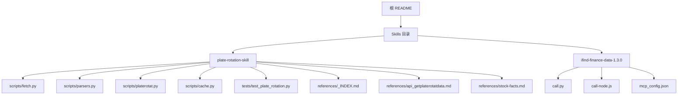
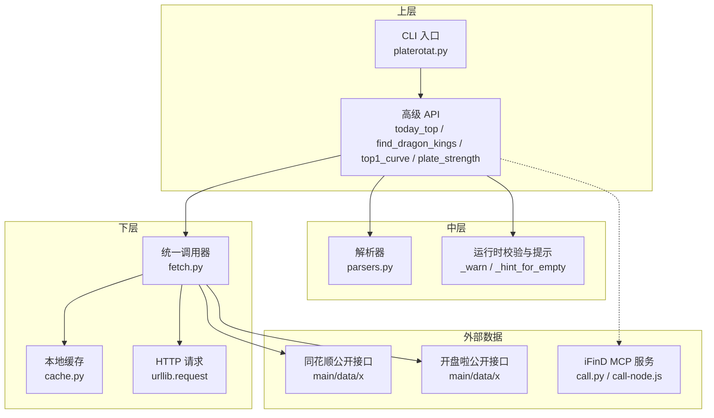
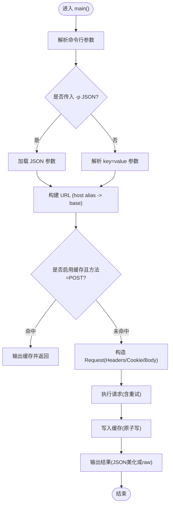
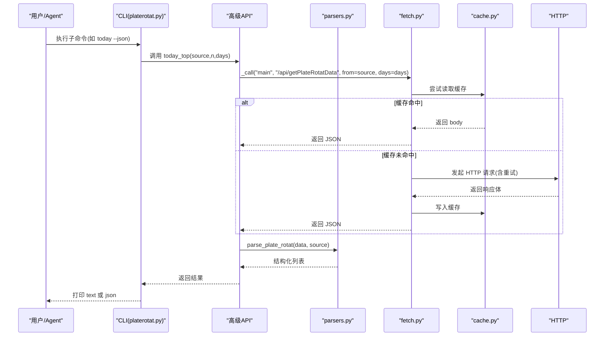
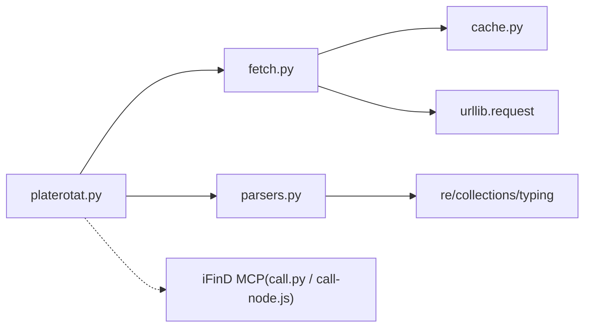

# 技能开发实战示例

<cite>
**本文引用的文件**   
- [README.MD](file://README.MD)
- [plate-rotation-skill/README.md](file://skills/plate-rotation-skill/README.md)
- [fetch.py](file://skills/plate-rotation-skill/scripts/fetch.py)
- [parsers.py](file://skills/plate-rotation-skill/scripts/parsers.py)
- [platerotat.py](file://skills/plate-rotation-skill/scripts/platerotat.py)
- [cache.py](file://skills/plate-rotation-skill/scripts/cache.py)
- [test_plate_rotation.py](file://skills/plate-rotation-skill/tests/test_plate_rotation.py)
- [_INDEX.md](file://skills/plate-rotation-skill/references/_INDEX.md)
- [api_getplaterotatdata.md](file://skills/plate-rotation-skill/references/api_getplaterotatdata.md)
- [stock-facts.md](file://skills/plate-rotation-skill/references/stock-facts.md)
- [ifind call.py](file://skills/ifind-finance-data-1.3.0/call.py)
- [ifind call-node.js](file://skills/ifind-finance-data-1.3.0/call-node.js)
- [ifind mcp_config.json](file://skills/ifind-finance-data-1.3.0/mcp_config.json)
</cite>

## 目录
1. [引言](#引言)
2. [项目结构](#项目结构)
3. [核心组件](#核心组件)
4. [架构总览](#架构总览)
5. [详细组件分析](#详细组件分析)
6. [依赖关系分析](#依赖关系分析)
7. [性能与优化](#性能与优化)
8. [故障排查指南](#故障排查指南)
9. [结论](#结论)
10. [附录：从零到一开发完整分析技能的步骤](#附录从零到一开发完整分析技能的步骤)

## 引言
本实战文档面向开发者，基于仓库中已有的“板块轮动”技能（plate-rotation）和“同花顺 iFinD MCP 数据能力”（ifind-finance-data），提供从零开始构建一个完整的分析技能的端到端教程。内容覆盖：
- 基础数据获取与封装
- 高级分析功能组合
- CLI 工具开发与使用
- 错误处理、日志记录、缓存管理
- 外部 API 集成与异步请求
- 性能优化策略
- 从需求分析到测试部署的完整工作流
- 单元测试与集成测试实践
- 常见场景模板与最佳实践

## 项目结构
本项目采用“Skill 模块化 + 策略文档化 + 手册沉淀”的组织方式。本次实战聚焦于 skills 下的两个 Skill：
- plate-rotation-skill：A 股板块轮动分析，双源交叉验证，CLI 友好
- ifind-finance-data：通过 MCP 协议对接同花顺 iFinD 金融数据服务

图表来源
- [README.MD:1-81](file://README.MD#L1-L81)
- [plate-rotation-skill/README.md:1-188](file://skills/plate-rotation-skill/README.md#L1-L188)

章节来源
- [README.MD:1-81](file://README.MD#L1-L81)
- [plate-rotation-skill/README.md:1-188](file://skills/plate-rotation-skill/README.md#L1-L188)

## 核心组件
- 统一网络调用层 fetch.py：封装 Cookie/Referer/UA、重试退避、POST 缓存、参数解析、URL 构建、输出美化等
- 解析器 parsers.py：将 HTML-in-JSON 响应解析为结构化列表/矩阵/日期序列/龙头统计等
- 高级 API platerotat.py：组合底层接口，暴露 today_top/find_dragon_kings/top1_curve/plate_strength 四个高层函数，并提供 CLI 子命令
- 本地缓存 cache.py：基于 SHA1 键、TTL 控制、原子写入、清理与统计
- 测试集 test_plate_rotation.py：在线集成测试，覆盖 endpoint 健康度、解析正确性、高级 helper 返回结构、自动路由、CLI 双模输出
- 参考文档 references/*：接口契约、领域事实、双源差异说明
- iFinD MCP 客户端 call.py / call-node.js：MCP 初始化、会话、工具枚举与调用；配置在 mcp_config.json

章节来源
- [fetch.py:1-230](file://skills/plate-rotation-skill/scripts/fetch.py#L1-L230)
- [parsers.py:1-212](file://skills/plate-rotation-skill/scripts/parsers.py#L1-L212)
- [platerotat.py:1-315](file://skills/plate-rotation-skill/scripts/platerotat.py#L1-L315)
- [cache.py:1-145](file://skills/plate-rotation-skill/scripts/cache.py#L1-L145)
- [test_plate_rotation.py:1-444](file://skills/plate-rotation-skill/tests/test_plate_rotation.py#L1-L444)
- [_INDEX.md:1-43](file://skills/plate-rotation-skill/references/_INDEX.md#L1-L43)
- [api_getplaterotatdata.md:1-74](file://skills/plate-rotation-skill/references/api_getplaterotatdata.md#L1-L74)
- [stock-facts.md:1-118](file://skills/plate-rotation-skill/references/stock-facts.md#L1-L118)
- [ifind call.py:1-208](file://skills/ifind-finance-data-1.3.0/call.py#L1-L208)
- [ifind call-node.js:1-267](file://skills/ifind-finance-data-1.3.0/call-node.js#L1-L267)
- [ifind mcp_config.json:1-3](file://skills/ifind-finance-data-1.3.0/mcp_config.json#L1-L3)

## 架构总览
整体分层清晰：上层是“意图级”API 与 CLI，中层是“解析与组合”，下层是“网络与缓存”。iFinD MCP 作为独立数据能力模块，可被上层策略或 Agent 直接调用。

图表来源
- [platerotat.py:1-315](file://skills/plate-rotation-skill/scripts/platerotat.py#L1-L315)
- [parsers.py:1-212](file://skills/plate-rotation-skill/scripts/parsers.py#L1-L212)
- [fetch.py:1-230](file://skills/plate-rotation-skill/scripts/fetch.py#L1-L230)
- [cache.py:1-145](file://skills/plate-rotation-skill/scripts/cache.py#L1-L145)
- [ifind call.py:1-208](file://skills/ifind-finance-data-1.3.0/call.py#L1-L208)
- [ifind call-node.js:1-267](file://skills/ifind-finance-data-1.3.0/call-node.js#L1-L267)

## 详细组件分析

### 统一网络调用器（fetch.py）
职责
- 统一 host alias 解析与 URL 拼接
- 支持 GET/POST，kv 参数与 JSON 参数两种姿势
- 注入 UA/Referer/Origin/X-Requested-With/Cookie
- 指数退避重试（429/5xx/网络异常）
- POST 请求默认落盘缓存（TTL 可配），支持禁用与调试模式
- 输出美化（JSON 格式化）或原始文本

关键流程

图表来源
- [fetch.py:128-213](file://skills/plate-rotation-skill/scripts/fetch.py#L128-L213)
- [cache.py:59-94](file://skills/plate-rotation-skill/scripts/cache.py#L59-L94)

章节来源
- [fetch.py:1-230](file://skills/plate-rotation-skill/scripts/fetch.py#L1-L230)
- [cache.py:1-145](file://skills/plate-rotation-skill/scripts/cache.py#L1-L145)

### 解析器（parsers.py）
职责
- 将“HTML in JSON”的响应解析为结构化数据
- 提供 Top N 板块清单、N×天矩阵、日期序列、龙头矩阵与持久性统计
- 兼容双源数值语义（ths 带 %，kaipan 纯整数）

典型数据结构
- 今日 Top N 板块：包含 rank/code/name/value/value_type/color
- 多日矩阵：每行包含 cells[date, code, name, value, color]
- 龙头矩阵：每日 heads[rank, code, name]，无领涨时为空
- 持久性统计：按股票统计上榜次数与位置序列

章节来源
- [parsers.py:1-212](file://skills/plate-rotation-skill/scripts/parsers.py#L1-L212)

### 高级 API 与 CLI（platerotat.py）
职责
- 组合 fetch+parsers，暴露“一个意图一个函数”的高级接口
- 内置运行时校验与 PR-EMPTY/PR-WARN 提示，帮助下游区分空数据原因
- 提供 CLI 子命令 today/wangking/curve/strength，支持 text/json 双模输出

高级函数
- today_top(source, n, days)：今日 Top N 板块
- find_dragon_kings(platecode, days, top_n)：板块妖王榜（跨天龙头统计）
- top1_curve(source, days)：Top5 板块 N 日排名变化曲线（ECharts 数据增强）
- plate_strength(platecode, days)：单板块强度+量能时序（ECharts 数据透传）

调用链示意

图表来源
- [platerotat.py:55-71](file://skills/plate-rotation-skill/scripts/platerotat.py#L55-L71)
- [platerotat.py:102-121](file://skills/plate-rotation-skill/scripts/platerotat.py#L102-L121)
- [parsers.py:20-65](file://skills/plate-rotation-skill/scripts/parsers.py#L20-L65)
- [fetch.py:128-213](file://skills/plate-rotation-skill/scripts/fetch.py#L128-L213)
- [cache.py:59-94](file://skills/plate-rotation-skill/scripts/cache.py#L59-L94)

章节来源
- [platerotat.py:1-315](file://skills/plate-rotation-skill/scripts/platerotat.py#L1-L315)

### 本地缓存（cache.py）
设计要点
- Key 由 host/path/sorted_params 经 SHA1 生成，保证参数顺序无关
- TTL 默认 3600s，可通过环境变量 PR_CACHE_TTL 调整
- 全局开关 PR_CACHE_DISABLE=1 可关闭缓存
- 原子写入（先写 .tmp 再 replace），避免半写文件
- 提供 stats/clear 诊断与清理

章节来源
- [cache.py:1-145](file://skills/plate-rotation-skill/scripts/cache.py#L1-L145)

### 测试套件（test_plate_rotation.py）
覆盖范围
- 底层 endpoint 健康度（4 个接口）
- 解析器正确性（双源数值语义、日期格式、矩阵对齐、龙头结构）
- 高级 helper 返回结构与签名约束
- 自动路由（88x→ths，80x/803x→kaipan）
- CLI 子命令 text/json 双模输出与错误路径

运行方式
- 直接执行脚本或使用 unittest 框架

章节来源
- [test_plate_rotation.py:1-444](file://skills/plate-rotation-skill/tests/test_plate_rotation.py#L1-L444)

### iFinD MCP 客户端（call.py / call-node.js）
职责
- 通过 MCP 协议与同花顺 iFinD 数据服务交互
- 维护会话（initialize + notifications/initialized）
- 动态加载工具集（tools/list），限制允许的工具名
- 安全校验输入参数（禁止危险字段、非法数字类型）
- 提供 call 与 list_tools 两个对外方法

Python 与 Node 实现对比
- Python 使用 requests，Node 使用 http/https
- 两者均实现参数校验、会话管理、工具白名单检查
- 配置集中管理于 mcp_config.json（auth_token）

章节来源
- [ifind call.py:1-208](file://skills/ifind-finance-data-1.3.0/call.py#L1-L208)
- [ifind call-node.js:1-267](file://skills/ifind-finance-data-1.3.0/call-node.js#L1-L267)
- [ifind mcp_config.json:1-3](file://skills/ifind-finance-data-1.3.0/mcp_config.json#L1-L3)

## 依赖关系分析
- 模块内依赖
  - platerotat.py 依赖 fetch.py（subprocess 调用）与 parsers.py（解析函数）
  - fetch.py 依赖 cache.py（读写缓存）与 urllib.request（网络）
  - parsers.py 仅依赖 stdlib（re/collections/typing）
- 外部依赖
  - plate-rotation 依赖两个公开行情接口（同花顺/开盘啦），后端只校验 Referer
  - iFinD MCP 依赖远程服务端，需有效 auth_token

图表来源
- [platerotat.py:1-315](file://skills/plate-rotation-skill/scripts/platerotat.py#L1-L315)
- [fetch.py:1-230](file://skills/plate-rotation-skill/scripts/fetch.py#L1-L230)
- [parsers.py:1-212](file://skills/plate-rotation-skill/scripts/parsers.py#L1-L212)
- [cache.py:1-145](file://skills/plate-rotation-skill/scripts/cache.py#L1-L145)
- [ifind call.py:1-208](file://skills/ifind-finance-data-1.3.0/call.py#L1-L208)
- [ifind call-node.js:1-267](file://skills/ifind-finance-data-1.3.0/call-node.js#L1-L267)

章节来源
- [platerotat.py:1-315](file://skills/plate-rotation-skill/scripts/platerotat.py#L1-L315)
- [fetch.py:1-230](file://skills/plate-rotation-skill/scripts/fetch.py#L1-L230)
- [parsers.py:1-212](file://skills/plate-rotation-skill/scripts/parsers.py#L1-L212)
- [cache.py:1-145](file://skills/plate-rotation-skill/scripts/cache.py#L1-L145)
- [ifind call.py:1-208](file://skills/ifind-finance-data-1.3.0/call.py#L1-L208)
- [ifind call-node.js:1-267](file://skills/ifind-finance-data-1.3.0/call-node.js#L1-L267)

## 性能与优化
- 缓存命中率
  - 默认 TTL 1 小时，适合盘中高频重复查询；需要分钟级实时可用 --no-cache 或 --cache-ttl 60
  - 通过 cache_stats 监控缓存规模与大小
- 重试与退避
  - 指数退避应对 429/5xx 与网络抖动，降低瞬时失败率
- 解析效率
  - 正则匹配针对已知 HTML 模板，避免过度回溯；必要时可预编译正则
- 并发与异步
  - 当前为同步阻塞模型；如需高并发，可在上层引入 asyncio + aiohttp，或在 platerotat.py 中使用线程池并行多个 _call
- 资源释放
  - 确保 subprocess 调用捕获 stdout/stderr，避免管道阻塞
  - 大响应体建议以流式处理或分块写入磁盘

[本节为通用指导，不直接分析具体文件]

## 故障排查指南
常见问题与定位
- 空数据（PR-EMPTY）
  - 周末/节假日导致上游返回上一交易日快照
  - 板块代码前缀与 source 不匹配（88x 应走 ths，80x/803x 应走 kaipan）
  - 上游接口临时异常或参数 days 超前
- 非 JSON 响应
  - fetch.py 会输出 raw 文本片段便于定位；检查 --verbose 输出 URL/body/cookie
- 缓存问题
  - 使用 cache.py stats 查看状态；clear 清理过期或全部缓存
- iFinD MCP 调用失败
  - 确认 auth_token 有效；检查 initialize 是否返回 Mcp-Session-Id；确认 toolName 在白名单

章节来源
- [platerotat.py:75-98](file://skills/plate-rotation-skill/scripts/platerotat.py#L75-L98)
- [fetch.py:91-124](file://skills/plate-rotation-skill/scripts/fetch.py#L91-L124)
- [cache.py:119-128](file://skills/plate-rotation-skill/scripts/cache.py#L119-L128)
- [ifind call.py:85-116](file://skills/ifind-finance-data-1.3.0/call.py#L85-L116)
- [stock-facts.md:1-118](file://skills/plate-rotation-skill/references/stock-facts.md#L1-L118)

## 结论
本实战文档基于现有代码库，系统梳理了“板块轮动”技能的网络层、解析层、高级 API 与 CLI 的实现细节，并结合 iFinD MCP 客户端展示了外部数据服务的集成范式。通过完善的测试套件与参考文档，该 Skill 具备良好的健壮性与可维护性。读者可据此快速扩展新的数据源、新增分析维度，并复用统一的网络与缓存基础设施。

[本节为总结，不直接分析具体文件]

## 附录：从零到一开发完整分析技能的步骤

### 1. 需求分析与边界定义
- 明确目标：例如“识别资金主线与妖板形态”
- 确定数据源：公开接口（同花顺/开盘啦）或 MCP 服务（iFinD）
- 定义输出：Top N 榜单、龙头统计、趋势曲线、强度时序

章节来源
- [plate-rotation-skill/README.md:70-98](file://skills/plate-rotation-skill/README.md#L70-L98)
- [_INDEX.md:1-43](file://skills/plate-rotation-skill/references/_INDEX.md#L1-L43)

### 2. 搭建 Skill 骨架
- 创建 scripts/ 目录，放置 fetch.py、parsers.py、platerotat.py、cache.py
- 创建 tests/ 目录，放置集成测试用例
- 创建 references/ 目录，记录接口契约与领域知识

章节来源
- [README.MD:1-81](file://README.MD#L1-L81)

### 3. 实现统一网络调用层（fetch.py）
- 实现 host alias 解析、参数解析、Header 注入、重试退避、缓存读写、输出美化
- 提供 --verbose 自检能力，便于调试

章节来源
- [fetch.py:1-230](file://skills/plate-rotation-skill/scripts/fetch.py#L1-L230)
- [cache.py:1-145](file://skills/plate-rotation-skill/scripts/cache.py#L1-L145)

### 4. 编写解析器（parsers.py）
- 根据接口返回的 HTML 模板，编写稳健的正则解析
- 抽象出常用结构：Top N、矩阵、日期序列、龙头统计
- 注意双源数值语义差异与边界情况（当日无领涨、未上榜占位）

章节来源
- [parsers.py:1-212](file://skills/plate-rotation-skill/scripts/parsers.py#L1-L212)
- [stock-facts.md:1-118](file://skills/plate-rotation-skill/references/stock-facts.md#L1-L118)

### 5. 组合高级 API 与 CLI（platerotat.py）
- 封装 _call 子进程调用 fetch.py，统一错误处理与 JSON 解析
- 实现高级函数：today_top/find_dragon_kings/top1_curve/plate_strength
- 添加运行时校验与 PR-EMPTY/PR-WARN 提示
- 提供 CLI 子命令，支持 text/json 双模输出

章节来源
- [platerotat.py:1-315](file://skills/plate-rotation-skill/scripts/platerotat.py#L1-L315)

### 6. 编写测试套件（tests/test_plate_rotation.py）
- 覆盖 endpoint 健康度、解析正确性、高级 helper 返回结构、自动路由、CLI 双模
- 使用共享 fixture 减少重复网络请求
- 断言关键结构（value_type、日期格式、龙头 rank 集合等）

章节来源
- [test_plate_rotation.py:1-444](file://skills/plate-rotation-skill/tests/test_plate_rotation.py#L1-L444)

### 7. 集成外部 API（iFinD MCP）
- 使用 call.py 或 call-node.js 进行 MCP 初始化与会话管理
- 动态加载工具集，限制允许的工具名
- 严格校验输入参数，防止注入与非法类型

章节来源
- [ifind call.py:1-208](file://skills/ifind-finance-data-1.3.0/call.py#L1-L208)
- [ifind call-node.js:1-267](file://skills/ifind-finance-data-1.3.0/call-node.js#L1-L267)
- [ifind mcp_config.json:1-3](file://skills/ifind-finance-data-1.3.0/mcp_config.json#L1-L3)

### 8. 错误处理与日志记录
- 统一警告通道（stderr）输出 PR-EMPTY/PR-WARN，便于下游识别
- 对网络异常、超时、非 JSON 响应进行明确报错
- 保留 --verbose 输出 URL/body/cookie 片段用于排障

章节来源
- [platerotat.py:75-98](file://skills/plate-rotation-skill/scripts/platerotat.py#L75-L98)
- [fetch.py:91-124](file://skills/plate-rotation-skill/scripts/fetch.py#L91-L124)

### 9. 缓存管理与性能优化
- 合理设置 TTL，平衡新鲜度与命中率
- 使用 cache_stats 监控缓存规模，定期清理
- 在高并发场景下考虑异步与连接池

章节来源
- [cache.py:1-145](file://skills/plate-rotation-skill/scripts/cache.py#L1-L145)

### 10. 单元测试与集成测试
- 单元测试：针对解析器与辅助函数，使用 mock 数据
- 集成测试：在线调用真实接口，验证结构与边界行为
- 持续集成：在 CI 中运行测试，确保回归稳定

章节来源
- [test_plate_rotation.py:1-444](file://skills/plate-rotation-skill/tests/test_plate_rotation.py#L1-L444)

### 11. 部署与发布
- 打包 Skill 目录，附带 README 与 references
- 提供安装指引（npx skills add 或 git clone）
- 提供一键验证命令（python3 scripts/platerotat.py today --n 3）

章节来源
- [plate-rotation-skill/README.md:38-66](file://skills/plate-rotation-skill/README.md#L38-L66)

### 12. 常见场景模板与最佳实践
- 新增接口：在 references/ 补充 api_xxx.md，并在 tests/ 增加在线用例
- 新数据源：复用 fetch.py 的 host alias 与重试/缓存机制
- 新分析维度：在 parsers.py 新增解析函数，在 platerotat.py 暴露高级 API
- 领域知识：沉淀到 stock-facts.md，避免下游误用

章节来源
- [_INDEX.md:1-43](file://skills/plate-rotation-skill/references/_INDEX.md#L1-L43)
- [stock-facts.md:1-118](file://skills/plate-rotation-skill/references/stock-facts.md#L1-L118)