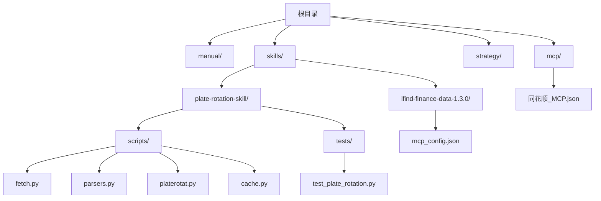
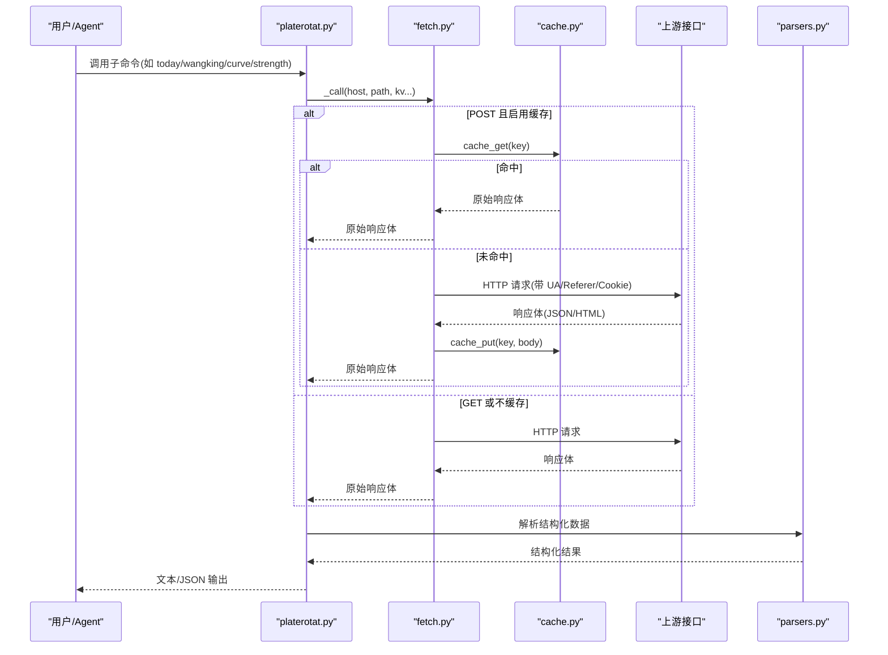
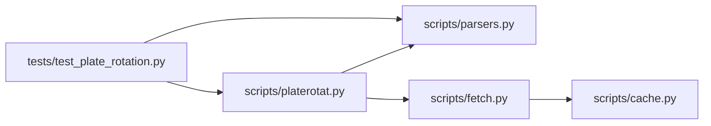

# 测试与部署

<cite>
**本文引用的文件**   
- [README.MD](file://README.MD)
- [test_plate_rotation.py](file://skills/plate-rotation-skill/tests/test_plate_rotation.py)
- [fetch.py](file://skills/plate-rotation-skill/scripts/fetch.py)
- [parsers.py](file://skills/plate-rotation-skill/scripts/parsers.py)
- [platerotat.py](file://skills/plate-rotation-skill/scripts/platerotat.py)
- [cache.py](file://skills/plate-rotation-skill/scripts/cache.py)
- [同花顺_MCP.json](file://mcp/同花顺_MCP.json)
- [mcp_config.json](file://skills/ifind-finance-data-1.3.0/mcp_config.json)
</cite>

## 目录
1. [简介](#简介)
2. [项目结构](#项目结构)
3. [核心组件](#核心组件)
4. [架构总览](#架构总览)
5. [详细组件分析](#详细组件分析)
6. [依赖关系分析](#依赖关系分析)
7. [性能考量](#性能考量)
8. [故障排查指南](#故障排查指南)
9. [结论](#结论)
10. [附录](#附录)

## 简介
本文件围绕“测试与部署”目标，结合仓库现有代码与配置，给出：
- 单元测试编写方法（含外部依赖 mock、断言策略、覆盖率统计）
- 集成测试设计思路（端到端场景、异常处理）
- 部署配置最佳实践（环境隔离、依赖管理、版本控制）
- CI/CD 流水线配置方法与自动化测试执行策略

本项目为基于 AI Agent 驱动的股票分析与交易策略管理系统，数据能力通过 Skills 提供，其中“板块轮动 Skill”具备完善的在线集成测试与 CLI 工具链，可作为测试与部署实践的参考。

## 项目结构
仓库采用按功能域组织的方式：
- manual：投资手册与体系总纲
- skills：数据能力插件（如 ifind-finance-data、plate-rotation-skill）
- strategy：交易策略文档
- mcp：MCP 服务连接配置

图表来源
- [README.MD:1-83](file://README.MD#L1-L83)
- [test_plate_rotation.py:1-444](file://skills/plate-rotation-skill/tests/test_plate_rotation.py#L1-L444)
- [fetch.py:1-230](file://skills/plate-rotation-skill/scripts/fetch.py#L1-L230)
- [parsers.py:1-212](file://skills/plate-rotation-skill/scripts/parsers.py#L1-L212)
- [platerotat.py:1-315](file://skills/plate-rotation-skill/scripts/platerotat.py#L1-L315)
- [cache.py:1-145](file://skills/plate-rotation-skill/scripts/cache.py#L1-L145)
- [同花顺_MCP.json:1-53](file://mcp/同花顺_MCP.json#L1-L53)
- [mcp_config.json:1-3](file://skills/ifind-finance-data-1.3.0/mcp_config.json#L1-L3)

章节来源
- [README.MD:1-83](file://README.MD#L1-L83)

## 核心组件
- 网络调用层 fetch.py：统一封装 HTTP 请求、重试、缓存、Cookie/Referer 注入，支持 GET/POST 与参数拼接。
- 解析层 parsers.py：将“HTML 片段嵌在 JSON 的 html 字段里”的响应解析为结构化数据（Top 列表、矩阵、日期序列、龙头股等）。
- 高级 API 与 CLI platerotat.py：组合底层接口，暴露 today_top/find_dragon_kings/top1_curve/plate_strength 四个意图函数，并提供 CLI 子命令。
- 本地缓存 cache.py：基于 TTL 的磁盘缓存，支持环境变量开关与清理/统计。
- 集成测试 test_plate_rotation.py：覆盖 endpoint 健康度、解析正确性、高级 helper 返回结构、自动路由、CLI 双模输出与错误路径。

章节来源
- [fetch.py:1-230](file://skills/plate-rotation-skill/scripts/fetch.py#L1-L230)
- [parsers.py:1-212](file://skills/plate-rotation-skill/scripts/parsers.py#L1-L212)
- [platerotat.py:1-315](file://skills/plate-rotation-skill/scripts/platerotat.py#L1-L315)
- [cache.py:1-145](file://skills/plate-rotation-skill/scripts/cache.py#L1-L145)
- [test_plate_rotation.py:1-444](file://skills/plate-rotation-skill/tests/test_plate_rotation.py#L1-L444)

## 架构总览
板块轮动 Skill 的数据流从 CLI 或 Python 导入开始，经 platerotat.py 组合逻辑，调用 fetch.py 发起网络请求，必要时命中 cache.py 的本地缓存，最终由 parsers.py 解析 HTML-in-JSON 得到结构化结果。

图表来源
- [platerotat.py:55-71](file://skills/plate-rotation-skill/scripts/platerotat.py#L55-L71)
- [fetch.py:128-213](file://skills/plate-rotation-skill/scripts/fetch.py#L128-L213)
- [cache.py:59-94](file://skills/plate-rotation-skill/scripts/cache.py#L59-L94)
- [parsers.py:20-102](file://skills/plate-rotation-skill/scripts/parsers.py#L20-L102)

## 详细组件分析

### 单元测试编写方法（以板块轮动 Skill 为例）
- 测试框架与入口
  - 使用标准库 unittest，测试类位于 tests/test_plate_rotation.py，可直接运行或通过 python -m unittest 执行。
- 外部依赖 Mock 策略
  - 当前测试采用“在线集成测试”，通过 subprocess 调用 scripts/fetch.py --raw 拉取真实接口数据，并在测试进程内缓存复用，避免重复打网。
  - 若需离线/稳定化测试，可替换 fetch.py 为本地桩实现（例如读取 fixtures 或内存字典），或使用环境变量 PR_CACHE_DISABLE=1 配合本地缓存文件模拟命中/未命中分支。
- 断言验证要点
  - 结构断言：确保返回 dict/list 包含必要键（如 date、legend、kings、daily_heads 等）。
  - 语义断言：ths 源 value_type=pct 且 value 以 % 结尾；kaipan 源 value_type=score 且为纯数字。
  - 排序与约束：rank 升序、top_n 限制生效、dates 去重且 newest-first。
  - 自动路由：88x→ths、80x/803x→kaipan 的路由行为必须满足预期。
- 覆盖率统计
  - 使用 coverage 对测试集进行统计，建议开启分支与行级覆盖，并生成 HTML 报告。
  - 针对关键路径（_call、do_request、parse_plate_rotat、find_dragon_kings 等）应达到较高覆盖率。
- 参考用例路径
  - 端点健康度：[test_01_getplaterotatdata_ths:78-84](file://skills/plate-rotation-skill/tests/test_plate_rotation.py#L78-L84)
  - 解析正确性：[test_parse_plate_rotat_ths_value_has_pct:125-143](file://skills/plate-rotation-skill/tests/test_plate_rotation.py#L125-L143)
  - 高级 helper：[test_today_top_ths_with_pct:259-265](file://skills/plate-rotation-skill/tests/test_plate_rotation.py#L259-L265)
  - 自动路由：[test_88x_routes_to_ths:312-316](file://skills/plate-rotation-skill/tests/test_plate_rotation.py#L312-L316)
  - CLI 双模与错误路径：[test_cli_today_json_ths_pct:365-371](file://skills/plate-rotation-skill/tests/test_plate_rotation.py#L365-L371)、[test_cli_no_subcommand_exits_nonzero:425-431](file://skills/plate-rotation-skill/tests/test_plate_rotation.py#L425-L431)

章节来源
- [test_plate_rotation.py:1-444](file://skills/plate-rotation-skill/tests/test_plate_rotation.py#L1-L444)

### 集成测试设计思路（端到端与异常处理）
- 端到端场景
  - 通过 CLI 子命令 today/wangking/curve/strength 触发完整链路，校验 text/json 两种输出格式与关键字段。
  - 覆盖不同 source（ths/kaipan）、不同 platecode 前缀（88x/80x/803x）与 days 参数组合。
- 异常处理测试
  - 无子命令时 argparse 应报错退出。
  - 非法 --source 值应被拒绝。
  - 网络超时/非 JSON 响应/空响应等边界情况可通过环境变量与缓存开关构造（PR_CACHE_DISABLE=1、--no-cache、--timeout 等）。
- 参考用例路径
  - CLI 错误路径：[test_cli_bad_source_rejected:433-439](file://skills/plate-rotation-skill/tests/test_plate_rotation.py#L433-L439)
  - 空数据提示：见 platerotat.py 中的运行时警告通道（PR-EMPTY/PR-WARN）

章节来源
- [test_plate_rotation.py:330-440](file://skills/plate-rotation-skill/tests/test_plate_rotation.py#L330-L440)
- [platerotat.py:75-98](file://skills/plate-rotation-skill/scripts/platerotat.py#L75-L98)

### 部署配置最佳实践（环境隔离、依赖管理、版本控制）
- 环境隔离
  - 使用环境变量区分配置：
    - PR_COOKIE：Cookie 字符串（优先于本地文件）
    - PR_CACHE_DISABLE：关闭缓存
    - PR_CACHE_TTL：缓存新鲜度阈值（秒）
    - PR_CACHE_DIR：缓存根目录
  - 通过环境变量切换 host alias（main/data/x/ext）与完整 URL（ext）。
- 依赖管理
  - 脚本仅依赖 Python 标准库（urllib、argparse、json、os、sys、re、subprocess、pathlib、hashlib、time），无需第三方包。
  - 如需引入第三方库（如 requests、httpx），建议在虚拟环境中安装并通过 requirements.txt/pyproject.toml 管理。
- 版本控制
  - 敏感信息（Authorization、Cookie）不应直接提交到仓库，建议使用环境变量或密钥管理服务注入。
  - MCP 配置文件示例中包含 Authorization，建议在生产环境通过安全方式注入。
- 参考路径
  - Cookie 加载与环境变量优先级：[load_cookie:54-64](file://skills/plate-rotation-skill/scripts/fetch.py#L54-L64)
  - 缓存开关与 TTL：[cache_disabled:41-43](file://skills/plate-rotation-skill/scripts/cache.py#L41-L43)、[DEFAULT_TTL](file://skills/plate-rotation-skill/scripts/cache.py#L37)
  - Host 别名与 URL 构建：[build_url:68-76](file://skills/plate-rotation-skill/scripts/fetch.py#L68-L76)
  - MCP 配置示例：[同花顺_MCP.json:1-53](file://mcp/同花顺_MCP.json#L1-L53)、[mcp_config.json:1-3](file://skills/ifind-finance-data-1.3.0/mcp_config.json#L1-L3)

章节来源
- [fetch.py:54-76](file://skills/plate-rotation-skill/scripts/fetch.py#L54-L76)
- [cache.py:35-43](file://skills/plate-rotation-skill/scripts/cache.py#L35-L43)
- [同花顺_MCP.json:1-53](file://mcp/同花顺_MCP.json#L1-L53)
- [mcp_config.json:1-3](file://skills/ifind-finance-data-1.3.0/mcp_config.json#L1-L3)

### CI/CD 流水线配置方法与自动化测试执行策略
- 流水线阶段建议
  - 准备：设置 Python 环境、安装依赖（如有）、准备环境变量（PR_COOKIE、PR_CACHE_DISABLE 等）。
  - 静态检查：语法/风格检查（可选）。
  - 单元测试：运行 unittest 测试集，生成覆盖率报告。
  - 集成测试：在受控网络环境下执行端到端测试（可分慢速用例与快速用例）。
  - 发布：打包产物、上传制品、更新版本标签。
- 自动化测试执行策略
  - 快速用例：仅运行不依赖网络的解析与 CLI 参数校验用例。
  - 慢速用例：需要网络访问的端点健康度与解析正确性用例，可配置重试与超时。
  - 失败告警：当 PR-EMPTY/PR-WARN 出现时，记录日志并标记风险等级。
- 覆盖率统计
  - 使用 coverage run -m unittest 执行测试，coverage report/html 生成报告。
  - 设定最低覆盖率阈值，未达标则流水线失败。
- 参考路径
  - 测试入口与命令行用法：[test_plate_rotation.py 头部注释:13-18](file://skills/plate-rotation-skill/tests/test_plate_rotation.py#L13-L18)
  - CLI 子命令定义与参数校验：[platerotat.py main:278-310](file://skills/plate-rotation-skill/scripts/platerotat.py#L278-L310)

章节来源
- [test_plate_rotation.py:13-18](file://skills/plate-rotation-skill/tests/test_plate_rotation.py#L13-L18)
- [platerotat.py:278-310](file://skills/plate-rotation-skill/scripts/platerotat.py#L278-L310)

## 依赖关系分析
模块间依赖清晰，遵循“上层组合、下层原子”的分层原则：
- platerotat.py 依赖 fetch.py 与 parsers.py
- fetch.py 依赖 cache.py
- 测试用例依赖 platerotat.py 与 parsers.py，并通过 subprocess 调用 fetch.py

图表来源
- [test_plate_rotation.py:1-444](file://skills/plate-rotation-skill/tests/test_plate_rotation.py#L1-L444)
- [platerotat.py:1-315](file://skills/plate-rotation-skill/scripts/platerotat.py#L1-L315)
- [fetch.py:1-230](file://skills/plate-rotation-skill/scripts/fetch.py#L1-L230)
- [parsers.py:1-212](file://skills/plate-rotation-skill/scripts/parsers.py#L1-L212)
- [cache.py:1-145](file://skills/plate-rotation-skill/scripts/cache.py#L1-L145)

章节来源
- [platerotat.py:34-48](file://skills/plate-rotation-skill/scripts/platerotat.py#L34-L48)
- [fetch.py:31-36](file://skills/plate-rotation-skill/scripts/fetch.py#L31-L36)

## 性能考量
- 网络重试与退避
  - fetch.py 对 429/5xx 及网络异常进行指数退避重试，降低瞬时抖动影响。
- 本地缓存
  - cache.py 默认 TTL=3600s，减少重复请求；可通过 PR_CACHE_DISABLE 或 --no-cache 关闭。
- 解析效率
  - parsers.py 使用正则表达式抽取 HTML 片段，注意正则复杂度与输入规模；对大数据量可考虑预编译与增量解析。
- 超时与资源释放
  - fetch.py 支持 --timeout 参数，避免长时间阻塞；测试中通过 subprocess timeout 控制整体耗时。

章节来源
- [fetch.py:47-50](file://skills/plate-rotation-skill/scripts/fetch.py#L47-L50)
- [cache.py:35-37](file://skills/plate-rotation-skill/scripts/cache.py#L35-L37)
- [parsers.py:43-53](file://skills/plate-rotation-skill/scripts/parsers.py#L43-L53)

## 故障排查指南
- 常见问题定位
  - 空数据提示：platerotat.py 在解析后做 sanity check，输出 PR-EMPTY/PR-WARN 帮助判断节假日、跨源错传或上游异常。
  - 网络错误：fetch.py 的 do_request 会打印详细错误信息并退出码非零，便于定位。
  - 缓存问题：使用 cache.py 的 stats/clear 诊断缓存状态与清理过期文件。
- 调试技巧
  - 使用 fetch.py 的 --verbose 打印 URL/body/cookie 自检信息。
  - 使用 --raw 输出原始响应体，便于比对解析结果。
  - 通过 PR_CACHE_DISABLE=1 强制走网络，排除缓存干扰。
- 参考路径
  - 运行时警告通道：[_warn/_hint_for_empty:75-98](file://skills/plate-rotation-skill/scripts/platerotat.py#L75-L98)
  - 网络重试与错误抛出：[do_request:91-124](file://skills/plate-rotation-skill/scripts/fetch.py#L91-L124)
  - 缓存诊断 CLI：[cache.py __main__:132-144](file://skills/plate-rotation-skill/scripts/cache.py#L132-L144)

章节来源
- [platerotat.py:75-98](file://skills/plate-rotation-skill/scripts/platerotat.py#L75-L98)
- [fetch.py:91-124](file://skills/plate-rotation-skill/scripts/fetch.py#L91-L124)
- [cache.py:132-144](file://skills/plate-rotation-skill/scripts/cache.py#L132-L144)

## 结论
本项目在“板块轮动 Skill”中提供了完整的测试与部署实践基础：
- 测试方面：在线集成测试覆盖端点健康、解析正确性、高级 helper 与 CLI 双模输出，并包含错误路径与自动路由验证；可通过环境变量与缓存机制扩展离线与稳定性测试。
- 部署方面：脚本仅依赖标准库，易于移植；通过环境变量实现环境隔离与敏感信息注入；MCP 配置示例展示了外部服务接入方式。
- CI/CD 方面：建议分层执行快速与慢速用例，结合覆盖率阈值与失败告警，形成稳定的自动化质量门禁。

## 附录
- 常用命令参考
  - 运行测试：python3 tests/test_plate_rotation.py 或 python3 -m unittest tests.test_plate_rotation -v
  - 查看缓存统计：python3 scripts/cache.py stats
  - 清理缓存：python3 scripts/cache.py clear [--older SEC]
  - CLI 子命令：platerotat.py today/wangking/curve/strength [--json]

章节来源
- [test_plate_rotation.py:13-18](file://skills/plate-rotation-skill/tests/test_plate_rotation.py#L13-L18)
- [cache.py:132-144](file://skills/plate-rotation-skill/scripts/cache.py#L132-L144)
- [platerotat.py:278-310](file://skills/plate-rotation-skill/scripts/platerotat.py#L278-L310)