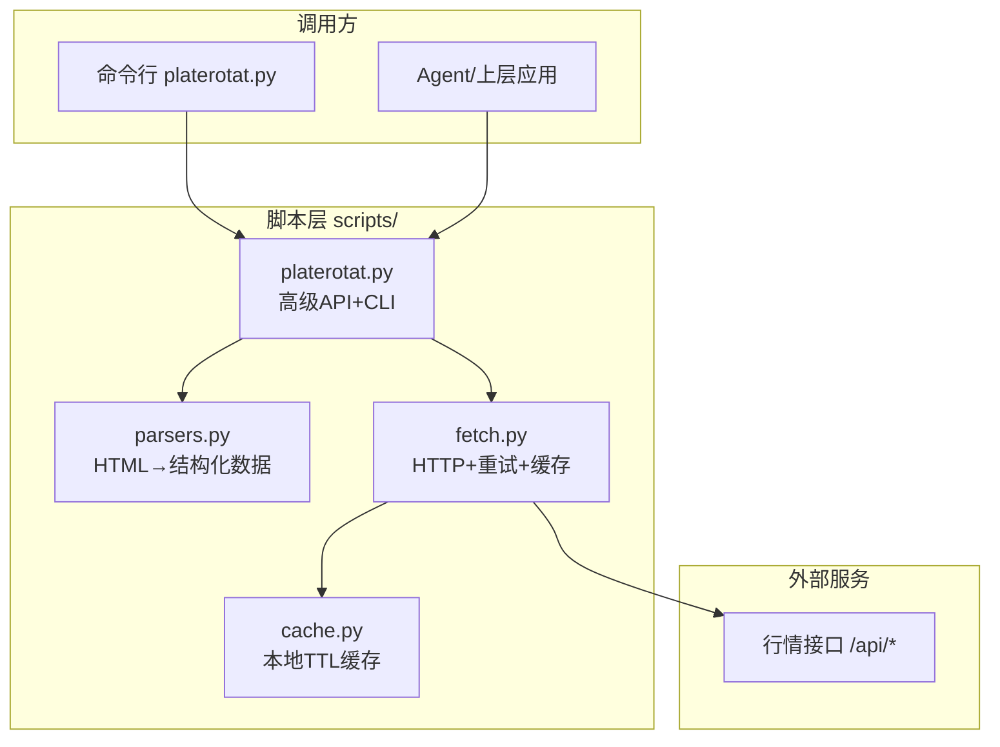
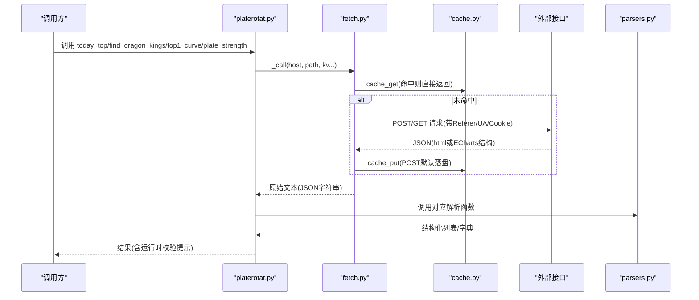
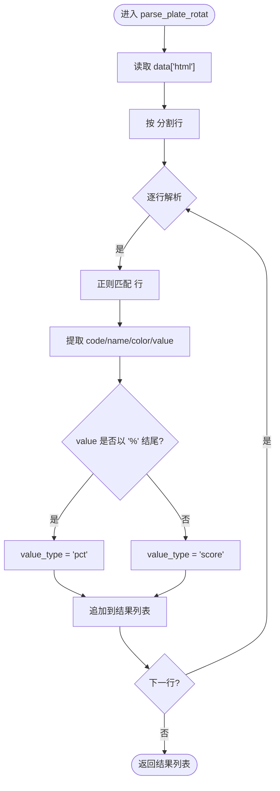
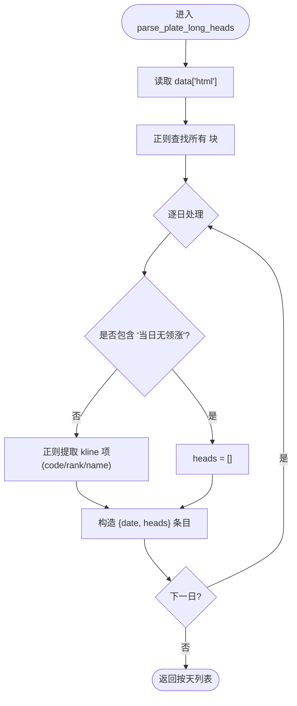
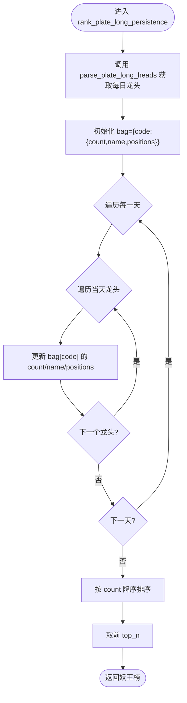
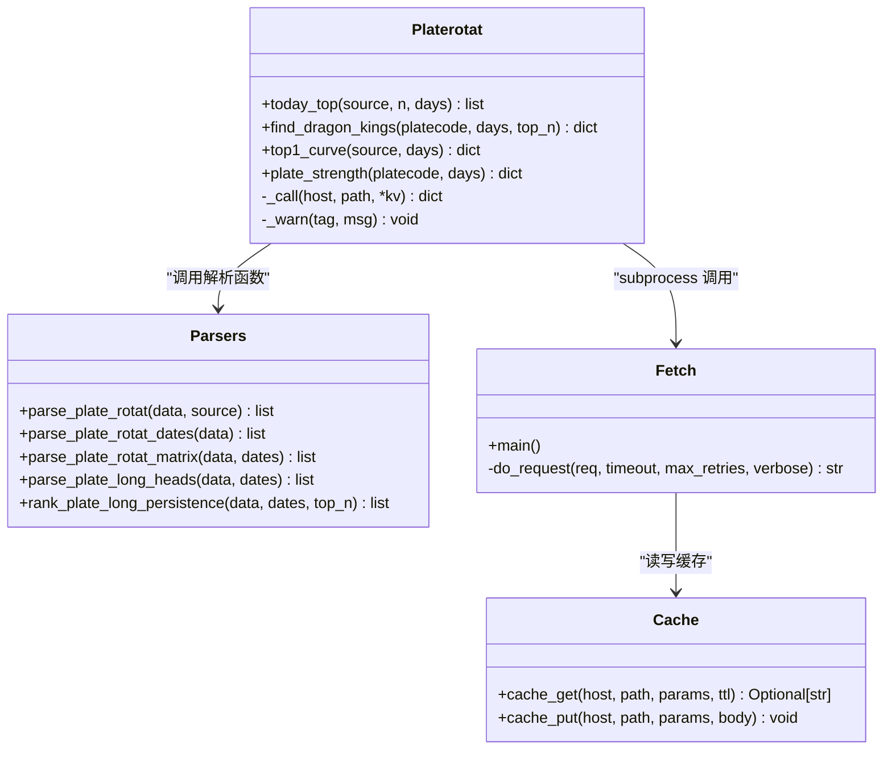
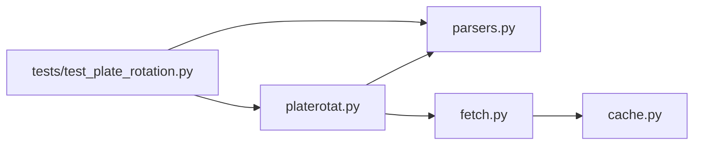

# 数据解析引擎

<cite>
**本文引用的文件**   
- [parsers.py](file://skills/plate-rotation-skill/scripts/parsers.py)
- [platerotat.py](file://skills/plate-rotation-skill/scripts/platerotat.py)
- [fetch.py](file://skills/plate-rotation-skill/scripts/fetch.py)
- [cache.py](file://skills/plate-rotation-skill/scripts/cache.py)
- [test_plate_rotation.py](file://skills/plate-rotation-skill/tests/test_plate_rotation.py)
- [api_getplaterotatdata.md](file://skills/plate-rotation-skill/references/api_getplaterotatdata.md)
- [api_getlongbyplate.md](file://skills/plate-rotation-skill/references/api_getlongbyplate.md)
</cite>

## 目录
1. [简介](#简介)
2. [项目结构](#项目结构)
3. [核心组件](#核心组件)
4. [架构总览](#架构总览)
5. [详细组件分析](#详细组件分析)
6. [依赖关系分析](#依赖关系分析)
7. [性能与优化](#性能与优化)
8. [故障排查指南](#故障排查指南)
9. [结论](#结论)
10. [附录：自定义解析器开发指南](#附录自定义解析器开发指南)

## 简介
本文件聚焦于“板块轮动”数据解析引擎，围绕 parsers.py 中的核心解析函数展开，系统阐述其实现原理、HTML 模板匹配规则、正则表达式提取技术以及数据结构转换逻辑。同时给出扩展新数据源解析器的方法、测试策略、异常处理与性能优化建议，帮助读者快速构建可维护、可扩展的解析能力。

## 项目结构
该 Skill 采用分层组织：
- 网络层：fetch.py 统一封装 HTTP 请求、重试、缓存与输出格式化
- 解析层：parsers.py 提供 HTML-in-JSON 的抽取与结构化转换
- 高级 API 层：platerotat.py 组合 fetch + parsers，暴露“一个意图一个函数”的接口
- 测试层：tests/test_plate_rotation.py 覆盖在线集成测试
- 参考文档：references/*.md 描述接口协议与 HTML 模板约定

图表来源
- [platerotat.py:1-315](file://skills/plate-rotation-skill/scripts/platerotat.py#L1-L315)
- [parsers.py:1-212](file://skills/plate-rotation-skill/scripts/parsers.py#L1-L212)
- [fetch.py:1-230](file://skills/plate-rotation-skill/scripts/fetch.py#L1-L230)
- [cache.py:1-145](file://skills/plate-rotation-skill/scripts/cache.py#L1-L145)

章节来源
- [platerotat.py:1-315](file://skills/plate-rotation-skill/scripts/platerotat.py#L1-L315)
- [parsers.py:1-212](file://skills/plate-rotation-skill/scripts/parsers.py#L1-L212)
- [fetch.py:1-230](file://skills/plate-rotation-skill/scripts/fetch.py#L1-L230)
- [cache.py:1-145](file://skills/plate-rotation-skill/scripts/cache.py#L1-L145)

## 核心组件
- 主表解析 parse_plate_rotat：从 getPlateRotatData 响应中抽取 Top N 板块清单，支持双源语义（ths=涨幅%，kaipan=强度分）
- 龙头股解析 parse_plate_long_heads：从 getLongByPlate 响应中按天解析龙头序列（龙一到龙五），兼容“当日无领涨”
- 持久性分析 rank_plate_long_persistence：跨天统计某板块内个股上榜次数，返回“妖王榜”
- 辅助解析 parse_plate_rotat_dates / parse_plate_rotat_matrix：日期列抽取与 N×天矩阵还原

章节来源
- [parsers.py:20-65](file://skills/plate-rotation-skill/scripts/parsers.py#L20-L65)
- [parsers.py:113-153](file://skills/plate-rotation-skill/scripts/parsers.py#L113-L153)
- [parsers.py:156-174](file://skills/plate-rotation-skill/scripts/parsers.py#L156-L174)
- [parsers.py:105-108](file://skills/plate-rotation-skill/scripts/parsers.py#L105-L108)
- [parsers.py:68-102](file://skills/plate-rotation-skill/scripts/parsers.py#L68-L102)

## 架构总览
整体流程：上层通过 platerotat.py 的高级函数发起请求 → fetch.py 负责网络访问与缓存 → 返回 JSON（其中 html 字段包含前端渲染片段）→ parsers.py 基于 HTML 模板与正则抽取结构化数据 → 上层消费。

图表来源
- [platerotat.py:55-71](file://skills/plate-rotation-skill/scripts/platerotat.py#L55-L71)
- [fetch.py:128-212](file://skills/plate-rotation-skill/scripts/fetch.py#L128-L212)
- [cache.py:59-94](file://skills/plate-rotation-skill/scripts/cache.py#L59-L94)
- [parsers.py:20-65](file://skills/plate-rotation-skill/scripts/parsers.py#L20-L65)

## 详细组件分析

### 主表解析：parse_plate_rotat
- 输入：getPlateRotatData 的 JSON 响应（含 html 字段）
- 输出：Top N 板块清单，字段包括 rank、code、name、value、value_type、color
- 关键规则：
  - 使用排名标签  分割行
  - 每个板块行由 <td class='plate plate{code}'> 包裹，内含 name 与 value
  - 当日数值位于第一个 td；ths 值带 %，kaipan 值为纯数字
  - color 为 red/green，用于涨跌方向展示
- 复杂度：O(N) 遍历行与正则匹配，N 为板块行数

图表来源
- [parsers.py:20-65](file://skills/plate-rotation-skill/scripts/parsers.py#L20-L65)

章节来源
- [parsers.py:20-65](file://skills/plate-rotation-skill/scripts/parsers.py#L20-L65)
- [api_getplaterotatdata.md:55-63](file://skills/plate-rotation-skill/references/api_getplaterotatdata.md#L55-L63)

### 龙头股解析：parse_plate_long_heads
- 输入：getLongByPlate 的 JSON 响应（含 html 字段）+ dates 列表
- 输出：按天解析的龙头清单，每日最多 5 个（龙一到龙五）
- 关键规则：
  - 每个 <td style='...'> 代表一天，两种样式区分有领涨/无领涨
  - 无领涨时 td 文本包含“当日无领涨”，此时 heads 为空
  - 有领涨时内部包含若干 
......

  - tds 顺序与 dates 对齐（newest first）
- 容错：服务端 HTML 错位导致闭合标签不一致，使用前瞻 (?=<td|$) 兜底

图表来源
- [parsers.py:113-153](file://skills/plate-rotation-skill/scripts/parsers.py#L113-L153)
- [api_getlongbyplate.md:46-51](file://skills/plate-rotation-skill/references/api_getlongbyplate.md#L46-L51)

章节来源
- [parsers.py:113-153](file://skills/plate-rotation-skill/scripts/parsers.py#L113-L153)
- [api_getlongbyplate.md:46-51](file://skills/plate-rotation-skill/references/api_getlongbyplate.md#L46-L51)

### 持久性分析：rank_plate_long_persistence
- 输入：getLongByPlate 的 JSON 响应 + dates 列表 + top_n
- 输出：按上榜次数降序的前 top_n 个股，附带 positions 记录每次上榜日期与名次
- 算法要点：
  - 先调用 parse_plate_long_heads 得到每日龙头
  - 使用哈希聚合统计每只股票的 count、name、positions
  - 按 count 降序排序并截取前 top_n
- 复杂度：O(D×K)，D 为天数，K 为每日龙头数（≤5）

图表来源
- [parsers.py:156-174](file://skills/plate-rotation-skill/scripts/parsers.py#L156-L174)

章节来源
- [parsers.py:156-174](file://skills/plate-rotation-skill/scripts/parsers.py#L156-L174)

### 辅助解析：日期与矩阵
- parse_plate_rotat_dates：从表头抽取日期数组（YYYY-MM-DD），顺序 newest→oldest
- parse_plate_rotat_matrix：将主表还原为 N×天矩阵，便于分析“某板块何时上榜”或“某天的整列 TopN”

章节来源
- [parsers.py:105-108](file://skills/plate-rotation-skill/scripts/parsers.py#L105-L108)
- [parsers.py:68-102](file://skills/plate-rotation-skill/scripts/parsers.py#L68-L102)

### 高级 API 与运行时校验
- today_top：封装 getPlateRotatData 调用与 parse_plate_rotat，支持 ths/kaipan 切换
- find_dragon_kings：自动根据板块代码前缀选择 source（88x→ths，80x/803x→kaipan），组合日期与龙头数据生成妖王榜
- top1_curve：封装 getPlateRotatChart，补充 top5_names 便利字段
- plate_strength：封装 getPlateDayChart，对 legend=null 与 date 空进行警告提示

图表来源
- [platerotat.py:102-218](file://skills/plate-rotation-skill/scripts/platerotat.py#L102-L218)
- [parsers.py:20-174](file://skills/plate-rotation-skill/scripts/parsers.py#L20-L174)
- [fetch.py:128-212](file://skills/plate-rotation-skill/scripts/fetch.py#L128-L212)
- [cache.py:59-94](file://skills/plate-rotation-skill/scripts/cache.py#L59-L94)

章节来源
- [platerotat.py:102-218](file://skills/plate-rotation-skill/scripts/platerotat.py#L102-L218)

## 依赖关系分析
- 模块耦合：
  - platerotat.py 依赖 parsers.py 与 fetch.py（通过 subprocess 调用）
  - fetch.py 依赖 cache.py 做本地 TTL 缓存
  - tests/test_plate_rotation.py 同时导入 parsers 与 platerotat，验证端到端行为
- 外部依赖：
  - 标准库：re、json、urllib、argparse、subprocess、time、hashlib、pathlib
  - 外部接口：duanxianxia.com 系列主机下的 /api/* 端点

图表来源
- [test_plate_rotation.py:33-45](file://skills/plate-rotation-skill/tests/test_plate_rotation.py#L33-L45)
- [platerotat.py:42-48](file://skills/plate-rotation-skill/scripts/platerotat.py#L42-L48)
- [fetch.py:36-36](file://skills/plate-rotation-skill/scripts/fetch.py#L36-L36)

章节来源
- [test_plate_rotation.py:33-45](file://skills/plate-rotation-skill/tests/test_plate_rotation.py#L33-L45)
- [platerotat.py:42-48](file://skills/plate-rotation-skill/scripts/platerotat.py#L42-L48)
- [fetch.py:36-36](file://skills/plate-rotation-skill/scripts/fetch.py#L36-L36)

## 性能与优化
- 网络层优化
  - 指数退避重试：针对 429/5xx 与网络异常，最大 3 次，间隔 1s/2s/4s
  - 本地缓存：POST 请求默认写入 ~/.cache/plate-rotation，TTL 默认 3600s，可通过环境变量关闭或调整
- 解析层优化
  - 正则一次性编译：在矩阵解析中使用 re.compile 提升重复匹配效率
  - 流式迭代：finditer 避免全量替换，降低内存占用
- 上层优化
  - 高级 API 仅做必要的数据增强（如 top5_names），避免冗余计算
  - 运行时校验通过 stderr 输出 PR-EMPTY/PR-WARN，便于下游快速定位问题

章节来源
- [fetch.py:47-50](file://skills/plate-rotation-skill/scripts/fetch.py#L47-L50)
- [fetch.py:101-124](file://skills/plate-rotation-skill/scripts/fetch.py#L101-L124)
- [cache.py:35-37](file://skills/plate-rotation-skill/scripts/cache.py#L35-L37)
- [parsers.py:84-88](file://skills/plate-rotation-skill/scripts/parsers.py#L84-L88)
- [platerotat.py:75-97](file://skills/plate-rotation-skill/scripts/platerotat.py#L75-L97)

## 故障排查指南
- 常见错误与定位
  - 非 JSON 响应：fetch.py 会抛出 JSONDecodeError 并终止，检查 URL 与参数
  - 空数据：高级 API 会在 stderr 输出 PR-EMPTY 警告，结合 _hint_for_empty 判断周末/节假日/跨源错传
  - 上游异常：返回码 4xx 非重试，直接报错；5xx/429 走重试
- 调试技巧
  - 使用 --raw 查看原始响应体
  - 使用 --verbose 打印 URL/body/cookie 等自检信息
  - 使用 cache.py stats/clear 清理或诊断缓存状态

章节来源
- [platerotat.py:65-71](file://skills/plate-rotation-skill/scripts/platerotat.py#L65-L71)
- [platerotat.py:75-97](file://skills/plate-rotation-skill/scripts/platerotat.py#L75-L97)
- [fetch.py:146-154](file://skills/plate-rotation-skill/scripts/fetch.py#L146-L154)
- [fetch.py:200-212](file://skills/plate-rotation-skill/scripts/fetch.py#L200-L212)
- [cache.py:119-128](file://skills/plate-rotation-skill/scripts/cache.py#L119-L128)

## 结论
本解析引擎以“HTML-in-JSON”为核心挑战，通过稳定的正则模板与健壮的网络层（重试+缓存）实现了高可用的数据抽取。高级 API 进一步屏蔽底层细节，提供面向意图的接口，并通过运行时校验保障数据质量。整体设计解耦清晰、易于扩展，适合持续接入新的数据源与解析场景。

## 附录：自定义解析器开发指南

### 新增数据源解析步骤
- 明确接口协议
  - 参考 references/api_*.md，确认 host/path/method/参数/输出字段
  - 确认 HTML 模板结构（类名、属性、层级）
- 编写解析函数
  - 在 parsers.py 新增函数，接收 JSON 响应与必要上下文（如 dates）
  - 使用 re.split/re.findall/re.finditer 精准抽取目标字段
  - 定义返回值结构，确保字段完整与类型一致
- 集成到高级 API
  - 在 platerotat.py 新增 helper，封装 _call 与解析函数
  - 添加运行时校验与 PR-EMPTY/PR-WARN 提示
- 编写测试用例
  - 在 tests/test_plate_rotation.py 增加在线集成测试，断言结构与约束
  - 覆盖边界情况（空数据、跨源错传、节假日）

### 正则与模板匹配最佳实践
- 优先使用稳定类名与属性（如 class='plate'、class='kline'）
- 对可变样式使用宽松匹配（如 style='...' 不精确匹配具体值）
- 使用前瞻/后顾减少误匹配（如 (?=<td|$) 应对服务端 HTML 错位）
- 对数值字段兼容多形态（如 [\d.\-]+%? 兼容带/不带 %）

### 数据结构转换规范
- 统一字段命名（如 code/name/value/value_type/color/date）
- 明确 value_type 语义（pct/score），避免跨源混用
- 保持顺序一致性（dates/newest-first），便于时序分析

### 异常数据处理与数据验证
- 网络层：捕获 HTTPError/URLError/TimeoutError，指数退避重试
- 解析层：跳过无法匹配的节点，保证整体流程不中断
- 上层：对空数据/缺关键字段输出 PR-EMPTY/PR-WARN，供下游识别

### 性能优化策略
- 预编译正则：对频繁使用的模式使用 re.compile
- 增量解析：使用 finditer 替代全量替换，降低内存峰值
- 缓存策略：合理设置 TTL，避免重复请求；必要时禁用缓存进行强刷新

### 扩展新数据源的示例路径
- 新增接口参考：[api_getplaterotatdata.md](file://skills/plate-rotation-skill/references/api_getplaterotatdata.md)
- 新增接口参考：[api_getlongbyplate.md](file://skills/plate-rotation-skill/references/api_getlongbyplate.md)
- 解析函数位置：[parsers.py](file://skills/plate-rotation-skill/scripts/parsers.py)
- 高级 API 位置：[platerotat.py](file://skills/plate-rotation-skill/scripts/platerotat.py)
- 测试用例位置：[test_plate_rotation.py](file://skills/plate-rotation-skill/tests/test_plate_rotation.py)