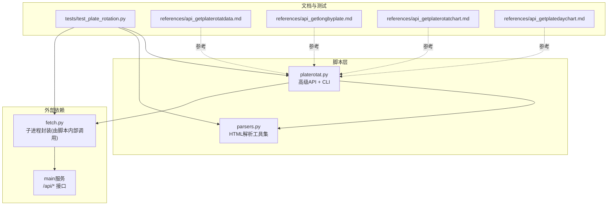
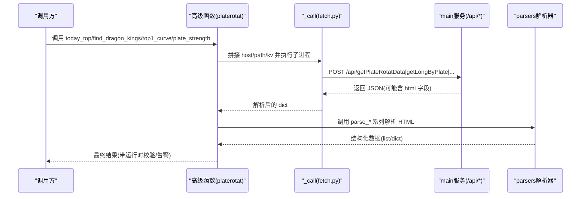
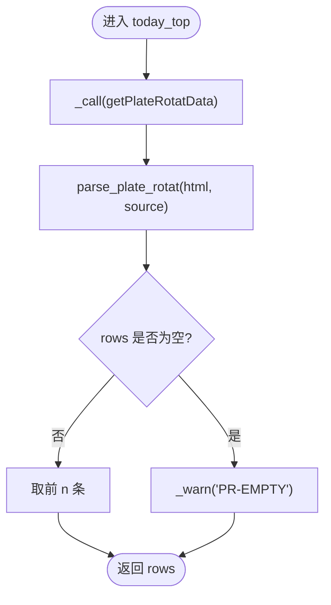
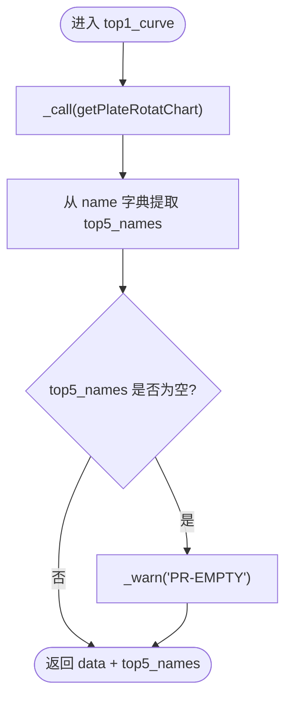
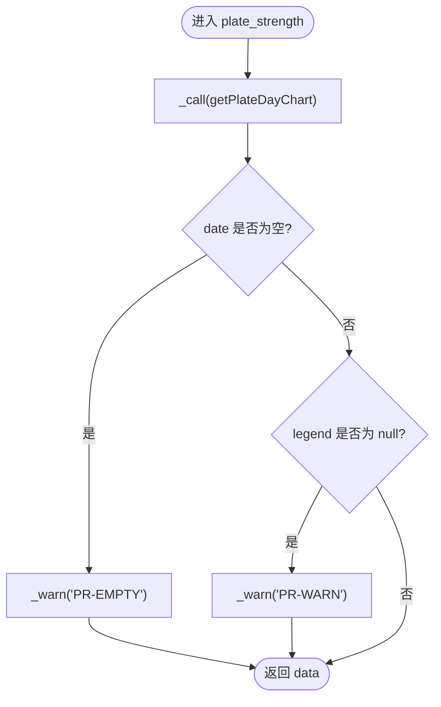
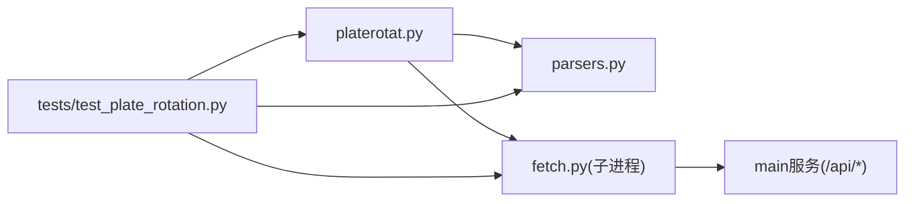

# 核心分析函数实现

<cite>
**本文引用的文件**
- [platerotat.py](file://skills/plate-rotation-skill/scripts/platerotat.py)
- [parsers.py](file://skills/plate-rotation-skill/scripts/parsers.py)
- [test_plate_rotation.py](file://skills/plate-rotation-skill/tests/test_plate_rotation.py)
- [api_getplaterotatdata.md](file://skills/plate-rotation-skill/references/api_getplaterotatdata.md)
- [api_getlongbyplate.md](file://skills/plate-rotation-skill/references/api_getlongbyplate.md)
- [api_getplaterotatchart.md](file://skills/plate-rotation-skill/references/api_getplaterotatchart.md)
- [api_getplatedaychart.md](file://skills/plate-rotation-skill/references/api_getplatedaychart.md)
</cite>

## 目录
1. [引言](#引言)
2. [项目结构](#项目结构)
3. [核心组件](#核心组件)
4. [架构总览](#架构总览)
5. [详细组件分析](#详细组件分析)
6. [依赖关系分析](#依赖关系分析)
7. [性能与健壮性](#性能与健壮性)
8. [故障排查指南](#故障排查指南)
9. [结论](#结论)
10. [附录：调用示例与最佳实践](#附录调用示例与最佳实践)

## 引言
本文件聚焦四大核心分析函数的实现细节与使用方式，覆盖以下目标：
- today_top：今日板块排名查询（参数校验、数据获取、结果处理）
- find_dragon_kings：板块龙头识别（日期推断、龙头矩阵分析、持续性计算）
- top1_curve：Top5 板块 N 日排名变化曲线（ECharts 数据结构转换）
- plate_strength：单板块强度时序数据（ECharts 透传与异常提示）

每个函数均包含完整的错误处理、运行时校验与返回值格式说明，并提供实际调用示例与最佳实践建议。

## 项目结构
该功能位于“板块轮动”技能中，核心脚本与解析器分离，测试与 API 文档完备：
- scripts/platerotat.py：对外暴露四个高级函数与 CLI
- scripts/parsers.py：HTML-in-JSON 的解析工具集
- tests/test_plate_rotation.py：在线集成测试，覆盖接口健康度、解析正确性与高级函数契约
- references/*.md：底层 API 文档，明确输入输出与字段语义



图表来源
- [platerotat.py:1-315](file://skills/plate-rotation-skill/scripts/platerotat.py#L1-L315)
- [parsers.py:1-212](file://skills/plate-rotation-skill/scripts/parsers.py#L1-L212)
- [test_plate_rotation.py:1-444](file://skills/plate-rotation-skill/tests/test_plate_rotation.py#L1-L444)
- [api_getplaterotatdata.md:1-74](file://skills/plate-rotation-skill/references/api_getplaterotatdata.md#L1-L74)
- [api_getlongbyplate.md:1-65](file://skills/plate-rotation-skill/references/api_getlongbyplate.md#L1-L65)
- [api_getplaterotatchart.md:1-53](file://skills/plate-rotation-skill/references/api_getplaterotatchart.md#L1-L53)
- [api_getplatedaychart.md:1-48](file://skills/plate-rotation-skill/references/api_getplatedaychart.md#L1-L48)

章节来源
- [platerotat.py:1-315](file://skills/plate-rotation-skill/scripts/platerotat.py#L1-L315)
- [parsers.py:1-212](file://skills/plate-rotation-skill/scripts/parsers.py#L1-L212)
- [test_plate_rotation.py:1-444](file://skills/plate-rotation-skill/tests/test_plate_rotation.py#L1-L444)

## 核心组件
- 今日 Top 板块：today_top(source, n, days)
- 板块妖王榜：find_dragon_kings(platecode, days, top_n)
- Top5 排名曲线：top1_curve(source, days)
- 单板块强度时序：plate_strength(platecode, days)

这些函数通过 _call 子进程调用 fetch.py 访问 main 服务的 /api/* 接口，再交由 parsers.py 对 HTML-in-JSON 进行抽取与结构化。

章节来源
- [platerotat.py:100-219](file://skills/plate-rotation-skill/scripts/platerotat.py#L100-L219)
- [parsers.py:20-175](file://skills/plate-rotation-skill/scripts/parsers.py#L20-L175)

## 架构总览
整体流程为“高级函数 → 子进程调用 → 原始 JSON → HTML 解析 → 结构化返回”，并在关键路径加入运行时校验与告警。



图表来源
- [platerotat.py:55-71](file://skills/plate-rotation-skill/scripts/platerotat.py#L55-L71)
- [parsers.py:20-175](file://skills/plate-rotation-skill/scripts/parsers.py#L20-L175)

## 详细组件分析

### today_top：今日板块排名查询
- 职责
  - 基于 /api/getPlateRotatData 获取当日板块排名
  - 根据 source 区分数值语义：ths=涨幅%(带%)；kaipan=强度分(纯数字)
  - 返回前 n 条记录，每条包含 rank/code/name/value/value_type/color
- 参数与校验
  - source: Literal["ths","kaipan"]，默认 kaipan
  - n: int，限制返回数量
  - days: int，影响主表列宽，但当日只看第一列
- 数据获取
  - 通过 _call 调用 getPlateRotatData(from=source, days=days)
  - 使用 parse_plate_rotat(data, source) 从 HTML 抽取列表
- 结果处理
  - 若结果为空，输出 PR-EMPTY 警告，并给出可能的原因提示（周末/节假日/跨源错传等）
- 返回值
  - list[dict]，每项包含 rank/code/name/value/value_type/color
- 错误处理
  - 子进程失败或返回非 JSON：_call 直接退出并打印错误
  - 解析为空：_warn("PR-EMPTY", ...)
- 复杂度
  - 解析正则扫描一次 HTML，时间 O(L)，空间 O(N)



图表来源
- [platerotat.py:102-121](file://skills/plate-rotation-skill/scripts/platerotat.py#L102-L121)
- [parsers.py:20-66](file://skills/plate-rotation-skill/scripts/parsers.py#L20-L66)

章节来源
- [platerotat.py:102-121](file://skills/plate-rotation-skill/scripts/platerotat.py#L102-L121)
- [parsers.py:20-66](file://skills/plate-rotation-skill/scripts/parsers.py#L20-L66)
- [api_getplaterotatdata.md:44-74](file://skills/plate-rotation-skill/references/api_getplaterotatdata.md#L44-L74)
- [test_plate_rotation.py:250-271](file://skills/plate-rotation-skill/tests/test_plate_rotation.py#L250-L271)

### find_dragon_kings：板块龙头识别
- 职责
  - 统计某板块过去 N 天里哪些股票最频繁当过龙头（“妖王榜”）
  - 同时提供每日龙头明细
- 参数与校验
  - platecode: 板块代码，自动路由 source（88x→ths；80x/803x→kaipan）
  - days: 回溯天数
  - top_n: 返回前几名
- 数据获取
  - 先按 inferred source 调用 getPlateRotatData(days=days) 以得到 dates
  - 再调用 getLongByPlate(platecode, days=days) 获取龙头矩阵
- 日期推断
  - 使用 parse_plate_rotat_dates(prd) 从主表响应中提取日期序列（newest first）
- 龙头矩阵分析与持续性计算
  - parse_plate_long_heads(lng, dates) 将 HTML 转为每日龙头清单
  - rank_plate_long_persistence(lng, dates, top_n) 统计每只股票上榜次数与位置，并按 count 降序排序
- 结果处理
  - 若 dates 为空：PR-EMPTY 警告
  - 若 kings 为空且所有 daily_heads 无内容：PR-EMPTY 警告（持续未活跃或跨源错传）
- 返回值
  - dict，包含 platecode/source/days/dates/kings/daily_heads
- 错误处理
  - 子进程失败或非 JSON：_call 直接退出
  - 运行时校验：_warn("PR-EMPTY"/"PR-WARN")
- 复杂度
  - 解析两次 HTML（主表与龙头），统计聚合 O(D*5)，排序 O(K log K)

```mermaid
sequenceDiagram
participant U as "调用方"
participant F as "find_dragon_kings"
participant C as "_call"
participant P as "parsers"
U->>F : 传入 platecode, days, top_n
F->>F : 推断 source (88x→ths; 80x/803x→kaipan)
F->>C : getPlateRotatData(from=source, days)
C-->>F : prd(html)
F->>C : getLongByPlate(platecode, days)
C-->>F : lng(html)
F->>P : parse_plate_rotat_dates(prd)
P-->>F : dates
F->>P : parse_plate_long_heads(lng, dates)
P-->>F : daily_heads
F->>P : rank_plate_long_persistence(lng, dates, top_n)
P-->>F : kings
F-->>U : {platecode, source, days, dates, kings, daily_heads}
```

图表来源
- [platerotat.py:125-172](file://skills/plate-rotation-skill/scripts/platerotat.py#L125-L172)
- [parsers.py:105-175](file://skills/plate-rotation-skill/scripts/parsers.py#L105-L175)

章节来源
- [platerotat.py:125-172](file://skills/plate-rotation-skill/scripts/platerotat.py#L125-L172)
- [parsers.py:105-175](file://skills/plate-rotation-skill/scripts/parsers.py#L105-L175)
- [api_getplaterotatdata.md:44-74](file://skills/plate-rotation-skill/references/api_getplaterotatdata.md#L44-L74)
- [api_getlongbyplate.md:44-65](file://skills/plate-rotation-skill/references/api_getlongbyplate.md#L44-L65)
- [test_plate_rotation.py:272-327](file://skills/plate-rotation-skill/tests/test_plate_rotation.py#L272-L327)

### top1_curve：Top5 板块 N 日排名变化曲线
- 职责
  - 基于 /api/getPlateRotatChart 返回 ECharts 数据，补充便于消费的字段
- 参数与校验
  - source: Literal["ths","kaipan"]，默认 kaipan
  - days: 回溯天数
- 数据获取
  - _call("main", "/api/getPlateRotatChart", from=source, days=days)
- 结果处理
  - 从 name 字典提取有序 top5_names 列表（过滤缺失键）
  - 若 top5_names 为空：PR-EMPTY 警告
- 返回值
  - dict，透传原 JSON 并新增 top5_names
  - 典型字段：date(最近N日)、legend(Top5名称+上榜次数)、name{1..5}、1..5(各板块的N日排名序列)
- 错误处理
  - 子进程失败或非 JSON：_call 直接退出
  - 运行时校验：_warn("PR-EMPTY", ...)
- 复杂度
  - 仅字典操作与列表推导，O(1)



图表来源
- [platerotat.py:177-196](file://skills/plate-rotation-skill/scripts/platerotat.py#L177-L196)
- [api_getplaterotatchart.md:46-53](file://skills/plate-rotation-skill/references/api_getplaterotatchart.md#L46-L53)

章节来源
- [platerotat.py:177-196](file://skills/plate-rotation-skill/scripts/platerotat.py#L177-L196)
- [api_getplaterotatchart.md:46-53](file://skills/plate-rotation-skill/references/api_getplaterotatchart.md#L46-L53)
- [test_plate_rotation.py:283-293](file://skills/plate-rotation-skill/tests/test_plate_rotation.py#L283-L293)

### plate_strength：单板块强度时序数据
- 职责
  - 基于 /api/getPlateDayChart 返回指定板块的 N 日强度+量能 ECharts 数据
- 参数与校验
  - platecode: 板块代码
  - days: 回溯天数
- 数据获取
  - _call("main", "/api/getPlateDayChart", platecode=..., days=...)
- 结果处理
  - 若 date 为空：PR-EMPTY 警告（板块代码无效或上游异常）
  - 若 legend 为 null：PR-WARN 警告（近 days 天均未活跃）
- 返回值
  - dict，透传原 JSON（包含 legend/date/series 等）
- 错误处理
  - 子进程失败或非 JSON：_call 直接退出
  - 运行时校验：_warn("PR-EMPTY"/"PR-WARN")
- 复杂度
  - 仅字典读取与判断，O(1)



图表来源
- [platerotat.py:201-218](file://skills/plate-rotation-skill/scripts/platerotat.py#L201-L218)
- [api_getplatedaychart.md:43-48](file://skills/plate-rotation-skill/references/api_getplatedaychart.md#L43-L48)

章节来源
- [platerotat.py:201-218](file://skills/plate-rotation-skill/scripts/platerotat.py#L201-L218)
- [api_getplatedaychart.md:43-48](file://skills/plate-rotation-skill/references/api_getplatedaychart.md#L43-L48)
- [test_plate_rotation.py:295-302](file://skills/plate-rotation-skill/tests/test_plate_rotation.py#L295-L302)

## 依赖关系分析
- 模块耦合
  - platerotat.py 依赖 parsers.py 的解析函数与 fetch.py 的子进程封装
  - 测试用例同时依赖 platerotat.py 与 parsers.py，确保端到端契约稳定
- 外部依赖
  - main 服务提供 /api/getPlateRotatData、/api/getLongByPlate、/api/getPlateRotatChart、/api/getPlateDayChart
- 潜在循环依赖
  - 当前无循环导入；platerotat 单向依赖 parsers
- 接口契约
  - 所有高级函数均有明确的返回结构与运行时校验，测试覆盖关键断言



图表来源
- [platerotat.py:1-315](file://skills/plate-rotation-skill/scripts/platerotat.py#L1-L315)
- [parsers.py:1-212](file://skills/plate-rotation-skill/scripts/parsers.py#L1-L212)
- [test_plate_rotation.py:1-444](file://skills/plate-rotation-skill/tests/test_plate_rotation.py#L1-L444)

章节来源
- [platerotat.py:1-315](file://skills/plate-rotation-skill/scripts/platerotat.py#L1-L315)
- [parsers.py:1-212](file://skills/plate-rotation-skill/scripts/parsers.py#L1-L212)
- [test_plate_rotation.py:1-444](file://skills/plate-rotation-skill/tests/test_plate_rotation.py#L1-L444)

## 性能与健壮性
- 性能
  - today_top：正则扫描一次 HTML，线性时间；切片 O(n)
  - find_dragon_kings：两次 HTML 解析 + 频次统计 + 排序，总体 O(L + D*5 + K log K)
  - top1_curve：字典与列表操作，常数时间
  - plate_strength：字典读取与判断，常数时间
- 健壮性
  - 子进程失败或非 JSON：_call 立即终止并输出错误信息
  - 运行时校验：统一通过 _warn 输出 PR-EMPTY/PR-WARN 标签，便于下游 Agent 识别
  - 自动路由：find_dragon_kings 依据 platecode 前缀选择 source，降低误用风险
  - 边界容错：允许某些日期的 td 缺失或无领涨情况

[本节为通用指导，不直接分析具体文件]

## 故障排查指南
- 常见告警
  - PR-EMPTY：表示接口正常但当日无数据（如节假日/参数超前/跨源错传）
  - PR-WARN：表示板块近 N 天未活跃（legend=null）
- 定位步骤
  - 检查 source 与 platecode 是否匹配（88x→ths；80x/803x→kaipan）
  - 确认 days 是否合理（10/20/30/50）
  - 查看 _call 的错误输出（stderr）与返回码
- 快速验证
  - 使用 CLI 子命令 text/json 双模式验证输出
  - 运行测试套件，观察断言是否通过

章节来源
- [platerotat.py:75-98](file://skills/plate-rotation-skill/scripts/platerotat.py#L75-L98)
- [test_plate_rotation.py:330-444](file://skills/plate-rotation-skill/tests/test_plate_rotation.py#L330-L444)

## 结论
四大核心函数围绕“一个意图一个函数”的设计，屏蔽了底层 HTML-in-JSON 的复杂性，并通过统一的运行时校验与告警机制提升可观测性与可维护性。配合完善的测试与 API 文档，既适合 Agent 自动化消费，也便于人类开发者快速上手。

[本节为总结，不直接分析具体文件]

## 附录：调用示例与最佳实践

- 今日 Top 板块
  - 示例（Python import）
    - 调用 today_top(source='kaipan', n=10, days=20)
    - 返回 list[dict]，value_type='score'
  - 示例（CLI）
    - python3 platerotat.py today --source kaipan --n 10 --days 20
    - python3 platerotat.py today --source ths --n 5 --days 20 --json
  - 最佳实践
    - 优先使用 kaipan 的强度分做横向对比；ths 的涨幅%更适合涨跌直观展示
    - 注意 n 的限制与实际返回长度可能小于 n

- 板块妖王榜
  - 示例（Python import）
    - 调用 find_dragon_kings(platecode='886084', days=20, top_n=10)
    - 返回 dict，包含 kings 与 daily_heads
  - 示例（CLI）
    - python3 platerotat.py wangking 886084 --days 20 --n 10 --json
  - 最佳实践
    - 无需手动指定 source，函数会根据 platecode 前缀自动路由
    - 关注 positions 字段中的日期与龙位，用于评估持续性

- Top5 排名曲线
  - 示例（Python import）
    - 调用 top1_curve(source='kaipan', days=20)
    - 返回 dict，新增 top5_names 字段
  - 示例（CLI）
    - python3 platerotat.py curve --source kaipan --days 20 --json
  - 最佳实践
    - 直接使用返回的 ECharts 结构渲染前端图
    - value=10.5 表示当日未上榜，symbol 指向 wu.png

- 单板块强度时序
  - 示例（Python import）
    - 调用 plate_strength(platecode='886084', days=20)
    - 返回 dict，包含 legend/date/series 等
  - 示例（CLI）
    - python3 platerotat.py strength 886084 --days 20 --json
  - 最佳实践
    - legend=null 时前端应跳过渲染
    - date 为空需视为上游异常，触发重试或告警

章节来源
- [platerotat.py:227-315](file://skills/plate-rotation-skill/scripts/platerotat.py#L227-L315)
- [test_plate_rotation.py:344-423](file://skills/plate-rotation-skill/tests/test_plate_rotation.py#L344-L423)