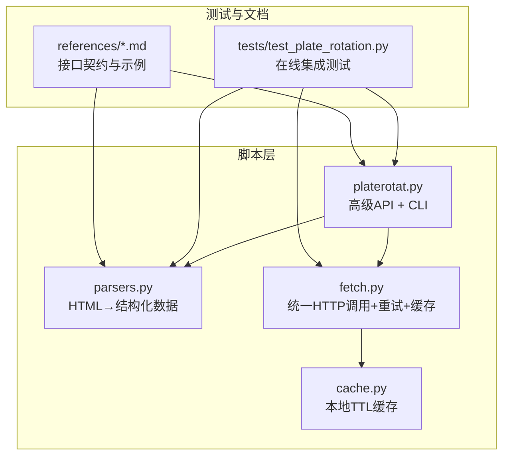
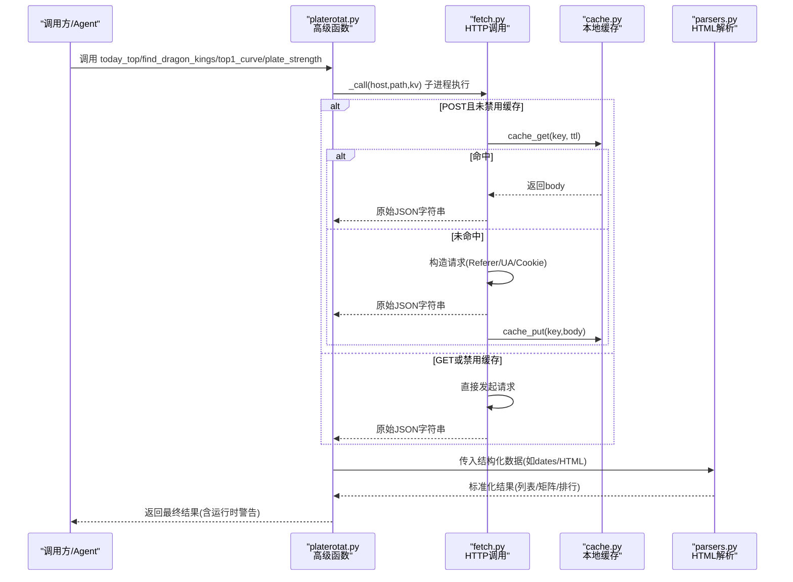
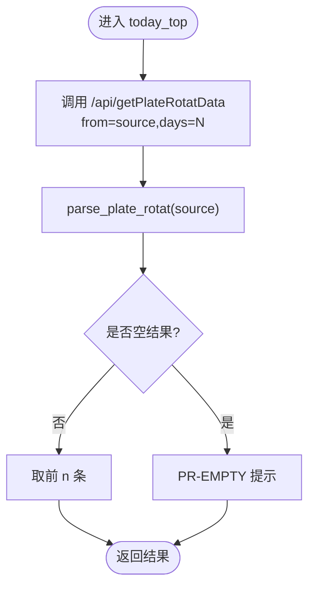
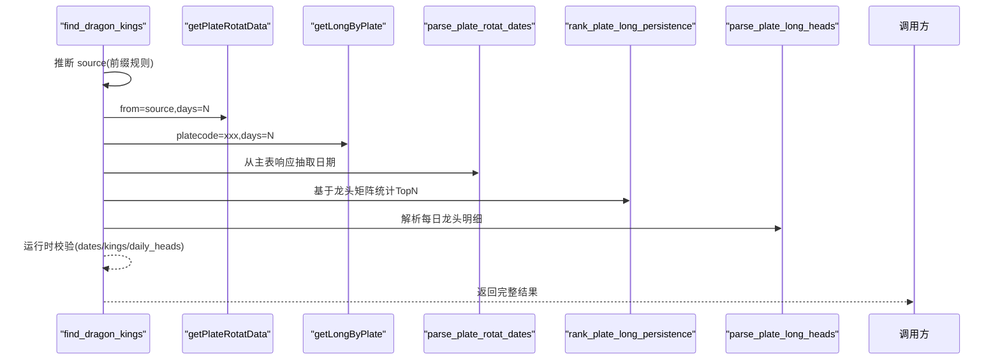
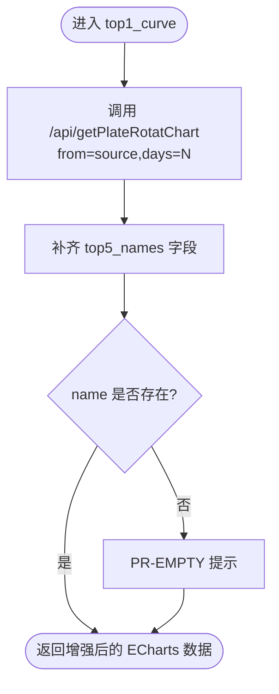
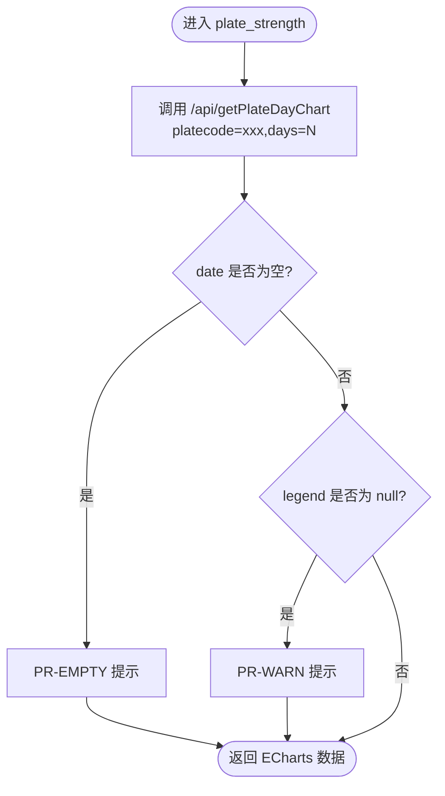
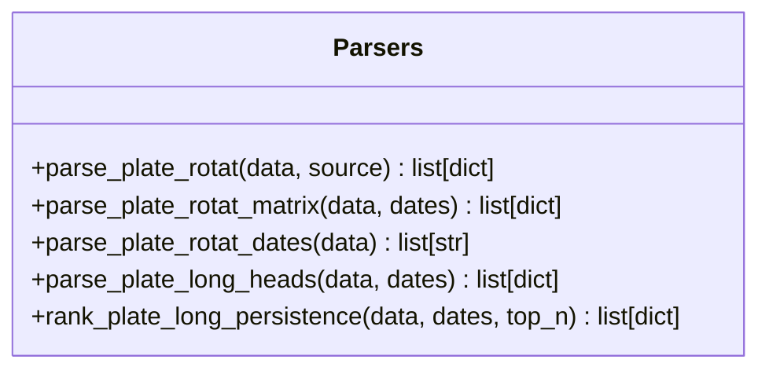
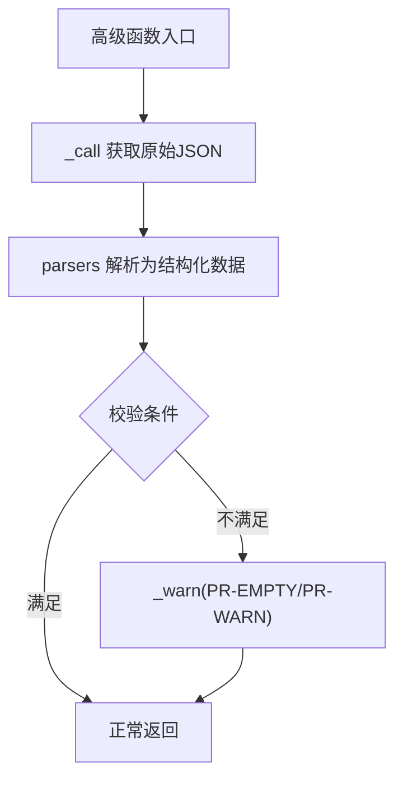
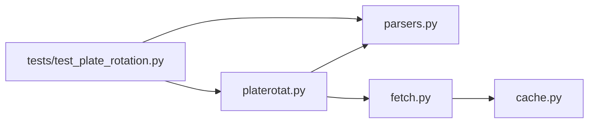

# 高级分析函数开发

<cite>
**本文引用的文件**   
- [platerotat.py](file://skills/plate-rotation-skill/scripts/platerotat.py)
- [parsers.py](file://skills/plate-rotation-skill/scripts/parsers.py)
- [fetch.py](file://skills/plate-rotation-skill/scripts/fetch.py)
- [cache.py](file://skills/plate-rotation-skill/scripts/cache.py)
- [test_plate_rotation.py](file://skills/plate-rotation-skill/tests/test_plate_rotation.py)
- [api_getplaterotatdata.md](file://skills/plate-rotation-skill/references/api_getplaterotatdata.md)
- [api_getlongbyplate.md](file://skills/plate-rotation-skill/references/api_getlongbyplate.md)
- [_INDEX.md](file://skills/plate-rotation-skill/references/_INDEX.md)
</cite>

## 目录
1. [引言](#引言)
2. [项目结构](#项目结构)
3. [核心组件](#核心组件)
4. [架构总览](#架构总览)
5. [详细组件分析](#详细组件分析)
6. [依赖关系分析](#依赖关系分析)
7. [性能与优化](#性能与优化)
8. [故障排查指南](#故障排查指南)
9. [结论](#结论)
10. [附录](#附录)

## 引言
本指南面向希望基于“板块轮动”技能构建复杂数据分析功能的工程师，聚焦以下目标：
- 深入解析 today_top、find_dragon_kings、top1_curve、plate_strength 四个高级函数的设计思路与实现逻辑
- 详解数据解析器 parsers.py 的工作原理：HTML 模板解析、数据结构标准化、异常数据处理
- 提供函数组合模式、运行时校验机制和性能优化策略的实战案例
- 以可复用的方式指导读者扩展新的分析函数

## 项目结构
该 Skill 采用分层组织：网络调用层（fetch）、缓存层（cache）、解析层（parsers）、高级 API 封装层（platerotat），以及在线集成测试与接口参考文档。

图示来源
- [platerotat.py:1-315](file://skills/plate-rotation-skill/scripts/platerotat.py#L1-L315)
- [parsers.py:1-212](file://skills/plate-rotation-skill/scripts/parsers.py#L1-L212)
- [fetch.py:1-230](file://skills/plate-rotation-skill/scripts/fetch.py#L1-L230)
- [cache.py:1-145](file://skills/plate-rotation-skill/scripts/cache.py#L1-L145)
- [test_plate_rotation.py:1-444](file://skills/plate-rotation-skill/tests/test_plate_rotation.py#L1-L444)
- [_INDEX.md:1-43](file://skills/plate-rotation-skill/references/_INDEX.md#L1-L43)

章节来源
- [platerotat.py:1-315](file://skills/plate-rotation-skill/scripts/platerotat.py#L1-L315)
- [parsers.py:1-212](file://skills/plate-rotation-skill/scripts/parsers.py#L1-L212)
- [fetch.py:1-230](file://skills/plate-rotation-skill/scripts/fetch.py#L1-L230)
- [cache.py:1-145](file://skills/plate-rotation-skill/scripts/cache.py#L1-L145)
- [test_plate_rotation.py:1-444](file://skills/plate-rotation-skill/tests/test_plate_rotation.py#L1-L444)
- [_INDEX.md:1-43](file://skills/plate-rotation-skill/references/_INDEX.md#L1-L43)

## 核心组件
- 高级 API 封装（platerotat.py）
  - 暴露 today_top、find_dragon_kings、top1_curve、plate_strength 四个函数
  - 组合底层接口并做运行时校验与提示
- 解析器（parsers.py）
  - 将“JSON 包裹 HTML”的响应解析为标准化列表/矩阵
  - 支持双源语义（ths 涨幅% vs kaipan 强度分）
- 网络调用（fetch.py）
  - 统一 host 别名、参数拼装、请求头注入、指数退避重试
  - 与 cache.py 协作，对 POST 请求进行本地 TTL 缓存
- 缓存（cache.py）
  - 基于 sha1(host+path+sorted_params) 生成稳定 key
  - 原子写入、过期清理、统计诊断
- 在线集成测试（test_plate_rotation.py）
  - 覆盖端点健康、解析正确性、高级函数签名与返回结构、CLI 双模输出、自动路由等

章节来源
- [platerotat.py:100-219](file://skills/plate-rotation-skill/scripts/platerotat.py#L100-L219)
- [parsers.py:18-175](file://skills/plate-rotation-skill/scripts/parsers.py#L18-L175)
- [fetch.py:128-230](file://skills/plate-rotation-skill/scripts/fetch.py#L128-L230)
- [cache.py:40-129](file://skills/plate-rotation-skill/scripts/cache.py#L40-L129)
- [test_plate_rotation.py:74-444](file://skills/plate-rotation-skill/tests/test_plate_rotation.py#L74-L444)

## 架构总览
整体流程：上层函数通过 platerotat._call 调用 fetch.py 子进程获取原始 JSON；随后交由 parsers 解析为结构化数据；必要时进行跨天聚合与排序；最终返回给调用方或 CLI 渲染。

图示来源
- [platerotat.py:55-71](file://skills/plate-rotation-skill/scripts/platerotat.py#L55-L71)
- [fetch.py:128-213](file://skills/plate-rotation-skill/scripts/fetch.py#L128-L213)
- [cache.py:59-95](file://skills/plate-rotation-skill/scripts/cache.py#L59-L95)
- [parsers.py:20-102](file://skills/plate-rotation-skill/scripts/parsers.py#L20-L102)

## 详细组件分析

### 高级函数 #1：today_top
- 功能：返回今日 Top N 板块清单，支持 ths（涨幅%）与 kaipan（强度分）双源切换
- 输入：source、n、days
- 输出：[{rank, code, name, value, value_type, color}, ...]
- 关键逻辑：
  - 调用 getPlateRotatData，按 source 决定数值语义
  - 使用 parse_plate_rotat 解析当日第一列数据
  - 空结果时输出 PR-EMPTY 提示，辅助下游区分节假日/参数超前/上游异常

图示来源
- [platerotat.py:102-121](file://skills/plate-rotation-skill/scripts/platerotat.py#L102-L121)
- [parsers.py:20-65](file://skills/plate-rotation-skill/scripts/parsers.py#L20-L65)

章节来源
- [platerotat.py:102-121](file://skills/plate-rotation-skill/scripts/platerotat.py#L102-L121)
- [parsers.py:20-65](file://skills/plate-rotation-skill/scripts/parsers.py#L20-L65)
- [api_getplaterotatdata.md:43-74](file://skills/plate-rotation-skill/references/api_getplaterotatdata.md#L43-L74)

### 高级函数 #2：find_dragon_kings
- 功能：某板块过去 N 天里，哪些股票最频繁当过龙头（妖王榜）
- 输入：platecode、days、top_n
- 输出：包含 dates、kings、daily_heads 的结构化字典
- 关键逻辑：
  - 根据 platecode 前缀自动选择 source（88x→ths，80x/803x→kaipan）
  - 并行拉取主表（getPlateRotatData）与龙头矩阵（getLongByPlate）
  - 用 parse_plate_rotat_dates 提取日期序列，再 rank_plate_long_persistence 统计上榜次数
  - 运行时校验：dates 为空或全部无领涨时给出明确提示

图示来源
- [platerotat.py:125-173](file://skills/plate-rotation-skill/scripts/platerotat.py#L125-L173)
- [parsers.py:105-175](file://skills/plate-rotation-skill/scripts/parsers.py#L105-L175)
- [api_getlongbyplate.md:44-65](file://skills/plate-rotation-skill/references/api_getlongbyplate.md#L44-L65)

章节来源
- [platerotat.py:125-173](file://skills/plate-rotation-skill/scripts/platerotat.py#L125-L173)
- [parsers.py:105-175](file://skills/plate-rotation-skill/scripts/parsers.py#L105-L175)
- [api_getlongbyplate.md:44-65](file://skills/plate-rotation-skill/references/api_getlongbyplate.md#L44-L65)

### 高级函数 #3：top1_curve
- 功能：Top5 板块 N 日排名变化曲线（ECharts 数据）
- 输入：source、days
- 输出：原 JSON 透传 + top5_names 便利字段
- 关键逻辑：
  - 调用 getPlateRotatChart，补全 top5_names 便于直接使用
  - 若缺 name 字段则输出 PR-EMPTY 提示

图示来源
- [platerotat.py:177-196](file://skills/plate-rotation-skill/scripts/platerotat.py#L177-L196)

章节来源
- [platerotat.py:177-196](file://skills/plate-rotation-skill/scripts/platerotat.py#L177-L196)

### 高级函数 #4：plate_strength
- 功能：单板块 N 日强度+量能时序（ECharts 数据）
- 输入：platecode、days
- 输出：原 JSON 透传（legend/date/series...）
- 关键逻辑：
  - 调用 getPlateDayChart
  - date 为空 → PR-EMPTY；legend=null → PR-WARN（板块近 N 天均未活跃）

图示来源
- [platerotat.py:201-218](file://skills/plate-rotation-skill/scripts/platerotat.py#L201-L218)

章节来源
- [platerotat.py:201-218](file://skills/plate-rotation-skill/scripts/platerotat.py#L201-L218)

### 数据解析器 parsers.py 工作原理
- 解析入口与职责
  - parse_plate_rotat：从 getPlateRotatData 的 HTML 中抽取当日 Top 板块，标注 value_type（pct/score）与颜色
  - parse_plate_rotat_matrix：还原 N×天矩阵，便于“某板块何时上榜/某天整列 TopN”分析
  - parse_plate_rotat_dates：从表头抽取日期数组（newest→oldest）
  - parse_plate_long_heads：解析 getLongByPlate 的龙头矩阵，兼容“当日无领涨”场景
  - rank_plate_long_persistence：跨天统计个股上榜频次，输出妖王榜
- HTML 模板解析要点
  - 主表：按  分割行，正则匹配 td.plate 中的 code/name/color/value
  - 龙头表：按 td style 双分支匹配（有领涨/无领涨），内部用 div.kline 抽取 rank/code/name
- 数据结构标准化
  - 统一字段名与类型，value_type 区分百分比与分数，color 统一 red/green
  - 日期对齐：matrix 与 daily_heads 均与 dates 顺序一致
- 异常数据处理
  - 缺失字段跳过（continue）
  - 无领涨日返回空 heads 列表
  - 日期越界保护（di < len(dates)）

图示来源
- [parsers.py:20-175](file://skills/plate-rotation-skill/scripts/parsers.py#L20-L175)

章节来源
- [parsers.py:20-175](file://skills/plate-rotation-skill/scripts/parsers.py#L20-L175)
- [api_getplaterotatdata.md:55-74](file://skills/plate-rotation-skill/references/api_getplaterotatdata.md#L55-L74)
- [api_getlongbyplate.md:44-65](file://skills/plate-rotation-skill/references/api_getlongbyplate.md#L44-L65)

### 函数组合模式与运行时校验
- 组合模式
  - 每个高级函数 = 一次或多次 _call + 若干 parsers + 可选聚合/排序 + 校验提示
  - 例如 find_dragon_kings 组合了日期抽取、龙头矩阵解析与跨天统计
- 运行时校验
  - 统一 _warn(tag,msg) 输出到 stderr，标签 PR-EMPTY/PR-WARN 便于下游识别
  - 针对空数据/缺关键字段/跨源错传给出方向性提示（周末/前缀不匹配/节假日/上游异常）

图示来源
- [platerotat.py:75-98](file://skills/plate-rotation-skill/scripts/platerotat.py#L75-L98)
- [platerotat.py:115-121](file://skills/plate-rotation-skill/scripts/platerotat.py#L115-L121)
- [platerotat.py:155-173](file://skills/plate-rotation-skill/scripts/platerotat.py#L155-L173)
- [platerotat.py:193-196](file://skills/plate-rotation-skill/scripts/platerotat.py#L193-L196)
- [platerotat.py:212-218](file://skills/plate-rotation-skill/scripts/platerotat.py#L212-L218)

章节来源
- [platerotat.py:75-98](file://skills/plate-rotation-skill/scripts/platerotat.py#L75-L98)
- [platerotat.py:115-121](file://skills/plate-rotation-skill/scripts/platerotat.py#L115-L121)
- [platerotat.py:155-173](file://skills/plate-rotation-skill/scripts/platerotat.py#L155-L173)
- [platerotat.py:193-196](file://skills/plate-rotation-skill/scripts/platerotat.py#L193-L196)
- [platerotat.py:212-218](file://skills/plate-rotation-skill/scripts/platerotat.py#L212-L218)

## 依赖关系分析
- 模块耦合
  - platerotat 依赖 parsers 与 fetch（subprocess）
  - fetch 依赖 cache（本地TTL）
  - tests 同时依赖 platerotat 与 parsers，验证端到端行为
- 外部依赖
  - 仅 stdlib（urllib、json、argparse、hashlib、time、pathlib 等）
  - 后端只校验 Referer，无需 API Key
- 潜在循环依赖
  - 当前无循环依赖，层级清晰

图示来源
- [test_plate_rotation.py:32-45](file://skills/plate-rotation-skill/tests/test_plate_rotation.py#L32-L45)
- [platerotat.py:42-48](file://skills/plate-rotation-skill/scripts/platerotat.py#L42-L48)
- [fetch.py:36-36](file://skills/plate-rotation-skill/scripts/fetch.py#L36-L36)

章节来源
- [test_plate_rotation.py:32-45](file://skills/plate-rotation-skill/tests/test_plate_rotation.py#L32-L45)
- [platerotat.py:42-48](file://skills/plate-rotation-skill/scripts/platerotat.py#L42-L48)
- [fetch.py:36-36](file://skills/plate-rotation-skill/scripts/fetch.py#L36-L36)

## 性能与优化
- 网络层优化
  - 指数退避重试：对 429/5xx/网络异常自动重试，避免瞬时抖动导致失败
  - 本地缓存：POST 请求默认落盘缓存，TTL 默认 1 小时，减少重复请求
  - 原子写入：临时文件 + os.replace 避免半写损坏
- 解析层优化
  - 单次遍历正则匹配，避免多次扫描
  - 日期对齐边界保护，防止索引越界
- 建议
  - 批量查询时可复用同一份主表响应（dates 不变）
  - 对高频热点板块可缩短 days 以降低解析量
  - 在 Agent 侧合并多个同参数请求，利用缓存提升命中率

章节来源
- [fetch.py:47-51](file://skills/plate-rotation-skill/scripts/fetch.py#L47-L51)
- [fetch.py:101-124](file://skills/plate-rotation-skill/scripts/fetch.py#L101-L124)
- [cache.py:47-95](file://skills/plate-rotation-skill/scripts/cache.py#L47-L95)
- [parsers.py:83-102](file://skills/plate-rotation-skill/scripts/parsers.py#L83-L102)

## 故障排查指南
- 常见错误定位
  - 空数据：检查是否周末/节假日、days 是否超前、source 与 platecode 前缀是否匹配
  - 非 JSON 响应：查看 fetch 输出的 raw 片段，确认后端返回格式
  - 解析失败：核对 HTML 模板是否与 references 描述一致
- 调试手段
  - 使用 fetch.py 的 --raw 与 -v 打印 URL/body/cookie
  - 使用 cache.py stats/clear 诊断缓存状态
  - 运行 tests/test_plate_rotation.py 快速验证端到端链路
- 典型提示
  - PR-EMPTY：接口正常但当日无数据（节假日/参数超前/跨源错传）
  - PR-WARN：板块近 N 天均未活跃（legend=null）

章节来源
- [platerotat.py:85-98](file://skills/plate-rotation-skill/scripts/platerotat.py#L85-L98)
- [platerotat.py:115-121](file://skills/plate-rotation-skill/scripts/platerotat.py#L115-L121)
- [platerotat.py:155-173](file://skills/plate-rotation-skill/scripts/platerotat.py#L155-L173)
- [platerotat.py:212-218](file://skills/plate-rotation-skill/scripts/platerotat.py#L212-L218)
- [fetch.py:193-213](file://skills/plate-rotation-skill/scripts/fetch.py#L193-L213)
- [cache.py:119-129](file://skills/plate-rotation-skill/scripts/cache.py#L119-L129)
- [test_plate_rotation.py:74-118](file://skills/plate-rotation-skill/tests/test_plate_rotation.py#L74-L118)

## 结论
本方案通过“网络调用—缓存—解析—高阶函数”的分层设计，实现了高内聚、低耦合的板块轮动分析能力。四个高级函数覆盖了“今日最强、龙头持续性、Top5 曲线、单板块强度时序”四大典型需求，配合运行时校验与详尽的在线测试，确保在真实网络环境下稳定可用。遵循本文的组合模式与优化策略，可快速扩展更多分析函数。

## 附录
- 接口参考
  - api_getplaterotatdata：主表（HTML in JSON），双源语义差异显著
  - api_getlongbyplate：单板块龙头矩阵，注意“当日无领涨”分支
  - _INDEX：四接口路由表与前缀/单位说明
- 最佳实践
  - 始终先列事实表格，再讲逻辑解读
  - 双源不可跨比，各自排序
  - 优先使用高级函数，避免自行拼接参数与解析 HTML

章节来源
- [api_getplaterotatdata.md:43-74](file://skills/plate-rotation-skill/references/api_getplaterotatdata.md#L43-L74)
- [api_getlongbyplate.md:44-65](file://skills/plate-rotation-skill/references/api_getlongbyplate.md#L44-L65)
- [_INDEX.md:1-43](file://skills/plate-rotation-skill/references/_INDEX.md#L1-L43)