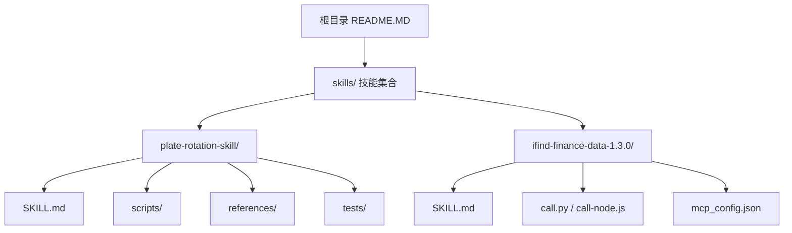
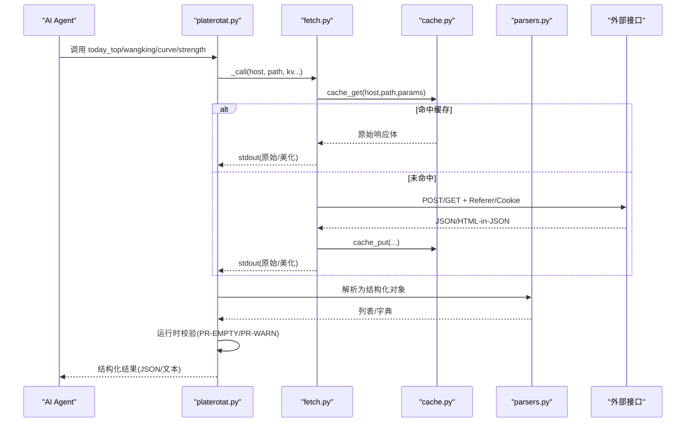
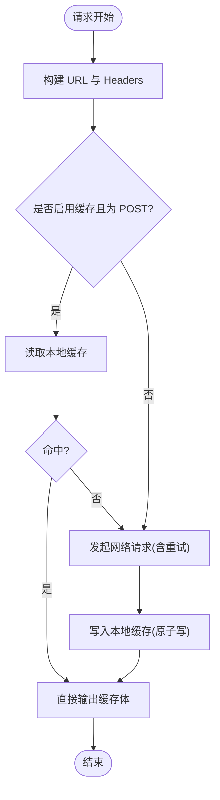
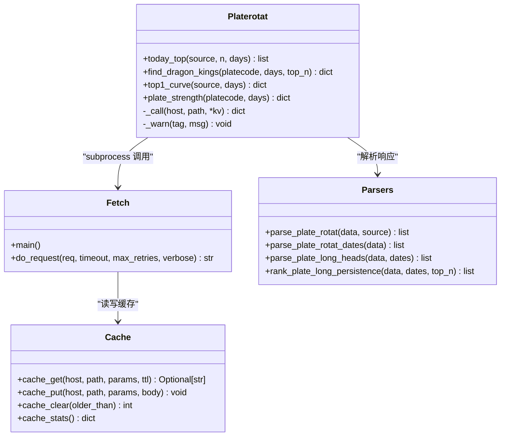
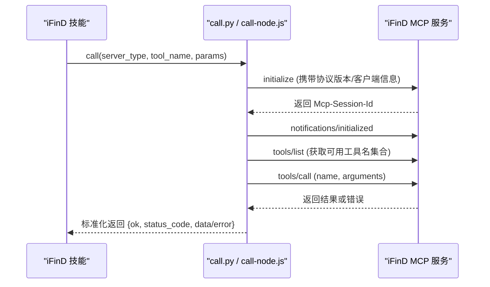
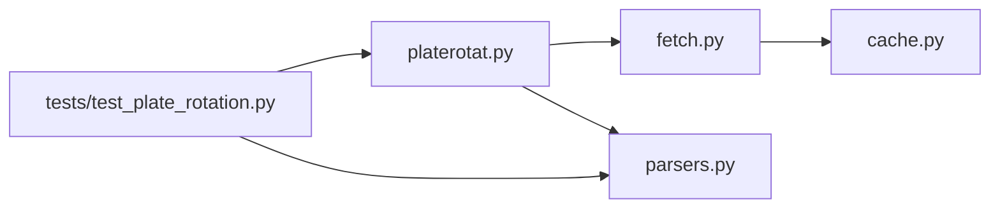

# 技能开发指南

<cite>
**本文引用的文件**   
- [README.MD](file://README.MD)
- [SKILL.md（板块轮动）](file://skills/plate-rotation-skill/SKILL.md)
- [README.md（板块轮动）](file://skills/plate-rotation-skill/README.md)
- [_INDEX.md（路由表）](file://skills/plate-rotation-skill/references/_INDEX.md)
- [platerotat.py](file://skills/plate-rotation-skill/scripts/platerotat.py)
- [fetch.py](file://skills/plate-rotation-skill/scripts/fetch.py)
- [parsers.py](file://skills/plate-rotation-skill/scripts/parsers.py)
- [cache.py](file://skills/plate-rotation-skill/scripts/cache.py)
- [test_plate_rotation.py](file://skills/plate-rotation-skill/tests/test_plate_rotation.py)
- [SKILL.md（iFinD金融数据）](file://skills/ifind-finance-data-1.3.0/SKILL.md)
- [mcp_config.json](file://skills/ifind-finance-data-1.3.0/mcp_config.json)
- [call.py](file://skills/ifind-finance-data-1.3.0/call.py)
- [call-node.js](file://skills/ifind-finance-data-1.3.0/call-node.js)
</cite>

## 目录
1. [引言](#引言)
2. [项目结构](#项目结构)
3. [核心组件](#核心组件)
4. [架构总览](#架构总览)
5. [详细组件分析](#详细组件分析)
6. [依赖关系分析](#依赖关系分析)
7. [性能与可靠性](#性能与可靠性)
8. [故障排查指南](#故障排查指南)
9. [结论](#结论)
10. [附录：技能模板与清单](#附录技能模板与清单)

## 引言
本指南面向开发者，系统化说明如何在本仓库中创建新的“分析技能”，包括 SKILL.md 元数据规范、字段定义与配置项；技能的目录结构与子目录组织原则；插件化与注册机制（AI Agent 发现与加载）；从基础数据获取到高级分析的完整示例；以及错误处理、日志记录、性能优化与版本兼容性最佳实践。

## 项目结构
仓库采用“能力即技能”的模块化设计：每个技能是一个独立目录，包含元数据、脚本、参考文档与测试等。根目录 README 对模块职责进行了分层说明：Manual（认知）、Skills（取数与分析）、Strategy（决策）。

图示来源
- [README.MD:1-80](file://README.MD#L1-L80)

章节来源
- [README.MD:1-80](file://README.MD#L1-L80)

## 核心组件
- 技能元数据与行为契约：SKILL.md 描述技能名称、能力范围、触发关键词、工具使用纪律、输出风格与风险声明。
- 脚本层：提供 CLI 与 Python API，封装网络请求、解析、缓存与校验。
- 参考文档：接口路由、参数约定、领域知识沉淀。
- 测试集：在线集成测试覆盖底层接口、解析器、高级 helper 与 CLI。

章节来源
- [SKILL.md（板块轮动）:1-280](file://skills/plate-rotation-skill/SKILL.md#L1-L280)
- [README.md（板块轮动）:1-188](file://skills/plate-rotation-skill/README.md#L1-L188)
- [_INDEX.md（路由表）:1-43](file://skills/plate-rotation-skill/references/_INDEX.md#L1-L43)

## 架构总览
以“板块轮动”技能为例，展示从 AI Agent 调用到数据返回的整体流程。Agent 通过 CLI 或 Python API 进入 platerotat.py，后者组合 fetch.py 发起 HTTP 请求，parsers.py 解析 HTML-in-JSON 响应，cache.py 提供本地缓存与开关，最终由 platerotat.py 进行运行时校验并输出结构化结果。

图示来源
- [platerotat.py:55-71](file://skills/plate-rotation-skill/scripts/platerotat.py#L55-L71)
- [fetch.py:128-213](file://skills/plate-rotation-skill/scripts/fetch.py#L128-L213)
- [cache.py:59-94](file://skills/plate-rotation-skill/scripts/cache.py#L59-L94)
- [parsers.py:20-65](file://skills/plate-rotation-skill/scripts/parsers.py#L20-L65)

## 详细组件分析

### 技能元数据与注册机制（SKILL.md）
- 作用：定义技能名称、描述、触发关键词、方法论、工具清单、输出纪律与风险声明，是 AI Agent 识别与加载技能的核心契约。
- 关键字段建议：
  - name/description：唯一标识与能力概述
  - homepage/version/author：来源与版本信息（如 iFinD 技能）
  - 触发关键词：便于 Agent 自动匹配用户意图
  - 工具弹药库：CLI/Python API 入口与用法
  - 必守纪律：数据真实性、工具优先级、跨源不可比较等约束
  - 输出风格：事实先行、解读在后、关键数字注明来源
  - 风险声明：数据来源与免责提示
- 注册与发现：
  - 将技能目录放入 skills/ 下，并在 SKILL.md 中明确触发关键词与工具入口。
  - Agent 在收到用户问题后，根据关键词与描述匹配到对应 SKILL.md，再按“工具弹药库”执行 CLI 或导入 Python API。

章节来源
- [SKILL.md（板块轮动）:1-280](file://skills/plate-rotation-skill/SKILL.md#L1-L280)
- [SKILL.md（iFinD金融数据）:1-111](file://skills/ifind-finance-data-1.3.0/SKILL.md#L1-L111)

### 目录结构与组织原则
- 顶层文件
  - SKILL.md：技能契约与使用说明
  - README.md：安装、触发、示例与风险声明
  - references/：接口路由、参数约定、领域知识
  - scripts/：网络、解析、缓存、CLI 与高级 API
  - tests/：在线集成测试
  - learned/：经验沉淀（可选）
- 命名与路径
  - 脚本统一放在 scripts/，对外暴露 CLI 与可 import 的函数
  - references/ 以 api_xxx.md 形式维护接口契约
  - tests/ 使用 unittest 编写端到端用例

章节来源
- [README.md（板块轮动）:1-188](file://skills/plate-rotation-skill/README.md#L1-L188)
- [_INDEX.md（路由表）:1-43](file://skills/plate-rotation-skill/references/_INDEX.md#L1-L43)

### 网络与缓存层（fetch.py + cache.py）
- fetch.py
  - 统一 host 别名与 URL 构建
  - 支持 GET/POST，自动注入 Referer/UA/Cookie
  - 指数退避重试（429/5xx/网络异常）
  - 默认启用 POST 缓存，TTL 可配，支持 --no-cache 与 PR_CACHE_DISABLE=1
- cache.py
  - 基于 sha1 的稳定 key 生成
  - 原子写入（.tmp + replace），损坏文件自动清理
  - stats/clear 诊断与清理命令

图示来源
- [fetch.py:128-213](file://skills/plate-rotation-skill/scripts/fetch.py#L128-L213)
- [cache.py:59-94](file://skills/plate-rotation-skill/scripts/cache.py#L59-L94)

章节来源
- [fetch.py:1-230](file://skills/plate-rotation-skill/scripts/fetch.py#L1-230)
- [cache.py:1-145](file://skills/plate-rotation-skill/scripts/cache.py#L1-L145)

### 解析层（parsers.py）
- 针对“HTML in JSON”的响应，抽取排名、日期、龙头矩阵等结构化数据
- 双源差异：ths 值带 %，kaipan 值为纯整数强度分
- 常用函数：
  - parse_plate_rotat：今日 Top N 板块
  - parse_plate_rotat_dates：日期序列
  - parse_plate_long_heads：每日龙头股清单
  - rank_plate_long_persistence：跨天统计“妖王榜”

章节来源
- [parsers.py:1-212](file://skills/plate-rotation-skill/scripts/parsers.py#L1-L212)

### 高级 API 与 CLI（platerotat.py）
- 高级 helper
  - today_top(source, n, days)：今日最强板块
  - find_dragon_kings(platecode, days, top_n)：妖王榜（自动按前缀选择 ths/kaipan）
  - top1_curve(source, days)：Top5 排名变化曲线
  - plate_strength(platecode, days)：单板块强度+量能时序
- CLI 子命令
  - today/wangking/curve/strength，均支持 --json 输出
- 运行时校验
  - 空数据/缺字段时输出 PR-EMPTY/PR-WARN 标签，供下游 Agent 识别

图示来源
- [platerotat.py:100-219](file://skills/plate-rotation-skill/scripts/platerotat.py#L100-L219)
- [fetch.py:91-124](file://skills/plate-rotation-skill/scripts/fetch.py#L91-L124)
- [parsers.py:20-175](file://skills/plate-rotation-skill/scripts/parsers.py#L20-L175)
- [cache.py:59-128](file://skills/plate-rotation-skill/scripts/cache.py#L59-L128)

章节来源
- [platerotat.py:1-315](file://skills/plate-rotation-skill/scripts/platerotat.py#L1-L315)

### 第三方数据接入（iFinD MCP）
- 元数据与配置
  - SKILL.md 描述服务类型、工具清单、并发上限与首次使用步骤
  - mcp_config.json 存放 auth_token
- 客户端实现
  - call.py：Python 版，基于 requests，维护 session 与工具集缓存
  - call-node.js：Node.js 版，基于原生 http(s)，功能等价
- 调用流程
  - initialize → notifications/initialized → tools/list（缓存允许的工具名）→ tools/call

图示来源
- [SKILL.md（iFinD金融数据）:1-111](file://skills/ifind-finance-data-1.3.0/SKILL.md#L1-L111)
- [mcp_config.json:1-3](file://skills/ifind-finance-data-1.3.0/mcp_config.json#L1-L3)
- [call.py:85-171](file://skills/ifind-finance-data-1.3.0/call.py#L85-L171)
- [call-node.js:149-220](file://skills/ifind-finance-data-1.3.0/call-node.js#L149-L220)

章节来源
- [SKILL.md（iFinD金融数据）:1-111](file://skills/ifind-finance-data-1.3.0/SKILL.md#L1-L111)
- [call.py:1-208](file://skills/ifind-finance-data-1.3.0/call.py#L1-L208)
- [call-node.js:1-267](file://skills/ifind-finance-data-1.3.0/call-node.js#L1-L267)

### 测试与质量保障（tests/）
- 目标：验证底层接口健康、解析正确性、高级 helper 签名与返回结构、CLI 双模输出、自动路由与错误路径
- 运行方式：unittest 或直接执行测试脚本
- 关键点：
  - 共享 fixture 复用一次网络拉取的响应，避免重复打网
  - 断言 value_type 区分（ths 带 %，kaipan 纯数字）
  - 自动路由：88x→ths，80x/803x→kaipan

章节来源
- [test_plate_rotation.py:1-444](file://skills/plate-rotation-skill/tests/test_plate_rotation.py#L1-L444)

## 依赖关系分析
- 模块内依赖
  - platerotat.py 依赖 fetch.py（subprocess）、parsers.py（import）
  - fetch.py 依赖 cache.py（import）
  - tests 同时依赖 parsers 与 platerotat
- 外部依赖
  - 板块轮动：仅 stdlib（urllib、argparse、json、os、sys、time、hashlib、pathlib）
  - iFinD：Python 需 requests；Node.js 使用内置模块

图示来源
- [platerotat.py:1-315](file://skills/plate-rotation-skill/scripts/platerotat.py#L1-L315)
- [fetch.py:1-230](file://skills/plate-rotation-skill/scripts/fetch.py#L1-230)
- [parsers.py:1-212](file://skills/plate-rotation-skill/scripts/parsers.py#L1-L212)
- [cache.py:1-145](file://skills/plate-rotation-skill/scripts/cache.py#L1-L145)
- [test_plate_rotation.py:1-444](file://skills/plate-rotation-skill/tests/test_plate_rotation.py#L1-L444)

章节来源
- [platerotat.py:1-315](file://skills/plate-rotation-skill/scripts/platerotat.py#L1-L315)
- [fetch.py:1-230](file://skills/plate-rotation-skill/scripts/fetch.py#L1-L230)
- [parsers.py:1-212](file://skills/plate-rotation-skill/scripts/parsers.py#L1-L212)
- [cache.py:1-145](file://skills/plate-rotation-skill/scripts/cache.py#L1-L145)
- [test_plate_rotation.py:1-444](file://skills/plate-rotation-skill/tests/test_plate_rotation.py#L1-L444)

## 性能与可靠性
- 缓存策略
  - 默认 TTL 1 小时，可通过环境变量 PR_CACHE_TTL 调整；全局关闭 PR_CACHE_DISABLE=1
  - 原子写入避免半写文件；stats/clear 用于诊断与清理
- 重试与超时
  - 指数退避重试 429/5xx/网络异常，最大次数与间隔可配
  - 超时时间可配，避免长时间阻塞
- 并发与限流
  - iFinD 免费用户并发限制较低，建议在调用侧控制并发与合并查询
- 解析健壮性
  - 正则兼容双源数值格式；对“当日无领涨”等边界情况有专门处理
- 运行时校验
  - 通过 PR-EMPTY/PR-WARN 标签快速定位空数据与异常场景

章节来源
- [cache.py:1-145](file://skills/plate-rotation-skill/scripts/cache.py#L1-L145)
- [fetch.py:47-124](file://skills/plate-rotation-skill/scripts/fetch.py#L47-L124)
- [SKILL.md（板块轮动）:242-251](file://skills/plate-rotation-skill/SKILL.md#L242-L251)
- [SKILL.md（iFinD金融数据）:25-28](file://skills/ifind-finance-data-1.3.0/SKILL.md#L25-L28)

## 故障排查指南
- 常见问题
  - 空数据/节假日：检查 PR-EMPTY 警告与周末判断逻辑
  - 跨源传参错误：确认板块代码前缀与 source 匹配（88x→ths，80x/803x→kaipan）
  - 非 JSON 响应：查看 fetch 的 raw 输出与错误码
  - iFinD 鉴权失败：核对 mcp_config.json 中的 auth_token 与服务端权限
- 调试技巧
  - fetch.py 加 -v 打印 URL/body/cookie
  - 使用 cache.py stats/clear 观察缓存命中与清理效果
  - 单元测试覆盖关键路径，优先复现失败用例

章节来源
- [platerotat.py:75-98](file://skills/plate-rotation-skill/scripts/platerotat.py#L75-L98)
- [fetch.py:193-213](file://skills/plate-rotation-skill/scripts/fetch.py#L193-L213)
- [mcp_config.json:1-3](file://skills/ifind-finance-data-1.3.0/mcp_config.json#L1-L3)
- [test_plate_rotation.py:330-444](file://skills/plate-rotation-skill/tests/test_plate_rotation.py#L330-L444)

## 结论
通过统一的 SKILL.md 契约、清晰的目录组织与分层脚本（网络/解析/缓存/CLI/API），本仓库提供了可扩展的技能开发范式。结合在线集成测试与运行时校验，既能保证稳定性，又能快速扩展新能力。对于第三方数据接入，遵循 MCP 初始化与工具清单机制，确保动态适配与权限控制。

## 附录：技能模板与清单
- 必备文件
  - SKILL.md：元数据、触发词、工具清单、纪律与风险声明
  - README.md：安装、触发、示例与注意事项
  - references/：接口路由与领域知识
  - scripts/：网络、解析、缓存、CLI 与高级 API
  - tests/：在线集成测试
- 可选文件
  - learned/：经验沉淀
  - DISCLAIMER.md/LICENSE：免责声明与许可证
- 版本与兼容性
  - 在 SKILL.md 中声明 version/author/homepage（如 iFinD 技能）
  - 变更接口或解析规则时，同步更新 references 与 tests，确保向后兼容

章节来源
- [SKILL.md（板块轮动）:262-280](file://skills/plate-rotation-skill/SKILL.md#L262-L280)
- [SKILL.md（iFinD金融数据）:1-111](file://skills/ifind-finance-data-1.3.0/SKILL.md#L1-L111)