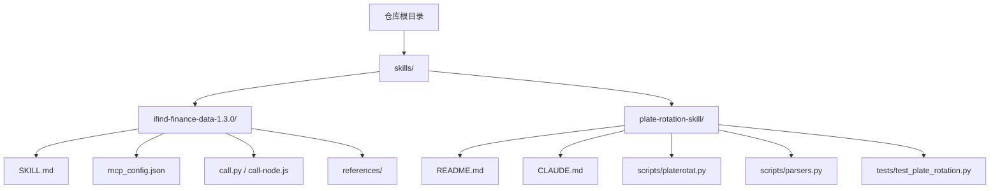
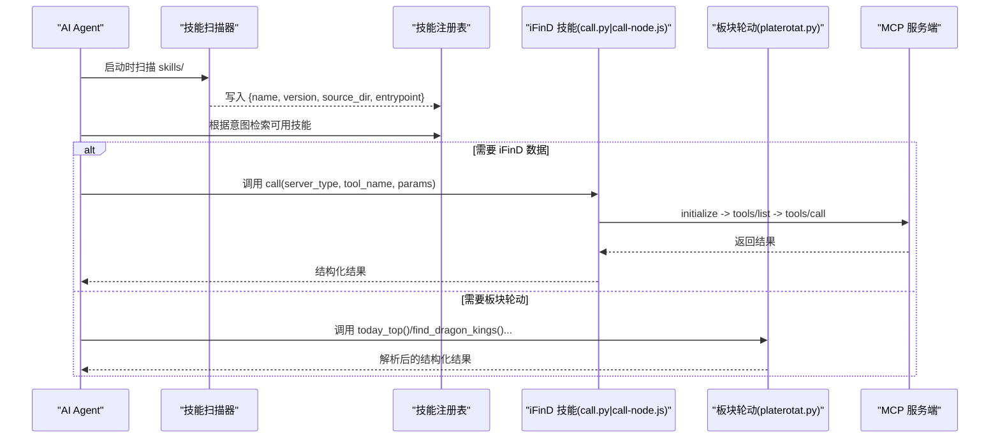
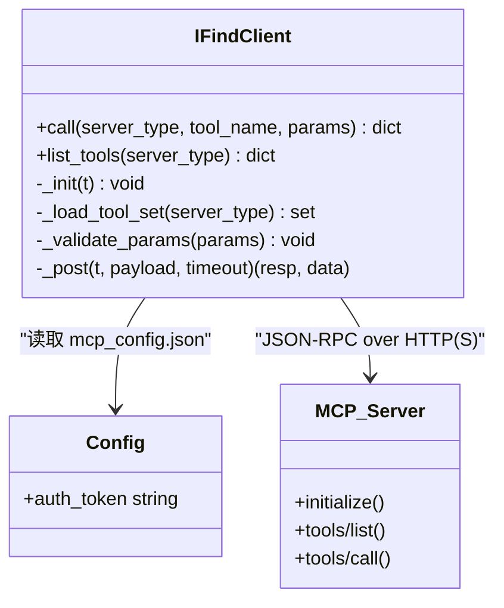
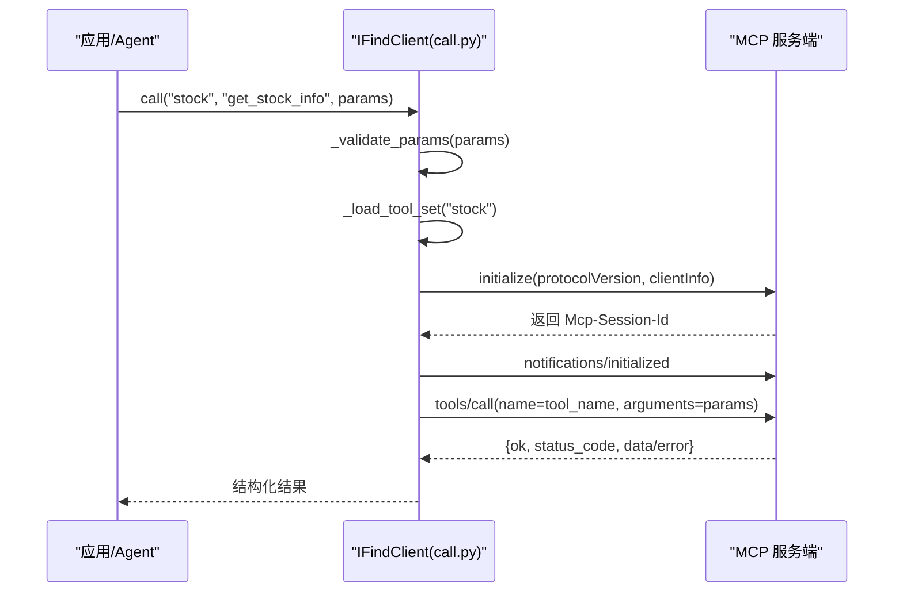
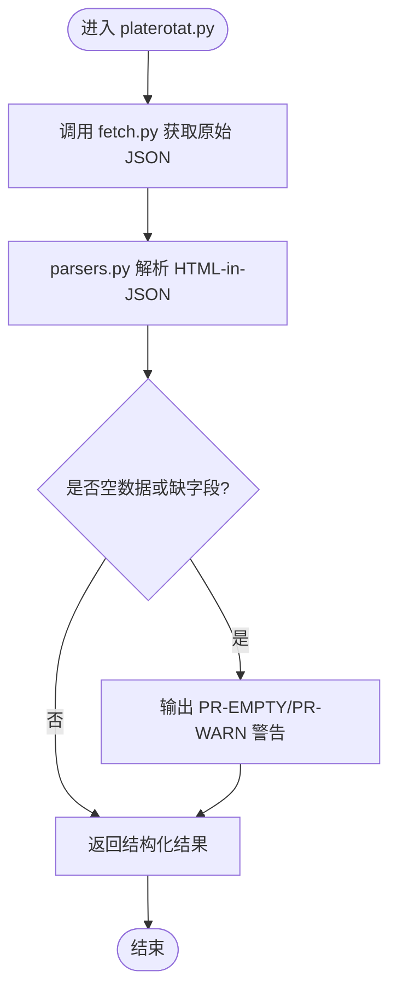
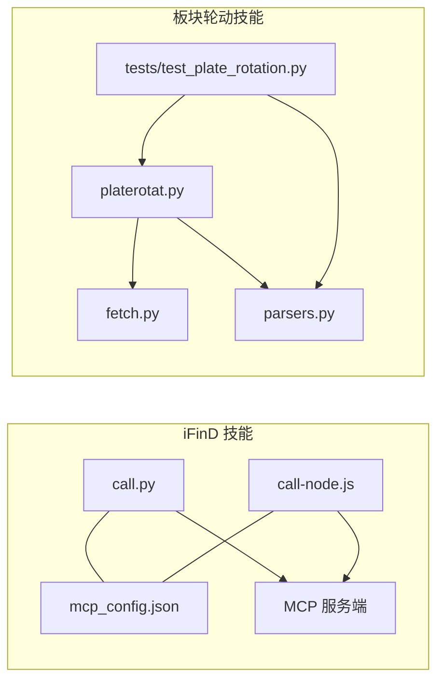

# 技能注册与发现机制

<cite>
**本文引用的文件**   
- [README.MD](file://README.MD)
- [SKILL.md](file://skills/ifind-finance-data-1.3.0/SKILL.md)
- [mcp_config.json](file://skills/ifind-finance-data-1.3.0/mcp_config.json)
- [call.py](file://skills/ifind-finance-data-1.3.0/call.py)
- [call-node.js](file://skills/ifind-finance-data-1.3.0/call-node.js)
- [README.md](file://skills/plate-rotation-skill/README.md)
- [CLAUDE.md](file://skills/plate-rotation-skill/CLAUDE.md)
- [platerotat.py](file://skills/plate-rotation-skill/scripts/platerotat.py)
- [parsers.py](file://skills/plate-rotation-skill/scripts/parsers.py)
- [test_plate_rotation.py](file://skills/plate-rotation-skill/tests/test_plate_rotation.py)
</cite>

## 目录
1. [引言](#引言)
2. [项目结构](#项目结构)
3. [核心组件](#核心组件)
4. [架构总览](#架构总览)
5. [详细组件分析](#详细组件分析)
6. [依赖关系分析](#依赖关系分析)
7. [性能考虑](#性能考虑)
8. [故障排查指南](#故障排查指南)
9. [结论](#结论)
10. [附录](#附录)

## 引言
本文件面向开发者，系统化阐述本仓库中“技能（Skill）”的注册与发现机制、插件化架构设计原理、生命周期管理、依赖注入与事件处理思路，并给出从创建到部署的完整流程示例。同时覆盖冲突处理、版本兼容性与热重载策略，以及调试与性能优化建议。

本项目采用“以文档契约驱动 + 脚本能力封装”的技能形态：每个技能是一个独立目录，包含元数据与使用说明（如 SKILL.md）、可执行或可调用的实现脚本（Python/Node），并通过约定式路径被上层 Agent 扫描与加载。iFinD 金融数据查询技能通过 MCP 协议与远程服务交互；板块轮动技能则通过本地脚本组合多个公开接口完成数据分析。

## 项目结构
仓库根目录下的 skills 目录是技能的物理存放位置。每个子目录代表一个技能包，内部包含：
- 元数据与说明：SKILL.md、README.md、CLAUDE.md 等
- 配置与密钥：mcp_config.json 等
- 实现脚本：Python/Node 脚本，提供对外函数或 CLI
- 参考文档：references/ 下按服务域划分的文档
- 测试：tests/ 集成测试用例

图表来源
- [README.MD:1-25](file://README.MD#L1-L25)
- [SKILL.md:1-10](file://skills/ifind-finance-data-1.3.0/SKILL.md#L1-L10)
- [README.md:1-30](file://skills/plate-rotation-skill/README.md#L1-L30)

章节来源
- [README.MD:1-25](file://README.MD#L1-L25)

## 核心组件
- 技能元数据与契约
  - iFinD 金融数据查询：SKILL.md 定义名称、描述、版本、作者、使用方式、注意事项、list_tools 使用顺序等。
  - 板块轮动：README.md 与 CLAUDE.md 定义安装、触发方式、方法论与纪律；SKILL.md 作为根契约（在 plate-rotation-skill 目录下）。
- 运行时实现
  - iFinD：call.py 与 call-node.js 提供 Python/Node 两套调用封装，遵循 MCP JSON-RPC 协议，维护会话与会话 ID，缓存工具集。
  - 板块轮动：scripts/platerotat.py 暴露高级 API（today_top/find_dragon_kings/top1_curve/plate_strength），底层通过 fetch.py 调用外部接口，再由 parsers.py 解析 HTML-in-JSON 响应。
- 配置与鉴权
  - mcp_config.json 存储 auth_token，供两个语言实现读取。
- 测试与验证
  - tests/test_plate_rotation.py 对在线接口健康、解析器、高级 API 签名与返回结构、CLI 双模进行集成测试。

章节来源
- [SKILL.md:1-111](file://skills/ifind-finance-data-1.3.0/SKILL.md#L1-L111)
- [call.py:1-208](file://skills/ifind-finance-data-1.3.0/call.py#L1-L208)
- [call-node.js:1-267](file://skills/ifind-finance-data-1.3.0/call-node.js#L1-L267)
- [README.md:1-188](file://skills/plate-rotation-skill/README.md#L1-L188)
- [CLAUDE.md:1-127](file://skills/plate-rotation-skill/CLAUDE.md#L1-L127)
- [platerotat.py:1-315](file://skills/plate-rotation-skill/scripts/platerotat.py#L1-L315)
- [parsers.py:1-212](file://skills/plate-rotation-skill/scripts/parsers.py#L1-L212)
- [test_plate_rotation.py:1-45](file://skills/plate-rotation-skill/tests/test_plate_rotation.py#L1-L45)

## 架构总览
整体采用“插件化目录 + 文档契约 + 脚本能力”的模式：
- 扫描路径：skills/ 目录下的每个子目录视为一个技能包。
- 元数据解析：优先读取 SKILL.md（若存在），否则回退到 README.md/CLAUDE.md 中的关键信息。
- 注册表管理：Agent 启动时构建“技能清单”，记录 name/version/description/source_dir/entrypoint 等信息。
- 能力发现：根据用户意图匹配相关 references/ 文档，再选择对应 server_type 或脚本入口。
- 运行时：iFinD 走 MCP 协议；板块轮动走本地脚本组合。

图表来源
- [SKILL.md:1-111](file://skills/ifind-finance-data-1.3.0/SKILL.md#L1-L111)
- [call.py:85-171](file://skills/ifind-finance-data-1.3.0/call.py#L85-L171)
- [call-node.js:149-220](file://skills/ifind-finance-data-1.3.0/call-node.js#L149-L220)
- [platerotat.py:100-219](file://skills/plate-rotation-skill/scripts/platerotat.py#L100-L219)

## 详细组件分析

### iFinD 金融数据查询技能（MCP 客户端）
- 元数据与契约
  - SKILL.md 定义了 skill 名称、版本、描述、使用方法、注意事项、list_tools 使用顺序等。
- 配置与鉴权
  - mcp_config.json 提供 auth_token，Python/Node 实现均从同目录读取。
- 会话与工具集管理
  - 首次调用前执行 initialize，获取 Mcp-Session-Id 并在后续请求携带。
  - 首次调用 list_tools 后缓存允许的工具名集合，避免重复网络开销。
- 参数校验与安全
  - 拒绝非法类型、NaN/Inf、受保护键（__proto__/prototype/constructor）。
- 错误处理
  - HTTP 状态码 >= 400 抛出异常；服务端 error 字段统一包装为 ok=false 的结构返回。

图表来源
- [call.py:1-208](file://skills/ifind-finance-data-1.3.0/call.py#L1-L208)
- [call-node.js:1-267](file://skills/ifind-finance-data-1.3.0/call-node.js#L1-L267)
- [mcp_config.json:1-3](file://skills/ifind-finance-data-1.3.0/mcp_config.json#L1-L3)

章节来源
- [SKILL.md:1-111](file://skills/ifind-finance-data-1.3.0/SKILL.md#L1-L111)
- [call.py:85-171](file://skills/ifind-finance-data-1.3.0/call.py#L85-L171)
- [call-node.js:149-220](file://skills/ifind-finance-data-1.3.0/call-node.js#L149-L220)
- [mcp_config.json:1-3](file://skills/ifind-finance-data-1.3.0/mcp_config.json#L1-L3)

#### 调用序列（Python 实现）

图表来源
- [call.py:85-171](file://skills/ifind-finance-data-1.3.0/call.py#L85-L171)

### 板块轮动技能（本地脚本组合）
- 元数据与契约
  - README.md 提供安装、用法、能力概览与风险声明；CLAUDE.md 明确 SKILL.md 为根契约，逻辑与文档分离。
- 高级 API
  - platerotat.py 暴露四个 helper：today_top/find_dragon_kings/top1_curve/plate_strength，屏蔽底层细节。
- 数据源与解析
  - 通过 fetch.py 调用外部接口，返回 HTML-in-JSON；parsers.py 用正则抽取结构化数据。
- 运行时校验
  - 空数据或缺关键字段时输出 PR-EMPTY/PR-WARN 警告，便于下游区分节假日/跨源错传/上游异常。

图表来源
- [platerotat.py:100-219](file://skills/plate-rotation-skill/scripts/platerotat.py#L100-L219)
- [parsers.py:18-175](file://skills/plate-rotation-skill/scripts/parsers.py#L18-L175)

章节来源
- [README.md:1-188](file://skills/plate-rotation-skill/README.md#L1-L188)
- [CLAUDE.md:1-127](file://skills/plate-rotation-skill/CLAUDE.md#L1-L127)
- [platerotat.py:1-315](file://skills/plate-rotation-skill/scripts/platerotat.py#L1-L315)
- [parsers.py:1-212](file://skills/plate-rotation-skill/scripts/parsers.py#L1-L212)

## 依赖关系分析
- 模块内依赖
  - iFinD：call.py/call-node.js 依赖 mcp_config.json；两者互相等价实现，分别基于 requests 与 Node 原生 http/https。
  - 板块轮动：platerotat.py 依赖 scripts/fetch.py 与 parsers.py；tests 依赖同一套脚本。
- 外部依赖
  - iFinD：MCP 服务端（HTTP/HTTPS），需有效 auth_token。
  - 板块轮动：外部公开接口（Referer 校验自动注入），无需额外 API Key。
- 潜在耦合点
  - 工具集缓存：若服务端变更工具名，需刷新缓存或重新 list_tools。
  - HTML 解析：若上游模板变化，parsers.py 正则需同步更新。

图表来源
- [call.py:1-208](file://skills/ifind-finance-data-1.3.0/call.py#L1-L208)
- [call-node.js:1-267](file://skills/ifind-finance-data-1.3.0/call-node.js#L1-L267)
- [mcp_config.json:1-3](file://skills/ifind-finance-data-1.3.0/mcp_config.json#L1-L3)
- [platerotat.py:1-315](file://skills/plate-rotation-skill/scripts/platerotat.py#L1-L315)
- [parsers.py:1-212](file://skills/plate-rotation-skill/scripts/parsers.py#L1-L212)
- [test_plate_rotation.py:1-45](file://skills/plate-rotation-skill/tests/test_plate_rotation.py#L1-L45)

章节来源
- [call.py:1-208](file://skills/ifind-finance-data-1.3.0/call.py#L1-L208)
- [call-node.js:1-267](file://skills/ifind-finance-data-1.3.0/call-node.js#L1-L267)
- [platerotat.py:1-315](file://skills/plate-rotation-skill/scripts/platerotat.py#L1-L315)
- [parsers.py:1-212](file://skills/plate-rotation-skill/scripts/parsers.py#L1-L212)
- [test_plate_rotation.py:1-45](file://skills/plate-rotation-skill/tests/test_plate_rotation.py#L1-L45)

## 性能考虑
- 会话复用与工具集缓存
  - iFinD 客户端维护会话 ID 与工具集缓存，减少初始化与 list_tools 的网络开销。
- 并发限制
  - iFinD 免费用户并发上限较低，应在上层做限流与重试退避。
- 解析效率
  - 板块轮动的 HTML-in-JSON 解析使用正则，建议在大数据量场景下预编译正则与批量处理。
- I/O 与超时
  - 合理设置请求超时与重试次数，避免长尾阻塞。

[本节为通用指导，不直接分析具体文件]

## 故障排查指南
- iFinD 技能
  - 认证失败：检查 mcp_config.json 中的 auth_token 是否有效。
  - 工具不存在：先尝试 list_tools 获取当前可用工具列表，再调整 tool_name。
  - 参数校验失败：确认 params 为合法 JSON 对象，不含受保护键与非法数值。
  - 会话未建立：确保 initialize 成功且收到 Mcp-Session-Id。
- 板块轮动技能
  - 空数据：关注 stderr 中的 PR-EMPTY/PR-WARN 提示，常见原因包括周末/节假日、跨源错传、上游异常。
  - 解析异常：检查 parsers.py 正则是否与上游 HTML 模板一致。
  - 集成测试：运行 tests/test_plate_rotation.py 验证接口健康与解析正确性。

章节来源
- [SKILL.md:90-111](file://skills/ifind-finance-data-1.3.0/SKILL.md#L90-L111)
- [call.py:119-171](file://skills/ifind-finance-data-1.3.0/call.py#L119-L171)
- [call-node.js:117-220](file://skills/ifind-finance-data-1.3.0/call-node.js#L117-L220)
- [platerotat.py:75-98](file://skills/plate-rotation-skill/scripts/platerotat.py#L75-L98)
- [test_plate_rotation.py:1-45](file://skills/plate-rotation-skill/tests/test_plate_rotation.py#L1-L45)

## 结论
本仓库采用“文档契约 + 脚本能力”的轻量插件化模式，通过约定式目录结构与元数据文件实现技能的自描述与可发现。iFinD 技能遵循 MCP 协议，具备会话管理与工具集缓存；板块轮动技能通过脚本组合与解析器将非结构化响应转化为稳定 API。该设计易于扩展与维护，适合在 AI Agent 生态中快速集成新数据能力。

[本节为总结性内容，不直接分析具体文件]

## 附录

### 技能注册与发现流程（端到端示例）
- 准备阶段
  - 在 skills/ 下新增目录，例如 my-new-skill/。
  - 编写 SKILL.md（或 README.md/CLAUDE.md），包含 name、version、description、author、homepage、使用方法与注意事项。
  - 如需鉴权，放置 mcp_config.json 并提供必要密钥。
- 实现阶段
  - 提供可调用入口：Python 模块函数或 Node 模块导出；或提供 CLI 脚本。
  - 若对接 MCP 服务，遵循 initialize/tools/list/tools/call 流程，并做好参数校验与错误处理。
  - 若解析第三方 HTML-in-JSON，沉淀解析器到独立模块，便于测试与复用。
- 测试阶段
  - 编写集成测试，覆盖接口健康、解析器、API 签名与返回结构、CLI 双模。
- 部署阶段
  - 将目录放入 skills/，Agent 启动时扫描并注册。
  - 按需加载 references/ 文档，结合用户意图选择 server_type 或脚本入口。

章节来源
- [SKILL.md:1-111](file://skills/ifind-finance-data-1.3.0/SKILL.md#L1-L111)
- [README.md:1-188](file://skills/plate-rotation-skill/README.md#L1-L188)
- [CLAUDE.md:1-127](file://skills/plate-rotation-skill/CLAUDE.md#L1-L127)
- [call.py:1-208](file://skills/ifind-finance-data-1.3.0/call.py#L1-L208)
- [call-node.js:1-267](file://skills/ifind-finance-data-1.3.0/call-node.js#L1-L267)
- [test_plate_rotation.py:1-45](file://skills/plate-rotation-skill/tests/test_plate_rotation.py#L1-L45)

### 冲突处理与版本兼容性
- 命名冲突
  - 以 SKILL.md 的 name 为准；若出现同名，可在目录名中加入版本号或业务标识，并在注册表中以目录路径为唯一键。
- 版本兼容
  - 在 SKILL.md 中声明 version；Agent 可根据最小/最大版本约束决定是否加载。
  - 对于 MCP 工具集变更，优先使用 list_tools 动态发现，避免硬编码。
- 热重载
  - 建议实现“监听目录变更 → 重新扫描 → 增量更新注册表”的机制；对已运行的会话保持隔离，避免中断。

[本节为通用指导，不直接分析具体文件]

### 调试技巧与性能优化
- 日志与告警
  - 借鉴板块轮动的 PR-EMPTY/PR-WARN 模式，在关键分支输出结构化告警，便于 grep 定位问题。
- 单元测试与集成测试
  - 对解析器与高级 API 编写单测；对在线接口编写集成测试，保证稳定性。
- 性能优化
  - 缓存工具集与会话；对高频调用增加本地缓存层；合理设置超时与重试退避。

[本节为通用指导，不直接分析具体文件]