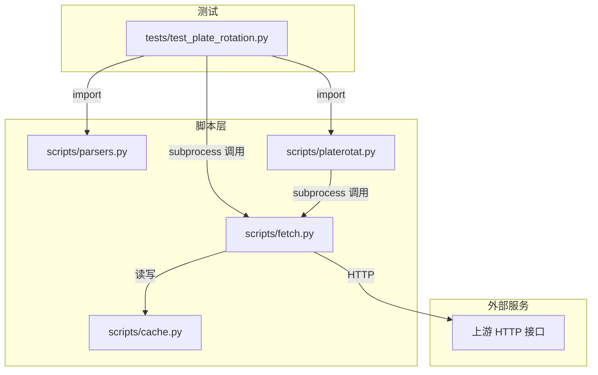
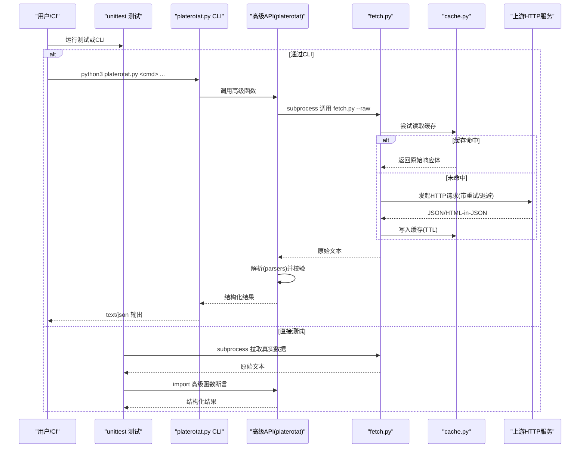
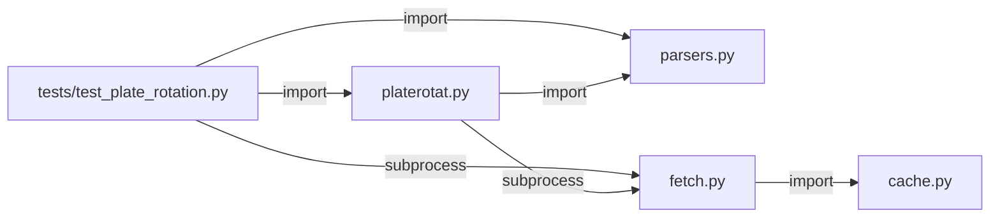

# 技能测试与调试

<cite>
**本文引用的文件**   
- [README.MD](file://README.MD)
- [test_plate_rotation.py](file://skills/plate-rotation-skill/tests/test_plate_rotation.py)
- [fetch.py](file://skills/plate-rotation-skill/scripts/fetch.py)
- [parsers.py](file://skills/plate-rotation-skill/scripts/parsers.py)
- [platerotat.py](file://skills/plate-rotation-skill/scripts/platerotat.py)
- [cache.py](file://skills/plate-rotation-skill/scripts/cache.py)
- [_meta.md](file://skills/plate-rotation-skill/learned/_meta.md)
</cite>

## 目录
1. [简介](#简介)
2. [项目结构](#项目结构)
3. [核心组件](#核心组件)
4. [架构总览](#架构总览)
5. [详细组件分析](#详细组件分析)
6. [依赖关系分析](#依赖关系分析)
7. [性能考量](#性能考量)
8. [故障排查指南](#故障排查指南)
9. [结论](#结论)
10. [附录](#附录)

## 简介
本指南面向开发者，围绕“板块轮动”Skill 的测试与调试实践，提供从单元测试、集成测试到端到端（CLI）验证的全链路方法；同时覆盖日志分析、性能监控、问题定位、外部依赖模拟与环境搭建、常见调试场景与解决方案、以及自动化测试与持续集成的落地建议。内容基于仓库现有实现与测试用例进行系统化总结，帮助读者快速建立稳定可靠的测试与调试体系。

## 项目结构
该 Skill 采用“网络调用层 + 解析层 + 高级封装层 + CLI”的分层设计，测试位于 tests 目录，使用 Python 标准库 unittest 组织在线集成测试。

图表来源
- [test_plate_rotation.py:1-444](file://skills/plate-rotation-skill/tests/test_plate_rotation.py#L1-L444)
- [fetch.py:1-230](file://skills/plate-rotation-skill/scripts/fetch.py#L1-L230)
- [parsers.py:1-212](file://skills/plate-rotation-skill/scripts/parsers.py#L1-L212)
- [platerotat.py:1-315](file://skills/plate-rotation-skill/scripts/platerotat.py#L1-L315)
- [cache.py:1-145](file://skills/plate-rotation-skill/scripts/cache.py#L1-L145)

章节来源
- [README.MD:1-81](file://README.MD#L1-L81)

## 核心组件
- fetch.py：统一网络调用器，负责参数组装、请求头注入、重试退避、缓存命中/落盘、输出格式化。
- cache.py：本地磁盘缓存原子层，支持 TTL、全局开关、统计与清理。
- parsers.py：HTML-in-JSON 解析器，将服务端返回的 HTML 片段抽取为结构化数据。
- platerotat.py：高级 API 与 CLI，组合 fetch+parsers，暴露 today_top/find_dragon_kings/top1_curve/plate_strength 四个意图函数，并提供 text/json 双模输出。
- test_plate_rotation.py：在线集成测试套件，覆盖 endpoint 健康、解析正确性、高级 helper 签名与返回结构、自动路由、CLI 子命令等。

章节来源
- [fetch.py:1-230](file://skills/plate-rotation-skill/scripts/fetch.py#L1-L230)
- [cache.py:1-145](file://skills/plate-rotation-skill/scripts/cache.py#L1-L145)
- [parsers.py:1-212](file://skills/plate-rotation-skill/scripts/parsers.py#L1-L212)
- [platerotat.py:1-315](file://skills/plate-rotation-skill/scripts/platerotat.py#L1-L315)
- [test_plate_rotation.py:1-444](file://skills/plate-rotation-skill/tests/test_plate_rotation.py#L1-L444)

## 架构总览
下图展示了从测试到上层 CLI 的完整调用链路与关键交互点。

图表来源
- [test_plate_rotation.py:1-444](file://skills/plate-rotation-skill/tests/test_plate_rotation.py#L1-L444)
- [platerotat.py:1-315](file://skills/plate-rotation-skill/scripts/platerotat.py#L1-L315)
- [fetch.py:1-230](file://skills/plate-rotation-skill/scripts/fetch.py#L1-L230)
- [cache.py:1-145](file://skills/plate-rotation-skill/scripts/cache.py#L1-L145)

## 详细组件分析

### 网络调用层（fetch.py）
- 职责：统一 host 别名解析、参数拼装、请求头注入、指数退避重试、缓存命中/落盘、输出美化。
- 关键点：
  - 重试策略：对 429/5xx 及网络异常进行指数退避，最大次数可配。
  - 缓存策略：POST 默认启用，TTL 可配置，支持环境变量关闭。
  - 输出模式：--raw 输出原始字符串，否则尝试 JSON 美化。
- 测试要点：
  - 在测试中通过 _Fixtures.get 复用一次拉取的响应，避免重复打网。
  - 断言返回字典结构与关键字段存在性。

章节来源
- [fetch.py:1-230](file://skills/plate-rotation-skill/scripts/fetch.py#L1-L230)
- [test_plate_rotation.py:48-76](file://skills/plate-rotation-skill/tests/test_plate_rotation.py#L48-L76)

### 缓存层（cache.py）
- 职责：按 host+path+params 生成稳定 key，落盘 JSON，支持 TTL、全局禁用、统计与清理。
- 关键点：
  - 原子写：先写 .tmp 再 replace，避免半写文件。
  - 全局开关：PR_CACHE_DISABLE=1 时全部跳过。
  - 诊断：stats/clear 便于运维与排障。
- 测试要点：
  - 可通过 PR_CACHE_DISABLE 或 --no-cache 控制行为，确保测试路径覆盖命中与未命中分支。

章节来源
- [cache.py:1-145](file://skills/plate-rotation-skill/scripts/cache.py#L1-L145)

### 解析层（parsers.py）
- 职责：将“HTML 片段嵌在 JSON 的 html 字段里”的服务端响应解析为结构化数据。
- 关键点：
  - parse_plate_rotat：兼容 ths（值带%）与 kaipan（纯数字分），value_type 区分语义。
  - parse_plate_rotat_dates/matrix：日期序列与 N×天矩阵对齐。
  - parse_plate_long_heads：兼容“无领涨”td 闭合差异，保证 heads 与 dates 对齐。
  - rank_plate_long_persistence：跨天统计龙头出现频次，用于“妖王榜”。
- 测试要点：
  - 针对双源 value 格式差异做反向断言，防止正则误匹配。
  - 断言日期格式、排序、去重与矩阵维度一致性。

章节来源
- [parsers.py:1-212](file://skills/plate-rotation-skill/scripts/parsers.py#L1-L212)
- [test_plate_rotation.py:120-244](file://skills/plate-rotation-skill/tests/test_plate_rotation.py#L120-L244)

### 高级 API 与 CLI（platerotat.py）
- 职责：组合 fetch+parsers，暴露四个高级函数，并提供 CLI 子命令 today/wangking/curve/strength，text/json 双模输出。
- 关键点：
  - 自动路由：根据 platecode 前缀选择 source（88x→ths，80x/803x→kaipan）。
  - 运行时校验：空数据或缺关键字段时输出 PR-EMPTY/PR-WARN 警告，辅助下游识别原因。
  - CLI：argparse 子命令 + choices 校验，缺参/非法参数应报错退出。
- 测试要点：
  - 断言返回值包含必要键、长度限制生效、top5_names 非 None。
  - 覆盖 88x/80x 自动路由路径。
  - 通过 subprocess 调用 CLI，断言 text/json 输出内容与结构。

章节来源
- [platerotat.py:1-315](file://skills/plate-rotation-skill/scripts/platerotat.py#L1-L315)
- [test_plate_rotation.py:246-444](file://skills/plate-rotation-skill/tests/test_plate_rotation.py#L246-L444)

### 在线集成测试套件（test_plate_rotation.py）
- 目标：验证在线接口健康、解析正确性、高级 helper 签名与返回结构、自动路由、CLI 子命令。
- 设计：
  - 共享 fixture：_Fixtures.get 用 fetch.py --raw 拉一次数据并在内存缓存复用，减少网络抖动影响。
  - 分层断言：endpoint → parsers → helpers → CLI。
  - 错误路径：无子命令、非法 --source 应返回非零退出码。
- 运行方式：
  - 直接执行或 unittest 模块方式。

章节来源
- [test_plate_rotation.py:1-444](file://skills/plate-rotation-skill/tests/test_plate_rotation.py#L1-L444)

## 依赖关系分析
- 耦合与内聚：
  - fetch.py 与 cache.py 低耦合，仅通过函数接口交互。
  - parsers.py 不感知网络细节，专注 HTML 解析。
  - platerotat.py 聚合 fetch+parsers，对外暴露高层 API 与 CLI。
  - 测试通过 import 与 subprocess 两种方式覆盖两条路径。
- 外部依赖：
  - 上游 HTTP 服务（duanxianxia.com 域名集合）。
  - 本地文件系统（缓存目录）。
- 潜在循环依赖：无。

图表来源
- [test_plate_rotation.py:1-444](file://skills/plate-rotation-skill/tests/test_plate_rotation.py#L1-L444)
- [platerotat.py:1-315](file://skills/plate-rotation-skill/scripts/platerotat.py#L1-L315)
- [parsers.py:1-212](file://skills/plate-rotation-skill/scripts/parsers.py#L1-L212)
- [fetch.py:1-230](file://skills/plate-rotation-skill/scripts/fetch.py#L1-L230)
- [cache.py:1-145](file://skills/plate-rotation-skill/scripts/cache.py#L1-L145)

## 性能考量
- 网络重试与退避：指数退避降低瞬时失败率，但会增加整体耗时；建议在 CI 中设置合理超时与最大重试次数。
- 缓存命中率：POST 默认开启缓存，TTL 默认 1h；盘中实时分析需显式 --no-cache 或 PR_CACHE_DISABLE=1。
- I/O 原子写：缓存写入采用 tmp+replace，避免脏读，提升稳定性。
- 解析复杂度：正则匹配与 finditer 遍历 HTML，注意输入规模与边界情况，必要时增加断言约束输入大小。

[本节为通用指导，无需特定文件引用]

## 故障排查指南
- 常见问题与定位
  - 接口返回空数据：检查是否为周末/节假日、days 是否超前、platecode 与 source 是否匹配。
  - 4xx/429/5xx 错误：查看 stderr 中的 PR-EMPTY/PR-WARN 提示与 fetch 层重试日志。
  - 缓存导致数据陈旧：使用 --no-cache 或 PR_CACHE_DISABLE=1 强制刷新；必要时清理旧缓存。
  - CLI 参数错误：缺少子命令或非法 --source 会直接报错退出，确认参数合法性。
- 诊断工具
  - cache.py stats/clear：查看缓存占用与清理过期条目。
  - fetch.py -v：打印 URL/body/cookie 摘要与重试过程，便于复现问题。
  - 测试套件：优先运行在线集成测试，快速判断是解析逻辑还是上游接口问题。

章节来源
- [platerotat.py:73-98](file://skills/plate-rotation-skill/scripts/platerotat.py#L73-L98)
- [fetch.py:128-230](file://skills/plate-rotation-skill/scripts/fetch.py#L128-L230)
- [cache.py:119-145](file://skills/plate-rotation-skill/scripts/cache.py#L119-L145)
- [_meta.md:1-40](file://skills/plate-rotation-skill/learned/_meta.md#L1-L40)

## 结论
通过分层设计与完善的在线集成测试，该 Skill 在网络波动、上游接口变更与多源数据差异下仍具备较强鲁棒性。建议在日常开发与 CI 中：
- 以在线集成测试为主，辅以必要的离线断言；
- 利用 PR-EMPTY/PR-WARN 与 fetch -v 快速定位问题；
- 合理使用缓存与重试策略，平衡实时性与稳定性；
- 定期清理缓存，避免磁盘膨胀。

[本节为总结性内容，无需特定文件引用]

## 附录

### 测试框架与最佳实践
- 使用 unittest 组织测试类与方法，按“底层接口 → 解析 → 高级 API → CLI”分层断言。
- 共享 fixture 缓存一次网络响应，提高测试稳定性与速度。
- 对边界与异常路径进行断言（空数据、非法参数、跨源错传）。
- 保持 text/json 双模输出的契约一致，分别断言可读性与结构完整性。

章节来源
- [test_plate_rotation.py:1-444](file://skills/plate-rotation-skill/tests/test_plate_rotation.py#L1-L444)

### 外部依赖模拟与测试环境搭建
- 模拟上游接口：
  - 使用 fetch.py --no-cache 与 --raw 获取真实响应后，保存为静态样本供离线测试。
  - 通过 PR_CACHE_DISABLE=1 与 --no-cookie 控制网络与认证相关副作用。
- 本地环境：
  - 准备 cookie 文件 ~/.plate_rotation_cookie（如需要）。
  - 调整 PR_CACHE_TTL 或 PR_CACHE_DIR 以适配不同测试场景。

章节来源
- [fetch.py:128-230](file://skills/plate-rotation-skill/scripts/fetch.py#L128-L230)
- [cache.py:35-44](file://skills/plate-rotation-skill/scripts/cache.py#L35-L44)

### 自动化测试与持续集成
- 本地运行：
  - python3 -m unittest skills.plate-rotation-skill.tests.test_plate_rotation -v
- CI 建议：
  - 设置网络超时与重试上限，避免长时间阻塞。
  - 允许部分网络不稳定导致的失败重试机制。
  - 记录 stderr 中的 PR-EMPTY/PR-WARN 以便快速定位。
  - 定期清理缓存目录，避免构建产物膨胀。

章节来源
- [test_plate_rotation.py:13-18](file://skills/plate-rotation-skill/tests/test_plate_rotation.py#L13-L18)
- [platerotat.py:73-98](file://skills/plate-rotation-skill/scripts/platerotat.py#L73-L98)

### 常见调试场景与解决方案
- 场景一：今日 Top 为空
  - 可能原因：周末/节假日、days 超前、source 与 platecode 不匹配。
  - 解决：检查系统时间、缩小 days、确认 88x/80x 前缀与 source 对应关系。
- 场景二：妖王榜无数据
  - 可能原因：板块长期不活跃、跨源错传。
  - 解决：更换热门板块代码、确认自动路由是否正确。
- 场景三：CLI 报错退出
  - 可能原因：缺少子命令、非法 --source。
  - 解决：补全子命令、修正 choices 参数。

章节来源
- [platerotat.py:100-218](file://skills/plate-rotation-skill/scripts/platerotat.py#L100-L218)
- [test_plate_rotation.py:330-444](file://skills/plate-rotation-skill/tests/test_plate_rotation.py#L330-L444)