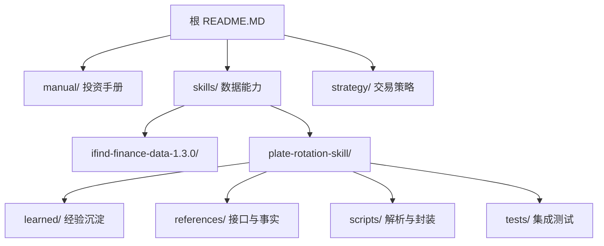
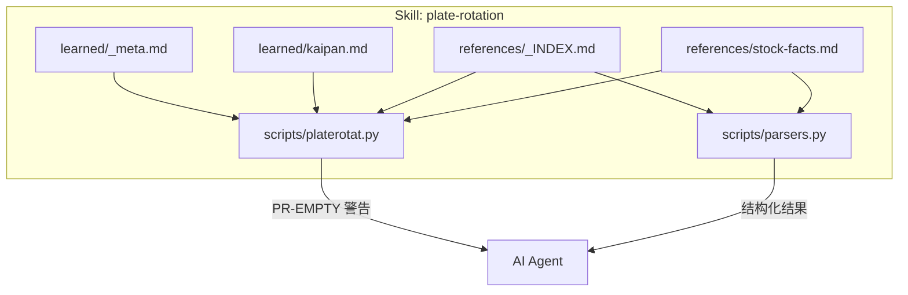
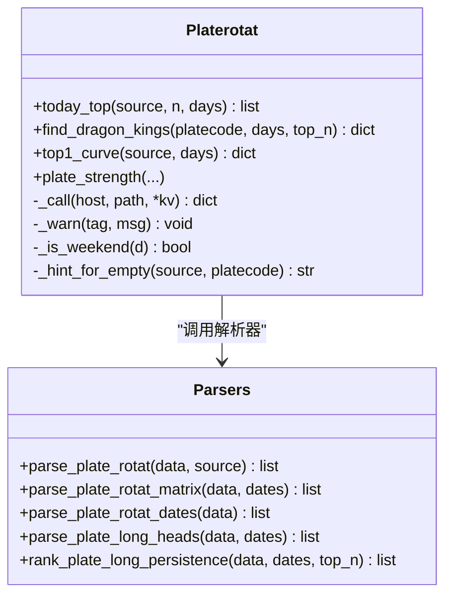
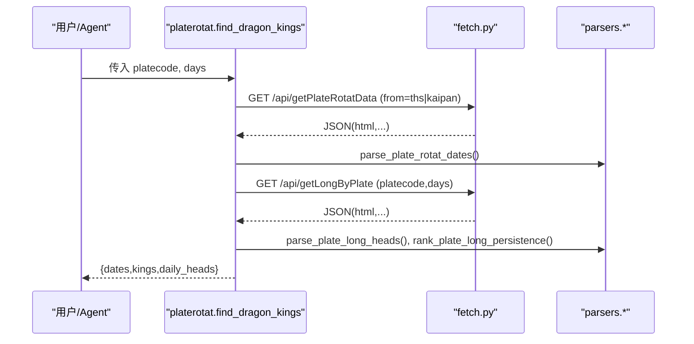
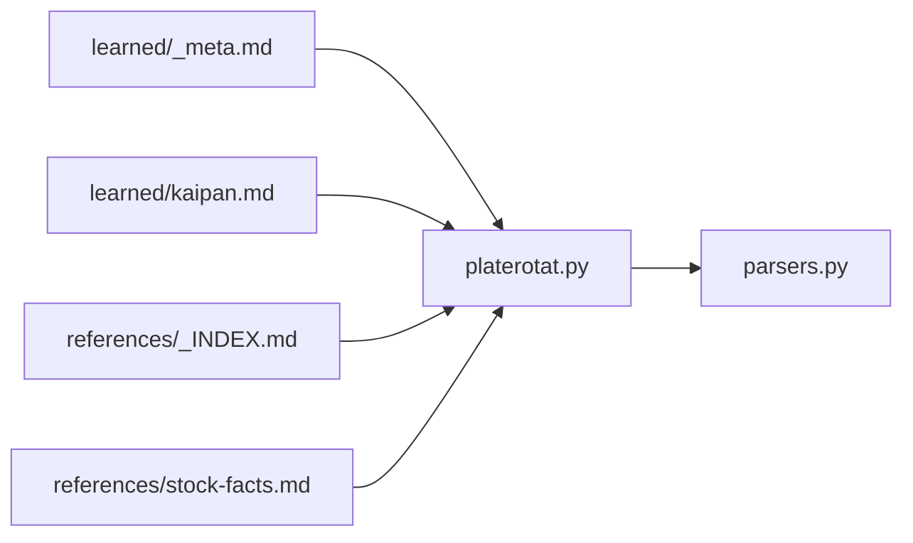

# learned目录规范

<cite>
**本文引用的文件**   
- [README.MD](file://README.MD)
- [plate-rotation/README.md](file://skills/plate-rotation-skill/README.md)
- [plate-rotation/_meta.md](file://skills/plate-rotation-skill/learned/_meta.md)
- [plate-rotation/kaipan.md](file://skills/plate-rotation-skill/learned/kaipan.md)
- [plate-rotation/_INDEX.md](file://skills/plate-rotation-skill/references/_INDEX.md)
- [plate-rotation/stock-facts.md](file://skills/plate-rotation-skill/references/stock-facts.md)
- [platerotat.py](file://skills/plate-rotation-skill/scripts/platerotat.py)
- [parsers.py](file://skills/plate-rotation-skill/scripts/parsers.py)
</cite>

## 目录
1. [引言](#引言)
2. [项目结构](#项目结构)
3. [核心组件](#核心组件)
4. [架构总览](#架构总览)
5. [详细组件分析](#详细组件分析)
6. [依赖关系分析](#依赖关系分析)
7. [性能与可靠性](#性能与可靠性)
8. [故障排查指南](#故障排查指南)
9. [结论](#结论)
10. [附录：模板与示例](#附录模板与示例)

## 引言
本规范面向开发者，定义 learned 目录的知识管理规范，覆盖学习记录与领域知识的组织方式、元数据管理、知识条目编写与版本控制策略；同时说明 AI Agent 学习内容的格式规范（结构化数据定义、上下文关联、检索优化），并提供完整的学习记录示例（市场规则、交易策略与分析方法）。最后给出知识图谱构建、语义搜索与智能推荐机制的落地建议，以及知识库维护与更新流程，确保知识的准确性与时效性。

## 项目结构
仓库采用“认知—能力—决策”的分层设计：manual 沉淀指标与体系总纲，skills 提供数据能力，strategy 管理交易决策规则。learned 目录位于各 skill 内部，用于沉淀跨源经验与源专属经验，作为 Agent 可消费的结构化知识。

图示来源
- [README.MD:1-26](file://README.MD#L1-L26)
- [plate-rotation/README.md:1-30](file://skills/plate-rotation-skill/README.md#L1-L30)

章节来源
- [README.MD:1-26](file://README.MD#L1-L26)
- [plate-rotation/README.md:1-30](file://skills/plate-rotation-skill/README.md#L1-L30)

## 核心组件
- learned/_meta.md：跨源通用经验沉淀，按日期分节，固定三段式“现象/根因/应对”，并附带教训与回归要求。
- learned/kaipan.md：开盘啦源专属经验，聚焦字段陷阱、解读哲学与路由速记。
- references/_INDEX.md：接口路由表、双源差异、板块前缀强语义、days/dates 入参约定。
- references/stock-facts.md：A 股领域惰性知识清单，涵盖接口层陷阱、通用事实与不覆盖范围。
- scripts/platerotat.py：高级 API 封装，统一运行时校验与 PR-EMPTY 警告通道。
- scripts/parsers.py：HTML-in-JSON 解析器，沉淀解析正则与边界处理。

章节来源
- [plate-rotation/_meta.md:1-47](file://skills/plate-rotation-skill/learned/_meta.md#L1-L47)
- [plate-rotation/kaipan.md:1-46](file://skills/plate-rotation-skill/learned/kaipan.md#L1-L46)
- [plate-rotation/_INDEX.md:1-43](file://skills/plate-rotation-skill/references/_INDEX.md#L1-L43)
- [plate-rotation/stock-facts.md:1-118](file://skills/plate-rotation-skill/references/stock-facts.md#L1-L118)
- [platerotat.py:1-200](file://skills/plate-rotation-skill/scripts/platerotat.py#L1-L200)
- [parsers.py:1-200](file://skills/plate-rotation-skill/scripts/parsers.py#L1-L200)

## 架构总览
learned 目录与 references、scripts 形成“经验—事实—实现”闭环：
- learned 沉淀“怎么做对”的经验与踩坑记录，供 Agent 在推理时参考。
- references 提供“不可变的事实与契约”，如接口路由、单位与前缀约束。
- scripts 将事实与经验固化为可执行逻辑，并在异常路径输出标准化警告，便于下游 Agent 识别与自愈。

图示来源
- [plate-rotation/_meta.md:1-47](file://skills/plate-rotation-skill/learned/_meta.md#L1-L47)
- [plate-rotation/kaipan.md:1-46](file://skills/plate-rotation-skill/learned/kaipan.md#L1-L46)
- [plate-rotation/_INDEX.md:1-43](file://skills/plate-rotation-skill/references/_INDEX.md#L1-L43)
- [plate-rotation/stock-facts.md:1-118](file://skills/plate-rotation-skill/references/stock-facts.md#L1-L118)
- [platerotat.py:1-200](file://skills/plate-rotation-skill/scripts/platerotat.py#L1-L200)
- [parsers.py:1-200](file://skills/plate-rotation-skill/scripts/parsers.py#L1-L200)

## 详细组件分析

### learned/_meta.md：跨源经验沉淀规范
- 定位：不属于单一数据源的通用经验，跨源沉淀。
- 条目结构：以日期为键，标题一句话概括，正文三段式“现象/根因/应对”，末尾附“教训”。
- 触发时机：每次完成一个任务后主动总结追加；若接口改版导致沉淀失效，删除旧条目并同步更新 references/stock-facts.md。
- 质量门槛：任何 parsers 改动必须跑 tests/test_plate_rotation.py，覆盖率需包含“全空/部分空/跨日空”三档边界。

章节来源
- [plate-rotation/_meta.md:1-47](file://skills/plate-rotation-skill/learned/_meta.md#L1-L47)

### learned/kaipan.md：开盘啦源专属经验
- 定位：from=kaipan 路径下的特定陷阱与解读要点。
- 关键内容：强度分单位与排序语义、仅认 80x/803x 前缀、强度分 vs 涨幅 % 的解读哲学、路由速记表。
- 使用建议：Agent 在调用 from=kaipan 相关接口前，先扫一遍该文件，避免误用单位或错误传参。

章节来源
- [plate-rotation/kaipan.md:1-46](file://skills/plate-rotation-skill/learned/kaipan.md#L1-L46)

### references/_INDEX.md：接口路由与契约
- 内容：四大接口 ID/Path/用途/关键入参；双源差异（ths/kaipan）；板块代码前缀强语义；days/dates 入参约定。
- 作用：为 learned 与 scripts 提供不可变的契约依据，减少幻觉与误用。

章节来源
- [plate-rotation/_INDEX.md:1-43](file://skills/plate-rotation-skill/references/_INDEX.md#L1-L43)

### references/stock-facts.md：领域惰性知识
- 内容：接口层陷阱（双源数值不可直接比较、板块前缀强语义、HTML in JSON、当日无领涨合法、value=10.5 未上榜、Referer 鉴权）、A 股通用事实（交易日≠自然日、涨跌停板规则、T+1 结算、数据延迟语义、复权语义）、不覆盖范围提示。
- 作用：作为 Agent 调用前的必读清单，降低误判概率。

章节来源
- [plate-rotation/stock-facts.md:1-118](file://skills/plate-rotation-skill/references/stock-facts.md#L1-L118)

### scripts/platerotat.py：高级 API 与运行时校验
- 职责：组合 fetch+parsers，暴露 today_top/find_dragon_kings/top1_curve/plate_strength 四个高级函数；统一通过 stderr 输出 PR-EMPTY/PR-WARN 等标签，帮助下游 Agent 区分节假日、参数超前、跨源错传与上游异常。
- 关键行为：自动推断 source（88x→ths，其他→kaipan）；对空数据给出最可能原因提示；对非 JSON 响应快速失败。

章节来源
- [platerotat.py:1-200](file://skills/plate-rotation-skill/scripts/platerotat.py#L1-L200)

### scripts/parsers.py：HTML-in-JSON 解析器
- 职责：从 HTML 片段抽取结构化数据，兼容 ths 带 % 与 kaipan 纯整数两种数值形态；处理“当日无领涨”的闭合错位；提供矩阵还原与龙头持久性统计。
- 关键点：正则兼容双 style + lookahead 兜底错位闭合；返回 value_type 明确标注 pct/score。

章节来源
- [parsers.py:1-200](file://skills/plate-rotation-skill/scripts/parsers.py#L1-L200)

#### 类与方法关系图（代码级）

图示来源
- [platerotat.py:1-200](file://skills/plate-rotation-skill/scripts/platerotat.py#L1-L200)
- [parsers.py:1-200](file://skills/plate-rotation-skill/scripts/parsers.py#L1-L200)

#### 典型调用序列（find_dragon_kings）

图示来源
- [platerotat.py:123-173](file://skills/plate-rotation-skill/scripts/platerotat.py#L123-L173)
- [parsers.py:113-175](file://skills/plate-rotation-skill/scripts/parsers.py#L113-L175)

## 依赖关系分析
- learned 与 references 是只读契约与经验，被 scripts 消费。
- platerotat.py 依赖 parsers.py 做结构化抽取，并通过 fetch.py 访问后端接口。
- 运行时校验贯穿所有高级 helper，保证空数据与异常路径的可观测性。

图示来源
- [plate-rotation/_meta.md:1-47](file://skills/plate-rotation-skill/learned/_meta.md#L1-L47)
- [plate-rotation/kaipan.md:1-46](file://skills/plate-rotation-skill/learned/kaipan.md#L1-L46)
- [plate-rotation/_INDEX.md:1-43](file://skills/plate-rotation-skill/references/_INDEX.md#L1-L43)
- [plate-rotation/stock-facts.md:1-118](file://skills/plate-rotation-skill/references/stock-facts.md#L1-L118)
- [platerotat.py:1-200](file://skills/plate-rotation-skill/scripts/platerotat.py#L1-L200)
- [parsers.py:1-200](file://skills/plate-rotation-skill/scripts/parsers.py#L1-L200)

## 性能与可靠性
- 缓存与重试：fetch 层引入指数退避重试与 1h 落盘缓存；盘中实时分析需禁用缓存。
- 健壮性代价：同一参数请求 1 小时内“今日”数据不会刷新；缓存目录长期不清理会膨胀，需定期清理。
- 失败模式显式化：4xx（除 429）直接失败，不与 5xx/429 混用退避，避免浪费在参数错误上。
- 建议：为 learned 新增“副作用清单”条目，保持变更透明。

章节来源
- [plate-rotation/_meta.md:33-43](file://skills/plate-rotation-skill/learned/_meta.md#L33-L43)

## 故障排查指南
- 周末/节假日：接口返回上一交易日快照，skill 会输出 PR-EMPTY 提示。
- 跨源错传：88x 传到 kaipan 源会拿到空，运行时检测并告警。
- 当日无领涨：属于合法返回值，不要当 bug。
- value=10.5 未上榜：Top5 曲线中的特殊占位，不参与排名平均。
- Referer 鉴权：后端仅校验 Referer，无需 cookie；必要时读取环境变量或本地 cookie 文件。

章节来源
- [plate-rotation/stock-facts.md:59-118](file://skills/plate-rotation-skill/references/stock-facts.md#L59-L118)
- [platerotat.py:85-98](file://skills/plate-rotation-skill/scripts/platerotat.py#L85-L98)

## 结论
learned 目录通过“跨源通用经验 + 源专属经验”的双轨沉淀，配合 references 的契约与惰性知识，以及 scripts 的运行时校验，形成了高可靠、可追溯、可演进的 AI Agent 知识基座。遵循本规范，可显著提升知识准确性、时效性与可检索性。

## 附录：模板与示例

### 元数据与条目模板
- 文件名与层级
  - 跨源通用经验：learned/_meta.md
  - 源专属经验：learned/{source}.md（如 kaipan.md、ths.md）
- 条目头部
  - 日期 + 一句话标题
- 正文三段式
  - 现象：发生了什么
  - 根因：为什么发生
  - 应对：如何修复/规避
- 附加项
  - 教训：复盘要点
  - 回归：需要补充的测试用例或覆盖率边界
  - 影响面：是否涉及缓存、重试、前端渲染等副作用

章节来源
- [plate-rotation/_meta.md:7-12](file://skills/plate-rotation-skill/learned/_meta.md#L7-L12)

### 结构化数据定义（供 Agent 消费）
- 今日 Top N 板块
  - 字段：rank, code, name, value, value_type, color
  - value_type：pct（ths，带%）或 score（kaipan，纯整数）
- 板块龙头矩阵
  - 每日 heads：{rank, code, name}
  - 持久性统计：{code, name, count, positions}
- Top5 曲线
  - legend：板块名与上榜次数
  - date：MM-DD 序列
  - series_1..5：排名序列，value=10.5 表示未上榜

章节来源
- [parsers.py:20-65](file://skills/plate-rotation-skill/scripts/parsers.py#L20-L65)
- [parsers.py:113-175](file://skills/plate-rotation-skill/scripts/parsers.py#L113-L175)
- [platerotat.py:177-196](file://skills/plate-rotation-skill/scripts/platerotat.py#L177-L196)

### 上下文关联与检索优化
- 上下文锚点
  - 每个 learned 条目应引用对应的 references 条款（如 _INDEX.md 的接口契约、stock-facts.md 的领域事实）。
  - 在 learned 中注明受影响的脚本与函数（如 find_dragon_kings、parse_plate_long_heads）。
- 检索优化
  - 使用一致的关键词：PR-EMPTY、PR-WARN、value_type、88x/80x/803x、当日无领涨、value=10.5。
  - 在条目内建立“参见”链接到 references 与 tests，提升可追踪性。

章节来源
- [plate-rotation/_INDEX.md:1-43](file://skills/plate-rotation-skill/references/_INDEX.md#L1-L43)
- [plate-rotation/stock-facts.md:1-58](file://skills/plate-rotation-skill/references/stock-facts.md#L1-L58)
- [platerotat.py:75-98](file://skills/plate-rotation-skill/scripts/platerotat.py#L75-L98)

### 版本控制策略
- 提交粒度
  - 一次变更对应一个 learned 条目，保留时间戳与变更动机。
- 回滚与清理
  - 接口改版导致沉淀失效时，删除旧条目并更新 references/stock-facts.md。
- 回归保障
  - 任何 parsers 改动后必须运行 tests/test_plate_rotation.py，覆盖“全空/部分空/跨日空”边界。

章节来源
- [plate-rotation/_meta.md:10-12](file://skills/plate-rotation-skill/learned/_meta.md#L10-L12)
- [plate-rotation/_meta.md:28-30](file://skills/plate-rotation-skill/learned/_meta.md#L28-L30)

### 完整学习记录示例（可直接套用）
- 主题：parse_plate_long_heads 对“全无领涨”板块的 bug
  - 现象：heads 列表为空，违背不变量
  - 根因：服务端对“当日无领涨”的 td 样式与闭合不同
  - 应对：正则兼容双 style + lookahead 兜底错位闭合
  - 教训：必须跑在线集成测试集，否则无法发现
- 主题：fetch 层增加 retry + cache 后的副作用清单
  - 变更：指数退避重试 + 1h 落盘缓存
  - 新副作用：盘中实时需 --no-cache；缓存目录需定期清理；4xx 直接失败
  - 教训：鲁棒性升级要明示新的失败模式

章节来源
- [plate-rotation/_meta.md:15-43](file://skills/plate-rotation-skill/learned/_meta.md#L15-L43)

### 知识图谱构建（概念性方案）
- 节点类型
  - 实体：板块、个股、接口、字段、规则、事件
  - 属性：前缀（88x/80x/803x）、单位（%/score）、时序（dates）、状态（无领涨/未上榜）
- 边关系
  - 板块—龙头：daily_heads 映射
  - 板块—强度：kaipan 强度分时序
  - 板块—涨幅：ths 涨幅时序
  - 规则—字段：stock-facts.md 约束
- 构建步骤
  - 从 parsed 结果抽取节点与边
  - 将 learned 条目作为“规则/教训”节点，连接至受影响接口与函数
  - 生成三元组索引，支持后续语义检索

[本节为概念性方案，不直接映射具体源码文件]

### 语义搜索与智能推荐（概念性方案）
- 语义搜索
  - 基于 learned 与 references 的文本向量化，结合关键词（PR-EMPTY、value_type、88x/80x/803x）进行混合检索。
- 智能推荐
  - 根据当前查询意图（如“妖王榜”、“Top5 曲线”）推荐相关 learned 条目与 references 条款。
  - 结合历史调用日志，推荐高频问题与最佳实践。

[本节为概念性方案，不直接映射具体源码文件]

### 维护与更新流程
- 日常维护
  - 新增/修正 learned 条目 → 更新 references 契约 → 补充测试用例 → 运行集成测试
- 周期性巡检
  - 检查缓存目录大小与清理策略
  - 复核 PR-EMPTY 告警趋势，定位潜在退化
- 发布前检查
  - 确认 learned 条目与 references 一致
  - 验证 parsers 对边界数据的兼容性

章节来源
- [plate-rotation/_meta.md:33-43](file://skills/plate-rotation-skill/learned/_meta.md#L33-L43)
- [platerotat.py:75-98](file://skills/plate-rotation-skill/scripts/platerotat.py#L75-L98)