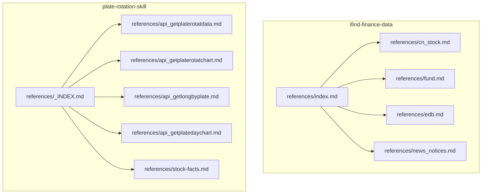
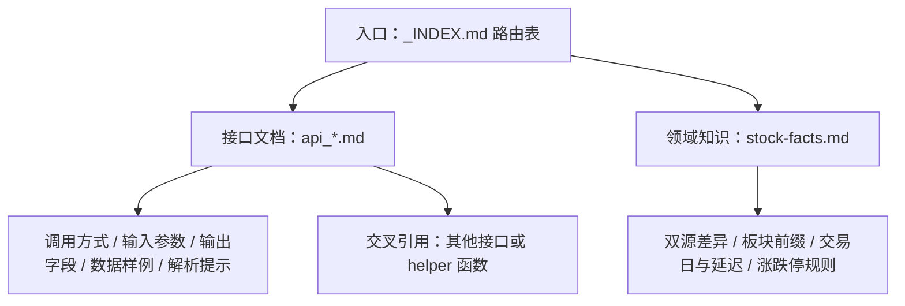
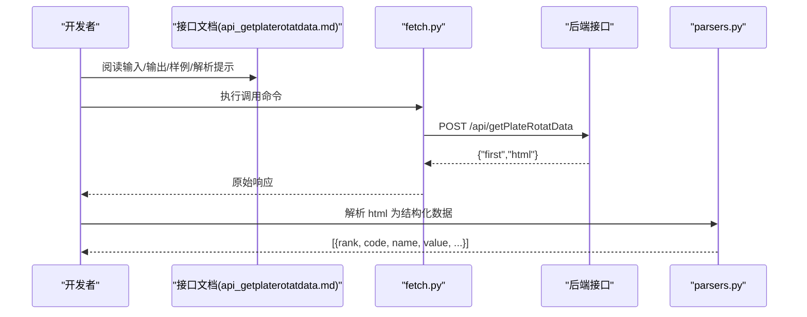
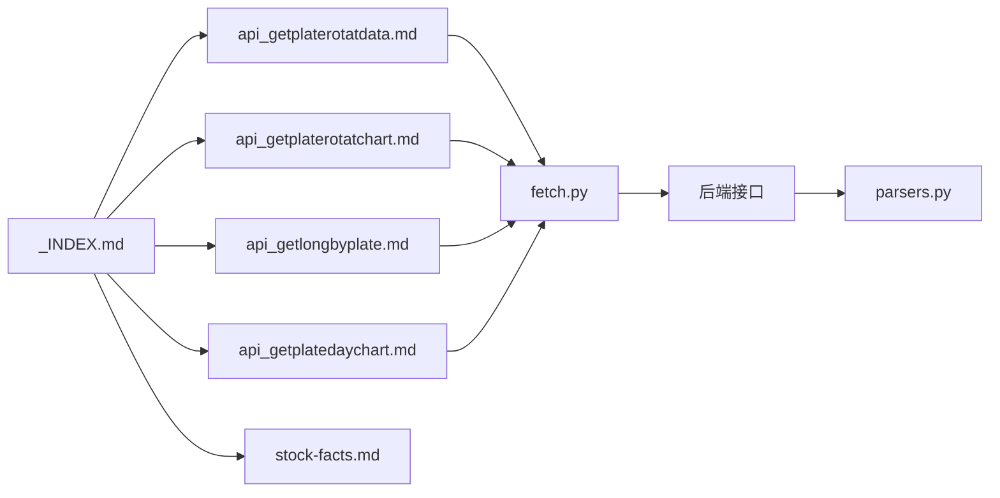

# references目录规范

<cite>
**本文引用的文件**   
- [skills/ifind-finance-data-1.3.0/references/index.md](file://skills/ifind-finance-data-1.3.0/references/index.md)
- [skills/ifind-finance-data-1.3.0/references/cn_stock.md](file://skills/ifind-finance-data-1.3.0/references/cn_stock.md)
- [skills/ifind-finance-data-1.3.0/references/edb.md](file://skills/ifind-finance-data-1.3.0/references/edb.md)
- [skills/ifind-finance-data-1.3.0/references/fund.md](file://skills/ifind-finance-data-1.3.0/references/fund.md)
- [skills/ifind-finance-data-1.3.0/references/news_notices.md](file://skills/ifind-finance-data-1.3.0/references/news_notices.md)
- [skills/plate-rotation-skill/references/_INDEX.md](file://skills/plate-rotation-skill/references/_INDEX.md)
- [skills/plate-rotation-skill/references/api_getplaterotatdata.md](file://skills/plate-rotation-skill/references/api_getplaterotatdata.md)
- [skills/plate-rotation-skill/references/api_getplaterotatchart.md](file://skills/plate-rotation-skill/references/api_getplaterotatchart.md)
- [skills/plate-rotation-skill/references/api_getlongbyplate.md](file://skills/plate-rotation-skill/references/api_getlongbyplate.md)
- [skills/plate-rotation-skill/references/api_getplatedaychart.md](file://skills/plate-rotation-skill/references/api_getplatedaychart.md)
- [skills/plate-rotation-skill/references/stock-facts.md](file://skills/plate-rotation-skill/references/stock-facts.md)
</cite>

## 目录
1. [引言](#引言)
2. [项目结构](#项目结构)
3. [核心组件](#核心组件)
4. [架构总览](#架构总览)
5. [详细组件分析](#详细组件分析)
6. [依赖关系分析](#依赖关系分析)
7. [性能与可用性考量](#性能与可用性考量)
8. [故障排查指南](#故障排查指南)
9. [结论](#结论)
10. [附录：模板与清单](#附录模板与清单)

## 引言
本规范面向开发者，定义仓库中 references 目录的组织与编写标准，确保 API 参考文档具备一致性、可检索性与可维护性。目标包括：
- 统一接口文档的结构化写法（接口定义、参数说明、返回值格式、使用示例）
- Markdown 最佳实践（模板、代码示例规范、版本管理策略）
- 完整的 API 文档示例（RESTful 接口、数据模型、错误处理）
- 文档索引构建、交叉引用与搜索优化技巧
- 高质量技术文档的维护流程，保证文档与代码同步更新

## 项目结构
当前仓库包含两个独立的 references 子集，分别服务于不同 skill：
- ifind-finance-data 系列：以“工具服务”为维度组织，每个 server_type 一个文件，侧重自然语言查询与脚本调用示例
- plate-rotation-skill：以 RESTful 接口为维度组织，每个接口一个文件，附带路由表与领域知识附录

图表来源
- [skills/ifind-finance-data-1.3.0/references/index.md:1-63](file://skills/ifind-finance-data-1.3.0/references/index.md#L1-L63)
- [skills/plate-rotation-skill/references/_INDEX.md:1-43](file://skills/plate-rotation-skill/references/_INDEX.md#L1-L43)

章节来源
- [skills/ifind-finance-data-1.3.0/references/index.md:1-63](file://skills/ifind-finance-data-1.3.0/references/index.md#L1-L63)
- [skills/plate-rotation-skill/references/_INDEX.md:1-43](file://skills/plate-rotation-skill/references/_INDEX.md#L1-L43)

## 核心组件
- 文档类型分层
  - 路由/索引型：集中列出可用接口或工具，提供导航与关键入参摘要
  - 接口型：描述单个接口的输入输出、字段语义、样例与解析提示
  - 领域知识型：沉淀业务事实、陷阱与约束，避免误用
- 命名与路径约定
  - 路由索引文件固定命名为 _INDEX.md
  - 接口文件统一前缀 api_*.md，便于检索与自动化生成索引
  - 领域知识文件独立存放，如 stock-facts.md
- 元信息前置
  - 接口文档采用 YAML front matter 记录 id/host/path/method/category/tier/last_verified/found_in_pages 等元信息，便于索引与校验

章节来源
- [skills/plate-rotation-skill/references/_INDEX.md:1-43](file://skills/plate-rotation-skill/references/_INDEX.md#L1-L43)
- [skills/plate-rotation-skill/references/api_getplaterotatdata.md:1-74](file://skills/plate-rotation-skill/references/api_getplaterotatdata.md#L1-L74)
- [skills/plate-rotation-skill/references/api_getplaterotatchart.md:1-53](file://skills/plate-rotation-skill/references/api_getplaterotatchart.md#L1-L53)
- [skills/plate-rotation-skill/references/api_getlongbyplate.md:1-65](file://skills/plate-rotation-skill/references/api_getlongbyplate.md#L1-L65)
- [skills/plate-rotation-skill/references/api_getplatedaychart.md:1-48](file://skills/plate-rotation-skill/references/api_getplatedaychart.md#L1-L48)
- [skills/plate-rotation-skill/references/stock-facts.md:1-118](file://skills/plate-rotation-skill/references/stock-facts.md#L1-L118)

## 架构总览
从文档视角看，references 目录形成“索引—接口—领域知识”三层结构，支撑快速定位、准确理解与正确调用。

[此图为概念图，不直接映射具体源码文件]

## 详细组件分析

### 组件一：ifind-finance-data 工具服务文档
该子集按 server_type 划分，每个文件聚焦一类工具能力，强调自然语言 query 构造与多语言调用示例。

- 结构与要点
  - 标题区：明确 server_type 与工具集合
  - 工具表：工具名称、功能说明、典型参数（含 query 示例）
  - 脚本调用示例：JS/Python 两种风格，展示 call/listTools 用法
  - 查询示例：覆盖高频场景（实时快照、高频序列、行业合并查询等）

- 推荐遵循点
  - 保持“工具名 + 功能说明 + 典型参数”三列一致
  - 示例尽量贴近真实调用，标注 data_mode、interval 等关键开关
  - 对返回结果不做硬编码断言，仅给出结构示意

章节来源
- [skills/ifind-finance-data-1.3.0/references/index.md:1-63](file://skills/ifind-finance-data-1.3.0/references/index.md#L1-L63)
- [skills/ifind-finance-data-1.3.0/references/cn_stock.md:1-67](file://skills/ifind-finance-data-1.3.0/references/cn_stock.md#L1-L67)
- [skills/ifind-finance-data-1.3.0/references/edb.md:1-41](file://skills/ifind-finance-data-1.3.0/references/edb.md#L1-L41)
- [skills/ifind-finance-data-1.3.0/references/fund.md:1-55](file://skills/ifind-finance-data-1.3.0/references/fund.md#L1-L55)
- [skills/ifind-finance-data-1.3.0/references/news_notices.md:1-70](file://skills/ifind-finance-data-1.3.0/references/news_notices.md#L1-L70)

### 组件二：plate-rotation-skill REST 接口文档
该子集采用“路由表 + 单接口文档 + 领域知识”的组合，强调字段语义、HTML in JSON 解析与跨源差异。

- 路由表 _INDEX.md
  - 列出全部 host、path、method、用途与关键入参
  - 补充领域知识链接与 from/days/dates 等通用入参约定
  - 明确板块代码前缀强语义与不可跨源混用的约束

- 单接口文档（以 getPlateRotatData 为例）
  - Front matter：id/host/path/method/category/tier/last_verified/found_in_pages
  - 调用方式：通过 fetch.py 一键测试
  - 输入参数：from/days/dates 及其取值范围与默认行为
  - 输出字段：字段名、类型、样例值与备注
  - 数据样例：最小可复现的 JSON 片段
  - 解析提示：HTML in JSON 的模板与解析建议，以及 helper 函数推荐

- 领域知识 stock-facts.md
  - 双源数值语义差异、正则陷阱
  - 板块代码前缀强语义与跨源校验
  - HTML in JSON 解析原则、当日无领涨合法返回
  - 鉴权机制（Referer）、交易日与数据延迟、涨跌停板规则、复权语义

图表来源
- [skills/plate-rotation-skill/references/api_getplaterotatdata.md:1-74](file://skills/plate-rotation-skill/references/api_getplaterotatdata.md#L1-L74)
- [skills/plate-rotation-skill/references/api_getplaterotatchart.md:1-53](file://skills/plate-rotation-skill/references/api_getplaterotatchart.md#L1-L53)
- [skills/plate-rotation-skill/references/api_getlongbyplate.md:1-65](file://skills/plate-rotation-skill/references/api_getlongbyplate.md#L1-L65)
- [skills/plate-rotation-skill/references/api_getplatedaychart.md:1-48](file://skills/plate-rotation-skill/references/api_getplatedaychart.md#L1-L48)
- [skills/plate-rotation-skill/references/stock-facts.md:1-118](file://skills/plate-rotation-skill/references/stock-facts.md#L1-L118)

章节来源
- [skills/plate-rotation-skill/references/_INDEX.md:1-43](file://skills/plate-rotation-skill/references/_INDEX.md#L1-L43)
- [skills/plate-rotation-skill/references/api_getplaterotatdata.md:1-74](file://skills/plate-rotation-skill/references/api_getplaterotatdata.md#L1-L74)
- [skills/plate-rotation-skill/references/api_getplaterotatchart.md:1-53](file://skills/plate-rotation-skill/references/api_getplaterotatchart.md#L1-L53)
- [skills/plate-rotation-skill/references/api_getlongbyplate.md:1-65](file://skills/plate-rotation-skill/references/api_getlongbyplate.md#L1-L65)
- [skills/plate-rotation-skill/references/api_getplatedaychart.md:1-48](file://skills/plate-rotation-skill/references/api_getplatedaychart.md#L1-L48)
- [skills/plate-rotation-skill/references/stock-facts.md:1-118](file://skills/plate-rotation-skill/references/stock-facts.md#L1-L118)

## 依赖关系分析
- 文档内依赖
  - _INDEX.md 依赖各 api_*.md 作为子页面；stock-facts.md 被多个接口文档间接引用
  - ifind-finance-data 的 index.md 聚合 cn_stock/fund/edb/news_notices 四类工具
- 运行时依赖（与文档相关）
  - fetch.py 负责注入 Referer 并发起请求
  - parsers.py 负责将 HTML in JSON 解析为结构化数据
  - 前端渲染依赖 ECharts 数据结构（Top5 排名变化曲线）

图表来源
- [skills/plate-rotation-skill/references/_INDEX.md:1-43](file://skills/plate-rotation-skill/references/_INDEX.md#L1-L43)
- [skills/plate-rotation-skill/references/api_getplaterotatdata.md:1-74](file://skills/plate-rotation-skill/references/api_getplaterotatdata.md#L1-L74)
- [skills/plate-rotation-skill/references/api_getplaterotatchart.md:1-53](file://skills/plate-rotation-skill/references/api_getplaterotatchart.md#L1-L53)
- [skills/plate-rotation-skill/references/api_getlongbyplate.md:1-65](file://skills/plate-rotation-skill/references/api_getlongbyplate.md#L1-L65)
- [skills/plate-rotation-skill/references/api_getplatedaychart.md:1-48](file://skills/plate-rotation-skill/references/api_getplatedaychart.md#L1-L48)
- [skills/plate-rotation-skill/references/stock-facts.md:1-118](file://skills/plate-rotation-skill/references/stock-facts.md#L1-L118)

章节来源
- [skills/plate-rotation-skill/references/_INDEX.md:1-43](file://skills/plate-rotation-skill/references/_INDEX.md#L1-L43)

## 性能与可用性考量
- 文档可读性
  - 使用一致的表格与字段说明，减少歧义
  - 在“解析提示”中明确边界条件与异常分支
- 可检索性
  - 统一前缀 api_*.md，配合 _INDEX.md 路由表，提升查找效率
  - 在 front matter 中记录 last_verified，辅助筛选最新文档
- 可维护性
  - 接口变更时同步更新 front matter 与字段语义
  - 领域知识集中管理，避免重复解释

[本节为通用指导，不直接分析具体文件]

## 故障排查指南
- 常见错误与对策
  - 跨源传错板块代码：严格依据前缀选择 from=ths 或 kaipan，避免混用
  - 未识别的“空白”排名：value=10.5 且 symbol=wu.png 表示当日未上榜，不参与排序
  - 周末/节假日数据：接口返回上一交易日数据，需结合交易日日历判断
  - HTML in JSON 解析失败：优先使用 parsers.py，不要自行逆向正则
- 定位步骤
  - 先核对 _INDEX.md 的路由与入参约定
  - 再对照对应 api_*.md 的输出字段与样例
  - 最后检查 stock-facts.md 中的领域陷阱与约束

章节来源
- [skills/plate-rotation-skill/references/stock-facts.md:1-118](file://skills/plate-rotation-skill/references/stock-facts.md#L1-L118)
- [skills/plate-rotation-skill/references/_INDEX.md:1-43](file://skills/plate-rotation-skill/references/_INDEX.md#L1-L43)

## 结论
通过“索引—接口—领域知识”的分层组织与统一的文档模板，references 目录能够高效支撑开发者快速定位、准确理解与稳定调用。建议在新增接口或工具时，严格遵循本规范，并在发布前完成交叉验证与示例回归。

[本节为总结性内容，不直接分析具体文件]

## 附录：模板与清单

### 模板一：REST 接口文档（api_*.md）
- Front matter
  - id: 唯一标识
  - host: 主机别名
  - path: 接口路径
  - method: HTTP 方法
  - category: 分类
  - tier: 层级（如 data）
  - last_verified: 最近验证日期
  - found_in_pages: 关联页面
- 正文结构
  - 调用方式：curl 或脚本命令
  - 输入参数：名称、类型、必选、描述
  - 输出字段：字段、类型、样例值/备注
  - 数据样例：最小可复现 JSON
  - 解析提示/字段语义：结构说明、边界条件、helper 推荐
  - 错误处理：状态码/错误码/异常分支说明（如有）

章节来源
- [skills/plate-rotation-skill/references/api_getplaterotatdata.md:1-74](file://skills/plate-rotation-skill/references/api_getplaterotatdata.md#L1-L74)
- [skills/plate-rotation-skill/references/api_getplaterotatchart.md:1-53](file://skills/plate-rotation-skill/references/api_getplaterotatchart.md#L1-L53)
- [skills/plate-rotation-skill/references/api_getlongbyplate.md:1-65](file://skills/plate-rotation-skill/references/api_getlongbyplate.md#L1-L65)
- [skills/plate-rotation-skill/references/api_getplatedaychart.md:1-48](file://skills/plate-rotation-skill/references/api_getplatedaychart.md#L1-L48)

### 模板二：工具服务文档（server_type 文件）
- 标题：服务类型与工具集合
- 工具表：工具名称、功能说明、典型参数（含 query 示例）
- 脚本调用示例：JS/Python 两版
- 查询示例：覆盖高频场景与组合查询

章节来源
- [skills/ifind-finance-data-1.3.0/references/index.md:1-63](file://skills/ifind-finance-data-1.3.0/references/index.md#L1-L63)
- [skills/ifind-finance-data-1.3.0/references/cn_stock.md:1-67](file://skills/ifind-finance-data-1.3.0/references/cn_stock.md#L1-L67)
- [skills/ifind-finance-data-1.3.0/references/edb.md:1-41](file://skills/ifind-finance-data-1.3.0/references/edb.md#L1-L41)
- [skills/ifind-finance-data-1.3.0/references/fund.md:1-55](file://skills/ifind-finance-data-1.3.0/references/fund.md#L1-L55)
- [skills/ifind-finance-data-1.3.0/references/news_notices.md:1-70](file://skills/ifind-finance-data-1.3.0/references/news_notices.md#L1-L70)

### 模板三：路由索引（_INDEX.md）
- 头部说明：host、method、鉴权策略
- 路由表：ID、Path、用途、关键入参
- 领域知识附录：链接到 stock-facts.md 等
- 通用入参约定：from/days/dates 等
- 板块代码前缀强语义与校验规则

章节来源
- [skills/plate-rotation-skill/references/_INDEX.md:1-43](file://skills/plate-rotation-skill/references/_INDEX.md#L1-L43)

### 模板四：领域知识（stock-facts.md）
- 接口层陷阱：双源差异、前缀强语义、HTML in JSON、当日无领涨、鉴权
- 领域通用事实：交易日、涨跌停板、T+1、数据延迟、复权语义
- 不覆盖范围：引导使用其他工具或数据源

章节来源
- [skills/plate-rotation-skill/references/stock-facts.md:1-118](file://skills/plate-rotation-skill/references/stock-facts.md#L1-L118)

### 文档索引构建与搜索优化
- 索引构建
  - 以 _INDEX.md 为中心，自动扫描 api_*.md 生成目录树
  - 为每个接口建立锚点与面包屑，支持站内跳转
- 交叉引用
  - 在接口文档中引用相关接口与领域知识，形成知识网络
- 搜索优化
  - 统一关键词（如 from、days、platecode、data_mode）
  - 在 front matter 中埋入可检索标签（category、tier、last_verified）

[本节为通用指导，不直接分析具体文件]

### 版本管理与同步更新
- 变更流程
  - 修改接口：更新 api_*.md 的 front matter 与字段语义，必要时更新 _INDEX.md
  - 更新领域知识：同步 stock-facts.md 中的约束与陷阱
  - 回归示例：运行 fetch.py 与 parsers 验证样例与解析逻辑
- 质量门禁
  - last_verified 必须随变更更新
  - 新增接口需在 _INDEX.md 注册并补充示例
  - 涉及跨源差异的变更，需在 stock-facts.md 中补充说明

[本节为通用指导，不直接分析具体文件]