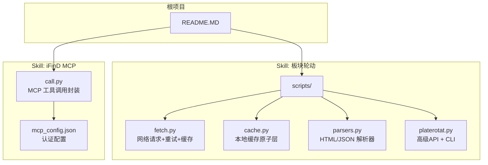
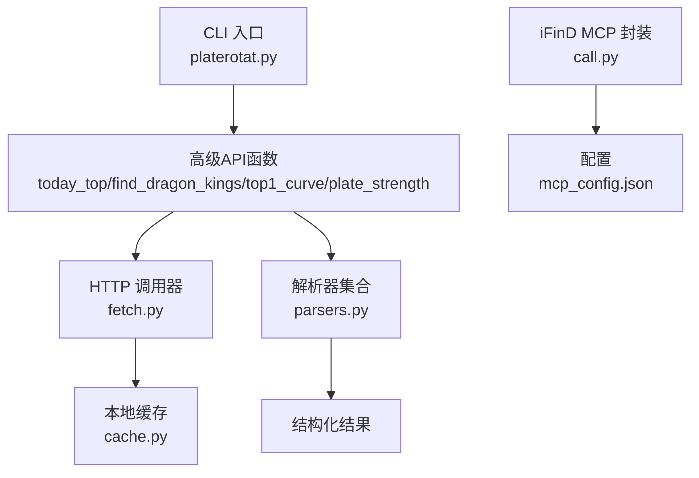
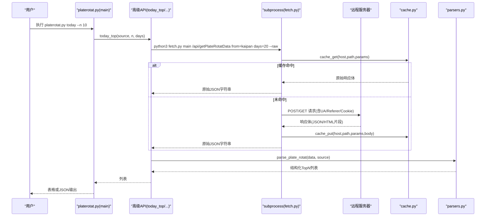
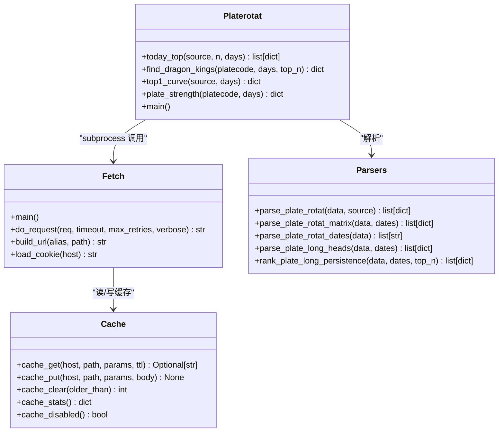
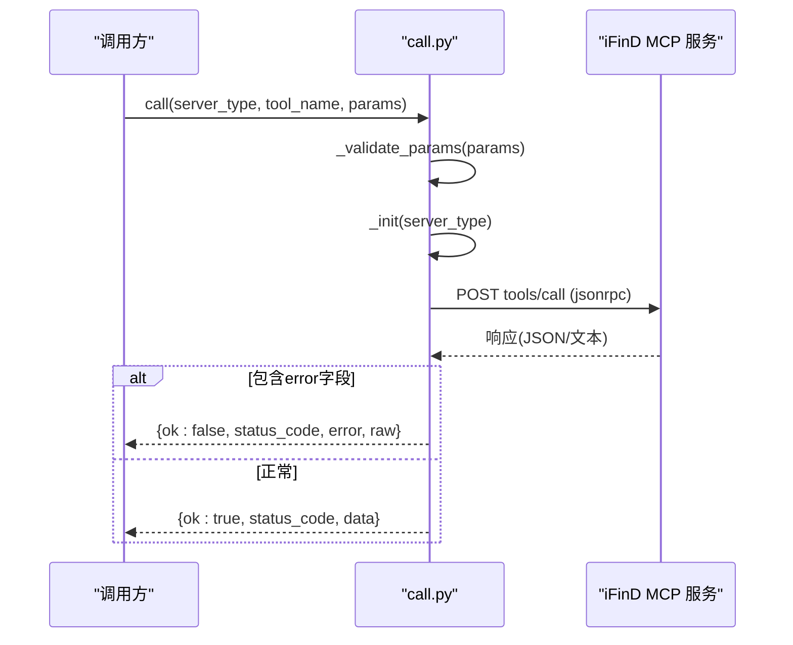
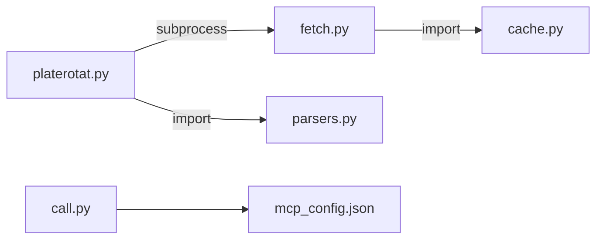

# scripts目录规范

<cite>
**本文引用的文件**   
- [fetch.py](file://skills/plate-rotation-skill/scripts/fetch.py)
- [parsers.py](file://skills/plate-rotation-skill/scripts/parsers.py)
- [cache.py](file://skills/plate-rotation-skill/scripts/cache.py)
- [platerotat.py](file://skills/plate-rotation-skill/scripts/platerotat.py)
- [call.py](file://skills/ifind-finance-data-1.3.0/call.py)
- [mcp_config.json](file://skills/ifind-finance-data-1.3.0/mcp_config.json)
- [README.MD](file://README.MD)
- [README.md](file://skills/plate-rotation-skill/README.md)
</cite>

## 目录
1. [引言](#引言)
2. [项目结构](#项目结构)
3. [核心组件](#核心组件)
4. [架构总览](#架构总览)
5. [详细组件分析](#详细组件分析)
6. [依赖关系分析](#依赖关系分析)
7. [性能与可靠性](#性能与可靠性)
8. [故障排查指南](#故障排查指南)
9. [结论](#结论)
10. [附录：脚本结构与最佳实践清单](#附录脚本结构与最佳实践清单)

## 引言
本规范面向开发者，系统化定义 scripts 目录的组织原则、职责边界与实现范式。以项目中两个 Skill 的脚本为样本（板块轮动 Skill 与 iFinD MCP 调用封装），总结可执行脚本的主入口、工具函数、数据获取与解析模块的职责划分；给出 Python CLI 设计、参数解析、错误处理与日志输出的最佳实践；并提供从简单工具到复杂分析引擎的结构示例，覆盖模块依赖管理、路径处理与跨平台兼容性要点，帮助编写高质量的 CLI 工具与 API 封装层。

## 项目结构
仓库采用“按能力域组织”的 Skills 模式，每个 Skill 内部包含独立的 scripts 子目录，承载该能力的可执行脚本与工具模块。当前仓库中与 scripts 相关的核心位置如下：
- skills/plate-rotation-skill/scripts：板块轮动分析的数据获取、缓存、解析与高级封装
- skills/ifind-finance-data-1.3.0/call.py：iFinD MCP 服务的统一调用封装

图表来源
- [README.MD:1-81](file://README.MD#L1-L81)
- [README.md:1-188](file://skills/plate-rotation-skill/README.md#L1-L188)

章节来源
- [README.MD:1-81](file://README.MD#L1-L81)
- [README.md:1-188](file://skills/plate-rotation-skill/README.md#L1-L188)

## 核心组件
本节聚焦 scripts 目录内的关键模块及其职责边界，明确“主入口—工具—数据获取—解析—封装”的分层模型。

- 主入口与 CLI
  - platerotat.py：对外暴露“一个意图一个函数”的高级 API，同时提供命令行子命令 today/wangking/curve/strength，负责组合 fetch 与 parsers，输出结构化结果或人类可读表格。
  - fetch.py：统一的 HTTP 调用器，支持 GET/POST、KV 与 JSON 参数、Cookie/Referer/UA 注入、指数退避重试、本地缓存命中与原始/美化输出。
  - call.py：iFinD MCP 服务封装，提供 initialize/tools/list/tools/call 流程、会话复用、参数校验与错误归一化。

- 工具与基础设施
  - cache.py：纯 stdlib 实现的本地缓存原子层，提供 get/put/clear/stats/disabled 接口，基于 SHA1 稳定键生成与 TTL 控制，支持环境变量开关与目录自定义。

- 解析与数据处理
  - parsers.py：针对特定接口的 HTML/JSON 混合响应进行抽取与聚合，包括板块 Top N、日期矩阵、龙头股持久性统计等。

章节来源
- [platerotat.py:1-315](file://skills/plate-rotation-skill/scripts/platerotat.py#L1-L315)
- [fetch.py:1-230](file://skills/plate-rotation-skill/scripts/fetch.py#L1-L230)
- [cache.py:1-145](file://skills/plate-rotation-skill/scripts/cache.py#L1-L145)
- [parsers.py:1-212](file://skills/plate-rotation-skill/scripts/parsers.py#L1-L212)
- [call.py:1-208](file://skills/ifind-finance-data-1.3.0/call.py#L1-L208)

## 架构总览
整体分层遵循“CLI/高层封装 → 数据获取 → 解析 → 基础设施（缓存/配置）”的单向依赖关系，避免循环依赖并提升可测试性与可维护性。

图表来源
- [platerotat.py:1-315](file://skills/plate-rotation-skill/scripts/platerotat.py#L1-L315)
- [fetch.py:1-230](file://skills/plate-rotation-skill/scripts/fetch.py#L1-L230)
- [cache.py:1-145](file://skills/plate-rotation-skill/scripts/cache.py#L1-L145)
- [parsers.py:1-212](file://skills/plate-rotation-skill/scripts/parsers.py#L1-L212)
- [call.py:1-208](file://skills/ifind-finance-data-1.3.0/call.py#L1-L208)
- [mcp_config.json:1-3](file://skills/ifind-finance-data-1.3.0/mcp_config.json#L1-L3)

## 详细组件分析

### 组件A：板块轮动脚本体系（fetch / cache / parsers / platerotat）
- 职责划分
  - fetch.py：网络请求原子层，统一 Cookie/Referer/UA、重试策略、缓存读写、参数组装与输出格式化。
  - cache.py：本地缓存原子层，提供稳定的 key 生成、TTL 控制、原子写入与清理统计。
  - parsers.py：针对特定接口的 HTML/JSON 混合响应解析，返回领域对象列表或矩阵。
  - platerotat.py：高级 API 与 CLI 入口，组合 fetch 与 parsers，提供“意图式”函数与子命令。

- 关键流程（CLI 到网络与解析）

图表来源
- [platerotat.py:278-315](file://skills/plate-rotation-skill/scripts/platerotat.py#L278-L315)
- [platerotat.py:102-121](file://skills/plate-rotation-skill/scripts/platerotat.py#L102-L121)
- [fetch.py:128-213](file://skills/plate-rotation-skill/scripts/fetch.py#L128-L213)
- [cache.py:59-94](file://skills/plate-rotation-skill/scripts/cache.py#L59-L94)
- [parsers.py:20-65](file://skills/plate-rotation-skill/scripts/parsers.py#L20-L65)

- 类/模块关系（概念图）

图表来源
- [fetch.py:1-230](file://skills/plate-rotation-skill/scripts/fetch.py#L1-L230)
- [cache.py:1-145](file://skills/plate-rotation-skill/scripts/cache.py#L1-L145)
- [parsers.py:1-212](file://skills/plate-rotation-skill/scripts/parsers.py#L1-L212)
- [platerotat.py:1-315](file://skills/plate-rotation-skill/scripts/platerotat.py#L1-L315)

章节来源
- [platerotat.py:1-315](file://skills/plate-rotation-skill/scripts/platerotat.py#L1-L315)
- [fetch.py:1-230](file://skills/plate-rotation-skill/scripts/fetch.py#L1-L230)
- [cache.py:1-145](file://skills/plate-rotation-skill/scripts/cache.py#L1-L145)
- [parsers.py:1-212](file://skills/plate-rotation-skill/scripts/parsers.py#L1-L212)

### 组件B：iFinD MCP 调用封装（call.py）
- 职责划分
  - 加载配置：从 mcp_config.json 读取认证令牌与服务端点映射。
  - 会话管理：initialize 建立会话，后续请求携带会话头。
  - 工具发现与调用：tools/list 获取可用工具集，tools/call 执行具体工具。
  - 参数校验与安全：递归校验输入类型与字段白名单，拒绝非法值。
  - 错误归一化：将服务端 error 字段与 HTTP 状态码统一包装为结构化返回。

- 调用序列（初始化→工具列表→工具调用）

图表来源
- [call.py:137-171](file://skills/ifind-finance-data-1.3.0/call.py#L137-L171)
- [call.py:85-116](file://skills/ifind-finance-data-1.3.0/call.py#L85-L116)
- [call.py:174-203](file://skills/ifind-finance-data-1.3.0/call.py#L174-L203)
- [mcp_config.json:1-3](file://skills/ifind-finance-data-1.3.0/mcp_config.json#L1-L3)

章节来源
- [call.py:1-208](file://skills/ifind-finance-data-1.3.0/call.py#L1-L208)
- [mcp_config.json:1-3](file://skills/ifind-finance-data-1.3.0/mcp_config.json#L1-L3)

## 依赖关系分析
- 模块内聚与耦合
  - fetch.py 仅依赖标准库与同目录 cache.py，职责单一且无外部第三方依赖，便于移植与测试。
  - parsers.py 仅依赖标准库，专注于解析逻辑，不感知网络与缓存细节。
  - platerotat.py 通过 subprocess 调用 fetch.py，避免直接导入导致的进程级资源竞争，同时保持对 parsers.py 的直接导入，形成清晰的“上层编排—下层实现”关系。
  - call.py 依赖 requests 与 json，独立于其他 Skill，具备通用 MCP 客户端特征。

- 潜在循环依赖
  - 当前结构未发现循环依赖；platerotat.py 通过 subprocess 调用 fetch.py，避免了 import 层面的双向依赖。

- 外部依赖与集成点
  - fetch.py 与远程站点交互，受 Referer/UA/Cookie 策略影响。
  - call.py 与 iFinD MCP 服务交互，需有效 auth_token 与会话 ID。

图表来源
- [platerotat.py:1-315](file://skills/plate-rotation-skill/scripts/platerotat.py#L1-L315)
- [fetch.py:1-230](file://skills/plate-rotation-skill/scripts/fetch.py#L1-L230)
- [parsers.py:1-212](file://skills/plate-rotation-skill/scripts/parsers.py#L1-L212)
- [cache.py:1-145](file://skills/plate-rotation-skill/scripts/cache.py#L1-L145)
- [call.py:1-208](file://skills/ifind-finance-data-1.3.0/call.py#L1-L208)
- [mcp_config.json:1-3](file://skills/ifind-finance-data-1.3.0/mcp_config.json#L1-L3)

章节来源
- [platerotat.py:1-315](file://skills/plate-rotation-skill/scripts/platerotat.py#L1-L315)
- [fetch.py:1-230](file://skills/plate-rotation-skill/scripts/fetch.py#L1-L230)
- [parsers.py:1-212](file://skills/plate-rotation-skill/scripts/parsers.py#L1-L212)
- [cache.py:1-145](file://skills/plate-rotation-skill/scripts/cache.py#L1-L145)
- [call.py:1-208](file://skills/ifind-finance-data-1.3.0/call.py#L1-L208)
- [mcp_config.json:1-3](file://skills/ifind-finance-data-1.3.0/mcp_config.json#L1-L3)

## 性能与可靠性
- 网络请求与重试
  - fetch.py 对 429/5xx 及网络异常实施指数退避重试，默认最多 3 次，间隔 1s/2s/4s，降低瞬时失败对上层的影响。
  - 超时与最大重试次数可通过 CLI 参数调整，便于在弱网环境下调优。

- 缓存策略
  - cache.py 使用稳定键（host/path/sorted params）与 TTL 控制，默认 1 小时，适合盘中高频查询场景。
  - 支持全局禁用与目录自定义，便于调试与多环境隔离。
  - 原子写入（临时文件 + os.replace）避免半写损坏。

- 解析效率
  - parsers.py 基于正则一次性扫描 HTML 片段，避免多次 I/O 与重复解析，适合批量处理。

- 并发与进程隔离
  - platerotat.py 通过 subprocess 调用 fetch.py，天然进程隔离，避免多线程共享状态问题，但需注意进程启动开销。

章节来源
- [fetch.py:91-124](file://skills/plate-rotation-skill/scripts/fetch.py#L91-L124)
- [cache.py:47-94](file://skills/plate-rotation-skill/scripts/cache.py#L47-L94)
- [parsers.py:18-108](file://skills/plate-rotation-skill/scripts/parsers.py#L18-L108)
- [platerotat.py:55-71](file://skills/plate-rotation-skill/scripts/platerotat.py#L55-L71)

## 故障排查指南
- 常见错误定位
  - 非 JSON 响应：fetch.py 在 --raw 模式下透传原始文本，若上层无法解析会显式报错；建议先以 --raw 查看原始内容。
  - 空数据警告：platerotat.py 在解析后做运行时校验，stderr 输出 PR-EMPTY/PR-WARN 提示，便于下游 Agent 识别节假日、跨源错传或上游异常。
  - 缓存问题：使用 cache.py 的 stats/clear 子命令检查缓存大小与清理过期项；设置 PR_CACHE_DISABLE=1 快速关闭缓存验证。
  - MCP 认证与会话：确认 mcp_config.json 中的 auth_token 有效；若 initialize 成功但未返回会话 ID，需检查服务端响应头。

- 诊断步骤
  - 启用 verbose 模式：fetch.py 的 -v 打印 URL、body 摘要与重试信息，辅助定位请求构造问题。
  - 最小复现：使用 parsers.py 的 demo 模式拉取样例数据并运行解析函数，隔离网络与解析问题。
  - 参数校验：call.py 会对输入进行严格校验，遇到非法类型或字段会抛出 TypeError，优先检查入参结构。

章节来源
- [platerotat.py:75-98](file://skills/plate-rotation-skill/scripts/platerotat.py#L75-L98)
- [fetch.py:193-213](file://skills/plate-rotation-skill/scripts/fetch.py#L193-L213)
- [cache.py:132-145](file://skills/plate-rotation-skill/scripts/cache.py#L132-L145)
- [parsers.py:178-212](file://skills/plate-rotation-skill/scripts/parsers.py#L178-L212)
- [call.py:59-83](file://skills/ifind-finance-data-1.3.0/call.py#L59-L83)

## 结论
本规范总结了 scripts 目录的组织原则与实现范式：以“主入口—工具—数据获取—解析—封装”的分层模型确保职责清晰、依赖单向、易于测试与维护。结合 retry、缓存、参数校验与结构化错误输出，构建高可用的 CLI 工具与 API 封装层。建议在新增脚本时遵循本规范，保持风格一致与可观测性。

## 附录：脚本结构与最佳实践清单
- 主入口与 CLI 设计
  - 使用 argparse 定义子命令与参数，提供 --json 输出便于管道与自动化。
  - 子命令语义清晰，如 today/wangking/curve/strength，对应“一个意图一个函数”。
  - 参考路径：[platerotat.py:278-315](file://skills/plate-rotation-skill/scripts/platerotat.py#L278-L315)

- 参数解析与校验
  - 支持 KV 与 JSON 两种参数姿势，优先级明确；对非法参数给出明确退出码与消息。
  - 参考路径：[fetch.py:128-155](file://skills/plate-rotation-skill/scripts/fetch.py#L128-L155)、[call.py:59-83](file://skills/ifind-finance-data-1.3.0/call.py#L59-L83)

- 错误处理与日志输出
  - 网络层捕获 HTTPError/URLError/TimeoutError，区分可重试与不可重试错误。
  - 上层通过 stderr 输出 PR-EMPTY/PR-WARN 等标签，便于下游识别。
  - 参考路径：[fetch.py:91-124](file://skills/plate-rotation-skill/scripts/fetch.py#L91-L124)、[platerotat.py:75-98](file://skills/plate-rotation-skill/scripts/platerotat.py#L75-L98)

- 缓存与幂等
  - 使用稳定键与 TTL，保证同一参数组合在窗口期内只发一次请求。
  - 原子写入与清理统计，便于运维与排障。
  - 参考路径：[cache.py:47-94](file://skills/plate-rotation-skill/scripts/cache.py#L47-L94)

- 路径处理与跨平台兼容
  - 使用 pathlib.Path 与 os.path.join 拼接路径，避免硬编码分隔符。
  - 配置文件与缓存目录通过环境变量可配置，适配不同系统。
  - 参考路径：[cache.py:35-37](file://skills/plate-rotation-skill/scripts/cache.py#L35-L37)、[platerotat.py:37-42](file://skills/plate-rotation-skill/scripts/platerotat.py#L37-L42)

- 模块依赖管理
  - 尽量使用标准库，减少第三方依赖；必要时在 Skill 内集中管理依赖。
  - 通过 subprocess 调用避免进程间共享状态，提高稳定性。
  - 参考路径：[platerotat.py:55-71](file://skills/plate-rotation-skill/scripts/platerotat.py#L55-L71)

- API 封装层最佳实践
  - 统一会话管理与认证头，封装 initialize/tools/list/tools/call 流程。
  - 参数校验与安全过滤，拒绝非法输入。
  - 错误归一化，返回结构化结果供上层消费。
  - 参考路径：[call.py:85-171](file://skills/ifind-finance-data-1.3.0/call.py#L85-L171)