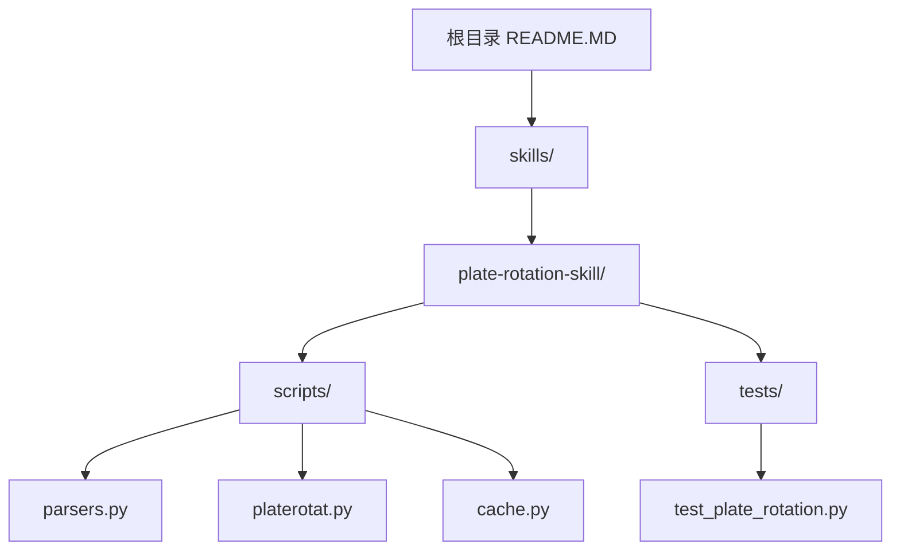
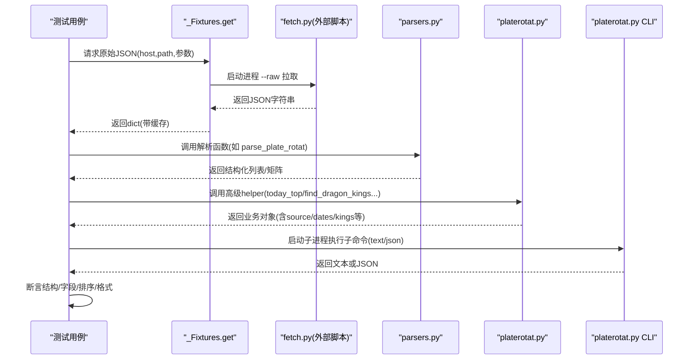
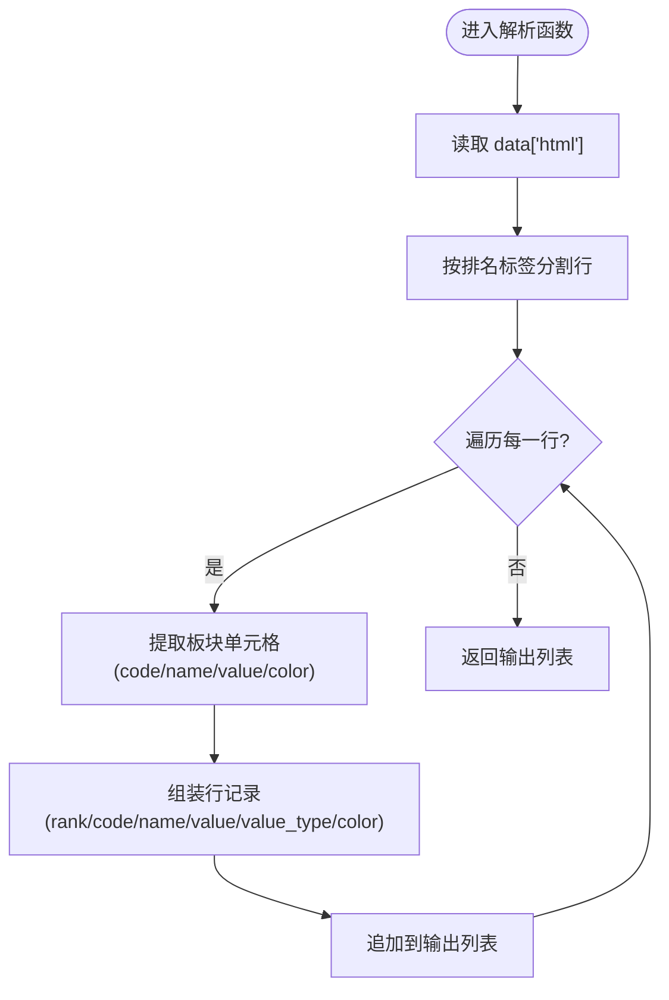
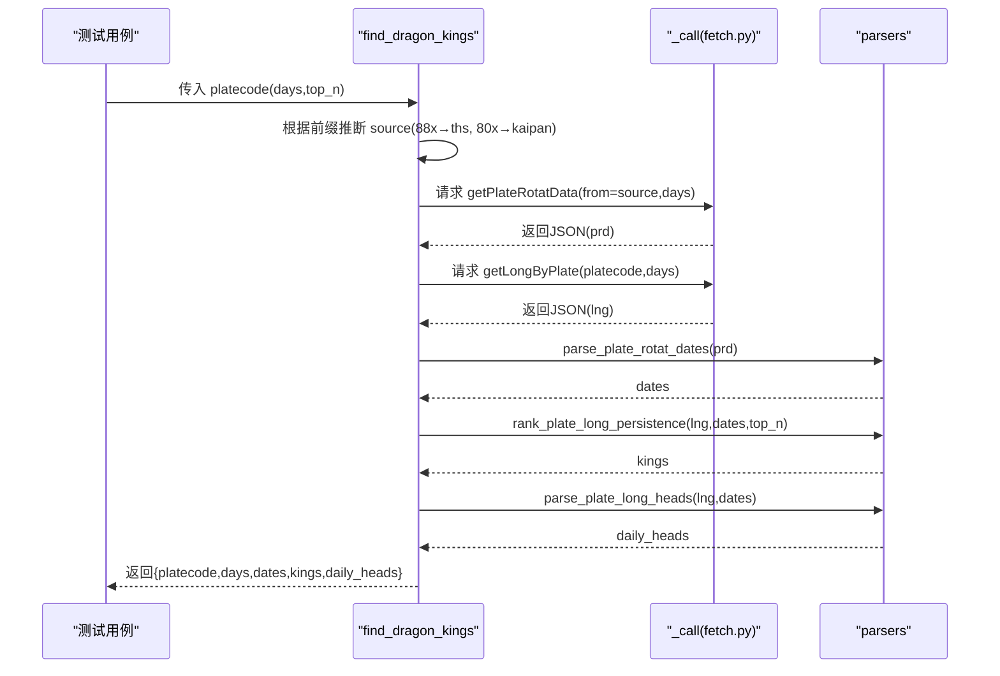
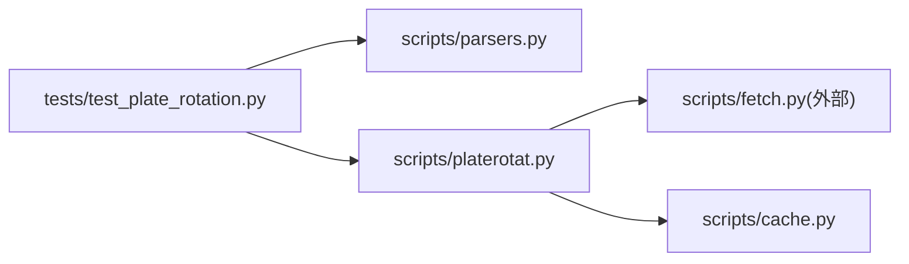

# tests目录规范

<cite>
**本文引用的文件**
- [test_plate_rotation.py](file://skills/plate-rotation-skill/tests/test_plate_rotation.py)
- [parsers.py](file://skills/plate-rotation-skill/scripts/parsers.py)
- [platerotat.py](file://skills/plate-rotation-skill/scripts/platerotat.py)
- [cache.py](file://skills/plate-rotation-skill/scripts/cache.py)
- [.gitignore](file://skills/plate-rotation-skill/.gitignore)
- [README.MD](file://README.MD)
</cite>

## 目录
1. [简介](#简介)
2. [项目结构](#项目结构)
3. [核心组件](#核心组件)
4. [架构总览](#架构总览)
5. [详细组件分析](#详细组件分析)
6. [依赖关系分析](#依赖关系分析)
7. [性能与覆盖率](#性能与覆盖率)
8. [故障排查指南](#故障排查指南)
9. [结论](#结论)
10. [附录](#附录)

## 简介
本规范面向开发者，系统化定义 tests 目录的测试组织、命名约定、用例设计原则、Mock 数据管理、断言策略，以及 Python 测试框架最佳实践（pytest 配置、夹具、参数化）。结合本项目现有在线集成测试样例，给出 API 调用测试、数据解析测试、异常处理测试的实现范式，并补充覆盖率要求、持续集成建议与性能测试方法，帮助构建可维护、可复现、可扩展的测试套件。

## 项目结构
当前仓库中，tests 位于 skills/plate-rotation-skill 下，采用“按功能域组织”的方式：每个 skill 拥有独立的 tests 目录，便于隔离依赖与运行环境。

图示来源
- [README.MD:1-83](file://README.MD#L1-L83)
- [test_plate_rotation.py:1-40](file://skills/plate-rotation-skill/tests/test_plate_rotation.py#L1-L40)
- [parsers.py:1-20](file://skills/plate-rotation-skill/scripts/parsers.py#L1-L20)
- [platerotat.py:1-20](file://skills/plate-rotation-skill/scripts/platerotat.py#L1-L20)
- [cache.py:35-55](file://skills/plate-rotation-skill/scripts/cache.py#L35-L55)

章节来源
- [README.MD:1-83](file://README.MD#L1-L83)

## 核心组件
- 测试入口与组织
  - 使用 unittest.TestCase 组织测试类与方法，文件名以 test_ 开头，类名以 Test 开头，方法名以 test_ 开头，体现“行为驱动 + 可读性优先”。
  - 测试覆盖范围包括：底层接口健康度、解析器正确性、高级 helper 返回结构与签名约束、自动路由逻辑、CLI 子命令 text/json 双模输出。
- 共享 Fixture 与缓存
  - 通过类级缓存 _Fixtures.get 复用网络请求结果，避免重复打网，提升稳定性与执行速度。
- 断言策略
  - 类型断言、字段存在性断言、值域与格式正则断言、排序与单调性断言、边界与上限断言（如 n 限制）。
- 错误路径验证
  - CLI 缺参或非法参数应返回非零退出码；网络失败时抛出明确异常信息。

章节来源
- [test_plate_rotation.py:48-76](file://skills/plate-rotation-skill/tests/test_plate_rotation.py#L48-L76)
- [test_plate_rotation.py:74-118](file://skills/plate-rotation-skill/tests/test_plate_rotation.py#L74-L118)
- [test_plate_rotation.py:120-244](file://skills/plate-rotation-skill/tests/test_plate_rotation.py#L120-L244)
- [test_plate_rotation.py:246-328](file://skills/plate-rotation-skill/tests/test_plate_rotation.py#L246-L328)
- [test_plate_rotation.py:330-440](file://skills/plate-rotation-skill/tests/test_plate_rotation.py#L330-L440)

## 架构总览
测试套件围绕“在线集成”展开：通过 subprocess 调用 scripts/fetch.py 获取真实 JSON，再交由 parsers 与 platerotat 的高级函数进行解析与组合，最终用 assert 校验结构与语义。

图示来源
- [test_plate_rotation.py:48-76](file://skills/plate-rotation-skill/tests/test_plate_rotation.py#L48-L76)
- [parsers.py:18-66](file://skills/plate-rotation-skill/scripts/parsers.py#L18-L66)
- [platerotat.py:100-172](file://skills/plate-rotation-skill/scripts/platerotat.py#L100-L172)
- [platerotat.py:175-196](file://skills/plate-rotation-skill/scripts/platerotat.py#L175-L196)

## 详细组件分析

### 测试组织与命名约定
- 文件命名
  - 测试文件统一以 test_ 前缀命名，置于对应 skill 的 tests 目录下，例如 test_plate_rotation.py。
- 类与方法命名
  - 测试类以 Test 开头，描述被测模块或能力，如 TestFetchEndpoints、TestParsers、TestHighLevelHelpers、TestSourceAutoPick、TestCLI。
  - 测试方法以 test_ 开头，表达具体场景，如 test_parse_plate_rotat_ths_value_has_pct、test_cli_today_json_ths_pct。
- 分组与顺序
  - 将测试按层次分组：底层接口健康 → 解析器 → 高级 helper → 自动路由 → CLI，便于定位问题与选择性执行。

章节来源
- [test_plate_rotation.py:74-118](file://skills/plate-rotation-skill/tests/test_plate_rotation.py#L74-L118)
- [test_plate_rotation.py:120-244](file://skills/plate-rotation-skill/tests/test_plate_rotation.py#L120-L244)
- [test_plate_rotation.py:246-328](file://skills/plate-rotation-skill/tests/test_plate_rotation.py#L246-L328)
- [test_plate_rotation.py:330-440](file://skills/plate-rotation-skill/tests/test_plate_rotation.py#L330-L440)

### Mock 数据管理与缓存策略
- 在线数据缓存
  - 使用类级字典缓存 fetch.py 的原始响应，键由 key/host/path/参数决定，避免重复网络请求。
- 失败快速失败
  - 当 fetch.py 返回非零或非法 JSON 时，立即抛出 RuntimeError，附带 stderr/stdout 片段，便于定位。
- 离线替代方案（建议）
  - 在 CI 或无网环境下，可通过环境变量关闭网络，改用本地 fixtures 文件或 cache.py 的磁盘缓存读取。

章节来源
- [test_plate_rotation.py:48-76](file://skills/plate-rotation-skill/tests/test_plate_rotation.py#L48-L76)
- [cache.py:35-55](file://skills/plate-rotation-skill/scripts/cache.py#L35-L55)
- [cache.py:54-144](file://skills/plate-rotation-skill/scripts/cache.py#L54-L144)

### 断言策略与数据契约
- 类型与结构
  - 对返回值类型、顶层字段存在性进行断言，确保下游稳定消费。
- 值域与格式
  - 针对 value_type 与 value 格式做差异化断言（ths 带 %，kaipan 纯数字），日期格式 YYYY-MM-DD，龙头 code 长度与 rank 枚举。
- 排序与单调性
  - rank 升序、妖王榜 count 降序、dates newest-first 且无重复。
- 边界与上限
  - n/top_n 限制生效；空数据场景下的健壮性断言。

章节来源
- [test_plate_rotation.py:120-244](file://skills/plate-rotation-skill/tests/test_plate_rotation.py#L120-L244)
- [test_plate_rotation.py:246-328](file://skills/plate-rotation-skill/tests/test_plate_rotation.py#L246-L328)

### pytest 最佳实践（迁移与增强）
- 配置文件
  - 在项目根或 skill 目录创建 pytest.ini 或 pyproject.toml，设置测试发现规则、日志级别、并行选项等。
- 夹具（fixtures）
  - 将 _Fixtures.get 抽象为 pytest fixture，支持 session-scoped 全局缓存；提供 local_mode 开关切换在线/离线模式。
- 参数化测试
  - 使用 @pytest.mark.parametrize 对 source/n/days/platecode 等参数组合进行矩阵式覆盖。
- 标记与筛选
  - 使用 @pytest.mark.slow 标记耗时用例，CI 中按需跳过；@pytest.mark.network 控制是否允许网络访问。
- 报告与产物
  - 启用 htmlcov 生成覆盖率报告；保存 CLI 输出到 artifacts 用于人工复核。

章节来源
- [test_plate_rotation.py:48-76](file://skills/plate-rotation-skill/tests/test_plate_rotation.py#L48-L76)
- [test_plate_rotation.py:330-440](file://skills/plate-rotation-skill/tests/test_plate_rotation.py#L330-L440)

### 单元测试示例（基于现有实现）
- API 调用测试
  - 通过 _Fixtures.get 拉取真实 JSON，断言关键字段与数据结构。
- 数据解析测试
  - 对 parsers 的五个核心函数分别构造输入，断言输出字段、格式、排序与对齐关系。
- 异常处理测试
  - 验证 CLI 缺参/非法参数返回非零退出码；网络失败时抛出明确异常。

章节来源
- [test_plate_rotation.py:74-118](file://skills/plate-rotation-skill/tests/test_plate_rotation.py#L74-L118)
- [test_plate_rotation.py:120-244](file://skills/plate-rotation-skill/tests/test_plate_rotation.py#L120-L244)
- [test_plate_rotation.py:330-440](file://skills/plate-rotation-skill/tests/test_plate_rotation.py#L330-L440)

### 代码级流程图：解析器主流程

图示来源
- [parsers.py:18-66](file://skills/plate-rotation-skill/scripts/parsers.py#L18-L66)

章节来源
- [parsers.py:18-66](file://skills/plate-rotation-skill/scripts/parsers.py#L18-L66)

### 代码级时序图：find_dragon_kings 自动路由

图示来源
- [platerotat.py:123-172](file://skills/plate-rotation-skill/scripts/platerotat.py#L123-L172)
- [parsers.py:105-174](file://skills/plate-rotation-skill/scripts/parsers.py#L105-L174)

章节来源
- [platerotat.py:123-172](file://skills/plate-rotation-skill/scripts/platerotat.py#L123-L172)
- [parsers.py:105-174](file://skills/plate-rotation-skill/scripts/parsers.py#L105-L174)

## 依赖关系分析
- 测试对脚本的依赖
  - 测试直接 import parsers 与 platerotat，并通过 subprocess 调用 fetch.py 与 platerotat CLI。
- 运行时警告通道
  - 高级 helper 在空数据或缺字段时通过 stderr 输出 PR-EMPTY/PR-WARN 提示，测试可据此判断异常分支。
- 缓存层
  - cache.py 提供磁盘缓存能力，可用于离线测试或加速重复执行。

图示来源
- [test_plate_rotation.py:1-46](file://skills/plate-rotation-skill/tests/test_plate_rotation.py#L1-L46)
- [platerotat.py:34-48](file://skills/plate-rotation-skill/scripts/platerotat.py#L34-L48)
- [cache.py:35-55](file://skills/plate-rotation-skill/scripts/cache.py#L35-L55)

章节来源
- [test_plate_rotation.py:1-46](file://skills/plate-rotation-skill/tests/test_plate_rotation.py#L1-L46)
- [platerotat.py:34-48](file://skills/plate-rotation-skill/scripts/platerotat.py#L34-L48)
- [cache.py:35-55](file://skills/plate-rotation-skill/scripts/cache.py#L35-L55)

## 性能与覆盖率
- 性能优化建议
  - 使用 session-scoped fixture 缓存网络响应；对耗时用例添加 @pytest.mark.slow 并在 CI 中可选执行。
  - 利用 cache.py 的 TTL 与清理工具减少重复 IO。
- 覆盖率目标
  - 建议核心解析与高级 helper 行覆盖率 ≥ 80%，分支覆盖率 ≥ 70%；对外暴露的 CLI 路径需覆盖 text/json 双模。
- 指标采集
  - 使用 coverage run -m pytest 执行，生成 .coverage 与 htmlcov 报告；在 CI 中上传 artifact。

[本节为通用指导，不直接分析具体文件]

## 故障排查指南
- 常见问题
  - 网络超时或不可达：检查 fetch.py 超时与重试策略；必要时切换到本地 fixtures。
  - 非 JSON 响应：确认服务端返回体是否为合法 JSON；测试会抛出包含 stdout 片段的异常。
  - CLI 参数错误：argparse choices 拒绝非法 source；无子命令时应返回非零退出码。
- 调试技巧
  - 打印 stderr 中的 PR-EMPTY/PR-WARN 提示，快速定位空数据原因（周末、跨源错传、节假日等）。
  - 使用 -v 或 --tb=short 查看堆栈；对单个测试类或方法执行缩小范围。
- 忽略与过滤
  - 在无网环境使用 -m "not network" 跳过在线用例；或使用环境变量禁用缓存写入。

章节来源
- [test_plate_rotation.py:48-76](file://skills/plate-rotation-skill/tests/test_plate_rotation.py#L48-L76)
- [test_plate_rotation.py:330-440](file://skills/plate-rotation-skill/tests/test_plate_rotation.py#L330-L440)
- [platerotat.py:26-35](file://skills/plate-rotation-skill/scripts/platerotat.py#L26-L35)

## 结论
本规范以现有在线集成测试为基础，明确了测试组织、命名、断言与 Mock 策略，并给出了 pytest 迁移与增强的最佳实践。通过分层测试、参数化与缓存机制，可在保证稳定性的同时提升执行效率与可维护性。建议在 CI 中引入覆盖率门禁与慢用例隔离，形成稳定的质量保障闭环。

[本节为总结性内容，不直接分析具体文件]

## 附录
- 运行方式
  - 直接运行：python3 tests/test_plate_rotation.py
  - unittest 运行：python3 -m unittest tests.test_plate_rotation -v
- 忽略文件
  - .gitignore 已排除 __pycache__、.pytest_cache、venv 等，保持仓库整洁。

章节来源
- [test_plate_rotation.py:13-18](file://skills/plate-rotation-skill/tests/test_plate_rotation.py#L13-L18)
- [.gitignore:1-30](file://skills/plate-rotation-skill/.gitignore#L1-L30)