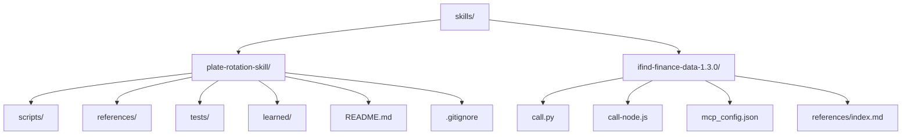
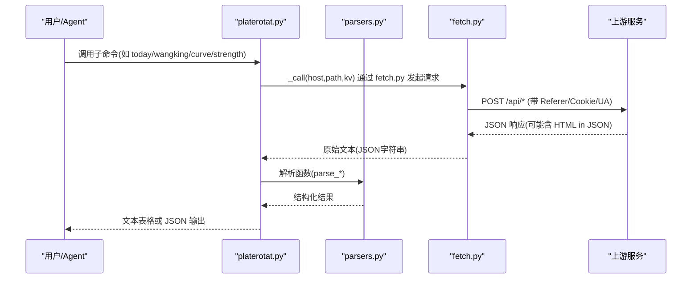
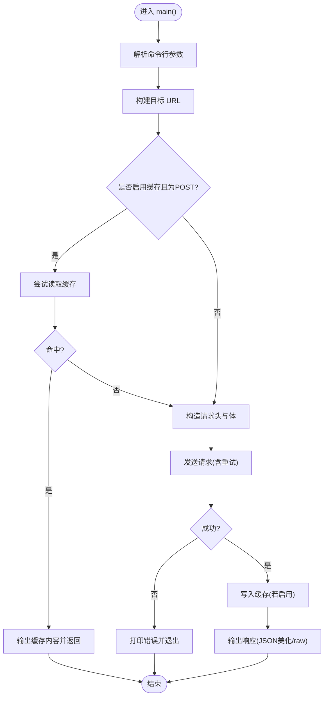
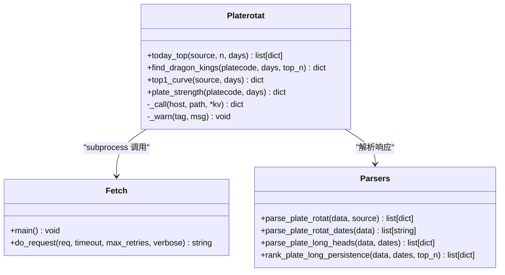
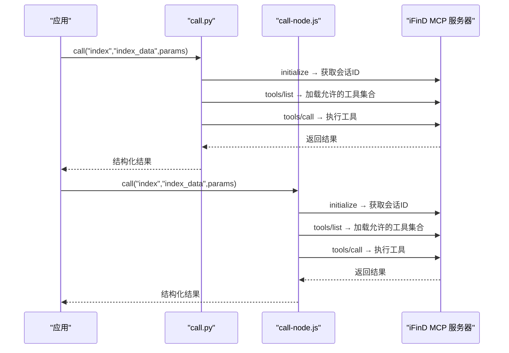
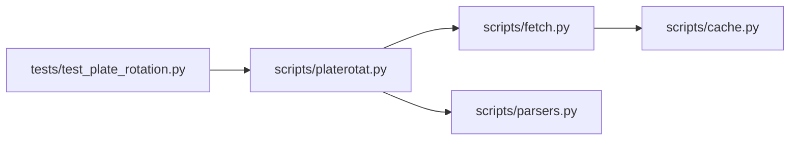

# 技能目录结构设计

<cite>
**本文引用的文件**   
- [skills/plate-rotation-skill/README.md](file://skills/plate-rotation-skill/README.md)
- [skills/plate-rotation-skill/.gitignore](file://skills/plate-rotation-skill/.gitignore)
- [skills/ifind-finance-data-1.3.0/mcp_config.json](file://skills/ifind-finance-data-1.3.0/mcp_config.json)
- [skills/plate-rotation-skill/scripts/fetch.py](file://skills/plate-rotation-skill/scripts/fetch.py)
- [skills/plate-rotation-skill/scripts/platerotat.py](file://skills/plate-rotation-skill/scripts/platerotat.py)
- [skills/plate-rotation-skill/scripts/parsers.py](file://skills/plate-rotation-skill/scripts/parsers.py)
- [skills/plate-rotation-skill/scripts/cache.py](file://skills/plate-rotation-skill/scripts/cache.py)
- [skills/plate-rotation-skill/tests/test_plate_rotation.py](file://skills/plate-rotation-skill/tests/test_plate_rotation.py)
- [skills/plate-rotation-skill/references/_INDEX.md](file://skills/plate-rotation-skill/references/_INDEX.md)
- [skills/plate-rotation-skill/learned/_meta.md](file://skills/plate-rotation-skill/learned/_meta.md)
- [skills/ifind-finance-data-1.3.0/call.py](file://skills/ifind-finance-data-1.3.0/call.py)
- [skills/ifind-finance-data-1.3.0/call-node.js](file://skills/ifind-finance-data-1.3.0/call-node.js)
</cite>

## 目录
1. [引言](#引言)
2. [项目结构](#项目结构)
3. [核心组件](#核心组件)
4. [架构总览](#架构总览)
5. [详细组件分析](#详细组件分析)
6. [依赖关系分析](#依赖关系分析)
7. [性能与可靠性考量](#性能与可靠性考量)
8. [故障排查指南](#故障排查指南)
9. [结论](#结论)
10. [附录：命名约定与扩展规范](#附录：命名约定与扩展规范)

## 引言
本指南面向开发者，系统化阐述“技能”（Skill）的目录结构设计原则与实践。结合仓库中两个真实技能示例（板块轮动、iFinD 金融数据），给出标准子目录职责划分、最佳实践、完整目录结构示例、文件命名约定、模块依赖关系与代码组织模式，并说明如何扩展自定义目录结构与保持向后兼容。

## 项目结构
仓库采用“按技能隔离”的组织方式，每个技能位于 skills/ 下的独立目录，内部遵循统一的结构约定：scripts 存放可执行脚本与业务逻辑，references 存放接口文档与领域知识，tests 存放测试用例，learned 沉淀经验与教训。

图示来源
- [skills/plate-rotation-skill/README.md:1-188](file://skills/plate-rotation-skill/README.md#L1-L188)
- [skills/ifind-finance-data-1.3.0/mcp_config.json:1-3](file://skills/ifind-finance-data-1.3.0/mcp_config.json#L1-L3)

章节来源
- [skills/plate-rotation-skill/README.md:1-188](file://skills/plate-rotation-skill/README.md#L1-L188)
- [skills/ifind-finance-data-1.3.0/mcp_config.json:1-3](file://skills/ifind-finance-data-1.3.0/mcp_config.json#L1-L3)

## 核心组件
- scripts：可执行脚本与业务实现层，包含网络调用封装、解析器、高级 API 与 CLI 入口、缓存等原子能力。
- references：API 文档、字段语义、路由表、领域事实与约束，供 Agent 或人类查阅。
- tests：在线集成测试与单元测试，覆盖接口健康度、解析正确性、CLI 行为与错误路径。
- learned：跨源经验沉淀、问题复盘与教训记录，持续反哺 references 与测试集。

章节来源
- [skills/plate-rotation-skill/scripts/fetch.py:1-230](file://skills/plate-rotation-skill/scripts/fetch.py#L1-L230)
- [skills/plate-rotation-skill/scripts/platerotat.py:1-315](file://skills/plate-rotation-skill/scripts/platerotat.py#L1-L315)
- [skills/plate-rotation-skill/scripts/parsers.py:1-212](file://skills/plate-rotation-skill/scripts/parsers.py#L1-L212)
- [skills/plate-rotation-skill/scripts/cache.py:1-145](file://skills/plate-rotation-skill/scripts/cache.py#L1-L145)
- [skills/plate-rotation-skill/tests/test_plate_rotation.py:1-444](file://skills/plate-rotation-skill/tests/test_plate_rotation.py#L1-L444)
- [skills/plate-rotation-skill/references/_INDEX.md:1-43](file://skills/plate-rotation-skill/references/_INDEX.md#L1-L43)
- [skills/plate-rotation-skill/learned/_meta.md:1-47](file://skills/plate-rotation-skill/learned/_meta.md#L1-L47)

## 架构总览
以“板块轮动”技能为例，整体分层如下：
- 上层：platerotat.py 暴露高级 helper 与 CLI，组合底层能力完成意图到数据的端到端流程。
- 中层：parsers.py 负责从 HTML-in-JSON 响应中抽取结构化数据；cache.py 提供本地缓存能力。
- 下层：fetch.py 统一发起 HTTP 请求，处理重试、缓存命中、Cookie/Referer 注入与输出格式化。

图示来源
- [skills/plate-rotation-skill/scripts/platerotat.py:55-71](file://skills/plate-rotation-skill/scripts/platerotat.py#L55-L71)
- [skills/plate-rotation-skill/scripts/fetch.py:128-213](file://skills/plate-rotation-skill/scripts/fetch.py#L128-L213)
- [skills/plate-rotation-skill/scripts/parsers.py:20-65](file://skills/plate-rotation-skill/scripts/parsers.py#L20-L65)

## 详细组件分析

### 标准技能目录职责与最佳实践
- scripts
  - 职责：实现可执行脚本、HTTP 客户端、解析器、高级 API、CLI 入口、缓存等。
  - 最佳实践：
    - 单一职责拆分：网络层(fetch)、解析层(parsers)、高层聚合(platerotat)、缓存(cache)。
    - 对外暴露稳定函数签名，CLI 仅做参数绑定与输出格式化。
    - 使用环境变量控制开关（如缓存开关、TTL）。
- references
  - 职责：接口路由表、字段语义、领域事实、双源差异、前缀规则等。
  - 最佳实践：
    - 维护索引文件(_INDEX.md)，集中列出所有接口与关键入参。
    - 明确数值单位与不可比较性，避免误用。
- tests
  - 职责：在线集成测试、解析正确性验证、CLI 行为校验、错误路径覆盖。
  - 最佳实践：
    - 共享 fixture 减少重复网络请求。
    - 断言返回结构、字段存在性与值域约束。
    - 覆盖空数据、跨源错传、周末/节假日等边界场景。
- learned
  - 职责：沉淀跨源经验、问题根因与应对策略、副作用清单。
  - 最佳实践：
    - 每次任务后追加条目，格式统一，便于检索。
    - 将失效沉淀及时迁移至 references 或修复测试。

章节来源
- [skills/plate-rotation-skill/references/_INDEX.md:1-43](file://skills/plate-rotation-skill/references/_INDEX.md#L1-L43)
- [skills/plate-rotation-skill/learned/_meta.md:1-47](file://skills/plate-rotation-skill/learned/_meta.md#L1-L47)
- [skills/plate-rotation-skill/tests/test_plate_rotation.py:1-444](file://skills/plate-rotation-skill/tests/test_plate_rotation.py#L1-L444)

### 网络调用层（fetch.py）
- 功能要点：
  - 统一 host alias 解析与 URL 构建。
  - 自动注入 Referer/Origin/UA，支持 Cookie 读取与环境变量覆盖。
  - 指数退避重试（429/5xx/网络异常），非重试码直接失败。
  - 默认对 POST 请求启用本地缓存，支持 TTL 与禁用开关。
  - 输出美化 JSON，失败回退 raw。
- 关键设计：
  - 通过环境变量 PR_COOKIE/PR_CACHE_DISABLE/PR_CACHE_TTL/PR_CACHE_DIR 控制行为。
  - 通过 --no-cache/--cache-ttl/--max-retries/--timeout 等参数细粒度控制。

图示来源
- [skills/plate-rotation-skill/scripts/fetch.py:128-213](file://skills/plate-rotation-skill/scripts/fetch.py#L128-L213)
- [skills/plate-rotation-skill/scripts/cache.py:59-94](file://skills/plate-rotation-skill/scripts/cache.py#L59-L94)

章节来源
- [skills/plate-rotation-skill/scripts/fetch.py:1-230](file://skills/plate-rotation-skill/scripts/fetch.py#L1-L230)
- [skills/plate-rotation-skill/scripts/cache.py:1-145](file://skills/plate-rotation-skill/scripts/cache.py#L1-L145)

### 解析层（parsers.py）
- 功能要点：
  - 从 HTML-in-JSON 响应中抽取板块排名、日期序列、龙头矩阵等。
  - 区分双源语义：ths 值为涨幅百分比，kaipan 值为强度分。
  - 提供持久化统计（妖王榜）与矩阵还原工具。
- 关键设计：
  - 正则表达式适配服务端 HTML 结构变化，兼容“无领涨”特殊样式。
  - 返回结构严格一致，便于上层断言与下游消费。

章节来源
- [skills/plate-rotation-skill/scripts/parsers.py:1-212](file://skills/plate-rotation-skill/scripts/parsers.py#L1-L212)

### 高层 API 与 CLI（platerotat.py）
- 功能要点：
  - 暴露四个高级 helper：today_top、find_dragon_kings、top1_curve、plate_strength。
  - 组合 fetch + parsers，屏蔽底层细节，提供“一个意图一个函数”的入口。
  - 提供 CLI 子命令 today/wangking/curve/strength，支持 text/json 双模输出。
- 关键设计：
  - 运行时校验：空数据或缺关键字段时输出 PR-EMPTY/PR-WARN 提示，辅助下游判断。
  - 自动 source 选择：根据板块代码前缀推断 ths/kaipan，降低调用方心智负担。

图示来源
- [skills/plate-rotation-skill/scripts/platerotat.py:102-218](file://skills/plate-rotation-skill/scripts/platerotat.py#L102-L218)
- [skills/plate-rotation-skill/scripts/fetch.py:128-213](file://skills/plate-rotation-skill/scripts/fetch.py#L128-L213)
- [skills/plate-rotation-skill/scripts/parsers.py:20-174](file://skills/plate-rotation-skill/scripts/parsers.py#L20-L174)

章节来源
- [skills/plate-rotation-skill/scripts/platerotat.py:1-315](file://skills/plate-rotation-skill/scripts/platerotat.py#L1-L315)

### 测试体系（tests/test_plate_rotation.py）
- 覆盖范围：
  - 底层 endpoint 健康度（4 个接口）。
  - 解析器正确性（5 个 helper）。
  - 高级 helper 签名与返回结构。
  - find_dragon_kings 自动路由（88x→ths，80x/803x→kaipan）。
  - CLI 子命令 text/json 双模输出与错误路径。
- 最佳实践：
  - 共享 fixture 复用网络数据，避免重复打网。
  - 断言字段存在性、值域与排序不变量。
  - 覆盖空数据、跨源错传、周末/节假日等边界。

章节来源
- [skills/plate-rotation-skill/tests/test_plate_rotation.py:1-444](file://skills/plate-rotation-skill/tests/test_plate_rotation.py#L1-L444)

### iFinD 金融数据技能（多语言 SDK）
- 特点：
  - 同时提供 Python 与 Node.js 两套 SDK，统一通过 mcp_config.json 管理认证令牌。
  - 基于 JSON-RPC 协议，先 initialize 建立会话，再 tools/list 获取可用工具集合，最后 tools/call 调用。
  - 内置参数校验与安全白名单，防止非法输入。
- 适用场景：
  - 指数行情、板块成分股指标、高频快照等查询。

图示来源
- [skills/ifind-finance-data-1.3.0/call.py:85-171](file://skills/ifind-finance-data-1.3.0/call.py#L85-L171)
- [skills/ifind-finance-data-1.3.0/call-node.js:149-220](file://skills/ifind-finance-data-1.3.0/call-node.js#L149-L220)
- [skills/ifind-finance-data-1.3.0/mcp_config.json:1-3](file://skills/ifind-finance-data-1.3.0/mcp_config.json#L1-L3)

章节来源
- [skills/ifind-finance-data-1.3.0/call.py:1-208](file://skills/ifind-finance-data-1.3.0/call.py#L1-L208)
- [skills/ifind-finance-data-1.3.0/call-node.js:1-267](file://skills/ifind-finance-data-1.3.0/call-node.js#L1-L267)
- [skills/ifind-finance-data-1.3.0/mcp_config.json:1-3](file://skills/ifind-finance-data-1.3.0/mcp_config.json#L1-L3)

## 依赖关系分析
- 模块耦合：
  - platerotat.py 依赖 fetch.py 与 parsers.py，形成清晰的分层。
  - fetch.py 依赖 cache.py，解耦缓存实现细节。
  - tests/test_plate_rotation.py 依赖 scripts 下各模块，进行端到端验证。
- 外部依赖：
  - fetch.py 仅使用 stdlib，确保零第三方依赖。
  - iFinD SDK 使用 requests（Python）与原生 http(s)（Node.js），需安装对应环境。

图示来源
- [skills/plate-rotation-skill/tests/test_plate_rotation.py:1-444](file://skills/plate-rotation-skill/tests/test_plate_rotation.py#L1-L444)
- [skills/plate-rotation-skill/scripts/platerotat.py:1-315](file://skills/plate-rotation-skill/scripts/platerotat.py#L1-L315)
- [skills/plate-rotation-skill/scripts/fetch.py:1-230](file://skills/plate-rotation-skill/scripts/fetch.py#L1-L230)
- [skills/plate-rotation-skill/scripts/parsers.py:1-212](file://skills/plate-rotation-skill/scripts/parsers.py#L1-L212)
- [skills/plate-rotation-skill/scripts/cache.py:1-145](file://skills/plate-rotation-skill/scripts/cache.py#L1-L145)

章节来源
- [skills/plate-rotation-skill/scripts/platerotat.py:1-315](file://skills/plate-rotation-skill/scripts/platerotat.py#L1-L315)
- [skills/plate-rotation-skill/scripts/fetch.py:1-230](file://skills/plate-rotation-skill/scripts/fetch.py#L1-L230)
- [skills/plate-rotation-skill/scripts/parsers.py:1-212](file://skills/plate-rotation-skill/scripts/parsers.py#L1-L212)
- [skills/plate-rotation-skill/scripts/cache.py:1-145](file://skills/plate-rotation-skill/scripts/cache.py#L1-L145)
- [skills/plate-rotation-skill/tests/test_plate_rotation.py:1-444](file://skills/plate-rotation-skill/tests/test_plate_rotation.py#L1-L444)

## 性能与可靠性考量
- 网络层
  - 指数退避重试：针对 429/5xx/网络异常，最大 3 次，间隔 1s/2s/4s，提升鲁棒性。
  - 本地缓存：默认 1 小时 TTL，减少重复请求，适合盘中“今日”数据；可通过 --no-cache 或环境变量关闭。
- 解析层
  - 正则匹配兼顾服务端 HTML 结构变化，降低解析失败概率。
- CLI 与输出
  - JSON 美化输出便于自动化消费；raw 模式用于调试。
- 资源清理
  - 提供缓存清理与统计工具，定期清理过期文件，避免磁盘膨胀。

章节来源
- [skills/plate-rotation-skill/scripts/fetch.py:47-124](file://skills/plate-rotation-skill/scripts/fetch.py#L47-L124)
- [skills/plate-rotation-skill/scripts/cache.py:35-94](file://skills/plate-rotation-skill/scripts/cache.py#L35-L94)
- [skills/plate-rotation-skill/scripts/cache.py:98-128](file://skills/plate-rotation-skill/scripts/cache.py#L98-L128)

## 故障排查指南
- 常见问题定位
  - 空数据警告：检查是否为周末/节假日、days 超前、或板块代码与 source 不匹配。
  - 跨源错传：88x 应走 ths，80x/803x 应走 kaipan，否则可能返回空。
  - 缓存干扰：盘中实时分析建议 --no-cache 或设置 PR_CACHE_DISABLE=1。
  - 上游异常：关注 PR-EMPTY/PR-WARN 提示，必要时查看 stderr 日志。
- 快速自检
  - 运行测试套件，确认接口健康与解析正确。
  - 使用 cache.py stats/clear 诊断缓存状态。
  - 使用 fetch.py --verbose 查看 URL/body/cookie 自检信息。

章节来源
- [skills/plate-rotation-skill/scripts/platerotat.py:75-98](file://skills/plate-rotation-skill/scripts/platerotat.py#L75-L98)
- [skills/plate-rotation-skill/scripts/fetch.py:193-213](file://skills/plate-rotation-skill/scripts/fetch.py#L193-L213)
- [skills/plate-rotation-skill/scripts/cache.py:132-145](file://skills/plate-rotation-skill/scripts/cache.py#L132-L145)
- [skills/plate-rotation-skill/tests/test_plate_rotation.py:330-444](file://skills/plate-rotation-skill/tests/test_plate_rotation.py#L330-L444)

## 结论
通过标准化的技能目录结构（scripts、references、tests、learned），可以实现清晰的职责分离、稳定的对外接口与完善的测试保障。结合缓存与重试机制、严格的参数校验与运行时提示，系统在易用性与鲁棒性之间取得良好平衡。建议在新增技能时沿用此结构，并在 learned 中持续沉淀经验，在 references 中同步更新领域知识与接口契约。

## 附录：命名约定与扩展规范
- 文件命名
  - 脚本：小写下划线，体现职责（如 fetch.py、parsers.py、platerotat.py、cache.py）。
  - 测试：test_<feature>.py，与功能一一对应。
  - 参考文档：api_<endpoint>.md，集中索引于 _INDEX.md。
  - 经验沉淀：_meta.md 作为跨源经验汇总，源专属经验放在 ths.md/kaipan.md 等。
- 模块依赖
  - 上层只依赖下层抽象（platerotat → fetch/parsers），避免反向依赖。
  - 缓存实现与调用层解耦，通过环境变量与参数控制。
- 向后兼容
  - 对外函数签名保持稳定，变更时优先增加可选参数而非破坏现有调用。
  - 新增 CLI 子命令时保留旧命令，逐步迁移。
  - 接口文档变更需同步更新 _INDEX.md 与测试用例。
- 自定义目录扩展
  - 可在 scripts/ 下新增子包（如 utils/、config/），但需在 README 中说明。
  - 新增配置项通过环境变量或配置文件（如 mcp_config.json）管理，避免硬编码。
  - 新增领域知识放入 references/，并在 _INDEX.md 中登记。

章节来源
- [skills/plate-rotation-skill/references/_INDEX.md:1-43](file://skills/plate-rotation-skill/references/_INDEX.md#L1-L43)
- [skills/ifind-finance-data-1.3.0/mcp_config.json:1-3](file://skills/ifind-finance-data-1.3.0/mcp_config.json#L1-L3)
- [skills/plate-rotation-skill/.gitignore:1-31](file://skills/plate-rotation-skill/.gitignore#L1-L31)