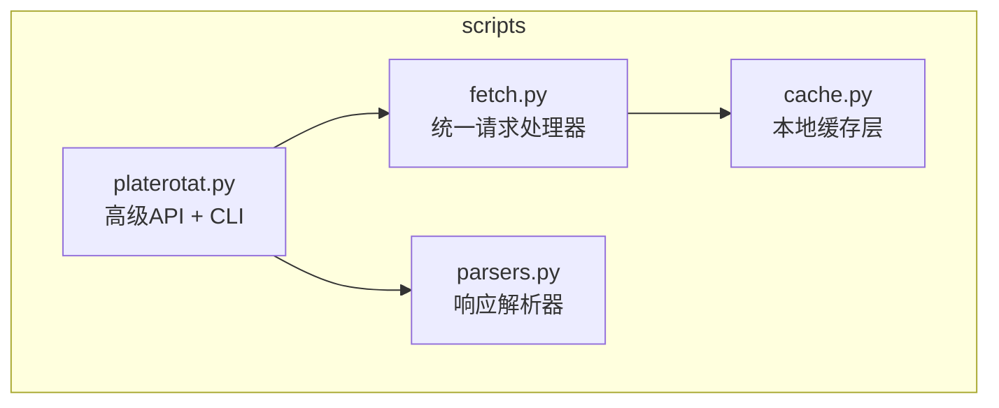
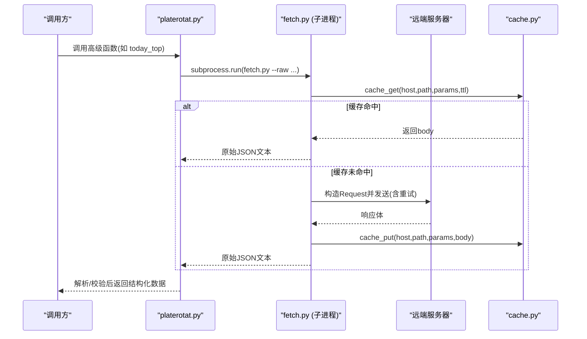
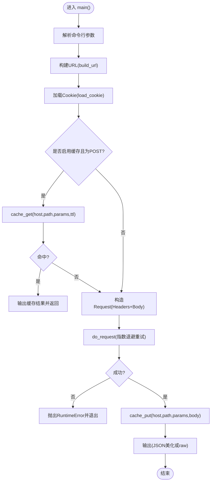
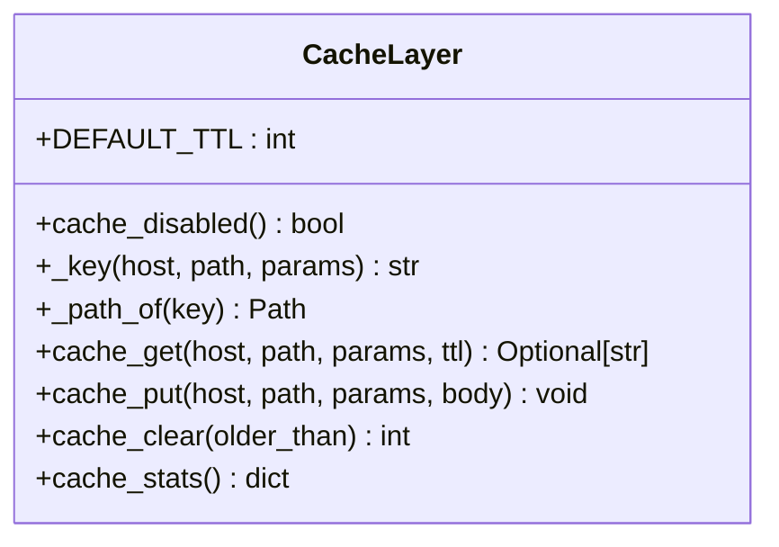
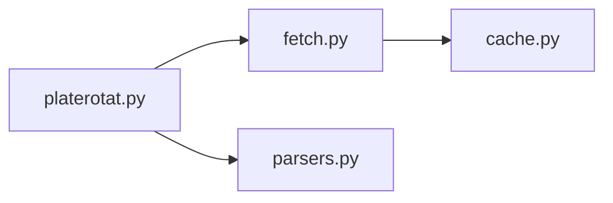

# HTTP客户端封装

<cite>
**本文引用的文件**   
- [fetch.py](file://skills/plate-rotation-skill/scripts/fetch.py)
- [cache.py](file://skills/plate-rotation-skill/scripts/cache.py)
- [parsers.py](file://skills/plate-rotation-skill/scripts/parsers.py)
- [platerotat.py](file://skills/plate-rotation-skill/scripts/platerotat.py)
</cite>

## 目录
1. [简介](#简介)
2. [项目结构](#项目结构)
3. [核心组件](#核心组件)
4. [架构总览](#架构总览)
5. [详细组件分析](#详细组件分析)
6. [依赖关系分析](#依赖关系分析)
7. [性能与可靠性](#性能与可靠性)
8. [故障排查指南](#故障排查指南)
9. [结论](#结论)
10. [附录：API使用示例与自定义配置](#附录api使用示例与自定义配置)

## 简介
本文件面向开发者，系统化梳理并文档化该仓库中的HTTP客户端封装能力。重点围绕统一请求处理器（fetch.py）的设计，包括URL构建、参数解析、请求头管理、响应处理；重试策略（指数退避、错误码分类、最大重试次数）；缓存机制（TTL、缓存键生成、存储策略）；Cookie管理与身份验证（环境变量读取与文件持久化）。同时提供完整的使用示例与自定义配置方法，帮助快速集成与扩展。

## 项目结构
scripts 目录下包含四个关键脚本：
- fetch.py：统一的HTTP调用层，负责URL构建、参数组装、请求头注入、重试与缓存、输出格式化。
- cache.py：本地磁盘缓存原子层，提供TTL控制、稳定键生成、读写与清理统计。
- parsers.py：针对板块轮动接口的HTML片段解析工具集。
- platerotat.py：高级API封装，组合底层接口并提供CLI入口。

图表来源
- [fetch.py:1-230](file://skills/plate-rotation-skill/scripts/fetch.py#L1-L230)
- [cache.py:1-145](file://skills/plate-rotation-skill/scripts/cache.py#L1-L145)
- [parsers.py:1-212](file://skills/plate-rotation-skill/scripts/parsers.py#L1-L212)
- [platerotat.py:1-315](file://skills/plate-rotation-skill/scripts/platerotat.py#L1-L315)

章节来源
- [fetch.py:1-230](file://skills/plate-rotation-skill/scripts/fetch.py#L1-L230)
- [cache.py:1-145](file://skills/plate-rotation-skill/scripts/cache.py#L1-L145)
- [parsers.py:1-212](file://skills/plate-rotation-skill/scripts/parsers.py#L1-L212)
- [platerotat.py:1-315](file://skills/plate-rotation-skill/scripts/platerotat.py#L1-L315)

## 核心组件
- 统一请求处理器（fetch.py）
  - URL构建：支持主机别名（main/data/x/ext），ext模式接受完整URL；自动补前导斜杠。
  - 参数解析：支持 key=value 列表与 JSON 参数（-p），二者互斥；GET将参数拼接到查询串，POST以表单编码发送。
  - 请求头管理：默认注入UA、Accept、语言、Referer、Origin、X-Requested-With；可选注入Cookie。
  - 响应处理：优先JSON美化输出，失败回退为原始文本；--raw直接输出原始字符串。
  - 重试策略：对429/5xx及网络异常进行指数退避重试，非重试的4xx直接抛出错误。
  - 缓存策略：仅对POST启用缓存，命中则直接返回；未命中则在成功后落盘。
  - Cookie与认证：优先从环境变量PR_COOKIE读取，其次从~/.plate_rotation_cookie文件中按行解析domain=cookie_string形式的第一条有效记录。
- 本地缓存层（cache.py）
  - TTL管理：默认1小时，可通过环境变量或参数覆盖；ttl<=0或全局禁用时跳过缓存。
  - 缓存键生成：基于host、path与排序后的key=value拼接，SHA1哈希得到稳定键。
  - 存储策略：~/.cache/plate-rotation/{key[:2]}/{key}.json，原子写入避免半写文件。
  - 诊断与清理：提供stats/clear等自检命令。
- 解析器（parsers.py）
  - 针对“HTML片段嵌入在JSON的html字段”的响应，抽取板块排名、日期矩阵、龙头股等信息。
- 高级API（platerotat.py）
  - 组合多个底层接口，提供today_top/find_dragon_kings/top1_curve/plate_strength等函数，并附带运行时校验提示。

章节来源
- [fetch.py:38-124](file://skills/plate-rotation-skill/scripts/fetch.py#L38-L124)
- [cache.py:35-95](file://skills/plate-rotation-skill/scripts/cache.py#L35-L95)
- [parsers.py:18-175](file://skills/plate-rotation-skill/scripts/parsers.py#L18-L175)
- [platerotat.py:54-218](file://skills/plate-rotation-skill/scripts/platerotat.py#L54-L218)

## 架构总览
整体流程：上层通过 platerotat.py 的高级函数发起意图级调用，内部通过子进程调用 fetch.py 执行HTTP请求；fetch.py 在请求前后与 cache.py 交互实现节流与新鲜度控制；响应经 parsers.py 解析后由上层聚合输出。

图表来源
- [platerotat.py:54-71](file://skills/plate-rotation-skill/scripts/platerotat.py#L54-L71)
- [fetch.py:128-213](file://skills/plate-rotation-skill/scripts/fetch.py#L128-L213)
- [cache.py:59-95](file://skills/plate-rotation-skill/scripts/cache.py#L59-L95)

## 详细组件分析

### 统一请求处理器（fetch.py）
- URL构建
  - 支持别名 main/data/x 映射到固定域名；ext 模式直接使用传入的完整URL；路径缺失前导斜杠时自动补齐。
- 参数解析
  - 支持两种姿势：key=value 列表与 -p JSON；二者不可同时使用；GET将参数编码为查询串，POST以 application/x-www-form-urlencoded 发送。
- 请求头管理
  - 默认注入浏览器风格UA、Accept、语言、Referer、Origin、XHR标记；若存在Cookie则追加Cookie头。
- 重试策略
  - 可重试状态码集合：429/500/502/503/504；其他4xx直接抛出错误。
  - 指数退避：基础间隔1秒，每次翻倍（1s/2s/4s），最多重试N次（默认3次）。
  - 网络异常（URLError/TimeoutError/ConnectionError）也参与重试；未知异常直接抛出。
- 缓存机制
  - 仅对POST启用缓存；--no-cache 或 PR_CACHE_DISABLE=1 关闭；--cache-ttl 调整新鲜度阈值。
  - 命中则直接输出；未命中则在成功后写入缓存。
- Cookie与认证
  - 优先级：环境变量 PR_COOKIE > 文件 ~/.plate_rotation_cookie（每行 domain=cookie_string，取第一条有效）。
  - 可通过 --no-cookie 禁止发送Cookie。
- 输出格式
  - 默认尝试JSON美化；--raw 直接输出原始文本；--verbose 打印URL/body/cookie摘要与重试信息。

图表来源
- [fetch.py:128-213](file://skills/plate-rotation-skill/scripts/fetch.py#L128-L213)
- [fetch.py:68-87](file://skills/plate-rotation-skill/scripts/fetch.py#L68-L87)
- [fetch.py:91-124](file://skills/plate-rotation-skill/scripts/fetch.py#L91-L124)
- [cache.py:59-95](file://skills/plate-rotation-skill/scripts/cache.py#L59-L95)

章节来源
- [fetch.py:38-124](file://skills/plate-rotation-skill/scripts/fetch.py#L38-L124)
- [fetch.py:128-213](file://skills/plate-rotation-skill/scripts/fetch.py#L128-L213)

### 本地缓存层（cache.py）
- TTL管理
  - 默认TTL来自环境变量 PR_CACHE_TTL（秒），也可通过 fetch.py 的 --cache-ttl 覆盖；ttl<=0 视为禁用。
  - 全局开关 PR_CACHE_DISABLE=1/true/yes 时完全禁用缓存。
- 缓存键生成
  - 将 host、path 与排序后的 key=value 拼接，使用SHA1生成稳定键，确保参数顺序不影响键值。
- 存储策略
  - 根目录 PR_CACHE_DIR（默认 ~/.cache/plate-rotation），二级目录 key[:2]，文件名 {key}.json。
  - 写入采用临时文件+os.replace原子替换，避免损坏。
- 诊断与清理
  - stats：统计文件数量与总大小；clear：按时间清理过期文件。

图表来源
- [cache.py:35-95](file://skills/plate-rotation-skill/scripts/cache.py#L35-L95)
- [cache.py:98-128](file://skills/plate-rotation-skill/scripts/cache.py#L98-L128)

章节来源
- [cache.py:35-95](file://skills/plate-rotation-skill/scripts/cache.py#L35-L95)
- [cache.py:98-128](file://skills/plate-rotation-skill/scripts/cache.py#L98-L128)

### 解析器（parsers.py）
- 主要职责：从“HTML片段嵌入在JSON的html字段”中抽取板块排名、日期序列、龙头股等结构化数据。
- 典型用法：先通过 fetch.py 获取原始JSON，再调用对应解析函数得到业务对象。

章节来源
- [parsers.py:18-175](file://skills/plate-rotation-skill/scripts/parsers.py#L18-L175)

### 高级API（platerotat.py）
- 组合 fetch.py 与 parsers.py，暴露高层函数：
  - today_top：今日Top N板块
  - find_dragon_kings：板块妖王榜（跨天龙头出现频次）
  - top1_curve：Top5板块N日排名变化曲线
  - plate_strength：单板块N日强度+量能时序
- 运行时校验：对空数据或缺关键字段给出明确警告，便于下游区分节假日/参数错误或上游异常。

章节来源
- [platerotat.py:54-218](file://skills/plate-rotation-skill/scripts/platerotat.py#L54-L218)

## 依赖关系分析
- fetch.py 依赖：
  - cache.py：用于POST请求的缓存命中与落盘。
  - 标准库：argparse/json/os/sys/urllib.*。
- platerotat.py 依赖：
  - fetch.py：通过子进程调用，传递 --raw 获取原始JSON。
  - parsers.py：解析响应并做业务聚合。
- cache.py 无外部依赖，纯stdlib实现。

图表来源
- [fetch.py:31-36](file://skills/plate-rotation-skill/scripts/fetch.py#L31-L36)
- [platerotat.py:34-48](file://skills/plate-rotation-skill/scripts/platerotat.py#L34-L48)

章节来源
- [fetch.py:31-36](file://skills/plate-rotation-skill/scripts/fetch.py#L31-L36)
- [platerotat.py:34-48](file://skills/plate-rotation-skill/scripts/platerotat.py#L34-L48)

## 性能与可靠性
- 重试与退避
  - 指数退避降低瞬时拥塞压力，适合应对限流（429）与服务端抖动（5xx）。
  - 建议根据服务端SLA合理设置 max-retries 与 timeout，避免过长等待。
- 缓存命中率
  - POST请求默认开启缓存，TTL=1h，适合盘中高频重复查询；需要强一致时可传 --cache-ttl 0 或 PR_CACHE_DISABLE=1。
- I/O原子性
  - 缓存写入采用临时文件+原子替换，减少并发写入导致的损坏风险。
- 输出优化
  - 默认JSON美化提升可读性；--raw 避免二次解析开销，适合管道处理。

[本节为通用指导，不直接分析具体文件]

## 故障排查指南
- 常见错误与定位
  - 4xx非重试码：直接抛出错误，检查参数与鉴权（Referer/Cookie）。
  - 429/5xx：触发重试，关注日志中的重试次数与间隔；必要时增大 --max-retries 或延长 --timeout。
  - 网络异常：URLError/TimeoutError/ConnectionError 会参与重试；检查网络连通性与DNS。
  - 缓存问题：PR_CACHE_DISABLE=1 可快速绕过；cache.py stats/clear 辅助诊断。
  - Cookie无效：确认 PR_COOKIE 或 ~/.plate_rotation_cookie 内容格式正确（domain=cookie_string）。
- 诊断命令
  - 查看缓存统计：python3 scripts/cache.py stats
  - 清理过期缓存：python3 scripts/cache.py clear --older 86400
  - 使用 --verbose 打印URL、body与cookie摘要，辅助定位请求差异。

章节来源
- [fetch.py:91-124](file://skills/plate-rotation-skill/scripts/fetch.py#L91-L124)
- [cache.py:98-145](file://skills/plate-rotation-skill/scripts/cache.py#L98-L145)

## 结论
该HTTP客户端封装以 fetch.py 为核心，结合 cache.py 的本地缓存与 platerotat.py 的高级API，形成高可用、易用的请求体系。其设计要点包括：稳定的URL与参数构建、健壮的重试与退避、可控的缓存新鲜度、灵活的Cookie与认证方式，以及清晰的输出与诊断能力。推荐在生产环境中结合业务需求调优超时、重试与TTL，以获得最佳稳定性与性能平衡。

[本节为总结性内容，不直接分析具体文件]

## 附录：API使用示例与自定义配置

- 基本用法（CLI）
  - 简单参数（form/query）：
    - python3 scripts/fetch.py main /api/getPlateRotatData from=ths days=20
  - 复杂参数（JSON）：
    - python3 scripts/fetch.py main /api/getLongByPlate -p '{"platecode":"886084","days":20}'
  - 探测/自检（打印URL与重试信息）：
    - python3 scripts/fetch.py main /api/getPlateRotatData from=ths days=20 -v
  - 指定方法与超时：
    - python3 scripts/fetch.py main /api/getPlateRotatData from=kaipan days=20 -X GET --timeout 30
  - 禁用缓存与调整TTL：
    - python3 scripts/fetch.py main /api/getLongByPlate -p '{"platecode":"886084","days":20}' --no-cache
    - python3 scripts/fetch.py main /api/getLongByPlate -p '{"platecode":"886084","days":20}' --cache-ttl 600
  - 自定义重试次数：
    - python3 scripts/fetch.py main /api/getLongByPlate -p '{"platecode":"886084","days":20}' --max-retries 5

- 环境变量与配置文件
  - PR_COOKIE：优先使用的Cookie字符串。
  - PR_CACHE_DISABLE：值为 1/true/yes 时全局禁用缓存。
  - PR_CACHE_TTL：默认缓存TTL（秒）。
  - PR_CACHE_DIR：自定义缓存根目录。
  - Cookie文件：~/.plate_rotation_cookie，每行 domain=cookie_string，取第一条有效记录。

- 高级API（Python导入）
  - 今日Top N板块：
    - from platerotat import today_top; rows = today_top(source="kaipan", n=10, days=20)
  - 板块妖王榜：
    - from platerotat import find_dragon_kings; res = find_dragon_kings(platecode="886084", days=20, top_n=10)
  - Top5排名曲线：
    - from platerotat import top1_curve; data = top1_curve(source="kaipan", days=20)
  - 单板块强度时序：
    - from platerotat import plate_strength; data = plate_strength(platecode="886084", days=20)

- 自定义配置建议
  - 生产环境建议：
    - 根据服务端限流策略设置合理的 --max-retries 与 --timeout。
    - 对热点接口适当提高 --cache-ttl，减少重复请求。
    - 使用 PR_CACHE_DIR 指向独立目录，便于监控与清理。
    - 通过 --verbose 收集首次运行日志，确认Referer/Cookie与目标服务期望一致。

章节来源
- [fetch.py:128-213](file://skills/plate-rotation-skill/scripts/fetch.py#L128-L213)
- [cache.py:35-95](file://skills/plate-rotation-skill/scripts/cache.py#L35-L95)
- [platerotat.py:100-218](file://skills/plate-rotation-skill/scripts/platerotat.py#L100-L218)