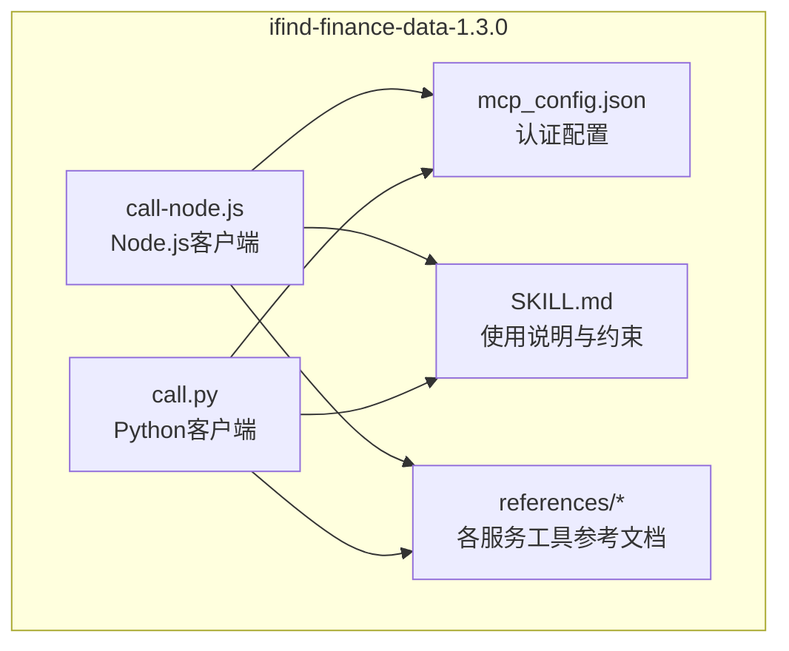
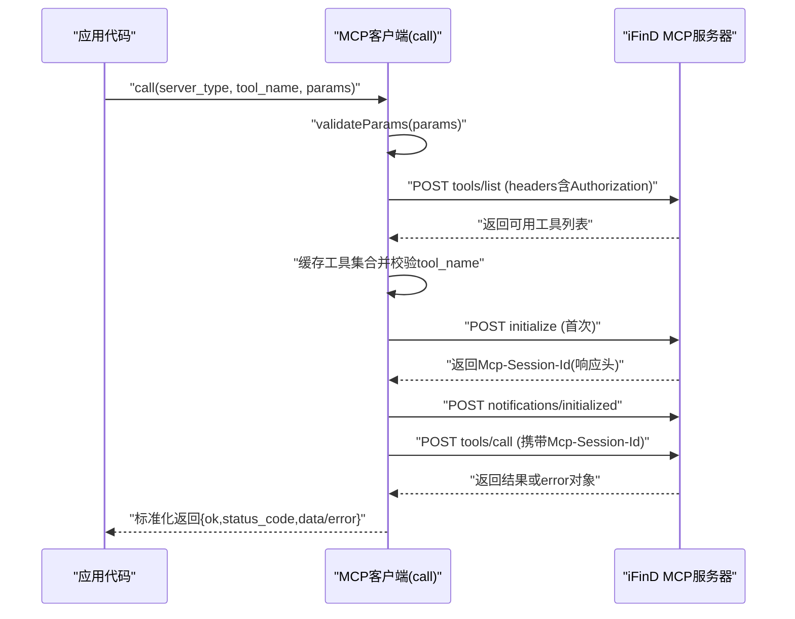
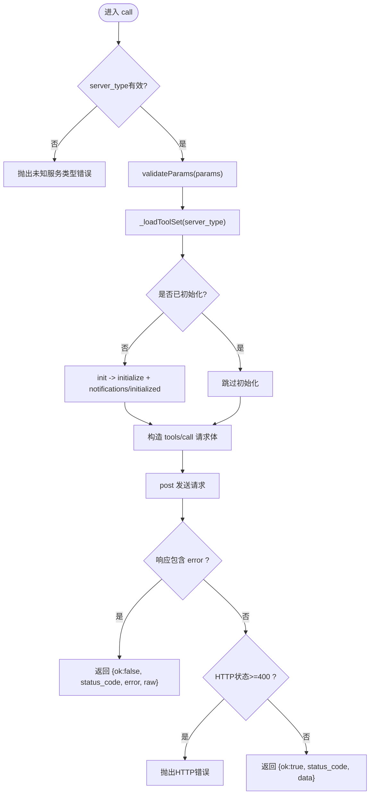
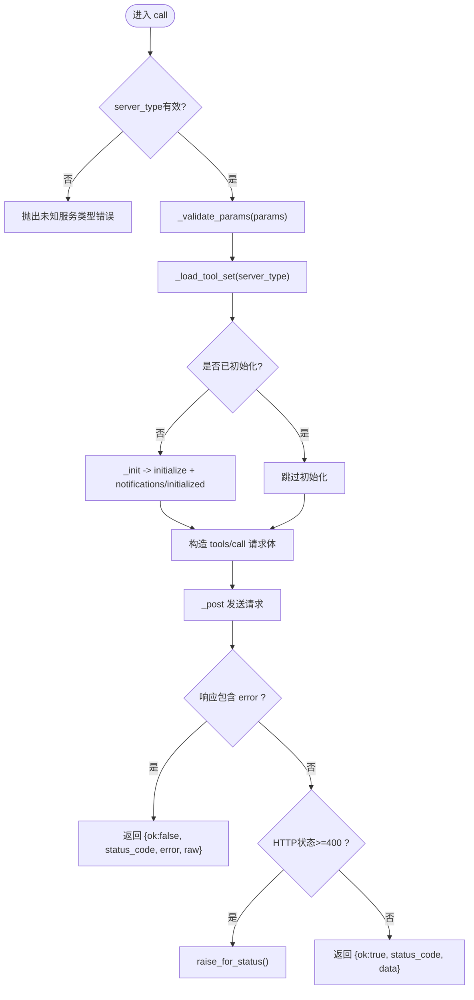
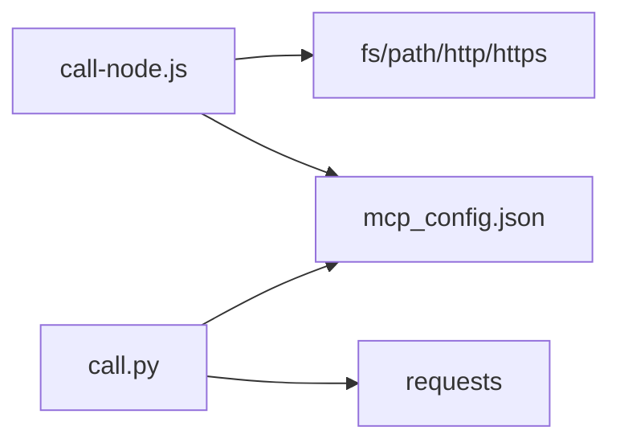

# MCP协议实现

<cite>
**本文引用的文件**   
- [call-node.js](file://skills/ifind-finance-data-1.3.0/call-node.js)
- [call.py](file://skills/ifind-finance-data-1.3.0/call.py)
- [mcp_config.json](file://skills/ifind-finance-data-1.3.0/mcp_config.json)
- [SKILL.md](file://skills/ifind-finance-data-1.3.0/SKILL.md)
- [references/index.md](file://skills/ifind-finance-data-1.3.0/references/index.md)
- [references/cn_stock.md](file://skills/ifind-finance-data-1.3.0/references/cn_stock.md)
- [references/fund.md](file://skills/ifind-finance-data-1.3.0/references/fund.md)
</cite>

## 目录
1. [简介](#简介)
2. [项目结构](#项目结构)
3. [核心组件](#核心组件)
4. [架构总览](#架构总览)
5. [详细组件分析](#详细组件分析)
6. [依赖关系分析](#依赖关系分析)
7. [性能与并发特性](#性能与并发特性)
8. [故障排查指南](#故障排查指南)
9. [结论](#结论)
10. [附录：扩展新工具与方法](#附录扩展新工具与方法)

## 简介
本指南面向开发者，系统性阐述本项目中基于HTTP的MCP（Model Context Protocol）客户端实现。重点覆盖以下方面：
- 通信机制与消息格式规范（JSON-RPC 2.0）
- 认证令牌管理与会话建立流程
- 请求构建、响应解析与错误处理
- Node.js与Python两套客户端的实现差异与最佳实践
- 如何扩展新的MCP工具与方法（接口定义、参数校验、返回值格式化）

## 项目结构
该仓库采用“按能力域组织”的结构，MCP客户端位于 ifind-finance-data-1.3.0 技能包内，提供Node.js与Python两种调用方式，并通过配置文件管理认证密钥。

图表来源
- [call-node.js:1-20](file://skills/ifind-finance-data-1.3.0/call-node.js#L1-L20)
- [call.py:1-20](file://skills/ifind-finance-data-1.3.0/call.py#L1-L20)
- [mcp_config.json:1-3](file://skills/ifind-finance-data-1.3.0/mcp_config.json#L1-L3)
- [SKILL.md:1-30](file://skills/ifind-finance-data-1.3.0/SKILL.md#L1-L30)

章节来源
- [SKILL.md:1-30](file://skills/ifind-finance-data-1.3.0/SKILL.md#L1-L30)

## 核心组件
- 认证与配置
  - 从 mcp_config.json 读取 auth_token，作为Authorization头携带至服务端。
- HTTP客户端封装
  - Node.js使用内置http/https模块；Python使用requests库。
- 会话管理
  - 通过initialize方法获取并缓存Mcp-Session-Id，后续请求自动附加。
- 工具集发现与校验
  - 通过tools/list拉取可用工具名集合，并在本地缓存；调用前进行白名单校验。
- 统一调用入口
  - call(server_type, tool_name, params)负责参数校验、会话初始化、工具白名单校验、构造JSON-RPC请求、解析响应与错误。

章节来源
- [call-node.js:6-18](file://skills/ifind-finance-data-1.3.0/call-node.js#L6-L18)
- [call.py:6-18](file://skills/ifind-finance-data-1.3.0/call.py#L6-L18)
- [call-node.js:117-176](file://skills/ifind-finance-data-1.3.0/call-node.js#L117-L176)
- [call.py:85-116](file://skills/ifind-finance-data-1.3.0/call.py#L85-L116)
- [call-node.js:178-220](file://skills/ifind-finance-data-1.3.0/call-node.js#L178-L220)
- [call.py:137-171](file://skills/ifind-finance-data-1.3.0/call.py#L137-L171)

## 架构总览
整体交互遵循“先初始化、再调用工具”的两阶段流程，所有业务调用均通过统一的JSON-RPC通道完成。

图表来源
- [call-node.js:117-176](file://skills/ifind-finance-data-1.3.0/call-node.js#L117-L176)
- [call-node.js:178-220](file://skills/ifind-finance-data-1.3.0/call-node.js#L178-L220)
- [call.py:85-116](file://skills/ifind-finance-data-1.3.0/call.py#L85-L116)
- [call.py:137-171](file://skills/ifind-finance-data-1.3.0/call.py#L137-L171)

## 详细组件分析

### Node.js客户端（call-node.js）
- 关键职责
  - 加载配置与服务器地址映射
  - 生成唯一请求ID、组装请求头（含Authorization与Mcp-Session-Id）
  - 发送HTTP POST请求并解析JSON
  - 参数安全校验（禁止原型链键、非法数值等）
  - 会话初始化与通知
  - 工具集发现与缓存
  - 统一调用与错误归一化
- 设计要点
  - 使用Set存储BLOCKED_KEYS，避免原型污染风险
  - 对非JSON文本做容错处理，兼容纯文本响应
  - 超时控制与异常传播
  - 工具集懒加载与内存缓存，减少重复网络开销

图表来源
- [call-node.js:178-220](file://skills/ifind-finance-data-1.3.0/call-node.js#L178-L220)
- [call-node.js:117-176](file://skills/ifind-finance-data-1.3.0/call-node.js#L117-L176)
- [call-node.js:81-115](file://skills/ifind-finance-data-1.3.0/call-node.js#L81-L115)

章节来源
- [call-node.js:1-20](file://skills/ifind-finance-data-1.3.0/call-node.js#L1-L20)
- [call-node.js:25-40](file://skills/ifind-finance-data-1.3.0/call-node.js#L25-L40)
- [call-node.js:42-79](file://skills/ifind-finance-data-1.3.0/call-node.js#L42-L79)
- [call-node.js:81-115](file://skills/ifind-finance-data-1.3.0/call-node.js#L81-L115)
- [call-node.js:117-176](file://skills/ifind-finance-data-1.3.0/call-node.js#L117-L176)
- [call-node.js:178-220](file://skills/ifind-finance-data-1.3.0/call-node.js#L178-L220)

### Python客户端（call.py）
- 关键职责
  - 与Node.js版本保持一致的职责划分与流程
  - 使用requests简化HTTP请求与响应处理
  - 参数校验逻辑与Node.js一致，但语言原生类型检查略有差异
- 设计要点
  - 使用字典与集合存储会话、请求ID与工具集
  - 对非JSON响应做容错处理
  - 使用raise_for_status快速失败于HTTP错误
  - 工具集缓存策略与Node.js一致

图表来源
- [call.py:137-171](file://skills/ifind-finance-data-1.3.0/call.py#L137-L171)
- [call.py:85-116](file://skills/ifind-finance-data-1.3.0/call.py#L85-L116)
- [call.py:59-83](file://skills/ifind-finance-data-1.3.0/call.py#L59-L83)

章节来源
- [call.py:1-20](file://skills/ifind-finance-data-1.3.0/call.py#L1-L20)
- [call.py:26-40](file://skills/ifind-finance-data-1.3.0/call.py#L26-L40)
- [call.py:42-57](file://skills/ifind-finance-data-1.3.0/call.py#L42-L57)
- [call.py:59-83](file://skills/ifind-finance-data-1.3.0/call.py#L59-L83)
- [call.py:85-116](file://skills/ifind-finance-data-1.3.0/call.py#L85-L116)
- [call.py:137-171](file://skills/ifind-finance-data-1.3.0/call.py#L137-L171)

### 认证与配置
- 认证令牌来源
  - 从 mcp_config.json 读取 auth_token，作为Authorization请求头。
- 配置位置
  - 两个客户端均在启动时读取同一配置文件，确保一致性。

章节来源
- [mcp_config.json:1-3](file://skills/ifind-finance-data-1.3.0/mcp_config.json#L1-L3)
- [call-node.js:6-8](file://skills/ifind-finance-data-1.3.0/call-node.js#L6-L8)
- [call.py:6-8](file://skills/ifind-finance-data-1.3.0/call.py#L6-L8)

### 会话建立过程
- 初始化步骤
  - 发送initialize请求，服务端在响应头返回Mcp-Session-Id
  - 客户端缓存会话ID，随后发送notifications/initialized通知
- 会话复用
  - 后续请求自动附带Mcp-Session-Id，无需重复初始化

章节来源
- [call-node.js:149-176](file://skills/ifind-finance-data-1.3.0/call-node.js#L149-L176)
- [call.py:85-116](file://skills/ifind-finance-data-1.3.0/call.py#L85-L116)

### 消息格式规范（JSON-RPC 2.0）
- 通用字段
  - jsonrpc: "2.0"
  - id: 自增整数（按server_type独立计数）
  - method: 如 "initialize"、"tools/list"、"tools/call"
  - params: 具体方法的参数对象
- 特殊方法
  - initialize：用于握手与会话建立
  - notifications/initialized：通知服务端已完成初始化
  - tools/list：查询当前用户可用的工具清单
  - tools/call：调用指定工具，name为工具名，arguments为参数对象

章节来源
- [call-node.js:124-130](file://skills/ifind-finance-data-1.3.0/call-node.js#L124-L130)
- [call-node.js:154-163](file://skills/ifind-finance-data-1.3.0/call-node.js#L154-L163)
- [call-node.js:190-198](file://skills/ifind-finance-data-1.3.0/call-node.js#L190-L198)
- [call.py:89-98](file://skills/ifind-finance-data-1.3.0/call.py#L89-L98)
- [call.py:146-154](file://skills/ifind-finance-data-1.3.0/call.py#L146-L154)

### 错误处理机制
- 参数校验错误
  - 拒绝非对象输入、数组、受保护键、NaN/Infinity、不支持类型等
- 工具白名单错误
  - 若工具不在当前用户可用列表中，直接抛出错误
- HTTP错误
  - Node.js：根据statusCode判断并抛出错误
  - Python：使用raise_for_status快速失败
- JSON-RPC错误
  - 当响应体包含error字段时，返回结构化错误对象（包含status_code、error、raw）

章节来源
- [call-node.js:81-115](file://skills/ifind-finance-data-1.3.0/call-node.js#L81-L115)
- [call-node.js:182-186](file://skills/ifind-finance-data-1.3.0/call-node.js#L182-L186)
- [call-node.js:202-213](file://skills/ifind-finance-data-1.3.0/call-node.js#L202-L213)
- [call.py:59-83](file://skills/ifind-finance-data-1.3.0/call.py#L59-L83)
- [call.py:141-144](file://skills/ifind-finance-data-1.3.0/call.py#L141-L144)
- [call.py:158-166](file://skills/ifind-finance-data-1.3.0/call.py#L158-L166)

### 实际调用示例与参考
- 指数板块服务
  - 工具：index_data、sector_data、index_highfreq_quotes
  - 参考文档与示例见 references/index.md
- 股票服务
  - 工具：search_stocks、get_stock_financials、stock_highfreq_quotes 等
  - 参考文档与示例见 references/cn_stock.md
- 基金服务
  - 工具：search_funds、fund_highfreq_quotes 等
  - 参考文档与示例见 references/fund.md

章节来源
- [references/index.md:1-63](file://skills/ifind-finance-data-1.3.0/references/index.md#L1-L63)
- [references/cn_stock.md:1-67](file://skills/ifind-finance-data-1.3.0/references/cn_stock.md#L1-L67)
- [references/fund.md:1-55](file://skills/ifind-finance-data-1.3.0/references/fund.md#L1-L55)

## 依赖关系分析
- Node.js客户端
  - 依赖：fs、path、http、https（均为内置模块）
  - 无第三方依赖，便于跨平台部署
- Python客户端
  - 依赖：requests（需安装）
  - 其他为标准库json、math、pathlib

图表来源
- [call-node.js:1-4](file://skills/ifind-finance-data-1.3.0/call-node.js#L1-L4)
- [call.py:1-4](file://skills/ifind-finance-data-1.3.0/call.py#L1-L4)
- [mcp_config.json:1-3](file://skills/ifind-finance-data-1.3.0/mcp_config.json#L1-L3)

章节来源
- [call-node.js:1-4](file://skills/ifind-finance-data-1.3.0/call-node.js#L1-L4)
- [call.py:1-4](file://skills/ifind-finance-data-1.3.0/call.py#L1-L4)

## 性能与并发特性
- 并发上限
  - 免费用户每秒最多并发2个请求；个人版正式用户5个；企业版正式用户10个
- 建议
  - 合理控制并发量，必要时引入队列或限流器
  - 利用工具集缓存减少重复网络请求
  - 针对高频实时行情场景，注意interval与data_mode参数的选择

章节来源
- [SKILL.md:26-29](file://skills/ifind-finance-data-1.3.0/SKILL.md#L26-L29)

## 故障排查指南
- 常见错误定位
  - 未设置或无效auth_token：检查mcp_config.json中的auth_token是否正确写入
  - 工具不存在或名称变更：调用list_tools获取当前可用工具清单，确认权限与服务端版本
  - 参数校验失败：确保params为对象且不含受保护键、非法数值或不支持类型
  - HTTP错误：检查网络连通性与服务端状态码
  - 会话缺失：确认initialize成功并收到Mcp-Session-Id
- 排查步骤
  - 优先查看返回的error对象与raw字段，定位服务端错误信息
  - 使用list_tools验证工具可用性
  - 降低并发或重试次数，观察是否因限流导致失败

章节来源
- [call-node.js:202-213](file://skills/ifind-finance-data-1.3.0/call-node.js#L202-L213)
- [call.py:158-166](file://skills/ifind-finance-data-1.3.0/call.py#L158-L166)
- [SKILL.md:100-111](file://skills/ifind-finance-data-1.3.0/SKILL.md#L100-L111)

## 结论
本项目提供了稳定、易用的MCP客户端实现，涵盖认证、会话、工具发现与调用全流程。Node.js与Python双实现保证了在不同运行环境下的可移植性。通过严格的参数校验与错误归一化，提升了健壮性与可维护性。建议在业务层结合并发限制与重试策略，以获得更稳定的数据访问体验。

## 附录：扩展新工具与方法
- 新增工具的基本步骤
  - 在服务端注册新工具后，通过tools/list获取最新工具清单
  - 在业务侧更新工具白名单（客户端已自动缓存，下次调用会刷新）
  - 在对应服务的参考文档中补充工具说明与示例
- 接口定义与参数校验
  - 保持params为对象，避免受保护键与非法数值
  - 如需新增必填字段，应在上层业务逻辑中进行前置校验
- 返回值格式化
  - 客户端已统一返回{ok, status_code, data/error, raw}，上层可按ok分支处理成功与失败路径
- 最佳实践
  - 优先直接调用工具，遇到异常再回退到list_tools
  - 对高频实时行情使用合适的data_mode与interval
  - 记录并监控错误率与延迟，持续优化调用策略

章节来源
- [call-node.js:117-147](file://skills/ifind-finance-data-1.3.0/call-node.js#L117-L147)
- [call.py:119-134](file://skills/ifind-finance-data-1.3.0/call.py#L119-L134)
- [SKILL.md:100-111](file://skills/ifind-finance-data-1.3.0/SKILL.md#L100-L111)