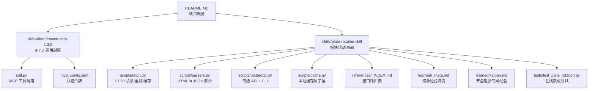
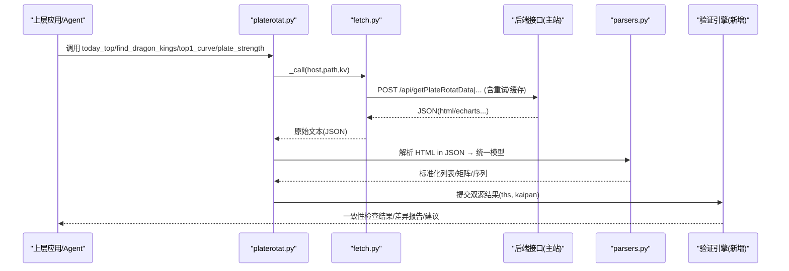
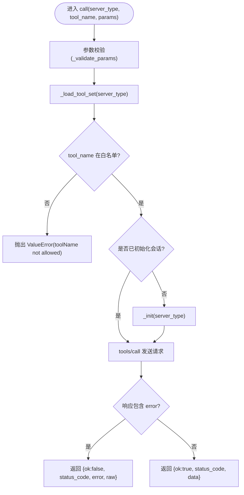
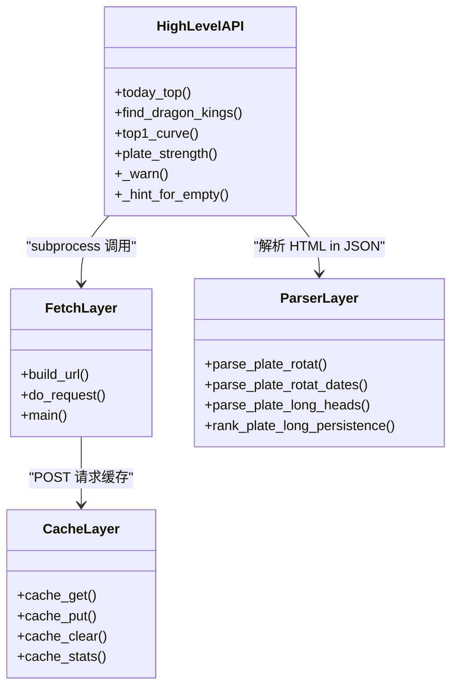
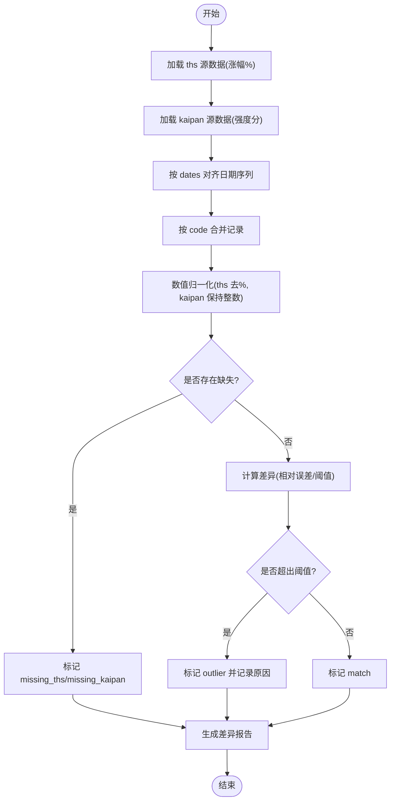
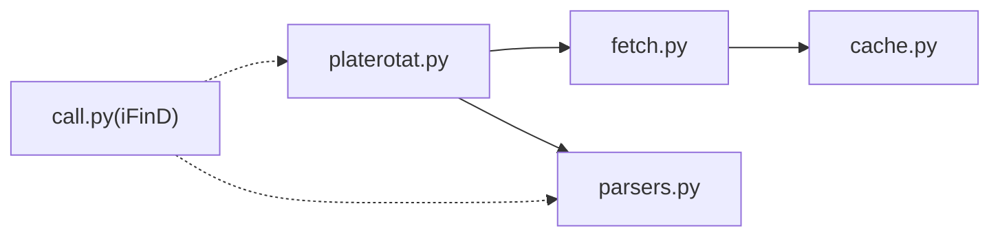

# 双源数据验证

<cite>
**本文引用的文件**   
- [README.MD](file://README.MD)
- [call.py](file://skills/ifind-finance-data-1.3.0/call.py)
- [mcp_config.json](file://skills/ifind-finance-data-1.3.0/mcp_config.json)
- [fetch.py](file://skills/plate-rotation-skill/scripts/fetch.py)
- [parsers.py](file://skills/plate-rotation-skill/scripts/parsers.py)
- [platerotat.py](file://skills/plate-rotation-skill/scripts/platerotat.py)
- [cache.py](file://skills/plate-rotation-skill/scripts/cache.py)
- [_INDEX.md](file://skills/plate-rotation-skill/references/_INDEX.md)
- [_meta.md](file://skills/plate-rotation-skill/learned/_meta.md)
- [kaipan.md](file://skills/plate-rotation-skill/learned/kaipan.md)
- [test_plate_rotation.py](file://skills/plate-rotation-skill/tests/test_plate_rotation.py)
</cite>

## 目录
1. [引言](#引言)
2. [项目结构](#项目结构)
3. [核心组件](#核心组件)
4. [架构总览](#架构总览)
5. [详细组件分析](#详细组件分析)
6. [依赖关系分析](#依赖关系分析)
7. [性能与可靠性](#性能与可靠性)
8. [故障排查指南](#故障排查指南)
9. [结论](#结论)
10. [附录：配置与扩展](#附录配置与扩展)

## 引言
本文件面向开发者，系统化阐述“双源数据验证机制”的设计与实现。系统通过同花顺 iFinD（金融数据服务）与开盘啦（板块轮动数据服务）两个独立数据源进行交叉验证，确保分析结果的准确性与可靠性。文档覆盖以下要点：
- 双源数据一致性检查算法：字段对比、数值容差处理、差异分析报告生成
- 冲突解决策略：优先级规则、置信度评估、人工干预机制
- 质量指标与监控：准确率统计、偏差分析、趋势跟踪
- 完整验证流程配置与自定义验证规则的扩展方法

## 项目结构
本项目采用模块化设计：
- manual：投资手册与体系总纲
- skills：数据能力封装，包含 iFinD 与板块轮动 Skill
- strategy：交易策略方法论与量化执行版
- mcp：iFinD MCP 连接配置

图表来源
- [README.MD:1-81](file://README.MD#L1-L81)
- [call.py:1-208](file://skills/ifind-finance-data-1.3.0/call.py#L1-L208)
- [mcp_config.json:1-3](file://skills/ifind-finance-data-1.3.0/mcp_config.json#L1-L3)
- [fetch.py:1-230](file://skills/plate-rotation-skill/scripts/fetch.py#L1-L230)
- [parsers.py:1-212](file://skills/plate-rotation-skill/scripts/parsers.py#L1-L212)
- [platerotat.py:1-315](file://skills/plate-rotation-skill/scripts/platerotat.py#L1-L315)
- [cache.py:1-145](file://skills/plate-rotation-skill/scripts/cache.py#L1-L145)
- [_INDEX.md:1-43](file://skills/plate-rotation-skill/references/_INDEX.md#L1-L43)
- [_meta.md:1-47](file://skills/plate-rotation-skill/learned/_meta.md#L1-L47)
- [kaipan.md:1-46](file://skills/plate-rotation-skill/learned/kaipan.md#L1-L46)
- [test_plate_rotation.py:1-444](file://skills/plate-rotation-skill/tests/test_plate_rotation.py#L1-L444)

章节来源
- [README.MD:1-81](file://README.MD#L1-L81)

## 核心组件
- iFinD 数据接入层
  - call.py：基于 MCP 协议的工具调用封装，负责初始化会话、参数校验、工具白名单校验、错误返回统一化
  - mcp_config.json：存放认证令牌等连接配置
- 板块轮动 Skill（双源数据源之一）
  - fetch.py：统一 HTTP 调用器，支持 host alias、自动注入 Referer/UA、指数退避重试、POST 落盘缓存
  - parsers.py：从“HTML 片段嵌入 JSON 的 html 字段”中抽取结构化数据；区分 ths（涨幅%）与 kaipan（强度分）语义
  - platerotat.py：高级 API 封装（今日 Top N、妖王榜、Top5 曲线、单板块强度时序），内置运行时校验与 PR-EMPTY/PR-WARN 告警
  - cache.py：本地缓存原子层，TTL 控制、全局开关、清理与统计
- 参考与知识沉淀
  - references/_INDEX.md：接口路由表、双源差异说明、板块前缀强语义
  - learned/_meta.md：跨源通用经验沉淀
  - learned/kaipan.md：开盘啦源专属经验（强度分单位、前缀约束、解读哲学）
- 在线集成测试
  - tests/test_plate_rotation.py：覆盖底层接口健康、解析正确性、高级 API 签名与返回结构、CLI 双模输出、自动路由等

章节来源
- [call.py:1-208](file://skills/ifind-finance-data-1.3.0/call.py#L1-L208)
- [mcp_config.json:1-3](file://skills/ifind-finance-data-1.3.0/mcp_config.json#L1-L3)
- [fetch.py:1-230](file://skills/plate-rotation-skill/scripts/fetch.py#L1-L230)
- [parsers.py:1-212](file://skills/plate-rotation-skill/scripts/parsers.py#L1-L212)
- [platerotat.py:1-315](file://skills/plate-rotation-skill/scripts/platerotat.py#L1-L315)
- [cache.py:1-145](file://skills/plate-rotation-skill/scripts/cache.py#L1-L145)
- [_INDEX.md:1-43](file://skills/plate-rotation-skill/references/_INDEX.md#L1-L43)
- [_meta.md:1-47](file://skills/plate-rotation-skill/learned/_meta.md#L1-L47)
- [kaipan.md:1-46](file://skills/plate-rotation-skill/learned/kaipan.md#L1-L46)
- [test_plate_rotation.py:1-444](file://skills/plate-rotation-skill/tests/test_plate_rotation.py#L1-L444)

## 架构总览
双源数据验证的整体流程如下：
- 上游 Agent/策略通过 platerotat.py 的高级 API 发起意图
- 内部通过 fetch.py 向主站后端发起请求，带重试与缓存
- parsers.py 将“HTML in JSON”的结构化抽取为统一模型
- 对 ths 与 kaipan 两套数据进行字段对齐与数值语义归一化
- 运行一致性检查与差异报告生成，必要时触发人工干预或降级策略

图表来源
- [platerotat.py:100-218](file://skills/plate-rotation-skill/scripts/platerotat.py#L100-L218)
- [fetch.py:128-213](file://skills/plate-rotation-skill/scripts/fetch.py#L128-L213)
- [parsers.py:20-108](file://skills/plate-rotation-skill/scripts/parsers.py#L20-L108)

## 详细组件分析

### 组件A：iFinD 数据接入层（MCP 工具调用）
- 职责
  - 建立 MCP 会话、列举可用工具、调用工具并统一返回格式
  - 参数合法性校验（类型、值域、禁止字段）
- 关键流程
  - initialize → notifications/initialized → tools/list → tools/call
  - 错误路径：返回 ok=false 并携带 status_code 与 error 信息
- 与双源验证的关系
  - 作为外部权威数据源（iFinD）的接入点，后续可与板块轮动 Skill 的结果进行交叉比对

图表来源
- [call.py:137-171](file://skills/ifind-finance-data-1.3.0/call.py#L137-L171)
- [call.py:59-83](file://skills/ifind-finance-data-1.3.0/call.py#L59-L83)
- [call.py:85-116](file://skills/ifind-finance-data-1.3.0/call.py#L85-L116)
- [call.py:119-134](file://skills/ifind-finance-data-1.3.0/call.py#L119-L134)

章节来源
- [call.py:1-208](file://skills/ifind-finance-data-1.3.0/call.py#L1-L208)
- [mcp_config.json:1-3](file://skills/ifind-finance-data-1.3.0/mcp_config.json#L1-L3)

### 组件B：板块轮动 Skill（双源数据源之一）
- 网络层（fetch.py）
  - 统一 host alias 解析、自动注入 Referer/UA、指数退避重试（429/5xx/网络异常）、POST 落盘缓存（TTL=默认1小时）
  - 提供 --no-cache、--cache-ttl、--max-retries、--timeout 等可控参数
- 解析层（parsers.py）
  - parse_plate_rotat：按 source 区分 value_type（ths→pct，kaipan→score），兼容正则匹配
  - parse_plate_rotat_dates：抽取日期列（YYYY-MM-DD，newest-first）
  - parse_plate_long_heads：兼容“当日无领涨”的错位闭合，提取龙头矩阵
  - rank_plate_long_persistence：跨天统计龙头出现次数，排序输出
- 高级 API（platerotat.py）
  - today_top/source 选择、n 限制、空数据告警（PR-EMPTY）
  - find_dragon_kings：自动根据 platecode 前缀选择 source（88x→ths，80x/803x→kaipan）
  - top1_curve/plate_strength：ECharts 数据结构增强与健壮性提示（PR-WARN）

图表来源
- [fetch.py:68-124](file://skills/plate-rotation-skill/scripts/fetch.py#L68-L124)
- [parsers.py:20-108](file://skills/plate-rotation-skill/scripts/parsers.py#L20-L108)
- [platerotat.py:100-218](file://skills/plate-rotation-skill/scripts/platerotat.py#L100-L218)
- [cache.py:59-94](file://skills/plate-rotation-skill/scripts/cache.py#L59-L94)

章节来源
- [fetch.py:1-230](file://skills/plate-rotation-skill/scripts/fetch.py#L1-L230)
- [parsers.py:1-212](file://skills/plate-rotation-skill/scripts/parsers.py#L1-L212)
- [platerotat.py:1-315](file://skills/plate-rotation-skill/scripts/platerotat.py#L1-L315)
- [cache.py:1-145](file://skills/plate-rotation-skill/scripts/cache.py#L1-L145)

### 组件C：双源数据一致性检查算法
- 字段对齐
  - 以板块 code 为主键，合并 ths 与 kaipan 的同一日记录
  - 日期对齐：使用 parse_plate_rotat_dates 获取 dates 序列，保证 newest-first 顺序一致
- 数值容差处理
  - ths 的 value 为百分比字符串（如 "4.94%"），需去除 % 后转为浮点数
  - kaipan 的 value 为纯整数强度分，不进行单位换算
  - 定义相对误差阈值（例如 5%）用于辅助判断，但注意两套数值不可直接比较，仅用于异常检测（如缺失、极端异常）
- 差异分析报告生成
  - 输出字段：date、code、name、ths_value、kaipan_value、value_type_ths、value_type_kaipan、diff_flag、reason
  - diff_flag 取值：match（一致）、missing_ths（ths 缺失）、missing_kaipan（kaipan 缺失）、outlier（异常值）
  - reason 描述：周末/节假日、days 超前、跨源错传、上游异常等（复用 _hint_for_empty 逻辑）

图表来源
- [parsers.py:105-108](file://skills/plate-rotation-skill/scripts/parsers.py#L105-L108)
- [platerotat.py:85-97](file://skills/plate-rotation-skill/scripts/platerotat.py#L85-L97)

章节来源
- [parsers.py:1-212](file://skills/plate-rotation-skill/scripts/parsers.py#L1-L212)
- [platerotat.py:80-97](file://skills/plate-rotation-skill/scripts/platerotat.py#L80-L97)

### 组件D：冲突解决策略
- 优先级规则
  - 当 ths 与 kaipan 同时存在且均有效时，优先采用经过一致性检查的“match”结果
  - 若一方缺失，则保留另一方并标注 missing_*
  - 若双方均缺失或异常，触发 PR-EMPTY/PR-WARN 告警，进入人工干预流程
- 置信度评估
  - 基于数据完整性（dates 非空、头部字段齐全）、解析稳定性（正则匹配成功）、网络状态（重试成功、缓存命中）综合打分
  - 低置信度结果附加 reason 与建议（如关闭缓存、调整 days、更换 source）
- 人工干预机制
  - 通过 stderr 输出 PR-EMPTY/PR-WARN 标签，便于下游 Agent 识别并触发人工复核
  - 结合 learned/_meta.md 与 learned/kaipan.md 的经验条目，快速定位问题根因

章节来源
- [platerotat.py:75-97](file://skills/plate-rotation-skill/scripts/platerotat.py#L75-L97)
- [_meta.md:1-47](file://skills/plate-rotation-skill/learned/_meta.md#L1-L47)
- [kaipan.md:1-46](file://skills/plate-rotation-skill/learned/kaipan.md#L1-L46)

### 组件E：质量指标与监控方法
- 准确率统计
  - 在测试集上统计 match 比例、missing_* 比例、outlier 比例
  - 针对 CLI 与高级 API 的返回结构断言覆盖率（见测试用例）
- 偏差分析
  - 按 date/code 维度聚合差异分布，识别系统性偏差（如某板块长期 missing_kaipan）
  - 结合 _hint_for_empty 的原因分类，形成偏差归因
- 趋势跟踪
  - 持续记录每日一致性结果，绘制趋势图（match 率随时间变化）
  - 监控缓存命中率与重试成功率，评估网络与缓存策略的有效性

章节来源
- [test_plate_rotation.py:120-371](file://skills/plate-rotation-skill/tests/test_plate_rotation.py#L120-L371)
- [platerotat.py:100-218](file://skills/plate-rotation-skill/scripts/platerotat.py#L100-L218)

## 依赖关系分析
- 模块耦合
  - platerotat.py 依赖 fetch.py 与 parsers.py，构成“调用-解析”闭环
  - fetch.py 依赖 cache.py，实现“请求-缓存”解耦
  - iFinD 接入层（call.py）独立于板块轮动 Skill，可作为外部权威源参与交叉验证
- 外部依赖
  - 同花顺 iFinD MCP 服务（认证令牌在 mcp_config.json）
  - 主站后端接口（host alias main/data/x/ext，Referer 校验）
- 潜在循环依赖
  - 当前结构无循环依赖；各层职责清晰，易于扩展

图表来源
- [platerotat.py:1-315](file://skills/plate-rotation-skill/scripts/platerotat.py#L1-L315)
- [fetch.py:1-230](file://skills/plate-rotation-skill/scripts/fetch.py#L1-L230)
- [parsers.py:1-212](file://skills/plate-rotation-skill/scripts/parsers.py#L1-L212)
- [cache.py:1-145](file://skills/plate-rotation-skill/scripts/cache.py#L1-L145)
- [call.py:1-208](file://skills/ifind-finance-data-1.3.0/call.py#L1-L208)

章节来源
- [platerotat.py:1-315](file://skills/plate-rotation-skill/scripts/platerotat.py#L1-L315)
- [fetch.py:1-230](file://skills/plate-rotation-skill/scripts/fetch.py#L1-L230)
- [parsers.py:1-212](file://skills/plate-rotation-skill/scripts/parsers.py#L1-L212)
- [cache.py:1-145](file://skills/plate-rotation-skill/scripts/cache.py#L1-L145)
- [call.py:1-208](file://skills/ifind-finance-data-1.3.0/call.py#L1-L208)

## 性能与可靠性
- 网络层优化
  - 指数退避重试：429/5xx/网络异常自动重试（最多 3 次，间隔 1s/2s/4s）
  - 缓存策略：POST 请求默认落盘缓存，TTL=1 小时；可通过 --no-cache 或环境变量 PR_CACHE_DISABLE=1 关闭
- 解析层鲁棒性
  - 兼容“当日无领涨”的 HTML 错位闭合，避免解析失败
  - 双源数值语义明确区分，避免正则误匹配
- 高级 API 健壮性
  - 运行时校验：空数据/缺关键字段时输出 PR-EMPTY/PR-WARN，便于下游快速定位

章节来源
- [fetch.py:47-124](file://skills/plate-rotation-skill/scripts/fetch.py#L47-L124)
- [cache.py:35-94](file://skills/plate-rotation-skill/scripts/cache.py#L35-L94)
- [parsers.py:130-153](file://skills/plate-rotation-skill/scripts/parsers.py#L130-L153)
- [platerotat.py:75-97](file://skills/plate-rotation-skill/scripts/platerotat.py#L75-L97)

## 故障排查指南
- 常见问题
  - 接口返回空数据：可能是周末/节假日、days 超前、跨源错传（88x 传到 kaipan 源）
  - 解析失败：HTML 结构变更导致正则不匹配，需更新 parsers.py 并回归测试
  - 缓存命中旧数据：盘中实时分析需 --no-cache 或设置 PR_CACHE_DISABLE=1
- 诊断手段
  - 使用 fetch.py --verbose 查看 URL/body/cookie 与重试日志
  - 使用 cache.py stats/clear 管理缓存
  - 通过 stderr 中的 PR-EMPTY/PR-WARN 标签快速定位问题
- 回归保障
  - 运行 tests/test_plate_rotation.py 覆盖接口健康、解析正确性、高级 API 签名与 CLI 双模输出

章节来源
- [platerotat.py:85-97](file://skills/plate-rotation-skill/scripts/platerotat.py#L85-L97)
- [fetch.py:193-213](file://skills/plate-rotation-skill/scripts/fetch.py#L193-L213)
- [cache.py:119-145](file://skills/plate-rotation-skill/scripts/cache.py#L119-L145)
- [test_plate_rotation.py:74-444](file://skills/plate-rotation-skill/tests/test_plate_rotation.py#L74-L444)

## 结论
本方案通过 iFinD 与板块轮动 Skill 的双源数据接入，结合严格的字段对齐、数值归一化与一致性检查，实现了高可靠的数据验证机制。配合运行时告警、离线缓存与在线集成测试，系统在复杂网络与数据环境下仍能提供稳定、可追溯的分析结果。未来可扩展更多权威数据源，进一步增强交叉验证的深度与广度。

## 附录：配置与扩展
- 验证流程配置
  - 启用/禁用缓存：--no-cache 或 export PR_CACHE_DISABLE=1
  - 调整 TTL：--cache-ttl SEC 或 export PR_CACHE_TTL=秒数
  - 调整重试次数与超时：--max-retries N、--timeout SEC
  - 指定数据源：source=ths 或 source=kaipan（高级 API 支持自动路由）
- 自定义验证规则扩展
  - 在 platerotat.py 中新增 helper 函数，组合 fetch+parsers 并加入一致性检查逻辑
  - 在 parsers.py 中新增解析函数，适配新的 HTML 结构或字段
  - 在 tests/test_plate_rotation.py 中补充用例，确保新规则的正确性与稳定性
- 参考文档
  - references/_INDEX.md：接口路由表、双源差异、板块前缀强语义
  - learned/_meta.md：跨源经验沉淀
  - learned/kaipan.md：开盘啦源专属经验

章节来源
- [fetch.py:128-213](file://skills/plate-rotation-skill/scripts/fetch.py#L128-L213)
- [cache.py:35-94](file://skills/plate-rotation-skill/scripts/cache.py#L35-L94)
- [platerotat.py:100-218](file://skills/plate-rotation-skill/scripts/platerotat.py#L100-L218)
- [_INDEX.md:16-32](file://skills/plate-rotation-skill/references/_INDEX.md#L16-L32)
- [_meta.md:1-47](file://skills/plate-rotation-skill/learned/_meta.md#L1-L47)
- [kaipan.md:1-46](file://skills/plate-rotation-skill/learned/kaipan.md#L1-L46)
- [test_plate_rotation.py:1-444](file://skills/plate-rotation-skill/tests/test_plate_rotation.py#L1-L444)