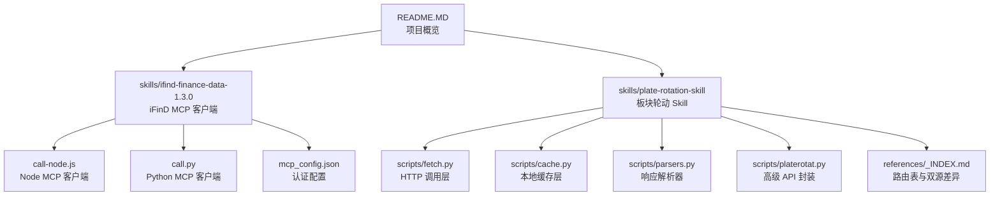
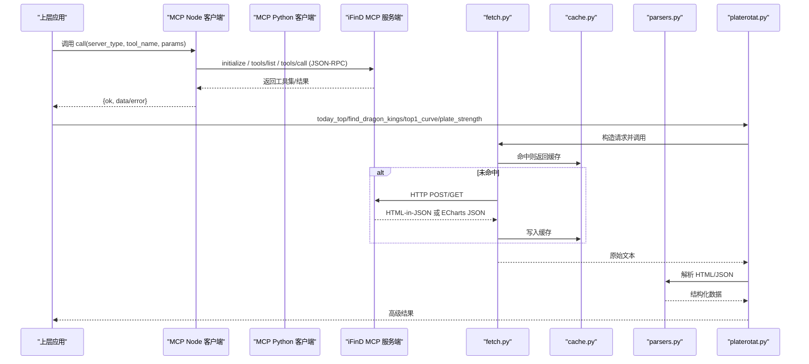
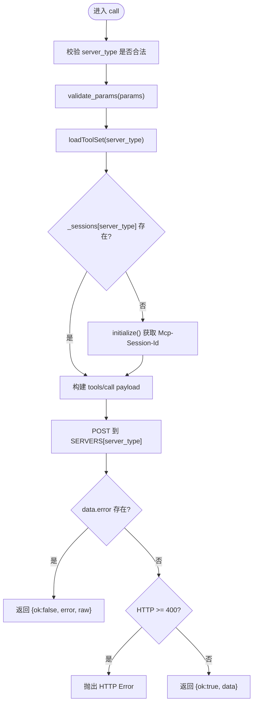
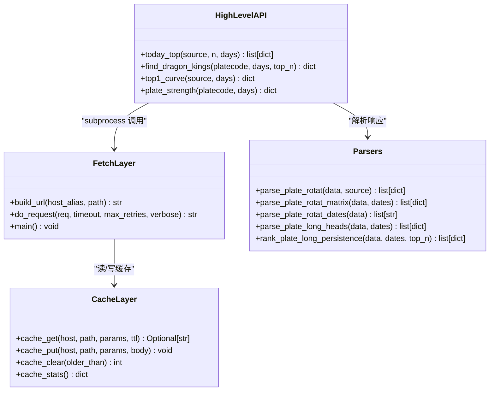
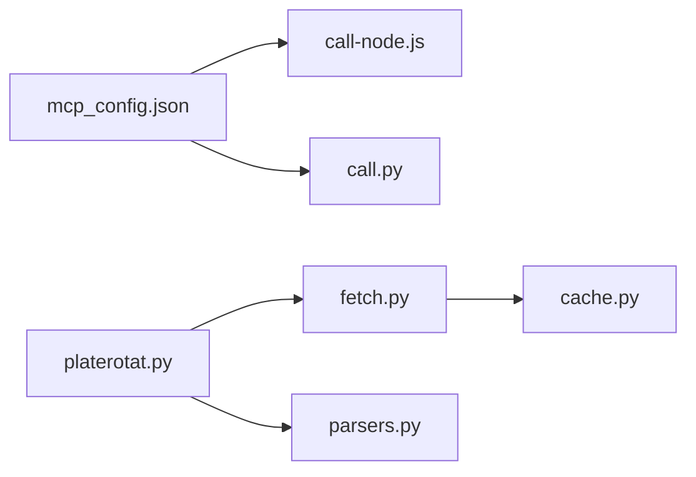
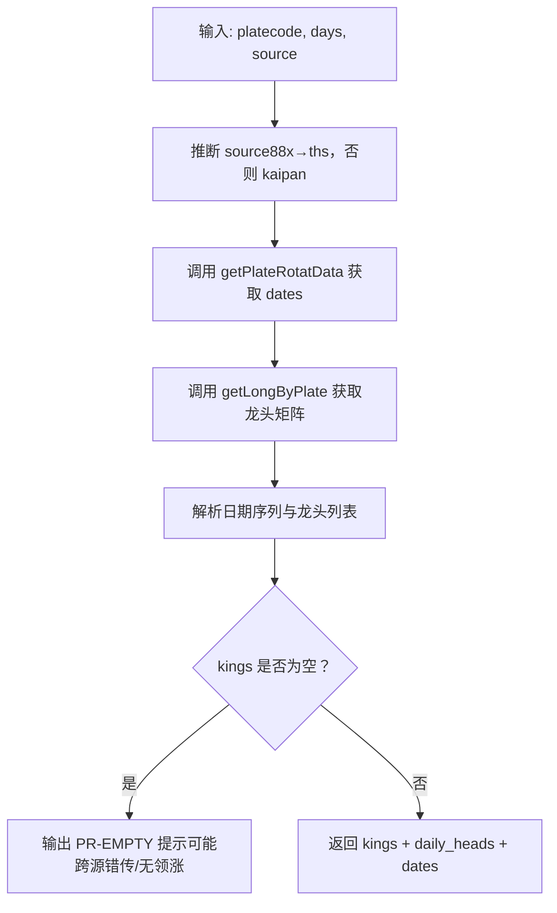

# 数据源集成

<cite>
**本文引用的文件**   
- [call-node.js](file://skills/ifind-finance-data-1.3.0/call-node.js)
- [call.py](file://skills/ifind-finance-data-1.3.0/call.py)
- [mcp_config.json](file://skills/ifind-finance-data-1.3.0/mcp_config.json)
- [cache.py](file://skills/plate-rotation-skill/scripts/cache.py)
- [fetch.py](file://skills/plate-rotation-skill/scripts/fetch.py)
- [parsers.py](file://skills/plate-rotation-skill/scripts/parsers.py)
- [platerotat.py](file://skills/plate-rotation-skill/scripts/platerotat.py)
- [_INDEX.md](file://skills/plate-rotation-skill/references/_INDEX.md)
- [README.MD](file://README.MD)
</cite>

## 目录
1. [引言](#引言)
2. [项目结构](#项目结构)
3. [核心组件](#核心组件)
4. [架构总览](#架构总览)
5. [详细组件分析](#详细组件分析)
6. [依赖关系分析](#依赖关系分析)
7. [性能与缓存策略](#性能与缓存策略)
8. [双源数据验证机制](#双源数据验证机制)
9. [自定义数据源开发指南](#自定义数据源开发指南)
10. [故障排查指南](#故障排查指南)
11. [结论](#结论)

## 引言
本指南面向开发者，系统化说明如何在项目中实现统一的数据源适配器接口，涵盖 HTTP 请求封装、认证管理与错误处理；深入解析 MCP 协议在 call-node.js 与 call.py 中的客户端实现；阐述双源数据交叉验证机制，确保分析结果的准确性；并提供完整自定义数据源开发流程（API 设计、数据格式标准化、解析器实现）；最后给出本地与分布式缓存策略及性能优化建议。

## 项目结构
仓库采用“Skills + Strategy + Manual”的模块化组织方式：
- Skills：提供数据能力，包含 iFinD MCP 客户端与板块轮动 Skill
- Strategy：交易策略方法论与量化执行版
- Manual：指标知识与体系总纲

图表来源
- [README.MD:1-81](file://README.MD#L1-L81)
- [call-node.js:1-267](file://skills/ifind-finance-data-1.3.0/call-node.js#L1-L267)
- [call.py:1-208](file://skills/ifind-finance-data-1.3.0/call.py#L1-L208)
- [mcp_config.json:1-3](file://skills/ifind-finance-data-1.3.0/mcp_config.json#L1-L3)
- [fetch.py:1-230](file://skills/plate-rotation-skill/scripts/fetch.py#L1-L230)
- [cache.py:1-145](file://skills/plate-rotation-skill/scripts/cache.py#L1-L145)
- [parsers.py:1-212](file://skills/plate-rotation-skill/scripts/parsers.py#L1-L212)
- [platerotat.py:1-315](file://skills/plate-rotation-skill/scripts/platerotat.py#L1-L315)
- [_INDEX.md:1-32](file://skills/plate-rotation-skill/references/_INDEX.md#L1-L32)

章节来源
- [README.MD:1-81](file://README.MD#L1-L81)

## 核心组件
- iFinD MCP 客户端（Node/Python）：统一封装 JSON-RPC 工具调用、会话管理、参数校验与错误处理
- 板块轮动 Skill：统一 HTTP 调用层、本地缓存、HTML-in-JSON 解析、高级 API 封装与运行时校验
- 配置与文档：认证令牌、MCP 服务器地址、接口路由表与双源差异说明

章节来源
- [call-node.js:1-267](file://skills/ifind-finance-data-1.3.0/call-node.js#L1-L267)
- [call.py:1-208](file://skills/ifind-finance-data-1.3.0/call.py#L1-L208)
- [mcp_config.json:1-3](file://skills/ifind-finance-data-1.3.0/mcp_config.json#L1-L3)
- [fetch.py:1-230](file://skills/plate-rotation-skill/scripts/fetch.py#L1-L230)
- [cache.py:1-145](file://skills/plate-rotation-skill/scripts/cache.py#L1-L145)
- [parsers.py:1-212](file://skills/plate-rotation-skill/scripts/parsers.py#L1-L212)
- [platerotat.py:1-315](file://skills/plate-rotation-skill/scripts/platerotat.py#L1-L315)
- [_INDEX.md:1-32](file://skills/plate-rotation-skill/references/_INDEX.md#L1-L32)

## 架构总览
系统通过两类数据接入路径：
- MCP 协议路径：Node/Python 客户端通过 JSON-RPC 与 iFinD MCP 服务交互，完成工具发现与调用
- HTTP 直接路径：板块轮动 Skill 通过 fetch.py 发起 HTTP 请求，结合 cache.py 做本地缓存，再由 parsers.py 解析 HTML-in-JSON 响应，最终由 platerotat.py 暴露高级 API

图表来源
- [call-node.js:117-220](file://skills/ifind-finance-data-1.3.0/call-node.js#L117-L220)
- [call.py:119-203](file://skills/ifind-finance-data-1.3.0/call.py#L119-L203)
- [fetch.py:128-213](file://skills/plate-rotation-skill/scripts/fetch.py#L128-L213)
- [cache.py:59-94](file://skills/plate-rotation-skill/scripts/cache.py#L59-L94)
- [parsers.py:20-102](file://skills/plate-rotation-skill/scripts/parsers.py#L20-L102)
- [platerotat.py:102-218](file://skills/plate-rotation-skill/scripts/platerotat.py#L102-L218)

## 详细组件分析

### MCP 客户端（Node/Python）
- 统一入口：call(server_type, tool_name, params) 与 list_tools(server_type)
- 初始化流程：initialize → 获取 Mcp-Session-Id → notifications/initialized
- 工具集管理：tools/list 拉取允许的工具名集合，避免非法调用
- 参数校验：递归遍历对象，拒绝危险键与不支持类型
- 错误处理：HTTP 状态码检查、JSON-RPC error 字段识别、超时与网络异常
- 会话复用：按 server_type 维护 _sessions，减少重复握手

图表来源
- [call-node.js:178-220](file://skills/ifind-finance-data-1.3.0/call-node.js#L178-L220)
- [call.py:137-171](file://skills/ifind-finance-data-1.3.0/call.py#L137-L171)

章节来源
- [call-node.js:1-267](file://skills/ifind-finance-data-1.3.0/call-node.js#L1-L267)
- [call.py:1-208](file://skills/ifind-finance-data-1.3.0/call.py#L1-L208)
- [mcp_config.json:1-3](file://skills/ifind-finance-data-1.3.0/mcp_config.json#L1-L3)

### 板块轮动 Skill 调用链
- fetch.py：统一 URL 构建、Cookie/Referer/UA 注入、指数退避重试、缓存读写、输出格式化
- cache.py：基于 host+path+sorted_params 的稳定 Key 生成，TTL 控制，原子写，清理与统计
- parsers.py：从 HTML-in-JSON 中抽取板块排名、日期序列、龙头矩阵等结构化数据
- platerotat.py：组合底层接口，提供 today_top/find_dragon_kings/top1_curve/plate_strength 高级 API，并在解析后做运行时校验

图表来源
- [fetch.py:67-124](file://skills/plate-rotation-skill/scripts/fetch.py#L67-L124)
- [cache.py:47-94](file://skills/plate-rotation-skill/scripts/cache.py#L47-L94)
- [parsers.py:20-174](file://skills/plate-rotation-skill/scripts/parsers.py#L20-L174)
- [platerotat.py:102-218](file://skills/plate-rotation-skill/scripts/platerotat.py#L102-L218)

章节来源
- [fetch.py:1-230](file://skills/plate-rotation-skill/scripts/fetch.py#L1-L230)
- [cache.py:1-145](file://skills/plate-rotation-skill/scripts/cache.py#L1-L145)
- [parsers.py:1-212](file://skills/plate-rotation-skill/scripts/parsers.py#L1-L212)
- [platerotat.py:1-315](file://skills/plate-rotation-skill/scripts/platerotat.py#L1-L315)

## 依赖关系分析
- Node/Python MCP 客户端均依赖 mcp_config.json 中的 auth_token 与服务端地址
- 板块轮动 Skill 内部模块耦合清晰：platerotat.py 依赖 fetch.py 与 parsers.py；fetch.py 依赖 cache.py
- 外部依赖：iFinD MCP 服务与公开行情后端（仅校验 Referer）

图表来源
- [mcp_config.json:1-3](file://skills/ifind-finance-data-1.3.0/mcp_config.json#L1-L3)
- [call-node.js:1-20](file://skills/ifind-finance-data-1.3.0/call-node.js#L1-L20)
- [call.py:1-20](file://skills/ifind-finance-data-1.3.0/call.py#L1-L20)
- [fetch.py:31-36](file://skills/plate-rotation-skill/scripts/fetch.py#L31-L36)
- [cache.py:1-33](file://skills/plate-rotation-skill/scripts/cache.py#L1-L33)
- [platerotat.py:34-48](file://skills/plate-rotation-skill/scripts/platerotat.py#L34-L48)
- [parsers.py:1-16](file://skills/plate-rotation-skill/scripts/parsers.py#L1-L16)

章节来源
- [mcp_config.json:1-3](file://skills/ifind-finance-data-1.3.0/mcp_config.json#L1-L3)
- [call-node.js:1-20](file://skills/ifind-finance-data-1.3.0/call-node.js#L1-L20)
- [call.py:1-20](file://skills/ifind-finance-data-1.3.0/call.py#L1-L20)
- [fetch.py:31-36](file://skills/plate-rotation-skill/scripts/fetch.py#L31-L36)
- [cache.py:1-33](file://skills/plate-rotation-skill/scripts/cache.py#L1-L33)
- [platerotat.py:34-48](file://skills/plate-rotation-skill/scripts/platerotat.py#L34-L48)
- [parsers.py:1-16](file://skills/plate-rotation-skill/scripts/parsers.py#L1-L16)

## 性能与缓存策略
- 本地缓存（cache.py）
  - Key 稳定：host + path + sorted_form_kv 经 sha1 哈希，保证参数顺序无关
  - TTL 可配：默认 3600s，支持 PR_CACHE_TTL 环境变量与 --cache-ttl 参数
  - 原子写：先写 .tmp 再 os.replace，避免半写文件
  - 全局开关：PR_CACHE_DISABLE=1 关闭缓存
  - 清理与统计：cache_clear 支持按时间阈值清理，cache_stats 提供诊断信息
- 网络层优化（fetch.py）
  - 指数退避重试：对 429/5xx 与网络异常自动重试，最多 3 次，间隔 1s/2s/4s
  - 超时控制：可配置 --timeout
  - 输出优化：JSON 美化失败回退 raw，减少额外开销
- 建议扩展（分布式缓存）
  - 将 cache.py 抽象为接口，替换为 Redis/Memcached 存储
  - 使用分布式锁避免并发重复请求
  - 增加缓存预热与失效策略（按业务维度批量失效）

章节来源
- [cache.py:47-94](file://skills/plate-rotation-skill/scripts/cache.py#L47-L94)
- [cache.py:98-128](file://skills/plate-rotation-skill/scripts/cache.py#L98-L128)
- [fetch.py:47-124](file://skills/plate-rotation-skill/scripts/fetch.py#L47-L124)
- [fetch.py:159-213](file://skills/plate-rotation-skill/scripts/fetch.py#L159-L213)

## 双源数据验证机制
- 双源差异（_INDEX.md）
  - ths（同花顺）：数值为当日板块涨幅 %，单位带 % 符号，适用于 88x 板块
  - kaipan（开盘啦）：数值为板块强度分（整数），适用于 80x/803x 板块
  - 两套数值不可直接比较，需各自排序
- 解析器区分（parsers.py）
  - parse_plate_rotat 根据 value 是否以 % 结尾设置 value_type='pct' 或 'score'
  - parse_plate_rotat_dates 抽取日期序列，用于对齐多日矩阵
- 高级 API 校验（platerotat.py）
  - find_dragon_kings 自动推断 source（88x→ths，否则 kaipan），并输出实际使用的 source
  - 运行时校验：空数据或缺关键字段时输出 PR-EMPTY/PR-WARN 警告，帮助下游区分节假日/跨源错传/上游异常
- 测试约束（tests/test_plate_rotation.py）
  - ths 源必须带 %，kaipan 源必须为 score
  - rank 单调递增且起点为 1
  - n 限制严格生效

图表来源
- [_INDEX.md:16-32](file://skills/plate-rotation-skill/references/_INDEX.md#L16-L32)
- [parsers.py:20-65](file://skills/plate-rotation-skill/scripts/parsers.py#L20-L65)
- [parsers.py:105-108](file://skills/plate-rotation-skill/scripts/parsers.py#L105-L108)
- [platerotat.py:148-172](file://skills/plate-rotation-skill/scripts/platerotat.py#L148-L172)

章节来源
- [_INDEX.md:1-32](file://skills/plate-rotation-skill/references/_INDEX.md#L1-L32)
- [parsers.py:20-102](file://skills/plate-rotation-skill/scripts/parsers.py#L20-L102)
- [platerotat.py:148-172](file://skills/plate-rotation-skill/scripts/platerotat.py#L148-L172)

## 自定义数据源开发指南
为实现统一的数据源适配器接口，建议遵循以下流程：

- API 接口设计
  - 明确入参语义与约束（如 from/days/platecode），参考 _INDEX.md 的路由表范式
  - 定义返回值结构（优先 JSON；若为 HTML-in-JSON，需在解析器中明确抽取规则）
  - 考虑跨源差异（如 ths vs kaipan），在文档中注明数值含义与适用前缀

- 数据格式标准化
  - 统一字段命名（如 code/name/value/value_type/color/date）
  - 对数值单位进行显式标注（value_type 区分 pct/score）
  - 对缺失值与异常态进行约定（如 legend=null 表示未活跃）

- 解析器实现
  - 针对 HTML-in-JSON 场景，编写稳健的正则抽取逻辑（参考 parsers.py）
  - 提供矩阵化与日期序列解析函数，便于后续分析与可视化
  - 在解析完成后进行 sanity check，输出 PR-EMPTY/PR-WARN 提示

- 调用层封装
  - 复用 fetch.py 的 URL 构建、Cookie/Referer/UA 注入、重试与缓存逻辑
  - 在高级 API 层组合多个底层接口，提供“一个意图一个函数”的入口（参考 platerotat.py）

- 认证与配置
  - 若使用 MCP 协议，参照 call-node.js/call.py 的 initialize/tools/list/tools/call 流程
  - 将认证令牌与服务器地址放入配置文件（参考 mcp_config.json）

- 测试与回归
  - 为每个接口编写在线集成测试，覆盖双源差异与边界条件（参考 tests/test_plate_rotation.py）
  - 对解析器进行单元测试，确保字段完整性与类型正确性

章节来源
- [_INDEX.md:1-32](file://skills/plate-rotation-skill/references/_INDEX.md#L1-L32)
- [parsers.py:20-174](file://skills/plate-rotation-skill/scripts/parsers.py#L20-L174)
- [platerotat.py:102-218](file://skills/plate-rotation-skill/scripts/platerotat.py#L102-L218)
- [call-node.js:117-220](file://skills/ifind-finance-data-1.3.0/call-node.js#L117-L220)
- [call.py:119-203](file://skills/ifind-finance-data-1.3.0/call.py#L119-L203)
- [mcp_config.json:1-3](file://skills/ifind-finance-data-1.3.0/mcp_config.json#L1-L3)

## 故障排查指南
- MCP 客户端常见问题
  - 未返回 Mcp-Session-Id：检查 initialize 响应头，确认服务端正常
  - tools/list 响应无效：校验 result.tools 数组结构与工具名合法性
  - HTTP 错误：检查 status_code 与 data.error 字段，定位服务端错误码
- 板块轮动 Skill 常见问题
  - 空数据警告：关注 PR-EMPTY/PR-WARN 提示，判断是否节假日/跨源错传/上游异常
  - 缓存问题：PR_CACHE_DISABLE=1 临时禁用缓存；cache_clear 清理过期文件；cache_stats 查看缓存规模
  - 网络异常：启用 --verbose 查看 URL/body/cookie 与重试日志；调整 --max-retries 与 --timeout
- 解析器问题
  - HTML 结构变更导致正则不匹配：更新 parsers.py 中的正则表达式，补充健壮性兜底
  - 字段缺失：在高级 API 层增加断言与提示，避免下游误用

章节来源
- [call-node.js:149-176](file://skills/ifind-finance-data-1.3.0/call-node.js#L149-L176)
- [call.py:85-116](file://skills/ifind-finance-data-1.3.0/call.py#L85-L116)
- [platerotat.py:75-98](file://skills/plate-rotation-skill/scripts/platerotat.py#L75-L98)
- [cache.py:98-128](file://skills/plate-rotation-skill/scripts/cache.py#L98-L128)
- [fetch.py:193-207](file://skills/plate-rotation-skill/scripts/fetch.py#L193-L207)

## 结论
本项目通过 MCP 客户端与板块轮动 Skill 两条路径实现了统一的数据源适配：前者聚焦 JSON-RPC 工具调用与会话管理，后者专注 HTTP 调用、缓存、解析与高级 API 封装。双源交叉验证机制有效提升了分析结果的可靠性。开发者可依据本文档的流程与规范，快速扩展新的数据源，并确保一致性、可维护性与高性能。