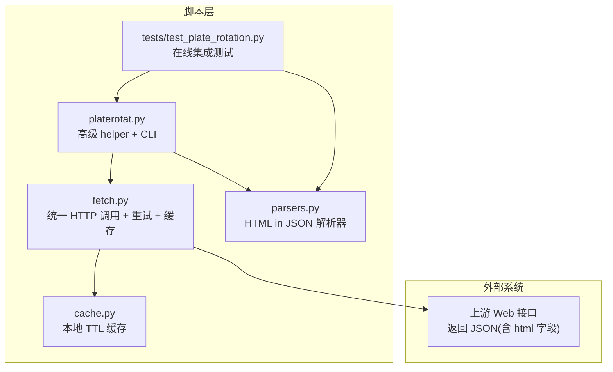
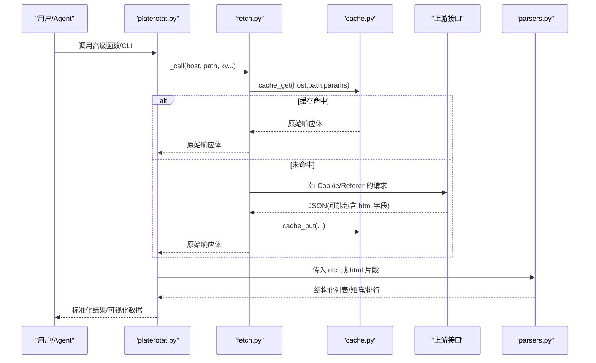
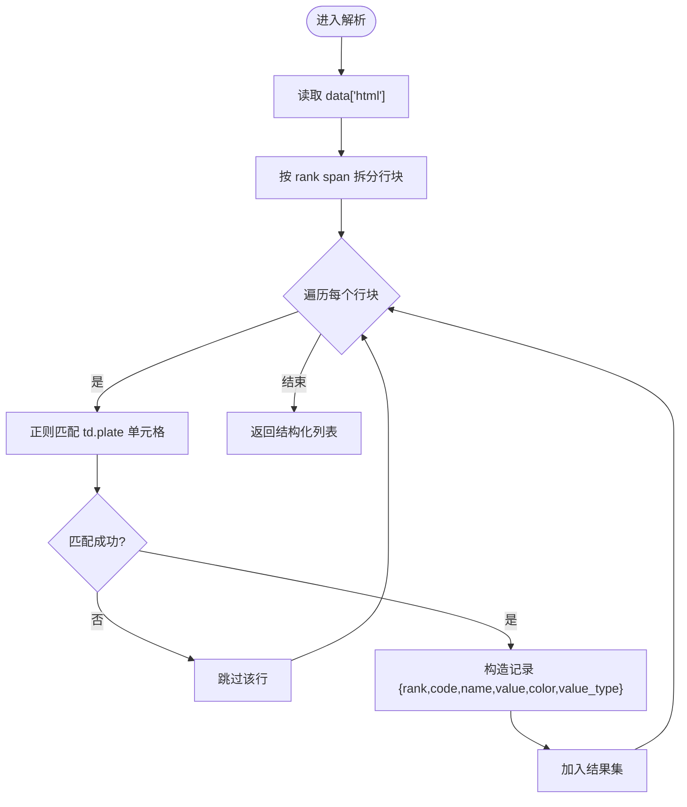
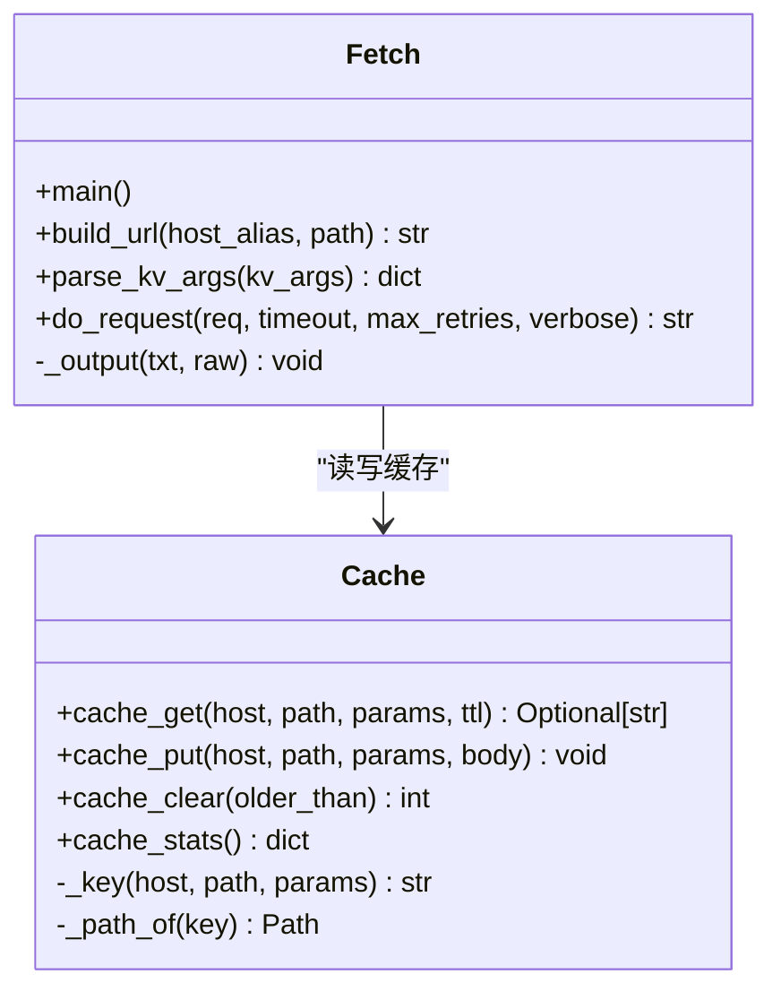
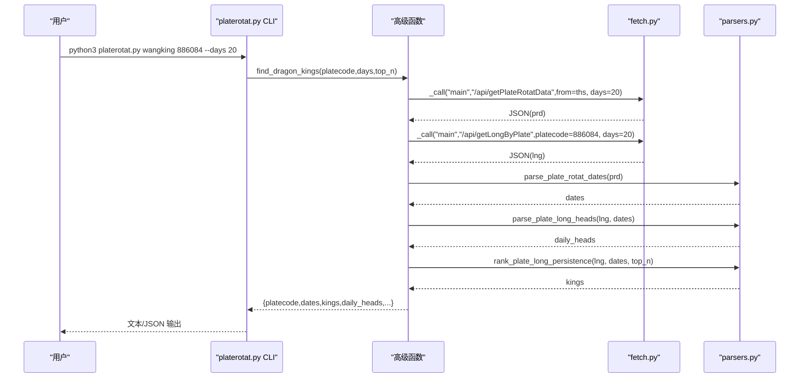
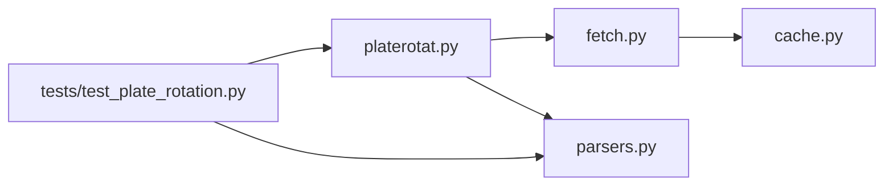

# 数据解析框架

<cite>
**本文引用的文件**
- [parsers.py](file://skills/plate-rotation-skill/scripts/parsers.py)
- [fetch.py](file://skills/plate-rotation-skill/scripts/fetch.py)
- [platerotat.py](file://skills/plate-rotation-skill/scripts/platerotat.py)
- [cache.py](file://skills/plate-rotation-skill/scripts/cache.py)
- [test_plate_rotation.py](file://skills/plate-rotation-skill/tests/test_plate_rotation.py)
- [README.md](file://skills/plate-rotation-skill/README.md)
</cite>

## 目录
1. [引言](#引言)
2. [项目结构](#项目结构)
3. [核心组件](#核心组件)
4. [架构总览](#架构总览)
5. [详细组件分析](#详细组件分析)
6. [依赖关系分析](#依赖关系分析)
7. [性能与可扩展性](#性能与可扩展性)
8. [故障排查指南](#故障排查指南)
9. [结论](#结论)
10. [附录：开发示例与调试技巧](#附录开发示例与调试技巧)

## 引言
本文件面向开发者，系统化梳理并文档化该仓库中的“数据解析框架”，重点围绕 parsers.py 的 HTML 模板解析器设计展开，涵盖 DOM 结构分析、数据提取规则、异常处理机制；同时说明不同数据格式的解析策略（JSON、XML、HTML 表格、文本），解释数据标准化流程（字段映射、类型转换、数据验证），并提供扩展新数据源与自定义解析器的方法、完整开发示例与调试技巧。

## 项目结构
该 Skill 采用分层组织：网络调用层（fetch.py）、缓存层（cache.py）、解析层（parsers.py）、高级封装与 CLI（platerotat.py）、在线集成测试（tests）。

图表来源
- [fetch.py:1-230](file://skills/plate-rotation-skill/scripts/fetch.py#L1-L230)
- [cache.py:1-145](file://skills/plate-rotation-skill/scripts/cache.py#L1-L145)
- [parsers.py:1-212](file://skills/plate-rotation-skill/scripts/parsers.py#L1-L212)
- [platerotat.py:1-315](file://skills/plate-rotation-skill/scripts/platerotat.py#L1-L315)
- [test_plate_rotation.py:1-444](file://skills/plate-rotation-skill/tests/test_plate_rotation.py#L1-L444)

章节来源
- [README.md:1-188](file://skills/plate-rotation-skill/README.md#L1-L188)

## 核心组件
- 网络与缓存
  - fetch.py：统一请求入口，支持 GET/POST、参数拼接、Cookie/Referer 注入、指数退避重试、TTL 缓存命中与落盘。
  - cache.py：基于 SHA1 的稳定 Key 生成、原子写入、过期清理与统计。
- 解析层
  - parsers.py：针对“JSON 中嵌入 HTML 片段”的专用解析器，使用正则抽取板块排名、日期列、龙头股等结构化数据。
- 高级封装与 CLI
  - platerotat.py：组合 fetch+parsers，暴露 today_top/find_dragon_kings/top1_curve/plate_strength 四个高层函数，并提供 CLI 子命令。
- 测试
  - tests/test_plate_rotation.py：覆盖端点健康度、解析正确性、高级函数签名与返回结构、CLI 双模输出、自动路由等。

章节来源
- [fetch.py:1-230](file://skills/plate-rotation-skill/scripts/fetch.py#L1-L230)
- [cache.py:1-145](file://skills/plate-rotation-skill/scripts/cache.py#L1-L145)
- [parsers.py:1-212](file://skills/plate-rotation-skill/scripts/parsers.py#L1-L212)
- [platerotat.py:1-315](file://skills/plate-rotation-skill/scripts/platerotat.py#L1-L315)
- [test_plate_rotation.py:1-444](file://skills/plate-rotation-skill/tests/test_plate_rotation.py#L1-L444)

## 架构总览
整体数据流从上层意图到最终结构化结果，经过“调用→缓存→网络→响应→解析→校验→输出”。

图表来源
- [platerotat.py:55-71](file://skills/plate-rotation-skill/scripts/platerotat.py#L55-L71)
- [fetch.py:128-213](file://skills/plate-rotation-skill/scripts/fetch.py#L128-L213)
- [cache.py:59-94](file://skills/plate-rotation-skill/scripts/cache.py#L59-L94)
- [parsers.py:20-108](file://skills/plate-rotation-skill/scripts/parsers.py#L20-L108)

## 详细组件分析

### HTML 模板解析器（parsers.py）
- 设计目标
  - 将“JSON 包裹的 HTML 片段”解析为稳定的结构化记录，屏蔽前端渲染细节。
  - 兼容多数据源差异（如数值是否带 %）。
- 关键函数与职责
  - parse_plate_rotat：从主表 HTML 抽取 Top N 板块清单，区分 value_type=pct/score。
  - parse_plate_rotat_matrix：还原 N×天矩阵，便于时序分析。
  - parse_plate_rotat_dates：从表头抽取日期序列（newest first）。
  - parse_plate_long_heads：按日解析龙头股（兼容“无领涨”占位 td）。
  - rank_plate_long_persistence：跨天统计龙头出现次数，输出“妖王榜”。
- DOM 结构与正则策略
  - 主表行定位：通过 N 分割行块。
  - 单元格抽取：<td class='plate plate\d+' code/name/style 属性 + 内部 value。
  - 日期抽取：匹配表头样式中的 YYYY-MM-DD。
  - 龙头表：按 td style 分支判断“有领涨/无领涨”，再在 div.kline 内抽取 code/rank/name。
- 数据标准化
  - 字段映射：rank/code/name/value/color/value_type/date/cells/heads/positions 等。
  - 类型转换：value_type 由是否以 % 结尾推断；日期格式固定为 YYYY-MM-DD；龙头 rank 限定为“龙一至龙五”。
  - 数据验证：单元测试覆盖排序、非空、值域、格式等约束。
- 异常处理
  - 缺失字段时跳过该行（continue），避免中断整批解析。
  - 对“无领涨”的 td 做特殊分支，保证鲁棒性。
  - 上层运行时校验输出 PR-EMPTY/PR-WARN 提示，辅助下游 Agent 识别空数据原因。

图表来源
- [parsers.py:20-65](file://skills/plate-rotation-skill/scripts/parsers.py#L20-L65)

章节来源
- [parsers.py:1-212](file://skills/plate-rotation-skill/scripts/parsers.py#L1-L212)
- [test_plate_rotation.py:120-244](file://skills/plate-rotation-skill/tests/test_plate_rotation.py#L120-L244)

### 网络与缓存（fetch.py + cache.py）
- fetch.py
  - 参数解析：支持 key=value 与 -p JSON 两种传参方式，二者互斥。
  - URL 构建：host alias 映射 main/data/x/ext，ext 可直接传完整 URL。
  - 请求执行：do_request 实现指数退避重试（429/5xx/网络异常），非重试码直接抛出错误。
  - 缓存策略：仅 POST 默认启用缓存，TTL 可配置；命中则直接输出，未命中则请求后写回。
  - 输出：--raw 输出原始字符串，否则尝试 JSON 美化。
- cache.py
  - Key 稳定：host+path+sorted(params) → sha1，确保参数顺序无关。
  - 落盘：~/.cache/plate-rotation/{key[:2]}/{key}.json，原子写入避免半写。
  - 开关：环境变量 PR_CACHE_DISABLE=1 全局关闭；PR_CACHE_TTL 调整默认 TTL。
  - 工具：stats/clear 提供诊断与清理。

图表来源
- [fetch.py:68-124](file://skills/plate-rotation-skill/scripts/fetch.py#L68-L124)
- [cache.py:47-94](file://skills/plate-rotation-skill/scripts/cache.py#L47-L94)

章节来源
- [fetch.py:1-230](file://skills/plate-rotation-skill/scripts/fetch.py#L1-L230)
- [cache.py:1-145](file://skills/plate-rotation-skill/scripts/cache.py#L1-L145)

### 高级封装与 CLI（platerotat.py）
- 高级函数
  - today_top：拉取主表并解析 Top N，source 决定 value_type 语义。
  - find_dragon_kings：组合主表日期与龙头表，计算“妖王榜”，自动根据板块前缀选择 source。
  - top1_curve：获取 ECharts 数据并补充 top5_names 便利字段。
  - plate_strength：单板块强度+量能时序，legend=null 表示未活跃。
- 运行时校验
  - 统一警告通道 _warn，输出 PR-EMPTY/PR-WARN 供下游识别。
  - 空数据提示：周末、跨源错传、节假日/参数超前/上游异常等。
- CLI
  - 子命令：today/wangking/curve/strength，支持 --json 文本/JSON 双模输出。

图表来源
- [platerotat.py:125-172](file://skills/plate-rotation-skill/scripts/platerotat.py#L125-L172)
- [parsers.py:105-174](file://skills/plate-rotation-skill/scripts/parsers.py#L105-L174)

章节来源
- [platerotat.py:1-315](file://skills/plate-rotation-skill/scripts/platerotat.py#L1-L315)

## 依赖关系分析
- 模块耦合
  - platerotat.py 依赖 fetch.py 与 parsers.py，形成“上层编排 + 下层解析”的清晰边界。
  - fetch.py 依赖 cache.py，解耦网络与存储。
- 外部依赖
  - 仅 Python 标准库，零第三方依赖，降低部署成本。
- 潜在循环
  - 当前无循环导入；各模块职责单一，耦合度低。

图表来源
- [platerotat.py:42-48](file://skills/plate-rotation-skill/scripts/platerotat.py#L42-L48)
- [fetch.py:31-36](file://skills/plate-rotation-skill/scripts/fetch.py#L31-L36)
- [test_plate_rotation.py:33-45](file://skills/plate-rotation-skill/tests/test_plate_rotation.py#L33-L45)

章节来源
- [platerotat.py:1-315](file://skills/plate-rotation-skill/scripts/platerotat.py#L1-L315)
- [fetch.py:1-230](file://skills/plate-rotation-skill/scripts/fetch.py#L1-L230)
- [parsers.py:1-212](file://skills/plate-rotation-skill/scripts/parsers.py#L1-L212)
- [cache.py:1-145](file://skills/plate-rotation-skill/scripts/cache.py#L1-L145)
- [test_plate_rotation.py:1-444](file://skills/plate-rotation-skill/tests/test_plate_rotation.py#L1-L444)

## 性能与可扩展性
- 性能特性
  - 指数退避重试提升稳定性，减少瞬时失败影响。
  - 本地缓存降低重复请求频率，提高吞吐与时延表现。
  - 解析层基于正则，时间复杂度近似 O(n)（n 为 HTML 片段长度），适合中等规模页面。
- 可扩展性设计
  - 新增数据源
    - 在 fetch.py HOSTS 中添加 host alias，或在 ext 模式下直接传完整 URL。
    - 在 parsers.py 中新增解析函数，遵循“输入 dict(html)/dates，输出结构化列表”的契约。
    - 在 platerotat.py 中封装高级函数，并在 CLI 增加子命令。
  - 自定义解析器
    - 保持输入输出稳定：接收上游 JSON 或 HTML 片段，返回标准化数据结构。
    - 明确 value_type 与单位语义，便于上层聚合与展示。
    - 配套单元测试，覆盖空数据、异常路径与边界条件。

[本节为通用指导，不直接分析具体文件]

## 故障排查指南
- 常见问题与定位
  - 空数据（PR-EMPTY）
    - 周末/节假日导致接口无当日数据。
    - 板块代码前缀与 source 不匹配（88x 应走 ths，80x/803x 应走 kaipan）。
    - 上游接口临时异常或返回非 JSON。
  - 解析失败
    - HTML 结构变更导致正则不匹配，需更新 parsers.py 中的模式。
    - 日期列错位或为空，检查 parse_plate_rotat_dates 的匹配逻辑。
  - 网络问题
    - 429/5xx 触发重试仍失败，查看 do_request 的错误信息。
    - Cookie/Referer 缺失导致鉴权失败，确认 load_cookie 与 headers 设置。
- 诊断工具
  - fetch.py --verbose 打印 URL/body/cookie 与重试日志。
  - cache.py stats/clear 查看缓存状态与清理过期条目。
  - tests/test_plate_rotation.py 运行在线集成测试快速验证链路。

章节来源
- [platerotat.py:75-98](file://skills/plate-rotation-skill/scripts/platerotat.py#L75-L98)
- [fetch.py:91-124](file://skills/plate-rotation-skill/scripts/fetch.py#L91-L124)
- [cache.py:119-128](file://skills/plate-rotation-skill/scripts/cache.py#L119-L128)
- [test_plate_rotation.py:74-118](file://skills/plate-rotation-skill/tests/test_plate_rotation.py#L74-L118)

## 结论
该数据解析框架以“网络调用 + 本地缓存 + HTML-in-JSON 解析 + 高级封装”的分层架构，实现了高可用、易扩展的数据采集与标准化能力。通过严格的运行时校验与在线集成测试，确保了在不同数据源与异常场景下的稳健性。未来可按既定契约快速接入新数据源与自定义解析器，满足更多业务需求。

[本节为总结，不直接分析具体文件]

## 附录：开发示例与调试技巧

### 新增数据源的步骤
- 定义 host alias 或直接使用 ext 模式传入完整 URL。
- 编写解析函数：
  - 输入：dict（可能包含 html 字段）或日期序列。
  - 输出：标准化列表/矩阵/排行，明确字段名与 value_type。
- 封装高级函数：
  - 在 platerotat.py 中组合 fetch+parsers，暴露对外 API。
  - 添加 CLI 子命令，支持 text/json 双模输出。
- 编写测试：
  - 覆盖端点健康、解析正确性、返回值结构、CLI 行为。
  - 使用 _Fixtures.get 复用网络数据，避免重复打网。

章节来源
- [fetch.py:38-76](file://skills/plate-rotation-skill/scripts/fetch.py#L38-L76)
- [parsers.py:20-108](file://skills/plate-rotation-skill/scripts/parsers.py#L20-L108)
- [platerotat.py:100-218](file://skills/plate-rotation-skill/scripts/platerotat.py#L100-L218)
- [test_plate_rotation.py:48-71](file://skills/plate-rotation-skill/tests/test_plate_rotation.py#L48-L71)

### 调试技巧
- 使用 --raw 输出原始响应，结合 --verbose 观察请求细节。
- 使用 cache.py stats 查看缓存命中率与大小，必要时 clear 清理。
- 在 parsers.py 的 __main__ 中运行 demo 用例，快速验证解析效果。
- 逐步缩小范围：先验证端点健康，再验证解析函数，最后验证高级函数与 CLI。

章节来源
- [fetch.py:128-213](file://skills/plate-rotation-skill/scripts/fetch.py#L128-L213)
- [cache.py:132-145](file://skills/plate-rotation-skill/scripts/cache.py#L132-L145)
- [parsers.py:178-212](file://skills/plate-rotation-skill/scripts/parsers.py#L178-L212)