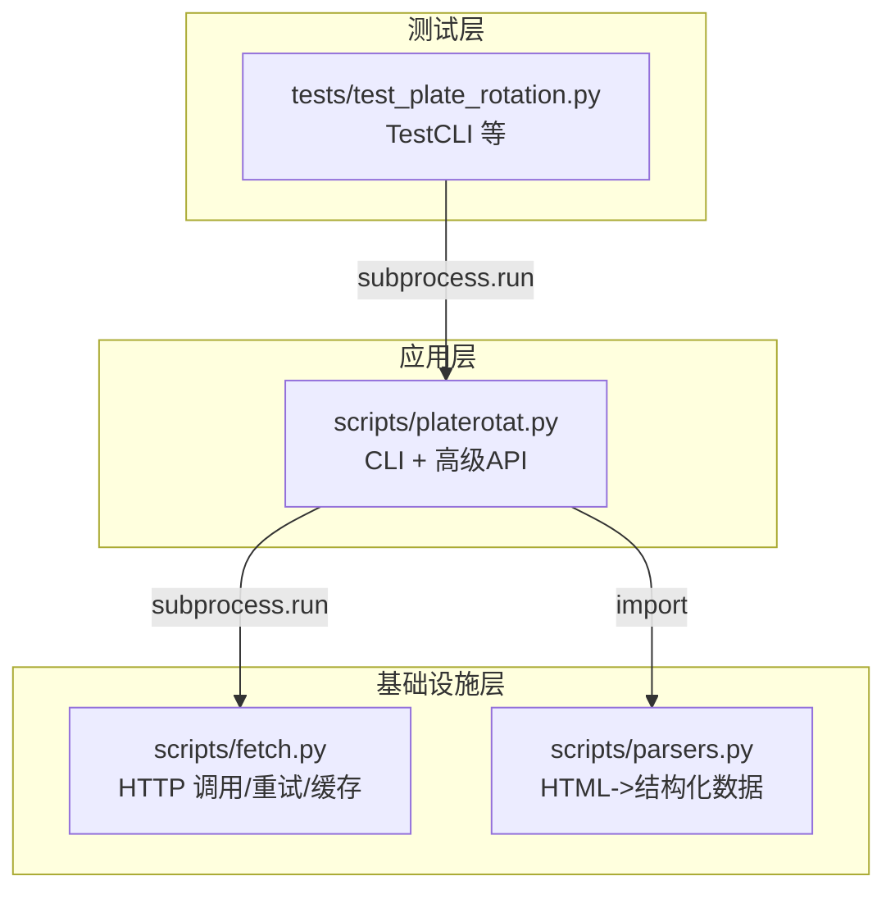
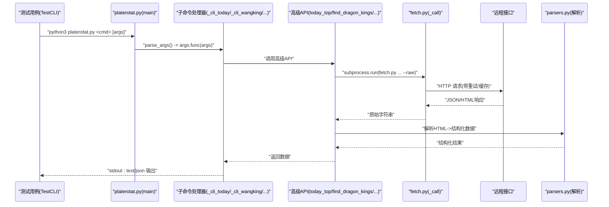
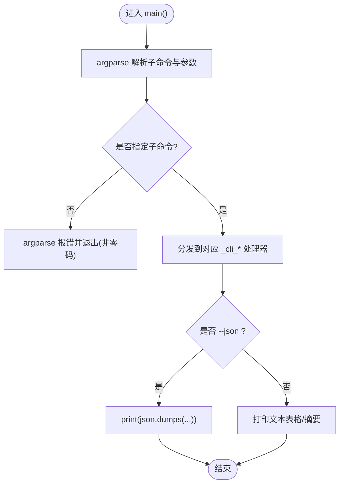
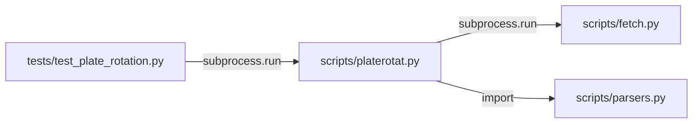

# CLI工具测试

<cite>
**本文引用的文件**   
- [test_plate_rotation.py](file://skills/plate-rotation-skill/tests/test_plate_rotation.py)
- [platerotat.py](file://skills/plate-rotation-skill/scripts/platerotat.py)
- [fetch.py](file://skills/plate-rotation-skill/scripts/fetch.py)
- [parsers.py](file://skills/plate-rotation-skill/scripts/parsers.py)
</cite>

## 目录
1. [简介](#简介)
2. [项目结构](#项目结构)
3. [核心组件](#核心组件)
4. [架构总览](#架构总览)
5. [详细组件分析](#详细组件分析)
6. [依赖关系分析](#依赖关系分析)
7. [性能与稳定性考量](#性能与稳定性考量)
8. [故障排查指南](#故障排查指南)
9. [结论](#结论)

## 简介
本指南面向开发者，基于仓库中的集成测试用例，系统讲解如何使用 subprocess 模块对 CLI 工具进行端到端测试。重点覆盖：
- 通过子进程调用 platerotat.py 的四个子命令：today（今日板块）、wangking（妖王榜）、curve（趋势曲线）、strength（强度分析）
- text 与 json 双模式输出验证方法
- 命令行参数校验：必填参数、非法参数拒绝、默认值处理
- 输出格式断言：文本正则匹配与 JSON 结构断言
- 错误路径测试：异常退出码与错误消息检查

## 项目结构
该技能包位于 skills/plate-rotation-skill 下，关键目录与文件如下：
- scripts/platerotat.py：CLI 入口与高级 API 封装
- scripts/fetch.py：统一网络请求封装（带重试与缓存）
- scripts/parsers.py：HTML-in-JSON 解析辅助函数
- tests/test_plate_rotation.py：完整集成测试集，包含 CLI 测试类 TestCLI

图表来源
- [test_plate_rotation.py:330-440](file://skills/plate-rotation-skill/tests/test_plate_rotation.py#L330-L440)
- [platerotat.py:278-314](file://skills/plate-rotation-skill/scripts/platerotat.py#L278-L314)
- [fetch.py:128-230](file://skills/plate-rotation-skill/scripts/fetch.py#L128-L230)
- [parsers.py:1-212](file://skills/plate-rotation-skill/scripts/parsers.py#L1-L212)

章节来源
- [test_plate_rotation.py:1-444](file://skills/plate-rotation-skill/tests/test_plate_rotation.py#L1-L444)
- [platerotat.py:1-315](file://skills/plate-rotation-skill/scripts/platerotat.py#L1-L315)
- [fetch.py:1-230](file://skills/plate-rotation-skill/scripts/fetch.py#L1-L230)
- [parsers.py:1-212](file://skills/plate-rotation-skill/scripts/parsers.py#L1-L212)

## 核心组件
- CLI 入口与子命令注册
  - 使用 argparse 定义子命令 today/wangking/curve/strength，并设置 required=True 保证无子命令时直接报错退出
  - 每个子命令支持 --json 切换输出为 JSON；text 模式下打印人类可读表格或摘要
- 高级 API 与数据处理
  - today_top / find_dragon_kings / top1_curve / plate_strength 组合 fetch+parsers，返回结构化数据
  - 运行时健康检查：空数据或缺关键字段时通过 stderr 输出 PR-EMPTY/PR-WARN 提示
- 网络与解析
  - fetch.py 提供统一 HTTP 调用，含指数退避重试、POST 缓存、--raw 原始输出
  - parsers.py 从 HTML-in-JSON 中抽取板块排名、日期序列、龙头矩阵等

章节来源
- [platerotat.py:278-314](file://skills/plate-rotation-skill/scripts/platerotat.py#L278-L314)
- [platerotat.py:100-219](file://skills/plate-rotation-skill/scripts/platerotat.py#L100-L219)
- [fetch.py:128-230](file://skills/plate-rotation-skill/scripts/fetch.py#L128-L230)
- [parsers.py:18-175](file://skills/plate-rotation-skill/scripts/parsers.py#L18-L175)

## 架构总览
下图展示了 CLI 测试到实际执行的调用链：测试通过 subprocess 启动 platerotat.py，后者再调用 fetch.py 获取数据，并由 parsers.py 解析后由 CLI 格式化输出。

图表来源
- [test_plate_rotation.py:334-342](file://skills/plate-rotation-skill/tests/test_plate_rotation.py#L334-L342)
- [platerotat.py:278-314](file://skills/plate-rotation-skill/scripts/platerotat.py#L278-L314)
- [platerotat.py:55-71](file://skills/plate-rotation-skill/scripts/platerotat.py#L55-L71)
- [fetch.py:128-230](file://skills/plate-rotation-skill/scripts/fetch.py#L128-L230)
- [parsers.py:18-175](file://skills/plate-rotation-skill/scripts/parsers.py#L18-L175)

## 详细组件分析

### 子命令与参数设计
- today：今日 Top N 板块
  - 参数：--source(ths|kaipan, 默认 kaipan)、--n(int, 默认 10)、--days(int, 默认 20)、--json
- wangking：板块妖王榜
  - 参数：platecode(必填)、--days(int, 默认 20)、--n(int, 默认 10)、--json
- curve：Top5 板块 N 日排名变化曲线
  - 参数：--source(ths|kaipan, 默认 kaipan)、--days(int, 默认 20)、--json
- strength：单板块 N 日强度+量能时序
  - 参数：platecode(必填)、--days(int, 默认 20)、--json

图表来源
- [platerotat.py:278-314](file://skills/plate-rotation-skill/scripts/platerotat.py#L278-L314)

章节来源
- [platerotat.py:278-314](file://skills/plate-rotation-skill/scripts/platerotat.py#L278-L314)

### 今日板块（today）测试要点
- 文本模式
  - 断言输出包含“Top”、“板块”字样以及“#N”排名标记
- JSON 模式
  - 断言返回数组，长度不超过 --n
  - 每条记录包含 code、rank、value_type 字段
  - source=ths 时 value_type=pct 且 value 以 % 结尾；source=kaipan 时 value_type=score

章节来源
- [test_plate_rotation.py:345-372](file://skills/plate-rotation-skill/tests/test_plate_rotation.py#L345-L372)

### 妖王榜（wangking）测试要点
- 自动路由
  - 88x 前缀走 ths 源；80x/803x 前缀走 kaipan 源
- 文本模式
  - 断言输出包含“妖王榜”与传入的板块代码
- JSON 模式
  - 断言返回对象包含 platecode、kings、daily_heads、dates 等键
  - kings 数量不超过 --n
  - 80x 示例需确保 dates 非空，体现自动路由正确

章节来源
- [test_plate_rotation.py:374-396](file://skills/plate-rotation-skill/tests/test_plate_rotation.py#L374-L396)
- [platerotat.py:125-172](file://skills/plate-rotation-skill/scripts/platerotat.py#L125-L172)

### 趋势曲线（curve）测试要点
- JSON 模式
  - 断言返回对象包含 top5_names、date、name 等键
- 文本模式
  - 断言输出包含“Top5 板块”和“日期序列”等标题信息

章节来源
- [test_plate_rotation.py:399-410](file://skills/plate-rotation-skill/tests/test_plate_rotation.py#L399-L410)
- [platerotat.py:177-196](file://skills/plate-rotation-skill/scripts/platerotat.py#L177-L196)

### 强度分析（strength）测试要点
- JSON 模式
  - 断言返回对象包含 date、legend 键（legend 可能为 null）
- 文本模式
  - 断言输出包含板块代码与“强度时序”字样

章节来源
- [test_plate_rotation.py:413-422](file://skills/plate-rotation-skill/tests/test_plate_rotation.py#L413-L422)
- [platerotat.py:201-218](file://skills/plate-rotation-skill/scripts/platerotat.py#L201-L218)

### 命令行参数验证测试
- 缺参/非法参数应明确报错
  - 未传子命令：argparse 要求必填，应返回非零退出码
  - 非法 --source 值：choices 限制应被拒绝，返回非零退出码

章节来源
- [test_plate_rotation.py:425-439](file://skills/plate-rotation-skill/tests/test_plate_rotation.py#L425-L439)
- [platerotat.py:278-288](file://skills/plate-rotation-skill/scripts/platerotat.py#L278-L288)

### 输出格式验证方法
- 文本格式正则匹配
  - 使用 assertRegex 匹配如“#N”排名行、特定标题词等
- JSON 结构断言
  - 使用 json.loads 解析 stdout，然后断言键存在、类型正确、长度约束满足
  - 针对 value_type 与 value 后缀做语义断言（pct 带 %，score 纯数字）

章节来源
- [test_plate_rotation.py:345-422](file://skills/plate-rotation-skill/tests/test_plate_rotation.py#L345-L422)

### 错误路径测试
- 异常退出码验证
  - 无子命令、非法参数均期望非零退出码
- 错误消息检查
  - 可通过捕获 stderr 进一步断言错误提示内容（例如 argparse 帮助或 choices 拒绝信息）

章节来源
- [test_plate_rotation.py:425-439](file://skills/plate-rotation-skill/tests/test_plate_rotation.py#L425-L439)

## 依赖关系分析
- 测试层依赖
  - TestCLI 通过 subprocess.run 调用 platerotat.py，并以 capture_output=True 捕获 stdout/stderr
- 应用层依赖
  - platerotat.py 内部通过 _call 再次用 subprocess.run 调用 fetch.py，并使用 --raw 获取原始字符串
  - 解析逻辑来自 parsers.py，将 HTML-in-JSON 转为结构化数据
- 网络与健壮性
  - fetch.py 提供指数退避重试、缓存命中分支、--raw 透传能力

图表来源
- [test_plate_rotation.py:334-342](file://skills/plate-rotation-skill/tests/test_plate_rotation.py#L334-L342)
- [platerotat.py:55-71](file://skills/plate-rotation-skill/scripts/platerotat.py#L55-L71)
- [fetch.py:128-230](file://skills/plate-rotation-skill/scripts/fetch.py#L128-L230)
- [parsers.py:18-175](file://skills/plate-rotation-skill/scripts/parsers.py#L18-L175)

章节来源
- [test_plate_rotation.py:330-440](file://skills/plate-rotation-skill/tests/test_plate_rotation.py#L330-L440)
- [platerotat.py:55-71](file://skills/plate-rotation-skill/scripts/platerotat.py#L55-L71)
- [fetch.py:128-230](file://skills/plate-rotation-skill/scripts/fetch.py#L128-L230)
- [parsers.py:18-175](file://skills/plate-rotation-skill/scripts/parsers.py#L18-L175)

## 性能与稳定性考量
- 网络重试与缓存
  - fetch.py 对 429/5xx 及网络异常进行指数退避重试，最多 3 次；POST 请求默认落盘缓存，TTL 可配置
  - 测试中可使用 --no-cache 或环境变量关闭缓存，避免跨用例污染
- 超时控制
  - 测试用例在 subprocess.run 中设置 timeout，防止长时间挂起
- 输出体积控制
  - JSON 模式便于下游断言，但应避免过大 payload；必要时结合 --n/--days 控制数据规模

章节来源
- [fetch.py:47-50](file://skills/plate-rotation-skill/scripts/fetch.py#L47-L50)
- [fetch.py:160-170](file://skills/plate-rotation-skill/scripts/fetch.py#L160-L170)
- [test_plate_rotation.py:334-342](file://skills/plate-rotation-skill/tests/test_plate_rotation.py#L334-L342)

## 故障排查指南
- 常见失败原因
  - 未安装 Python 或未在 PATH 中找到 python3：确保运行环境可用
  - 网络不可达或上游限流：关注 fetch.py 的重试日志与最终错误
  - 板块代码与源不匹配：88x 应搭配 ths，80x/803x 应搭配 kaipan；否则可能返回空数据
- 定位步骤
  - 先单独执行 platerotat.py 子命令，观察 stdout/stderr 输出
  - 若为空数据，查看 stderr 中 PR-EMPTY/PR-WARN 提示，按建议调整 days/source/platecode
  - 使用 fetch.py --raw 直接拉取原始响应，确认服务端返回是否符合预期
- 断言增强建议
  - 对 stderr 进行断言，确保错误消息包含关键信息（如 choices 拒绝、空数据提示）
  - 对 JSON 响应增加更严格的 schema 断言（键集合、类型、取值范围）

章节来源
- [platerotat.py:75-98](file://skills/plate-rotation-skill/scripts/platerotat.py#L75-L98)
- [platerotat.py:117-120](file://skills/plate-rotation-skill/scripts/platerotat.py#L117-L120)
- [platerotat.py:155-164](file://skills/plate-rotation-skill/scripts/platerotat.py#L155-L164)
- [platerotat.py:193-196](file://skills/plate-rotation-skill/scripts/platerotat.py#L193-L196)
- [platerotat.py:212-218](file://skills/plate-rotation-skill/scripts/platerotat.py#L212-L218)
- [fetch.py:205-212](file://skills/plate-rotation-skill/scripts/fetch.py#L205-L212)

## 结论
通过本指南，开发者可以基于现有测试用例快速掌握：
- 使用 subprocess 对 CLI 进行端到端测试的方法
- 针对 today/wangking/curve/strength 四个子命令的 text/json 双模式断言策略
- 参数校验与错误路径的覆盖方式
- 结合 fetch.py 的重试/缓存机制与 parsers.py 的解析逻辑，提升测试的鲁棒性与可维护性