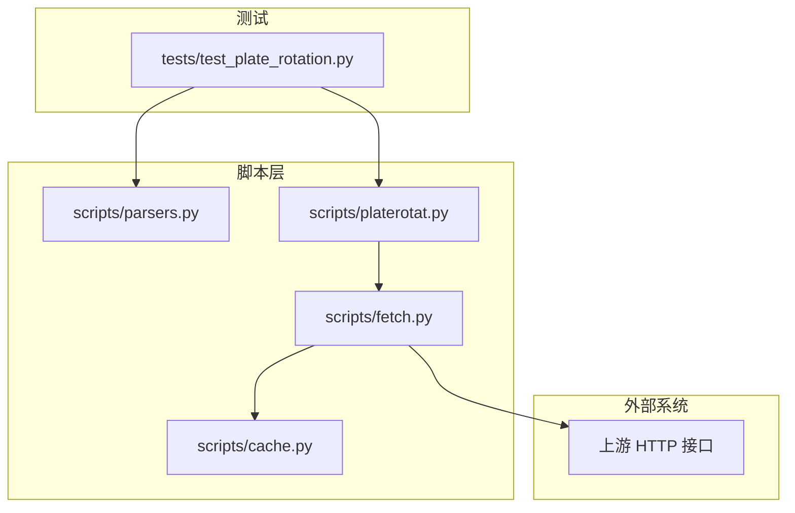
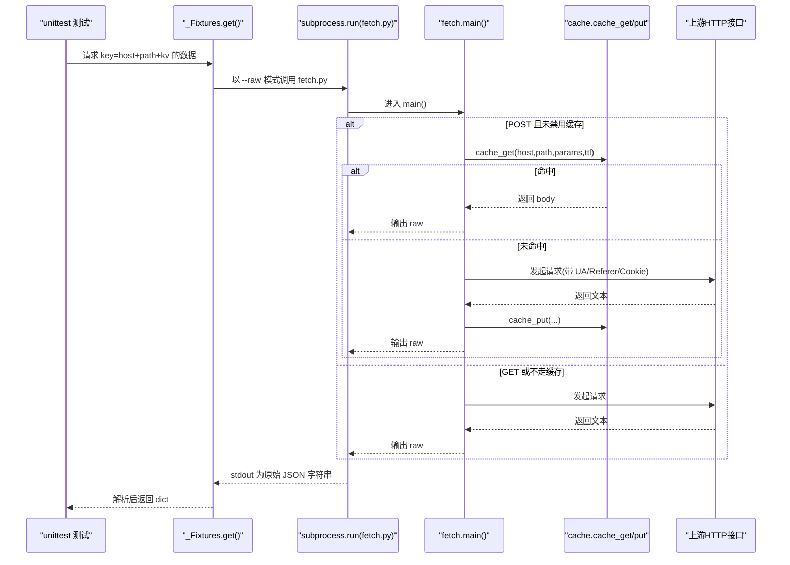
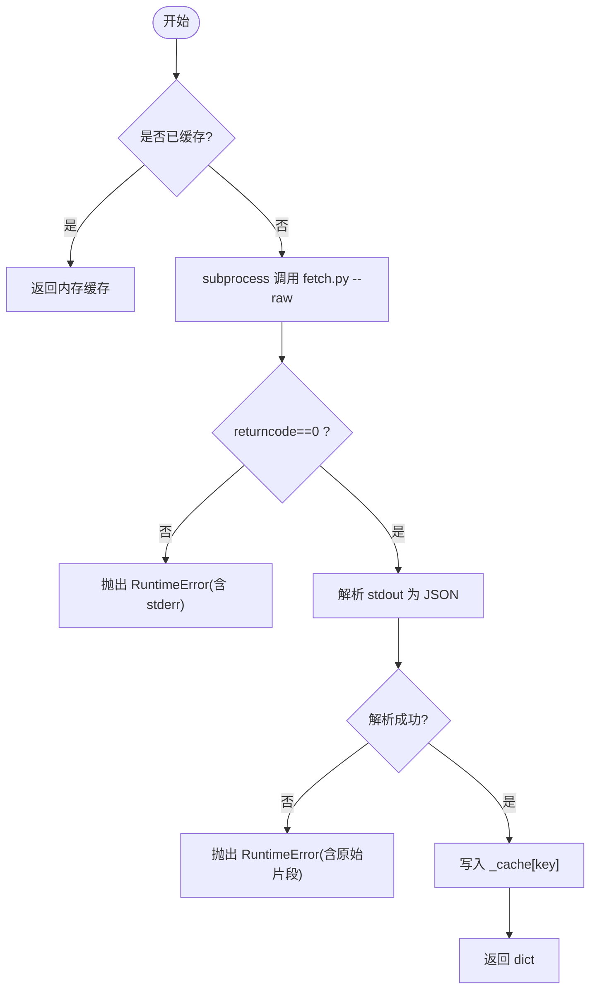
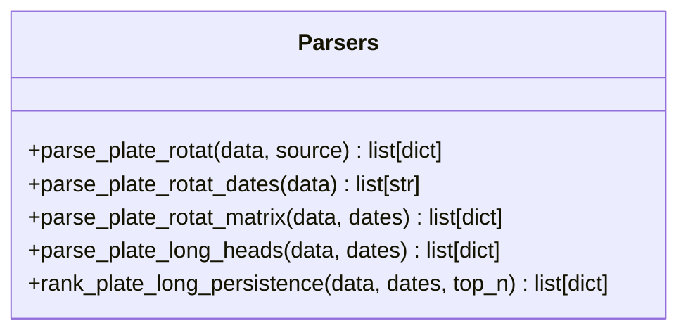
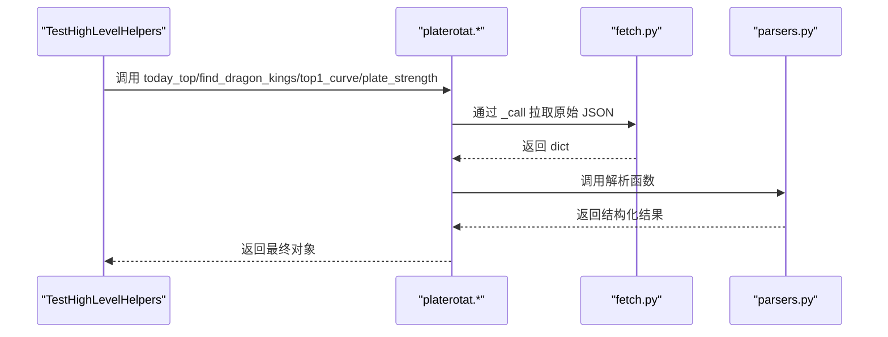
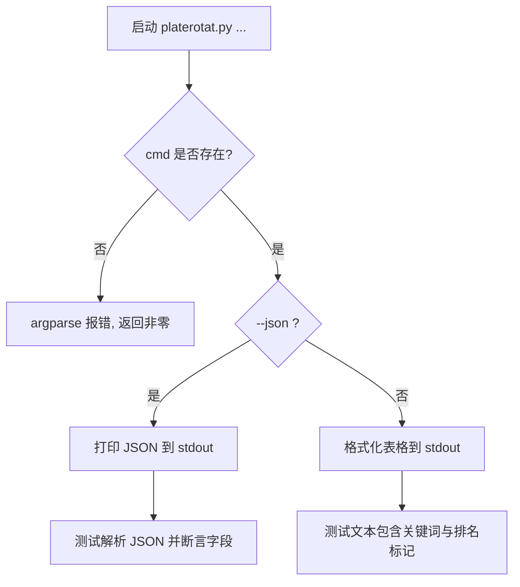
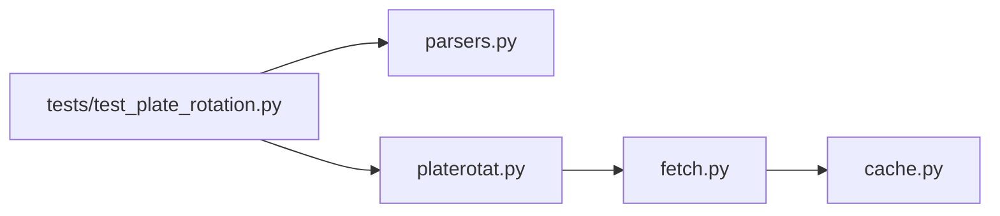

# 单元测试框架

<cite>
**本文引用的文件**   
- [test_plate_rotation.py](file://skills/plate-rotation-skill/tests/test_plate_rotation.py)
- [parsers.py](file://skills/plate-rotation-skill/scripts/parsers.py)
- [platerotat.py](file://skills/plate-rotation-skill/scripts/platerotat.py)
- [fetch.py](file://skills/plate-rotation-skill/scripts/fetch.py)
- [cache.py](file://skills/plate-rotation-skill/scripts/cache.py)
- [README.md](file://skills/plate-rotation-skill/README.md)
</cite>

## 目录
1. [简介](#简介)
2. [项目结构](#项目结构)
3. [核心组件](#核心组件)
4. [架构总览](#架构总览)
5. [详细组件分析](#详细组件分析)
6. [依赖关系分析](#依赖关系分析)
7. [性能与稳定性考量](#性能与稳定性考量)
8. [故障排查指南](#故障排查指南)
9. [结论](#结论)
10. [附录](#附录)

## 简介
本指南面向开发者，基于仓库中的在线集成测试用例，系统化讲解如何使用 Python 标准库 unittest 构建可维护、可扩展的测试套件。内容涵盖：
- 测试类设计模式与命名规范
- 断言方法的使用策略
- 共享 fixture 的实现原理（数据缓存与跨用例复用）
- 测试组织结构（底层 endpoint 健康、解析器功能、高级辅助函数、CLI 命令）
- 测试数据管理最佳实践（在线接口模拟、响应验证、异常场景）
- 覆盖率要求与代码质量检查工具集成建议

## 项目结构
该 skill 采用“脚本分层 + 单测覆盖”的组织方式：
- scripts：业务脚本层（网络调用、解析、高级封装、CLI）
- tests：在线集成测试（直接调用真实接口，覆盖端到端流程）
- README：使用说明与能力概览

图表来源
- [test_plate_rotation.py:1-444](file://skills/plate-rotation-skill/tests/test_plate_rotation.py#L1-L444)
- [parsers.py:1-212](file://skills/plate-rotation-skill/scripts/parsers.py#L1-L212)
- [platerotat.py:1-315](file://skills/plate-rotation-skill/scripts/platerotat.py#L1-L315)
- [fetch.py:1-230](file://skills/plate-rotation-skill/scripts/fetch.py#L1-L230)
- [cache.py:1-145](file://skills/plate-rotation-skill/scripts/cache.py#L1-L145)

章节来源
- [README.md:1-188](file://skills/plate-rotation-skill/README.md#L1-L188)

## 核心组件
- 测试入口与运行方式
  - 支持直接执行或 python -m unittest 运行，并开启详细输出。
- 共享 Fixture 层
  - 通过类级缓存避免重复网络请求，统一错误处理与 JSON 校验。
- 测试分组
  - 底层 endpoint 健康度
  - parsers 解析正确性
  - 高级 helper 返回结构与约束
  - CLI 子命令 text/json 双模输出与参数校验

章节来源
- [test_plate_rotation.py:1-444](file://skills/plate-rotation-skill/tests/test_plate_rotation.py#L1-L444)

## 架构总览
测试驱动的整体调用链如下：
- 测试用例通过 subprocess 调用 fetch.py 获取原始 JSON
- fetch.py 负责构造请求、重试、缓存读写，最终返回文本
- platerotat.py 组合多个接口并做运行时校验
- parsers.py 对 HTML-in-JSON 进行结构化抽取
- cache.py 提供本地磁盘缓存，减少重复网络开销

图表来源
- [test_plate_rotation.py:48-71](file://skills/plate-rotation-skill/tests/test_plate_rotation.py#L48-L71)
- [fetch.py:128-230](file://skills/plate-rotation-skill/scripts/fetch.py#L128-L230)
- [cache.py:59-95](file://skills/plate-rotation-skill/scripts/cache.py#L59-L95)

## 详细组件分析

### 测试类设计与命名规范
- 测试类职责单一，按模块划分：
  - TestFetchEndpoints：验证 4 个底层 endpoint 的健康与字段存在性
  - TestParsers：验证 5 个解析函数的输入输出与边界条件
  - TestHighLevelHelpers：验证 4 个高级 helper 的签名与返回结构
  - TestSourceAutoPick：验证 find_dragon_kings 的自动路由逻辑
  - TestCLI：验证 4 个子命令的 text/json 输出与参数校验
- 测试方法命名
  - 使用数字前缀保证执行顺序稳定（如 test_01_*），便于定位失败用例
  - 语义化后缀描述断言目标（如 *_ths / *_kaipan / *_json / *_text）

章节来源
- [test_plate_rotation.py:74-118](file://skills/plate-rotation-skill/tests/test_plate_rotation.py#L74-L118)
- [test_plate_rotation.py:120-244](file://skills/plate-rotation-skill/tests/test_plate_rotation.py#L120-L244)
- [test_plate_rotation.py:246-302](file://skills/plate-rotation-skill/tests/test_plate_rotation.py#L246-L302)
- [test_plate_rotation.py:304-328](file://skills/plate-rotation-skill/tests/test_plate_rotation.py#L304-L328)
- [test_plate_rotation.py:330-440](file://skills/plate-rotation-skill/tests/test_plate_rotation.py#L330-L440)

### 断言方法与验证策略
- 类型与结构断言
  - 使用 isinstance/assertIn/assertIsInstance 确保返回结构符合契约
- 数值与格式断言
  - 使用 assertGreater/assertLessEqual 限制返回规模
  - 使用 assertRegex 校验日期、代码、value 格式
- 排序与单调性断言
  - 使用 sorted 对比 rank 升序、count 降序等
- 空值与健壮性
  - 针对 legend=null、无领涨等边界情况给出容错断言

章节来源
- [test_plate_rotation.py:78-118](file://skills/plate-rotation-skill/tests/test_plate_rotation.py#L78-L118)
- [test_plate_rotation.py:125-244](file://skills/plate-rotation-skill/tests/test_plate_rotation.py#L125-L244)
- [test_plate_rotation.py:250-302](file://skills/plate-rotation-skill/tests/test_plate_rotation.py#L250-L302)

### 共享 Fixture 实现原理（数据缓存与跨用例复用）
- 类级字典缓存
  - 同一进程内多次请求相同 key 时直接返回内存缓存，避免重复网络 IO
- Key 生成策略
  - 由 host、path、排序后的 kv 拼接后哈希得到稳定键
- 错误处理
  - 捕获非零返回码与非 JSON 响应，抛出明确异常信息
- 超时控制
  - 为 subprocess 设置超时，防止阻塞测试

图表来源
- [test_plate_rotation.py:48-71](file://skills/plate-rotation-skill/tests/test_plate_rotation.py#L48-L71)

章节来源
- [test_plate_rotation.py:48-71](file://skills/plate-rotation-skill/tests/test_plate_rotation.py#L48-L71)

### 解析器功能测试（parsers.py）
- 主表解析
  - parse_plate_rotat：区分 ths（涨幅%）与 kaipan（强度分）两种 value_type
  - parse_plate_rotat_dates：提取日期序列，校验 newest-first 与唯一性
  - parse_plate_rotat_matrix：将主表还原为 N×天矩阵，校验 cells 与 dates 对齐
- 龙头解析
  - parse_plate_long_heads：兼容有领涨/无领涨两种样式，校验龙头 code/name/rank
  - rank_plate_long_persistence：统计上榜次数，校验 top_n 限制与 positions 格式

图表来源
- [parsers.py:20-175](file://skills/plate-rotation-skill/scripts/parsers.py#L20-L175)

章节来源
- [parsers.py:18-175](file://skills/plate-rotation-skill/scripts/parsers.py#L18-L175)
- [test_plate_rotation.py:120-244](file://skills/plate-rotation-skill/tests/test_plate_rotation.py#L120-L244)

### 高级辅助函数测试（platerotat.py）
- today_top：校验返回列表长度、rank 起始、value_type 与单位
- find_dragon_kings：校验返回字典关键字段、top_n 限制、daily_heads 非空
- top1_curve：校验 top5_names 便利字段与 name 非 None
- plate_strength：校验 ECharts 结构，legend 可为 null 但 date 必须存在

图表来源
- [platerotat.py:100-218](file://skills/plate-rotation-skill/scripts/platerotat.py#L100-L218)
- [test_plate_rotation.py:246-302](file://skills/plate-rotation-skill/tests/test_plate_rotation.py#L246-L302)

章节来源
- [platerotat.py:100-218](file://skills/plate-rotation-skill/scripts/platerotat.py#L100-L218)
- [test_plate_rotation.py:246-302](file://skills/plate-rotation-skill/tests/test_plate_rotation.py#L246-L302)

### 自动路由测试（source 选择）
- 规则：88x → ths；80x/803x → kaipan
- 断言要点：
  - 88x 能拿到 dates
  - 80x 能拿到 daily_heads 累计数量 > 0，否则可能路由失败

章节来源
- [test_plate_rotation.py:304-328](file://skills/plate-rotation-skill/tests/test_plate_rotation.py#L304-L328)
- [platerotat.py:144-172](file://skills/plate-rotation-skill/scripts/platerotat.py#L144-L172)

### CLI 命令测试（subprocess）
- 子命令：today / wangking / curve / strength
- 双模输出：text 与 json
- 参数校验：缺失子命令、非法 --source 应返回非零退出码
- 文本输出断言：包含关键标题与占位符
- JSON 输出断言：字段存在性与类型约束

图表来源
- [test_plate_rotation.py:330-440](file://skills/plate-rotation-skill/tests/test_plate_rotation.py#L330-L440)
- [platerotat.py:278-315](file://skills/plate-rotation-skill/scripts/platerotat.py#L278-L315)

章节来源
- [test_plate_rotation.py:330-440](file://skills/plate-rotation-skill/tests/test_plate_rotation.py#L330-L440)
- [platerotat.py:278-315](file://skills/plate-rotation-skill/scripts/platerotat.py#L278-L315)

## 依赖关系分析
- 测试层依赖
  - 直接 import parsers 与 platerotat 的高级函数
  - 通过 subprocess 调用 fetch.py 与 platerotat.py
- 脚本层依赖
  - platerotat 依赖 fetch 与 parsers
  - fetch 依赖 cache 与 urllib
  - cache 仅依赖 stdlib

图表来源
- [test_plate_rotation.py:32-45](file://skills/plate-rotation-skill/tests/test_plate_rotation.py#L32-L45)
- [platerotat.py:34-48](file://skills/plate-rotation-skill/scripts/platerotat.py#L34-L48)
- [fetch.py:31-36](file://skills/plate-rotation-skill/scripts/fetch.py#L31-L36)

章节来源
- [test_plate_rotation.py:32-45](file://skills/plate-rotation-skill/tests/test_plate_rotation.py#L32-L45)
- [platerotat.py:34-48](file://skills/plate-rotation-skill/scripts/platerotat.py#L34-L48)
- [fetch.py:31-36](file://skills/plate-rotation-skill/scripts/fetch.py#L31-L36)

## 性能与稳定性考量
- 网络请求优化
  - fetch.py 内置指数退避重试（429/5xx/网络异常），默认最多 3 次
  - cache.py 提供本地 TTL 缓存，默认 1 小时，降低重复请求
- 测试稳定性
  - 共享 fixture 在进程内缓存，显著减少网络抖动影响
  - 为 subprocess 设置超时，避免长时间挂起
- 资源清理
  - cache.py 提供 clear/stats 工具，便于诊断与清理过期缓存

章节来源
- [fetch.py:47-124](file://skills/plate-rotation-skill/scripts/fetch.py#L47-L124)
- [cache.py:35-95](file://skills/plate-rotation-skill/scripts/cache.py#L35-L95)
- [test_plate_rotation.py:48-71](file://skills/plate-rotation-skill/tests/test_plate_rotation.py#L48-L71)

## 故障排查指南
- 常见错误与定位
  - fetch.py 返回非零：查看 stderr 中 HTTP 状态码与重试日志
  - JSON 解析失败：确认 --raw 输出是否为合法 JSON
  - 路由错误：检查板块前缀与 source 匹配（88x→ths，80x/803x→kaipan）
- 运行时警告
  - platerotat 在 stderr 输出 PR-EMPTY/PR-WARN 提示，帮助区分节假日/跨源错传/上游异常
- 缓存问题
  - 使用 cache.py stats/clear 检查缓存大小与清理过期条目
  - 环境变量 PR_CACHE_DISABLE=1 可全局关闭缓存

章节来源
- [test_plate_rotation.py:57-71](file://skills/plate-rotation-skill/tests/test_plate_rotation.py#L57-L71)
- [platerotat.py:75-98](file://skills/plate-rotation-skill/scripts/platerotat.py#L75-L98)
- [cache.py:132-145](file://skills/plate-rotation-skill/scripts/cache.py#L132-L145)

## 结论
本测试套件以在线集成测试为主，围绕“数据获取—解析—封装—CLI”全链路进行断言，配合共享 fixture 与本地缓存，有效平衡了稳定性与效率。通过清晰的测试分类与严格的断言策略，能够快速发现接口变更、解析退化与 CLI 行为异常。建议在后续迭代中补充覆盖率与静态检查，进一步提升质量保障水平。

## 附录

### 测试覆盖率要求与质量检查工具集成建议
- 覆盖率
  - 建议引入 coverage 工具，设定最小阈值（例如行覆盖率≥80%，分支覆盖率≥70%）
  - 对关键路径（fetch 重试、cache 落盘、parsers 正则、CLI 参数校验）优先覆盖
- 静态检查
  - 引入 flake8/pylint/black 进行风格与复杂度检查
  - 结合 mypy 进行基础类型检查（当前代码已有部分 typing 标注）
- 持续集成
  - 在 CI 中并行执行 unittest，收集覆盖率报告与 lint 结果
  - 对网络相关用例增加重试与超时保护，避免偶发失败导致流水线不稳定

[本节为通用建议，不直接分析具体文件]