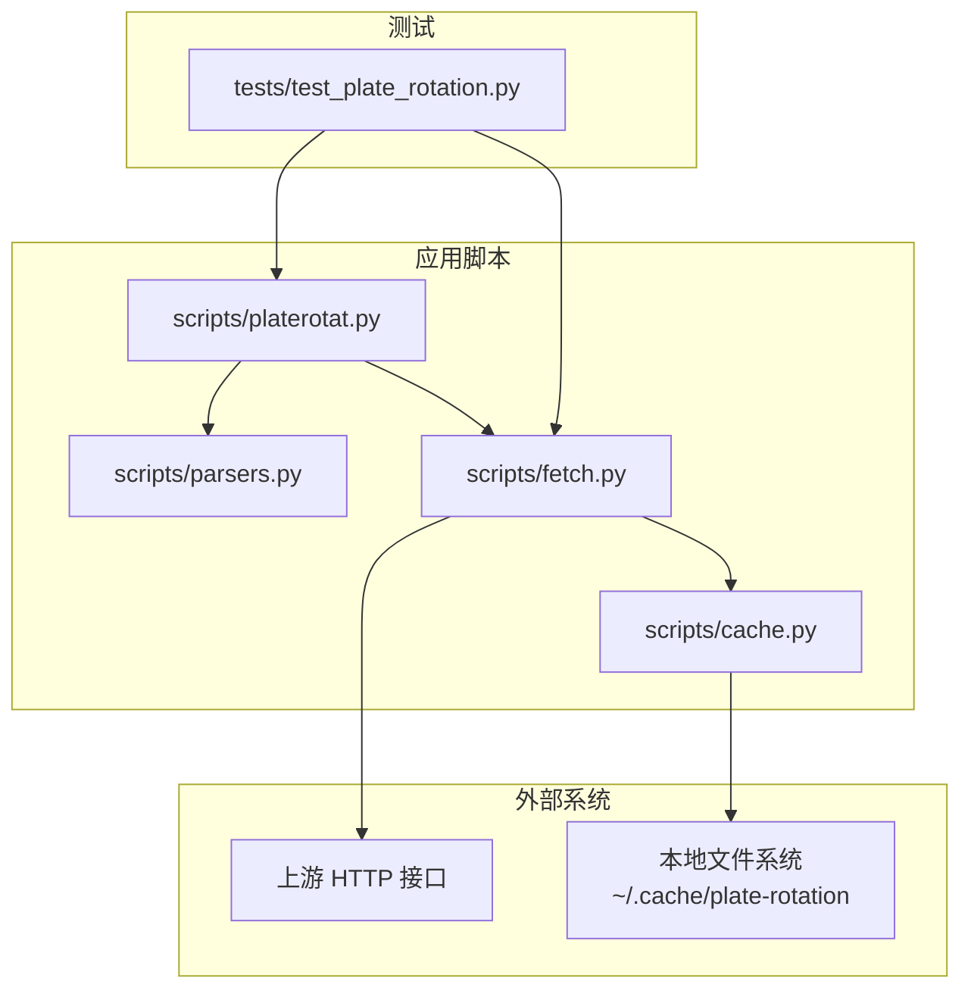
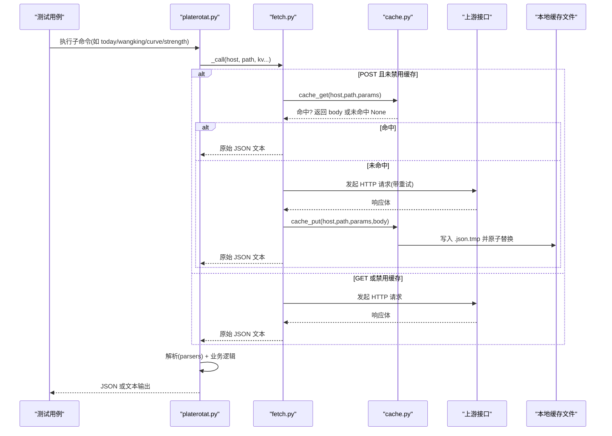
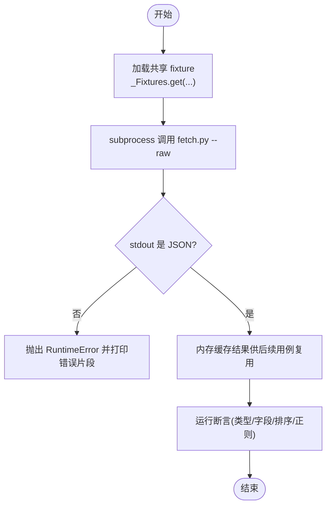
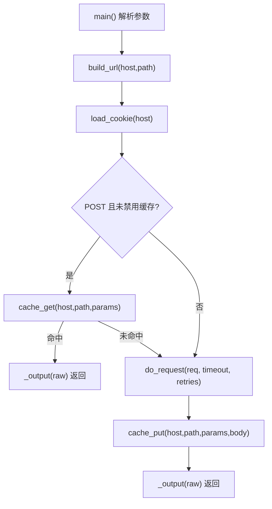
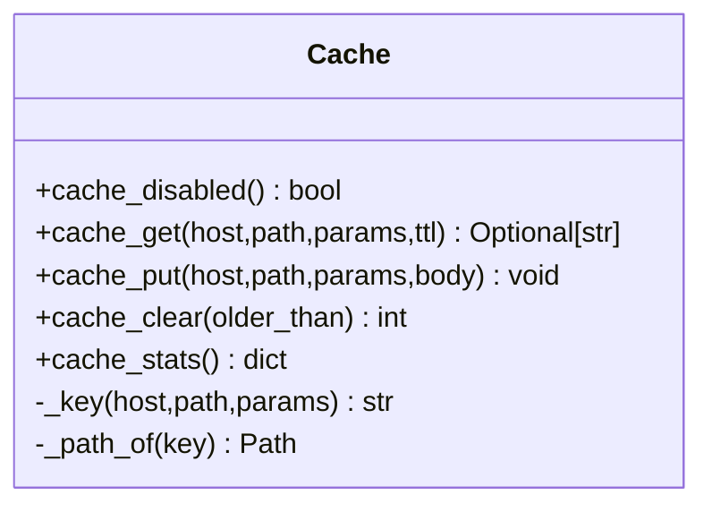
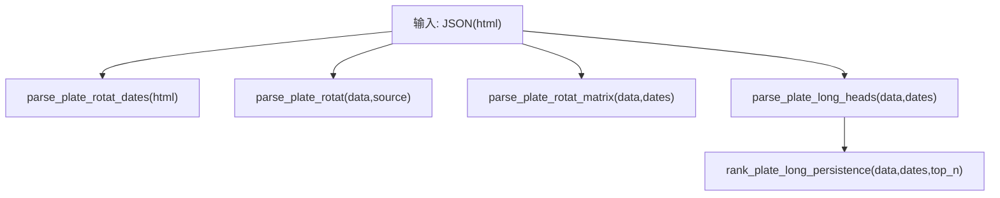
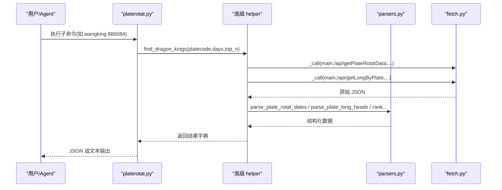
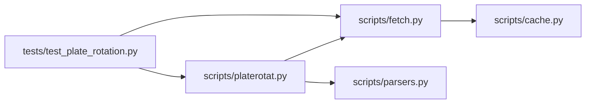

# 测试与调试

<cite>
**本文引用的文件**   
- [test_plate_rotation.py](file://skills/plate-rotation-skill/tests/test_plate_rotation.py)
- [fetch.py](file://skills/plate-rotation-skill/scripts/fetch.py)
- [cache.py](file://skills/plate-rotation-skill/scripts/cache.py)
- [parsers.py](file://skills/plate-rotation-skill/scripts/parsers.py)
- [platerotat.py](file://skills/plate-rotation-skill/scripts/platerotat.py)
- [README.md](file://skills/plate-rotation-skill/README.md)
</cite>

## 目录
1. [简介](#简介)
2. [项目结构](#项目结构)
3. [核心组件](#核心组件)
4. [架构总览](#架构总览)
5. [详细组件分析](#详细组件分析)
6. [依赖关系分析](#依赖关系分析)
7. [性能考虑](#性能考虑)
8. [故障排查指南](#故障排查指南)
9. [结论](#结论)
10. [附录](#附录)

## 简介
本指南面向开发者，围绕“板块轮动”Skill 的测试与调试实践，系统化说明：
- 基于 test_plate_rotation.py 的完整单元测试框架使用方法（用例设计、断言策略、测试数据管理）
- 在线集成测试的实现原理（网络请求模拟、响应缓存、异常处理）
- CLI 工具的测试方法（参数校验、输出格式检查）
- 调试技巧与工具使用（日志记录、错误追踪、性能分析）
- 覆盖率要求与持续集成建议
- 缓存系统的测试方法与性能基准思路

## 项目结构
该 Skill 采用脚本化分层组织：
- scripts/fetch.py：统一网络调用层（含重试、缓存、Cookie/Referer 注入）
- scripts/cache.py：本地 JSON 缓存原子层（TTL、禁用开关、统计与清理）
- scripts/parsers.py：HTML-in-JSON 解析器（主表、矩阵、日期、龙头、持久性排名）
- scripts/platerotat.py：高级 API + CLI（today/wangking/curve/strength）
- tests/test_plate_rotation.py：在线集成测试套件（跨 TestCase 共享 fixture、子进程调用 CLI）

图表来源
- [test_plate_rotation.py:1-444](file://skills/plate-rotation-skill/tests/test_plate_rotation.py#L1-L444)
- [platerotat.py:1-315](file://skills/plate-rotation-skill/scripts/platerotat.py#L1-L315)
- [parsers.py:1-212](file://skills/plate-rotation-skill/scripts/parsers.py#L1-L212)
- [fetch.py:1-230](file://skills/plate-rotation-skill/scripts/fetch.py#L1-L230)
- [cache.py:1-145](file://skills/plate-rotation-skill/scripts/cache.py#L1-L145)

章节来源
- [README.md:1-188](file://skills/plate-rotation-skill/README.md#L1-L188)

## 核心组件
- fetch.py：封装 HTTP 请求、重试退避、缓存命中分支、Cookie/Referer 注入、CLI 入口。提供 main() 函数与命令行参数。
- cache.py：提供 cache_get / cache_put / cache_clear / cache_stats / cache_disabled 等原子能力；支持环境变量 PR_CACHE_DISABLE、PR_CACHE_TTL、PR_CACHE_DIR。
- parsers.py：从 HTML-in-JSON 中抽取结构化数据（Top 列表、矩阵、日期、龙头、持久性排名）。
- platerotat.py：组合 fetch+parsers 的高级 helper（today_top/find_dragon_kings/top1_curve/plate_strength），并提供 CLI 四子命令。
- tests/test_plate_rotation.py：在线集成测试，覆盖 endpoint 健康度、解析正确性、高级 helper 返回结构、自动路由、CLI text/json 双模输出与错误路径。

章节来源
- [fetch.py:1-230](file://skills/plate-rotation-skill/scripts/fetch.py#L1-L230)
- [cache.py:1-145](file://skills/plate-rotation-skill/scripts/cache.py#L1-L145)
- [parsers.py:1-212](file://skills/plate-rotation-skill/scripts/parsers.py#L1-L212)
- [platerotat.py:1-315](file://skills/plate-rotation-skill/scripts/platerotat.py#L1-L315)
- [test_plate_rotation.py:1-444](file://skills/plate-rotation-skill/tests/test_plate_rotation.py#L1-L444)

## 架构总览
整体流程：测试通过 subprocess 调用 fetch.py 或 platerotat.py，后者再调用 fetch.py 访问上游接口；POST 请求默认走本地缓存；解析由 parsers.py 完成；最终由 platerotat.py 组装为高级 API 或 CLI 输出。

图表来源
- [platerotat.py:55-71](file://skills/plate-rotation-skill/scripts/platerotat.py#L55-L71)
- [fetch.py:128-213](file://skills/plate-rotation-skill/scripts/fetch.py#L128-L213)
- [cache.py:59-94](file://skills/plate-rotation-skill/scripts/cache.py#L59-L94)

## 详细组件分析

### 在线集成测试框架（test_plate_rotation.py）
- 测试目标
  - 底层 4 个 endpoint 健康度
  - parsers 对真实 HTML-in-JSON 的解析正确性
  - 4 个高级 helper 签名与返回结构
  - find_dragon_kings 按 platecode 前缀自动选择 source（88x→ths，80x/803x→kaipan）
  - CLI 4 个子命令 text/json 双模输出与错误路径
- 测试数据管理
  - 使用类级共享 fixture _Fixtures.get(key, host, path, *kv)，以 fetch.py --raw 拉取一次后在内存缓存复用，避免重复打网络
  - 失败时抛出 RuntimeError，包含 stderr 与 stdout 片段，便于定位
- 断言策略
  - 类型断言：isinstance(dict/list)
  - 字段存在性：assertIn("html"/"date"/"legend")
  - 数值语义区分：ths 源 value_type="pct" 且值以 % 结尾；kaipan 源 value_type="score" 且纯数字
  - 排序与约束：rank 升序、top_n 限制生效、dates newest-first 且无重复
  - 正则校验：日期格式 YYYY-MM-DD、龙头 code 6 位数字、position 格式 "YYYY-MM-DD/龙X"
- 子进程调用 CLI
  - 通过 subprocess.run 调用 platerotat.py，捕获 stdout/stderr，断言 returncode=0 或预期非零
  - 对 JSON 输出进行 json.loads 后再做结构断言；对文本输出进行关键字与正则匹配

图表来源
- [test_plate_rotation.py:48-72](file://skills/plate-rotation-skill/tests/test_plate_rotation.py#L48-L72)
- [test_plate_rotation.py:75-118](file://skills/plate-rotation-skill/tests/test_plate_rotation.py#L75-L118)
- [test_plate_rotation.py:121-244](file://skills/plate-rotation-skill/tests/test_plate_rotation.py#L121-L244)
- [test_plate_rotation.py:331-440](file://skills/plate-rotation-skill/tests/test_plate_rotation.py#L331-L440)

章节来源
- [test_plate_rotation.py:1-444](file://skills/plate-rotation-skill/tests/test_plate_rotation.py#L1-L444)

### 网络请求与重试（fetch.py）
- 功能要点
  - 三种参数姿势：key=value、-p JSON、ext 完整 URL
  - Cookie 读取：优先环境变量 PR_COOKIE，其次 ~/.plate_rotation_cookie
  - 指数退避重试：针对 429/5xx 及网络异常，最多 3 次，间隔 1s/2s/4s
  - 缓存命中分支：仅 POST 默认启用，可 --no-cache 或 PR_CACHE_DISABLE=1 关闭
  - 输出：--raw 直接输出原始字符串，否则尝试 JSON 美化
- 关键流程
  - 构建 URL → 解析参数 → 构造 headers → 缓存命中判断 → do_request 执行 → 写缓存 → 输出

图表来源
- [fetch.py:128-213](file://skills/plate-rotation-skill/scripts/fetch.py#L128-L213)
- [fetch.py:91-124](file://skills/plate-rotation-skill/scripts/fetch.py#L91-L124)

章节来源
- [fetch.py:1-230](file://skills/plate-rotation-skill/scripts/fetch.py#L1-L230)

### 本地缓存层（cache.py）
- 设计目标
  - 节流：同一参数组合在 TTL 内只发一次请求
  - 解耦：上层不感知实现细节
  - 可关：PR_CACHE_DISABLE=1 全局关闭
- Key 生成
  - sha1(host + "\n" + path + "\n" + sorted_form_kv)
- 落盘路径
  - ~/.cache/plate-rotation/{key[:2]}/{key}.json
- 原子写
  - 先写 .json.tmp，再 os.replace 原子替换，避免半写文件
- 诊断与清理
  - cache_stats 返回 count/total_bytes/root
  - cache_clear 支持 older_than 秒过滤

图表来源
- [cache.py:41-128](file://skills/plate-rotation-skill/scripts/cache.py#L41-L128)

章节来源
- [cache.py:1-145](file://skills/plate-rotation-skill/scripts/cache.py#L1-L145)

### 解析器（parsers.py）
- 主要函数
  - parse_plate_rotat：解析主表 Top N，区分 ths（pct%）与 kaipan（score）
  - parse_plate_rotat_dates：抽取日期序列（newest-first）
  - parse_plate_rotat_matrix：还原 N×天矩阵
  - parse_plate_long_heads：解析龙头矩阵（兼容“当日无领涨”）
  - rank_plate_long_persistence：统计跨天上榜次数，返回 Top N
- 健壮性
  - 正则表达式兼容不同样式与缺失列
  - 对齐 dates 长度，越界保护

图表来源
- [parsers.py:20-174](file://skills/plate-rotation-skill/scripts/parsers.py#L20-L174)

章节来源
- [parsers.py:1-212](file://skills/plate-rotation-skill/scripts/parsers.py#L1-L212)

### 高级 API 与 CLI（platerotat.py）
- 高级 helper
  - today_top(source,n,days)：今日 Top N
  - find_dragon_kings(platecode,days,top_n)：妖王榜，自动根据 platecode 前缀选择 source
  - top1_curve(source,days)：Top5 排名变化曲线（补 top5_names）
  - plate_strength(platecode,days)：单板块强度+量能时序
- CLI 子命令
  - today / wangking / curve / strength，均支持 --json 输出
- 运行时校验
  - 空数据或缺关键字段时，stderr 输出 PR-EMPTY/PR-WARN 提示，辅助下游 Agent 识别

图表来源
- [platerotat.py:125-172](file://skills/plate-rotation-skill/scripts/platerotat.py#L125-L172)
- [platerotat.py:278-310](file://skills/plate-rotation-skill/scripts/platerotat.py#L278-L310)

章节来源
- [platerotat.py:1-315](file://skills/plate-rotation-skill/scripts/platerotat.py#L1-L315)

## 依赖关系分析
- 模块耦合
  - platerotat.py 依赖 fetch.py 与 parsers.py
  - fetch.py 依赖 cache.py
  - tests/test_plate_rotation.py 依赖 fetch.py 与 platerotat.py（通过 subprocess）
- 外部依赖
  - 标准库：argparse、json、os、sys、urllib、re、time、hashlib、pathlib、datetime、subprocess
  - 无第三方依赖
- 潜在循环依赖
  - 当前无循环导入；fetch.py 与 cache.py 单向依赖

图表来源
- [test_plate_rotation.py:1-444](file://skills/plate-rotation-skill/tests/test_plate_rotation.py#L1-L444)
- [platerotat.py:1-315](file://skills/plate-rotation-skill/scripts/platerotat.py#L1-L315)
- [fetch.py:1-230](file://skills/plate-rotation-skill/scripts/fetch.py#L1-L230)
- [parsers.py:1-212](file://skills/plate-rotation-skill/scripts/parsers.py#L1-L212)
- [cache.py:1-145](file://skills/plate-rotation-skill/scripts/cache.py#L1-L145)

章节来源
- [test_plate_rotation.py:1-444](file://skills/plate-rotation-skill/tests/test_plate_rotation.py#L1-L444)
- [platerotat.py:1-315](file://skills/plate-rotation-skill/scripts/platerotat.py#L1-L315)
- [fetch.py:1-230](file://skills/plate-rotation-skill/scripts/fetch.py#L1-L230)
- [parsers.py:1-212](file://skills/plate-rotation-skill/scripts/parsers.py#L1-L212)
- [cache.py:1-145](file://skills/plate-rotation-skill/scripts/cache.py#L1-L145)

## 性能考虑
- 缓存命中率
  - 合理设置 PR_CACHE_TTL（默认 3600s），盘中数据 1 小时足够新鲜且减少重复请求
  - 可通过 PR_CACHE_DISABLE=1 强制刷新
- 重试退避
  - 指数退避降低瞬时拥塞压力，避免雪崩
- 解析复杂度
  - 正则扫描 HTML-in-JSON，时间复杂度近似 O(n)（n 为 HTML 字符数）
- CLI 输出
  - JSON 模式适合机器消费；text 模式用于人类阅读

[本节为通用指导，无需特定文件引用]

## 故障排查指南
- 常见问题定位
  - 网络超时/限流：查看 fetch.py 的 retry 日志（--verbose），确认是否触发 429/5xx 重试
  - 缓存问题：使用 cache.py stats/clear 检查缓存大小与过期情况；必要时 PR_CACHE_DISABLE=1
  - 解析异常：检查 parsers.py 的正则是否与上游 HTML 模板一致
  - CLI 参数错误：argparse choices 会拒绝非法 --source；无子命令将返回非零退出码
- 错误信息通道
  - fetch.py：stderr 打印 URL/body/cookie 摘要与重试信息
  - platerotat.py：stderr 输出 PR-EMPTY/PR-WARN 提示，便于下游识别空数据原因
- 快速自检
  - 使用 fetch.py --raw 获取原始响应，验证是否为合法 JSON
  - 使用 parsers.py 内置 demo 模式快速验证解析结果

章节来源
- [fetch.py:128-213](file://skills/plate-rotation-skill/scripts/fetch.py#L128-L213)
- [cache.py:132-145](file://skills/plate-rotation-skill/scripts/cache.py#L132-L145)
- [parsers.py:178-212](file://skills/plate-rotation-skill/scripts/parsers.py#L178-L212)
- [platerotat.py:75-98](file://skills/plate-rotation-skill/scripts/platerotat.py#L75-L98)

## 结论
本测试与调试指南围绕在线集成测试、网络层与缓存、解析与高级 API、CLI 行为展开，提供了从用例设计到故障定位的完整方法论。建议在 CI 中引入覆盖率与稳定性门禁，并结合缓存与重试机制提升鲁棒性。

[本节为总结性内容，无需特定文件引用]

## 附录

### 单元测试最佳实践清单
- 用例设计
  - 覆盖边界条件（空数据、周末、节假日、days 超前）
  - 区分双源语义（ths pct vs kaipan score）
  - 验证自动路由（88x→ths，80x/803x→kaipan）
- 断言方法
  - 类型/字段存在性/排序/正则/范围约束
- 测试数据管理
  - 共享 fixture 内存缓存，避免重复网络请求
  - 失败时保留 stderr/stdout 片段以便复现

章节来源
- [test_plate_rotation.py:48-72](file://skills/plate-rotation-skill/tests/test_plate_rotation.py#L48-L72)
- [test_plate_rotation.py:75-118](file://skills/plate-rotation-skill/tests/test_plate_rotation.py#L75-L118)
- [test_plate_rotation.py:121-244](file://skills/plate-rotation-skill/tests/test_plate_rotation.py#L121-L244)
- [test_plate_rotation.py:305-328](file://skills/plate-rotation-skill/tests/test_plate_rotation.py#L305-L328)
- [test_plate_rotation.py:331-440](file://skills/plate-rotation-skill/tests/test_plate_rotation.py#L331-L440)

### 在线集成测试实现要点
- 网络请求模拟
  - 通过 subprocess 调用 fetch.py，复用其重试与缓存逻辑
- 响应数据缓存
  - 测试内内存缓存 + 本地文件缓存（POST 默认开启）
- 异常处理
  - 捕获非 JSON 响应、HTTP 错误码、网络异常，并给出明确错误信息

章节来源
- [test_plate_rotation.py:48-72](file://skills/plate-rotation-skill/tests/test_plate_rotation.py#L48-L72)
- [fetch.py:91-124](file://skills/plate-rotation-skill/scripts/fetch.py#L91-L124)
- [cache.py:59-94](file://skills/plate-rotation-skill/scripts/cache.py#L59-L94)

### CLI 测试方法
- 参数验证
  - 无子命令应返回非零退出码
  - 非法 --source 被 argparse choices 拒绝
- 输出格式检查
  - JSON 模式：json.loads 后断言结构与字段
  - Text 模式：关键字与正则匹配（如 #N 排名、Top 标题）

章节来源
- [test_plate_rotation.py:331-440](file://skills/plate-rotation-skill/tests/test_plate_rotation.py#L331-L440)
- [platerotat.py:278-310](file://skills/plate-rotation-skill/scripts/platerotat.py#L278-L310)

### 调试技巧与工具使用
- 日志记录配置
  - fetch.py --verbose 打印 URL/body/cookie 摘要与重试信息
  - platerotat.py 通过 stderr 输出 PR-EMPTY/PR-WARN 提示
- 错误追踪
  - 结合 subprocess 的 stderr 与 stdout 片段定位问题
- 性能分析
  - 使用 cache.py stats 观察缓存规模
  - 调整 PR_CACHE_TTL 评估命中率与延迟变化

章节来源
- [fetch.py:193-199](file://skills/plate-rotation-skill/scripts/fetch.py#L193-L199)
- [platerotat.py:75-98](file://skills/plate-rotation-skill/scripts/platerotat.py#L75-L98)
- [cache.py:119-128](file://skills/plate-rotation-skill/scripts/cache.py#L119-L128)

### 测试覆盖率与持续集成建议
- 覆盖率要求
  - 建议行覆盖率 ≥ 80%，分支覆盖率 ≥ 70%
  - 重点覆盖：fetch 重试分支、缓存命中/未命中、CLI 参数校验、解析边界
- 持续集成配置
  - 在 CI 中安装 Python 3.9+，执行 unittest 套件
  - 可选：并行执行测试用例，缩短反馈时间
  - 失败时归档 stderr/stdout 与缓存统计

[本节为通用指导，无需特定文件引用]

### 缓存系统测试方法与性能基准
- 测试方法
  - 验证 cache_disabled 开关（PR_CACHE_DISABLE=1）
  - 验证 TTL 过期行为（设置较小 TTL 或 older_than 清理）
  - 验证 key 稳定性（参数顺序不影响 key）
  - 验证原子写（.json.tmp 替换）
- 性能基准
  - 对比开启/关闭缓存的请求耗时与成功率
  - 统计 cache_stats 的 count/total_bytes 随时间的增长趋势

章节来源
- [cache.py:41-94](file://skills/plate-rotation-skill/scripts/cache.py#L41-L94)
- [cache.py:98-128](file://skills/plate-rotation-skill/scripts/cache.py#L98-L128)