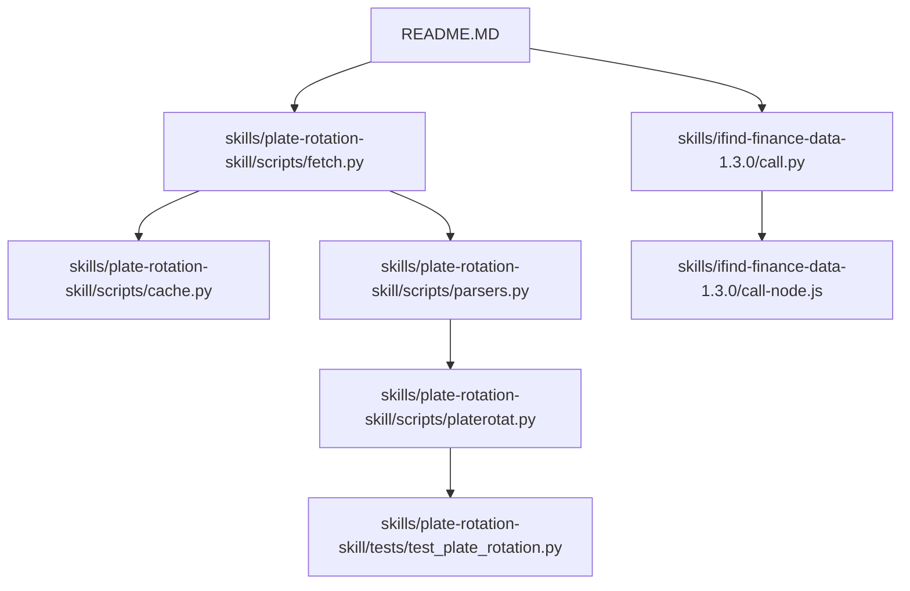
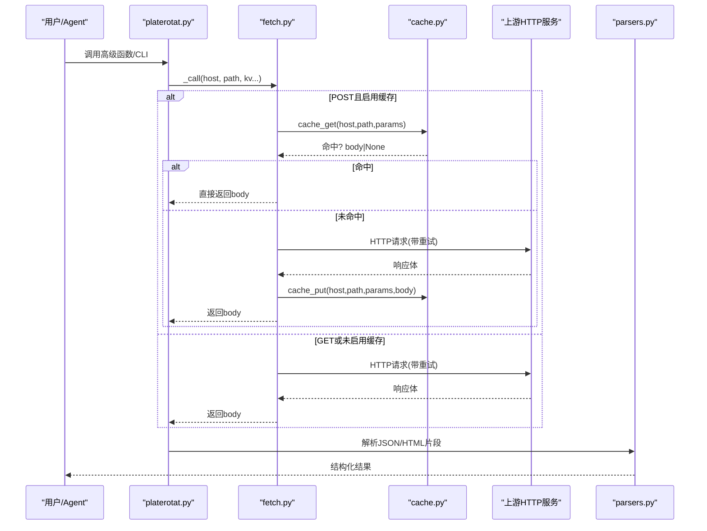
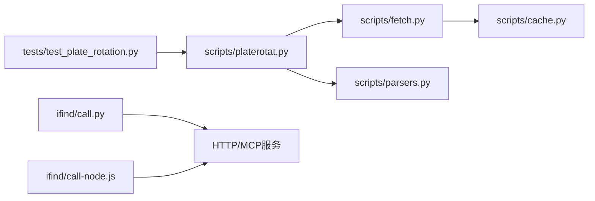

# 调试工具与技巧

<cite>
**本文引用的文件**   
- [README.MD](file://README.MD)
- [fetch.py](file://skills/plate-rotation-skill/scripts/fetch.py)
- [cache.py](file://skills/plate-rotation-skill/scripts/cache.py)
- [parsers.py](file://skills/plate-rotation-skill/scripts/parsers.py)
- [platerotat.py](file://skills/plate-rotation-skill/scripts/platerotat.py)
- [test_plate_rotation.py](file://skills/plate-rotation-skill/tests/test_plate_rotation.py)
- [call.py](file://skills/ifind-finance-data-1.3.0/call.py)
- [call-node.js](file://skills/ifind-finance-data-1.3.0/call-node.js)
</cite>

## 目录
1. [简介](#简介)
2. [项目结构](#项目结构)
3. [核心组件](#核心组件)
4. [架构总览](#架构总览)
5. [详细组件分析](#详细组件分析)
6. [依赖关系分析](#依赖关系分析)
7. [性能考虑](#性能考虑)
8. [故障排查指南](#故障排查指南)
9. [结论](#结论)
10. [附录](#附录)

## 简介
本指南面向开发者，围绕本项目中网络请求、缓存、解析与测试等关键路径，提供一套可落地的调试方法与技巧。内容覆盖：
- Python 调试器使用（断点、变量检查、执行流程控制）
- 日志记录系统配置与结构化输出
- 缓存系统调试（命中统计、内存占用估算、失效机制验证）
- 性能剖析与资源监控（CPU、内存、网络）
- 网络请求调试（拦截、响应查看、连接状态）
- 常见问题定位（数据解析错误、网络超时、内存溢出）

## 项目结构
仓库采用“技能（Skill）+策略（Strategy）+手册（Manual）”的模块化组织。本次调试指南聚焦于 skills 下的两个子模块：
- plate-rotation-skill：板块轮动数据获取、缓存、解析与高级封装
- ifind-finance-data：iFinD MCP 客户端调用（Python/Node 双实现）

图表来源
- [README.MD](file://README.MD)
- [fetch.py](file://skills/plate-rotation-skill/scripts/fetch.py)
- [cache.py](file://skills/plate-rotation-skill/scripts/cache.py)
- [parsers.py](file://skills/plate-rotation-skill/scripts/parsers.py)
- [platerotat.py](file://skills/plate-rotation-skill/scripts/platerotat.py)
- [test_plate_rotation.py](file://skills/plate-rotation-skill/tests/test_plate_rotation.py)
- [call.py](file://skills/ifind-finance-data-1.3.0/call.py)
- [call-node.js](file://skills/ifind-finance-data-1.3.0/call-node.js)

章节来源
- [README.MD](file://README.MD)

## 核心组件
- 网络请求层（fetch.py）
  - 统一构造请求头、Cookie、Referer；支持 GET/POST、参数拼接、重试退避、缓存命中分支、原始/美化输出。
- 本地缓存层（cache.py）
  - 基于文件的 TTL 缓存，原子写入、全局开关、清理与统计 CLI。
- 解析层（parsers.py）
  - 从 JSON 包裹的 HTML 片段抽取结构化数据，含日期矩阵、龙头股持久性统计等。
- 高级封装与 CLI（platerotat.py）
  - 组合 fetch+parsers，暴露 today_top/find_dragon_kings/top1_curve/plate_strength 四个意图函数，并提供命令行入口。
- iFinD MCP 客户端（call.py / call-node.js）
  - 会话初始化、工具集拉取、tools/call 调用，返回标准化结果。

章节来源
- [fetch.py:1-230](file://skills/plate-rotation-skill/scripts/fetch.py#L1-L230)
- [cache.py:1-145](file://skills/plate-rotation-skill/scripts/cache.py#L1-L145)
- [parsers.py:1-212](file://skills/plate-rotation-skill/scripts/parsers.py#L1-L212)
- [platerotat.py:1-315](file://skills/plate-rotation-skill/scripts/platerotat.py#L1-L315)
- [call.py:1-208](file://skills/ifind-finance-data-1.3.0/call.py#L1-L208)
- [call-node.js:43-210](file://skills/ifind-finance-data-1.3.0/call-node.js#L43-L210)

## 架构总览
板块轮动数据链路：上层 CLI/函数 → platerotat.py → fetch.py（带重试/缓存）→ 目标接口 → parsers.py 解析 → 结构化结果。iFinD 侧通过 call.py 或 call-node.js 发起 MCP 调用。

图表来源
- [platerotat.py:55-71](file://skills/plate-rotation-skill/scripts/platerotat.py#L55-L71)
- [fetch.py:128-213](file://skills/plate-rotation-skill/scripts/fetch.py#L128-L213)
- [cache.py:59-94](file://skills/plate-rotation-skill/scripts/cache.py#L59-L94)
- [parsers.py:18-108](file://skills/plate-rotation-skill/scripts/parsers.py#L18-L108)

## 详细组件分析

### 网络请求层（fetch.py）调试要点
- 关键能力
  - 参数解析：支持 key=value 与 -p JSON 两种姿势，二者互斥。
  - 请求构建：自动注入 UA/Referer/Origin/X-Requested-With，可选 Cookie。
  - 重试策略：对 429/5xx 及网络异常指数退避，最大次数可配。
  - 缓存：仅 POST 默认走缓存，TTL 可配，支持 --no-cache 与 PR_CACHE_DISABLE=1。
  - 自检：-v 打印 URL/body/cookie 摘要，便于快速定位问题。
- 常用调试命令
  - 探测/自检：python3 scripts/fetch.py main /api/getPlateRotatData from=ths days=20 -v
  - 禁用缓存：python3 scripts/fetch.py main /api/getLongByPlate platecode=886084 days=20 --no-cache
  - 调整 TTL：python3 scripts/fetch.py main /api/getPlateRotatData from=kaipan days=20 --cache-ttl 60
  - 指定方法：python3 scripts/fetch.py main /api/getPlateRotatData from=ths days=20 -X GET
- 断点建议位置
  - 参数解析后、URL 构建前：确认 host/path/kv/-p 合并正确
  - do_request 循环内：观察重试次数、sleep 间隔与错误信息
  - 缓存命中分支：确认是否命中、TTL 是否生效
- 常见陷阱
  - 同时使用 -p 与 key=value 会报错退出
  - 非 4xx 以外的 HTTP 错误不会重试
  - Cookie 读取优先级：环境变量 > 文件，空值时不发送

章节来源
- [fetch.py:128-213](file://skills/plate-rotation-skill/scripts/fetch.py#L128-L213)
- [fetch.py:91-124](file://skills/plate-rotation-skill/scripts/fetch.py#L91-L124)
- [fetch.py:54-87](file://skills/plate-rotation-skill/scripts/fetch.py#L54-L87)

### 本地缓存层（cache.py）调试要点
- 关键能力
  - Key 生成：host + path + 排序后的 form kv，保证参数顺序无关。
  - 落盘格式：包含 ts/host/path/params/body，原子写入避免半写。
  - 全局开关：PR_CACHE_DISABLE=1 关闭缓存。
  - 清理与统计：stats 返回 count/total_bytes/root；clear 支持 older_than。
- 诊断命令
  - 统计：python3 scripts/cache.py stats
  - 清理全部：python3 scripts/cache.py clear
  - 清理超过 N 秒：python3 scripts/cache.py clear --older 86400
- 失效机制验证
  - 设置极短 TTL（如 1s），重复请求应出现 miss→hit 切换
  - 修改 params 顺序（如 days=20&from=ths vs from=ths&days=20）应命中同一 key
  - 损坏文件会被自动删除并视为 miss
- 内存与磁盘监控
  - total_bytes 用于估算磁盘占用；结合 count 评估热点 key 数量
  - 若 total_bytes 持续增长，检查 TTL 与清理策略

章节来源
- [cache.py:47-56](file://skills/plate-rotation-skill/scripts/cache.py#L47-L56)
- [cache.py:59-94](file://skills/plate-rotation-skill/scripts/cache.py#L59-L94)
- [cache.py:98-128](file://skills/plate-rotation-skill/scripts/cache.py#L98-L128)
- [cache.py:132-144](file://skills/plate-rotation-skill/scripts/cache.py#L132-L144)

### 解析层（parsers.py）调试要点
- 关键能力
  - 从 JSON 包裹的 HTML 片段抽取 Top 板块、日期序列、龙头股矩阵与持久性排名。
  - 兼容不同源的数据差异（ths 带 %，kaipan 为纯分）。
- 调试建议
  - 先以 --raw 拿到原始 JSON，再传入 parsers 对应函数逐步验证正则匹配
  - 关注空数据场景：当 HTML 片段缺失或字段不全时，解析结果为空列表
- 典型用例
  - 今日 Top N：parse_plate_rotat(data, source="ths"/"kaipan")
  - 日期序列：parse_plate_rotat_dates(data)
  - 龙头股矩阵：parse_plate_long_heads(data, dates)
  - 跨天持久性：rank_plate_long_persistence(data, dates, top_n)

章节来源
- [parsers.py:18-108](file://skills/plate-rotation-skill/scripts/parsers.py#L18-L108)
- [parsers.py:113-175](file://skills/plate-rotation-skill/scripts/parsers.py#L113-L175)

### 高级封装与 CLI（platerotat.py）调试要点
- 关键能力
  - 组合 fetch+parsers，暴露四个高级函数；CLI 提供 today/wangking/curve/strength 子命令。
  - 运行时校验：对空数据或缺关键字段输出 PR-EMPTY/PR-WARN 提示，便于下游识别。
- 调试建议
  - 使用 --json 输出结构化结果，便于断言与自动化测试
  - 关注 stderr 中的 PR-EMPTY/PR-WARN 提示，快速定位“无数据”的原因
- 常见用法
  - 今日 Top N：python3 scripts/platerotat.py today --source kaipan --n 10 --days 20 --json
  - 妖王榜：python3 scripts/platerotat.py wangking 886084 --days 20 --n 10 --json
  - 排名曲线：python3 scripts/platerotat.py curve --source ths --days 20 --json
  - 强度时序：python3 scripts/platerotat.py strength 886084 --days 20 --json

章节来源
- [platerotat.py:102-218](file://skills/plate-rotation-skill/scripts/platerotat.py#L102-L218)
- [platerotat.py:278-315](file://skills/plate-rotation-skill/scripts/platerotat.py#L278-L315)

### iFinD MCP 客户端（call.py / call-node.js）调试要点
- 关键能力
  - 会话初始化：initialize 成功后保存 Mcp-Session-Id，后续请求携带该会话头。
  - 工具集拉取：tools/list 返回允许的工具名集合，调用 tools/call 前进行白名单校验。
  - 参数校验：禁止危险键、非法数值类型与 NaN。
- 调试建议
  - 首次调用 list_tools 或 call 前，确保 initialize 成功并返回会话 ID
  - 捕获 error 字段与 status_code，便于区分服务端业务错误与 HTTP 错误
  - Node 版本在超时事件上显式 reject，便于上层感知超时
- 常见陷阱
  - 未初始化即调用 tools/call 会导致缺少会话头
  - 传入非法参数将触发 TypeError 提前失败

章节来源
- [call.py:85-116](file://skills/ifind-finance-data-1.3.0/call.py#L85-L116)
- [call.py:119-171](file://skills/ifind-finance-data-1.3.0/call.py#L119-L171)
- [call.py:59-82](file://skills/ifind-finance-data-1.3.0/call.py#L59-L82)
- [call-node.js:149-176](file://skills/ifind-finance-data-1.3.0/call-node.js#L149-L176)
- [call-node.js:43-78](file://skills/ifind-finance-data-1.3.0/call-node.js#L43-L78)

## 依赖关系分析
- 模块耦合
  - platerotat.py 依赖 fetch.py 与 parsers.py
  - fetch.py 依赖 cache.py
  - tests 依赖 fetch.py 与 platerotat.py
  - ifind-finance-data 的 Python 与 Node 实现职责一致，便于对比调试
- 外部依赖
  - 网络：urllib（Python）、requests（Python）、http/https（Node）
  - 文件系统：pathlib/os（缓存落盘）
  - 标准库：argparse/json/re/datetime/subprocess

图表来源
- [test_plate_rotation.py:48-76](file://skills/plate-rotation-skill/tests/test_plate_rotation.py#L48-L76)
- [platerotat.py:34-48](file://skills/plate-rotation-skill/scripts/platerotat.py#L34-L48)
- [fetch.py:31-36](file://skills/plate-rotation-skill/scripts/fetch.py#L31-L36)
- [cache.py:28-36](file://skills/plate-rotation-skill/scripts/cache.py#L28-L36)
- [call.py:1-18](file://skills/ifind-finance-data-1.3.0/call.py#L1-L18)
- [call-node.js:43-78](file://skills/ifind-finance-data-1.3.0/call-node.js#L43-L78)

章节来源
- [test_plate_rotation.py:48-76](file://skills/plate-rotation-skill/tests/test_plate_rotation.py#L48-L76)
- [platerotat.py:34-48](file://skills/plate-rotation-skill/scripts/platerotat.py#L34-L48)
- [fetch.py:31-36](file://skills/plate-rotation-skill/scripts/fetch.py#L31-L36)
- [cache.py:28-36](file://skills/plate-rotation-skill/scripts/cache.py#L28-L36)
- [call.py:1-18](file://skills/ifind-finance-data-1.3.0/call.py#L1-L18)
- [call-node.js:43-78](file://skills/ifind-finance-data-1.3.0/call-node.js#L43-L78)

## 性能考虑
- 网络请求
  - 合理设置超时与最大重试次数，避免雪崩；优先利用缓存减少重复请求
  - 使用 --verbose 观察重试与退避行为，必要时调大 RETRY_BASE_SLEEP
- 缓存
  - 根据数据新鲜度需求调整 TTL；定期清理过期缓存，控制磁盘增长
  - 通过 stats 监控 total_bytes 与 count，评估热点 key 分布
- 解析
  - 正则表达式尽量精确，避免回溯灾难；对超大 HTML 片段建议分批处理
- iFinD 客户端
  - 复用会话，避免频繁 initialize；对 tools/list 做本地缓存以减少额外请求

[本节为通用指导，无需源码引用]

## 故障排查指南

### Python 调试器使用（pdb）
- 插入断点
  - 在关键路径添加断点：例如 fetch.py 的参数解析后、do_request 循环内、cache.py 的 get/put 处
  - 运行脚本时附加 -m pdb 或在 IDE 中设置断点
- 常用命令
  - n：单步执行；c：继续运行；p 变量：打印变量；l：查看上下文；bt：回溯栈
- 针对本项目的断点建议
  - fetch.py 的 do_request 循环：观察重试次数与错误信息
  - cache.py 的 cache_get/cache_put：确认 key 生成与 TTL 判断
  - parsers.py 的正则匹配：打印中间 HTML 片段，验证匹配逻辑
  - platerotat.py 的 _warn 输出：确认 PR-EMPTY/PR-WARN 触发条件

章节来源
- [fetch.py:91-124](file://skills/plate-rotation-skill/scripts/fetch.py#L91-L124)
- [cache.py:59-94](file://skills/plate-rotation-skill/scripts/cache.py#L59-L94)
- [parsers.py:18-108](file://skills/plate-rotation-skill/scripts/parsers.py#L18-L108)
- [platerotat.py:75-98](file://skills/plate-rotation-skill/scripts/platerotat.py#L75-L98)

### 日志记录系统配置与使用
- 现状与建议
  - 当前代码主要通过 sys.stderr 输出诊断信息（如 fetch 的 verbose、platerotat 的 PR-EMPTY/PR-WARN）
  - 建议引入 logging 模块，按级别（DEBUG/INFO/WARNING/ERROR）输出，并支持结构化 JSON 格式
  - 将缓存命中/miss、重试次数、解析耗时等指标纳入日志，便于聚合与分析
- 结构化日志示例思路
  - 字段包括：timestamp、level、component、event、duration_ms、key、status
  - 使用 json.dumps 序列化，便于 ELK/ Loki 等日志系统消费

[本节为通用指导，无需源码引用]

### 缓存系统调试方法
- 命中统计
  - 使用 cache.py 的 stats 输出 count/total_bytes/root，结合 fetch 的 verbose 观察命中率
- 内存使用监控
  - 通过 total_bytes 估算磁盘占用；结合进程内存工具（如 tracemalloc）监控解析阶段峰值
- 失效机制验证
  - 设置极短 TTL 或 PR_CACHE_DISABLE=1 强制 miss，验证端到端链路
  - 修改参数顺序，确认 key 稳定性

章节来源
- [cache.py:119-128](file://skills/plate-rotation-skill/scripts/cache.py#L119-L128)
- [fetch.py:159-168](file://skills/plate-rotation-skill/scripts/fetch.py#L159-L168)

### 性能分析工具使用指南
- cProfile 性能剖析
  - 对 platerotat.py 的高级函数进行采样，定位慢点（网络 I/O、解析正则）
  - 结合 pstats 可视化热点函数调用链
- 内存泄漏检测
  - 使用 tracemalloc 跟踪对象分配，重点关注解析层的大字符串与正则匹配
- CPU 使用率监控
  - 使用系统工具（top/htop）与 Python 内置 time 计时，定位阻塞点
- 网络请求监控
  - 在 fetch.py 的 do_request 前后记录时间戳，统计平均延迟与重试比例

[本节为通用指导，无需源码引用]

### 网络请求调试技巧
- HTTP 请求拦截
  - 使用 -v 打印 URL/body/cookie 摘要；必要时在代理层抓包（mitmproxy/tcpdump）
- 响应数据查看
  - 使用 --raw 输出原始文本，再以 parsers 函数逐步解析，定位字段缺失
- 连接池状态监控
  - requests 默认连接池复用，可通过 urllib3 日志观察连接创建/释放；Node 端注意 keep-alive 配置

章节来源
- [fetch.py:193-199](file://skills/plate-rotation-skill/scripts/fetch.py#L193-L199)
- [fetch.py:200-213](file://skills/plate-rotation-skill/scripts/fetch.py#L200-L213)

### 常见问题排查
- 数据解析错误
  - 现象：返回空列表或字段缺失
  - 排查：先用 --raw 查看原始 JSON/HTML，再在 parsers 中打印中间结果；检查正则是否适配最新模板
- 网络超时
  - 现象：请求长时间无响应或抛出超时异常
  - 排查：增大 timeout；检查网络连通性与服务器负载；观察重试日志
- 内存溢出
  - 现象：进程内存持续增长或 OOM
  - 排查：限制单次解析的 HTML 大小；及时清理缓存；使用 tracemalloc 定位大对象

章节来源
- [parsers.py:18-108](file://skills/plate-rotation-skill/scripts/parsers.py#L18-L108)
- [fetch.py:91-124](file://skills/plate-rotation-skill/scripts/fetch.py#L91-L124)
- [cache.py:98-128](file://skills/plate-rotation-skill/scripts/cache.py#L98-L128)

## 结论
通过在本项目中系统化地应用调试器、日志、缓存诊断、性能剖析与网络调试技巧，可以显著提升问题定位效率与系统稳定性。建议将上述实践固化为团队规范，并在 CI 中加入基础健康检查与回归测试，持续保障数据链路的可靠性。

[本节为总结，无需源码引用]

## 附录
- 常用命令速查
  - 板块轮动 CLI：python3 scripts/platerotat.py today/wangking/curve/strength [--json]
  - 网络请求自检：python3 scripts/fetch.py main /api/... -v --no-cache --cache-ttl 60
  - 缓存管理：python3 scripts/cache.py stats | clear [--older SEC]
  - iFinD 客户端：参考 call.py 的 call/list_tools 用法

[本节为补充说明，无需源码引用]