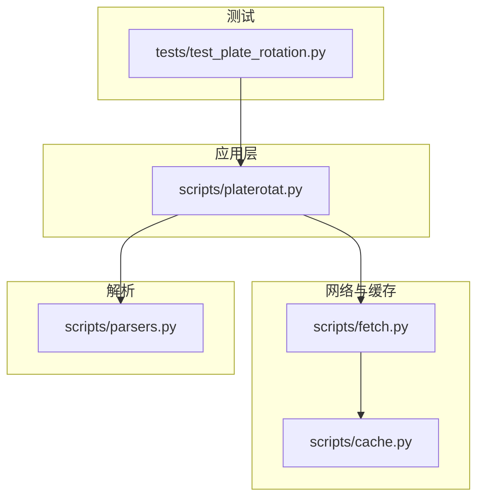
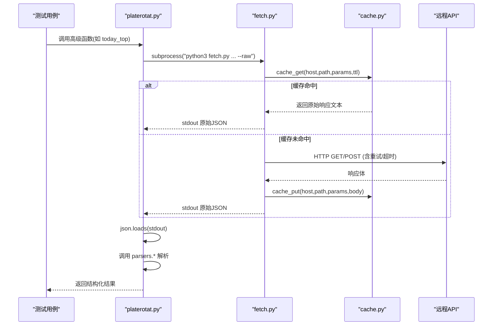
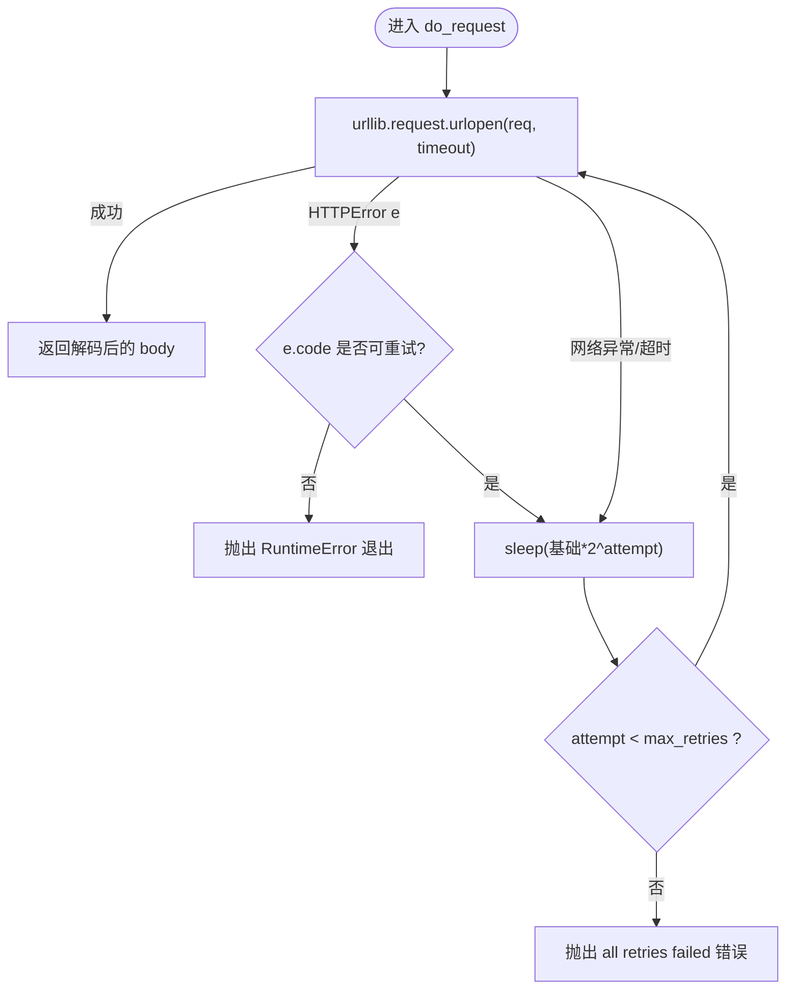
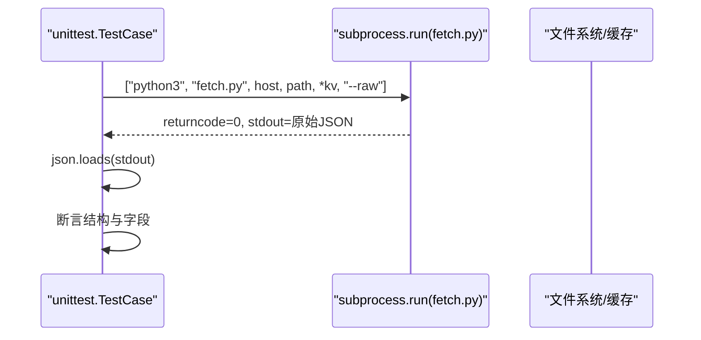
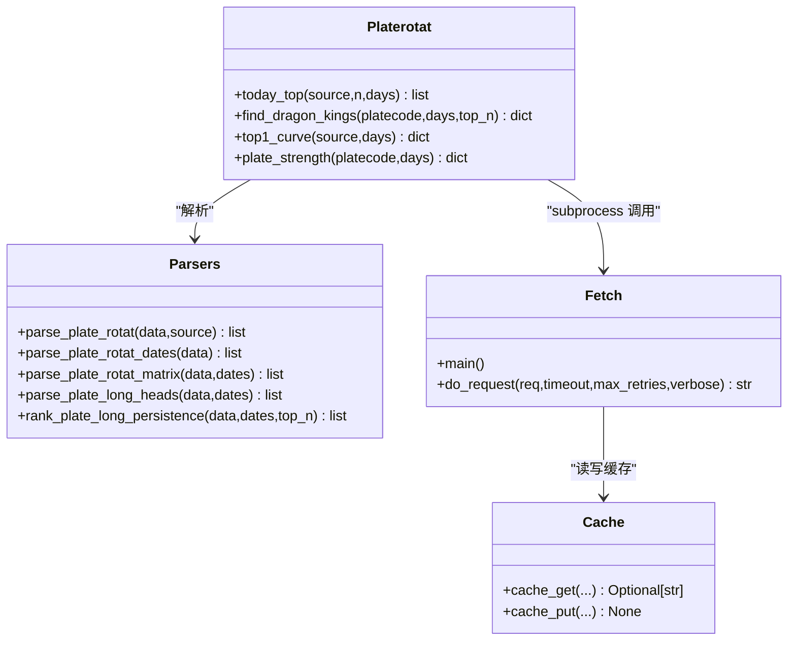
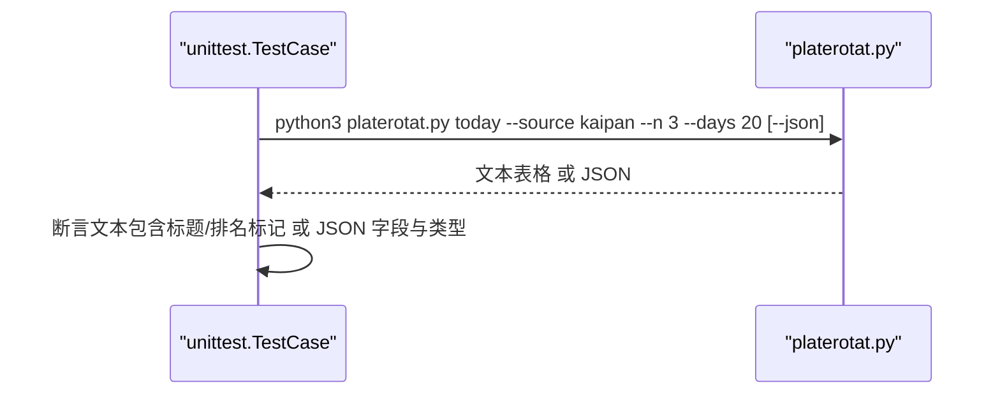
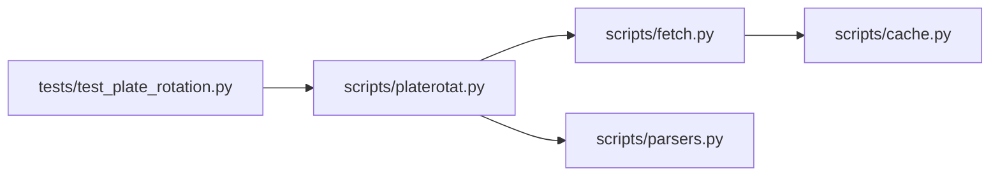

# 集成测试与网络请求

<cite>
**本文引用的文件**
- [fetch.py](file://skills/plate-rotation-skill/scripts/fetch.py)
- [cache.py](file://skills/plate-rotation-skill/scripts/cache.py)
- [parsers.py](file://skills/plate-rotation-skill/scripts/parsers.py)
- [platerotat.py](file://skills/plate-rotation-skill/scripts/platerotat.py)
- [test_plate_rotation.py](file://skills/plate-rotation-skill/tests/test_plate_rotation.py)
- [README.md](file://skills/plate-rotation-skill/README.md)
</cite>

## 目录
1. [简介](#简介)
2. [项目结构](#项目结构)
3. [核心组件](#核心组件)
4. [架构总览](#架构总览)
5. [详细组件分析](#详细组件分析)
6. [依赖关系分析](#依赖关系分析)
7. [性能考量](#性能考量)
8. [故障排查指南](#故障排查指南)
9. [结论](#结论)
10. [附录](#附录)

## 简介
本指南面向开发者，提供一套完整的“在线 API 接口集成测试”实现方案。围绕真实网络请求的封装、超时处理与错误重试机制，结合 fetch.py 脚本的命令行参数、输出格式验证与 JSON 解析策略，系统阐述双源数据（同花顺、开盘啦）对比验证的测试方法；同时给出网络请求模拟的最佳实践（Mock、响应缓存、异常处理），以及性能基准测试的实现思路（响应时间监控、并发请求）。

## 项目结构
该 Skill 采用分层组织：
- 网络调用原子层：scripts/fetch.py，统一 Cookie/Referer/User-Agent、重试、缓存、CLI 入口
- 本地缓存层：scripts/cache.py，基于磁盘的 TTL 缓存
- 解析层：scripts/parsers.py，从 HTML-in-JSON 中抽取结构化数据
- 高级封装层：scripts/platerotat.py，组合底层接口，暴露“一个意图一个函数”的高级 API 与 CLI
- 集成测试：tests/test_plate_rotation.py，覆盖端点健康度、解析正确性、高级 helper、自动路由与 CLI 子命令

图表来源
- [test_plate_rotation.py:1-444](file://skills/plate-rotation-skill/tests/test_plate_rotation.py#L1-L444)
- [platerotat.py:1-315](file://skills/plate-rotation-skill/scripts/platerotat.py#L1-L315)
- [fetch.py:1-230](file://skills/plate-rotation-skill/scripts/fetch.py#L1-L230)
- [cache.py:1-145](file://skills/plate-rotation-skill/scripts/cache.py#L1-L145)
- [parsers.py:1-212](file://skills/plate-rotation-skill/scripts/parsers.py#L1-L212)

章节来源
- [README.md:1-188](file://skills/plate-rotation-skill/README.md#L1-L188)

## 核心组件
- fetch.py：对外提供 CLI 与 main()，负责构建 URL、注入头部、Cookie、GET/POST 参数、指数退避重试、TTL 缓存、原始/美化输出
- cache.py：提供 get/put/clear/stats/disabled 等能力，按 host+path+params 生成稳定 key，支持 PR_CACHE_DISABLE/PR_CACHE_TTL/PR_CACHE_DIR 环境变量控制
- parsers.py：将服务端返回的“HTML 片段嵌在 JSON 的 html 字段里”的数据解析为结构化列表/矩阵/日期序列/龙头统计
- platerotat.py：组合 fetch+parsers，暴露 today_top/find_dragon_kings/top1_curve/plate_strength 四个高级函数，并实现 CLI 四子命令
- test_plate_rotation.py：在线集成测试套件，覆盖端点健康、解析正确性、高级 helper、自动路由与 CLI 行为

章节来源
- [fetch.py:1-230](file://skills/plate-rotation-skill/scripts/fetch.py#L1-L230)
- [cache.py:1-145](file://skills/plate-rotation-skill/scripts/cache.py#L1-L145)
- [parsers.py:1-212](file://skills/plate-rotation-skill/scripts/parsers.py#L1-L212)
- [platerotat.py:1-315](file://skills/plate-rotation-skill/scripts/platerotat.py#L1-L315)
- [test_plate_rotation.py:1-444](file://skills/plate-rotation-skill/tests/test_plate_rotation.py#L1-L444)

## 架构总览
整体流程：测试或上层调用 platerotat 高级函数 → 通过 subprocess 调用 fetch.py → fetch.py 根据 host alias 与 path 构造 URL，携带 UA/Referer/Cookie 等头部，执行带重试的网络请求，命中缓存则直接返回，否则落盘缓存；返回体由 parsers 解析为业务数据结构。

图表来源
- [platerotat.py:55-71](file://skills/plate-rotation-skill/scripts/platerotat.py#L55-L71)
- [fetch.py:128-213](file://skills/plate-rotation-skill/scripts/fetch.py#L128-L213)
- [cache.py:59-94](file://skills/plate-rotation-skill/scripts/cache.py#L59-L94)

## 详细组件分析

### 在线 API 请求封装与重试策略
- 请求头与鉴权：统一注入 UA/Accept-Language/Referer/Origin/X-Requested-With，可选 Cookie（优先读环境变量 PR_COOKIE，其次 ~/.plate_rotation_cookie）
- URL 构建：host alias 映射到 base URL，ext 模式支持完整 URL
- 参数传递：支持 kv 键值对与 -p JSON 两种姿势，GET 拼接查询串，POST 使用 application/x-www-form-urlencoded
- 重试与超时：针对 429/5xx 及网络异常进行指数退避（默认最多 3 次，间隔 1s/2s/4s），可配置 --timeout 与 --max-retries
- 输出：--raw 输出原始字符串，否则尝试 JSON 美化输出

图表来源
- [fetch.py:91-124](file://skills/plate-rotation-skill/scripts/fetch.py#L91-L124)

章节来源
- [fetch.py:38-124](file://skills/plate-rotation-skill/scripts/fetch.py#L38-L124)
- [fetch.py:128-213](file://skills/plate-rotation-skill/scripts/fetch.py#L128-L213)

### fetch.py 脚本的测试方法
- 命令行参数传递：测试通过 subprocess 调用 fetch.py，传入 host/path/kv 或 -p JSON，配合 --raw 获取原始 JSON 便于断言
- 输出格式验证：断言返回码为 0、stdout 为合法 JSON、关键字段存在且类型正确
- JSON 数据解析：在测试侧用 json.loads 解析后，再断言业务字段（如 html、name、date、legend 等）

图表来源
- [test_plate_rotation.py:54-71](file://skills/plate-rotation-skill/tests/test_plate_rotation.py#L54-L71)

章节来源
- [test_plate_rotation.py:48-71](file://skills/plate-rotation-skill/tests/test_plate_rotation.py#L48-L71)

### 双源数据验证（同花顺 vs 开盘啦）
- 数据源差异：ths 数值为涨幅百分比（带 %），kaipan 数值为强度分（纯数字）
- 自动路由：find_dragon_kings 根据板块代码前缀选择 source（88x→ths，80x/803x→kaipan）
- 测试要点：
  - 分别以 from=ths/from=kaipan 拉取主表，校验 value_type/value 格式
  - 验证 parse_plate_rotat_dates 的日期格式与顺序
  - 验证 parse_plate_rotat_matrix 的 cells 与 dates 对齐
  - 验证 rank_plate_long_persistence 的排序与 positions 格式
  - 验证 find_dragon_kings 的自动路由与 daily_heads 非空

图表来源
- [platerotat.py:102-218](file://skills/plate-rotation-skill/scripts/platerotat.py#L102-L218)
- [parsers.py:20-174](file://skills/plate-rotation-skill/scripts/parsers.py#L20-L174)
- [fetch.py:128-213](file://skills/plate-rotation-skill/scripts/fetch.py#L128-L213)
- [cache.py:59-94](file://skills/plate-rotation-skill/scripts/cache.py#L59-L94)

章节来源
- [parsers.py:20-174](file://skills/plate-rotation-skill/scripts/parsers.py#L20-L174)
- [platerotat.py:125-172](file://skills/plate-rotation-skill/scripts/platerotat.py#L125-L172)
- [test_plate_rotation.py:120-244](file://skills/plate-rotation-skill/tests/test_plate_rotation.py#L120-L244)
- [test_plate_rotation.py:304-328](file://skills/plate-rotation-skill/tests/test_plate_rotation.py#L304-L328)

### CLI 子命令测试（text + json 双模）
- 子命令：today/wangking/curve/strength
- 测试方式：subprocess 调用 platerotat.py，断言 returncode=0，并对 text/json 输出做正则/结构断言
- 关键断言：
  - today：value_type 与 value 格式随 source 不同
  - wangking：返回包含 platecode/dates/kings/daily_heads，kings 数量受 top_n 限制
  - curve：包含 top5_names/date/name 等字段
  - strength：包含 date/legend 等 ECharts 字段

图表来源
- [test_plate_rotation.py:330-440](file://skills/plate-rotation-skill/tests/test_plate_rotation.py#L330-L440)
- [platerotat.py:278-310](file://skills/plate-rotation-skill/scripts/platerotat.py#L278-L310)

章节来源
- [test_plate_rotation.py:330-440](file://skills/plate-rotation-skill/tests/test_plate_rotation.py#L330-L440)

### 网络请求模拟最佳实践
- 使用现有缓存作为“离线数据源”：
  - 首次运行测试时启用缓存（默认 POST 走缓存），后续用例复用同一份响应，避免重复打网
  - 通过 PR_CACHE_DISABLE=1 关闭缓存，强制真实网络
- 使用环境变量切换 Cookie：
  - PR_COOKIE 优先于本地 cookie 文件，便于在不同环境注入凭据
- 超时与重试：
  - 通过 --timeout 与 --max-retries 控制，测试中建议设置较短超时与较小重试次数，保证失败快速反馈
- 输出一致性：
  - 使用 --raw 获取原始 JSON，避免美化导致的断言不稳定
- 异常路径：
  - 捕获非零返回码与 stderr，打印上下文以便定位问题

章节来源
- [cache.py:35-44](file://skills/plate-rotation-skill/scripts/cache.py#L35-L44)
- [fetch.py:54-64](file://skills/plate-rotation-skill/scripts/fetch.py#L54-L64)
- [fetch.py:128-143](file://skills/plate-rotation-skill/scripts/fetch.py#L128-L143)
- [test_plate_rotation.py:54-71](file://skills/plate-rotation-skill/tests/test_plate_rotation.py#L54-L71)

### 性能基准测试实现方法
- 响应时间监控：
  - 在测试中记录每个子命令或高级函数的起止时间，计算耗时分布
  - 借助缓存命中率评估优化效果（可通过 cache_stats 查看缓存规模）
- 并发请求测试：
  - 使用多线程或多进程并行触发多个子命令，观察吞吐与稳定性
  - 注意并发下的缓存写入原子性与磁盘 I/O 影响
- 指标建议：
  - P50/P95/P99 响应时间
  - 成功率（returncode=0 的比例）
  - 缓存命中率（通过 cache_stats 前后对比）
  - 重试次数与失败原因分布（stderr 中抓取）

[本节为通用指导，不直接分析具体文件]

## 依赖关系分析
- 模块耦合：
  - platerotat.py 依赖 fetch.py（subprocess）与 parsers.py（解析）
  - fetch.py 依赖 cache.py（缓存）
  - tests 依赖 platerotat.py 与 fetch.py（subprocess）
- 外部依赖：
  - Python 标准库（argparse/json/os/sys/urllib/time/hashlib/pathlib/re/collections）
  - 无第三方包依赖，利于 CI 环境部署

图表来源
- [test_plate_rotation.py:1-444](file://skills/plate-rotation-skill/tests/test_plate_rotation.py#L1-L444)
- [platerotat.py:1-315](file://skills/plate-rotation-skill/scripts/platerotat.py#L1-L315)
- [fetch.py:1-230](file://skills/plate-rotation-skill/scripts/fetch.py#L1-L230)
- [cache.py:1-145](file://skills/plate-rotation-skill/scripts/cache.py#L1-L145)
- [parsers.py:1-212](file://skills/plate-rotation-skill/scripts/parsers.py#L1-L212)

章节来源
- [platerotat.py:34-48](file://skills/plate-rotation-skill/scripts/platerotat.py#L34-L48)
- [fetch.py:31-36](file://skills/plate-rotation-skill/scripts/fetch.py#L31-L36)

## 性能考量
- 缓存策略：
  - 默认 TTL=3600s，适合盘中“今日”数据与历史 N 日数据的节流
  - 支持 PR_CACHE_TTL 调整新鲜度阈值，PR_CACHE_DIR 自定义缓存目录
- 重试与退避：
  - 指数退避降低瞬时拥塞压力，但会增加端到端延迟，需权衡
- 输出格式化：
  - 默认 JSON 美化会引入 CPU 开销，CI 场景建议使用 --raw 减少解析成本
- 并发与 I/O：
  - 并发写缓存使用临时文件+原子替换，避免半写文件，但仍需注意磁盘 I/O 瓶颈

章节来源
- [cache.py:35-37](file://skills/plate-rotation-skill/scripts/cache.py#L35-L37)
- [cache.py:92-94](file://skills/plate-rotation-skill/scripts/cache.py#L92-L94)
- [fetch.py:128-143](file://skills/plate-rotation-skill/scripts/fetch.py#L128-L143)

## 故障排查指南
- 常见错误与定位：
  - 非 JSON 响应：检查 fetch.py 的 --raw 输出与 stderr，确认上游接口返回格式
  - 空数据警告：platerotat 会在 stderr 输出 PR-EMPTY/PR-WARN 提示，结合 _hint_for_empty 判断是否为周末/跨源错传/节假日
  - 缓存问题：使用 cache.py stats/clear 诊断，或通过 PR_CACHE_DISABLE=1 跳过缓存
  - 网络异常：关注 retry 日志与最后错误信息，必要时增大 --timeout 或 --max-retries
- 调试技巧：
  - 使用 fetch.py 的 -v 打印 URL/body/cookie 自检
  - 使用 cache.py clear --older SEC 清理旧缓存，确保测试数据新鲜

章节来源
- [platerotat.py:75-97](file://skills/plate-rotation-skill/scripts/platerotat.py#L75-L97)
- [fetch.py:193-207](file://skills/plate-rotation-skill/scripts/fetch.py#L193-L207)
- [cache.py:132-145](file://skills/plate-rotation-skill/scripts/cache.py#L132-L145)

## 结论
本指南基于仓库中的实际实现，给出了在线 API 集成测试的端到端方法：通过 fetch.py 统一网络调用与重试、cache.py 提供本地缓存、parsers.py 完成 HTML-in-JSON 的结构化解析、platerotat.py 暴露高级 API 与 CLI，并由 test_plate_rotation.py 覆盖端点健康、解析正确性、自动路由与 CLI 行为。在此基础上，结合 Mock/缓存/异常处理与性能基准测试，可构建稳健、可维护、可扩展的集成测试体系。

## 附录
- 运行方式参考：
  - 直接运行测试：python3 tests/test_plate_rotation.py
  - 使用 unittest 运行：python3 -m unittest tests.test_plate_rotation -v
  - 查看缓存状态：python3 scripts/cache.py stats
  - 清理缓存：python3 scripts/cache.py clear [--older SEC]

章节来源
- [test_plate_rotation.py:14-18](file://skills/plate-rotation-skill/tests/test_plate_rotation.py#L14-L18)
- [cache.py:132-145](file://skills/plate-rotation-skill/scripts/cache.py#L132-L145)